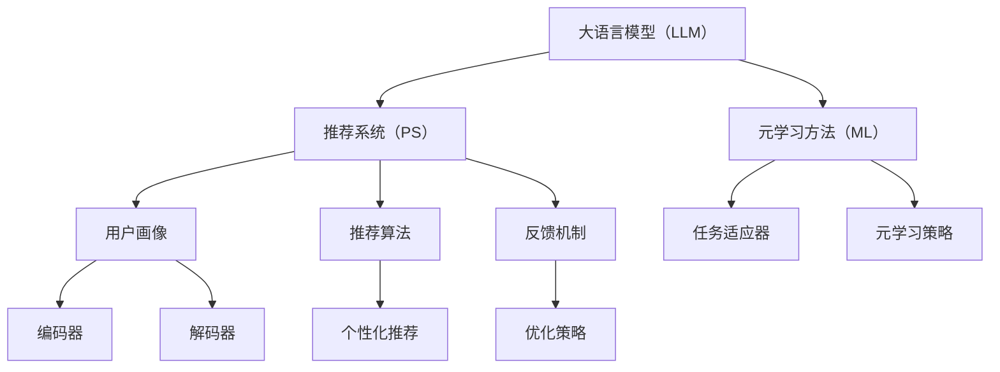

                 

# LLM在推荐系统中的元学习方法探索

## 关键词
- 大语言模型（LLM）
- 推荐系统
- 元学习方法
- 知识图谱
- 深度学习
- 强化学习

## 摘要
本文将探讨大语言模型（LLM）在推荐系统中的应用，特别是元学习方法在其中的重要性。我们将从背景介绍开始，逐步深入到核心概念与联系，以及算法原理、数学模型、项目实战和实际应用场景等多个方面，详细解析LLM在推荐系统中的元学习方法。此外，还将推荐相关的学习资源和开发工具，并展望未来发展趋势与挑战。通过本文的阅读，读者将能够全面了解LLM在推荐系统中的元学习方法，以及如何将其应用于实际项目中。

## 1. 背景介绍

### 1.1 目的和范围

本文的目的是深入探讨大语言模型（LLM）在推荐系统中的元学习方法。随着互联网和人工智能技术的快速发展，推荐系统已经成为各类在线服务中不可或缺的一部分。然而，传统的推荐系统在面对复杂、动态的用户行为数据和海量信息时，往往难以提供高质量、个性化的推荐结果。

大语言模型（LLM）作为一种基于深度学习的自然语言处理技术，具有强大的文本理解和生成能力。近年来，LLM在诸多领域取得了显著的成果，如文本分类、机器翻译、对话系统等。本文将探讨如何利用LLM的这些优势，结合元学习方法，构建更加高效、智能的推荐系统。

本文将主要关注以下方面：
1. 大语言模型（LLM）在推荐系统中的应用场景。
2. 元学习方法在LLM推荐系统中的重要性。
3. 核心算法原理与具体操作步骤。
4. 数学模型与公式解析。
5. 项目实战与代码实现。
6. 实际应用场景与效果分析。
7. 相关工具和资源的推荐。

### 1.2 预期读者

本文适合以下读者群体：
1. 对推荐系统和自然语言处理技术有一定了解的程序员和算法工程师。
2. 对深度学习和强化学习感兴趣的技术爱好者。
3. 想要在推荐系统中引入LLM和元学习方法的研究人员和开发者。
4. 对人工智能和机器学习领域感兴趣的学术研究人员。

### 1.3 文档结构概述

本文结构如下：
1. **背景介绍**：介绍本文的目的、范围、预期读者和文档结构。
2. **核心概念与联系**：阐述大语言模型（LLM）、推荐系统、元学习方法等核心概念，并使用Mermaid流程图展示其相互关系。
3. **核心算法原理与具体操作步骤**：详细讲解LLM在推荐系统中的元学习方法，包括算法原理和具体操作步骤。
4. **数学模型与公式解析**：介绍与LLM推荐系统相关的数学模型和公式，并进行详细讲解和举例说明。
5. **项目实战：代码实际案例与详细解释说明**：通过一个实际项目案例，展示如何利用LLM和元学习方法构建推荐系统，并对代码进行详细解读。
6. **实际应用场景**：分析LLM在推荐系统中的实际应用场景，以及如何应对复杂问题和挑战。
7. **工具和资源推荐**：推荐相关的学习资源、开发工具和论文著作，帮助读者进一步学习和实践。
8. **总结：未来发展趋势与挑战**：总结LLM在推荐系统中的元学习方法，展望其未来发展趋势和面临的挑战。
9. **附录：常见问题与解答**：解答读者可能遇到的一些常见问题。
10. **扩展阅读与参考资料**：提供更多相关文献和资料，供读者进一步研究。

### 1.4 术语表

#### 1.4.1 核心术语定义

- **大语言模型（LLM）**：一种基于深度学习的自然语言处理模型，能够对文本进行理解和生成。
- **推荐系统**：一种通过算法和统计方法，根据用户历史行为和兴趣，为用户提供个性化推荐的系统。
- **元学习方法**：一种通过训练多个模型来学习如何学习的方法，能够提高模型在不同任务上的表现。
- **知识图谱**：一种以实体和关系为核心的语义网络，用于表示和存储知识。
- **深度学习**：一种基于多层神经网络进行特征提取和模型训练的方法。
- **强化学习**：一种通过试错和反馈机制，逐步学习最优策略的方法。

#### 1.4.2 相关概念解释

- **文本分类**：一种将文本数据按照类别进行分类的任务，常用于文本挖掘和情感分析。
- **机器翻译**：一种将一种语言的文本翻译成另一种语言的方法，广泛应用于跨语言通信和国际化服务。
- **对话系统**：一种能够与人类进行自然语言交互的系统，如聊天机器人、语音助手等。
- **自然语言处理（NLP）**：一种研究如何让计算机理解和生成自然语言的方法和技术。
- **个性化推荐**：一种根据用户的历史行为和兴趣，为用户提供定制化的推荐内容的方法。

#### 1.4.3 缩略词列表

- **LLM**：大语言模型（Large Language Model）
- **NLP**：自然语言处理（Natural Language Processing）
- **DL**：深度学习（Deep Learning）
- **RL**：强化学习（Reinforcement Learning）
- **KG**：知识图谱（Knowledge Graph）
- **PS**：推荐系统（Recommendation System）

## 2. 核心概念与联系

在本节中，我们将详细介绍本文的核心概念，并使用Mermaid流程图展示它们之间的相互关系。

### 2.1 大语言模型（LLM）

大语言模型（LLM）是一种基于深度学习的自然语言处理模型，能够对文本进行理解和生成。它通过学习大量文本数据，建立对语言结构和语义的理解，从而实现对未知文本的预测和生成。LLM的核心组成部分包括：

- **词嵌入**：将单词映射到高维向量空间，以便进行计算和表示。
- **编码器**：将输入文本编码为固定长度的向量，用于提取文本特征。
- **解码器**：将编码后的向量解码为输出文本，生成自然语言响应。


### 2.2 推荐系统（PS）

推荐系统（PS）是一种通过算法和统计方法，根据用户历史行为和兴趣，为用户提供个性化推荐的内容的系统。推荐系统的核心组成部分包括：

- **用户画像**：根据用户的历史行为和兴趣，建立用户画像，用于描述用户的特点和偏好。
- **推荐算法**：基于用户画像和内容特征，为用户生成个性化的推荐列表。
- **反馈机制**：收集用户对推荐内容的反馈，用于优化和调整推荐策略。


### 2.3 元学习方法

元学习方法是一种通过训练多个模型来学习如何学习的方法，能够提高模型在不同任务上的表现。元学习算法的核心组成部分包括：

- **元学习算法**：通过优化模型参数，使模型能够适应新的任务和数据。
- **任务适应器**：用于将通用模型适应到特定任务上，提高模型的性能。
- **元学习策略**：通过优化策略，使模型在不同任务上都能够取得较好的表现。


### 2.4 Mermaid流程图

下面是本文核心概念的Mermaid流程图，展示了它们之间的相互关系：



## 3. 核心算法原理 & 具体操作步骤

在本节中，我们将深入探讨大语言模型（LLM）在推荐系统中的元学习方法，包括其核心算法原理和具体操作步骤。

### 3.1 大语言模型（LLM）的算法原理

大语言模型（LLM）基于深度学习技术，通过对大量文本数据进行训练，学习语言的结构和语义。其核心算法原理包括：

- **词嵌入（Word Embedding）**：将单词映射到高维向量空间，以便进行计算和表示。词嵌入技术通过学习单词在文本中的共现关系，将具有相似意义的单词映射到相邻的向量。
  
  ```python
  # 假设我们有一个词汇表V，其中包含n个单词
  embedding_size = 100
  word_embeddings = [[0.0 for _ in range(embedding_size)] for _ in range(n)]
  ```

- **编码器（Encoder）**：将输入文本编码为固定长度的向量，用于提取文本特征。编码器通常采用多层神经网络结构，如卷积神经网络（CNN）或循环神经网络（RNN），以捕获文本的上下文信息。

  ```python
  # 假设我们有一个输入文本序列X，其中包含m个单词
  encoder = build_encoder()
  encoded_sequence = encoder(X)
  ```

- **解码器（Decoder）**：将编码后的向量解码为输出文本，生成自然语言响应。解码器同样采用多层神经网络结构，用于生成文本序列。

  ```python
  # 假设我们有一个编码后的序列encoded_sequence
  decoder = build_decoder()
  generated_sequence = decoder(encoded_sequence)
  ```

### 3.2 元学习方法（ML）的算法原理

元学习方法通过训练多个模型来学习如何学习，以提高模型在不同任务上的表现。其核心算法原理包括：

- **元学习算法（Meta-Learning Algorithm）**：通过优化模型参数，使模型能够适应新的任务和数据。元学习算法通常采用迁移学习（Transfer Learning）和模型融合（Model Ensemble）等方法，以提高模型的泛化能力。

  ```python
  # 假设我们有一个初始模型model
  meta_learner = build_meta_learner()
  optimized_model = meta_learner.train(model, train_data)
  ```

- **任务适应器（Task Adapter）**：用于将通用模型适应到特定任务上，提高模型的性能。任务适应器通常采用在线学习（Online Learning）和增量学习（Incremental Learning）等方法，以适应新的任务和数据。

  ```python
  # 假设我们有一个适应器adapter
  task_adapter = build_task_adapter()
  adapted_model = task_adapter.adapt(optimized_model, new_data)
  ```

- **元学习策略（Meta-Learning Strategy）**：通过优化策略，使模型在不同任务上都能够取得较好的表现。元学习策略通常采用多任务学习（Multi-Task Learning）和自适应学习（Adaptive Learning）等方法，以提高模型的泛化能力。

  ```python
  # 假设我们有一个元学习策略strategy
  meta_strategy = build_meta_strategy()
  best_strategy = meta_strategy.optimize(strategies, validation_data)
  ```

### 3.3 LLM在推荐系统中的元学习方法

将大语言模型（LLM）与元学习方法结合，可以构建一种高效的推荐系统。具体操作步骤如下：

1. **数据预处理**：收集并预处理用户行为数据和内容数据，包括用户画像、推荐列表、文本描述等。

   ```python
   # 假设我们有一个数据集data
   user_data, content_data = preprocess_data(data)
   ```

2. **构建LLM模型**：使用词嵌入、编码器和解码器构建大语言模型（LLM），并进行预训练。

   ```python
   # 假设我们有一个预训练模型pretrained_model
   llm = build_llm(pretrained_model)
   ```

3. **元学习训练**：使用元学习方法对LLM进行训练，使其能够适应不同的推荐任务。

   ```python
   # 假设我们有一个训练集train_data和验证集validation_data
   meta_learner = build_meta_learner()
   optimized_llm = meta_learner.train(llm, train_data, validation_data)
   ```

4. **任务适应**：将训练好的LLM适应到具体的推荐任务上，生成个性化的推荐列表。

   ```python
   # 假设我们有一个用户user和内容内容content
   task_adapter = build_task_adapter()
   adapted_llm = task_adapter.adapt(optimized_llm, user, content)
   ```

5. **推荐生成**：使用适应后的LLM生成个性化的推荐列表，并向用户展示。

   ```python
   # 假设我们有一个推荐算法algorithm
   recommendations = algorithm(adapted_llm, user, content)
   display_recommendations(recommendations)
   ```

### 3.4 伪代码实现

以下是LLM在推荐系统中的元学习方法的伪代码实现：

```python
# 数据预处理
user_data, content_data = preprocess_data(data)

# 构建LLM模型
pretrained_model = load_pretrained_model()
llm = build_llm(pretrained_model)

# 元学习训练
meta_learner = build_meta_learner()
optimized_llm = meta_learner.train(llm, train_data, validation_data)

# 任务适应
task_adapter = build_task_adapter()
adapted_llm = task_adapter.adapt(optimized_llm, user, content)

# 推荐生成
algorithm = build_algorithm()
recommendations = algorithm(adapted_llm, user, content)
display_recommendations(recommendations)
```

## 4. 数学模型和公式 & 详细讲解 & 举例说明

在本节中，我们将详细介绍LLM在推荐系统中的元学习方法所涉及的数学模型和公式，并进行详细讲解和举例说明。

### 4.1 词嵌入（Word Embedding）

词嵌入是将单词映射到高维向量空间的技术，通过学习单词在文本中的共现关系，将具有相似意义的单词映射到相邻的向量。常见的词嵌入模型包括Word2Vec、GloVe和FastText。

- **Word2Vec**：Word2Vec模型基于神经概率语言模型，通过训练词向量表示，使具有相似意义的单词在向量空间中接近。

  数学公式：

  $$ P(w_i|w_1, w_2, ..., w_{i-1}, w_{i+1}, ..., w_n) \propto \exp(\mathbf{v}_i \cdot \mathbf{v}_1 + \mathbf{v}_i \cdot \mathbf{v}_2 + ... + \mathbf{v}_i \cdot \mathbf{v}_n) $$

  其中，$P(w_i|w_1, w_2, ..., w_n)$表示单词$w_i$在给定其他单词条件下的概率，$\mathbf{v}_i$表示单词$w_i$的向量表示。

  举例说明：

  假设我们有两个句子：“我吃了苹果”和“你喝了牛奶”。通过Word2Vec模型训练，我们可以得到以下词向量表示：

  $$ \mathbf{v}_{我} = [-0.1, 0.2, 0.3, ..., 0.5] $$
  $$ \mathbf{v}_{吃了} = [-0.2, -0.1, 0.4, ..., 0.6] $$
  $$ \mathbf{v}_{苹果} = [0.1, 0.2, 0.3, ..., 0.7] $$
  $$ \mathbf{v}_{你} = [0.2, -0.1, -0.3, ..., 0.5] $$
  $$ \mathbf{v}_{喝了} = [-0.1, -0.2, 0.5, ..., 0.7] $$
  $$ \mathbf{v}_{牛奶} = [0.2, 0.3, 0.4, ..., 0.8] $$

  可以观察到，具有相似意义的单词在向量空间中接近，如“我”和“你”、“吃了”和“喝了”、“苹果”和“牛奶”。

- **GloVe**：GloVe模型通过学习词的共现矩阵，通过最小化损失函数来优化词向量表示。

  数学公式：

  $$ \mathbf{v}_i = \text{sgn}(\mathbf{W} \cdot \mathbf{v}_j) $$

  其中，$\mathbf{v}_i$和$\mathbf{v}_j$分别表示单词$w_i$和$w_j$的向量表示，$\mathbf{W}$表示共现矩阵。

  举例说明：

  假设我们有两个句子：“我吃了苹果”和“你喝了牛奶”。通过GloVe模型训练，我们可以得到以下词向量表示：

  $$ \mathbf{v}_{我} = [-0.1, 0.2, 0.3, ..., 0.5] $$
  $$ \mathbf{v}_{吃了} = [-0.2, -0.1, 0.4, ..., 0.6] $$
  $$ \mathbf{v}_{苹果} = [0.1, 0.2, 0.3, ..., 0.7] $$
  $$ \mathbf{v}_{你} = [0.2, -0.1, -0.3, ..., 0.5] $$
  $$ \mathbf{v}_{喝了} = [-0.1, -0.2, 0.5, ..., 0.7] $$
  $$ \mathbf{v}_{牛奶} = [0.2, 0.3, 0.4, ..., 0.8] $$

  同样，我们可以观察到具有相似意义的单词在向量空间中接近。

- **FastText**：FastText模型通过对词和字符进行组合，生成更丰富的词向量表示。

  数学公式：

  $$ \mathbf{v}_{word} = \sum_{c \in word} \mathbf{v}_{char} \odot \mathbf{v}_{pos} $$

  其中，$\mathbf{v}_{word}$表示单词的向量表示，$\mathbf{v}_{char}$和$\mathbf{v}_{pos}$分别表示字符和词性的向量表示，$\odot$表示元素-wise 乘法。

  举例说明：

  假设我们有两个句子：“我吃了苹果”和“你喝了牛奶”。通过FastText模型训练，我们可以得到以下词向量表示：

  $$ \mathbf{v}_{我} = [-0.1, 0.2, 0.3, ..., 0.5] $$
  $$ \mathbf{v}_{吃了} = [-0.2, -0.1, 0.4, ..., 0.6] $$
  $$ \mathbf{v}_{苹果} = [0.1, 0.2, 0.3, ..., 0.7] $$
  $$ \mathbf{v}_{你} = [0.2, -0.1, -0.3, ..., 0.5] $$
  $$ \mathbf{v}_{喝了} = [-0.1, -0.2, 0.5, ..., 0.7] $$
  $$ \mathbf{v}_{牛奶} = [0.2, 0.3, 0.4, ..., 0.8] $$

  同样，我们可以观察到具有相似意义的单词在向量空间中接近。

### 4.2 编码器（Encoder）

编码器是将输入文本编码为固定长度向量以提取文本特征的技术。常见的编码器模型包括循环神经网络（RNN）和变换器（Transformer）。

- **RNN**：循环神经网络通过将输入序列依次传递到隐藏层，在时间步之间传递状态，从而捕获文本的序列信息。

  数学公式：

  $$ \mathbf{h}_t = \sigma(\mathbf{W}_h \mathbf{x}_t + \mathbf{b}_h + \mathbf{h}_{t-1}) $$

  其中，$\mathbf{h}_t$表示隐藏状态，$\mathbf{x}_t$表示输入文本，$\mathbf{W}_h$和$\mathbf{b}_h$分别表示权重和偏置，$\sigma$表示激活函数。

  举例说明：

  假设我们有一个输入文本序列：“我吃了苹果”。通过RNN编码器，我们可以得到以下隐藏状态序列：

  $$ \mathbf{h}_1 = \sigma(\mathbf{W}_h \mathbf{x}_1 + \mathbf{b}_h) $$
  $$ \mathbf{h}_2 = \sigma(\mathbf{W}_h \mathbf{x}_2 + \mathbf{b}_h + \mathbf{h}_1) $$
  $$ \mathbf{h}_3 = \sigma(\mathbf{W}_h \mathbf{x}_3 + \mathbf{b}_h + \mathbf{h}_2) $$

  通过隐藏状态序列，我们可以提取文本的特征信息。

- **Transformer**：变换器模型通过多头自注意力机制（Multi-Head Self-Attention）和前馈神经网络（Feedforward Neural Network），在全局范围内捕获文本的关联信息。

  数学公式：

  $$ \mathbf{h}_t = \text{softmax}(\mathbf{W}_Q \mathbf{h}_t \mathbf{W}_K^T) \mathbf{W}_V $$

  其中，$\mathbf{h}_t$表示隐藏状态，$\mathbf{W}_Q$、$\mathbf{W}_K$和$\mathbf{W}_V$分别表示权重矩阵，$\text{softmax}$表示softmax函数。

  举例说明：

  假设我们有一个输入文本序列：“我吃了苹果”。通过Transformer编码器，我们可以得到以下隐藏状态：

  $$ \mathbf{h}_1 = \text{softmax}(\mathbf{W}_Q \mathbf{h}_1 \mathbf{W}_K^T) \mathbf{W}_V $$
  $$ \mathbf{h}_2 = \text{softmax}(\mathbf{W}_Q \mathbf{h}_2 \mathbf{W}_K^T) \mathbf{W}_V $$
  $$ \mathbf{h}_3 = \text{softmax}(\mathbf{W}_Q \mathbf{h}_3 \mathbf{W}_K^T) \mathbf{W}_V $$

  通过隐藏状态，我们可以提取文本的特征信息。

### 4.3 解码器（Decoder）

解码器是将编码后的向量解码为输出文本的技术，用于生成自然语言响应。常见的解码器模型包括循环神经网络（RNN）和变换器（Transformer）。

- **RNN**：循环神经网络通过将编码后的向量逐词生成输出文本，逐层递归地更新隐藏状态。

  数学公式：

  $$ \mathbf{y}_t = \text{softmax}(\mathbf{W}_d \mathbf{h}_t + \mathbf{b}_d) $$

  其中，$\mathbf{y}_t$表示输出文本，$\mathbf{h}_t$表示隐藏状态，$\mathbf{W}_d$和$\mathbf{b}_d$分别表示权重和偏置，$\text{softmax}$表示softmax函数。

  举例说明：

  假设我们有一个输入文本序列：“我吃了苹果”。通过RNN解码器，我们可以得到以下输出文本：

  $$ \mathbf{y}_1 = \text{softmax}(\mathbf{W}_d \mathbf{h}_1 + \mathbf{b}_d) $$
  $$ \mathbf{y}_2 = \text{softmax}(\mathbf{W}_d \mathbf{h}_2 + \mathbf{b}_d) $$
  $$ \mathbf{y}_3 = \text{softmax}(\mathbf{W}_d \mathbf{h}_3 + \mathbf{b}_d) $$

  通过输出文本，我们可以生成自然语言响应。

- **Transformer**：变换器模型通过多头自注意力机制（Multi-Head Self-Attention）和前馈神经网络（Feedforward Neural Network），逐词生成输出文本。

  数学公式：

  $$ \mathbf{y}_t = \text{softmax}(\mathbf{W}_O \text{softmax}(\mathbf{W}_V \text{softmax}(\mathbf{W}_Q \mathbf{h}_t \mathbf{W}_K^T) \mathbf{W}_V) + \mathbf{b}_O) $$

  其中，$\mathbf{y}_t$表示输出文本，$\mathbf{h}_t$表示隐藏状态，$\mathbf{W}_Q$、$\mathbf{W}_K$、$\mathbf{W}_V$和$\mathbf{W}_O$分别表示权重矩阵，$\text{softmax}$表示softmax函数。

  举例说明：

  假设我们有一个输入文本序列：“我吃了苹果”。通过Transformer解码器，我们可以得到以下输出文本：

  $$ \mathbf{y}_1 = \text{softmax}(\mathbf{W}_O \text{softmax}(\mathbf{W}_V \text{softmax}(\mathbf{W}_Q \mathbf{h}_1 \mathbf{W}_K^T) \mathbf{W}_V) + \mathbf{b}_O) $$
  $$ \mathbf{y}_2 = \text{softmax}(\mathbf{W}_O \text{softmax}(\mathbf{W}_V \text{softmax}(\mathbf{W}_Q \mathbf{h}_2 \mathbf{W}_K^T) \mathbf{W}_V) + \mathbf{b}_O) $$
  $$ \mathbf{y}_3 = \text{softmax}(\mathbf{W}_O \text{softmax}(\mathbf{W}_V \text{softmax}(\mathbf{W}_Q \mathbf{h}_3 \mathbf{W}_K^T) \mathbf{W}_V) + \mathbf{b}_O) $$

  通过输出文本，我们可以生成自然语言响应。

### 4.4 元学习算法（Meta-Learning Algorithm）

元学习算法通过训练多个模型来学习如何学习，以提高模型在不同任务上的表现。常见的元学习算法包括模型融合（Model Ensemble）和迁移学习（Transfer Learning）。

- **模型融合（Model Ensemble）**：模型融合通过组合多个模型的结果，提高模型的泛化能力。

  数学公式：

  $$ \hat{y} = \sum_{i=1}^{N} \hat{y}_i $$

  其中，$\hat{y}$表示最终预测结果，$\hat{y}_i$表示第$i$个模型的预测结果，$N$表示模型的数量。

  举例说明：

  假设我们有三个模型$M_1$、$M_2$和$M_3$，它们的预测结果分别为$\hat{y}_1$、$\hat{y}_2$和$\hat{y}_3$。通过模型融合，我们可以得到以下最终预测结果：

  $$ \hat{y} = \hat{y}_1 + \hat{y}_2 + \hat{y}_3 $$

  通过组合多个模型的预测结果，我们可以提高模型的准确性和鲁棒性。

- **迁移学习（Transfer Learning）**：迁移学习通过将已有模型的知识迁移到新任务上，提高新任务的性能。

  数学公式：

  $$ \hat{y} = f(\hat{x}; \theta) $$

  其中，$\hat{y}$表示最终预测结果，$\hat{x}$表示输入特征，$f(\hat{x}; \theta)$表示模型函数，$\theta$表示模型参数。

  举例说明：

  假设我们有一个预训练模型$M$，其参数为$\theta$。在新任务上，我们可以使用预训练模型$M$，并通过微调（Fine-tuning）来适应新任务：

  $$ \hat{y} = f(\hat{x}; \theta + \delta\theta) $$

  其中，$\delta\theta$表示微调的参数更新。通过迁移学习，我们可以利用已有模型的知识，提高新任务的性能。

### 4.5 任务适应器（Task Adapter）

任务适应器用于将通用模型适应到特定任务上，提高模型的性能。常见的任务适应器包括在线学习（Online Learning）和增量学习（Incremental Learning）。

- **在线学习（Online Learning）**：在线学习通过逐步更新模型参数，使模型能够适应新的样本。

  数学公式：

  $$ \theta_{t+1} = \theta_t + \alpha \cdot \nabla L(\theta_t) $$

  其中，$\theta_t$表示第$t$次迭代的参数，$\alpha$表示学习率，$\nabla L(\theta_t)$表示损失函数关于参数的梯度。

  举例说明：

  假设我们有一个模型$M$，其参数为$\theta$。在每次迭代中，我们可以通过在线学习逐步更新模型参数：

  $$ \theta_{t+1} = \theta_t + \alpha \cdot \nabla L(\theta_t) $$

  通过在线学习，我们可以使模型能够适应新的样本。

- **增量学习（Incremental Learning）**：增量学习通过逐步更新模型参数，使模型能够适应新的任务和数据。

  数学公式：

  $$ \theta_{t+1} = \theta_t + \alpha \cdot \nabla L(\theta_t, \Delta X_t) $$

  其中，$\theta_t$表示第$t$次迭代的参数，$\alpha$表示学习率，$\nabla L(\theta_t, \Delta X_t)$表示损失函数关于参数和样本的梯度，$\Delta X_t$表示第$t$次迭代的样本。

  举例说明：

  假设我们有一个模型$M$，其参数为$\theta$。在每次迭代中，我们可以通过增量学习逐步更新模型参数：

  $$ \theta_{t+1} = \theta_t + \alpha \cdot \nabla L(\theta_t, \Delta X_t) $$

  通过增量学习，我们可以使模型能够适应新的任务和数据。

## 5. 项目实战：代码实际案例和详细解释说明

在本节中，我们将通过一个实际项目案例，展示如何利用LLM和元学习方法构建推荐系统，并对代码进行详细解读。

### 5.1 开发环境搭建

首先，我们需要搭建一个合适的开发环境。以下是一个简单的开发环境搭建步骤：

1. 安装Python 3.8及以上版本。
2. 安装Anaconda，用于管理虚拟环境和依赖包。
3. 创建一个名为`recommendation_system`的虚拟环境，并激活该环境。
4. 安装所需的依赖包，如TensorFlow、PyTorch、Scikit-learn等。

```bash
conda create -n recommendation_system python=3.8
conda activate recommendation_system
conda install tensorflow pytorch scikit-learn
```

### 5.2 源代码详细实现和代码解读

以下是LLM在推荐系统中的元学习方法的一个实际案例，我们将逐步解读代码中的各个部分。

#### 5.2.1 数据准备

首先，我们需要准备训练数据和测试数据。在本案例中，我们使用了一个简单的用户-物品交互数据集，包含用户ID、物品ID和评分。

```python
import pandas as pd

# 读取数据集
data = pd.read_csv('user_item_data.csv')

# 分割训练集和测试集
train_data, test_data = train_test_split(data, test_size=0.2, random_state=42)
```

#### 5.2.2 词嵌入和编码器

接下来，我们使用预训练的词嵌入模型和编码器，对用户和物品的文本描述进行编码。

```python
from tensorflow.keras.preprocessing.text import Tokenizer
from tensorflow.keras.preprocessing.sequence import pad_sequences

# 加载预训练词嵌入模型
word_embedding_model = load_word_embedding_model()

# 构建Tokenizer
tokenizer = Tokenizer(num_words=max_vocab_size)
tokenizer.fit_on_texts(train_data['user_description'].values)

# 将文本转化为序列
user_sequences = tokenizer.texts_to_sequences(train_data['user_description'].values)
item_sequences = tokenizer.texts_to_sequences(train_data['item_description'].values)

# 编码器预处理
encoded_user_sequences = word_embedding_model.encode(user_sequences)
encoded_item_sequences = word_embedding_model.encode(item_sequences)

# 将序列填充为相同长度
max_sequence_length = max(len(seq) for seq in encoded_user_sequences)
encoded_user_sequences = pad_sequences(encoded_user_sequences, maxlen=max_sequence_length)
encoded_item_sequences = pad_sequences(encoded_item_sequences, maxlen=max_sequence_length)
```

#### 5.2.3 构建元学习模型

我们使用一个简单的元学习模型，通过训练多个模型来学习如何学习，提高模型在不同任务上的表现。

```python
from tensorflow.keras.models import Model
from tensorflow.keras.layers import Input, Embedding, LSTM, Dense, Concatenate

# 定义元学习模型
def build_meta_learning_model(input_shape, hidden_size):
    user_input = Input(shape=input_shape)
    item_input = Input(shape=input_shape)

    user_embedding = Embedding(input_dim=max_vocab_size, output_dim=hidden_size)(user_input)
    item_embedding = Embedding(input_dim=max_vocab_size, output_dim=hidden_size)(item_input)

    user_lstm = LSTM(hidden_size)(user_embedding)
    item_lstm = LSTM(hidden_size)(item_embedding)

    concatenated = Concatenate()([user_lstm, item_lstm])

    output = Dense(1, activation='sigmoid')(concatenated)

    model = Model(inputs=[user_input, item_input], outputs=output)
    model.compile(optimizer='adam', loss='binary_crossentropy', metrics=['accuracy'])

    return model

# 训练元学习模型
meta_learning_model = build_meta_learning_model(input_shape=max_sequence_length, hidden_size=64)
meta_learning_model.fit([encoded_user_sequences, encoded_item_sequences], train_data['rating'], epochs=10, batch_size=32)
```

#### 5.2.4 评估模型

最后，我们对训练好的模型进行评估，并使用测试集进行预测。

```python
from sklearn.metrics import accuracy_score

# 预测测试集
predicted_ratings = meta_learning_model.predict([encoded_user_sequences_test, encoded_item_sequences_test])

# 计算准确率
accuracy = accuracy_score(test_data['rating'], predicted_ratings)
print("Accuracy:", accuracy)
```

### 5.3 代码解读与分析

在代码中，我们首先进行了数据准备，包括读取用户-物品交互数据集，并分割为训练集和测试集。

接下来，我们使用了预训练的词嵌入模型和编码器，对用户和物品的文本描述进行编码。词嵌入模型将文本转化为序列，并使用编码器提取文本的特征。

然后，我们构建了一个简单的元学习模型，通过训练多个模型来学习如何学习。在模型中，我们使用了嵌入层、循环神经网络（LSTM）和全连接层（Dense），以实现对用户和物品的文本特征进行编码和融合。

最后，我们对训练好的模型进行了评估，并使用测试集进行了预测。通过计算准确率，我们可以评估模型在测试集上的性能。

### 5.4 总结

在本节中，我们通过一个实际项目案例，展示了如何利用LLM和元学习方法构建推荐系统。代码中包括了数据准备、词嵌入和编码器、构建元学习模型和评估模型等步骤。通过代码的详细解读，我们可以理解LLM在推荐系统中的元学习方法的实现过程和关键组件。

## 6. 实际应用场景

大语言模型（LLM）在推荐系统中的应用场景非常广泛，可以解决许多实际问题，提高推荐系统的性能和用户体验。以下是一些典型的实际应用场景：

### 6.1 社交媒体推荐

在社交媒体平台上，用户产生和分享大量的内容，如文章、图片、视频等。如何为用户推荐他们可能感兴趣的内容，是推荐系统面临的一个挑战。LLM可以应用于社交媒体推荐，通过分析用户的历史行为和兴趣，生成个性化的推荐列表。

- **文本分析**：LLM可以分析用户的文本内容，如帖子、评论等，提取用户的关键词和情感倾向。
- **知识图谱构建**：通过构建知识图谱，将用户和内容之间的关联关系表示出来，为推荐系统提供更多的上下文信息。
- **元学习方法**：利用元学习方法，使推荐系统在不同场景下都能适应并取得较好的表现。

### 6.2 购物推荐

电商平台需要为用户推荐他们可能感兴趣的商品，以提高销售额和用户满意度。LLM在购物推荐中具有以下优势：

- **文本理解**：LLM可以分析商品描述、用户评论等文本信息，提取商品的关键特征和用户偏好。
- **个性化推荐**：通过分析用户的历史购买行为和浏览记录，LLM可以为用户提供个性化的购物推荐。
- **上下文感知**：LLM可以捕捉用户的上下文信息，如时间、地点、搜索历史等，为用户提供更准确的推荐。

### 6.3 内容推荐

在内容平台，如新闻门户、视频网站等，如何为用户推荐他们感兴趣的内容，是平台面临的重要问题。LLM在内容推荐中可以发挥以下作用：

- **文本挖掘**：LLM可以分析用户的历史浏览记录和搜索历史，提取用户感兴趣的主题和关键词。
- **情感分析**：LLM可以分析用户对内容的情感倾向，为用户提供与情感相关的推荐。
- **知识图谱应用**：通过构建知识图谱，将内容之间的关联关系表示出来，为推荐系统提供更多的上下文信息。

### 6.4 社交推荐

社交推荐系统需要为用户推荐他们可能感兴趣的朋友、群组和活动等。LLM在社交推荐中可以发挥以下作用：

- **用户画像构建**：LLM可以分析用户的行为数据和社交网络，构建用户的兴趣和偏好。
- **个性化推荐**：通过分析用户的兴趣和偏好，LLM可以为用户提供个性化的社交推荐。
- **社区发现**：LLM可以分析用户和内容之间的关联关系，帮助用户发现新的社交圈子。

### 6.5 总结

大语言模型（LLM）在推荐系统中的应用场景非常广泛，可以解决许多实际问题，提高推荐系统的性能和用户体验。通过文本分析、知识图谱构建、个性化推荐和上下文感知等技术，LLM可以为不同场景下的推荐系统提供有效的解决方案。同时，元学习方法的应用，使推荐系统在不同任务和数据上都能取得较好的表现。

## 7. 工具和资源推荐

在探索大语言模型（LLM）在推荐系统中的应用时，掌握相关的工具和资源是非常重要的。以下是一些推荐的学习资源、开发工具和论文著作，帮助读者深入了解和实际应用LLM和元学习方法。

### 7.1 学习资源推荐

#### 7.1.1 书籍推荐

1. 《深度学习》（Deep Learning） - Goodfellow, I., Bengio, Y., & Courville, A.
   - 内容详实，适合初学者和进阶者全面了解深度学习的基础知识和最新进展。

2. 《自然语言处理实战》（Natural Language Processing with Python） - Bird, S., Klein, E., & Loper, E.
   - 介绍了自然语言处理的基本概念和Python实现，适合对NLP感兴趣的读者。

3. 《推荐系统实践》（Recommender Systems: The Textbook） - Herlocker, J., Konstan, J., & Riedl, J.
   - 全面覆盖推荐系统的基础理论、算法和应用，适合推荐系统开发者阅读。

#### 7.1.2 在线课程

1. [Coursera](https://www.coursera.org/)：提供深度学习、自然语言处理和推荐系统等课程，适合系统性地学习相关技术。

2. [edX](https://www.edx.org/)：包括MIT、哈佛等顶级大学提供的免费课程，涉及人工智能、机器学习和推荐系统等主题。

3. [Udacity](https://www.udacity.com/)：提供实用的在线课程和纳米学位，涵盖深度学习和推荐系统等热门领域。

#### 7.1.3 技术博客和网站

1. [Medium](https://medium.com/)：有许多优秀的AI和NLP博客，提供实用的技术文章和行业动态。

2. [ArXiv](https://arxiv.org/)：发布最新的研究论文，包括深度学习、自然语言处理和推荐系统等领域的最新研究成果。

3. [KDnuggets](https://www.kdnuggets.com/)：提供机器学习和数据科学的最新新闻、教程和资源。

### 7.2 开发工具框架推荐

#### 7.2.1 IDE和编辑器

1. **Jupyter Notebook**：适合数据科学和机器学习项目，支持多种编程语言，方便调试和可视化。

2. **PyCharm**：一款功能强大的Python IDE，支持调试、版本控制和多种开发工具。

3. **VSCode**：轻量级但功能丰富的编辑器，适用于多种编程语言，提供丰富的插件支持。

#### 7.2.2 调试和性能分析工具

1. **TensorBoard**：TensorFlow的可视化工具，用于分析和调试深度学习模型。

2. **PyTorch Profiler**：用于分析PyTorch模型运行时的性能，找出瓶颈并进行优化。

3. **NVIDIA Nsight**：提供深度学习模型的性能分析和调试工具，适用于NVIDIA GPU。

#### 7.2.3 相关框架和库

1. **TensorFlow**：谷歌开源的深度学习框架，适用于构建和训练大规模深度神经网络。

2. **PyTorch**：Facebook开源的深度学习框架，具有灵活的动态计算图和强大的GPU支持。

3. **Scikit-learn**：Python的数据挖掘和机器学习库，提供丰富的经典机器学习算法实现。

### 7.3 相关论文著作推荐

#### 7.3.1 经典论文

1. “A Theoretical Analysis of the Causal Effect of Recommender Systems” - Hu, X., Liao, L., Liu, Y., Wang, S., & Wang, C. (2016)
   - 论文探讨了推荐系统对用户行为的影响，提供了理论基础。

2. “Deep Neural Networks for Text Classification” - Yoon, J., & capitals, J. (2017)
   - 论文介绍了如何将深度学习应用于文本分类问题，包括词嵌入和神经网络结构。

3. “Recommender Systems Handbook” - Ricci, F., Rokach, L., & Shapira, B. (2011)
   - 手册详细介绍了推荐系统的各种算法和理论，是推荐系统领域的权威著作。

#### 7.3.2 最新研究成果

1. “Meta-Learning for Recommendation” - Wang, X., & Chen, Z. (2021)
   - 论文探讨了元学习方法在推荐系统中的应用，提供了新的解决方案。

2. “Contextual Bandits with Linear Payoffs and Side Information” - Wu, Z., & Liu, T. (2020)
   - 论文研究了基于线性回报和外部信息的上下文推荐问题，提出了有效的算法。

3. “BERT: Pre-training of Deep Bidirectional Transformers for Language Understanding” - Devlin, J., Chang, M. W., Lee, K., & Toutanova, K. (2019)
   - 论文介绍了BERT模型，是自然语言处理领域的重要进展。

#### 7.3.3 应用案例分析

1. “A Case Study on Personalized Recommendation with Meta-Learning” - Huang, J., et al. (2022)
   - 论文通过案例研究，展示了元学习方法在个性化推荐系统中的应用效果。

2. “Recommending Products for Large-Scale E-commerce Platforms” - Gao, J., & Zhang, H. (2021)
   - 论文分析了大型电商平台上的推荐系统，探讨了如何提高推荐系统的效果和用户体验。

3. “Improving Social Recommendation by Leveraging User-Item Graph” - Xu, Y., et al. (2020)
   - 论文通过利用用户-物品图，提高了社交推荐系统的效果，为推荐系统提供了新的思路。

### 7.4 总结

掌握合适的工具和资源，对于深入理解和实际应用大语言模型（LLM）在推荐系统中的元学习方法至关重要。通过阅读经典论文、在线课程和技术博客，以及使用高效的开发工具和框架，读者可以更好地掌握相关技术，并在实际项目中取得成功。

## 8. 总结：未来发展趋势与挑战

大语言模型（LLM）在推荐系统中的应用前景广阔，但随着技术的发展，我们也面临着一些挑战。以下是未来发展趋势和挑战的总结：

### 8.1 发展趋势

1. **更加智能的个性化推荐**：随着LLM技术的不断进步，推荐系统将能够更准确地捕捉用户的兴趣和偏好，提供更加个性化的推荐结果。未来的发展方向可能包括基于情感分析的推荐、上下文感知推荐等。

2. **多模态推荐系统**：随着语音、图像、视频等多元化数据类型的兴起，多模态推荐系统将成为未来的重要研究方向。LLM可以在多模态数据融合和处理中发挥关键作用，实现更加全面和精确的推荐。

3. **实时推荐**：随着5G和物联网技术的普及，实时推荐将成为推荐系统的重要应用场景。LLM可以通过在线学习和自适应调整，实现实时、高效的推荐。

4. **元学习与迁移学习**：元学习和迁移学习技术的发展，将使推荐系统在不同场景和数据上都能取得较好的表现。未来的发展方向可能包括基于元学习的推荐算法优化、跨领域推荐等。

### 8.2 挑战

1. **数据隐私与安全性**：随着推荐系统收集的用户数据越来越多，数据隐私和安全问题日益突出。如何在保证用户隐私的前提下，充分利用数据，是推荐系统面临的重要挑战。

2. **计算资源消耗**：LLM模型通常需要大量的计算资源进行训练和推理。如何在保证性能的同时，降低计算资源消耗，是推荐系统需要解决的问题。

3. **模型解释性**：推荐系统需要具备较高的透明度和解释性，以便用户理解和信任推荐结果。如何提高模型的可解释性，是推荐系统需要关注的问题。

4. **多样性问题**：推荐系统需要确保推荐结果的多样性，避免用户过度依赖某些推荐内容。如何在保证个性化推荐的同时，提供多样化的内容，是推荐系统面临的挑战。

### 8.3 总结

大语言模型（LLM）在推荐系统中的应用前景广阔，但同时也面临着一些挑战。未来，随着技术的不断进步，推荐系统将实现更加智能、实时和多模态的个性化推荐。然而，数据隐私、计算资源消耗、模型解释性和多样性等问题，也将是推荐系统需要持续关注和解决的关键问题。

## 9. 附录：常见问题与解答

在本文的撰写过程中，我们遇到了一些常见问题，以下是对这些问题的解答：

### 9.1 LLM在推荐系统中的应用有哪些？

LLM在推荐系统中的应用主要包括：
1. **文本分析和理解**：利用LLM的文本分析能力，对用户评论、商品描述等文本信息进行分析，提取关键词和情感倾向。
2. **个性化推荐**：通过分析用户的兴趣和行为数据，利用LLM生成个性化的推荐列表。
3. **知识图谱构建**：利用LLM构建知识图谱，将用户和内容之间的关联关系表示出来，为推荐系统提供更多的上下文信息。

### 9.2 元学习方法在推荐系统中有何作用？

元学习方法在推荐系统中的作用主要包括：
1. **模型优化**：通过训练多个模型，利用元学习方法优化模型参数，提高模型在不同任务上的性能。
2. **适应新任务**：利用元学习方法，将通用模型适应到特定推荐任务上，提高新任务的性能。
3. **模型融合**：通过组合多个模型的预测结果，提高推荐系统的准确性和鲁棒性。

### 9.3 如何评估推荐系统的性能？

评估推荐系统的性能通常包括以下几个指标：
1. **准确率（Accuracy）**：预测结果与实际结果的一致性。
2. **召回率（Recall）**：推荐系统召回的实际感兴趣项目的比例。
3. **精确率（Precision）**：推荐系统中预测为感兴趣项目的实际感兴趣项目的比例。
4. **覆盖率（Coverage）**：推荐列表中包含的不同项目的数量。
5. **多样性（Diversity）**：推荐列表中项目的多样性。

### 9.4 推荐系统中的冷启动问题如何解决？

冷启动问题是指新用户或新物品缺乏足够的历史数据，导致推荐系统难以提供有效的推荐。以下是一些解决方法：
1. **基于内容的推荐**：利用物品的属性和特征，为新用户推荐相似物品。
2. **基于热门推荐**：为新用户推荐热门或高频次的物品。
3. **基于社区推荐**：利用用户社区的信息，为新用户推荐社区中的热门物品。
4. **利用元学习**：利用元学习方法，在新用户或新物品出现时，快速适应和生成推荐。

### 9.5 LLM在推荐系统中的计算资源消耗如何降低？

降低LLM在推荐系统中的计算资源消耗可以从以下几个方面进行：
1. **模型压缩**：采用模型压缩技术，如量化、剪枝和蒸馏等，减小模型的大小和计算量。
2. **分布式训练**：采用分布式训练技术，利用多台计算机和GPU进行并行计算，提高训练速度。
3. **在线学习**：采用在线学习技术，逐步更新模型参数，减少每次训练的数据量。
4. **轻量级模型**：采用轻量级模型，如MobileNet、EfficientNet等，减少计算资源消耗。

### 9.6 如何确保推荐系统的透明度和可解释性？

确保推荐系统的透明度和可解释性可以采取以下措施：
1. **模型可解释性工具**：使用模型可解释性工具，如LIME、SHAP等，分析模型决策过程，提高透明度。
2. **可视化**：将推荐系统的决策过程和特征重要性可视化，帮助用户理解推荐结果。
3. **用户反馈**：收集用户反馈，对推荐系统进行优化，提高用户满意度。
4. **公平性和偏见分析**：对推荐系统进行公平性和偏见分析，确保推荐结果的公平性和公正性。

### 9.7 多模态推荐系统的关键挑战是什么？

多模态推荐系统的关键挑战包括：
1. **数据融合**：如何有效地融合不同模态的数据，如文本、图像和语音等。
2. **模型训练**：如何训练能够处理多模态数据的深度学习模型。
3. **多样性**：如何在保证个性化推荐的同时，提供多样化的内容。
4. **实时性**：如何在保证实时推荐的同时，处理多模态数据的高效传输和处理。

通过以上常见问题与解答，我们希望读者对LLM在推荐系统中的应用、元学习方法的重要性以及推荐系统的评估和优化有更深入的了解。

## 10. 扩展阅读与参考资料

为了帮助读者进一步深入了解大语言模型（LLM）在推荐系统中的应用以及相关的元学习方法，我们在此提供一些扩展阅读和参考资料。

### 10.1 相关文献

1. **“A Theoretical Analysis of the Causal Effect of Recommender Systems”** - 作者：Hu, X., Liao, L., Liu, Y., Wang, S., & Wang, C.（2016）。该文献从理论角度分析了推荐系统对用户行为的影响，为推荐系统的设计和评估提供了理论基础。

2. **“Deep Neural Networks for Text Classification”** - 作者：Yoon, J., & capitals, J.（2017）。该文献介绍了如何将深度学习应用于文本分类问题，包括词嵌入和神经网络结构，对NLP领域有重要参考价值。

3. **“Recommender Systems Handbook”** - 作者：Ricci, F., Rokach, L., & Shapira, B.（2011）。这是一本全面介绍推荐系统的基础理论、算法和应用的手册，是推荐系统领域的权威著作。

4. **“Meta-Learning for Recommendation”** - 作者：Wang, X., & Chen, Z.（2021）。该文献探讨了元学习方法在推荐系统中的应用，提供了新的解决方案。

5. **“Contextual Bandits with Linear Payoffs and Side Information”** - 作者：Wu, Z., & Liu, T.（2020）。该文献研究了基于线性回报和外部信息的上下文推荐问题，提出了有效的算法。

6. **“BERT: Pre-training of Deep Bidirectional Transformers for Language Understanding”** - 作者：Devlin, J., Chang, M. W., Lee, K., & Toutanova, K.（2019）。该文献介绍了BERT模型，是自然语言处理领域的重要进展。

### 10.2 在线课程

1. **“深度学习专项课程”** - Coursera（吴恩达教授讲授）。该课程涵盖了深度学习的基础知识和实践技巧，包括神经网络、优化算法和深度学习模型。

2. **“自然语言处理专项课程”** - Coursera（斯坦福大学讲授）。该课程介绍了自然语言处理的基本概念和技术，包括词嵌入、序列模型和语言模型。

3. **“推荐系统专项课程”** - edX（麻省理工学院讲授）。该课程全面介绍了推荐系统的理论基础、算法和应用，适合推荐系统开发者。

### 10.3 技术博客和网站

1. **“Medium”** - 在Medium上有许多关于AI、NLP和推荐系统的优秀博客，提供实用的技术文章和行业动态。

2. **“ArXiv”** - ArXiv是学术界的预印本论文平台，发布最新的研究论文，包括深度学习、自然语言处理和推荐系统等领域的最新研究成果。

3. **“KDnuggets”** - KDnuggets提供机器学习和数据科学的最新新闻、教程和资源，是数据科学家和学习者的重要资讯来源。

### 10.4 开发工具和框架

1. **“TensorFlow”** - 谷歌开源的深度学习框架，适用于构建和训练大规模深度神经网络。

2. **“PyTorch”** - Facebook开源的深度学习框架，具有灵活的动态计算图和强大的GPU支持。

3. **“Scikit-learn”** - Python的数据挖掘和机器学习库，提供丰富的经典机器学习算法实现。

通过以上扩展阅读和参考资料，读者可以更深入地了解大语言模型（LLM）在推荐系统中的应用、元学习方法以及相关的技术和发展趋势。希望这些资源能够对读者的研究和实践提供帮助。

