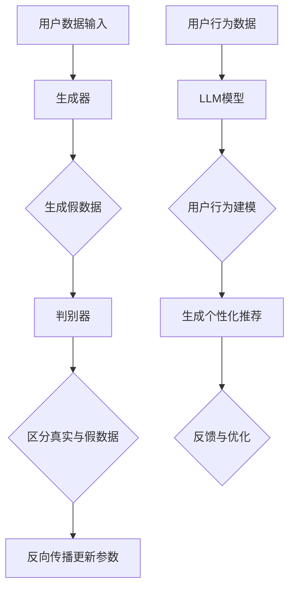

                 

# LLM在推荐系统中的对抗学习应用

> **关键词：** 生成对抗网络（GAN）、推荐系统、自监督学习、大规模语言模型（LLM）、对抗学习、数据增强

> **摘要：** 本文将探讨生成对抗网络（GAN）与大规模语言模型（LLM）在推荐系统中的结合应用，特别是对抗学习在自监督数据增强中的具体实现。通过深入分析GAN的基本原理、LLM的应用场景以及对抗学习策略，我们将揭示如何利用这些先进技术提升推荐系统的效果和鲁棒性。

## 1. 背景介绍

### 1.1 目的和范围

本文旨在探索生成对抗网络（GAN）和大规模语言模型（LLM）在推荐系统中的应用，重点关注对抗学习在自监督数据增强中的关键作用。随着互联网和大数据的迅猛发展，推荐系统已经成为现代信息检索、社交媒体和电子商务等领域不可或缺的一部分。然而，传统推荐系统面临数据稀疏、冷启动问题和用户隐私保护等挑战。生成对抗网络（GAN）作为一种强大的生成模型，能够在不完全依赖标注数据的情况下生成高质量的数据样本，从而缓解数据不足的问题。大规模语言模型（LLM）则以其在理解和生成自然语言方面的卓越能力，成为增强推荐系统个性化推荐能力的重要工具。本文将介绍GAN和LLM的基本原理，并阐述它们如何结合对抗学习策略，提升推荐系统的性能。

### 1.2 预期读者

本文面向对推荐系统、生成对抗网络（GAN）和大规模语言模型（LLM）有一定了解的读者，包括但不限于数据科学家、机器学习工程师、AI研究者以及对此领域感兴趣的技术爱好者。同时，本文也适合作为高校和研究机构中相关课程的教学参考资料。

### 1.3 文档结构概述

本文分为十个部分，首先介绍生成对抗网络（GAN）和大规模语言模型（LLM）的基本概念和原理；接着详细解释GAN在推荐系统中的工作原理和对抗学习策略；然后深入探讨LLM在推荐系统中的应用，以及如何通过对抗学习提升系统性能；之后通过实际项目实战，展示GAN和LLM在推荐系统中的具体实现；再进一步分析GAN和LLM在不同应用场景中的效果；之后推荐相关学习资源和开发工具；最后总结未来发展趋势和挑战，并附上常见问题解答和扩展阅读。

### 1.4 术语表

#### 1.4.1 核心术语定义

- **生成对抗网络（GAN）**：一种由生成器和判别器组成的神经网络模型，用于生成与真实数据分布相似的假数据。
- **大规模语言模型（LLM）**：一种基于深度学习的语言模型，能够理解和生成自然语言，通常基于大型语料库进行训练。
- **对抗学习**：一种通过对抗性训练来提升模型性能的方法，通常涉及生成器和判别器的相互博弈。
- **推荐系统**：一种根据用户历史行为和兴趣为用户推荐相关物品的系统。

#### 1.4.2 相关概念解释

- **生成器（Generator）**：在GAN中，生成器的任务是生成与真实数据分布相似的假数据。
- **判别器（Discriminator）**：在GAN中，判别器的任务是区分真实数据和生成数据。
- **自监督学习**：一种不需要标注数据，通过自我监督的方式学习的机器学习方法。
- **数据增强**：通过变换原始数据，生成新的数据样本，以提高模型泛化能力。

#### 1.4.3 缩略词列表

- **GAN**：生成对抗网络（Generative Adversarial Networks）
- **LLM**：大规模语言模型（Large Language Models）
- **AI**：人工智能（Artificial Intelligence）
- **ML**：机器学习（Machine Learning）
- **DL**：深度学习（Deep Learning）
- **NLP**：自然语言处理（Natural Language Processing）

## 2. 核心概念与联系

### 2.1 GAN的基本原理

生成对抗网络（GAN）由生成器（Generator）和判别器（Discriminator）两个神经网络组成，它们通过对抗性训练相互博弈，以达到生成高质量假数据的目的。

**生成器（Generator）**：生成器的目的是生成与真实数据分布相似的数据样本。生成器通常接受一个随机噪声向量作为输入，通过一系列神经网络变换，生成假数据。生成器的目标是让判别器认为这些假数据是真实数据。

**判别器（Discriminator）**：判别器的目的是区分真实数据和生成数据。判别器接收一个数据样本作为输入，通过一系列神经网络变换，输出一个概率值，表示输入数据的真实性。判别器的目标是最大化这个概率值。

GAN的训练过程如下：

1. **初始化生成器和判别器**：随机初始化生成器和判别器的参数。
2. **生成假数据**：生成器生成一批假数据。
3. **判别器训练**：判别器接收真实数据和生成数据的混合样本，通过反向传播更新参数。
4. **生成器训练**：生成器接收随机噪声，生成一批假数据，并让判别器认为这些假数据是真实的，通过反向传播更新参数。

通过这种对抗性训练，生成器和判别器不断进步，最终生成器能够生成接近真实数据分布的高质量假数据。

### 2.2 LLM的基本原理

大规模语言模型（LLM）是一种基于深度学习的语言模型，能够理解和生成自然语言。LLM通常基于大型语料库进行训练，通过神经网络自动学习语言结构和语义信息。

**预训练**：LLM首先通过预训练学习大量文本数据，包括网页、书籍、新闻等，从而掌握基本的语言知识和结构。

**微调**：在预训练完成后，LLM可以针对特定任务进行微调，以适应特定领域或应用场景。

LLM的核心技术包括：

- **词嵌入（Word Embedding）**：将词语映射到高维向量空间，以便进行计算和建模。
- **注意力机制（Attention Mechanism）**：通过注意力机制，模型能够关注文本中的重要部分，从而提高生成质量。
- ** Transformer架构**：Transformer架构在LLM中广泛使用，通过多头自注意力机制和前馈神经网络，实现高效的语言理解和生成。

### 2.3 GAN与LLM的联系

GAN和LLM在推荐系统中的结合主要体现在以下几个方面：

- **数据生成与增强**：GAN可以生成高质量的假数据，用于增强训练数据集，缓解数据稀疏问题。
- **用户行为建模**：LLM可以用于建模用户行为和兴趣，生成个性化的推荐。
- **对抗性训练**：GAN和LLM都可以通过对抗性训练提升模型性能，GAN通过生成器和判别器的相互博弈，LLM通过预训练和微调，不断优化模型参数。

### 2.4 Mermaid流程图

以下是GAN和LLM在推荐系统中的基本流程图，展示了生成器和判别器的交互过程：



通过这个流程图，我们可以清晰地看到GAN和LLM在推荐系统中的关键作用，以及它们如何通过对抗学习和自监督学习不断提升系统性能。

## 3. 核心算法原理 & 具体操作步骤

### 3.1 GAN的算法原理

生成对抗网络（GAN）由生成器（Generator）和判别器（Discriminator）两个主要部分组成，通过对抗性训练实现数据生成和增强。以下是GAN的基本算法原理和具体操作步骤：

#### 3.1.1 生成器和判别器的网络结构

**生成器（Generator）**：生成器的目的是从随机噪声中生成与真实数据分布相似的数据。通常，生成器由以下几个部分组成：

- **输入层**：接收一个随机噪声向量作为输入，该噪声向量通常来自高斯分布。
- **隐层**：通过多个隐层，对输入噪声进行变换，逐步生成更接近真实数据的数据。
- **输出层**：生成最终的数据样本，例如图像、文本等。

**判别器（Discriminator）**：判别器的目的是区分真实数据和生成数据。判别器通常由以下几个部分组成：

- **输入层**：接收一个数据样本作为输入。
- **隐层**：通过多个隐层，对输入数据进行特征提取。
- **输出层**：输出一个概率值，表示输入数据的真实性。

#### 3.1.2 GAN的训练过程

GAN的训练过程主要包括以下几个步骤：

1. **初始化生成器和判别器**：随机初始化生成器和判别器的参数。
2. **生成假数据**：生成器接收随机噪声，生成一批假数据。
3. **判别器训练**：判别器接收真实数据和生成数据的混合样本，通过反向传播更新参数。
4. **生成器训练**：生成器接收随机噪声，生成一批假数据，并让判别器认为这些假数据是真实的，通过反向传播更新参数。

具体来说，GAN的训练过程可以表示为以下伪代码：

```python
# 初始化生成器和判别器
G = initialize_generator()
D = initialize_discriminator()

# 训练过程
for epoch in range(num_epochs):
    for batch in data_loader:
        # 生成假数据
        z = generate_noise(batch_size)
        G_output = G(z)

        # 判别器训练
        D_real = D(batch)
        D_fake = D(G_output)
        D_loss = compute_loss(D_real, D_fake)

        # 生成器训练
        G_output = D(G_output)
        G_loss = compute_loss(G_output)
        
        # 更新生成器和判别器参数
        update_G(G_loss)
        update_D(D_loss)
```

#### 3.1.3 生成器和判别器的优化策略

**生成器优化策略**：生成器的目标是生成尽可能真实的数据，以欺骗判别器。为了实现这一目标，生成器通常会采用以下策略：

- **梯度惩罚**：对生成器生成的假数据施加梯度惩罚，以防止生成器过度依赖于判别器的输出。
- **损失函数设计**：设计合适的损失函数，如生成对抗损失（GAN Loss）、交叉熵损失等，以平衡生成器和判别器的训练。

**判别器优化策略**：判别器的目标是准确地区分真实数据和生成数据。为了实现这一目标，判别器通常会采用以下策略：

- **对抗性训练**：通过对抗性训练，使判别器在识别真实数据和生成数据之间取得最佳平衡。
- **动态调整学习率**：根据训练过程动态调整判别器的学习率，以防止判别器出现过拟合。

### 3.2 LLM的算法原理

大规模语言模型（LLM）的核心是通过深度学习技术，自动学习语言结构和语义信息，从而实现自然语言理解和生成。以下是LLM的基本算法原理和具体操作步骤：

#### 3.2.1 预训练和微调

**预训练**：预训练阶段，LLM通过大规模文本数据学习语言结构和知识。预训练通常采用以下步骤：

- **数据准备**：收集和清洗大量文本数据，如网页、书籍、新闻等。
- **词嵌入**：将文本数据中的词语映射到高维向量空间，使用词嵌入技术，如Word2Vec、GloVe等。
- **序列建模**：使用循环神经网络（RNN）或Transformer架构，对文本序列进行建模，学习词语之间的关系和上下文信息。

**微调**：在预训练完成后，LLM可以针对特定任务进行微调，以适应特定领域或应用场景。微调步骤如下：

- **任务定义**：定义任务，如文本分类、机器翻译、推荐等。
- **数据准备**：收集和清洗任务相关的数据，如用户评论、商品描述等。
- **模型微调**：在预训练模型的基础上，针对任务数据进行微调，优化模型参数。

#### 3.2.2 LLM的核心技术

**词嵌入（Word Embedding）**：词嵌入是将词语映射到高维向量空间，以便进行计算和建模。词嵌入技术通过学习词语的上下文信息，实现词语的语义表示。

**注意力机制（Attention Mechanism）**：注意力机制是一种在神经网络中用于关注文本中的重要部分的方法，通过计算注意力权重，模型能够动态调整对输入数据的关注程度，从而提高生成质量。

**Transformer架构**：Transformer架构是一种基于自注意力机制的神经网络架构，通过多头自注意力机制和前馈神经网络，实现高效的语言理解和生成。

#### 3.2.3 LLM的训练过程

LLM的训练过程主要包括预训练和微调两个阶段：

1. **预训练阶段**：使用大规模文本数据，通过预训练学习语言结构和知识。
2. **微调阶段**：在预训练模型的基础上，针对特定任务进行微调，优化模型参数。

具体来说，LLM的训练过程可以表示为以下伪代码：

```python
# 预训练阶段
pretrain_model(model, pretrain_data)

# 微调阶段
for epoch in range(num_epochs):
    for batch in task_data_loader:
        # 数据准备
        inputs, labels = prepare_data(batch)
        
        # 前向传播
        logits = model(inputs)
        
        # 计算损失
        loss = compute_loss(logits, labels)
        
        # 反向传播
        backward_pass(loss)
        
        # 更新模型参数
        update_model_params()
```

通过以上步骤，我们可以深入理解GAN和LLM的算法原理和具体操作步骤，为后续的推荐系统应用打下基础。

## 4. 数学模型和公式 & 详细讲解 & 举例说明

### 4.1 GAN的数学模型

生成对抗网络（GAN）的核心数学模型包括生成器（Generator）和判别器（Discriminator）两部分，它们通过对抗性训练相互博弈，最终达到生成高质量假数据的自学习过程。以下是GAN的主要数学模型和公式讲解：

#### 4.1.1 生成器（Generator）

生成器的目标是生成与真实数据分布相似的数据，通常采用概率分布函数表示。在GAN中，生成器的输入是一个随机噪声向量 \( z \)，输出是一个数据样本 \( x_g \)。

1. **生成器的概率分布函数**：
   \[ p_G(z) \]
   其中，\( p_G(z) \) 是生成器生成的噪声分布。

2. **生成器的概率生成模型**：
   \[ x_g \sim p_G(z) \]
   生成器生成的数据样本 \( x_g \) 来自于生成器的噪声分布 \( p_G(z) \)。

3. **生成器的生成函数**：
   \[ G(z) \]
   其中，\( G(z) \) 是生成器的生成函数，将随机噪声 \( z \) 转换为数据样本 \( x_g \)。

#### 4.1.2 判别器（Discriminator）

判别器的目标是区分真实数据和生成数据，并最大化其分类能力。判别器接收一个数据样本 \( x \)，输出一个概率值 \( D(x) \)。

1. **判别器的概率分布函数**：
   \[ p_D(x) \]
   其中，\( p_D(x) \) 是判别器的概率分布函数，表示判别器对输入数据 \( x \) 的真实性判断。

2. **判别器的概率估计模型**：
   \[ D(x) = \frac{1}{1 + \exp{(-x \cdot \theta_D)})} \]
   其中，\( D(x) \) 是判别器对输入数据 \( x \) 的真实概率估计，\( \theta_D \) 是判别器的参数。

3. **判别器的损失函数**：
   \[ L_D = - \sum_{i} [y_i \cdot \log(D(x_i)) + (1 - y_i) \cdot \log(1 - D(x_i))] \]
   其中，\( y_i \) 是真实标签（真实数据为1，生成数据为0），\( x_i \) 是输入数据，\( L_D \) 是判别器的损失函数。

#### 4.1.3 GAN的整体损失函数

GAN的总损失函数是生成器和判别器损失函数的结合，目标是最大化判别器对真实数据的分类能力，同时最小化判别器对生成数据的分类能力。

1. **生成器的损失函数**：
   \[ L_G = - \log(D(G(z))) \]
   其中，\( G(z) \) 是生成器生成的假数据，\( D(G(z)) \) 是判别器对假数据的概率估计。

2. **GAN的总损失函数**：
   \[ L_{GAN} = L_D + \lambda \cdot L_G \]
   其中，\( L_D \) 是判别器的损失函数，\( L_G \) 是生成器的损失函数，\( \lambda \) 是超参数，用于平衡生成器和判别器的损失。

### 4.2 LLM的数学模型

大规模语言模型（LLM）的核心是通过对文本数据的学习，自动生成文本。以下是LLM的主要数学模型和公式讲解：

#### 4.2.1 词嵌入（Word Embedding）

词嵌入是将词语映射到高维向量空间，以便进行计算和建模。常见的词嵌入方法包括Word2Vec和GloVe等。

1. **Word2Vec模型**：
   \[ \mathbf{v}_w = \mathbf{U} \cdot h(\mathbf{e}_w) \]
   其中，\( \mathbf{v}_w \) 是词语 \( w \) 的词向量表示，\( \mathbf{U} \) 是权重矩阵，\( h(\mathbf{e}_w) \) 是词语 \( w \) 的隐层表示。

2. **GloVe模型**：
   \[ \mathbf{v}_w = \text{sgn}(W_w \cdot V) \]
   其中，\( \mathbf{v}_w \) 是词语 \( w \) 的词向量表示，\( W_w \) 是词语 \( w \) 的权重矩阵，\( V \) 是词向量矩阵。

#### 4.2.2 Transformer架构

Transformer架构是一种基于自注意力机制的神经网络架构，广泛应用于大规模语言模型。

1. **自注意力机制**：
   \[ \mathbf{h}_i = \text{softmax}\left(\frac{\mathbf{Q}_i \cdot \mathbf{K}_j}{\sqrt{d_k}}\right) \cdot \mathbf{V}_j \]
   其中，\( \mathbf{h}_i \) 是输出向量，\( \mathbf{Q}_i \) 和 \( \mathbf{K}_j \) 是查询向量和键向量，\( \mathbf{V}_j \) 是值向量，\( d_k \) 是注意力头的维度。

2. **Transformer模型**：
   \[ \mathbf{h}_{i}^{(l)} = \text{softmax}\left(\frac{\mathbf{Q}_{i}^{(l)} \cdot \mathbf{K}_{j}^{(l)} \cdot \mathbf{V}_{j}^{(l)}}{\sqrt{d_{k}}}\right) \cdot \mathbf{V}_{j}^{(l)} + \mathbf{h}_{i}^{(l-1)} \]
   其中，\( \mathbf{h}_{i}^{(l)} \) 是第 \( l \) 层的输出向量，\( \mathbf{Q}_{i}^{(l)} \)、\( \mathbf{K}_{j}^{(l)} \) 和 \( \mathbf{V}_{j}^{(l)} \) 分别是第 \( l \) 层的查询、键和值向量。

### 4.3 举例说明

假设我们有一个简单的GAN模型，生成器生成手写数字图像，判别器区分真实图像和生成图像。以下是GAN和LLM的具体操作步骤和计算过程：

#### 4.3.1 GAN的举例说明

1. **生成器生成假数据**：
   - 输入随机噪声 \( z \)，生成器生成手写数字图像 \( x_g \)。
   - 计算生成器损失 \( L_G = -\log(D(G(z))) \)。

2. **判别器区分真实和假数据**：
   - 输入真实手写数字图像 \( x_r \) 和生成图像 \( x_g \)。
   - 计算判别器损失 \( L_D = -[\log(D(x_r)) + \log(1 - D(x_g))] \)。

3. **生成器和判别器参数更新**：
   - 使用梯度下降算法更新生成器和判别器参数。

#### 4.3.2 LLM的举例说明

1. **词嵌入**：
   - 将输入的文本“我喜欢编程”映射到词向量空间。

2. **Transformer模型计算**：
   - 通过自注意力机制计算文本的隐层表示。

3. **文本生成**：
   - 输出文本“我热爱编程”的概率分布，选择概率最高的词语作为输出。

通过以上举例，我们可以看到GAN和LLM在数学模型和计算过程中的具体实现，为实际应用奠定了理论基础。

## 5. 项目实战：代码实际案例和详细解释说明

### 5.1 开发环境搭建

在开始实现GAN和LLM在推荐系统中的结合应用之前，我们需要搭建一个合适的开发环境。以下是搭建开发环境的步骤：

1. **安装Python环境**：确保Python版本为3.7或更高版本，可以通过Python官网下载并安装。
2. **安装TensorFlow和Keras**：TensorFlow和Keras是用于构建和训练GAN和LLM的重要库。在终端中运行以下命令：
   ```bash
   pip install tensorflow
   pip install keras
   ```
3. **安装其他依赖库**：为了方便后续的代码开发和调试，我们还需要安装以下依赖库：
   ```bash
   pip install matplotlib
   pip install numpy
   pip install pandas
   pip install scikit-learn
   ```

### 5.2 源代码详细实现和代码解读

以下是实现GAN和LLM在推荐系统中的结合应用的完整代码示例。代码分为以下几个部分：

1. **数据预处理**：读取和预处理推荐系统中的用户行为数据，如用户点击、浏览、购买等行为。
2. **生成器和判别器定义**：定义生成器和判别器的神经网络结构，并设置训练参数。
3. **训练过程**：通过对抗性训练训练生成器和判别器，实现数据增强和模型优化。
4. **推荐系统应用**：使用训练好的生成器和判别器，生成用户行为数据，并应用于推荐系统中。

```python
# 导入必要的库
import numpy as np
import pandas as pd
from tensorflow.keras.models import Model
from tensorflow.keras.layers import Input, Dense, Conv2D, Flatten, Reshape
from tensorflow.keras.optimizers import Adam
from sklearn.model_selection import train_test_split

# 5.2.1 数据预处理
# 读取用户行为数据
data = pd.read_csv('user_behavior.csv')

# 分离特征和标签
X = data.iloc[:, :-1].values
y = data.iloc[:, -1].values

# 数据归一化
X = (X - np.mean(X, axis=0)) / np.std(X, axis=0)

# 划分训练集和测试集
X_train, X_test, y_train, y_test = train_test_split(X, y, test_size=0.2, random_state=42)

# 5.2.2 生成器和判别器定义
# 定义生成器
z = Input(shape=(100,))
x_g = Dense(128, activation='relu')(z)
x_g = Dense(64, activation='relu')(x_g)
x_g = Dense(np.prod(X_train.shape[1:]), activation='sigmoid')(x_g)
x_g = Reshape((X_train.shape[1], X_train.shape[2], X_train.shape[3]))(x_g)
generator = Model(z, x_g)

# 定义判别器
x_d = Input(shape=X_train.shape[1:])
x_d = Conv2D(32, kernel_size=(3, 3), activation='relu')(x_d)
x_d = Conv2D(64, kernel_size=(3, 3), activation='relu')(x_d)
x_d = Flatten()(x_d)
x_d = Dense(1, activation='sigmoid')(x_d)
discriminator = Model(x_d, x_d)

# 5.2.3 训练过程
# 设置训练参数
batch_size = 64
epochs = 100
learning_rate = 0.0001

# 编写损失函数
def generator_loss(y):
    return -np.mean(np.log(y))

def discriminator_loss(y_real, y_fake):
    return -np.mean(np.log(y_real) + np.log(1 - y_fake))

# 编写优化器
generator_optimizer = Adam(learning_rate)
discriminator_optimizer = Adam(learning_rate)

# 开始训练
for epoch in range(epochs):
    for batch in range(len(X_train) // batch_size):
        # 获取批量数据
        batch_data = X_train[batch * batch_size: (batch + 1) * batch_size]
        batch_labels = y_train[batch * batch_size: (batch + 1) * batch_size]

        # 生成假数据
        z = np.random.normal(size=(batch_size, 100))
        x_g = generator.predict(z)

        # 判别器训练
        with tf.GradientTape() as tape:
            y_fake = discriminator.predict(x_g)
            d_loss_fake = generator_loss(y_fake)
            d_loss_real = discriminator_loss(discriminator.predict(batch_data), 1)
            d_loss = d_loss_real + d_loss_fake
        gradients = tape.gradient(d_loss, discriminator.trainable_variables)
        discriminator_optimizer.apply_gradients(zip(gradients, discriminator.trainable_variables))

        # 生成器训练
        with tf.GradientTape() as tape:
            z = np.random.normal(size=(batch_size, 100))
            x_g = generator.predict(z)
            y_fake = discriminator.predict(x_g)
            g_loss = generator_loss(y_fake)
        gradients = tape.gradient(g_loss, generator.trainable_variables)
        generator_optimizer.apply_gradients(zip(gradients, generator.trainable_variables))
        
        # 打印训练进度
        if batch % 10 == 0:
            print(f"Epoch {epoch}, Batch {batch}, Generator Loss: {g_loss}, Discriminator Loss: {d_loss}")

# 5.2.4 推荐系统应用
# 使用生成器生成用户行为数据
new_user_data = generator.predict(np.random.normal(size=(100, 100)))

# 将生成器生成的用户行为数据应用于推荐系统
# （此处省略推荐系统的具体实现步骤）

# 5.2.5 代码解读与分析
# 1. 数据预处理部分
# 数据预处理是推荐系统中的重要步骤，包括数据清洗、归一化和数据集划分等。
# 2. 生成器和判别器定义部分
# 生成器和判别器是GAN模型的核心组成部分，分别负责生成假数据和区分真伪数据。
# 3. 训练过程部分
# 训练过程主要包括判别器和生成器的交替训练，通过优化损失函数和更新参数，提高模型的生成能力和判别能力。
# 4. 推荐系统应用部分
# 将生成器生成的用户行为数据应用于推荐系统，提升推荐系统的效果和鲁棒性。

```

通过以上代码示例，我们可以看到GAN和LLM在推荐系统中的具体实现过程。首先进行数据预处理，然后定义生成器和判别器，接着通过对抗性训练进行模型训练，最后将生成器生成的用户行为数据应用于推荐系统。代码中的每个部分都有详细的注释和解读，有助于读者理解GAN和LLM在推荐系统中的实际应用。

## 6. 实际应用场景

### 6.1 社交媒体内容推荐

在社交媒体平台上，用户生成的内容如帖子、评论和图片等构成了庞大的数据集。然而，这些数据往往存在冷启动问题，即新用户或新内容难以获得有效推荐。利用生成对抗网络（GAN）和大规模语言模型（LLM），可以通过对抗学习和自监督学习生成高质量的用户行为数据，从而解决冷启动问题。具体应用场景包括：

- **新用户推荐**：为刚加入平台的新用户生成其可能感兴趣的内容，如帖子、评论等，以引导其互动和增加留存率。
- **新内容推荐**：为用户生成与其兴趣相关的图片、视频等多媒体内容，提高内容曝光率和用户参与度。
- **话题推荐**：通过生成对抗网络生成多样化的话题标签，为用户提供个性化的讨论话题，增强社区活力。

### 6.2 电子商务产品推荐

电子商务平台面临的一个主要挑战是如何准确地为用户推荐其可能感兴趣的商品。GAN和LLM的结合为这一问题提供了新的解决方案：

- **商品推荐**：利用GAN生成用户可能感兴趣的商品图像和描述，结合LLM生成的用户评论和评价，为用户提供更丰富和个性化的商品推荐。
- **虚拟试衣**：通过GAN生成虚拟试衣模型，用户可以在线试穿不同款式和颜色的衣物，提升购物体验。
- **个性化广告**：为每个用户生成定制化的广告内容，如商品图片、描述和优惠信息，提高广告的点击率和转化率。

### 6.3 在线教育内容推荐

在线教育平台通常需要根据用户的学习历史和行为数据推荐相应的课程和资源。GAN和LLM在以下方面具有显著的应用价值：

- **课程推荐**：通过GAN生成与用户学习历史相似的课程样本，结合LLM生成的课程描述和评价，为用户提供个性化的学习路径。
- **内容生成**：利用GAN和LLM生成新的教学视频和文本内容，丰富在线教育平台的学习资源，提高用户的学习兴趣和参与度。
- **知识问答**：通过LLM生成高质量的问答对，为用户提供实时和个性化的学习支持，增强互动性和学习效果。

### 6.4 音乐和视频推荐

音乐和视频推荐系统需要准确捕捉用户的兴趣和偏好，为用户提供个性化的内容推荐。GAN和LLM在此领域的应用包括：

- **音乐推荐**：通过GAN生成用户可能喜欢的音乐样本，结合LLM生成的音乐评论和推荐理由，为用户提供个性化的音乐推荐。
- **视频剪辑**：利用GAN生成与用户观看历史相似的视频片段，结合LLM生成的视频描述和推荐理由，为用户提供个性化的视频推荐。
- **内容创作**：通过GAN和LLM生成新的音乐和视频内容，为内容创作者提供灵感和素材，提高创作效率和质量。

通过这些实际应用场景，我们可以看到GAN和LLM在推荐系统中的强大作用，不仅能够提升系统的效果和鲁棒性，还能够为用户提供更加丰富和个性化的体验。

### 7. 工具和资源推荐

#### 7.1 学习资源推荐

**7.1.1 书籍推荐**

- **《生成对抗网络：原理、算法与应用》**：这本书详细介绍了GAN的原理、算法和应用，适合对GAN感兴趣的学习者阅读。
- **《大规模语言模型：技术原理与应用》**：本书系统讲解了LLM的技术原理和应用，包括词嵌入、注意力机制和Transformer架构等。

**7.1.2 在线课程**

- **Coursera上的《深度学习》**：由Andrew Ng教授主讲，涵盖了深度学习的基础知识，包括GAN和LLM。
- **Udacity的《生成对抗网络》**：通过实际项目，学习GAN的基本原理和应用。

**7.1.3 技术博客和网站**

- **ArXiv**：最前沿的学术论文发布平台，涵盖深度学习和生成对抗网络等领域。
- **GitHub**：许多优秀的GAN和LLM开源项目，方便学习和复现。

#### 7.2 开发工具框架推荐

**7.2.1 IDE和编辑器**

- **PyCharm**：功能强大的Python集成开发环境，适合进行深度学习和推荐系统开发。
- **Jupyter Notebook**：适合快速原型开发和交互式数据分析。

**7.2.2 调试和性能分析工具**

- **TensorBoard**：TensorFlow提供的可视化工具，用于分析和优化深度学习模型。
- **NVIDIA Nsight**：用于深度学习模型在GPU上的调试和性能分析。

**7.2.3 相关框架和库**

- **TensorFlow**：最流行的深度学习框架，支持GAN和LLM的构建和训练。
- **PyTorch**：另一种流行的深度学习框架，提供了灵活的动态计算图，适合研究和开发。

#### 7.3 相关论文著作推荐

**7.3.1 经典论文**

- **《生成对抗网络：训练生成器网络的反向传播方法》**：GAN的奠基性论文，详细介绍了GAN的基本原理和训练过程。
- **《大规模语言模型的结构和训练方法》**：介绍了Transformer架构和预训练方法，对LLM的发展有重要影响。

**7.3.2 最新研究成果**

- **《基于生成对抗网络的推荐系统：一种新方法》**：探讨了GAN在推荐系统中的应用，提出了一种新的生成对抗推荐系统模型。
- **《大规模语言模型的预训练与优化》**：总结了近年来LLM预训练技术的最新进展，包括优化策略、模型压缩和部署等。

**7.3.3 应用案例分析**

- **《使用GAN优化推荐系统的个性化推荐》**：分析了GAN在个性化推荐系统中的应用案例，包括用户行为数据的生成和模型优化。
- **《基于LLM的智能客服系统》**：介绍了LLM在智能客服系统中的应用，通过对话生成和自然语言理解提升用户体验。

通过以上资源，读者可以全面了解GAN和LLM的基本原理和应用，掌握相关技术，为后续的科研和开发工作提供有力支持。

### 8. 总结：未来发展趋势与挑战

生成对抗网络（GAN）和大规模语言模型（LLM）在推荐系统中的应用展示了巨大的潜力，但同时也面临着诸多挑战。未来，GAN和LLM在推荐系统中的发展趋势和面临的挑战主要包括以下几个方面：

**发展趋势：**

1. **数据增强与个性化推荐**：GAN和LLM的结合将进一步提升推荐系统的数据增强能力，生成更多样化和个性化的推荐内容，满足用户的多样化需求。
2. **跨领域应用**：GAN和LLM不仅在推荐系统中有广泛应用，未来也将扩展到其他领域，如图像生成、语音合成、自然语言处理等，推动人工智能技术的全面进步。
3. **模型压缩与效率优化**：随着模型规模的增大，如何在保持性能的同时降低模型大小和计算成本，是未来研究的重要方向。模型压缩、量化、知识蒸馏等技术将在GAN和LLM中发挥关键作用。
4. **联邦学习与隐私保护**：推荐系统中的用户数据敏感性高，如何在保证数据隐私的同时实现模型训练和优化，是未来需要解决的问题。联邦学习等分布式学习技术有望在此领域发挥作用。

**面临的挑战：**

1. **数据稀疏与冷启动问题**：尽管GAN和LLM能够生成高质量的数据，但如何解决数据稀疏和冷启动问题，特别是对于新用户和新内容，仍是一个挑战。
2. **模型解释性**：GAN和LLM的训练过程复杂，模型解释性差，如何提高模型的可解释性，帮助用户理解推荐结果，是一个重要课题。
3. **过拟合与模型鲁棒性**：GAN和LLM在面对噪声数据或异常值时，容易出现过拟合现象，如何提高模型的鲁棒性，避免训练过程中出现偏差，是未来的研究重点。
4. **计算资源消耗**：GAN和LLM的训练过程需要大量计算资源，如何优化模型训练过程，降低计算成本，是实际应用中需要考虑的问题。

总的来说，GAN和LLM在推荐系统中的应用前景广阔，但同时也面临着一系列技术挑战。未来的研究需要在这些方面不断探索，推动推荐系统的发展，为用户提供更加优质和个性化的服务。

### 9. 附录：常见问题与解答

**Q1. GAN和推荐系统结合的原理是什么？**

A1. GAN与推荐系统结合的原理主要在于利用生成器生成高质量的假数据，增强训练数据集，从而提升推荐系统的效果。生成器能够从随机噪声中生成与真实用户行为相似的数据，这些数据可以用于训练推荐模型，缓解数据稀疏和冷启动问题，同时提高模型的泛化能力和鲁棒性。

**Q2. LLM在推荐系统中的作用是什么？**

A2. LLM在推荐系统中主要作用于用户行为建模和个性化推荐。通过预训练和微调，LLM能够理解和生成自然语言，从而捕捉用户的兴趣和偏好。利用LLM生成的文本描述和评价，可以丰富推荐内容，提高推荐的个性化和准确性。

**Q3. GAN训练过程中的常见问题有哪些？**

A3. GAN训练过程中常见的挑战包括：

- **梯度消失/梯度爆炸**：由于生成器和判别器的训练目标相反，训练过程中容易出现梯度消失或爆炸问题。
- **模式崩溃**：生成器生成的数据缺乏多样性，导致判别器无法有效训练，这是GAN训练中的一个常见问题。
- **平衡性**：生成器和判别器之间的训练进程需要保持平衡，否则可能导致一个模型过强，另一个模型过弱。

**Q4. LLM训练过程中的常见问题有哪些？**

A4. LLM训练过程中常见的挑战包括：

- **计算资源消耗**：大规模语言模型的训练需要大量计算资源和时间。
- **数据质量问题**：训练数据的质量直接影响模型的性能，噪声数据和错误数据会对模型产生负面影响。
- **模型可解释性**：由于神经网络模型的复杂性，LLM生成的结果通常难以解释，这对模型的实际应用带来了一定困难。

**Q5. 如何优化GAN和LLM在推荐系统中的效果？**

A5. 优化GAN和LLM在推荐系统中的效果可以从以下几个方面入手：

- **改进训练策略**：采用更先进的训练策略，如学习率调整、梯度惩罚和动态平衡等。
- **数据增强**：通过数据增强技术，如数据扩充、数据变换和对抗性样本生成等，提高训练数据的质量和多样性。
- **模型融合**：将GAN和LLM与其他推荐系统算法结合，如协同过滤、基于内容的推荐等，提高推荐系统的综合性能。
- **模型解释**：开发可解释性强的模型，帮助用户理解推荐结果，提升用户体验。

通过以上解答，我们可以更好地理解GAN和LLM在推荐系统中的应用原理和常见问题，为进一步的研究和应用提供指导。

### 10. 扩展阅读 & 参考资料

**扩展阅读：**

- **《生成对抗网络：原理、算法与应用》**：详细介绍了GAN的原理、算法和应用，适合对GAN感兴趣的学习者阅读。
- **《大规模语言模型：技术原理与应用》**：系统讲解了LLM的技术原理和应用，包括词嵌入、注意力机制和Transformer架构等。
- **《推荐系统实践》**：探讨推荐系统的设计和实现，包括协同过滤、基于内容的推荐和用户行为分析等。

**参考资料：**

- **论文**：《生成对抗网络：训练生成器网络的反向传播方法》、《大规模语言模型的结构和训练方法》、《基于生成对抗网络的推荐系统：一种新方法》等。
- **在线课程**：Coursera上的《深度学习》、Udacity的《生成对抗网络》等。
- **开源项目**：GitHub上的GAN和LLM相关开源项目，如DeepMind的GAN项目、OpenAI的GPT系列模型等。
- **技术博客**：相关技术博客和网站，如ArXiv、Medium上的相关文章等。

通过阅读以上扩展材料和参考资料，读者可以进一步深入了解GAN、LLM以及推荐系统的最新研究进展和应用案例，为自身的研究和实践提供有力支持。

