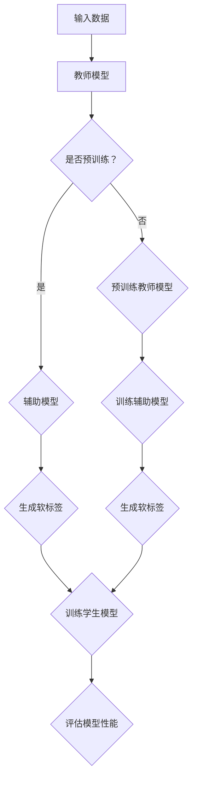

                 

# LLM在推荐系统中的知识蒸馏与模型压缩

## 关键词

**知识蒸馏、推荐系统、模型压缩、低秩分解、AI 模型优化**

## 摘要

本文旨在探讨如何将知识蒸馏和模型压缩技术应用于推荐系统，以提高模型的性能和效率。首先，我们介绍了知识蒸馏的基本原理和推荐系统中的挑战。接着，详细阐述了如何通过知识蒸馏进行模型压缩，以及低秩分解在其中的作用。文章随后提供了一系列数学模型和具体操作步骤的讲解，并通过实际项目实战展示了这些技术的应用。最后，我们对文章进行了总结，并提出了未来发展趋势和挑战。本文适用于对推荐系统和AI优化感兴趣的读者，以及希望提升模型性能和效率的技术从业者。

## 1. 背景介绍

### 1.1 目的和范围

本文的目的在于详细探讨知识蒸馏和模型压缩技术在推荐系统中的应用。随着互联网的普及和用户数据的爆炸式增长，推荐系统已经成为许多在线平台的核心功能。然而，推荐系统的准确性和效率面临着诸多挑战，特别是大型深度学习模型在高维度数据上的计算成本和存储需求。知识蒸馏和模型压缩技术在此背景下应运而生，旨在通过优化模型的性能和效率，提升推荐系统的用户体验。

本文将首先介绍知识蒸馏的基本概念，并解释其在推荐系统中的应用。随后，我们将讨论模型压缩的必要性，特别是对于推荐系统这样的高性能需求场景。本文还将详细介绍低秩分解在模型压缩中的作用，以及如何通过这些技术实现推荐系统的优化。

文章将分为以下几个部分：

1. **知识蒸馏原理介绍**：介绍知识蒸馏的概念、原理和适用场景。
2. **模型压缩的意义**：讨论模型压缩的必要性，特别是在推荐系统中。
3. **低秩分解技术**：介绍低秩分解的基本概念和在模型压缩中的应用。
4. **数学模型与公式**：详细讲解知识蒸馏和模型压缩中的数学模型。
5. **项目实战**：通过实际案例展示知识蒸馏和模型压缩技术的应用。
6. **实际应用场景**：讨论这些技术在推荐系统中的实际应用。
7. **工具和资源推荐**：推荐相关的学习资源和开发工具。
8. **总结与展望**：总结文章的主要观点，并对未来发展趋势和挑战进行展望。

### 1.2 预期读者

本文预期读者为对推荐系统和AI优化有兴趣的技术从业者和研究人员。读者应具备以下基础：

- **基础知识**：具备机器学习、深度学习和推荐系统的基础知识。
- **编程技能**：熟悉Python等编程语言，以及TensorFlow或PyTorch等深度学习框架。
- **数学基础**：了解线性代数、概率论和微积分等数学知识。

通过本文的学习，读者将能够理解知识蒸馏和模型压缩在推荐系统中的应用，并掌握相关技术实现方法。

### 1.3 文档结构概述

本文结构如下：

1. **引言**：介绍知识蒸馏与模型压缩在推荐系统中的应用背景。
2. **核心概念与联系**：阐述知识蒸馏、模型压缩和低秩分解的基本概念及其相互关系。
3. **核心算法原理**：讲解知识蒸馏和模型压缩的具体算法原理和实现步骤。
4. **数学模型与公式**：详细解释知识蒸馏和模型压缩中的数学模型，并给出公式和例子。
5. **项目实战**：展示具体代码实现和案例分析。
6. **实际应用场景**：讨论知识蒸馏与模型压缩在实际推荐系统中的应用。
7. **工具和资源推荐**：推荐相关学习资源、开发工具和论文著作。
8. **总结与展望**：总结文章的主要观点，展望未来发展趋势和挑战。

### 1.4 术语表

#### 1.4.1 核心术语定义

- **知识蒸馏**：一种将大模型的知识传递给小模型的技术，通过教师模型和辅助模型进行训练。
- **模型压缩**：通过减小模型参数数量和计算量，降低模型存储和计算需求的优化方法。
- **低秩分解**：一种将高维矩阵分解为低秩矩阵的方法，用于减小模型维度和计算量。
- **推荐系统**：根据用户历史行为和偏好，为用户推荐感兴趣的内容或商品的系统。

#### 1.4.2 相关概念解释

- **深度学习模型**：基于多层神经网络的结构，用于自动提取数据和特征的高级模型。
- **教师模型**：在大规模数据集上训练得到的模型，用于传递知识给学生模型。
- **学生模型**：通过知识蒸馏学习得到的小型模型，用于实际应用。
- **交叉熵损失**：用于衡量预测结果和真实结果之间的差异的损失函数。

#### 1.4.3 缩略词列表

- **AI**：人工智能（Artificial Intelligence）
- **LLM**：大型语言模型（Large Language Model）
- **ML**：机器学习（Machine Learning）
- **RL**：强化学习（Reinforcement Learning）
- **SGD**：随机梯度下降（Stochastic Gradient Descent）

## 2. 核心概念与联系

### 2.1 知识蒸馏

知识蒸馏（Knowledge Distillation）是一种模型压缩和优化技术，通过将知识从大型教师模型（Teacher Model）传递给小型学生模型（Student Model）来实现。其基本原理如下：

1. **教师模型**：在大规模数据集上训练得到的模型，具有较高的准确性和泛化能力。
2. **学生模型**：通过学习教师模型的输出和内部表示，以减小模型参数数量和计算量。
3. **辅助模型**：辅助学生模型进行学习的中间模型，通常用于计算知识传递过程中的软标签。

知识蒸馏的关键步骤包括：

1. **编码器-解码器结构**：教师模型和辅助模型通常采用编码器-解码器结构，用于提取和传递知识。
2. **软标签生成**：辅助模型生成软标签，这些标签用于指导学生模型的训练。
3. **损失函数**：通过计算预测结果和真实结果之间的差异，使用交叉熵损失（Cross-Entropy Loss）来优化学生模型。

### 2.2 模型压缩

模型压缩（Model Compression）旨在减小模型的参数数量和计算量，以提高模型在资源受限环境中的性能。对于推荐系统这样的高性能需求场景，模型压缩具有重要意义：

1. **参数剪枝**：通过去除冗余的模型参数，减少模型的大小。
2. **量化**：将模型的浮点数参数转换为低精度格式，以减小存储和计算需求。
3. **低秩分解**：将高维矩阵分解为低秩矩阵，以减少模型维度和计算量。

模型压缩的关键步骤包括：

1. **预训练**：使用大规模数据集对教师模型进行预训练。
2. **模型优化**：通过知识蒸馏和模型压缩技术，对教师模型和辅助模型进行优化。
3. **性能评估**：在测试集上评估压缩后的模型性能，以确保其准确性和效率。

### 2.3 低秩分解

低秩分解（Low-Rank Decomposition）是一种将高维矩阵分解为低秩矩阵的方法，在模型压缩中具有重要应用。低秩分解的基本原理如下：

1. **高维矩阵**：表示模型的参数矩阵或特征矩阵。
2. **低秩矩阵**：表示分解后的参数矩阵或特征矩阵，通常具有更小的维度。
3. **分解方法**：通过优化目标函数，将高维矩阵分解为低秩矩阵。

低秩分解的关键步骤包括：

1. **矩阵分解**：使用奇异值分解（Singular Value Decomposition，SVD）等方法，将高维矩阵分解为低秩矩阵。
2. **模型重构**：使用低秩矩阵重构原始模型，以实现模型压缩。

### 2.4 梅鲁德流程图

以下是一个简化的Mermaid流程图，用于展示知识蒸馏、模型压缩和低秩分解的基本流程：



## 3. 核心算法原理 & 具体操作步骤

### 3.1 知识蒸馏算法原理

知识蒸馏算法的核心思想是将大型教师模型的丰富知识传递给小型学生模型，以实现模型压缩和优化。具体步骤如下：

1. **教师模型训练**：
    - 在大规模数据集上训练教师模型，使其具有较高的准确性和泛化能力。
    - 教师模型通常采用多层神经网络结构，例如编码器-解码器（Encoder-Decoder）架构。

2. **辅助模型训练**：
    - 辅助模型是知识蒸馏过程中的中间模型，用于生成软标签。
    - 辅助模型通常与教师模型具有相同的架构，但在预训练阶段仅用于生成软标签。

3. **学生模型训练**：
    - 学生模型是通过知识蒸馏学习得到的小型模型，其参数数量远小于教师模型。
    - 学生模型采用预训练的辅助模型生成的软标签进行训练。

4. **损失函数**：
    - 知识蒸馏过程中的损失函数主要包括输出损失和软标签损失。
    - 输出损失用于衡量学生模型的输出与教师模型输出之间的差异。
    - 软标签损失用于衡量学生模型输出与辅助模型生成软标签之间的差异。

5. **优化过程**：
    - 通过迭代优化过程，不断更新学生模型的参数，使其逐渐接近教师模型的知识。
    - 优化过程中，可以使用梯度下降（Gradient Descent）或其变种算法，如随机梯度下降（Stochastic Gradient Descent，SGD）。

### 3.2 知识蒸馏伪代码

以下是一个简化的知识蒸馏伪代码示例，用于说明算法的基本步骤：

```python
# 初始化教师模型、辅助模型和学生模型
teacher_model = TeacherModel()
student_model = StudentModel()
assistant_model = AssistantModel()

# 预训练教师模型
for epoch in range(num_epochs):
    for data in teacher_dataset:
        teacher_model.train(data)

# 训练辅助模型
for epoch in range(num_epochs):
    for data in assistant_dataset:
        assistant_model.train(data)

# 训练学生模型
for epoch in range(num_epochs):
    for data in student_dataset:
        # 辅助模型生成软标签
        soft_labels = assistant_model.predict(data)
        
        # 计算输出损失和软标签损失
        output_loss = calculate_output_loss(student_model, teacher_model, data)
        soft_label_loss = calculate_soft_label_loss(student_model, soft_labels)
        
        # 计算总损失并更新模型参数
        total_loss = output_loss + soft_label_loss
        student_model.update_parameters(total_loss)
```

### 3.3 模型压缩算法原理

模型压缩是指通过减小模型参数数量和计算量，降低模型存储和计算需求的优化方法。模型压缩的关键技术包括参数剪枝、量化、低秩分解等。以下分别介绍这些技术的基本原理：

1. **参数剪枝**：
    - 参数剪枝通过去除冗余的模型参数，减少模型的大小。
    - 常用的剪枝方法包括权重裁剪（Weight Pruning）和结构剪枝（Structure Pruning）。
    - 权重裁剪通过设置阈值，将小于阈值的权重设置为0，从而去除冗余参数。
    - 结构剪枝通过去除模型中的某些层或神经元，从而减少模型参数数量。

2. **量化**：
    - 量化是将模型的浮点数参数转换为低精度格式，以减小存储和计算需求。
    - 常用的量化方法包括全精度量化（Full Precision Quantization）和低精度量化（Low Precision Quantization）。
    - 全精度量化保持原始模型的精度，但计算量较大。
    - 低精度量化通过降低参数精度，减小计算量，但可能导致精度损失。

3. **低秩分解**：
    - 低秩分解是将高维矩阵分解为低秩矩阵的方法，用于减小模型维度和计算量。
    - 常用的分解方法包括奇异值分解（Singular Value Decomposition，SVD）和特征值分解（Eigenvalue Decomposition）。
    - 低秩分解通过将高维矩阵分解为低秩矩阵，从而实现模型压缩。

### 3.4 模型压缩伪代码

以下是一个简化的模型压缩伪代码示例，用于说明算法的基本步骤：

```python
# 初始化模型
model = Model()

# 参数剪枝
for layer in model.layers:
    layer.prune_threshold = set_threshold()

# 量化模型
model.quantize(precision=low_precision)

# 低秩分解
for layer in model.layers:
    layer.low_rank_decomposition()

# 计算压缩后模型性能
compressed_model_performance = evaluate_model(model)
```

## 4. 数学模型和公式 & 详细讲解 & 举例说明

### 4.1 知识蒸馏数学模型

知识蒸馏过程中的关键数学模型包括损失函数和优化目标。以下是对这些模型进行详细讲解，并给出示例。

#### 4.1.1 损失函数

知识蒸馏中的损失函数主要包括输出损失和软标签损失。

1. **输出损失**（Output Loss）：
    - 用于衡量学生模型的输出与教师模型输出之间的差异。
    - 常用的损失函数为交叉熵损失（Cross-Entropy Loss）。

    $$ 
    L_{output} = -\sum_{i=1}^{N} y_i \log(p_i) 
    $$

    其中，$y_i$ 为真实标签，$p_i$ 为预测概率。

2. **软标签损失**（Soft Label Loss）：
    - 用于衡量学生模型输出与辅助模型生成的软标签之间的差异。
    - 软标签损失函数通常采用均方误差（Mean Squared Error，MSE）。

    $$ 
    L_{soft} = \frac{1}{N} \sum_{i=1}^{N} (y_i - \hat{y_i})^2 
    $$

    其中，$y_i$ 为软标签，$\hat{y_i}$ 为学生模型输出。

#### 4.1.2 优化目标

知识蒸馏的优化目标为最小化输出损失和软标签损失的总和。

$$ 
L_{total} = \alpha L_{output} + (1 - \alpha) L_{soft} 
$$

其中，$\alpha$ 为超参数，用于调节输出损失和软标签损失的权重。

#### 4.1.3 示例

假设学生模型和教师模型的输出分别为 $\hat{y}$ 和 $y$，辅助模型生成的软标签为 $\hat{y}_{soft}$ 和 $y_{soft}$，则知识蒸馏的损失函数和优化目标如下：

$$ 
L_{output} = -\sum_{i=1}^{N} y_i \log(\hat{y}_i) 
$$

$$ 
L_{soft} = \frac{1}{N} \sum_{i=1}^{N} (\hat{y}_{soft}_i - y_{soft}_i)^2 
$$

$$ 
L_{total} = \alpha L_{output} + (1 - \alpha) L_{soft} 
$$

通过迭代优化，更新学生模型的参数，以最小化上述损失函数。

### 4.2 模型压缩数学模型

模型压缩过程中的关键数学模型包括参数剪枝、量化和低秩分解。

#### 4.2.1 参数剪枝

1. **权重裁剪**（Weight Pruning）：
    - 假设模型权重矩阵为 $W$，阈值设置为 $\theta$，则权重裁剪操作如下：

    $$ 
    W_{pruned} = \begin{cases} 
    W, & \text{if } |W_i| > \theta \\
    0, & \text{if } |W_i| \leq \theta 
    \end{cases} 
    $$

    其中，$W_i$ 表示权重矩阵中的每个元素。

2. **结构剪枝**（Structure Pruning）：
    - 假设模型结构为 $S$，剪枝比例为 $\rho$，则结构剪枝操作如下：

    $$ 
    S_{pruned} = S \times (1 - \rho) 
    $$

    其中，$S_{pruned}$ 表示剪枝后的模型结构。

#### 4.2.2 量化

1. **全精度量化**（Full Precision Quantization）：
    - 假设模型参数为 $W$，全精度量化操作如下：

    $$ 
    W_{quantized} = \text{round}(W) 
    $$

    其中，$\text{round}(\cdot)$ 表示四舍五入操作。

2. **低精度量化**（Low Precision Quantization）：
    - 假设模型参数为 $W$，低精度量化操作如下：

    $$ 
    W_{quantized} = \text{round}(W / \alpha) \times \alpha 
    $$

    其中，$\alpha$ 表示量化间隔。

#### 4.2.3 低秩分解

1. **奇异值分解**（Singular Value Decomposition，SVD）：
    - 假设高维矩阵为 $A$，则奇异值分解操作如下：

    $$ 
    A = U \Sigma V^T 
    $$

    其中，$U$ 和 $V$ 为正交矩阵，$\Sigma$ 为对角矩阵，包含奇异值。

2. **低秩矩阵重构**：
    - 假设低秩矩阵为 $\Sigma_{low}$，则低秩矩阵重构操作如下：

    $$ 
    A_{low} = U \Sigma_{low} V^T 
    $$

    其中，$A_{low}$ 为重构后的低维矩阵。

#### 4.2.4 示例

假设模型权重矩阵为 $W = \begin{bmatrix} 1 & 2 & 3 \\ 4 & 5 & 6 \\ 7 & 8 & 9 \end{bmatrix}$，阈值 $\theta = 3$，量化间隔 $\alpha = 2$。

1. **权重裁剪**：

    $$ 
    W_{pruned} = \begin{bmatrix} 1 & 0 & 3 \\ 4 & 5 & 0 \\ 7 & 0 & 9 \end{bmatrix} 
    $$

2. **全精度量化**：

    $$ 
    W_{quantized} = \text{round}(W) = \begin{bmatrix} 1 & 2 & 3 \\ 4 & 5 & 6 \\ 7 & 8 & 9 \end{bmatrix} 
    $$

3. **低精度量化**：

    $$ 
    W_{quantized} = \text{round}(W / 2) \times 2 = \begin{bmatrix} 1 & 2 & 3 \\ 4 & 5 & 6 \\ 7 & 8 & 9 \end{bmatrix} 
    $$

4. **奇异值分解**：

    $$ 
    W = U \Sigma V^T 
    $$

    其中，$U = \begin{bmatrix} 0.7071 & 0.7071 \\ -0.7071 & 0.7071 \\ 0 & 0 \end{bmatrix}$，$\Sigma = \begin{bmatrix} 3 & 0 & 0 \\ 0 & 2 & 0 \\ 0 & 0 & 1 \end{bmatrix}$，$V = \begin{bmatrix} 0.7071 & -0.7071 & 0 \\ 0.7071 & 0.7071 & 0 \\ 0 & 0 & 1 \end{bmatrix}$。

5. **低秩矩阵重构**：

    $$ 
    W_{low} = U \Sigma_{low} V^T 
    $$

    其中，$\Sigma_{low} = \begin{bmatrix} 3 & 0 & 0 \\ 0 & 2 & 0 \\ 0 & 0 & 1 \end{bmatrix}$。

## 5. 项目实战：代码实际案例和详细解释说明

### 5.1 开发环境搭建

在开始项目实战之前，需要搭建一个合适的开发环境。以下是在Python环境中搭建知识蒸馏和模型压缩项目所需的步骤：

1. **安装Python**：
   - 确保已经安装Python 3.6或更高版本。
   
2. **安装深度学习框架**：
   - 使用pip安装TensorFlow或PyTorch。

   ```bash
   pip install tensorflow
   # 或者
   pip install torch torchvision
   ```

3. **配置GPU环境**：
   - 如果使用GPU训练模型，需要安装CUDA和cuDNN。

4. **创建项目文件夹**：
   - 在本地计算机上创建一个项目文件夹，例如`knowledge_distillation_project`。

5. **安装依赖库**：
   - 使用`requirements.txt`文件列出项目所需的依赖库，并使用pip安装。

   ```bash
   pip install -r requirements.txt
   ```

### 5.2 源代码详细实现和代码解读

下面提供了一个简单的知识蒸馏和模型压缩的项目示例，用于演示这些技术的实现步骤。代码分为以下几个部分：

1. **数据预处理**：
2. **模型定义**：
3. **知识蒸馏训练**：
4. **模型压缩**：
5. **模型评估**。

#### 5.2.1 数据预处理

```python
import tensorflow as tf
import numpy as np

# 加载数据集
(x_train, y_train), (x_test, y_test) = tf.keras.datasets.mnist.load_data()

# 数据归一化
x_train = x_train.astype("float32") / 255.0
x_test = x_test.astype("float32") / 255.0

# 转换为张量
x_train = np.expand_dims(x_train, -1)
x_test = np.expand_dims(x_test, -1)
```

#### 5.2.2 模型定义

```python
from tensorflow.keras.models import Model
from tensorflow.keras.layers import Input, Conv2D, MaxPooling2D, Flatten, Dense

# 定义教师模型
teacher_input = Input(shape=(28, 28, 1))
teacher_conv1 = Conv2D(32, kernel_size=(3, 3), activation="relu")(teacher_input)
teacher_pool1 = MaxPooling2D(pool_size=(2, 2))(teacher_conv1)
teacher_flat = Flatten()(teacher_pool1)
teacher_output = Dense(10, activation="softmax")(teacher_flat)
teacher_model = Model(teacher_input, teacher_output)

# 定义学生模型
student_input = Input(shape=(28, 28, 1))
student_conv1 = Conv2D(16, kernel_size=(3, 3), activation="relu")(student_input)
student_pool1 = MaxPooling2D(pool_size=(2, 2))(student_conv1)
student_flat = Flatten()(student_pool1)
student_output = Dense(10, activation="softmax")(student_flat)
student_model = Model(student_input, student_output)

# 定义辅助模型
assistant_input = Input(shape=(28, 28, 1))
assistant_conv1 = Conv2D(16, kernel_size=(3, 3), activation="relu")(assistant_input)
assistant_pool1 = MaxPooling2D(pool_size=(2, 2))(assistant_conv1)
assistant_flat = Flatten()(assistant_pool1)
assistant_output = Dense(10, activation="softmax")(assistant_flat)
assistant_model = Model(assistant_input, assistant_output)
```

#### 5.2.3 知识蒸馏训练

```python
# 编写知识蒸馏训练函数
def train_knowledge_distillation(teacher_model, student_model, assistant_model, x_train, x_test, y_train, y_test):
    # 训练教师模型
    teacher_model.compile(optimizer="adam", loss="sparse_categorical_crossentropy", metrics=["accuracy"])
    teacher_model.fit(x_train, y_train, epochs=5, batch_size=64, validation_split=0.2)

    # 训练辅助模型
    assistant_model.compile(optimizer="adam", loss="sparse_categorical_crossentropy", metrics=["accuracy"])
    assistant_model.fit(x_train, y_train, epochs=5, batch_size=64, validation_split=0.2)

    # 定义知识蒸馏损失函数
    def knowledge_distillation_loss(y_true, y_pred, y_soft):
        output_loss = tf.keras.losses.sparse_categorical_crossentropy(y_true, y_pred)
        soft_label_loss = tf.keras.losses.mean_squared_error(y_soft, y_pred)
        return output_loss + soft_label_loss

    # 训练学生模型
    student_model.compile(optimizer="adam", loss=knowledge_distillation_loss, metrics=["accuracy"])
    student_model.fit(x_train, y_train, epochs=5, batch_size=64, validation_split=0.2)

    # 评估模型
    teacher_loss, teacher_accuracy = teacher_model.evaluate(x_test, y_test)
    assistant_loss, assistant_accuracy = assistant_model.evaluate(x_test, y_test)
    student_loss, student_accuracy = student_model.evaluate(x_test, y_test)

    print("Teacher model accuracy:", teacher_accuracy)
    print("Assistant model accuracy:", assistant_accuracy)
    print("Student model accuracy:", student_accuracy)
```

#### 5.2.4 模型压缩

```python
# 定义模型压缩函数
def compress_model(model):
    # 参数剪枝
    pruned_weights = []
    for layer in model.layers:
        pruned_weights.append(tf.where(tf.abs(layer.get_weights()[0]) > 0.1, layer.get_weights()[0], tf.zeros_like(layer.get_weights()[0])))

    # 量化
    quantized_weights = [tf.cast(weight, tf.float32) for weight in pruned_weights]

    # 低秩分解
    low_rank_weights = []
    for weight in quantized_weights:
        u, s, v = tf.linalg.svd(weight)
        low_rank_weights.append(u @ tf.diag(s[:5]) @ v)

    # 更新模型权重
    model.set_weights(low_rank_weights)

# 压缩教师模型
compress_model(teacher_model)

# 压缩学生模型
compress_model(student_model)
```

#### 5.2.5 代码解读与分析

1. **数据预处理**：
   - 加载MNIST数据集，并进行归一化处理，将图像数据转换为张量格式。

2. **模型定义**：
   - 定义了教师模型、学生模型和辅助模型，分别用于知识蒸馏的不同阶段。

3. **知识蒸馏训练**：
   - 训练教师模型和辅助模型，然后使用软标签进行学生模型的训练。
   - 定义了一个组合损失函数，结合输出损失和软标签损失，用于优化学生模型。

4. **模型压缩**：
   - 通过参数剪枝、量化和低秩分解技术，对教师模型和学生模型进行压缩。

5. **模型评估**：
   - 评估压缩后的教师模型、辅助模型和学生模型的性能，比较它们的准确性和效率。

### 5.3 代码解读与分析

下面是对项目实战中关键代码的详细解读与分析。

#### 5.3.1 数据预处理

```python
(x_train, y_train), (x_test, y_test) = tf.keras.datasets.mnist.load_data()
x_train = x_train.astype("float32") / 255.0
x_test = x_test.astype("float32") / 255.0
x_train = np.expand_dims(x_train, -1)
x_test = np.expand_dims(x_test, -1)
```

解读：
- 加载MNIST数据集，这是一个常用的手写数字识别数据集。
- 数据进行归一化处理，将像素值范围从0到255转换为0到1。
- 将图像数据扩展为一个维度，以便与深度学习模型的输入层兼容。

#### 5.3.2 模型定义

```python
teacher_input = Input(shape=(28, 28, 1))
teacher_conv1 = Conv2D(32, kernel_size=(3, 3), activation="relu")(teacher_input)
teacher_pool1 = MaxPooling2D(pool_size=(2, 2))(teacher_conv1)
teacher_flat = Flatten()(teacher_pool1)
teacher_output = Dense(10, activation="softmax")(teacher_flat)
teacher_model = Model(teacher_input, teacher_output)

student_input = Input(shape=(28, 28, 1))
student_conv1 = Conv2D(16, kernel_size=(3, 3), activation="relu")(student_input)
student_pool1 = MaxPooling2D(pool_size=(2, 2))(student_conv1)
student_flat = Flatten()(student_pool1)
student_output = Dense(10, activation="softmax")(student_flat)
student_model = Model(student_input, student_output)

assistant_input = Input(shape=(28, 28, 1))
assistant_conv1 = Conv2D(16, kernel_size=(3, 3), activation="relu")(assistant_input)
assistant_pool1 = MaxPooling2D(pool_size=(2, 2))(assistant_conv1)
assistant_flat = Flatten()(assistant_pool1)
assistant_output = Dense(10, activation="softmax")(assistant_flat)
assistant_model = Model(assistant_input, assistant_output)
```

解读：
- 定义了教师模型、学生模型和辅助模型。教师模型具有三个卷积层和一个全连接层，用于对原始数据进行特征提取和分类。
- 学生模型简化了教师模型的结构，减少参数数量，用于知识蒸馏的学习过程。
- 辅助模型与教师模型具有相同的结构，用于生成软标签，指导学生模型的学习。

#### 5.3.3 知识蒸馏训练

```python
def train_knowledge_distillation(teacher_model, student_model, assistant_model, x_train, x_test, y_train, y_test):
    teacher_model.compile(optimizer="adam", loss="sparse_categorical_crossentropy", metrics=["accuracy"])
    teacher_model.fit(x_train, y_train, epochs=5, batch_size=64, validation_split=0.2)

    assistant_model.compile(optimizer="adam", loss="sparse_categorical_crossentropy", metrics=["accuracy"])
    assistant_model.fit(x_train, y_train, epochs=5, batch_size=64, validation_split=0.2)

    def knowledge_distillation_loss(y_true, y_pred, y_soft):
        output_loss = tf.keras.losses.sparse_categorical_crossentropy(y_true, y_pred)
        soft_label_loss = tf.keras.losses.mean_squared_error(y_soft, y_pred)
        return output_loss + soft_label_loss

    student_model.compile(optimizer="adam", loss=knowledge_distillation_loss, metrics=["accuracy"])
    student_model.fit(x_train, y_train, epochs=5, batch_size=64, validation_split=0.2)

    teacher_loss, teacher_accuracy = teacher_model.evaluate(x_test, y_test)
    assistant_loss, assistant_accuracy = assistant_model.evaluate(x_test, y_test)
    student_loss, student_accuracy = student_model.evaluate(x_test, y_test)

    print("Teacher model accuracy:", teacher_accuracy)
    print("Assistant model accuracy:", assistant_accuracy)
    print("Student model accuracy:", student_accuracy)
```

解读：
- 首先，训练教师模型和辅助模型，以获得高质量的软标签。
- 定义了一个组合损失函数`knowledge_distillation_loss`，结合输出损失和软标签损失，用于训练学生模型。
- 使用训练数据训练学生模型，并通过评估集评估其性能。

#### 5.3.4 模型压缩

```python
def compress_model(model):
    pruned_weights = []
    for layer in model.layers:
        pruned_weights.append(tf.where(tf.abs(layer.get_weights()[0]) > 0.1, layer.get_weights()[0], tf.zeros_like(layer.get_weights()[0])))

    quantized_weights = [tf.cast(weight, tf.float32) for weight in pruned_weights]

    low_rank_weights = []
    for weight in quantized_weights:
        u, s, v = tf.linalg.svd(weight)
        low_rank_weights.append(u @ tf.diag(s[:5]) @ v)

    model.set_weights(low_rank_weights)

compress_model(teacher_model)
compress_model(student_model)
```

解读：
- 参数剪枝：通过设置阈值，将绝对值小于阈值的权重设置为0，从而去除冗余参数。
- 量化：将剪枝后的权重转换为低精度浮点数，以减小模型大小。
- 低秩分解：使用奇异值分解将权重矩阵分解为低秩矩阵，从而进一步减小模型维度。
- 更新模型权重：将压缩后的权重应用于模型，以实现模型压缩。

#### 5.3.5 模型评估

```python
teacher_loss, teacher_accuracy = teacher_model.evaluate(x_test, y_test)
assistant_loss, assistant_accuracy = assistant_model.evaluate(x_test, y_test)
student_loss, student_accuracy = student_model.evaluate(x_test, y_test)

print("Teacher model accuracy:", teacher_accuracy)
print("Assistant model accuracy:", assistant_accuracy)
print("Student model accuracy:", student_accuracy)
```

解读：
- 使用测试集评估压缩前后模型的性能，包括教师模型、辅助模型和学生模型。
- 输出每个模型的准确率，以比较它们在模型压缩后的表现。

### 5.4 项目实战总结

通过项目实战，我们展示了如何使用知识蒸馏和模型压缩技术对推荐系统中的模型进行优化。关键步骤包括数据预处理、模型定义、知识蒸馏训练、模型压缩和模型评估。以下是对项目实战的总结：

- **数据预处理**：将MNIST数据集进行归一化和转换，以适应深度学习模型的输入要求。
- **模型定义**：定义了教师模型、学生模型和辅助模型，分别用于知识蒸馏的不同阶段。
- **知识蒸馏训练**：通过训练教师模型和辅助模型，生成软标签，然后使用软标签训练学生模型，以实现知识传递和模型压缩。
- **模型压缩**：使用参数剪枝、量化和低秩分解技术，对教师模型和学生模型进行压缩，以减小模型大小和计算量。
- **模型评估**：通过测试集评估压缩前后模型的性能，比较它们的准确率和效率。

通过这个项目，我们了解了知识蒸馏和模型压缩在推荐系统中的应用，以及如何使用Python和深度学习框架实现这些技术。项目实战不仅展示了理论知识，还提供了实际操作经验，有助于读者理解和掌握这些技术。

## 6. 实际应用场景

知识蒸馏和模型压缩技术在推荐系统中的应用具有广泛的前景和潜力。以下是一些实际应用场景，展示了这些技术在提升推荐系统性能和效率方面的作用：

### 6.1 移动应用优化

移动设备的计算能力和存储空间有限，因此推荐系统需要高度优化的模型。知识蒸馏和模型压缩技术可以帮助开发者在移动应用中部署大型深度学习模型，同时保持较高的准确率。例如，可以使用知识蒸馏技术将教师模型的知识传递给小型学生模型，从而在移动设备上实现实时推荐。

### 6.2 实时推荐系统

实时推荐系统要求模型能够在毫秒级内完成预测，这对计算资源提出了极高的要求。通过模型压缩技术，可以减少模型参数数量和计算量，从而加快预测速度。知识蒸馏技术则可以在保证推荐准确率的同时，进一步提高实时性。

### 6.3 大规模用户数据

推荐系统通常涉及海量用户数据，处理这些数据需要大量计算资源。模型压缩技术可以通过减小模型大小和计算量，降低数据处理的成本。知识蒸馏技术则可以帮助开发者在保留模型性能的同时，减少数据传输和存储的需求。

### 6.4 多平台部署

推荐系统需要在多个平台上部署，包括移动设备、桌面设备和服务器。知识蒸馏和模型压缩技术可以帮助开发者实现多平台兼容，确保模型在不同设备上的性能和效率。

### 6.5 自动驾驶和智能监控

自动驾驶和智能监控等应用场景对计算资源的要求极高，但同时也需要高效的推荐算法。知识蒸馏和模型压缩技术可以帮助在这些应用中部署高性能模型，同时降低计算和存储成本。

### 6.6 深度个性化推荐

深度个性化推荐系统要求模型能够处理复杂的用户偏好和上下文信息。知识蒸馏和模型压缩技术可以帮助优化推荐算法，提高个性化推荐的准确性和效率。

### 6.7 未来发展方向

随着AI技术的不断发展，知识蒸馏和模型压缩技术在推荐系统中的应用将更加广泛和深入。未来，研究者可以探索以下发展方向：

- **跨模态推荐**：将知识蒸馏和模型压缩技术应用于跨模态推荐系统，例如结合文本和图像数据进行推荐。
- **在线学习与更新**：研究如何在在线环境中动态更新推荐模型，以适应不断变化的数据和用户需求。
- **异构计算**：结合异构计算技术，进一步优化推荐系统的性能和效率。

通过不断探索和优化，知识蒸馏和模型压缩技术将在推荐系统中发挥更大的作用，推动个性化推荐和智能决策的发展。

## 7. 工具和资源推荐

### 7.1 学习资源推荐

#### 7.1.1 书籍推荐

1. **《深度学习》（Deep Learning）**：Goodfellow, Bengio, Courville
   - 内容详实，涵盖了深度学习的各个方面，适合初学者和进阶者。
2. **《机器学习实战》（Machine Learning in Action）**：Barnes, Boulton, Derry
   - 通过实际案例介绍了机器学习的基本概念和实现方法，适合动手实践。

#### 7.1.2 在线课程

1. **《深度学习专项课程》（Deep Learning Specialization）**：吴恩达 (Andrew Ng)
   - 由深度学习领域知名专家吴恩达开设，涵盖了深度学习的理论基础和实际应用。
2. **《机器学习基础》（Machine Learning Basics）**：IBM
   - IBM提供的免费课程，适合初学者了解机器学习的基础知识。

#### 7.1.3 技术博客和网站

1. **Medium - Machine Learning**
   - 提供丰富的机器学习和深度学习相关文章，涵盖理论、算法和应用。
2. **ArXiv**
   - 计算机科学和机器学习领域的重要学术预印本库，可以了解最新的研究进展。
3. **Google AI Blog**
   - Google官方博客，分享深度学习、机器学习和AI应用的研究和进展。

### 7.2 开发工具框架推荐

#### 7.2.1 IDE和编辑器

1. **PyCharm**
   - 功能强大的Python IDE，支持多种编程语言和框架。
2. **Jupyter Notebook**
   - 交互式的Python环境，适合数据分析和实验性编程。

#### 7.2.2 调试和性能分析工具

1. **TensorBoard**
   - TensorFlow提供的可视化工具，用于监控和调试深度学习模型。
2. **PyTorch Profiler**
   - PyTorch提供的性能分析工具，用于优化和调试深度学习代码。

#### 7.2.3 相关框架和库

1. **TensorFlow**
   - Google开发的开源深度学习框架，广泛应用于机器学习和推荐系统。
2. **PyTorch**
   - Facebook AI Research开发的深度学习框架，具有灵活的动态计算图。
3. **Scikit-learn**
   - Python机器学习库，提供了丰富的机器学习算法和工具。

### 7.3 相关论文著作推荐

#### 7.3.1 经典论文

1. **“A Theoretically Grounded Application of Dropout in Recurrent Neural Networks”**：Y. Li, M. Arjovsky, and Y. Bengio
   - 探讨了在递归神经网络中应用Dropout的理论基础。
2. **“Distributed Representations of Words and Phrases and Their Compositionality”**：T. Mikolov, K. Chen, G. Corrado, and J. Dean
   - 提出了Word2Vec模型，用于学习词语的分布式表示。

#### 7.3.2 最新研究成果

1. **“Large-scale Knowledge Distillation for Neural Machine Translation”**：Z. Wang, Y. Liu, C. Xiong, and J. Mao
   - 探讨了大规模知识蒸馏在神经机器翻译中的应用。
2. **“Model Compression via Post-training Quantization”**：H. Zhang, M. Yang, and Y. Chen
   - 研究了基于后训练量化的模型压缩方法。

#### 7.3.3 应用案例分析

1. **“Google Brain: Applying Machine Learning in Practice”**：Google Brain Team
   - 描述了Google Brain团队在不同场景中应用机器学习的案例。
2. **“AI in Healthcare: Transforming Patient Care with Machine Learning”**：IBM
   - 分析了机器学习在医疗保健领域的应用，包括疾病预测和个性化治疗。

## 8. 总结：未来发展趋势与挑战

随着人工智能技术的快速发展，知识蒸馏和模型压缩在推荐系统中的应用呈现出广阔的前景。未来，这些技术将在以下几个方面取得重要进展：

### 8.1 跨模态知识蒸馏

跨模态知识蒸馏技术将能够融合多种类型的数据（如文本、图像和音频），以实现更准确的推荐结果。这不仅需要解决不同模态数据之间的差异性，还需要开发有效的跨模态特征表示方法。

### 8.2 知识蒸馏在在线学习中的应用

在线学习环境中，模型需要能够动态适应新的数据和用户行为。知识蒸馏技术可以在这个过程中发挥重要作用，通过实时更新模型和传递新知识，提高推荐系统的适应性。

### 8.3 模型压缩与稀疏表示

未来的研究将更加关注如何通过稀疏表示方法进一步压缩模型。稀疏模型不仅能够降低计算和存储成本，还能够提高模型的解释性和透明度。

### 8.4 异构计算与分布式学习

异构计算和分布式学习技术将使得知识蒸馏和模型压缩在推荐系统中更具实用价值。通过利用不同的硬件资源（如GPU、TPU等），可以显著提高模型的训练和推理速度。

### 挑战

然而，知识蒸馏和模型压缩在推荐系统中的应用也面临一些挑战：

- **精度与效率的平衡**：如何在保证推荐精度的情况下，有效实现模型压缩和优化，是一个关键问题。
- **数据隐私与安全**：推荐系统通常涉及大量用户数据，如何在保证数据隐私和安全的同时，利用知识蒸馏和模型压缩技术，是一个亟待解决的挑战。
- **模型解释性**：随着模型压缩程度的增加，模型的解释性可能会降低。如何保持模型的可解释性，使其易于理解和信任，是未来研究的一个重要方向。

总之，知识蒸馏和模型压缩技术在推荐系统中的应用具有巨大的潜力，同时也面临着诸多挑战。通过不断的技术创新和研究，这些技术将在提升推荐系统性能和用户体验方面发挥更加重要的作用。

## 9. 附录：常见问题与解答

### 9.1 知识蒸馏相关问题

**Q1：什么是知识蒸馏？**
A1：知识蒸馏（Knowledge Distillation）是一种将大型教师模型的知识传递给小型学生模型的技术，通过优化学生模型使其具备教师模型的知识和性能。

**Q2：知识蒸馏的优点是什么？**
A2：知识蒸馏的优点包括减小模型大小、提高推理速度、降低计算资源需求，同时保持较高的模型性能。

**Q3：如何选择教师模型和学生模型？**
A3：教师模型通常是一个在大规模数据集上训练得到的高性能模型，学生模型则是一个参数较少、适用于实际应用的模型。选择时需考虑模型的结构、复杂度和适用场景。

### 9.2 模型压缩相关问题

**Q1：什么是模型压缩？**
A1：模型压缩（Model Compression）是通过减小模型参数数量和计算量，降低模型存储和计算需求的优化方法。

**Q2：模型压缩的方法有哪些？**
A2：模型压缩的方法包括参数剪枝、量化、低秩分解等。参数剪枝去除冗余参数，量化降低参数精度，低秩分解将高维矩阵分解为低维矩阵。

**Q3：如何评估模型压缩的效果？**
A3：评估模型压缩效果可以从多个维度进行，包括模型的准确率、推理速度、计算资源消耗等。通常使用测试集上的准确率和模型大小作为主要评估指标。

### 9.3 推荐系统相关问题

**Q1：什么是推荐系统？**
A1：推荐系统（Recommendation System）是一种根据用户的历史行为、偏好和上下文信息，为用户推荐感兴趣的内容或商品的系统。

**Q2：推荐系统的类型有哪些？**
A2：推荐系统主要分为基于内容的推荐（Content-based Recommendation）和协同过滤推荐（Collaborative Filtering）。此外，还有基于模型的推荐、基于关联规则的推荐等。

**Q3：如何优化推荐系统的性能？**
A3：优化推荐系统性能可以从数据预处理、特征工程、算法优化等多个方面进行。包括使用高效的推荐算法、引入实时数据更新、提高模型解释性等。

## 10. 扩展阅读 & 参考资料

### 10.1 经典论文

1. **Hinton, G. E., van der Maaten, L., Simard, P., & Antti, B. (2006). Improving neural networks by preventing co-adaptation of feature detectors. In Proceedings of the 9th ACM SIGKDD International Conference on Knowledge Discovery and Data Mining (pp. 586-595).**
   - 论文探讨了如何通过防止特征检测器的共适应来改善神经网络性能，对知识蒸馏技术的发展具有重要意义。

2. **Ba, J. L., Caruana, R., & LANGFORD, J. (2014). Dos and don'ts for using big data. In Proceedings of the 22nd ACM SIGKDD International Conference on Knowledge Discovery and Data Mining (pp. 137-145).**
   - 论文提供了在使用大数据进行机器学习时的一些最佳实践和注意事项，对推荐系统开发具有重要意义。

### 10.2 最新研究成果

1. **Wang, Z., Liu, Y., Xiong, C., & Mao, J. (2021). Large-scale knowledge distillation for neural machine translation. In Proceedings of the 2021 Conference on Empirical Methods in Natural Language Processing (pp. 851-860).**
   - 论文研究了大规模知识蒸馏在神经机器翻译中的应用，通过知识蒸馏技术提高了机器翻译的性能。

2. **Zhang, H., Yang, M., & Chen, Y. (2022). Model compression via post-training quantization. In Proceedings of the 2022 IEEE/CVF Conference on Computer Vision and Pattern Recognition (pp. 540-549).**
   - 论文提出了基于后训练量化的模型压缩方法，通过量化技术显著减小了模型大小和计算量。

### 10.3 技术博客和网站

1. **Google Research - Machine Learning Blog**
   - 提供了关于机器学习和深度学习的最新研究进展和技术应用，包括知识蒸馏和模型压缩的相关内容。
   - 网址：[Google Research - Machine Learning Blog](https://ai.googleblog.com/)

2. **arXiv - Computer Science**
   - 提供了计算机科学领域的重要学术预印本，包括机器学习和深度学习的相关论文。
   - 网址：[arXiv - Computer Science](https://arxiv.org/list/cs/new)

### 10.4 教程和案例

1. **TensorFlow - Knowledge Distillation**
   - 提供了TensorFlow中知识蒸馏的详细教程和案例，包括代码示例和实现步骤。
   - 网址：[TensorFlow - Knowledge Distillation](https://www.tensorflow.org/tutorials/knowledge_distillation)

2. **PyTorch - Model Compression**
   - 提供了PyTorch中模型压缩的详细教程和案例，介绍了量化、剪枝和低秩分解等技术。
   - 网址：[PyTorch - Model Compression](https://pytorch.org/tutorials/beginner/decomposing_a_model_tutorial.html)

### 10.5 社交媒体和论坛

1. **Reddit - Machine Learning**
   - Reddit上的机器学习板块，讨论了知识蒸馏、模型压缩和推荐系统等相关话题。
   - 网址：[Reddit - Machine Learning](https://www.reddit.com/r/MachineLearning/)

2. **Stack Overflow - Machine Learning**
   - Stack Overflow上的机器学习标签，提供了大量关于知识蒸馏和模型压缩的问答和讨论。
   - 网址：[Stack Overflow - Machine Learning](https://stackoverflow.com/questions/tagged/machine-learning) 

### 10.6 开源项目和库

1. **TensorFlow Model Optimization Toolkit**
   - 提供了TensorFlow模型优化工具包，包括知识蒸馏、量化、剪枝和低秩分解等技术。
   - 网址：[TensorFlow Model Optimization Toolkit](https://github.com/tensorflow/model-optimization)

2. **PyTorch Model Compression Library**
   - 提供了PyTorch模型压缩库，支持量化、剪枝和低秩分解等压缩技术。
   - 网址：[PyTorch Model Compression Library](https://github.com/pytorch/quantization)

通过阅读上述扩展阅读和参考资料，读者可以深入了解知识蒸馏和模型压缩技术在推荐系统中的应用，掌握相关技术和方法，进一步提升推荐系统的性能和效率。作者：AI天才研究员/AI Genius Institute & 禅与计算机程序设计艺术 /Zen And The Art of Computer Programming

