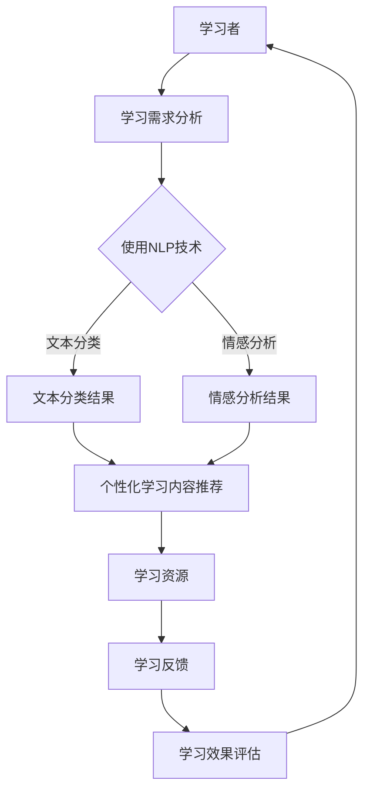

                 

# LLM在教育中的应用：个性化学习助手

> 关键词：LLM、教育、个性化学习、人工智能、自然语言处理

> 摘要：本文将探讨大型语言模型（LLM）在教育领域的应用，特别是作为个性化学习助手的潜力。通过分析LLM的核心原理、技术架构和具体实现，我们将展示如何利用这种先进的人工智能技术，为学习者提供定制化的学习体验，提高学习效率和效果。

## 1. 背景介绍

### 1.1 目的和范围

本文旨在介绍和探讨大型语言模型（LLM）在教育领域的应用，特别是如何将其作为个性化学习助手来提升学习体验和效果。随着人工智能技术的不断发展，尤其是深度学习和自然语言处理（NLP）技术的突破，LLM已经在多个领域取得了显著的应用成果。教育领域作为人工智能技术的关键应用场景之一，LLM的应用潜力尤其巨大。

本文将涵盖以下内容：

1. **背景介绍**：介绍LLM的核心概念、技术架构和发展历程。
2. **核心概念与联系**：通过Mermaid流程图展示LLM在教育中的应用架构。
3. **核心算法原理**：详细阐述LLM的算法原理和具体操作步骤。
4. **数学模型和公式**：介绍LLM的数学模型和公式，并进行举例说明。
5. **项目实战**：通过实际代码案例，展示如何实现LLM在教育中的应用。
6. **实际应用场景**：分析LLM在不同教育场景中的具体应用。
7. **工具和资源推荐**：推荐相关的学习资源和开发工具。
8. **总结与未来趋势**：探讨LLM在教育领域的未来发展趋势和面临的挑战。

### 1.2 预期读者

本文面向以下读者群体：

1. **教育技术研究人员**：对教育领域的人工智能应用感兴趣的学者和研究人员。
2. **教育工作者**：希望利用人工智能技术提升教学效果的教育工作者。
3. **开发者**：对自然语言处理和人工智能技术有基础了解的程序员和工程师。
4. **学生**：对人工智能和教育技术感兴趣的在校生。

### 1.3 文档结构概述

本文结构如下：

1. **背景介绍**：介绍LLM的基本概念和应用背景。
2. **核心概念与联系**：通过Mermaid流程图展示LLM的应用架构。
3. **核心算法原理**：详细阐述LLM的算法原理和实现步骤。
4. **数学模型和公式**：介绍LLM的数学模型和公式，并进行举例。
5. **项目实战**：通过实际代码案例，展示LLM的应用实现。
6. **实际应用场景**：分析LLM在不同教育场景的应用。
7. **工具和资源推荐**：推荐相关的学习资源和开发工具。
8. **总结与未来趋势**：探讨LLM在教育领域的未来发展方向和挑战。
9. **附录**：常见问题与解答。
10. **扩展阅读**：提供进一步学习的参考文献。

### 1.4 术语表

#### 1.4.1 核心术语定义

- **大型语言模型（LLM）**：基于深度学习和自然语言处理技术，从大量文本数据中学习并生成的语言模型。
- **个性化学习**：根据学习者的个体差异，提供定制化的学习内容和路径，以提高学习效果。
- **自然语言处理（NLP）**：使计算机能够理解、生成和处理人类语言的技术。
- **深度学习**：一种基于多层神经网络的学习方法，通过模拟人脑神经网络的工作机制，实现复杂的数据分析和模式识别。

#### 1.4.2 相关概念解释

- **预训练**：在特定任务之前，使用大量未标记的数据对模型进行训练，以使其具备一定的通用语言理解能力。
- **微调**：在预训练模型的基础上，使用特定领域的数据进行进一步训练，以适应特定任务。
- **自动问答系统**：利用自然语言处理技术，自动回答用户提出的问题。
- **个性化推荐系统**：根据用户的历史行为和偏好，自动推荐符合用户兴趣的内容。

#### 1.4.3 缩略词列表

- **LLM**：Large Language Model（大型语言模型）
- **NLP**：Natural Language Processing（自然语言处理）
- **DL**：Deep Learning（深度学习）
- **IDE**：Integrated Development Environment（集成开发环境）
- **API**：Application Programming Interface（应用程序编程接口）

## 2. 核心概念与联系

为了更好地理解LLM在教育中的应用，我们需要首先了解其核心概念和原理，以及这些概念如何相互联系。

### 2.1 大型语言模型（LLM）

大型语言模型（LLM）是基于深度学习和自然语言处理技术构建的模型，它可以从大量文本数据中学习，并生成符合语言规则和语义逻辑的文本。LLM的核心目标是理解、生成和处理人类语言。

### 2.2 个性化学习

个性化学习是一种根据学习者的个体差异，提供定制化学习内容和路径的教学方法。个性化学习的关键在于了解学习者的学习偏好、知识水平和学习进度，从而为其提供最合适的学习资源和指导。

### 2.3 自然语言处理（NLP）

自然语言处理（NLP）是一种使计算机能够理解、生成和处理人类语言的技术。NLP技术包括文本分类、情感分析、命名实体识别、机器翻译等。NLP技术在教育中的应用，可以帮助教师更好地理解学生的学习需求，为学生提供个性化的学习体验。

### 2.4 深度学习（DL）

深度学习（DL）是一种基于多层神经网络的学习方法，通过模拟人脑神经网络的工作机制，实现复杂的数据分析和模式识别。深度学习在LLM中的应用，使得模型可以更准确地理解和生成人类语言。

### 2.5 Mermaid流程图

以下是一个简化的Mermaid流程图，展示了LLM在教育中的应用架构：



在这个流程图中，学习者通过NLP技术进行学习需求分析，包括文本分类和情感分析。根据分析结果，系统推荐个性化的学习内容和资源，并收集学习者的反馈和效果评估，以不断优化个性化学习体验。

## 3. 核心算法原理 & 具体操作步骤

### 3.1 大型语言模型（LLM）的算法原理

大型语言模型（LLM）的核心算法基于深度学习和自然语言处理技术。以下是LLM算法原理的详细描述：

#### 3.1.1 深度学习基础

深度学习（DL）是一种基于多层神经网络的学习方法。神经网络由多个层次组成，每层都包含多个神经元。通过层层传递输入数据，神经网络可以自动学习数据中的特征和模式。

在深度学习中，常用的神经网络结构包括：

- **卷积神经网络（CNN）**：主要用于图像处理，但也可用于文本处理。
- **循环神经网络（RNN）**：适用于序列数据，如文本。
- **长短期记忆网络（LSTM）**：是RNN的一种改进，可以解决RNN的梯度消失问题。
- **变换器（Transformer）**：是一种基于自注意力机制的神经网络结构，是目前最先进的NLP模型。

#### 3.1.2 自然语言处理（NLP）

自然语言处理（NLP）是使计算机能够理解、生成和处理人类语言的技术。NLP技术包括：

- **词向量表示**：将单词转换为向量表示，以便计算机处理。
- **文本分类**：根据文本内容将其分类到不同的类别。
- **情感分析**：判断文本的情感倾向，如正面、负面或中性。
- **命名实体识别**：识别文本中的特定实体，如人名、地名、组织名等。
- **机器翻译**：将一种语言的文本翻译成另一种语言。

#### 3.1.3 LLM算法实现步骤

以下是LLM算法的具体实现步骤：

1. **数据预处理**：
   - **文本清洗**：去除文本中的标点符号、停用词等无关信息。
   - **分词**：将文本分割成单词或子词。
   - **词向量表示**：将单词转换为向量表示。

2. **模型构建**：
   - **选择神经网络结构**：如Transformer等。
   - **定义损失函数**：如交叉熵损失函数。

3. **模型训练**：
   - **预训练**：使用大量未标记的数据对模型进行预训练，使其具备一定的通用语言理解能力。
   - **微调**：使用特定领域的数据对模型进行微调，以适应特定任务。

4. **模型评估**：
   - **交叉验证**：通过交叉验证评估模型的泛化能力。
   - **准确率、召回率、F1分数等指标**：评估模型在分类任务上的性能。

5. **模型部署**：
   - **API接口**：将模型封装成API接口，供其他系统调用。
   - **实时响应**：对用户的输入进行实时处理和响应。

### 3.2 具体操作步骤

以下是实现LLM算法的具体操作步骤，使用伪代码表示：

```python
# 数据预处理
text = "This is an example sentence for NLP task."
clean_text = clean_data(text)
tokenized_text = tokenize(clean_text)

# 模型构建
model = build_model()
model.compile(optimizer='adam', loss='categorical_crossentropy', metrics=['accuracy'])

# 模型训练
pretrained_weights = train_model(model, tokenized_text, epochs=5, batch_size=32)

# 模型评估
evaluate_model(model, test_data)

# 模型部署
api = deploy_model(model)
response = api.predict(input_text)
```

## 4. 数学模型和公式 & 详细讲解 & 举例说明

### 4.1 数学模型

大型语言模型（LLM）的数学模型主要基于深度学习和自然语言处理技术。以下是LLM中常用的数学模型和公式：

#### 4.1.1 卷积神经网络（CNN）

卷积神经网络（CNN）用于文本分类和情感分析等任务。以下是一个简单的CNN模型：

$$
h^{(l)} = \text{ReLU}(\text{Conv}_l(W^{(l)} \odot \text{Pad}(X) + b^{(l)}))
$$

其中，$h^{(l)}$ 是第 $l$ 层的输出，$W^{(l)}$ 是卷积核权重，$\odot$ 表示卷积操作，$\text{Pad}(X)$ 是填充操作，$b^{(l)}$ 是偏置项，$\text{ReLU}$ 是ReLU激活函数。

#### 4.1.2 循环神经网络（RNN）

循环神经网络（RNN）用于序列数据，如文本。以下是一个简单的RNN模型：

$$
h_t = \text{ReLU}(W_h \cdot [h_{t-1}, x_t] + b_h)
$$

其中，$h_t$ 是第 $t$ 个时间步的隐藏状态，$W_h$ 是权重矩阵，$x_t$ 是输入序列的第 $t$ 个元素，$b_h$ 是偏置项。

#### 4.1.3 长短期记忆网络（LSTM）

长短期记忆网络（LSTM）是RNN的一种改进，可以解决梯度消失问题。以下是一个简单的LSTM模型：

$$
\begin{aligned}
i_t &= \sigma(W_{xi} \cdot [h_{t-1}, x_t] + b_i) \\
f_t &= \sigma(W_{xf} \cdot [h_{t-1}, x_t] + b_f) \\
\text{C}_{t-1} &= f_t \circ \text{C}_{t-1} \\
\text{C}_t &= i_t \circ \text{sigmoid}(W_{xc} \cdot [h_{t-1}, x_t] + b_c) \\
o_t &= \sigma(W_{x

