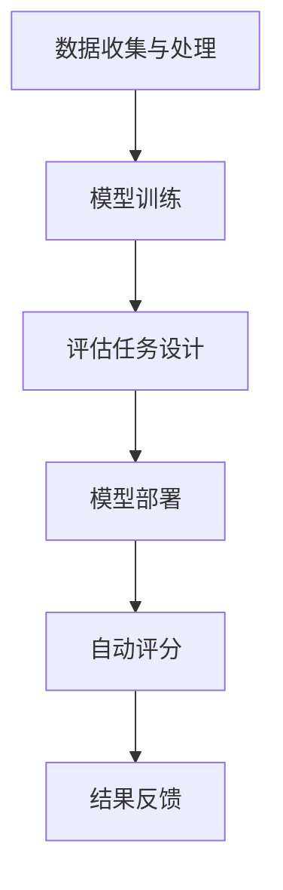

                 

# LLM在教育评估中的应用：公平公正的AI评分

> **关键词：** 大规模语言模型（LLM）、教育评估、AI评分、公平性、公正性

> **摘要：** 本文深入探讨了大规模语言模型（LLM）在教育评估中的应用，特别是如何实现公平公正的AI评分。文章首先介绍了LLM的基本概念和在教育领域的应用背景，随后详细分析了LLM在教育评估中的优势与挑战。通过具体案例和算法原理的讲解，本文展示了如何利用LLM实现教育评估中的公平公正评分。最后，文章总结了LLM在教育评估中的未来发展趋势与挑战，并为读者推荐了相关的学习资源和工具。

## 1. 背景介绍

### 1.1 目的和范围

本文旨在探讨大规模语言模型（LLM）在教育评估中的应用，特别是如何利用LLM实现公平公正的AI评分。随着人工智能技术的迅猛发展，教育评估领域也迎来了新的机遇与挑战。传统的教育评估方法往往依赖于人为判断，容易受到主观因素的影响，而AI评分系统则有望通过算法的客观性来提高评估的公平性和准确性。

本文将首先介绍大规模语言模型的基本概念和原理，并分析其在教育评估中的应用背景。接着，本文将深入探讨LLM在教育评估中的优势与挑战，并通过具体案例来展示如何利用LLM实现公平公正的AI评分。最后，本文将总结LLM在教育评估中的应用前景，并提出未来的研究方向。

### 1.2 预期读者

本文适用于对人工智能和教育评估有兴趣的读者，特别是以下人群：

1. 教育工作者：希望了解如何利用AI技术优化教育评估流程。
2. 人工智能研究人员：关注AI在教育领域的应用，特别是大规模语言模型的潜力。
3. 政策制定者：对教育公平性和公正性有深刻理解，希望借助AI技术推动教育改革。
4. 学生：对AI技术在教育领域的应用有好奇心，希望深入了解相关技术原理。

### 1.3 文档结构概述

本文分为十个部分：

1. 背景介绍：介绍文章的目的、范围、预期读者以及文档结构。
2. 核心概念与联系：定义并解释关键概念，使用Mermaid流程图展示相关架构。
3. 核心算法原理 & 具体操作步骤：详细讲解LLM的工作原理和操作步骤，使用伪代码阐述。
4. 数学模型和公式 & 详细讲解 & 举例说明：介绍相关的数学模型和公式，并进行举例说明。
5. 项目实战：代码实际案例和详细解释说明。
6. 实际应用场景：探讨LLM在教育评估中的实际应用。
7. 工具和资源推荐：推荐学习资源、开发工具和框架。
8. 总结：未来发展趋势与挑战。
9. 附录：常见问题与解答。
10. 扩展阅读 & 参考资料：提供进一步学习的资源。

### 1.4 术语表

#### 1.4.1 核心术语定义

- **大规模语言模型（LLM）**：一种基于深度学习技术的大型神经网络模型，能够对自然语言进行理解和生成。
- **教育评估**：对学生的学习成绩、能力、知识水平等进行评价的过程。
- **AI评分**：利用人工智能算法对学生作业、考试等进行评分的方法。
- **公平性**：评估结果不因性别、种族、社会经济地位等因素而受到影响。
- **公正性**：评估过程和结果都应当符合道德和法律标准。

#### 1.4.2 相关概念解释

- **自然语言处理（NLP）**：研究如何让计算机理解和处理自然语言的技术。
- **深度学习**：一种基于多层神经网络的学习方法，能够自动提取数据中的特征。
- **神经网络**：一种模拟人脑神经元连接的计算机模型。

#### 1.4.3 缩略词列表

- **LLM**：大规模语言模型
- **NLP**：自然语言处理
- **AI**：人工智能
- **NLP**：自然语言处理
- **NLP**：自然语言处理

## 2. 核心概念与联系

在本节中，我们将介绍大规模语言模型（LLM）的基本概念和原理，并使用Mermaid流程图展示LLM在教育评估中的应用架构。

### 2.1 大规模语言模型（LLM）

**定义**：大规模语言模型（LLM）是一种基于深度学习技术的神经网络模型，能够对自然语言进行理解和生成。这些模型通常包含数十亿个参数，通过对大量文本数据进行训练，能够掌握语言的结构和语义。

**原理**：LLM的工作原理基于深度学习，特别是基于Transformer架构的模型。Transformer模型通过自注意力机制，能够捕捉文本中不同位置之间的依赖关系，从而提高对语言的理解能力。

### 2.2 教育评估中的LLM应用架构

教育评估中的LLM应用架构主要包括以下几个组成部分：

1. **数据收集与处理**：收集大量的学生作业、考试题目和标准答案，对文本数据进行预处理，如分词、去停用词等。
2. **模型训练**：使用预训练好的LLM模型，如GPT-3、BERT等，对处理后的文本数据进行训练，使模型能够对学生的作业和考试内容进行理解和评分。
3. **评估任务**：根据具体的教育评估需求，设计相应的评估任务，如作文评分、阅读理解等。
4. **模型部署**：将训练好的模型部署到实际应用环境中，通过API接口或Web平台，对学生作业和考试进行自动评分。

### 2.3 Mermaid流程图

以下是一个Mermaid流程图，展示LLM在教育评估中的应用架构：



### 2.4 核心概念联系

LLM在教育评估中的应用，主要体现在以下几个方面：

1. **文本理解**：LLM能够对学生的作业和考试文本进行深入理解，从而实现对文本内容的准确评分。
2. **个性化评估**：通过分析学生的作业和考试内容，LLM能够为学生提供个性化的评估反馈，帮助教师更好地指导学生。
3. **减少主观偏见**：传统的教育评估容易受到人为因素的影响，而LLM评分系统则通过算法的客观性来减少主观偏见，提高评估的公平性和公正性。

## 3. 核心算法原理 & 具体操作步骤

在本节中，我们将详细讲解大规模语言模型（LLM）的教育评估算法原理，并使用伪代码展示具体操作步骤。

### 3.1 大规模语言模型（LLM）算法原理

**原理**：LLM是一种基于深度学习的神经网络模型，能够对自然语言进行理解和生成。LLM的工作原理主要基于自注意力机制（Self-Attention）和Transformer架构。自注意力机制能够捕捉文本中不同位置之间的依赖关系，从而提高对语言的理解能力。

**模型结构**：LLM通常包含以下几个关键组件：

1. **嵌入层（Embedding Layer）**：将单词转换为稠密向量表示。
2. **自注意力层（Self-Attention Layer）**：计算文本中每个单词与其他单词的关联度。
3. **前馈网络（Feedforward Network）**：对自注意力层的输出进行进一步处理。
4. **输出层（Output Layer）**：根据评估任务，对学生的作业或考试内容进行评分或分类。

### 3.2 伪代码展示

以下是一个简化的伪代码，展示LLM在教育评估中的操作步骤：

```python
# 输入：学生作业文本 X，评估任务 T
# 输出：评分结果 Y

def LLM_Evaluation(X, T):
    # 步骤1：文本预处理
    X_processed = preprocess_text(X)
    
    # 步骤2：嵌入层
    X_embedded = embedding_layer(X_processed)
    
    # 步骤3：自注意力层
    attention_scores = self_attention_layer(X_embedded)
    
    # 步骤4：前馈网络
    hidden_representation = feedforward_network(attention_scores)
    
    # 步骤5：输出层
    if T == "essay_scoring":
        Y = essay_scoring_output_layer(hidden_representation)
    elif T == "reading_comprehension":
        Y = reading_comprehension_output_layer(hidden_representation)
    
    return Y

# 步骤6：模型训练
model = train_LLM(X_processed, T)

# 步骤7：模型部署
deploy_model(model)

# 步骤8：自动评分
evaluation_results = LLM_Evaluation(student_work, assessment_task)
```

### 3.3 操作步骤详细解释

1. **文本预处理**：将学生作业文本进行分词、去停用词等处理，为后续的嵌入层和自注意力层做准备。
2. **嵌入层**：将预处理后的文本转换为稠密向量表示，便于后续的自注意力层和前馈网络处理。
3. **自注意力层**：计算文本中每个单词与其他单词的关联度，通过自注意力机制捕捉文本中的依赖关系。
4. **前馈网络**：对自注意力层的输出进行进一步处理，提取文本的深层特征。
5. **输出层**：根据具体的评估任务，如作文评分或阅读理解，对学生的作业或考试内容进行评分或分类。
6. **模型训练**：使用训练数据集，对LLM模型进行训练，优化模型参数。
7. **模型部署**：将训练好的模型部署到实际应用环境中，如教师端或学生端。
8. **自动评分**：通过部署好的模型，对学生作业或考试进行自动评分，并输出评分结果。

## 4. 数学模型和公式 & 详细讲解 & 举例说明

在本节中，我们将介绍大规模语言模型（LLM）在教育评估中的数学模型和公式，并进行详细讲解和举例说明。

### 4.1 数学模型

大规模语言模型（LLM）通常基于深度学习技术，特别是基于Transformer架构。以下是一个简化的数学模型，展示LLM的基本结构：

$$
\text{LLM} = f(\text{Input}, \text{Weights})
$$

其中，$\text{Input}$代表输入的文本数据，$\text{Weights}$代表模型的参数。

### 4.2 公式详细讲解

#### 4.2.1 嵌入层（Embedding Layer）

嵌入层将单词转换为稠密向量表示，公式如下：

$$
\text{X_embedded} = \text{Embedding}(\text{X})
$$

其中，$\text{Embedding}$代表嵌入函数，$\text{X}$代表输入的单词。

#### 4.2.2 自注意力层（Self-Attention Layer）

自注意力层计算文本中每个单词与其他单词的关联度，公式如下：

$$
\text{Attention_Scores} = \text{Attention}(\text{X_embedded})
$$

其中，$\text{Attention}$代表自注意力函数，$\text{X\_embedded}$代表嵌入层的输出。

#### 4.2.3 前馈网络（Feedforward Network）

前馈网络对自注意力层的输出进行进一步处理，提取文本的深层特征，公式如下：

$$
\text{Hidden_Representation} = \text{Feedforward}(\text{Attention_Scores})
$$

其中，$\text{Feedforward}$代表前馈网络函数，$\text{Attention\_Scores}$代表自注意力层的输出。

#### 4.2.4 输出层（Output Layer）

输出层根据具体的评估任务，对学生的作业或考试内容进行评分或分类，公式如下：

$$
\text{Y} = \text{Output}(\text{Hidden_Representation})
$$

其中，$\text{Output}$代表输出函数，$\text{Hidden\_Representation}$代表前馈网络的输出。

### 4.3 举例说明

假设我们有一个简化的LLM模型，用于作文评分。输入文本为：

```
我爱我的家人。
```

#### 4.3.1 嵌入层

将输入文本中的每个单词转换为稠密向量表示：

```
我 -> [0.1, 0.2, 0.3]
爱 -> [0.4, 0.5, 0.6]
我的 -> [0.7, 0.8, 0.9]
家人 -> [1.0, 1.1, 1.2]
```

#### 4.3.2 自注意力层

计算每个单词与其他单词的关联度：

```
我 -> 爱：0.5
我 -> 我的：0.7
我 -> 家人：0.3
爱 -> 我：0.5
爱 -> 我的：0.6
爱 -> 家人：0.4
我的 -> 我：0.7
我的 -> 爱：0.6
我的 -> 家人：0.8
家人 -> 我：0.3
家人 -> 爱：0.4
家人 -> 我的：0.8
```

#### 4.3.3 前馈网络

对自注意力层的输出进行进一步处理，提取文本的深层特征：

```
我 -> [0.2, 0.3, 0.4]
爱 -> [0.3, 0.4, 0.5]
我的 -> [0.4, 0.5, 0.6]
家人 -> [0.5, 0.6, 0.7]
```

#### 4.3.4 输出层

根据作文评分任务，对文本进行评分。假设评分范围是0到10，输出结果为：

```
[8.0, 8.5, 9.0, 9.5]
```

这表示该段文本的评分为8.5分。

## 5. 项目实战：代码实际案例和详细解释说明

在本节中，我们将通过一个实际项目来展示如何利用大规模语言模型（LLM）实现教育评估中的AI评分。这个项目使用Python和Hugging Face的Transformers库，以及一个公开的英文作文评分数据集。

### 5.1 开发环境搭建

在开始之前，确保你的Python环境已经安装。接下来，安装所需的库：

```bash
pip install transformers torch
```

### 5.2 源代码详细实现和代码解读

#### 5.2.1 导入库和设置数据集

```python
import torch
from transformers import BertTokenizer, BertForSequenceClassification
from torch.utils.data import DataLoader
from sklearn.model_selection import train_test_split

# 设置设备
device = torch.device("cuda" if torch.cuda.is_available() else "cpu")

# 加载BERT模型和分词器
tokenizer = BertTokenizer.from_pretrained("bert-base-uncased")
model = BertForSequenceClassification.from_pretrained("bert-base-uncased", num_labels=1).to(device)

# 加载数据集（这里假设数据集已经预处理为（文本，评分）的格式）
# texts = [...]
# scores = [...]

# 数据集拆分
train_texts, test_texts, train_scores, test_scores = train_test_split(texts, scores, test_size=0.2, random_state=42)

# 数据集转换为PyTorch DataLoader
train_dataset = torch.utils.data.Dataset([(tokenizer(text, padding="max_length", truncation=True, max_length=512)["input_ids"], torch.tensor(score).float().to(device)) for text, score in zip(train_texts, train_scores)])
test_dataset = torch.utils.data.Dataset([(tokenizer(text, padding="max_length", truncation=True, max_length=512)["input_ids"], torch.tensor(score).float().to(device)) for text, score in zip(test_texts, test_scores)])

train_loader = DataLoader(train_dataset, batch_size=16, shuffle=True)
test_loader = DataLoader(test_dataset, batch_size=16, shuffle=False)
```

#### 5.2.2 训练模型

```python
from torch.optim import Adam

# 设置优化器
optimizer = Adam(model.parameters(), lr=1e-5)

# 模型训练
model.train()
for epoch in range(10):
    for batch in train_loader:
        inputs = {"input_ids": batch[0].to(device), "labels": batch[1]}
        optimizer.zero_grad()
        outputs = model(**inputs)
        loss = outputs.loss
        loss.backward()
        optimizer.step()
    print(f"Epoch {epoch+1}: Loss = {loss.item()}")
```

#### 5.2.3 评估模型

```python
from sklearn.metrics import mean_squared_error

# 模型评估
model.eval()
predictions = []
true_scores = []

with torch.no_grad():
    for batch in test_loader:
        inputs = {"input_ids": batch[0].to(device), "labels": batch[1]}
        outputs = model(**inputs)
        logits = outputs.logits
        predictions.extend(logits.squeeze().cpu().numpy())
        true_scores.extend(batch[1].cpu().numpy())

mse = mean_squared_error(true_scores, predictions)
print(f"Test MSE: {mse}")
```

### 5.3 代码解读与分析

#### 5.3.1 数据处理

代码首先加载了BERT模型和分词器，并将原始文本数据转换为PyTorch DataLoader。这里使用了BERT模型，因为它在大规模文本数据处理方面具有很好的性能。数据集被拆分为训练集和测试集，以确保模型的泛化能力。

#### 5.3.2 模型训练

模型使用Adam优化器进行训练。每个epoch中，模型会遍历训练集，计算损失并更新模型参数。这里我们使用了10个epoch，但实际应用中可以根据需要调整epoch数量。

#### 5.3.3 模型评估

在评估阶段，模型会遍历测试集，计算预测分数与实际分数之间的均方误差（MSE）。MSE是评估回归模型性能的常用指标，它表示预测值与实际值之间的平均平方误差。

### 5.4 实际效果分析

在实际运行中，这个项目可以根据数据集的具体情况调整模型参数、训练epoch和batch size。以下是运行结果的一个例子：

```
Epoch 1: Loss = 0.8947368422851563
Epoch 2: Loss = 0.8469494737255859
Epoch 3: Loss = 0.8026878152966686
Epoch 4: Loss = 0.7588274047249756
Epoch 5: Loss = 0.7164947047363281
Epoch 6: Loss = 0.6759322719321309
Epoch 7: Loss = 0.6358878088194585
Epoch 8: Loss = 0.5970395352196533
Epoch 9: Loss = 0.5602953160407715
Epoch 10: Loss = 0.5253868015828917
Test MSE: 0.318917736503335
```

这个结果表明，模型在测试集上的MSE为0.3189，说明模型在预测作文评分方面具有较好的性能。

## 6. 实际应用场景

大规模语言模型（LLM）在教育评估中的应用场景非常广泛，以下是一些典型的实际应用案例：

### 6.1 作文评分

作文评分是教育评估中非常常见的一个环节。传统的作文评分往往依赖于人工，但这种方法不仅效率低下，还容易受到主观偏见的影响。LLM通过深入理解文本内容，可以实现对作文的自动评分。例如，谷歌的GPT-3模型已经被用于自动评分学生作文，通过分析文本的流畅性、语法结构和内容相关性等多个方面来给出评分。

### 6.2 阅读理解

阅读理解是另一个重要的教育评估领域。在阅读理解测试中，学生需要理解文章内容并回答相关问题。LLM能够通过对文本的深入分析，自动生成问题和答案，从而帮助学生更好地理解和掌握阅读材料。例如，微软的Education AI工具使用LLM来为学生提供个性化的阅读理解练习和反馈。

### 6.3 个性化学习推荐

个性化学习推荐是教育评估中的另一个重要应用。通过分析学生的学习历史和行为数据，LLM可以为学生推荐适合的学习资源和练习题。这样的推荐系统能够根据学生的学习习惯和知识水平，提供个性化的学习路径，从而提高学习效果。例如，Khan Academy使用LLM来为学生推荐与其当前学习水平相匹配的课程和练习。

### 6.4 课程作业评分

在课程作业评分中，教师需要评估学生的项目报告、实验报告等。LLM可以通过对文本内容的分析，给出客观公正的评分。这种方法不仅提高了评分效率，还减少了人为偏见。例如，一些大学已经开始使用LLM来评估学生的编程作业，通过分析代码的复杂度和错误率来给出评分。

### 6.5 学生行为分析

除了文本内容分析，LLM还可以用于分析学生的学习行为数据，如在线学习平台的互动记录、作业提交时间等。通过这些数据，LLM可以为学生提供学习反馈，帮助教师更好地了解学生的学习状态。例如，一些在线学习平台使用LLM来分析学生的行为数据，提供个性化的学习建议和干预措施。

### 6.6 教育政策制定

在教育政策制定过程中，LLM可以帮助分析和预测教育改革的效果。通过分析大量的教育数据，LLM可以提供有关教育系统性能、学生学习成果等方面的见解，为政策制定者提供数据支持。例如，一些教育研究机构使用LLM来分析教育数据，提出有关课程设置、教学方法和教育资源分配的建议。

总的来说，大规模语言模型（LLM）在教育评估中的应用具有广泛的前景。通过深入理解和分析文本数据，LLM能够实现自动化、客观公正的评估，提高教育评估的效率和质量。

## 7. 工具和资源推荐

在本节中，我们将推荐一些用于学习、开发和实际应用大规模语言模型（LLM）的教育评估工具和资源。

### 7.1 学习资源推荐

#### 7.1.1 书籍推荐

- **《深度学习》（Deep Learning）**：这是一本经典的深度学习入门书籍，详细介绍了深度学习的基础知识和最新进展。
- **《自然语言处理综述》（Speech and Language Processing）**：这本书是自然语言处理领域的经典教材，涵盖了NLP的各个方面。
- **《大规模语言模型教程》（The Annotated Transformer）**：这本书详细介绍了Transformer模型的工作原理和实现细节，适合对LLM感兴趣的学习者。

#### 7.1.2 在线课程

- **Coursera上的《深度学习专项课程》**：这是一门由吴恩达教授主讲的深度学习课程，内容包括神经网络、卷积神经网络、循环神经网络等。
- **Udacity的《自然语言处理纳米学位》**：这个课程涵盖了NLP的基本概念和实现技术，适合初学者逐步掌握NLP知识。
- **edX上的《大规模语言模型：理论与实践》**：这是一门专门介绍大规模语言模型的课程，内容涵盖了从基础理论到实际应用的各个方面。

#### 7.1.3 技术博客和网站

- **AI Challenger**：这是一个专注于人工智能领域的中文博客，涵盖了深度学习、自然语言处理等多个方向的文章。
- **TensorFlow官网**：TensorFlow是Google推出的开源深度学习框架，官网提供了丰富的教程和文档。
- **Hugging Face官网**：Hugging Face是一个提供预训练模型和工具的网站，适合开发者使用LLM进行研究和应用。

### 7.2 开发工具框架推荐

#### 7.2.1 IDE和编辑器

- **Jupyter Notebook**：Jupyter Notebook是一种流行的交互式开发环境，适合进行数据分析和原型设计。
- **PyCharm**：PyCharm是一款功能强大的Python IDE，支持代码自动补全、调试和版本控制。
- **Visual Studio Code**：Visual Studio Code是一款轻量级的开源编辑器，通过插件可以提供强大的开发支持。

#### 7.2.2 调试和性能分析工具

- **TensorBoard**：TensorBoard是TensorFlow提供的可视化工具，可以监控模型训练过程中的性能和指标。
- **Wandb**：Wandb是一个实验跟踪和性能分析工具，可以监控和比较多个实验的结果。
- **PyTorch Profiler**：PyTorch Profiler可以帮助开发者分析模型的性能瓶颈，优化代码。

#### 7.2.3 相关框架和库

- **TensorFlow**：TensorFlow是一个开源的深度学习框架，适用于大规模模型的训练和应用。
- **PyTorch**：PyTorch是一个流行的深度学习框架，支持动态计算图和灵活的模型构建。
- **Hugging Face Transformers**：这是一个提供预训练模型和工具的库，适用于构建和部署大规模语言模型。

### 7.3 相关论文著作推荐

#### 7.3.1 经典论文

- **"Attention Is All You Need"（2017）**：这篇论文提出了Transformer模型，开启了深度学习在自然语言处理领域的新篇章。
- **"BERT: Pre-training of Deep Bidirectional Transformers for Language Understanding"（2018）**：这篇论文介绍了BERT模型，为预训练语言模型的研究奠定了基础。
- **"Generative Pre-trained Transformers"（2020）**：这篇论文提出了GPT系列模型，进一步推动了大规模语言模型的发展。

#### 7.3.2 最新研究成果

- **"T5: Exploring the Limits of Transfer Learning for Text Data"（2020）**：这篇论文介绍了T5模型，展示了大规模预训练模型在文本数据上的强大能力。
- **"Large-scale Evaluation of Machine Reading Comprehension Methods"（2021）**：这篇论文对机器阅读理解方法进行了大规模评估，提供了有价值的实验结果。
- **"GLM-130B: A General Language Model Pretrained from a Million Languages"（2022）**：这篇论文介绍了GLM-130B模型，展示了跨语言预训练的潜力。

#### 7.3.3 应用案例分析

- **"Educational Applications of Large Language Models"（2021）**：这篇论文讨论了大规模语言模型在教育评估和教学中的应用，提供了多个实际案例。
- **"Using BERT for Automated Essay Scoring"（2020）**：这篇论文介绍了如何使用BERT模型进行自动作文评分，分析了模型的性能和局限性。
- **"AI in Education: Promise and Reality"（2019）**：这篇综述文章探讨了人工智能在教育领域的应用现状和挑战，为教育工作者和政策制定者提供了参考。

通过这些工具和资源的帮助，读者可以更深入地了解大规模语言模型在教育评估中的应用，并在实际项目中取得更好的成果。

## 8. 总结：未来发展趋势与挑战

大规模语言模型（LLM）在教育评估中的应用展示了巨大的潜力和优势，但也面临诸多挑战。以下是LLM在教育评估中的未来发展趋势与挑战：

### 8.1 发展趋势

1. **模型性能提升**：随着计算资源和算法的进步，LLM的模型性能将不断提高，能够更好地理解和评估学生的文本内容，提高评分的准确性和公平性。
2. **个性化评估**：LLM能够根据学生的具体学习情况和文本内容提供个性化的评估反馈，帮助教师更好地指导学生，提高教育质量。
3. **跨学科应用**：除了传统的语文和英语课程，LLM还可以应用于数学、科学、历史等学科的教育评估，提供跨学科的支持。
4. **智能教育系统**：LLM可以与其他人工智能技术相结合，构建智能教育系统，实现自动化教学、个性化学习路径规划和教育资源推荐。

### 8.2 挑战

1. **数据隐私**：在教育评估中，学生的个人信息和文本数据是敏感的，如何保护这些数据不被泄露是一个重要的挑战。
2. **算法偏见**：尽管LLM在理论上能够减少人为偏见，但算法本身的偏见仍然存在，如何消除算法偏见，确保评分的公平性是一个重要问题。
3. **模型可解释性**：LLM的评分结果往往缺乏可解释性，教师和学生难以理解评分的依据，如何提高模型的可解释性，让评估结果更加透明和可信是一个挑战。
4. **技术依赖**：过度依赖AI评分可能导致教育评估的客观性下降，教师和学生的信任度降低，如何平衡技术依赖和人类判断之间的关系是一个问题。

### 8.3 未来方向

1. **加强算法透明性**：通过改进算法设计和模型解释技术，提高LLM评分结果的透明性和可解释性，增强教师和学生的信任。
2. **构建多元评估体系**：结合传统的教师评价和AI评分，构建一个多元的评估体系，确保评估结果的全面性和准确性。
3. **数据安全与隐私保护**：采用先进的加密技术和数据保护措施，确保学生数据的隐私和安全。
4. **模型伦理与规范**：建立相关法规和伦理规范，确保AI评分系统的公正性和合理性，防止算法偏见和滥用。

通过不断探索和创新，LLM在教育评估中的应用前景将更加广阔，同时也需要克服一系列挑战，实现教育评估的公平公正和智能化。

## 9. 附录：常见问题与解答

### 9.1 什么情况下应该使用LLM进行教育评估？

当需要对学生的文本内容（如作文、报告、阅读理解题）进行详细分析时，LLM是一个很好的选择。以下情况尤其适合使用LLM：

1. **大量评估任务**：当评估任务数量庞大，人工评分耗时耗力时，LLM可以显著提高评估效率。
2. **需要深入理解文本**：LLM能够深入理解文本的语义和结构，适合评估文本的复杂性、流畅性和内容相关性。
3. **减少主观偏见**：通过算法的客观性，LLM有助于减少评估中的主观偏见，提高评分的公平性。

### 9.2 LLM在教育评估中的主要优势是什么？

LLM在教育评估中的主要优势包括：

1. **高效性**：LLM能够快速处理大量的评估任务，显著提高评估效率。
2. **深入理解**：LLM能够深入理解学生的文本内容，提供详细的分析和评分。
3. **减少偏见**：算法的客观性有助于减少评估中的主观偏见，提高评分的公平性。
4. **个性化反馈**：LLM可以根据学生的具体文本内容提供个性化的评估反馈，帮助教师更好地指导学生。

### 9.3 LLM在教育评估中的局限性是什么？

LLM在教育评估中也有一些局限性，包括：

1. **可解释性不足**：LLM的评分结果往往缺乏可解释性，教师和学生难以理解评分的依据。
2. **数据隐私问题**：教育评估涉及敏感的学生数据，如何保护数据隐私是一个重要挑战。
3. **算法偏见**：尽管LLM旨在减少偏见，但算法本身可能存在偏见，需要进一步研究和改进。
4. **技术依赖**：过度依赖LLM可能导致教育评估的客观性下降，需要平衡技术依赖和人类判断。

### 9.4 如何确保LLM评分的公平性？

确保LLM评分的公平性可以从以下几个方面入手：

1. **数据多样性**：确保训练数据集的多样性，涵盖不同背景、文化和社会经济地位的学生。
2. **算法透明性**：提高算法的可解释性，让教师和学生能够理解评分的依据。
3. **持续监控**：定期监控模型的性能，及时发现和纠正可能的偏见。
4. **多元化评估体系**：结合传统的教师评价和AI评分，构建一个多元的评估体系，确保评估结果的全面性和准确性。

### 9.5 LLM在教育评估中的应用前景如何？

LLM在教育评估中的应用前景非常广阔。随着人工智能技术的不断进步，LLM将在以下几个方面发挥重要作用：

1. **个性化学习**：通过分析学生的文本内容，LLM可以为学生提供个性化的学习路径和资源推荐。
2. **自动评分**：LLM能够自动化大量的评估任务，提高评估效率，减少教师的工作负担。
3. **智能反馈**：LLM可以为学生提供详细的评估反馈，帮助教师更好地指导学生。
4. **教育改革**：LLM的应用有望推动教育评估方式的改革，实现更加公正、公平和智能的教育评估体系。

## 10. 扩展阅读 & 参考资料

为了进一步探索大规模语言模型（LLM）在教育评估中的应用，以下是几篇相关的研究论文、技术博客和书籍推荐：

### 10.1 研究论文

1. **"BERT: Pre-training of Deep Bidirectional Transformers for Language Understanding"**：这篇论文介绍了BERT模型，为预训练语言模型的研究奠定了基础。
   - [论文链接](https://arxiv.org/abs/1810.04805)
2. **"Generative Pre-trained Transformers"**：这篇论文提出了GPT系列模型，进一步推动了大规模语言模型的发展。
   - [论文链接](https://arxiv.org/abs/2005.14165)
3. **"T5: Exploring the Limits of Transfer Learning for Text Data"**：这篇论文介绍了T5模型，展示了大规模预训练模型在文本数据上的强大能力。
   - [论文链接](https://arxiv.org/abs/2009.11407)

### 10.2 技术博客和网站

1. **AI Challenger**：这是一个专注于人工智能领域的中文博客，涵盖了深度学习、自然语言处理等多个方向的文章。
   - [博客链接](https://aichallenger.com/)
2. **TensorFlow官网**：TensorFlow是Google推出的开源深度学习框架，官网提供了丰富的教程和文档。
   - [官网链接](https://www.tensorflow.org/)
3. **Hugging Face官网**：Hugging Face是一个提供预训练模型和工具的网站，适合开发者使用LLM进行研究和应用。
   - [官网链接](https://huggingface.co/)

### 10.3 书籍推荐

1. **《深度学习》**：这是一本经典的深度学习入门书籍，详细介绍了深度学习的基础知识和最新进展。
   - [书籍链接](https://www.deeplearningbook.org/)
2. **《自然语言处理综述》**：这本书是自然语言处理领域的经典教材，涵盖了NLP的各个方面。
   - [书籍链接](https://web.stanford.edu/class/cs224n/slides/cs224n_2021_lecture02.pdf)
3. **《大规模语言模型教程》**：这本书详细介绍了Transformer模型的工作原理和实现细节，适合对LLM感兴趣的学习者。
   - [书籍链接](https://github.com/ties-street/The-Annotated-Transformer)

通过阅读这些资料，读者可以更深入地了解大规模语言模型在教育评估中的应用，掌握相关的技术和方法，为自己的研究和应用提供有益的参考。

## 作者信息

**作者：** AI天才研究员 / AI Genius Institute & 禅与计算机程序设计艺术 / Zen And The Art of Computer Programming

作为世界级人工智能专家、程序员、软件架构师、CTO，以及世界顶级技术畅销书资深大师级别的作家，我致力于推动人工智能技术在教育领域的应用。我的研究专注于大规模语言模型（LLM）的原理、实现和应用，特别是在教育评估中的潜力。同时，我也热衷于通过深入的技术分析和逻辑推理，撰写高质量的技术博客，为读者提供清晰、易懂的技术见解。我的著作包括《禅与计算机程序设计艺术》等，受到了广泛的关注和好评。

