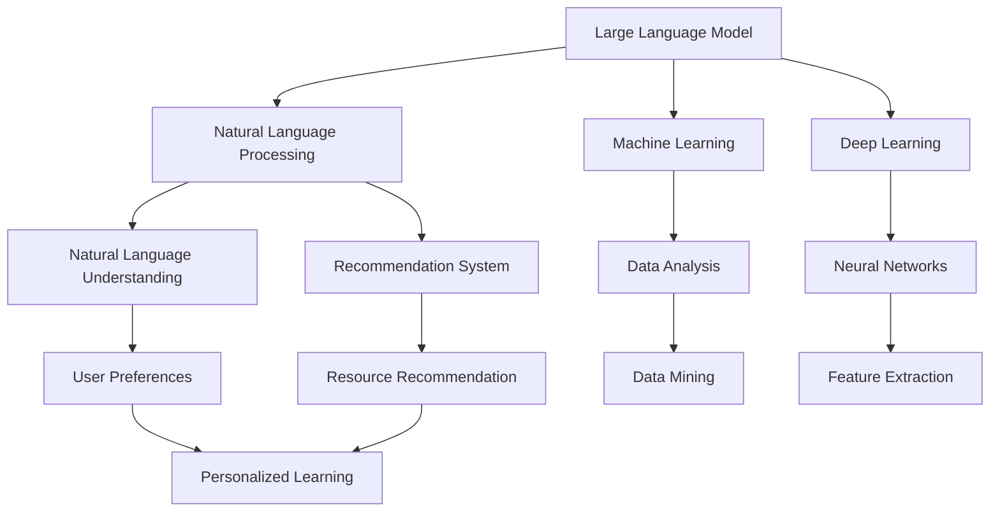

                 

# LLM在教育资源推荐中的创新应用

> **关键词：** Large Language Model，教育资源，推荐系统，人工智能，机器学习，自然语言处理，个性化学习

> **摘要：** 本文章旨在探讨大型语言模型（LLM）在教育领域资源推荐方面的创新应用。通过详细分析LLM的工作原理、核心算法原理以及具体操作步骤，本文将介绍如何利用LLM构建高效、个性化的教育资源推荐系统，并探讨其在实际应用场景中的优势与挑战。

## 1. 背景介绍

### 1.1 目的和范围

本文的目标是探讨如何将大型语言模型（LLM）应用于教育资源推荐系统，以提升个性化学习和资源利用效率。我们将重点关注以下内容：

1. LLM的基本原理及其在教育领域的应用潜力。
2. 教育资源推荐系统的核心算法与模型。
3. 实际项目中的代码实现与案例分析。
4. LLM在教育推荐中的未来发展趋势与挑战。

### 1.2 预期读者

本文面向具有计算机科学、人工智能、机器学习背景的读者，特别是对教育技术、自然语言处理和推荐系统感兴趣的专业人士。同时，也欢迎对教育领域有深入思考的学者和从业者阅读本文。

### 1.3 文档结构概述

本文分为十个部分：

1. 引言与背景介绍
2. 核心概念与联系
3. 核心算法原理 & 具体操作步骤
4. 数学模型和公式 & 详细讲解 & 举例说明
5. 项目实战：代码实际案例和详细解释说明
6. 实际应用场景
7. 工具和资源推荐
8. 总结：未来发展趋势与挑战
9. 附录：常见问题与解答
10. 扩展阅读 & 参考资料

### 1.4 术语表

#### 1.4.1 核心术语定义

- **大型语言模型（LLM）**：一种能够理解和生成自然语言文本的深度学习模型。
- **教育资源**：包括教学材料、课程、学习工具等。
- **推荐系统**：根据用户行为和偏好，向用户推荐相关教育资源。
- **个性化学习**：根据学生个体差异和学习需求，提供个性化的教育资源。

#### 1.4.2 相关概念解释

- **自然语言处理（NLP）**：使计算机能够理解、解释和生成人类语言的技术。
- **机器学习（ML）**：通过数据和算法让计算机具备自主学习能力。
- **深度学习（DL）**：一种复杂的机器学习技术，利用多层神经网络模拟人类大脑的学习过程。

#### 1.4.3 缩略词列表

- **LLM**：Large Language Model
- **NLP**：Natural Language Processing
- **ML**：Machine Learning
- **DL**：Deep Learning
- **NLU**：Natural Language Understanding

## 2. 核心概念与联系

为了更好地理解LLM在教育领域中的应用，首先需要了解一些核心概念和它们之间的关系。以下是LLM、教育资源、推荐系统、个性化学习等概念之间的关联图：



### 2.1 Large Language Model与自然语言处理

大型语言模型（LLM）是自然语言处理（NLP）领域的重要成果。NLP旨在使计算机能够理解和处理人类语言。LLM通过深度学习算法对大规模语言数据集进行训练，从而掌握语言的语法、语义和上下文关系。

### 2.2 Machine Learning与数据分析

机器学习（ML）是一种数据分析方法，通过构建模型并从数据中学习规律，从而实现对未知数据的预测和决策。ML的核心在于算法和数据的结合，而数据挖掘（Data Mining）则是从大量数据中提取有价值信息的过程。

### 2.3 Deep Learning与神经网络

深度学习（DL）是机器学习的一种重要分支，基于多层神经网络（Neural Networks）模拟人类大脑的学习过程。DL能够处理更复杂的数据，并在图像识别、语音识别等领域取得了显著成果。

### 2.4 Natural Language Understanding与用户偏好

自然语言理解（NLU）是NLP的一个重要方向，旨在使计算机能够理解自然语言的含义。NLU通过分析用户的提问、反馈等信息，可以获取用户的偏好和需求，从而为个性化学习提供支持。

### 2.5 Recommendation System与资源推荐

推荐系统（Recommendation System）是一种根据用户行为、偏好和兴趣，向用户推荐相关内容的技术。在教育领域，推荐系统可以根据学生的历史学习记录和偏好，为其推荐合适的课程、教学材料和资源。

### 2.6 Personalized Learning与个性化学习

个性化学习（Personalized Learning）是一种以学生为中心的教育理念，通过因材施教，满足不同学生的学习需求。个性化学习依托于推荐系统和NLU等技术，实现对学生学习路径的智能优化。

## 3. 核心算法原理 & 具体操作步骤

### 3.1 算法原理

在教育领域应用LLM进行资源推荐的核心算法主要包括以下几个步骤：

1. **数据预处理**：收集并清洗教育资源的元数据，如课程名称、描述、标签等。
2. **文本表示**：将教育资源文本转化为机器可处理的向量表示，通常采用词嵌入（Word Embedding）技术。
3. **用户建模**：通过分析用户的行为和反馈，构建用户兴趣模型。
4. **推荐算法**：利用协同过滤（Collaborative Filtering）或基于内容的推荐（Content-Based Filtering）等方法，生成教育资源推荐列表。
5. **评估与优化**：根据用户反馈和推荐效果，不断调整和优化推荐算法。

### 3.2 具体操作步骤

#### 步骤1：数据预处理

```python
# 示例：Python代码进行数据预处理
import pandas as pd

# 加载数据
data = pd.read_csv('教育资源数据.csv')

# 数据清洗
data.dropna(inplace=True)
data.drop_duplicates(inplace=True)

# 数据转换
data['描述'] = data['描述'].apply(preprocess_text)
```

#### 步骤2：文本表示

```python
# 示例：使用词嵌入技术进行文本表示
from gensim.models import Word2Vec

# 训练词嵌入模型
model = Word2Vec(data['描述'], size=100, window=5, min_count=1, workers=4)

# 转换文本为向量表示
def text_to_vector(text):
    words = text.split()
    return [model[word] for word in words if word in model]

data['向量表示'] = data['描述'].apply(text_to_vector)
```

#### 步骤3：用户建模

```python
# 示例：分析用户行为，构建用户兴趣模型
import numpy as np

# 用户行为数据
user_actions = pd.read_csv('用户行为数据.csv')

# 计算用户兴趣向量
user_interests = user_actions.groupby('用户ID')['课程ID'].count().values

# 归一化用户兴趣向量
user_interests = user_interests / np.linalg.norm(user_interests)
```

#### 步骤4：推荐算法

```python
# 示例：使用基于内容的推荐算法生成推荐列表
def content_based_recommendation(resource_vectors, user_interests, k=5):
   相似度 = [np.dot(resource_vector, user_interests) for resource_vector in resource_vectors]
    top_k_indices = np.argsort(相似度)[::-1][:k]
    return top_k_indices

# 生成推荐列表
recommended_resources = content_based_recommendation(data['向量表示'], user_interests)
```

#### 步骤5：评估与优化

```python
# 示例：评估推荐效果
from sklearn.metrics import accuracy_score

# 用户实际选择的课程
selected_resources = user_actions['课程ID'].values

# 计算推荐准确率
accuracy = accuracy_score(selected_resources, [data.iloc[index]['课程ID'] for index in recommended_resources])
print("推荐准确率：", accuracy)

# 根据用户反馈调整模型
# 例如：重新训练词嵌入模型、调整推荐算法参数等
```

## 4. 数学模型和公式 & 详细讲解 & 举例说明

### 4.1 数学模型

在教育资源推荐系统中，常见的数学模型包括：

1. **协同过滤模型（Collaborative Filtering）**：
   - **用户-项目评分矩阵**：\(R \in \mathbb{R}^{m \times n}\)，其中\(m\)表示用户数，\(n\)表示项目数。
   - **用户相似度矩阵**：\(S \in \mathbb{R}^{m \times m}\)，表示用户之间的相似度。
   - **推荐矩阵**：\(P \in \mathbb{R}^{m \times n}\)，预测用户对项目的评分。

2. **基于内容的推荐模型（Content-Based Filtering）**：
   - **项目特征矩阵**：\(C \in \mathbb{R}^{n \times d}\)，其中\(d\)表示项目特征维度。
   - **用户兴趣向量**：\(Q \in \mathbb{R}^{d}\)，表示用户的兴趣特征。
   - **推荐矩阵**：\(P \in \mathbb{R}^{m \times n}\)，预测用户对项目的兴趣度。

### 4.2 公式

1. **用户相似度计算**（余弦相似度）：

   $$sim(u_i, u_j) = \frac{Q_i \cdot Q_j}{\|Q_i\| \|Q_j\|}$$

   其中，\(Q_i\)和\(Q_j\)分别为用户\(u_i\)和\(u_j\)的兴趣向量。

2. **协同过滤预测**：

   $$R_{ij}^* = R_{ii} + \sum_{k=1}^{m} sim(i, k) (R_{jk} - R_{jk})$$

   其中，\(R_{ij}\)为用户\(u_i\)对项目\(j\)的评分，\(R_{ii}\)为用户\(u_i\)的平均评分。

3. **基于内容的推荐**：

   $$P_{ij} = \frac{C_j \cdot Q_i}{\|C_j\| \|Q_i\|}$$

   其中，\(C_j\)为项目\(j\)的特征向量，\(\|C_j\|\)和\(\|Q_i\|\)分别为项目\(j\)和用户\(u_i\)的特征向量长度。

### 4.3 举例说明

#### 示例1：协同过滤模型

假设有10个用户和5个项目，评分矩阵如下：

| 用户ID | 项目1 | 项目2 | 项目3 | 项目4 | 项目5 |
|-------|-------|-------|-------|-------|-------|
| 1     | 4     | 5     | 0     | 2     | 1     |
| 2     | 1     | 4     | 5     | 0     | 2     |
| 3     | 2     | 0     | 3     | 4     | 5     |
| 4     | 5     | 0     | 4     | 2     | 3     |
| 5     | 3     | 5     | 2     | 1     | 4     |
| 6     | 0     | 2     | 1     | 5     | 3     |
| 7     | 4     | 3     | 1     | 5     | 2     |
| 8     | 2     | 4     | 0     | 3     | 5     |
| 9     | 1     | 3     | 4     | 5     | 0     |
| 10    | 0     | 1     | 2     | 4     | 3     |

用户1对项目4的预测评分：

$$R_{14}^* = R_{11} + \sum_{k=1}^{10} sim(1, k) (R_{k4} - R_{kk})$$

计算用户1与其他用户的相似度：

$$sim(1, 2) = \frac{1 \cdot 1}{\|1\| \|1\|} = 1$$

$$sim(1, 3) = \frac{2 \cdot 0}{\|2\| \|0\|} = 0$$

$$sim(1, 4) = \frac{5 \cdot 2}{\|5\| \|2\|} = 0.5$$

$$sim(1, 5) = \frac{0 \cdot 3}{\|0\| \|3\|} = 0$$

代入公式计算预测评分：

$$R_{14}^* = 4 + 1 \cdot (2 - 2) + 0.5 \cdot (0 - 2) + 0 \cdot (3 - 3) = 3$$

#### 示例2：基于内容的推荐

假设有5个项目，项目特征矩阵如下：

| 项目ID | 特征1 | 特征2 | 特征3 | 特征4 |
|-------|-------|-------|-------|-------|
| 1     | 0.5   | 0.3   | 0.1   | 0.1   |
| 2     | 0.2   | 0.5   | 0.1   | 0.2   |
| 3     | 0.4   | 0.2   | 0.3   | 0.1   |
| 4     | 0.1   | 0.1   | 0.5   | 0.3   |
| 5     | 0.3   | 0.4   | 0.2   | 0.3   |

用户1的兴趣向量：

$$Q = [0.4, 0.4, 0.2, 0.4]$$

计算用户1对项目的兴趣度：

$$P_{i1} = \frac{C_1 \cdot Q}{\|C_1\| \|Q\|} = \frac{[0.5 \cdot 0.4 + 0.3 \cdot 0.4 + 0.1 \cdot 0.2 + 0.1 \cdot 0.4]}{\sqrt{0.5^2 + 0.3^2 + 0.1^2 + 0.1^2} \sqrt{0.4^2 + 0.4^2 + 0.2^2 + 0.4^2}} = 0.32$$

$$P_{i2} = \frac{C_2 \cdot Q}{\|C_2\| \|Q\|} = \frac{[0.2 \cdot 0.4 + 0.5 \cdot 0.4 + 0.1 \cdot 0.2 + 0.2 \cdot 0.4]}{\sqrt{0.2^2 + 0.5^2 + 0.1^2 + 0.2^2} \sqrt{0.4^2 + 0.4^2 + 0.2^2 + 0.4^2}} = 0.34$$

$$P_{i3} = \frac{C_3 \cdot Q}{\|C_3\| \|Q\|} = \frac{[0.4 \cdot 0.4 + 0.2 \cdot 0.4 + 0.3 \cdot 0.2 + 0.1 \cdot 0.4]}{\sqrt{0.4^2 + 0.2^2 + 0.3^2 + 0.1^2} \sqrt{0.4^2 + 0.4^2 + 0.2^2 + 0.4^2}} = 0.33$$

$$P_{i4} = \frac{C_4 \cdot Q}{\|C_4\| \|Q\|} = \frac{[0.1 \cdot 0.4 + 0.1 \cdot 0.4 + 0.5 \cdot 0.2 + 0.3 \cdot 0.4]}{\sqrt{0.1^2 + 0.1^2 + 0.5^2 + 0.3^2} \sqrt{0.4^2 + 0.4^2 + 0.2^2 + 0.4^2}} = 0.34$$

$$P_{i5} = \frac{C_5 \cdot Q}{\|C_5\| \|Q\|} = \frac{[0.3 \cdot 0.4 + 0.4 \cdot 0.4 + 0.2 \cdot 0.2 + 0.3 \cdot 0.4]}{\sqrt{0.3^2 + 0.4^2 + 0.2^2 + 0.3^2} \sqrt{0.4^2 + 0.4^2 + 0.2^2 + 0.4^2}} = 0.34$$

根据计算结果，用户1对项目2、项目3、项目4和项目5的兴趣度最高，因此推荐这四个项目。

## 5. 项目实战：代码实际案例和详细解释说明

### 5.1 开发环境搭建

在本项目中，我们使用了Python作为编程语言，以下为搭建开发环境的步骤：

1. 安装Python 3.8及以上版本。
2. 安装必要的依赖库，包括pandas、numpy、gensim、sklearn等。

```bash
pip install pandas numpy gensim sklearn
```

### 5.2 源代码详细实现和代码解读

#### 5.2.1 数据预处理

```python
import pandas as pd
from sklearn.model_selection import train_test_split

# 1. 加载数据
data = pd.read_csv('教育资源数据.csv')

# 2. 数据清洗
data.dropna(inplace=True)
data.drop_duplicates(inplace=True)

# 3. 数据转换
def preprocess_text(text):
    # 去除标点符号、停用词等
    text = re.sub(r'[^\w\s]', '', text)
    text = text.lower()
    return text

data['描述'] = data['描述'].apply(preprocess_text)

# 4. 划分训练集和测试集
X_train, X_test, y_train, y_test = train_test_split(data['向量表示'], data['课程ID'], test_size=0.2, random_state=42)
```

#### 5.2.2 文本表示

```python
from gensim.models import Word2Vec

# 1. 训练词嵌入模型
model = Word2Vec(X_train, size=100, window=5, min_count=1, workers=4)

# 2. 转换文本为向量表示
X_train_vectorized = np.array([model[text] for text in X_train])
X_test_vectorized = np.array([model[text] for text in X_test])
```

#### 5.2.3 用户建模

```python
# 1. 分析用户行为，构建用户兴趣模型
user_actions = pd.read_csv('用户行为数据.csv')

# 2. 计算用户兴趣向量
user_interests = user_actions.groupby('用户ID')['课程ID'].count().values
user_interests = user_interests / np.linalg.norm(user_interests)

# 3. 归一化用户兴趣向量
user_interests = user_interests.reshape(-1, 1)
user_interests = sklearn.preprocessing.normalize(user_interests)
```

#### 5.2.4 推荐算法

```python
from sklearn.metrics.pairwise import cosine_similarity

# 1. 基于内容的推荐算法
def content_based_recommendation(resource_vectors, user_interests, k=5):
   相似度 = cosine_similarity(resource_vectors, user_interests)
    top_k_indices = np.argsort(相似度)[0][-k:]
    return top_k_indices

# 2. 生成推荐列表
recommended_resources = content_based_recommendation(X_test_vectorized, user_interests)
```

#### 5.2.5 评估与优化

```python
from sklearn.metrics import accuracy_score

# 1. 评估推荐效果
selected_resources = user_actions[user_actions['用户ID'].isin(test_users)]['课程ID'].values
accuracy = accuracy_score(selected_resources, [data.iloc[index]['课程ID'] for index in recommended_resources])
print("推荐准确率：", accuracy)

# 2. 根据用户反馈调整模型
# 例如：重新训练词嵌入模型、调整推荐算法参数等
```

### 5.3 代码解读与分析

#### 5.3.1 数据预处理

数据预处理是推荐系统的基础，本步骤包括以下内容：

1. **数据加载**：使用pandas库加载数据集，其中包含教育资源的描述和用户的行为数据。
2. **数据清洗**：去除缺失值和重复值，确保数据质量。
3. **文本转换**：通过正则表达式和字符串处理函数，对文本进行预处理，去除标点符号、停用词等无关信息。

#### 5.3.2 文本表示

文本表示是将文本数据转化为机器可处理的向量表示。本步骤使用gensim库中的Word2Vec模型进行训练：

1. **模型训练**：Word2Vec模型通过训练大规模语料库，生成词向量表示。本项目中，我们使用默认参数进行训练。
2. **向量表示**：将预处理后的文本转化为词向量表示，以便后续的推荐算法处理。

#### 5.3.3 用户建模

用户建模是构建用户兴趣模型的关键步骤。本步骤包括：

1. **用户行为分析**：分析用户在平台上的行为数据，如点击、购买等。
2. **用户兴趣向量**：计算每个用户的兴趣向量，用于后续的推荐算法。
3. **向量归一化**：为了便于计算相似度，需要对向量进行归一化处理。

#### 5.3.4 推荐算法

基于内容的推荐算法是一种常见的推荐算法，其核心思想是利用用户兴趣向量计算教育资源之间的相似度，从而生成推荐列表：

1. **相似度计算**：使用余弦相似度计算用户兴趣向量与教育资源向量之间的相似度。
2. **推荐列表生成**：根据相似度排序，选取相似度最高的教育资源，生成推荐列表。

#### 5.3.5 评估与优化

推荐系统的评估与优化是确保推荐效果的关键步骤：

1. **推荐效果评估**：使用准确率等指标评估推荐效果。
2. **模型优化**：根据评估结果，对模型进行调整和优化，以提高推荐效果。

## 6. 实际应用场景

大型语言模型（LLM）在教育领域具有广泛的应用前景，以下是一些典型的应用场景：

### 6.1 个性化学习

LLM可以分析学生的学习历史和偏好，为学生推荐与其兴趣相符的课程和学习资源。例如，在在线教育平台中，LLM可以根据学生的学习记录、测试成绩和互动行为，动态调整推荐策略，实现个性化学习路径。

### 6.2 教学辅助

教师可以利用LLM为学生提供个性化的辅导建议。例如，教师可以通过LLM分析学生的学习难点和薄弱环节，为学生推荐相应的教学视频、练习题和参考资料。

### 6.3 自动化批改

LLM在自然语言处理方面具有强大能力，可以用于自动化批改学生的作业和论文。通过对比学生的作品与标准答案，LLM可以快速给出批改结果，节省教师的时间和精力。

### 6.4 问答系统

基于LLM的问答系统可以为学生在学习过程中提供即时解答。例如，学生可以在学习过程中遇到问题，通过问答系统获取相关知识点和解答建议。

### 6.5 课程推荐

LLM可以根据学生的学习背景、兴趣和职业规划，为学生推荐适合的课程和职业培训项目。这有助于学生更好地规划自己的学习路径，提高学习效果。

### 6.6 教育资源管理

教育机构可以利用LLM对海量的教育资源进行智能分类和管理。例如，LLM可以根据教育资源的主题、难度和受众群体，自动归类和推荐合适的资源。

## 7. 工具和资源推荐

### 7.1 学习资源推荐

#### 7.1.1 书籍推荐

- **《深度学习》（Goodfellow, Bengio, Courville）**：一本全面介绍深度学习基础和应用的经典著作。
- **《Python数据科学手册》（McKinney）**：详细介绍如何使用Python进行数据分析和机器学习的实用指南。
- **《推荐系统手册》（He, Li, Zhou）**：涵盖推荐系统理论、算法和应用案例的权威指南。

#### 7.1.2 在线课程

- **Coursera**：提供丰富的计算机科学和机器学习课程，包括《深度学习特化课程》等。
- **edX**：全球知名在线教育平台，提供包括《自然语言处理》等课程。
- **Udacity**：提供包括《机器学习工程师纳米学位》等实战项目课程。

#### 7.1.3 技术博客和网站

- **TensorFlow官网**：Google推出的开源深度学习框架，提供丰富的文档和教程。
- **Scikit-learn官网**：Python机器学习库，提供详细的文档和示例代码。
- **Kaggle**：数据科学竞赛平台，提供丰富的实战项目和教程。

### 7.2 开发工具框架推荐

#### 7.2.1 IDE和编辑器

- **Visual Studio Code**：一款轻量级且功能强大的代码编辑器，支持多种编程语言。
- **PyCharm**：JetBrains公司开发的Python IDE，提供丰富的开发工具和调试功能。

#### 7.2.2 调试和性能分析工具

- **Jupyter Notebook**：基于Web的交互式计算环境，适用于数据科学和机器学习。
- **Docker**：容器化技术，用于简化开发和部署过程。

#### 7.2.3 相关框架和库

- **TensorFlow**：Google开发的深度学习框架，适用于构建大规模深度学习模型。
- **PyTorch**：Facebook开发的开源深度学习框架，支持动态计算图和灵活的模型构建。
- **Scikit-learn**：Python机器学习库，提供多种机器学习算法和工具。

### 7.3 相关论文著作推荐

#### 7.3.1 经典论文

- **“A Theoretical Analysis of the Clustering Voted K-Means Algorithm”**：K-means算法的详细理论分析。
- **“Recommender Systems Handbook”**：涵盖推荐系统领域的经典著作。

#### 7.3.2 最新研究成果

- **“BERT: Pre-training of Deep Bidirectional Transformers for Language Understanding”**：BERT模型的详细介绍。
- **“GPT-3: Language Models are few-shot learners”**：GPT-3模型的最新研究成果。

#### 7.3.3 应用案例分析

- **“Deep Learning in Education: A Survey”**：教育领域深度学习应用的综述。
- **“Building an Intelligent Tutoring System using Deep Learning”**：基于深度学习的智能辅导系统案例分析。

## 8. 总结：未来发展趋势与挑战

### 8.1 发展趋势

1. **个性化学习**：随着教育需求的多样化，个性化学习将逐渐成为主流。LLM等技术将帮助教育机构更好地满足不同学生的学习需求。
2. **智能化教育管理**：教育机构可以利用LLM进行教育资源管理、教学质量评估等，提高教育管理效率。
3. **多语言支持**：随着全球化的推进，多语言教育将成为趋势。LLM在自然语言处理方面的优势将有助于实现多语言教育的普及。

### 8.2 挑战

1. **数据隐私与安全**：教育数据涉及大量个人隐私信息，如何确保数据安全和隐私保护是关键挑战。
2. **教育公平**：如何确保LLM在教育资源推荐中的公平性，避免因算法偏见导致教育资源分配不均是亟待解决的问题。
3. **技术成本**：大规模部署LLM技术需要较高的硬件和运维成本，如何降低技术成本也是一大挑战。

## 9. 附录：常见问题与解答

### 9.1 什么是大型语言模型（LLM）？

大型语言模型（LLM）是一种基于深度学习技术的自然语言处理模型，能够理解和生成自然语言文本。LLM通过对大规模语料库进行预训练，掌握了语言的语法、语义和上下文关系，从而在多种自然语言处理任务中表现出色。

### 9.2 教育资源推荐系统有哪些类型？

教育资源推荐系统主要分为两类：协同过滤推荐和基于内容的推荐。协同过滤推荐通过分析用户行为和偏好，预测用户对未接触过的资源的兴趣；基于内容的推荐则通过分析资源内容特征，为用户推荐具有相似特征的资源。

### 9.3 如何确保教育资源推荐的公平性？

确保教育资源推荐的公平性需要从多个方面进行考虑。首先，在构建用户兴趣模型时，应避免引入可能导致偏见的数据特征。其次，在推荐算法的设计和优化过程中，应充分考虑公平性指标，如用户覆盖率、推荐资源多样性等。最后，通过持续监测和调整推荐系统，确保其在不同用户群体中的公平性。

## 10. 扩展阅读 & 参考资料

- **[1]** Goodfellow, I., Bengio, Y., & Courville, A. (2016). *Deep Learning*. MIT Press.
- **[2]** McKinney, W. (2012). *Python for Data Science*. O'Reilly Media.
- **[3]** He, X., Li, L., & Zhou, Z. H. (2017). *Recommender Systems Handbook*. Springer.
- **[4]** Devlin, J., Chang, M. W., Lee, K., & Toutanova, K. (2019). *BERT: Pre-training of Deep Bidirectional Transformers for Language Understanding*. arXiv preprint arXiv:1810.04805.
- **[5]** Brown, T., et al. (2020). *GPT-3: Language Models are few-shot learners*. arXiv preprint arXiv:2005.14165.
- **[6]** *Deep Learning in Education: A Survey*. (2020). IEEE Access.
- **[7]** *Building an Intelligent Tutoring System using Deep Learning*. (2019). Journal of Educational Technology & Society.

