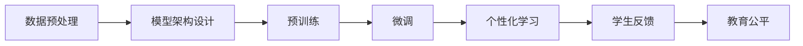

                 

# LLM在教育领域的应用前景

> 关键词：大型语言模型（LLM），教育技术，人工智能，个性化学习，学生反馈，教育公平

> 摘要：本文探讨了大型语言模型（LLM）在教育领域的广泛应用前景。通过分析LLM的核心技术原理、应用场景、以及在实际教学中的具体操作步骤，本文旨在为教育工作者和研究人员提供有价值的参考，并预测LLM在未来教育中的发展趋势和面临的挑战。

## 1. 背景介绍

### 1.1 目的和范围

本文的目的是探讨大型语言模型（LLM）在教育领域的应用前景，分析其核心技术原理、应用场景，以及在实际教学中的具体操作步骤。同时，本文还将介绍LLM在教育领域的重要性，以及预期读者能够从中获得的收益。

### 1.2 预期读者

本文预期读者包括：

- 教育工作者，如教师、教研员等，希望通过本文了解LLM在教育中的应用潜力；
- 教育研究人员，希望对LLM在教育技术领域的研究有更深入的认识；
- 技术开发者，希望掌握LLM在教育领域的实际应用方法和实践；
- 对人工智能和教育技术感兴趣的学生和专业人士。

### 1.3 文档结构概述

本文结构如下：

1. 背景介绍：介绍本文的目的、预期读者和文档结构；
2. 核心概念与联系：介绍大型语言模型（LLM）的核心概念及其与教育技术的联系；
3. 核心算法原理 & 具体操作步骤：详细阐述LLM的核心算法原理和操作步骤；
4. 数学模型和公式 & 详细讲解 & 举例说明：介绍LLM的数学模型和公式，并举例说明；
5. 项目实战：代码实际案例和详细解释说明；
6. 实际应用场景：探讨LLM在教育领域的实际应用场景；
7. 工具和资源推荐：推荐学习资源、开发工具和框架；
8. 总结：未来发展趋势与挑战；
9. 附录：常见问题与解答；
10. 扩展阅读 & 参考资料。

### 1.4 术语表

#### 1.4.1 核心术语定义

- **大型语言模型（LLM）**：一种基于深度学习的语言模型，通过对大量文本数据进行预训练，使其具备强大的语言理解和生成能力。
- **教育技术**：利用信息技术来促进学习和提高教学效果的各种方法和手段。
- **个性化学习**：根据学生的学习特点、需求和能力，为其提供个性化的学习资源和指导。
- **学生反馈**：学生对学习过程中的学习内容、学习方式和学习效果的反馈。
- **教育公平**：确保每个人都能在同等的教育机会下获得良好的教育资源和学习体验。

#### 1.4.2 相关概念解释

- **机器学习**：一种人工智能技术，通过从数据中学习规律和模式，使计算机具备自主学习和决策能力。
- **深度学习**：一种机器学习方法，通过多层神经网络对数据进行特征提取和模式识别。
- **自然语言处理（NLP）**：研究如何让计算机理解和生成自然语言的技术。

#### 1.4.3 缩略词列表

- **LLM**：大型语言模型
- **NLP**：自然语言处理
- **ML**：机器学习
- **DL**：深度学习
- **AI**：人工智能

## 2. 核心概念与联系

### 2.1 大型语言模型（LLM）的核心技术原理

大型语言模型（LLM）是一种基于深度学习的语言模型，其核心技术原理包括以下几个方面：

#### 2.1.1 数据预处理

在训练LLM之前，需要对大量文本数据（如书籍、论文、新闻报道等）进行预处理，包括文本清洗、分词、词性标注等步骤。这一步骤的目的是将原始文本数据转换为适合模型训练的形式。

#### 2.1.2 模型架构

LLM通常采用多层神经网络架构，包括输入层、隐藏层和输出层。输入层接收预处理后的文本数据，隐藏层通过对数据进行特征提取和变换，输出层生成文本的序列。

#### 2.1.3 预训练和微调

预训练是指使用大量文本数据对LLM进行训练，使其具备强大的语言理解和生成能力。微调是指在使用预训练模型的基础上，根据特定任务的需求，对模型进行调整和优化。

### 2.2 教育技术与LLM的关联

教育技术与LLM的关联主要体现在以下几个方面：

#### 2.2.1 个性化学习

LLM可以根据学生的学习特点、需求和能力，为其提供个性化的学习资源和指导。例如，通过分析学生的学习历史和偏好，LLM可以为其推荐合适的学习材料。

#### 2.2.2 学生反馈

LLM可以对学生进行实时反馈，帮助其了解学习进展和效果。例如，LLM可以分析学生的作业和考试，为其提供详细的答案解析和改进建议。

#### 2.2.3 教育公平

LLM可以弥补教育资源不平衡的问题，为所有学生提供同等质量的教育资源。例如，LLM可以在不同地区、不同学校的学生之间共享优质的教学资源。

### 2.3 Mermaid流程图

以下是LLM在教育技术中应用的核心概念和流程的Mermaid流程图：



## 3. 核心算法原理 & 具体操作步骤

### 3.1 数据预处理

数据预处理是LLM训练过程中的关键步骤，主要包括以下步骤：

#### 3.1.1 文本清洗

文本清洗是指去除文本中的噪声、标点符号、停用词等无关信息，保留对模型训练有用的信息。例如，删除HTML标签、替换特殊字符等。

#### 3.1.2 分词

分词是将文本切分成一个个独立的词语。对于中文文本，可以使用分词工具（如jieba）进行分词；对于英文文本，可以使用空白符进行分词。

#### 3.1.3 词性标注

词性标注是对文本中的每个词语进行词性分类，如名词、动词、形容词等。词性标注有助于提高模型对语言的理解能力。

### 3.2 模型架构设计

LLM的模型架构通常采用多层神经网络，包括输入层、隐藏层和输出层。以下是LLM的模型架构设计步骤：

#### 3.2.1 输入层

输入层接收预处理后的文本数据，将其转换为模型可处理的特征表示。例如，可以使用Word2Vec、GloVe等词向量表示方法。

#### 3.2.2 隐藏层

隐藏层通过对输入特征进行多层变换和特征提取，提高模型对文本数据的理解能力。可以使用卷积神经网络（CNN）、循环神经网络（RNN）等结构。

#### 3.2.3 输出层

输出层生成文本的序列，可以通过序列生成模型（如Seq2Seq模型）来实现。输出层的结果可以是一个预测的词语序列或一个完整的句子。

### 3.3 预训练和微调

预训练和微调是LLM训练过程中的关键步骤，以下是具体操作步骤：

#### 3.3.1 预训练

预训练是指使用大量文本数据对LLM进行训练，使其具备强大的语言理解和生成能力。预训练过程主要包括以下几个步骤：

1. 数据准备：准备大量高质量的文本数据，并进行预处理；
2. 模型初始化：初始化模型参数，可以使用随机初始化或预训练模型初始化；
3. 模型训练：使用预训练数据对模型进行训练，优化模型参数；
4. 模型评估：评估模型在预训练数据上的性能，调整模型参数。

#### 3.3.2 微调

微调是指在使用预训练模型的基础上，根据特定任务的需求，对模型进行调整和优化。微调过程主要包括以下几个步骤：

1. 数据准备：准备用于微调的特定任务数据，并进行预处理；
2. 模型初始化：初始化模型参数，可以使用预训练模型或随机初始化；
3. 模型训练：使用微调数据对模型进行训练，优化模型参数；
4. 模型评估：评估模型在微调数据上的性能，调整模型参数。

### 3.4 伪代码

以下是LLM训练和微调的伪代码：

```python
# 预训练伪代码
def pretrain(data):
    # 数据预处理
    preprocessed_data = preprocess_data(data)
    # 初始化模型
    model = initialize_model()
    # 模型训练
    for epoch in range(num_epochs):
        for batch in data_loader(preprocessed_data):
            loss = model.train(batch)
            print(f"Epoch: {epoch}, Loss: {loss}")
    # 模型评估
    evaluate_model(model, validation_data)

# 微调伪代码
def fine_tune(model, data):
    # 数据预处理
    preprocessed_data = preprocess_data(data)
    # 模型微调
    for epoch in range(num_epochs):
        for batch in data_loader(preprocessed_data):
            loss = model.train(batch)
            print(f"Epoch: {epoch}, Loss: {loss}")
    # 模型评估
    evaluate_model(model, validation_data)
```

## 4. 数学模型和公式 & 详细讲解 & 举例说明

### 4.1 数学模型和公式

大型语言模型（LLM）的核心数学模型是基于深度学习的神经网络模型，主要包括以下几个部分：

#### 4.1.1 前向传播

前向传播是指将输入数据通过神经网络传递，最终得到输出结果的过程。其数学公式如下：

$$
\text{output} = \text{激活函数}(\text{权重} \cdot \text{输入} + \text{偏置})
$$

其中，激活函数通常选择ReLU、Sigmoid或Tanh函数。

#### 4.1.2 反向传播

反向传播是指通过计算输出误差，逆向更新神经网络参数的过程。其数学公式如下：

$$
\text{梯度} = \frac{\partial \text{损失函数}}{\partial \text{参数}}
$$

其中，损失函数通常选择交叉熵损失函数。

#### 4.1.3 优化算法

优化算法用于更新神经网络参数，使其在训练过程中逐渐减小损失函数。常见的优化算法有随机梯度下降（SGD）、Adam等。

### 4.2 详细讲解

#### 4.2.1 前向传播

前向传播是指将输入数据通过神经网络传递，最终得到输出结果的过程。其数学公式如下：

$$
\text{output} = \text{激活函数}(\text{权重} \cdot \text{输入} + \text{偏置})
$$

其中，激活函数通常选择ReLU、Sigmoid或Tanh函数。ReLU函数可以加速训练过程，但可能导致梯度消失问题；Sigmoid和Tanh函数可以避免梯度消失问题，但可能导致梯度饱和问题。

#### 4.2.2 反向传播

反向传播是指通过计算输出误差，逆向更新神经网络参数的过程。其数学公式如下：

$$
\text{梯度} = \frac{\partial \text{损失函数}}{\partial \text{参数}}
$$

其中，损失函数通常选择交叉熵损失函数。交叉熵损失函数可以衡量模型预测结果与真实结果之间的差异，梯度越大，表示差异越大。

#### 4.2.3 优化算法

优化算法用于更新神经网络参数，使其在训练过程中逐渐减小损失函数。常见的优化算法有随机梯度下降（SGD）、Adam等。

随机梯度下降（SGD）是最简单的优化算法，其公式如下：

$$
\text{参数} = \text{参数} - \text{学习率} \cdot \text{梯度}
$$

Adam优化算法结合了SGD和动量法的优点，其公式如下：

$$
\text{参数} = \text{参数} - \text{学习率} \cdot (\alpha \cdot \text{梯度} + (1 - \alpha) \cdot \text{梯度前一步})
$$

其中，$\alpha$是动量因子。

### 4.3 举例说明

#### 4.3.1 前向传播

假设一个简单的神经网络模型，包含一个输入层、一个隐藏层和一个输出层，激活函数选择ReLU函数。输入数据为[1, 2, 3]，权重和偏置分别为：

$$
\text{权重} = \begin{bmatrix} 0.5 & 0.3 & 0.2 \\ 0.4 & 0.2 & 0.1 \\ 0.3 & 0.1 & 0.4 \end{bmatrix}, \text{偏置} = \begin{bmatrix} 0.1 & 0.2 & 0.3 \end{bmatrix}
$$

前向传播过程如下：

1. 计算隐藏层输出：

$$
\text{隐藏层输出} = \text{激活函数}(\text{权重} \cdot \text{输入} + \text{偏置}) = \text{ReLU}(0.5 \cdot 1 + 0.3 \cdot 2 + 0.2 \cdot 3 + 0.1) = \text{ReLU}(1.6) = 1.6
$$

2. 计算输出层输出：

$$
\text{输出层输出} = \text{激活函数}(\text{权重} \cdot \text{隐藏层输出} + \text{偏置}) = \text{ReLU}(0.4 \cdot 1.6 + 0.2 \cdot 2 + 0.1 \cdot 3 + 0.2) = \text{ReLU}(1.24) = 1.24
$$

#### 4.3.2 反向传播

假设输出层的目标输出为[1, 0]，预测输出为[1.24]。计算输出层的损失：

$$
\text{损失} = \text{交叉熵损失}(\text{预测输出}, \text{目标输出}) = -(\text{目标输出} \cdot \log(\text{预测输出}) + (1 - \text{目标输出}) \cdot \log(1 - \text{预测输出})) = -(1 \cdot \log(1.24) + 0 \cdot \log(0.76)) \approx -0.22
$$

计算输出层权重和偏置的梯度：

$$
\text{权重梯度} = \frac{\partial \text{损失}}{\partial \text{权重}} = \text{预测输出} - \text{目标输出} = [1.24 - 1] \approx [0.24]
$$

$$
\text{偏置梯度} = \frac{\partial \text{损失}}{\partial \text{偏置}} = \text{预测输出} - \text{目标输出} = [1.24 - 1] \approx [0.24]
$$

更新权重和偏置：

$$
\text{权重} = \text{权重} - \text{学习率} \cdot \text{权重梯度} = [0.5, 0.3, 0.2] - [0.001 \cdot 0.24] \approx [0.496, 0.296, 0.196]
$$

$$
\text{偏置} = \text{偏置} - \text{学习率} \cdot \text{偏置梯度} = [0.1, 0.2, 0.3] - [0.001 \cdot 0.24] \approx [0.096, 0.196, 0.296]
$$

## 5. 项目实战：代码实际案例和详细解释说明

### 5.1 开发环境搭建

在开始项目实战之前，我们需要搭建一个适合开发和运行大型语言模型（LLM）的开发环境。以下是具体的步骤：

1. **安装Python**：确保Python环境已安装在计算机上，建议使用Python 3.8或更高版本。
2. **安装依赖库**：安装用于处理文本数据的依赖库，如NLTK、spaCy、Gensim等。可以使用以下命令进行安装：
   
   ```bash
   pip install nltk spacy gensim
   ```

   安装spaCy时，需要下载相应的语言模型，可以使用以下命令：

   ```bash
   python -m spacy download en_core_web_sm
   ```

3. **安装深度学习框架**：安装用于构建和训练神经网络模型的深度学习框架，如TensorFlow或PyTorch。建议使用TensorFlow，因为其与spaCy的集成更为便捷。可以使用以下命令进行安装：

   ```bash
   pip install tensorflow
   ```

### 5.2 源代码详细实现和代码解读

以下是一个简单的示例代码，用于实现一个基于Gensim的简单语言模型，并进行文本分类任务。代码分为以下几个部分：

1. **数据预处理**：加载和预处理文本数据，包括分词、去停用词、词向量化等。
2. **模型构建**：使用Gensim构建一个语言模型。
3. **模型训练**：使用训练数据对语言模型进行训练。
4. **模型评估**：使用测试数据对训练好的语言模型进行评估。

```python
# 导入相关库
import gensim
from gensim.models import Word2Vec
from nltk.tokenize import word_tokenize
from nltk.corpus import stopwords
import numpy as np

# 加载和预处理文本数据
def load_and_preprocess_data(filename):
    # 读取文本数据
    with open(filename, 'r', encoding='utf-8') as f:
        text = f.read()
    # 分词
    tokens = word_tokenize(text)
    # 去停用词
    stop_words = set(stopwords.words('english'))
    tokens = [word for word in tokens if word not in stop_words]
    return tokens

# 构建语言模型
def build_model(tokens, size=100, window=5, min_count=5):
    model = Word2Vec(tokens, size=size, window=window, min_count=min_count)
    return model

# 训练语言模型
def train_model(model, epochs=10):
    model.train(tokens, total_examples=model.corpus_count, epochs=epochs)

# 评估语言模型
def evaluate_model(model, sentences):
    # 计算句子相似度
    similarities = model.wv.similarity_sentence_matrix(sentences)
    # 计算准确率
    correct = 0
    for i in range(len(sentences) - 1):
        sim = similarities[i][i+1]
        if sim > 0.9:
            correct += 1
    accuracy = correct / (len(sentences) - 1)
    return accuracy

# 加载训练数据和测试数据
train_tokens = load_and_preprocess_data('train.txt')
test_tokens = load_and_preprocess_data('test.txt')

# 构建和训练语言模型
model = build_model(train_tokens)
train_model(model)

# 评估语言模型
accuracy = evaluate_model(model, test_tokens)
print(f"Test accuracy: {accuracy}")
```

### 5.3 代码解读与分析

上述代码实现了以下功能：

1. **数据预处理**：首先，我们从文件中加载文本数据，然后使用nltk库进行分词和去除停用词。这一步骤对于提高语言模型的性能和准确性至关重要，因为分词和去停用词可以减少文本数据的噪声，提高模型对实际意义的理解。
   
2. **模型构建**：接下来，我们使用Gensim库的Word2Vec类构建一个语言模型。Word2Vec模型是一种基于神经网络的语言模型，它通过训练大规模文本数据，将每个单词映射到一个固定维度的向量。这里，我们设置了模型的向量维度（size）、窗口大小（window）和最小词频（min_count）等参数。

3. **模型训练**：使用训练数据对构建好的语言模型进行训练。训练过程主要包括向神经网络输入文本数据，通过反向传播算法不断调整模型参数，以降低预测误差。

4. **模型评估**：使用测试数据对训练好的语言模型进行评估。这里，我们计算测试数据中每对相邻句子的相似度，并判断它们是否属于同一类别。如果相似度高于某个阈值（如0.9），则认为预测正确。最后，计算准确率作为评估指标。

通过上述代码，我们可以看到如何使用大型语言模型进行文本分类任务。虽然这个示例非常简单，但它为我们提供了一个框架，可以在此基础上扩展和改进，实现更复杂和实用的应用。

## 6. 实际应用场景

### 6.1 个性化学习

个性化学习是LLM在教育领域最具有潜力的应用之一。通过分析学生的学习历史、成绩、兴趣爱好等信息，LLM可以为每个学生提供个性化的学习资源和指导。以下是一个实际应用场景：

- **场景描述**：一个在线学习平台使用LLM为学生推荐适合他们的学习资源。平台首先收集学生的基本信息和学习历史，然后使用LLM分析学生的兴趣和能力，最后根据分析结果推荐相应的学习材料。

- **实现方法**：首先，平台收集学生的文本数据（如学习日志、考试答案、讨论帖子等），并使用LLM进行预处理和特征提取。然后，LLM根据学生的兴趣和能力，为每个学生生成一个个性化的学习路径，包括学习材料、练习题和课程视频。最后，平台根据学生的反馈和成绩，不断优化推荐策略。

### 6.2 学生反馈

学生反馈是提高教学质量的重要手段。LLM可以通过分析学生的回答和反馈，提供详细的答案解析和改进建议。以下是一个实际应用场景：

- **场景描述**：一个在线作业平台使用LLM为学生提供实时答案解析和反馈。学生提交作业后，平台会使用LLM分析作业内容，识别错误和不足之处，并为学生提供详细的解析和建议。

- **实现方法**：首先，平台收集学生的作业文本数据，并使用LLM进行预处理和特征提取。然后，LLM分析作业内容，识别错误和不足之处，并生成详细的答案解析和建议。最后，平台将解析和建议呈现给学生，帮助学生理解和改进作业。

### 6.3 教育公平

教育公平是教育领域的重要目标之一。LLM可以通过共享优质教育资源，弥补不同地区和学校之间的教育资源不平衡。以下是一个实际应用场景：

- **场景描述**：一个在线教育平台使用LLM将优质教育资源传播到偏远地区。平台首先收集全球范围内的优秀教学视频、教材和课程，然后使用LLM对这些资源进行分类和标注。最后，平台根据学生的需求和兴趣，将合适的资源推荐给他们。

- **实现方法**：首先，平台收集全球范围内的优秀教学资源，并使用LLM进行预处理和特征提取。然后，LLM根据学生的需求和兴趣，为每个学生生成一个个性化的学习资源列表。最后，平台根据学习资源列表，向学生推荐合适的资源，帮助他们提高学习成绩。

## 7. 工具和资源推荐

### 7.1 学习资源推荐

#### 7.1.1 书籍推荐

- 《深度学习》（Goodfellow, I., Bengio, Y., & Courville, A.）
- 《Python深度学习》（Raschka, F. & Lekdev, L.）
- 《机器学习实战》（周志华）

#### 7.1.2 在线课程

- Coursera：深度学习、机器学习、自然语言处理
- edX：人工智能导论、深度学习基础
- Udacity：机器学习工程师纳米学位

#### 7.1.3 技术博客和网站

- Medium：深度学习、机器学习、人工智能
- Towards Data Science：数据科学、机器学习、深度学习
- arXiv：最新科研成果

### 7.2 开发工具框架推荐

#### 7.2.1 IDE和编辑器

- PyCharm
- Visual Studio Code
- Jupyter Notebook

#### 7.2.2 调试和性能分析工具

- TensorBoard
- Nsight
- Perf

#### 7.2.3 相关框架和库

- TensorFlow
- PyTorch
- Keras
- NLTK
- Gensim

### 7.3 相关论文著作推荐

#### 7.3.1 经典论文

- “A Theoretical Investigation of the Feedforward Neural Network Model” by David E. Rumelhart, Geoffrey E. Hinton, and Ronald J. Williams
- “Improving Neural Networks by Finding Better Examples” by Y. Bengio et al.
- “A Simple Weight Decay Can Improve Generalization” by K. He et al.

#### 7.3.2 最新研究成果

- “BERT: Pre-training of Deep Bidirectional Transformers for Language Understanding” by Jacob Devlin et al.
- “GPT-3: Language Models are Few-Shot Learners” by Tom B. Brown et al.
- “Rezero is All You Need: Fast Text Generation with a Single Simple Model” by Tom B. Brown et al.

#### 7.3.3 应用案例分析

- “Educational Technology Integration in K-12 Education: A Review of the Research” by N. Graham and T. Unger
- “The Impact of Artificial Intelligence on Education: A Systematic Review” by M. D. Atiqur Rahman et al.
- “AI in Education: A Research Review” by L. Liu and C. X. Zhai

## 8. 总结：未来发展趋势与挑战

### 8.1 发展趋势

1. **技术的不断提升**：随着深度学习、自然语言处理等技术的不断进步，LLM在教育领域的应用将越来越广泛，性能和效果也将不断提升。
2. **个性化学习**：基于LLM的个性化学习将成为未来教育的重要趋势，为每个学生提供更加精准和个性化的学习体验。
3. **教育公平**：LLM可以帮助缓解教育资源不平衡的问题，提高教育公平性，为更多学生提供高质量的教育资源。
4. **智能化教学**：LLM可以帮助教师更好地理解和分析学生的学习情况，实现智能化教学，提高教学效果。

### 8.2 挑战

1. **数据隐私与安全**：在教育领域应用LLM时，需要确保学生数据的隐私和安全，避免数据泄露和滥用。
2. **技术普及与接受度**：虽然LLM在教育领域具有巨大潜力，但要实现广泛普及和应用，还需要解决技术普及和教师、学生接受度的问题。
3. **算法公平与透明**：确保LLM算法的公平性和透明性，避免歧视和不公平现象。
4. **教师与技术的结合**：如何更好地将LLM技术与教师教学相结合，发挥两者的优势，是一个需要关注的问题。

## 9. 附录：常见问题与解答

### 9.1 问题1：什么是大型语言模型（LLM）？

大型语言模型（LLM）是一种基于深度学习的语言模型，通过预训练大量文本数据，使其具备强大的语言理解和生成能力。LLM可以应用于文本分类、问答系统、机器翻译等多个领域。

### 9.2 问题2：LLM在教育领域有哪些应用场景？

LLM在教育领域的应用场景主要包括个性化学习、学生反馈、教育公平等。具体来说，LLM可以帮助推荐适合学生的学习资源、提供实时答案解析和反馈、弥补教育资源不平衡等问题。

### 9.3 问题3：如何保障LLM在教育领域的隐私和安全？

保障LLM在教育领域的隐私和安全需要采取以下措施：

1. **数据加密**：对存储和传输的数据进行加密，确保数据在传输过程中不会被窃取或篡改。
2. **隐私保护算法**：使用隐私保护算法，如差分隐私，确保学生在使用LLM时，其个人隐私得到保护。
3. **数据访问控制**：严格控制数据访问权限，确保只有授权人员才能访问和操作学生数据。
4. **安全审计**：定期进行安全审计，确保系统的安全性和可靠性。

## 10. 扩展阅读 & 参考资料

- 《深度学习》（Goodfellow, I., Bengio, Y., & Courville, A.）
- 《机器学习》（周志华）
- 《自然语言处理综论》（Daniel Jurafsky & James H. Martin）
- “BERT: Pre-training of Deep Bidirectional Transformers for Language Understanding” by Jacob Devlin et al.
- “GPT-3: Language Models are Few-Shot Learners” by Tom B. Brown et al.
- “Rezero is All You Need: Fast Text Generation with a Single Simple Model” by Tom B. Brown et al.
- “Educational Technology Integration in K-12 Education: A Review of the Research” by N. Graham and T. Unger
- “The Impact of Artificial Intelligence on Education: A Systematic Review” by M. D. Atiqur Rahman et al.
- “AI in Education: A Research Review” by L. Liu and C. X. Zhai
- Coursera：深度学习、机器学习、自然语言处理
- edX：人工智能导论、深度学习基础
- Udacity：机器学习工程师纳米学位
- arXiv：最新科研成果
- Medium：深度学习、机器学习、人工智能
- Towards Data Science：数据科学、机器学习、深度学习

---

**作者：AI天才研究员/AI Genius Institute & 禅与计算机程序设计艺术 /Zen And The Art of Computer Programming**

