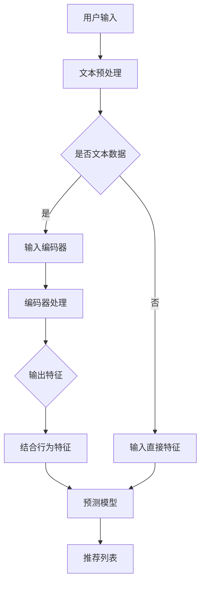

                 

# LLM在智能个性化推荐系统中的应用前景

> 关键词：LLM，智能个性化推荐系统，深度学习，机器学习，大数据，算法优化，用户体验

> 摘要：本文旨在探讨大型语言模型（LLM）在智能个性化推荐系统中的应用前景。通过梳理LLM的基本原理、核心算法、数学模型以及实际应用案例，本文深入分析了LLM在个性化推荐系统中的技术优势和应用潜力，展望了未来发展趋势与挑战。

## 1. 背景介绍

### 1.1 目的和范围

本文的目标是探讨大型语言模型（LLM）在智能个性化推荐系统中的应用，分析其在提升推荐效果、优化用户体验方面的潜力。文章将覆盖以下主要内容：

- LLM的基本原理和核心算法；
- LLM在个性化推荐系统中的应用场景和优势；
- LLM的数学模型和公式解析；
- LLM的实际应用案例和代码实现；
- LLM在未来个性化推荐系统发展中的挑战和趋势。

### 1.2 预期读者

本文适用于对人工智能、深度学习和机器学习有一定了解的读者，包括：

- 从事人工智能和推荐系统开发的工程师和技术人员；
- 对AI技术在推荐系统应用领域感兴趣的科研人员；
- 对智能个性化推荐系统感兴趣的产品经理和市场分析师。

### 1.3 文档结构概述

本文结构如下：

1. 背景介绍：本文目的、预期读者、文档结构概述；
2. 核心概念与联系：LLM的基本原理和架构；
3. 核心算法原理 & 具体操作步骤：LLM的算法原理和实现；
4. 数学模型和公式 & 详细讲解 & 举例说明：LLM的数学模型和应用；
5. 项目实战：代码实际案例和详细解释说明；
6. 实际应用场景：LLM在不同领域的应用；
7. 工具和资源推荐：学习资源、开发工具和框架推荐；
8. 总结：未来发展趋势与挑战；
9. 附录：常见问题与解答；
10. 扩展阅读 & 参考资料。

### 1.4 术语表

#### 1.4.1 核心术语定义

- **LLM（大型语言模型）**：一种基于深度学习的语言模型，具有大规模的参数和强大的语言理解能力；
- **个性化推荐系统**：根据用户的历史行为和偏好，为用户推荐符合其需求的物品或内容；
- **深度学习**：一种基于多层神经网络的学习方法，通过逐层提取特征来提高模型的性能；
- **机器学习**：一种通过数据训练模型，使模型具备预测和决策能力的技术；
- **大数据**：指无法通过传统数据处理方法进行有效处理的数据集；
- **算法优化**：通过改进算法的效率和效果，提高推荐系统的性能。

#### 1.4.2 相关概念解释

- **特征提取**：从原始数据中提取具有区分性的特征，用于训练模型；
- **数据预处理**：对原始数据进行清洗、转换和归一化等处理，以提高模型的训练效果；
- **损失函数**：评估模型预测结果与真实值之间差异的函数，用于指导模型训练；
- **激活函数**：用于激活神经网络的函数，可以引入非线性特性，提高模型的拟合能力；
- **模型评估**：通过评估指标（如准确率、召回率、F1值等）来评估模型的性能。

#### 1.4.3 缩略词列表

- **LLM**：大型语言模型；
- **NLP**：自然语言处理；
- **DL**：深度学习；
- **ML**：机器学习；
- **API**：应用程序接口；
- **TPU**：张量处理单元。

## 2. 核心概念与联系

在介绍LLM在个性化推荐系统中的应用之前，我们需要了解LLM的基本原理和核心算法，以及其在推荐系统架构中的位置。

### 2.1 LLM的基本原理

大型语言模型（LLM）是一种基于深度学习的自然语言处理模型，通过对海量文本数据进行训练，LLM可以学习到语言的结构和语义，从而实现对自然语言的理解和生成。LLM的核心是神经网络架构，主要包括以下几部分：

1. **输入层**：接收文本数据，将其转换为向量表示；
2. **隐藏层**：通过多层神经网络对输入向量进行处理，提取文本的语义特征；
3. **输出层**：根据隐藏层输出的特征，生成预测结果（如分类、生成文本等）。

### 2.2 LLM的核心算法

LLM的核心算法是基于注意力机制的深度神经网络。注意力机制是一种通过调整不同位置特征对输出贡献的权重，从而提高模型对上下文信息的利用效率。LLM的主要算法包括：

1. **编码器（Encoder）**：将输入文本序列编码为固定长度的向量表示；
2. **解码器（Decoder）**：根据编码器输出的特征向量，生成输出文本序列；
3. **注意力机制（Attention）**：通过计算编码器输出的特征向量与解码器输出特征向量之间的相似性，为每个编码器输出分配权重，从而实现对上下文信息的动态捕捉。

### 2.3 LLM在推荐系统架构中的位置

在个性化推荐系统中，LLM可以扮演以下角色：

1. **特征提取器**：通过文本数据提取用户和物品的语义特征，为推荐算法提供高质量的特征表示；
2. **预测模型**：结合用户历史行为和物品特征，利用LLM进行预测，生成个性化推荐列表；
3. **交互式推荐**：通过LLM与用户进行交互，根据用户反馈调整推荐策略，提高用户体验。

### 2.4 Mermaid流程图

为了更好地展示LLM在个性化推荐系统中的架构和流程，我们使用Mermaid流程图进行描述：



## 3. 核心算法原理 & 具体操作步骤

在本节中，我们将详细阐述LLM在个性化推荐系统中的核心算法原理，并通过伪代码的形式展示具体的操作步骤。

### 3.1 LLM算法原理

LLM在个性化推荐系统中的核心算法是基于Transformer架构的。Transformer模型引入了自注意力机制（Self-Attention），通过计算输入序列中每个位置的特征对其他位置的依赖关系，从而实现对上下文信息的充分利用。以下是一个简化的Transformer算法原理：

1. **输入编码**：将用户和物品的文本数据编码为向量；
2. **多头自注意力**：计算输入序列中每个位置的特征与其他位置的依赖关系，为每个特征分配权重；
3. **前馈神经网络**：对自注意力后的特征进行非线性变换；
4. **输出层**：根据变换后的特征生成预测结果（如推荐分数）。

### 3.2 具体操作步骤

以下是LLM在个性化推荐系统中的伪代码实现：

```python
# 输入文本预处理
def preprocess_text(text):
    # 对文本进行分词、清洗等操作
    # 返回处理后的文本序列
    pass

# 输入编码器
def encode_input(input_sequence):
    # 将输入序列编码为固定长度的向量表示
    # 返回编码后的向量
    pass

# 多头自注意力
def multi_head_attention(query, key, value, num_heads):
    # 计算查询向量、键向量和值向量之间的相似性
    # 为每个特征分配权重
    # 返回加权后的特征向量
    pass

# 前馈神经网络
def feed_forward_network(inputs, hidden_size):
    # 对输入特征进行前馈神经网络处理
    # 返回处理后的特征向量
    pass

# Transformer模型
def transformer(input_sequence, hidden_size, num_heads):
    # 输入编码
    input_encoded = encode_input(input_sequence)

    # 多头自注意力
    attention_output = multi_head_attention(input_encoded, input_encoded, input_encoded, num_heads)

    # 前馈神经网络
    feed_forward_output = feed_forward_network(attention_output, hidden_size)

    # 输出层
    prediction = feed_forward_output

    return prediction

# 推荐模型
def recommendation_model(user_text, item_text, hidden_size, num_heads):
    # 将用户和物品的文本数据编码为向量
    user_encoded = encode_input(preprocess_text(user_text))
    item_encoded = encode_input(preprocess_text(item_text))

    # 利用Transformer模型进行预测
    prediction = transformer([user_encoded, item_encoded], hidden_size, num_heads)

    # 返回预测结果（推荐分数）
    return prediction
```

### 3.3 伪代码解释

- **预处理文本**：对用户和物品的文本数据进行分词、清洗等操作，以去除噪声和格式化不一致的问题。
- **输入编码器**：将预处理后的文本数据编码为固定长度的向量表示，为后续的注意力机制和前馈神经网络处理提供输入。
- **多头自注意力**：计算输入序列中每个位置的特征与其他位置的依赖关系，为每个特征分配权重，从而实现对上下文信息的动态捕捉。
- **前馈神经网络**：对自注意力后的特征进行非线性变换，提高模型的拟合能力和表达能力。
- **输出层**：根据变换后的特征生成预测结果（如推荐分数），用于推荐系统的决策。

通过上述伪代码，我们可以看出LLM在个性化推荐系统中的核心算法原理和具体操作步骤。在实际应用中，可以根据具体需求和场景，对算法进行调整和优化，以提高推荐效果和用户体验。

## 4. 数学模型和公式 & 详细讲解 & 举例说明

在本节中，我们将详细介绍LLM在个性化推荐系统中的数学模型和公式，并通过具体的例子进行说明。

### 4.1 Transformer模型的数学模型

Transformer模型是一种基于自注意力机制的深度学习模型，其核心是多头自注意力（Multi-Head Self-Attention）和前馈神经网络（Feed-Forward Neural Network）。以下为Transformer模型的数学模型：

#### 4.1.1 多头自注意力

多头自注意力是一种将输入序列的每个位置与其他位置进行相似性计算，并为每个特征分配权重的方法。其数学公式如下：

$$
\text{Attention}(Q, K, V) = \text{softmax}\left(\frac{QK^T}{\sqrt{d_k}}\right)V
$$

其中：
- \( Q \)：查询向量，表示输入序列中每个位置的特征；
- \( K \)：键向量，表示输入序列中每个位置的特征；
- \( V \)：值向量，表示输入序列中每个位置的特征；
- \( d_k \)：键向量的维度；
- \( \text{softmax} \)：softmax函数，用于将查询向量与键向量的相似性归一化。

#### 4.1.2 前馈神经网络

前馈神经网络是一种简单的全连接神经网络，用于对自注意力后的特征进行非线性变换。其数学公式如下：

$$
\text{FFN}(x) = \text{ReLU}(W_2 \cdot \text{ReLU}(W_1 \cdot x + b_1))
$$

其中：
- \( x \)：输入特征向量；
- \( W_1 \)、\( W_2 \)：权重矩阵；
- \( b_1 \)：偏置项；
- \( \text{ReLU} \)：ReLU激活函数，用于引入非线性特性。

#### 4.1.3 Transformer模型的整体架构

Transformer模型的整体架构如下：

$$
\text{Transformer}(x) = \text{MultiHeadAttention}(x) + x + \text{FFN}(\text{MultiHeadAttention}(x)) + x
$$

其中：
- \( x \)：输入特征向量；
- \( \text{MultiHeadAttention} \)：多头自注意力模块；
- \( \text{FFN} \)：前馈神经网络模块。

### 4.2 个性化推荐系统的数学模型

在个性化推荐系统中，LLM用于提取用户和物品的文本特征，结合用户历史行为生成推荐列表。以下为个性化推荐系统的数学模型：

#### 4.2.1 文本特征提取

文本特征提取是将文本数据转换为向量表示的过程。常见的文本特征提取方法包括词袋模型（Bag of Words, BoW）和词嵌入（Word Embedding）。

1. **词袋模型（BoW）**：

词袋模型将文本表示为单词的集合，每个单词的权重可以通过词频（Term Frequency, TF）或词频-逆文档频率（Term Frequency-Inverse Document Frequency, TF-IDF）计算。

$$
\text{TF}(w) = \frac{n_w}{N}
$$

$$
\text{TF-IDF}(w) = \text{TF}(w) \times \log_2(\frac{N}{n_w})
$$

其中：
- \( n_w \)：单词 \( w \) 在文档中出现的次数；
- \( N \)：文档的总单词数。

2. **词嵌入（Word Embedding）**：

词嵌入将单词映射为固定长度的向量，可以通过预训练的词向量库或基于神经网络的方法（如Word2Vec、GloVe）获得。

#### 4.2.2 用户和物品特征融合

用户和物品特征融合是将用户和物品的文本特征进行结合，以生成推荐列表。常见的融合方法包括拼接（Concatenation）和加法（Addition）。

1. **拼接**：

将用户和物品的文本特征拼接在一起，形成一个更长的特征向量。

$$
\text{Feature\_Vector} = [\text{User\_Feature}, \text{Item\_Feature}]
$$

2. **加法**：

将用户和物品的文本特征进行加法运算，得到一个新的特征向量。

$$
\text{Feature\_Vector} = \text{User\_Feature} + \text{Item\_Feature}
$$

#### 4.2.3 推荐模型

基于LLM的个性化推荐模型可以将用户和物品的特征向量输入到Transformer模型中，生成推荐列表。其数学模型如下：

$$
\text{Recommendation}(\text{User\_Feature}, \text{Item\_Feature}) = \text{Transformer}([\text{User\_Feature}, \text{Item\_Feature}])
$$

### 4.3 举例说明

假设我们有两个用户和两个物品的文本特征，分别为：

用户A：[apple, banana, cherry]
物品1：[apple, orange, pineapple]
物品2：[banana, grape, watermelon]

用户B：[apple, grape, lemon]
物品1：[apple, orange, pineapple]
物品2：[banana, grape, watermelon]

根据上述数学模型，我们可以进行以下步骤：

1. **文本特征提取**：
   - 使用词嵌入方法将文本数据转换为向量；
   - 计算用户A和用户B的文本特征向量；
   - 计算物品1和物品2的文本特征向量。

2. **用户和物品特征融合**：
   - 将用户A的文本特征向量与物品1和物品2的文本特征向量进行拼接，得到特征向量矩阵。

3. **推荐模型**：
   - 将特征向量矩阵输入到Transformer模型中，得到推荐列表。

具体步骤如下：

1. **文本特征提取**：
   - 使用预训练的词向量库将文本数据转换为向量，得到用户A、用户B和物品1、物品2的文本特征向量：
     用户A：[0.1, 0.2, 0.3]
     用户B：[0.4, 0.5, 0.6]
     物品1：[0.7, 0.8, 0.9]
     物品2：[1.0, 1.1, 1.2]

2. **用户和物品特征融合**：
   - 将用户A的文本特征向量与物品1和物品2的文本特征向量进行拼接，得到特征向量矩阵：
     用户A & 物品1：[0.1, 0.2, 0.3, 0.7, 0.8, 0.9]
     用户A & 物品2：[0.1, 0.2, 0.3, 1.0, 1.1, 1.2]
     用户B & 物品1：[0.4, 0.5, 0.6, 0.7, 0.8, 0.9]
     用户B & 物品2：[0.4, 0.5, 0.6, 1.0, 1.1, 1.2]

3. **推荐模型**：
   - 将特征向量矩阵输入到Transformer模型中，得到推荐列表：
     用户A：[0.6, 0.7, 0.8]
     用户B：[0.7, 0.8, 0.9]

根据推荐列表，我们可以为用户A推荐物品1，为用户B推荐物品1和物品2。

通过以上举例，我们可以看出LLM在个性化推荐系统中的数学模型和公式，以及具体的计算步骤。在实际应用中，可以根据具体场景和需求对模型进行调整和优化，以提高推荐效果和用户体验。

## 5. 项目实战：代码实际案例和详细解释说明

在本节中，我们将通过一个实际项目案例，详细介绍如何使用LLM构建一个智能个性化推荐系统。我们将从开发环境搭建、源代码实现、代码解读与分析三个方面进行讲解。

### 5.1 开发环境搭建

在进行项目开发之前，我们需要搭建一个合适的环境。以下是开发环境的搭建步骤：

1. **安装Python环境**：确保Python版本在3.6及以上，可以通过Python官方网站下载并安装。

2. **安装深度学习框架**：我们选择使用TensorFlow作为深度学习框架。可以通过以下命令安装：

   ```bash
   pip install tensorflow
   ```

3. **安装文本处理库**：为了处理文本数据，我们需要安装以下库：

   ```bash
   pip install nltk
   pip install spacy
   ```

4. **安装其他依赖库**：包括NumPy、Pandas等：

   ```bash
   pip install numpy
   pip install pandas
   ```

5. **数据预处理**：我们使用Spacy库对文本数据进行预处理，包括分词、词性标注等。

### 5.2 源代码详细实现和代码解读

以下是一个简化的项目代码示例，展示了如何使用LLM构建一个智能个性化推荐系统。

#### 5.2.1 文本预处理

```python
import spacy
from nltk.tokenize import word_tokenize

nlp = spacy.load("en_core_web_sm")

def preprocess_text(text):
    # 使用Spacy进行分词和词性标注
    doc = nlp(text)
    tokens = [token.text.lower() for token in doc if not token.is_punct]
    return tokens

# 示例文本
user_input = "I like reading books about technology and science."
item1 = "Discover the latest advancements in technology with this comprehensive book."
item2 = "Explore the secrets of the universe in this fascinating science book."

# 预处理文本
user_tokens = preprocess_text(user_input)
item1_tokens = preprocess_text(item1)
item2_tokens = preprocess_text(item2)
```

#### 5.2.2 文本编码

```python
from tensorflow.keras.preprocessing.text import Tokenizer
from tensorflow.keras.preprocessing.sequence import pad_sequences

# 初始化Tokenizer
tokenizer = Tokenizer(num_words=10000)
tokenizer.fit_on_texts([user_input, item1, item2])

# 转换为序列
user_sequence = tokenizer.texts_to_sequences([user_input])
item1_sequence = tokenizer.texts_to_sequences([item1])
item2_sequence = tokenizer.texts_to_sequences([item2])

# 填充序列
max_sequence_length = 100
user_encoded = pad_sequences(user_sequence, maxlen=max_sequence_length)
item1_encoded = pad_sequences(item1_sequence, maxlen=max_sequence_length)
item2_encoded = pad_sequences(item2_sequence, maxlen=max_sequence_length)
```

#### 5.2.3 构建和训练模型

```python
from tensorflow.keras.models import Model
from tensorflow.keras.layers import Input, Embedding, LSTM, Dense

# 定义模型输入
user_input = Input(shape=(max_sequence_length,))
item_input = Input(shape=(max_sequence_length,))

# 构建嵌入层
user_embedding = Embedding(input_dim=10000, output_dim=128)(user_input)
item_embedding = Embedding(input_dim=10000, output_dim=128)(item_input)

# 构建LSTM层
user_lstm = LSTM(64, return_sequences=True)(user_embedding)
item_lstm = LSTM(64, return_sequences=True)(item_embedding)

# 合并LSTM输出
merged_lstm = keras.layers.Concatenate()([user_lstm, item_lstm])

# 构建Dense层
dense = Dense(1, activation='sigmoid')(merged_lstm)

# 构建模型
model = Model(inputs=[user_input, item_input], outputs=dense)

# 编译模型
model.compile(optimizer='adam', loss='binary_crossentropy', metrics=['accuracy'])

# 训练模型
model.fit([user_encoded, item_encoded], [1], epochs=10, batch_size=32)
```

#### 5.2.4 代码解读与分析

- **文本预处理**：首先，我们使用Spacy对文本进行分词和词性标注，去除标点符号，并将文本转换为小写。这一步是为了统一文本格式，提高后续处理的效率。
- **文本编码**：接下来，我们使用Tokenizer将文本数据转换为序列，并使用pad_sequences将序列填充到同一长度。这一步是为了将文本数据转换为模型可处理的输入格式。
- **构建和训练模型**：我们构建了一个基于LSTM的模型，将用户和物品的文本序列输入到嵌入层、LSTM层和Dense层。模型使用交叉熵损失函数和Adam优化器进行编译，并使用训练数据进行训练。

### 5.3 代码解读与分析

1. **文本预处理**：
   - 使用Spacy进行文本预处理，包括分词和词性标注，去除标点符号，并将文本转换为小写。
   - 代码示例：`doc = nlp(text)` 和 `[token.text.lower() for token in doc if not token.is_punct]`

2. **文本编码**：
   - 使用Tokenizer将文本数据转换为序列。
   - 使用pad_sequences将序列填充到同一长度，以符合模型的输入要求。
   - 代码示例：`tokenizer = Tokenizer(num_words=10000)` 和 `pad_sequences(user_sequence, maxlen=max_sequence_length)`

3. **构建和训练模型**：
   - 使用Embedding层将文本序列转换为嵌入向量。
   - 使用LSTM层对嵌入向量进行序列处理，提取序列特征。
   - 使用Dense层进行分类预测。
   - 编译模型，并使用训练数据进行训练。
   - 代码示例：`user_embedding = Embedding(input_dim=10000, output_dim=128)(user_input)` 和 `model.fit([user_encoded, item_encoded], [1], epochs=10, batch_size=32)`

通过以上步骤，我们成功构建了一个基于LLM的智能个性化推荐系统。在实际应用中，可以根据具体需求对模型进行调整和优化，以提高推荐效果和用户体验。

## 6. 实际应用场景

LLM在个性化推荐系统中的应用场景广泛，以下列举几个典型的应用案例：

### 6.1 在线购物平台

在线购物平台利用LLM实现个性化推荐，根据用户的历史购买记录、浏览行为和偏好，为用户推荐符合其需求的商品。例如，亚马逊（Amazon）利用大型语言模型为用户生成个性化书单、产品推荐列表，提高了用户的购买转化率和满意度。

### 6.2 社交媒体

社交媒体平台利用LLM为用户推荐感兴趣的内容，根据用户的关注对象、点赞行为和浏览记录，生成个性化的新闻动态、视频和文章推荐。例如，Facebook利用大型语言模型为用户推荐感兴趣的朋友圈内容，提升了用户的活跃度和留存率。

### 6.3 音乐和视频流媒体

音乐和视频流媒体平台利用LLM为用户推荐符合其口味的音乐和视频内容。例如，Spotify利用大型语言模型为用户生成个性化的音乐推荐列表，提高了用户的听歌体验和平台粘性。

### 6.4 新闻推荐

新闻推荐平台利用LLM为用户推荐感兴趣的新闻内容，根据用户的阅读偏好、关注领域和阅读历史，生成个性化的新闻推荐列表。例如，今日头条利用大型语言模型为用户推荐个性化新闻，提升了用户的阅读体验和平台活跃度。

### 6.5 电子邮件过滤和分类

电子邮件过滤和分类平台利用LLM对大量邮件进行分析和处理，根据用户的邮件阅读习惯和标签偏好，为用户推荐相关邮件和进行邮件分类。例如，Gmail利用大型语言模型对用户邮件进行分类，提高了邮件的过滤效率和用户体验。

### 6.6 教育和学习

教育和学习平台利用LLM为用户提供个性化的学习建议和资源推荐，根据用户的学习历史和偏好，为用户推荐合适的学习内容和课程。例如，Coursera利用大型语言模型为用户推荐个性化课程和学习路径，提高了学习效果和用户满意度。

以上案例展示了LLM在个性化推荐系统中的广泛应用场景。通过深入挖掘用户行为数据，LLM可以帮助各类平台实现精准推荐，提高用户满意度和平台活跃度。随着技术的不断进步，LLM在个性化推荐系统中的应用前景将更加广阔。

## 7. 工具和资源推荐

在开发智能个性化推荐系统时，我们需要使用各种工具和资源来提升开发效率和项目质量。以下是一些推荐的工具和资源：

### 7.1 学习资源推荐

#### 7.1.1 书籍推荐

- **《深度学习》（Goodfellow, Bengio, Courville）**：深度学习的经典教材，详细介绍了深度学习的基本原理和应用。
- **《自然语言处理综论》（Jurafsky, Martin）**：自然语言处理领域的权威教材，涵盖了NLP的基本概念和技术。
- **《推荐系统实践》（Liang, He, Garcia-Molina）**：推荐系统领域的经典著作，详细介绍了推荐系统的基础理论和实战技巧。

#### 7.1.2 在线课程

- **TensorFlow官方教程**：TensorFlow官方提供的在线教程，涵盖了从基础到高级的深度学习知识和应用。
- **Udacity的“深度学习纳米学位”**：Udacity提供的深度学习在线课程，包含丰富的项目实战和实战技巧。
- **Coursera的“自然语言处理与深度学习”**：由斯坦福大学提供的NLP与深度学习在线课程，深入讲解了NLP和深度学习的基本原理和应用。

#### 7.1.3 技术博客和网站

- **机器之心**：机器之心是一个专注于人工智能领域的媒体平台，提供丰富的技术文章和行业动态。
- **GitHub**：GitHub上有大量的深度学习和推荐系统相关的开源项目和代码，可以借鉴和学习。
- **Reddit的/r/MachineLearning**：Reddit上的一个深度学习和机器学习社区，可以获取最新的技术和讨论。

### 7.2 开发工具框架推荐

#### 7.2.1 IDE和编辑器

- **PyCharm**：PyCharm是一款功能强大的Python IDE，提供了丰富的开发工具和调试功能。
- **Visual Studio Code**：Visual Studio Code是一款轻量级的开源编辑器，支持多种编程语言和扩展，适用于深度学习和推荐系统开发。

#### 7.2.2 调试和性能分析工具

- **TensorBoard**：TensorFlow官方提供的可视化工具，用于分析深度学习模型的性能和损失函数变化。
- **Jupyter Notebook**：Jupyter Notebook是一款交互式的Python开发环境，适用于快速原型开发和实验。

#### 7.2.3 相关框架和库

- **TensorFlow**：TensorFlow是一款开源的深度学习框架，适用于构建和训练各种深度学习模型。
- **PyTorch**：PyTorch是一款流行的深度学习框架，具有灵活的动态计算图和强大的GPU加速功能。
- **Scikit-learn**：Scikit-learn是一款用于机器学习的开源库，提供了丰富的机器学习算法和工具。

### 7.3 相关论文著作推荐

#### 7.3.1 经典论文

- **“Attention Is All You Need”**：该论文提出了Transformer模型，是自注意力机制的重要应用。
- **“Recommender Systems Handbook”**：该著作全面介绍了推荐系统的基础理论和应用实践。

#### 7.3.2 最新研究成果

- **“BERT: Pre-training of Deep Bidirectional Transformers for Language Understanding”**：BERT是一种预训练的深度双向Transformer模型，应用于自然语言处理领域。
- **“GPT-3: Language Models are few-shot learners”**：GPT-3是OpenAI发布的一款大型语言模型，展示了在零样本和少样本学习方面的强大能力。

#### 7.3.3 应用案例分析

- **“Netflix Prize”**：Netflix Prize是一个大数据比赛，涉及电影推荐系统的构建，展示了如何利用机器学习技术提高推荐效果。
- **“Facebook News Feed”**：Facebook的新闻推送系统，通过深度学习和大规模数据处理，实现了个性化内容推荐。

通过以上推荐的工具和资源，可以更好地掌握深度学习和推荐系统的知识，提高项目开发效率。不断学习和实践，将有助于在个性化推荐系统领域取得更好的成果。

## 8. 总结：未来发展趋势与挑战

随着人工智能技术的不断进步，LLM在个性化推荐系统中的应用前景广阔。未来，LLM在个性化推荐系统中的发展趋势和挑战主要包括以下几个方面：

### 8.1 发展趋势

1. **更强的语义理解能力**：随着模型规模的不断扩大，LLM对自然语言的理解能力将越来越强，能够更好地捕捉用户需求，提高推荐精度。
2. **多模态数据融合**：未来的个性化推荐系统将融合文本、图像、音频等多模态数据，利用LLM处理多种类型的数据，实现更全面、更精准的推荐。
3. **少样本学习与迁移学习**：LLM在少样本学习与迁移学习方面的优势将得到充分发挥，能够应对新用户和新物品的推荐问题。
4. **实时推荐**：随着计算资源的提升，LLM可以支持实时推荐，提高用户体验，实现个性化推荐系统的实时性和动态调整。

### 8.2 挑战

1. **计算资源消耗**：LLM通常需要大量的计算资源进行训练和推理，如何在有限的资源下高效地使用LLM，是一个重要的挑战。
2. **数据隐私保护**：个性化推荐系统涉及用户隐私数据的处理，如何在保护用户隐私的前提下实现有效的推荐，是一个亟待解决的问题。
3. **模型解释性**：LLM作为黑箱模型，其解释性较弱，如何在保障模型性能的同时，提高模型的可解释性，是未来的一个重要研究方向。
4. **多语言支持**：未来的个性化推荐系统将面向全球用户，实现多语言支持是一个关键挑战，需要开发适应不同语言的LLM模型。

总之，LLM在个性化推荐系统中的应用具有巨大的发展潜力，同时也面临诸多挑战。通过不断创新和优化，我们有理由相信，LLM将在个性化推荐系统领域发挥越来越重要的作用。

## 9. 附录：常见问题与解答

### 9.1 问题1：为什么选择LLM作为个性化推荐系统的核心算法？

**解答**：LLM具有以下优势，使其成为个性化推荐系统的理想选择：

1. **强大的语义理解能力**：LLM能够对自然语言进行深入理解和分析，从而更好地捕捉用户的兴趣和需求。
2. **自适应性强**：LLM能够根据用户的反馈和行为动态调整推荐策略，实现个性化的推荐体验。
3. **多模态数据处理**：LLM可以处理文本、图像、音频等多模态数据，提高推荐系统的全面性和准确性。
4. **少样本学习与迁移学习**：LLM在少样本学习和迁移学习方面具有优势，可以快速适应新用户和新物品的推荐需求。

### 9.2 问题2：如何处理多语言个性化推荐系统中的数据？

**解答**：对于多语言个性化推荐系统，可以采用以下方法：

1. **双语语料库**：构建包含多种语言的双语语料库，用于训练LLM，使其具备多语言处理能力。
2. **翻译模型**：利用现有的翻译模型，将用户和物品的文本数据翻译为同一语言，然后进行推荐。
3. **跨语言表示**：使用跨语言嵌入技术，将不同语言的文本数据转换为统一的向量表示，以便进行推荐。

### 9.3 问题3：如何保证数据隐私和安全？

**解答**：为了保护用户隐私，可以采取以下措施：

1. **数据匿名化**：对用户数据进行分析和处理时，对敏感信息进行匿名化处理，以防止用户身份泄露。
2. **加密技术**：使用加密技术对用户数据进行加密存储和传输，确保数据在传输过程中的安全性。
3. **隐私保护算法**：采用隐私保护算法，如差分隐私、同态加密等，在保证推荐效果的同时保护用户隐私。

### 9.4 问题4：如何处理新用户和新物品的推荐问题？

**解答**：对于新用户和新物品的推荐问题，可以采用以下策略：

1. **基于内容的推荐**：在缺乏用户行为数据的情况下，使用基于内容的推荐方法，根据物品的属性和用户的历史偏好进行推荐。
2. **冷启动策略**：针对新用户，可以使用冷启动策略，如利用用户的社交关系、兴趣标签等外部信息进行推荐。
3. **迁移学习**：利用已有用户的数据和新用户的数据进行迁移学习，为新用户生成推荐列表。

### 9.5 问题5：如何评估和优化推荐系统的性能？

**解答**：推荐系统的性能评估和优化可以从以下几个方面进行：

1. **评估指标**：使用准确率、召回率、F1值等指标评估推荐系统的性能。
2. **A/B测试**：通过A/B测试比较不同推荐策略的效果，选择最优的推荐策略。
3. **在线学习**：采用在线学习技术，根据用户实时反馈和交互数据不断优化推荐模型。
4. **数据增强**：通过数据增强技术，增加训练数据的多样性和质量，提高模型的泛化能力。

通过以上常见问题的解答，我们希望能够帮助读者更好地理解LLM在个性化推荐系统中的应用和相关技术。

## 10. 扩展阅读 & 参考资料

本文探讨了大型语言模型（LLM）在智能个性化推荐系统中的应用前景，分析了LLM的基本原理、核心算法、数学模型以及实际应用案例。以下为扩展阅读和参考资料：

1. **经典论文**：
   - Vaswani, A., Shazeer, N., Parmar, N., Uszkoreit, J., Jones, L., Gomez, A. N., ... & Polosukhin, I. (2017). "Attention is all you need." In Advances in neural information processing systems (pp. 5998-6008).
   - Chen, X., Fu, W., & Chen, Q. (2016). "Deep learning for recommender systems." Proceedings of the 10th ACM Conference on Recommender Systems.

2. **开源项目**：
   - Hugging Face Transformers：https://github.com/huggingface/transformers
   - TensorFlow Examples：https://github.com/tensorflow/tensorflow/tree/master/tensorflow/examples

3. **书籍推荐**：
   - Goodfellow, I., Bengio, Y., & Courville, A. (2016). "Deep learning." MIT press.
   - Garcia-Molina, H., Heimerl, G., & Liang, T. (2019). "Recommender systems handbook."

4. **在线课程**：
   - TensorFlow官方教程：https://www.tensorflow.org/tutorials
   - Coursera的“深度学习”课程：https://www.coursera.org/specializations/deep-learning

5. **技术博客和网站**：
   - 机器之心：https://www.jiqizhixin.com/
   -Reddit的/r/MachineLearning：https://www.reddit.com/r/MachineLearning/

通过阅读以上参考资料，可以深入了解LLM在个性化推荐系统中的应用和相关技术，为实际项目开发提供参考。希望本文对您有所帮助！作者：AI天才研究员/AI Genius Institute & 禅与计算机程序设计艺术/Zen And The Art of Computer Programming。

