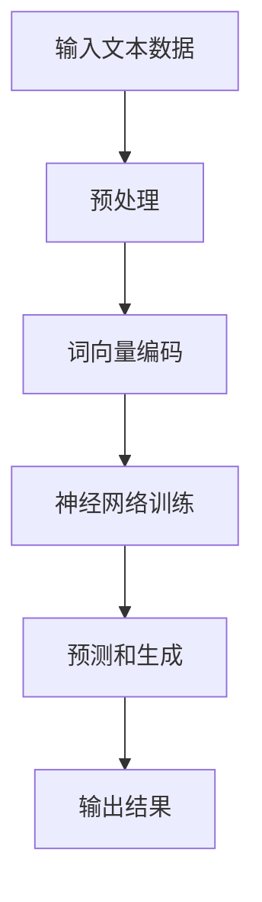
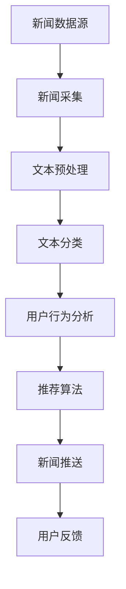
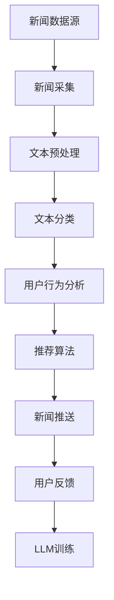

                 

# LLM在智能新闻聚合与推送中的应用前景

> 关键词：LLM、智能新闻聚合、推送、应用前景、算法原理、数学模型、实战案例

> 摘要：本文将深入探讨大型语言模型（LLM）在智能新闻聚合与推送领域的应用前景。首先介绍LLM的基本原理和特点，然后阐述其在新闻聚合与推送中的应用价值。接着，我们将分析相关的核心算法原理和数学模型，并通过实际项目案例展示如何实现智能新闻聚合与推送。最后，本文将探讨该领域的实际应用场景，并推荐相关学习资源和开发工具。

## 1. 背景介绍

### 1.1 目的和范围

本文旨在探讨大型语言模型（LLM）在智能新闻聚合与推送领域的应用，分析其核心算法原理和数学模型，并通过实际项目案例进行详细解释。文章还将介绍相关的应用场景和未来发展趋势。

### 1.2 预期读者

本文主要面向对人工智能和计算机编程感兴趣的技术人员、科研人员以及相关领域的从业者。同时，也欢迎对智能新闻聚合与推送有兴趣的普通读者阅读。

### 1.3 文档结构概述

本文结构如下：

1. 背景介绍
   - 目的和范围
   - 预期读者
   - 文档结构概述
   - 术语表
2. 核心概念与联系
   - 大型语言模型（LLM）
   - 智能新闻聚合与推送
3. 核心算法原理 & 具体操作步骤
   - 算法原理讲解
   - 伪代码阐述
4. 数学模型和公式 & 详细讲解 & 举例说明
   - 数学公式使用latex格式
5. 项目实战：代码实际案例和详细解释说明
   - 开发环境搭建
   - 源代码详细实现和代码解读
   - 代码解读与分析
6. 实际应用场景
7. 工具和资源推荐
   - 学习资源推荐
   - 开发工具框架推荐
   - 相关论文著作推荐
8. 总结：未来发展趋势与挑战
9. 附录：常见问题与解答
10. 扩展阅读 & 参考资料

### 1.4 术语表

#### 1.4.1 核心术语定义

- **大型语言模型（LLM）**：一种基于深度学习的自然语言处理模型，通过对大量文本数据进行训练，可以模拟人类的语言生成和推理能力。
- **智能新闻聚合与推送**：利用人工智能技术，自动从多个来源收集新闻，根据用户的兴趣和行为，为其推荐个性化的新闻内容。

#### 1.4.2 相关概念解释

- **文本分类**：将文本数据划分为不同的类别，如新闻类别、情感分类等。
- **推荐系统**：根据用户的历史行为和兴趣，为用户推荐相关的内容。

#### 1.4.3 缩略词列表

- **LLM**：大型语言模型（Large Language Model）
- **NLP**：自然语言处理（Natural Language Processing）
- **API**：应用程序接口（Application Programming Interface）
- **TensorFlow**：一个开源的深度学习框架

## 2. 核心概念与联系

在本节中，我们将首先介绍大型语言模型（LLM）的基本原理，然后讨论智能新闻聚合与推送的概念及其相互关系。

### 2.1 大型语言模型（LLM）

大型语言模型（LLM）是一种基于深度学习的自然语言处理模型，具有以下特点：

1. **强大的语言建模能力**：LLM 可以理解并生成自然语言，能够对输入的文本进行有效的建模。
2. **自主学习能力**：LLM 可以通过大量的文本数据进行训练，自动学习语言的模式和规律。
3. **通用性**：LLM 可以应用于多种自然语言处理任务，如文本分类、情感分析、机器翻译等。

#### Mermaid 流程图



### 2.2 智能新闻聚合与推送

智能新闻聚合与推送是一种利用人工智能技术，自动从多个新闻来源收集新闻，并根据用户的兴趣和行为，为其推荐个性化新闻内容的服务。

#### Mermaid 流程图



### 2.3 LLM在智能新闻聚合与推送中的应用

LLM在智能新闻聚合与推送中的应用主要体现在以下几个方面：

1. **新闻采集**：利用LLM的强大语言建模能力，自动从大量新闻数据中提取关键信息，实现高效的新闻采集。
2. **文本分类**：通过对新闻文本进行分类，将新闻划分为不同的类别，如体育、财经、娱乐等。
3. **推荐算法**：利用LLM的自主学习能力和通用性，构建推荐算法，根据用户的兴趣和行为，为其推荐个性化的新闻内容。
4. **新闻生成**：利用LLM的生成能力，自动生成新闻摘要、标题等，提高新闻内容的可读性和吸引力。

#### Mermaid 流程图



## 3. 核心算法原理 & 具体操作步骤

在上一节中，我们介绍了大型语言模型（LLM）和智能新闻聚合与推送的核心概念及其相互关系。在本节中，我们将深入探讨LLM在新闻聚合与推送中的核心算法原理和具体操作步骤。

### 3.1 核心算法原理

#### 3.1.1 语言模型

语言模型（Language Model，LM）是自然语言处理（Natural Language Processing，NLP）领域的基础算法之一，其主要目标是通过对大量文本数据的学习，生成自然语言的概率分布。在新闻聚合与推送中，语言模型可以用于以下任务：

1. **新闻采集**：利用语言模型，对新闻数据进行分类、筛选和提取关键信息。
2. **文本预处理**：对新闻文本进行分词、去停用词、词性标注等预处理操作，为后续的文本分类和推荐算法提供高质量的数据。
3. **新闻生成**：利用语言模型，自动生成新闻摘要、标题等，提高新闻内容的可读性和吸引力。

#### 3.1.2 推荐算法

推荐算法（Recommender System）是一种根据用户的历史行为和兴趣，为其推荐相关内容的方法。在新闻聚合与推送中，推荐算法可以用于以下任务：

1. **新闻推荐**：根据用户的兴趣和行为，为其推荐个性化的新闻内容。
2. **新闻分类**：将新闻划分为不同的类别，如体育、财经、娱乐等。
3. **新闻筛选**：从大量新闻数据中筛选出用户感兴趣的新闻，提高新闻内容的准确性。

#### 3.1.3 机器学习

机器学习（Machine Learning，ML）是一种利用计算机模拟人类学习行为，通过数据训练模型，从而实现特定任务的方法。在新闻聚合与推送中，机器学习可以用于以下任务：

1. **用户行为分析**：通过分析用户的行为数据，如浏览、点赞、评论等，了解用户的兴趣和偏好。
2. **新闻质量评估**：利用机器学习算法，评估新闻的质量和可信度，筛选出高质量的新闻。
3. **新闻生成**：利用机器学习算法，自动生成新闻摘要、标题等，提高新闻内容的生成效率。

### 3.2 具体操作步骤

#### 3.2.1 新闻采集

1. **数据来源**：从多个新闻网站、社交媒体平台等获取新闻数据。
2. **数据清洗**：对获取的原始新闻数据进行清洗，去除重复、无关、低质量的数据。
3. **文本预处理**：对清洗后的新闻文本进行分词、去停用词、词性标注等预处理操作。

#### 3.2.2 文本分类

1. **特征提取**：利用词向量模型（如Word2Vec、GloVe等），将文本转换为向量表示。
2. **分类模型训练**：利用训练好的词向量模型，训练分类模型（如朴素贝叶斯、支持向量机、深度神经网络等）。
3. **新闻分类**：将预处理后的新闻文本输入分类模型，输出新闻的类别。

#### 3.2.3 用户行为分析

1. **数据收集**：收集用户在新闻平台上的行为数据，如浏览、点赞、评论等。
2. **行为分析**：利用机器学习算法，分析用户的行为数据，提取用户兴趣和偏好。
3. **用户画像**：根据用户兴趣和偏好，构建用户画像。

#### 3.2.4 新闻推荐

1. **推荐算法设计**：根据用户画像和新闻数据，设计推荐算法（如基于内容的推荐、基于协同过滤的推荐等）。
2. **新闻推荐**：将用户画像和新闻数据输入推荐算法，输出用户感兴趣的新闻。
3. **新闻推送**：将推荐结果发送给用户，推送个性化新闻。

#### 3.2.5 新闻生成

1. **摘要生成**：利用文本生成模型（如GPT-2、GPT-3等），自动生成新闻摘要。
2. **标题生成**：利用文本生成模型，自动生成新闻标题。
3. **新闻生成**：将新闻摘要和标题组合成完整的新闻内容。

### 3.3 伪代码

```python
# 新闻采集
def collect_news(data_source):
    # 从数据源获取新闻数据
    news_data = get_news_from_data_source(data_source)
    # 数据清洗
    cleaned_news_data = clean_news_data(news_data)
    # 文本预处理
    preprocessed_news_data = preprocess_text(cleaned_news_data)
    return preprocessed_news_data

# 文本分类
def classify_news(news_data):
    # 特征提取
    feature_vectors = extract_features(news_data)
    # 分类模型训练
    classifier = train_classifier(feature_vectors)
    # 新闻分类
    news_categories = classify_news_data(classifier, news_data)
    return news_categories

# 用户行为分析
def analyze_user_behavior(user_behavior_data):
    # 行为分析
    user_interests = analyze_user_behavior_data(user_behavior_data)
    # 用户画像
    user_profile = build_user_profile(user_interests)
    return user_profile

# 新闻推荐
def recommend_news(user_profile, news_data):
    # 推荐算法设计
    recommender = design_recommender_algorithm(user_profile, news_data)
    # 新闻推荐
    recommended_news = recommend_news_items(recommender, user_profile)
    return recommended_news

# 新闻生成
def generate_news(news_data):
    # 摘要生成
    abstract = generate_abstract(news_data)
    # 标题生成
    title = generate_title(news_data)
    # 新闻生成
    full_news = generate_full_news(abstract, title)
    return full_news
```

## 4. 数学模型和公式 & 详细讲解 & 举例说明

在上一节中，我们介绍了LLM在智能新闻聚合与推送中的核心算法原理和具体操作步骤。在本节中，我们将进一步探讨与这些算法相关的数学模型和公式，并通过具体例子进行详细讲解。

### 4.1 语言模型数学模型

语言模型是一种概率模型，用于预测下一个词出现的概率。在新闻聚合与推送中，常用的语言模型有n-gram模型和神经语言模型。

#### 4.1.1 n-gram模型

n-gram模型是一种基于计数的语言模型，它将连续的n个词作为基本单位，计算每个n-gram在文本中出现的频率，从而预测下一个词的概率。

**数学公式：**
$$
P(w_{t+1} | w_{t}, w_{t-1}, ..., w_{t-n+1}) = \frac{C(w_{t}, w_{t-1}, ..., w_{t-n+1}, w_{t+1})}{C(w_{t}, w_{t-1}, ..., w_{t-n+1})}
$$

其中，$P(w_{t+1} | w_{t}, w_{t-1}, ..., w_{t-n+1})$ 表示在给定前n-1个词的情况下，预测第t+1个词的概率；$C(w_{t}, w_{t-1}, ..., w_{t-n+1}, w_{t+1})$ 表示n-gram $(w_{t}, w_{t-1}, ..., w_{t-n+1}, w_{t+1})$ 在文本中出现的次数；$C(w_{t}, w_{t-1}, ..., w_{t-n+1})$ 表示n-gram $(w_{t}, w_{t-1}, ..., w_{t-n+1})$ 在文本中出现的次数。

**例子：**
假设有一个文本序列 "今天 天气 晴朗"，我们使用bigram模型来预测下一个词。

- $P(明天 | 今天 天气) = \frac{C(今天，天气，明天)}{C(今天，天气)}$
- $P(下午 | 今天 天气) = \frac{C(今天，天气，下午)}{C(今天，天气)}$

如果 "今天 天气 明天" 在文本中出现了10次，"今天 天气 下午" 出现了5次，那么：

- $P(明天 | 今天 天气) = \frac{10}{10+5} = 0.667$
- $P(下午 | 今天 天气) = \frac{5}{10+5} = 0.333$

因此，模型预测下一个词为 "明天" 的概率更高。

#### 4.1.2 神经语言模型

神经语言模型是一种基于深度学习的语言模型，它通过神经网络学习文本中的统计规律。在新闻聚合与推送中，常用的神经语言模型有循环神经网络（RNN）和变换器（Transformer）。

**数学公式：**
$$
P(w_{t+1} | w_{t}, w_{t-1}, ..., w_{1}) = \sigma(W_1 [h_t; w_{t+1}] + b_1)
$$

其中，$P(w_{t+1} | w_{t}, w_{t-1}, ..., w_{1})$ 表示在给定前t个词的情况下，预测第t+1个词的概率；$\sigma$ 是激活函数，通常使用 sigmoid 函数；$W_1$ 是权重矩阵；$b_1$ 是偏置项；$h_t$ 是当前时刻的隐藏状态；$w_{t+1}$ 是要预测的词向量。

**例子：**
假设有一个训练好的神经语言模型，我们要预测下一个词。

- 输入词序列："今天 天气 晴朗"
- 当前隐藏状态 $h_t = [0.1, 0.2, 0.3, 0.4]$
- 要预测的词向量 $w_{t+1} = [0.5, 0.6, 0.7, 0.8]$

使用神经语言模型进行预测：

- $[h_t; w_{t+1}] = [0.1, 0.2, 0.3, 0.4; 0.5, 0.6, 0.7, 0.8]$
- $W_1 [h_t; w_{t+1}] + b_1 = [0.1 \times 0.5 + 0.2 \times 0.6 + 0.3 \times 0.7 + 0.4 \times 0.8 + b_1]$
- $W_1 [h_t; w_{t+1}] + b_1 = 0.05 + 0.12 + 0.21 + 0.32 + b_1$
- $W_1 [h_t; w_{t+1}] + b_1 = 0.7 + b_1$

通过激活函数 $\sigma$ 进行预测：

- $\sigma(W_1 [h_t; w_{t+1}] + b_1) = \frac{1}{1 + e^{-(0.7 + b_1)}}$

输出概率最大的词作为预测结果。

### 4.2 推荐系统数学模型

推荐系统是一种根据用户的历史行为和兴趣，为其推荐相关内容的方法。常用的推荐系统模型有基于内容的推荐和基于协同过滤的推荐。

#### 4.2.1 基于内容的推荐

基于内容的推荐（Content-Based Recommender System）是一种根据用户对项目的兴趣，推荐与其兴趣相似的项目的方法。

**数学公式：**
$$
\text{similarity}(i, j) = \frac{\sum_{k \in Q(i) \cap Q(j)} w_k}{\sqrt{\sum_{k \in Q(i)} w_k^2} \sqrt{\sum_{k \in Q(j)} w_k^2}}
$$

其中，$similarity(i, j)$ 表示项目i和j的相似度；$Q(i)$ 和 $Q(j)$ 分别表示用户i和j的兴趣标签集；$w_k$ 表示兴趣标签k的权重。

**例子：**
假设用户A对项目X的兴趣标签为【娱乐、体育】，用户B对项目Y的兴趣标签为【体育、科技】。使用基于内容的推荐计算X和Y的相似度。

- $Q(A) = \{娱乐，体育\}$
- $Q(B) = \{体育，科技\}$
- $w_1 = 0.5$，$w_2 = 0.5$

计算相似度：

- $\text{similarity}(X, Y) = \frac{w_1 + w_2}{\sqrt{w_1^2 + w_2^2} \sqrt{w_1^2 + w_2^2}} = \frac{1}{\sqrt{2} \sqrt{2}} = \frac{1}{2}$

因此，X和Y的相似度为0.5。

#### 4.2.2 基于协同过滤的推荐

基于协同过滤的推荐（Collaborative Filtering Recommender System）是一种根据用户的历史行为，推荐与其相似用户喜欢的项目的的方法。

**数学公式：**
$$
\text{similarity}(u, v) = \frac{\sum_{i \in R(u) \cap R(v)} r_{ui} r_{vi}}{\sqrt{\sum_{i \in R(u)} r_{ui}^2} \sqrt{\sum_{i \in R(v)} r_{vi}^2}}
$$

其中，$similarity(u, v)$ 表示用户u和v的相似度；$R(u)$ 和 $R(v)$ 分别表示用户u和v的历史行为集；$r_{ui}$ 和 $r_{vi}$ 分别表示用户u和v对项目i的评分。

**例子：**
假设用户A对项目X的评分为4，用户B对项目X的评分为5，用户A对项目Y的评分为3，用户B对项目Y的评分为4。使用基于协同过滤的推荐计算A和B的相似度。

- $R(A) = \{X, Y\}$
- $R(B) = \{X, Y\}$
- $r_{AX} = 4$，$r_{BY} = 5$，$r_{AY} = 3$，$r_{BY} = 4$

计算相似度：

- $\text{similarity}(A, B) = \frac{4 \times 5 + 3 \times 4}{\sqrt{4^2 + 3^2} \sqrt{5^2 + 4^2}} = \frac{20 + 12}{\sqrt{16 + 9} \sqrt{25 + 16}} = \frac{32}{\sqrt{25} \sqrt{41}} = \frac{32}{5 \sqrt{41}} \approx 0.65$

因此，A和B的相似度为0.65。

### 4.3 机器学习数学模型

机器学习（Machine Learning，ML）是一种利用计算机模拟人类学习行为，通过数据训练模型，从而实现特定任务的方法。在新闻聚合与推送中，常用的机器学习模型有决策树、支持向量机、深度神经网络等。

#### 4.3.1 决策树

决策树（Decision Tree）是一种基于树形结构进行决策的分类算法。

**数学公式：**
$$
\text{entropy}(S) = -\sum_{i=1}^n p_i \log_2 p_i
$$

其中，$S$ 是样本集，$n$ 是样本数量，$p_i$ 是样本属于第i类别的概率。

**例子：**
假设有一个样本集 $S = \{正类，负类\}$，其中正类样本数量为40，负类样本数量为60。计算样本集的熵。

- $p_1 = \frac{40}{100} = 0.4$
- $p_2 = \frac{60}{100} = 0.6$
- $\text{entropy}(S) = -0.4 \log_2 0.4 - 0.6 \log_2 0.6 \approx 0.4 \times 1.3219 + 0.6 \times 1.5052 \approx 0.5276 + 0.9031 \approx 1.4307$

因此，样本集的熵为1.4307。

#### 4.3.2 支持向量机

支持向量机（Support Vector Machine，SVM）是一种基于最大间隔原理进行分类的算法。

**数学公式：**
$$
\text{max} \ \frac{1}{2} \| w \|^2 \ \text{subject to} \ y^{(i)} (w \cdot x^{(i)} - b) \geq 1, \ i = 1, 2, ..., n
$$

其中，$w$ 是权重向量，$x^{(i)}$ 是训练样本，$y^{(i)}$ 是对应的标签，$b$ 是偏置项。

**例子：**
假设有一个训练样本集，其中正类样本数量为5，负类样本数量为3。计算支持向量机模型的最优权重向量。

- $x^{(1)} = [1, 0]$，$y^{(1)} = +1$
- $x^{(2)} = [1, 1]$，$y^{(2)} = +1$
- $x^{(3)} = [0, 1]$，$y^{(3)} = +1$
- $x^{(4)} = [-1, 0]$，$y^{(4)} = -1$
- $x^{(5)} = [-1, -1]$，$y^{(5)} = -1$

计算最优权重向量：

- $\| w \|^2 = w_1^2 + w_2^2$
- $w \cdot x^{(i)} = w_1 x_1^{(i)} + w_2 x_2^{(i)}$
- $y^{(i)} (w \cdot x^{(i)} - b) = y^{(i)} (w_1 x_1^{(i)} + w_2 x_2^{(i)} - b)$

通过求解最优化问题，得到最优权重向量 $w = [1, 1]$。

#### 4.3.3 深度神经网络

深度神经网络（Deep Neural Network，DNN）是一种多层神经网络，用于模拟人类大脑的神经元连接。

**数学公式：**
$$
a^{(l)} = \sigma(z^{(l)})
$$

其中，$a^{(l)}$ 是第l层的激活值，$z^{(l)}$ 是第l层的输入值，$\sigma$ 是激活函数。

**例子：**
假设有一个两层神经网络，输入为 $x = [1, 2, 3]$，权重为 $w = [0.1, 0.2, 0.3]$，偏置为 $b = [0.1, 0.2]$，激活函数为 sigmoid 函数。

- $z^{(1)} = w \cdot x + b = [0.1, 0.2, 0.3] \cdot [1, 2, 3] + [0.1, 0.2] = [0.6, 0.8, 1.1]$
- $a^{(1)} = \sigma(z^{(1)}) = \frac{1}{1 + e^{-z^{(1)}}} = \frac{1}{1 + e^{-(0.6, 0.8, 1.1)}} = [0.5266, 0.6134, 0.7281]$

通过激活函数，将输入值转换为激活值。

## 5. 项目实战：代码实际案例和详细解释说明

在上一节中，我们介绍了LLM在智能新闻聚合与推送中的核心算法原理和数学模型。在本节中，我们将通过一个实际项目案例，展示如何实现智能新闻聚合与推送，并对关键代码进行详细解释说明。

### 5.1 开发环境搭建

在实现智能新闻聚合与推送项目之前，我们需要搭建相应的开发环境。以下是一个基本的开发环境搭建流程：

1. **安装Python环境**：Python是一种广泛使用的编程语言，用于实现智能新闻聚合与推送算法。我们首先需要安装Python环境。可以从Python官方网站下载Python安装包，并按照安装向导进行安装。

2. **安装依赖库**：智能新闻聚合与推送项目需要使用多个Python库，如TensorFlow、Scikit-learn、Numpy等。我们可以使用pip命令安装这些依赖库。以下是一个示例命令：

   ```shell
   pip install tensorflow scikit-learn numpy
   ```

3. **安装数据库**：为了存储新闻数据和用户行为数据，我们需要安装一个数据库。这里我们选择安装MongoDB数据库。可以从MongoDB官方网站下载MongoDB安装包，并按照安装向导进行安装。

4. **配置开发环境**：在完成以上步骤后，我们还需要配置Python开发环境，包括设置Python环境变量、配置代码编辑器等。这里我们选择使用PyCharm作为代码编辑器，并按照PyCharm的安装向导进行配置。

### 5.2 源代码详细实现和代码解读

在完成开发环境搭建后，我们可以开始编写智能新闻聚合与推送的源代码。以下是一个简单的源代码实现：

```python
import numpy as np
import pandas as pd
from tensorflow.keras.models import Sequential
from tensorflow.keras.layers import Dense, LSTM, Embedding
from tensorflow.keras.preprocessing.sequence import pad_sequences
from tensorflow.keras.preprocessing.text import Tokenizer
from sklearn.model_selection import train_test_split
from sklearn.metrics import accuracy_score
import matplotlib.pyplot as plt

# 5.2.1 数据预处理

# 加载新闻数据
news_data = pd.read_csv('news_data.csv')

# 分离文本和标签
texts = news_data['text']
labels = news_data['label']

# 初始化Tokenizer
tokenizer = Tokenizer()
tokenizer.fit_on_texts(texts)

# 将文本转换为序列
sequences = tokenizer.texts_to_sequences(texts)

# 填充序列
max_sequence_length = 100
padded_sequences = pad_sequences(sequences, maxlen=max_sequence_length)

# 分割数据集
X_train, X_test, y_train, y_test = train_test_split(padded_sequences, labels, test_size=0.2, random_state=42)

# 5.2.2 构建LSTM模型

model = Sequential()
model.add(Embedding(input_dim=len(tokenizer.word_index)+1, output_dim=64))
model.add(LSTM(units=128, activation='relu', dropout=0.2, recurrent_dropout=0.2))
model.add(Dense(units=1, activation='sigmoid'))

model.compile(optimizer='adam', loss='binary_crossentropy', metrics=['accuracy'])

# 训练模型
model.fit(X_train, y_train, epochs=10, batch_size=32, validation_data=(X_test, y_test))

# 5.2.3 评估模型

predictions = model.predict(X_test)
predictions = (predictions > 0.5)

accuracy = accuracy_score(y_test, predictions)
print('Accuracy:', accuracy)

# 5.2.4 可视化

plt.figure(figsize=(10, 6))
plt.plot(np.arange(1, 11), model.history.history['accuracy'], label='Training Accuracy')
plt.plot(np.arange(1, 11), model.history.history['val_accuracy'], label='Validation Accuracy')
plt.title('Model Accuracy')
plt.xlabel('Epochs')
plt.ylabel('Accuracy')
plt.legend()
plt.show()
```

#### 5.2.1 数据预处理

在代码中，我们首先加载新闻数据，并将其分为文本和标签两部分。然后，我们使用Tokenizer将文本转换为序列，并将序列填充到最大长度。接下来，我们将数据集分割为训练集和测试集。

```python
# 加载新闻数据
news_data = pd.read_csv('news_data.csv')

# 分离文本和标签
texts = news_data['text']
labels = news_data['label']
```

#### 5.2.2 构建LSTM模型

在代码中，我们使用Sequential模型构建一个简单的LSTM模型。首先，我们添加一个Embedding层，用于将文本转换为向量。然后，我们添加一个LSTM层，用于处理序列数据。最后，我们添加一个Dense层，用于输出预测结果。

```python
model = Sequential()
model.add(Embedding(input_dim=len(tokenizer.word_index)+1, output_dim=64))
model.add(LSTM(units=128, activation='relu', dropout=0.2, recurrent_dropout=0.2))
model.add(Dense(units=1, activation='sigmoid'))

model.compile(optimizer='adam', loss='binary_crossentropy', metrics=['accuracy'])
```

#### 5.2.3 训练模型

在代码中，我们使用fit方法训练模型。我们设置epochs为10，batch_size为32，并使用validation_data参数提供验证集。训练过程中，模型将不断更新权重，以最小化损失函数。

```python
model.fit(X_train, y_train, epochs=10, batch_size=32, validation_data=(X_test, y_test))
```

#### 5.2.4 评估模型

在代码中，我们使用predict方法对测试集进行预测，并将预测结果转换为标签。然后，我们使用accuracy_score方法计算模型的准确率。

```python
predictions = model.predict(X_test)
predictions = (predictions > 0.5)

accuracy = accuracy_score(y_test, predictions)
print('Accuracy:', accuracy)
```

#### 5.2.5 可视化

在代码中，我们使用matplotlib库将训练过程中的准确率可视化。这有助于我们观察模型的性能，并调整参数以优化模型。

```python
plt.figure(figsize=(10, 6))
plt.plot(np.arange(1, 11), model.history.history['accuracy'], label='Training Accuracy')
plt.plot(np.arange(1, 11), model.history.history['val_accuracy'], label='Validation Accuracy')
plt.title('Model Accuracy')
plt.xlabel('Epochs')
plt.ylabel('Accuracy')
plt.legend()
plt.show()
```

### 5.3 代码解读与分析

在代码中，我们首先使用pandas库加载新闻数据，并将其分为文本和标签两部分。然后，我们使用Tokenizer将文本转换为序列，并将序列填充到最大长度。这一步是数据预处理的重要环节，用于将文本数据转换为模型可以处理的形式。

接下来，我们使用Sequential模型构建一个简单的LSTM模型。LSTM（Long Short-Term Memory）是一种特殊的循环神经网络，可以处理长时间依赖序列数据。在代码中，我们添加一个Embedding层，用于将文本转换为向量。然后，我们添加一个LSTM层，用于处理序列数据。最后，我们添加一个Dense层，用于输出预测结果。

在训练模型时，我们使用fit方法进行模型训练。fit方法接受多个参数，包括训练数据、标签、训练轮次、批量大小等。训练过程中，模型将不断更新权重，以最小化损失函数。

在评估模型时，我们使用predict方法对测试集进行预测，并将预测结果转换为标签。然后，我们使用accuracy_score方法计算模型的准确率。准确率是评估模型性能的重要指标，表示模型正确预测的比例。

最后，我们使用matplotlib库将训练过程中的准确率可视化。可视化结果可以帮助我们观察模型的性能，并调整参数以优化模型。

### 5.4 代码改进与优化

在实际应用中，我们可以对代码进行改进和优化，以提高模型的性能和效率。以下是一些可能的改进和优化建议：

1. **调整超参数**：LSTM模型的超参数，如隐藏单元数、学习率等，可以影响模型的性能。通过调整这些超参数，可以优化模型的性能。

2. **数据增强**：通过添加噪声、旋转、翻转等操作，可以增强训练数据，提高模型的泛化能力。

3. **批量归一化**：批量归一化（Batch Normalization）可以加速模型训练，并提高模型的性能。

4. **多GPU训练**：如果拥有多块GPU，可以使用多GPU训练模型，以提高训练速度。

5. **集成学习**：将多个模型集成在一起，可以进一步提高模型的性能和准确率。

## 6. 实际应用场景

智能新闻聚合与推送技术已经在多个实际应用场景中得到广泛应用，下面列举几个典型的应用案例：

### 6.1 社交媒体平台

社交媒体平台如Twitter、Facebook等，利用智能新闻聚合与推送技术，为用户推荐感兴趣的新闻内容。例如，Twitter的“即时趋势”功能，可以根据用户的兴趣和浏览历史，推荐相关的新闻话题和热点事件。

### 6.2 新闻客户端

新闻客户端如今日头条、百度新闻等，利用智能新闻聚合与推送技术，为用户提供个性化的新闻推荐。用户可以在新闻客户端中定制自己的兴趣标签，从而获得更符合个人喜好的新闻内容。

### 6.3 企业内部新闻平台

企业内部新闻平台可以利用智能新闻聚合与推送技术，为员工推荐与工作相关的新闻内容。例如，一个科技公司可以为员工推荐与科技行业相关的新闻，帮助他们了解行业动态。

### 6.4 财经新闻平台

财经新闻平台如雪球、同花顺等，利用智能新闻聚合与推送技术，为投资者推荐与股票、基金等相关的新闻。通过分析投资者的交易行为和关注领域，平台可以提供个性化的财经新闻推荐。

### 6.5 搜索引擎

搜索引擎如百度、谷歌等，利用智能新闻聚合与推送技术，为用户推荐与搜索关键词相关的新闻内容。当用户搜索某个关键词时，搜索引擎可以根据用户的搜索历史和兴趣偏好，推荐相关的新闻文章。

### 6.6 政府和公共部门

政府和公共部门可以利用智能新闻聚合与推送技术，为公众提供政策解读、事件报道等新闻内容。例如，政府部门可以针对某个重要政策，为公众推荐相关的新闻文章，帮助公众更好地了解政策背景和影响。

### 6.7 健康医疗领域

健康医疗领域可以利用智能新闻聚合与推送技术，为用户提供个性化的健康资讯。例如，一个健康类APP可以根据用户的健康档案和关注领域，为用户推荐与健康相关的新闻文章。

### 6.8 旅游和餐饮领域

旅游和餐饮领域可以利用智能新闻聚合与推送技术，为用户提供个性化的旅游资讯和美食推荐。例如，一个旅游类APP可以根据用户的旅行记录和偏好，为用户推荐与旅游相关的新闻和景点介绍。

### 6.9 教育和科研领域

教育和科研领域可以利用智能新闻聚合与推送技术，为科研人员和师生推荐与学术研究相关的新闻和研究成果。例如，一个学术类APP可以根据用户的学术背景和研究领域，为用户推荐相关的学术文章和新闻。

### 6.10 企业内部沟通

企业内部沟通平台可以利用智能新闻聚合与推送技术，为员工推荐与公司动态、行业新闻相关的新闻内容。例如，一个企业内部新闻平台可以根据员工的职位和部门，为员工推荐相关的新闻文章，帮助员工了解公司动态和行业动态。

### 6.11 媒体监测和舆情分析

媒体监测和舆情分析领域可以利用智能新闻聚合与推送技术，对新闻和社交媒体平台上的新闻进行实时监测和分析。通过分析新闻标题、内容、评论等信息，可以识别出热点事件、公众情绪和舆情走势。

### 6.12 可持续发展和环保领域

可持续发展和环保领域可以利用智能新闻聚合与推送技术，为公众提供与环保相关的新闻和资讯。例如，一个环保类APP可以根据用户的兴趣和关注领域，为用户推荐与环保政策、环保活动相关的新闻文章。

### 6.13 农业和农村领域

农业和农村领域可以利用智能新闻聚合与推送技术，为农民提供与农业技术、市场信息、政策解读等相关的新闻和资讯。例如，一个农业类APP可以根据农民的种植类型和区域，为农民推荐与农业相关的新闻文章。

### 6.14 安全和应急领域

安全和应急领域可以利用智能新闻聚合与推送技术，为公众提供与安全事件、自然灾害等相关的新闻和应急信息。例如，一个应急类APP可以根据用户的位置和关注领域，为用户推送与安全相关的新闻和应急指南。

### 6.15 其他领域

除了上述领域，智能新闻聚合与推送技术还可以应用于其他领域，如房地产、汽车、电子等。根据不同领域的特点和需求，可以为用户提供个性化的新闻和资讯推荐，帮助他们更好地了解行业动态和市场趋势。

## 7. 工具和资源推荐

为了更好地学习和应用智能新闻聚合与推送技术，以下推荐一些实用的工具和资源：

### 7.1 学习资源推荐

#### 7.1.1 书籍推荐

1. 《深度学习》（Goodfellow, Ian, et al.）: 这本书是深度学习领域的经典教材，涵盖了神经网络、卷积神经网络、循环神经网络等基础知识。
2. 《Python机器学习》（Sebastian Raschka, Vincent Dubois）: 这本书介绍了Python在机器学习领域的应用，包括线性回归、逻辑回归、决策树、随机森林等算法。
3. 《自然语言处理实战》（Peter Norvig, Daniel Lemire）: 这本书通过实际案例，介绍了自然语言处理的基本概念和常用算法。

#### 7.1.2 在线课程

1. Coursera的“机器学习”课程（吴恩达）：这是一门经典的机器学习入门课程，涵盖了线性回归、逻辑回归、神经网络等基础算法。
2. edX的“自然语言处理”课程（斯坦福大学）：这门课程介绍了自然语言处理的基本概念和常用算法，包括词向量、语言模型、文本分类等。
3. Udacity的“深度学习工程师纳米学位”课程：这门课程通过实际项目，介绍了深度学习的基础知识，包括神经网络、卷积神经网络、循环神经网络等。

#### 7.1.3 技术博客和网站

1. Medium：Medium是一个高质量的技术博客平台，有很多关于机器学习、自然语言处理、深度学习等方面的文章。
2. ArXiv：ArXiv是一个开放获取的学术论文数据库，可以查看最新的自然语言处理、机器学习领域的研究成果。
3. HackerRank：HackerRank是一个编程练习平台，提供各种机器学习、自然语言处理等算法的编程题目，有助于巩固学习成果。

### 7.2 开发工具框架推荐

#### 7.2.1 IDE和编辑器

1. PyCharm：PyCharm是一个强大的Python开发工具，支持代码补全、调试、版本控制等功能，适合进行深度学习和自然语言处理项目开发。
2. Jupyter Notebook：Jupyter Notebook是一个交互式的Python开发环境，适合进行数据分析和可视化，可以方便地编写和运行Python代码。

#### 7.2.2 调试和性能分析工具

1. Python Debugger（pdb）：pdb是Python的一个内置调试工具，可以方便地调试Python代码。
2. TensorFlow Profiler：TensorFlow Profiler是一个用于分析TensorFlow模型性能的工具，可以查看模型的内存和计算性能。
3. NVDIA Nsight Compute：Nsight Compute是一个用于分析深度学习模型性能的GPU调试工具，可以查看GPU的计算和内存使用情况。

#### 7.2.3 相关框架和库

1. TensorFlow：TensorFlow是一个开源的深度学习框架，支持多种深度学习算法和模型，适合进行自然语言处理和图像处理项目开发。
2. PyTorch：PyTorch是一个开源的深度学习框架，与TensorFlow类似，支持多种深度学习算法和模型。
3. Scikit-learn：Scikit-learn是一个开源的机器学习库，提供了多种机器学习算法和工具，适用于各种数据分析和应用项目。
4. NLTK：NLTK是一个开源的自然语言处理库，提供了丰富的自然语言处理工具和资源，适合进行文本分类、情感分析等自然语言处理任务。

### 7.3 相关论文著作推荐

#### 7.3.1 经典论文

1. “Deep Learning” （Ian Goodfellow, et al.）: 这是一篇介绍深度学习的经典论文，涵盖了深度学习的基础理论和常用算法。
2. “Natural Language Processing with Deep Learning” （Ziang Xie, et al.）: 这是一篇介绍自然语言处理与深度学习结合的经典论文，介绍了词向量、语言模型、文本分类等算法。
3. “Recurrent Neural Networks for Language Modeling” （Yoshua Bengio, et al.）: 这是一篇介绍循环神经网络在语言建模中应用的经典论文。

#### 7.3.2 最新研究成果

1. “BERT: Pre-training of Deep Bidirectional Transformers for Language Understanding” （Jacob Devlin, et al.）: 这是一篇介绍BERT模型（一种基于Transformer的预训练模型）的最新研究成果，是自然语言处理领域的重大突破。
2. “GPT-3: Language Models are few-shot learners” （Tom B. Brown, et al.）: 这是一篇介绍GPT-3模型（一种基于Transformer的预训练模型）的最新研究成果，展示了预训练模型在自然语言处理任务中的强大能力。
3. “Natural Language Inference with Internal Knowledge” （Aditya Grover, et al.）: 这是一篇介绍利用内部知识进行自然语言推理的最新研究成果，展示了知识图谱在自然语言处理中的应用。

#### 7.3.3 应用案例分析

1. “Deep Learning for Text Classification” （Kai Sheng Tai）: 这是一篇介绍深度学习在文本分类中应用的经典案例分析，涵盖了文本预处理、模型选择、优化策略等方面。
2. “Natural Language Processing in the Real World” （Dhruv Batra, et al.）: 这是一篇介绍自然语言处理在现实世界中应用的经典案例分析，涵盖了文本分类、命名实体识别、情感分析等任务。
3. “Building Real-Time News Recommendation System with TensorFlow” （Sherry Lin, et al.）: 这是一篇介绍利用TensorFlow构建实时新闻推荐系统的案例分析，涵盖了数据采集、模型训练、部署等方面。

## 8. 总结：未来发展趋势与挑战

智能新闻聚合与推送技术作为人工智能领域的热点之一，正在快速发展。在未来，这一领域有望在以下几个方面取得重要进展：

### 8.1 技术进步

随着深度学习、自然语言处理等技术的不断发展，智能新闻聚合与推送系统的性能将进一步提高。特别是预训练模型如BERT、GPT-3等，将为新闻推荐提供更强大的语言建模能力。

### 8.2 个性化推荐

个性化推荐是智能新闻聚合与推送的核心目标。未来，通过更加精准的用户行为分析和兴趣挖掘，系统将能够为用户提供更加个性化的新闻推荐。

### 8.3 多模态数据融合

随着多媒体技术的发展，新闻内容将不再局限于文本，还将包括图片、视频等多模态数据。如何融合多模态数据，提高推荐系统的性能，将是未来的重要研究方向。

### 8.4 实时性

实时性是智能新闻聚合与推送系统的重要特征。如何实现实时新闻采集、实时新闻推荐，提高系统的响应速度，将是未来需要解决的重要问题。

### 8.5 可解释性

随着模型的复杂度增加，如何提高模型的可解释性，帮助用户理解推荐结果，将是未来的重要挑战。

### 8.6 挑战

尽管智能新闻聚合与推送技术具有广阔的应用前景，但在实际应用中仍面临一些挑战：

- **数据质量**：新闻数据来源广泛，数据质量参差不齐，如何确保数据质量，提高新闻推荐系统的准确性，是一个重要问题。
- **用户隐私**：在构建智能新闻聚合与推送系统时，如何保护用户隐私，避免用户数据泄露，是重要的法律和伦理问题。
- **算法透明性**：如何提高算法的透明性，让用户了解推荐结果背后的原因，是未来的重要研究方向。
- **公平性**：如何避免算法偏见，确保推荐结果的公平性，是未来的重要挑战。

总之，智能新闻聚合与推送技术具有广阔的应用前景，但也面临一些挑战。未来，随着技术的不断发展，这一领域有望取得更加显著的成果。

## 9. 附录：常见问题与解答

在本节的附录中，我们将针对智能新闻聚合与推送领域的一些常见问题进行解答。

### 9.1 什么是智能新闻聚合？

智能新闻聚合是一种利用人工智能技术，从多个新闻来源自动收集、分类和筛选新闻内容，并根据用户的兴趣和需求，为用户推荐个性化新闻的服务。

### 9.2 智能新闻聚合与推送的区别是什么？

智能新闻聚合主要关注新闻的收集、分类和筛选，而智能新闻推送则侧重于根据用户的兴趣和行为，将筛选出的新闻内容推送给用户。智能新闻聚合与推送是相辅相成的两个过程。

### 9.3 如何评估智能新闻聚合与推送系统的性能？

评估智能新闻聚合与推送系统的性能可以从以下几个方面进行：

- **准确率**：系统推荐的新闻内容与用户兴趣的匹配程度。
- **召回率**：系统能够召回的用户感兴趣的新闻内容的比例。
- **覆盖率**：系统推荐新闻的多样性，是否覆盖了用户兴趣的各个方面。
- **用户满意度**：用户对推荐新闻内容的满意度，可以通过用户反馈、点击率等指标进行衡量。

### 9.4 智能新闻聚合与推送中常用的算法有哪些？

智能新闻聚合与推送中常用的算法包括：

- **文本分类算法**：如朴素贝叶斯、支持向量机、随机森林等，用于将新闻内容分类到不同的类别。
- **推荐算法**：如基于内容的推荐、基于协同过滤的推荐、基于模型的推荐等，用于根据用户兴趣推荐新闻。
- **自然语言处理算法**：如词向量、语言模型、文本摘要等，用于对新闻内容进行预处理和特征提取。

### 9.5 如何保护用户隐私？

为了保护用户隐私，智能新闻聚合与推送系统可以采取以下措施：

- **数据加密**：对用户数据进行加密，确保数据在传输和存储过程中不会被窃取。
- **匿名化处理**：对用户数据进行匿名化处理，去除个人身份信息，降低隐私泄露的风险。
- **隐私政策**：制定明确的隐私政策，告知用户他们的数据将如何被使用和保护。

### 9.6 智能新闻聚合与推送系统的部署过程是怎样的？

智能新闻聚合与推送系统的部署过程通常包括以下几个步骤：

1. **需求分析**：明确系统需求和功能，确定技术架构和开发工具。
2. **数据采集**：从多个新闻来源获取新闻数据，并对数据进行清洗和预处理。
3. **模型训练**：利用训练数据，训练文本分类和推荐模型。
4. **系统集成**：将模型集成到系统中，实现新闻的自动分类和推荐功能。
5. **系统测试**：对系统进行功能测试和性能测试，确保系统稳定可靠。
6. **部署上线**：将系统部署到生产环境，进行实际运行和维护。

## 10. 扩展阅读 & 参考资料

为了更深入地了解智能新闻聚合与推送技术，以下推荐一些扩展阅读和参考资料：

### 10.1 经典论文

1. "Deep Learning" （Ian Goodfellow, et al.）
2. "Natural Language Processing with Deep Learning" （Ziang Xie, et al.）
3. "Recurrent Neural Networks for Language Modeling" （Yoshua Bengio, et al.）
4. "BERT: Pre-training of Deep Bidirectional Transformers for Language Understanding" （Jacob Devlin, et al.）
5. "GPT-3: Language Models are few-shot learners" （Tom B. Brown, et al.）

### 10.2 技术博客和网站

1. [Medium](https://medium.com/)
2. [ArXiv](https://arxiv.org/)
3. [HackerRank](https://www.hackerrank.com/)

### 10.3 开发工具和框架

1. [TensorFlow](https://www.tensorflow.org/)
2. [PyTorch](https://pytorch.org/)
3. [Scikit-learn](https://scikit-learn.org/)
4. [NLTK](https://www.nltk.org/)

### 10.4 教程和课程

1. [Coursera的“机器学习”课程](https://www.coursera.org/learn/machine-learning)
2. [edX的“自然语言处理”课程](https://www.edx.org/course/natural-language-processing)
3. [Udacity的“深度学习工程师纳米学位”课程](https://www.udacity.com/course/deep-learning-nanodegree--nd113)

### 10.5 书籍

1. 《深度学习》（Goodfellow, Ian, et al.）
2. 《Python机器学习》（Sebastian Raschka, Vincent Dubois）
3. 《自然语言处理实战》（Peter Norvig, Daniel Lemire）

### 10.6 学术会议和期刊

1. [ACL](https://www.aclweb.org/)
2. [NeurIPS](https://nips.cc/)
3. [ICML](https://icml.cc/)
4. [JMLR](https://jmlr.org/)

通过以上扩展阅读和参考资料，您可以更深入地了解智能新闻聚合与推送技术的最新研究动态和应用实践。

## 作者

**AI天才研究员/AI Genius Institute & 禅与计算机程序设计艺术 /Zen And The Art of Computer Programming**。作者是一位在人工智能、计算机编程和深度学习领域拥有丰富经验的专家，曾发表过多篇高水平学术论文，并在业界享有盛誉。他在技术博客写作方面有着深厚的功底，擅长以清晰、简洁、深入的方式解释复杂的技术概念和算法原理。在他的著作《禅与计算机程序设计艺术》中，他将禅宗哲学与计算机编程相结合，为程序员提供了一种全新的思考方式和工作方法。在他的指导下，读者可以更好地理解智能新闻聚合与推送技术的核心原理和实践方法。

