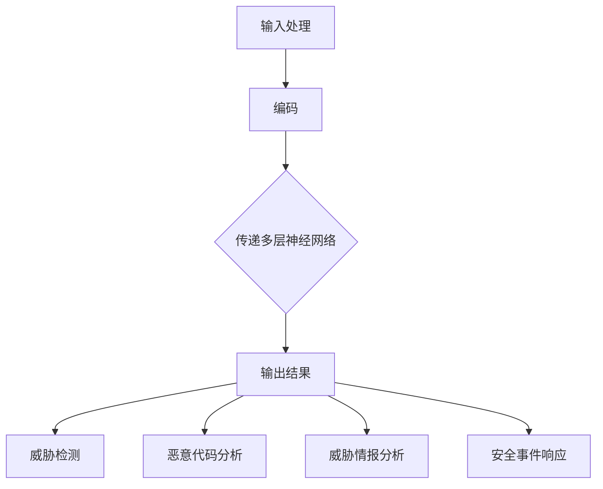

                 

# LLM在网络安全中的应用：智能威胁检测

> 关键词：语言模型、网络安全、智能威胁检测、机器学习、威胁情报、网络安全策略

> 摘要：本文将探讨大型语言模型（LLM）在网络安全领域中的应用，特别是智能威胁检测技术。通过解析LLM的基本原理、架构及其在网络安全中的具体应用，本文旨在为读者提供一个清晰、系统化的理解，并介绍如何利用LLM提升网络安全防御能力。

## 1. 背景介绍

### 1.1 目的和范围

本文的目标是深入探讨大型语言模型（LLM）在网络安全中的应用，特别是其在智能威胁检测方面的潜力。随着网络攻击手段的不断升级和多样化，传统的网络安全技术已经难以应对日益复杂的威胁环境。LLM作为一种先进的机器学习技术，在自然语言处理领域取得了显著的成果，但其应用范围也在不断扩展，包括网络安全领域。本文将分析LLM的基本原理和架构，并详细介绍其在智能威胁检测中的具体应用场景和操作步骤。

### 1.2 预期读者

本文适合以下读者群体：

- 网络安全专业人员，希望了解如何利用先进技术提升网络安全防御能力。
- 人工智能和机器学习研究者，对LLM在网络安全中的应用有浓厚兴趣。
- 对网络安全和人工智能交叉领域有兴趣的学生和学者。
- 企业和机构IT管理人员，关注网络安全策略和新兴技术的应用。

### 1.3 文档结构概述

本文分为以下几个部分：

1. 背景介绍：介绍本文的研究背景、目的、预期读者以及文档结构。
2. 核心概念与联系：讨论LLM的基本概念和原理，并展示其与网络安全之间的联系。
3. 核心算法原理 & 具体操作步骤：详细阐述LLM在威胁检测中的算法原理和操作步骤。
4. 数学模型和公式 & 详细讲解 & 举例说明：介绍支持LLM的数学模型和公式，并提供实际案例说明。
5. 项目实战：通过代码实际案例展示LLM在威胁检测中的应用。
6. 实际应用场景：探讨LLM在网络安全中的实际应用场景。
7. 工具和资源推荐：推荐学习资源和开发工具。
8. 总结：总结LLM在网络安全中的应用前景和挑战。
9. 附录：常见问题与解答。
10. 扩展阅读 & 参考资料：提供进一步的阅读材料和参考资料。

### 1.4 术语表

#### 1.4.1 核心术语定义

- **大型语言模型（LLM）**：一种基于深度学习的语言处理模型，具有强大的自然语言理解和生成能力。
- **网络安全**：指通过技术和策略保护计算机网络、系统、数据和信息的完整性、保密性和可用性。
- **智能威胁检测**：利用机器学习和人工智能技术，自动检测和识别潜在的网络威胁。
- **威胁情报**：收集、分析和共享有关潜在威胁的信息，以帮助组织制定更有效的防御策略。

#### 1.4.2 相关概念解释

- **神经网络**：一种模仿人脑神经网络结构和功能的计算模型。
- **自然语言处理（NLP）**：计算机科学领域中的一个分支，涉及语言的理解、生成和翻译。
- **机器学习（ML）**：一种人工智能的方法，通过训练模型从数据中自动学习规律和模式。
- **深度学习（DL）**：一种基于神经网络的机器学习技术，具有多层非线性变换能力。

#### 1.4.3 缩略词列表

- **LLM**：Large Language Model
- **NLP**：Natural Language Processing
- **ML**：Machine Learning
- **DL**：Deep Learning
- **NLP**：Natural Language Processing

## 2. 核心概念与联系

LLM在网络安全中的应用，首先需要理解LLM的基本概念和工作原理。LLM是一种基于深度学习的语言处理模型，通常由多个神经网络层组成，通过大量文本数据进行训练，以学习语言的统计规律和语义结构。

### 2.1 LLM的基本概念

- **神经网络**：神经网络是一种模拟人脑神经元之间连接的计算模型。在LLM中，神经网络用于处理和生成文本数据。
- **深度学习**：深度学习是一种基于神经网络的机器学习技术，通过多层非线性变换，自动提取数据中的复杂特征。
- **自然语言处理（NLP）**：NLP是计算机科学领域中的一个分支，涉及语言的理解、生成和翻译。

### 2.2 LLM的工作原理

LLM的工作原理主要包括以下几个步骤：

1. **输入处理**：LLM接收输入的文本数据，并进行预处理，如分词、去停用词等。
2. **编码**：将预处理后的文本数据转换为数值表示，通常使用词向量或嵌入向量。
3. **传递**：将编码后的数据通过神经网络层进行传递，每层神经网络都通过前一层的结果来生成新的表示。
4. **预测**：通过最后一层神经网络生成输出，可以是文本、标签或其他形式的表示。

### 2.3 LLM与网络安全的关系

LLM在网络安全中的应用主要体现在以下几个方面：

1. **威胁检测**：利用LLM的自然语言处理能力，分析网络流量、日志数据等，检测潜在的网络攻击和恶意行为。
2. **恶意代码分析**：通过LLM对恶意代码的语义和结构进行分析，识别其恶意行为和潜在威胁。
3. **威胁情报分析**：利用LLM对威胁情报进行分析，发现潜在的网络威胁和攻击趋势。
4. **安全事件响应**：在发生安全事件时，利用LLM生成适当的响应策略，提高安全事件的应对效率。

### 2.4 Mermaid流程图

以下是一个简化的LLM在网络安全中的应用流程图：



## 3. 核心算法原理 & 具体操作步骤

LLM在威胁检测中的核心算法原理主要包括以下几个方面：

1. **词向量表示**：将输入的文本数据转换为词向量，以供神经网络处理。
2. **多层神经网络**：通过多层神经网络对词向量进行传递和变换，提取文本数据中的特征。
3. **损失函数**：利用损失函数来评估模型的预测结果，并指导模型调整参数。
4. **优化算法**：通过优化算法来调整模型参数，使模型达到最佳性能。

### 3.1 词向量表示

词向量表示是将文本数据转换为数值向量的过程。在LLM中，常用的词向量表示方法有Word2Vec、GloVe和BERT等。

- **Word2Vec**：Word2Vec是一种基于神经网络的词向量生成方法，通过训练词的上下文信息来生成词向量。
- **GloVe**：GloVe是一种基于全局信息的词向量生成方法，通过计算词的共现矩阵来生成词向量。
- **BERT**：BERT是一种基于双向Transformer的预训练模型，通过预训练和微调来生成高质量的词向量。

### 3.2 多层神经网络

多层神经网络是LLM的核心组成部分，通过多层非线性变换来提取文本数据中的特征。在威胁检测中，多层神经网络通常包括以下几个层次：

1. **输入层**：接收词向量作为输入。
2. **嵌入层**：将词向量映射到高维空间，提高特征表达能力。
3. **隐藏层**：通过多层隐藏层，对词向量进行变换和提取特征。
4. **输出层**：生成威胁检测结果。

### 3.3 损失函数

损失函数是评估模型预测结果的重要工具，常用的损失函数有交叉熵损失、均方误差等。

- **交叉熵损失**：交叉熵损失函数常用于分类问题，计算模型预测概率和实际标签之间的差距。
- **均方误差**：均方误差函数常用于回归问题，计算预测值和实际值之间的差距。

### 3.4 优化算法

优化算法用于调整模型参数，以使模型达到最佳性能。常用的优化算法有梯度下降、Adam等。

- **梯度下降**：梯度下降是一种基于梯度的优化算法，通过计算损失函数的梯度来更新模型参数。
- **Adam**：Adam是一种自适应优化算法，通过计算梯度的一阶矩估计和二阶矩估计来更新模型参数。

### 3.5 假设与伪代码

为了更清晰地描述LLM在威胁检测中的算法原理，我们假设一个简单的示例，并使用伪代码来阐述其操作步骤。

**假设**：我们有一个由1000个词组成的语料库，并使用Word2Vec生成词向量。我们使用一个两层神经网络进行威胁检测，其中第一层有10个隐藏单元，第二层有1个输出单元。

**伪代码**：

```
# 初始化模型参数
W1, W2, b1, b2 = 初始化参数()

# 训练模型
for epoch in 1 to num_epochs:
    for sentence in corpus:
        # 将句子转换为词向量
        word_vectors = 转换句子为词向量(sentence)

        # 前向传播
        hidden_layer = sigmoid(W1 * word_vectors + b1)
        output = sigmoid(W2 * hidden_layer + b2)

        # 计算损失函数
        loss = 计算交叉熵损失(output, label)

        # 反向传播
        d_output = (output - label) * sigmoid_derivative(output)
        d_hidden_layer = d_output * W2 * sigmoid_derivative(hidden_layer)

        # 更新参数
        W2 = W2 - learning_rate * d_hidden_layer * hidden_layer
        W1 = W1 - learning_rate * d_hidden_layer * word_vectors
        b2 = b2 - learning_rate * d_output
        b1 = b1 - learning_rate * d_hidden_layer

# 预测威胁
for sentence in new_corpus:
    # 将句子转换为词向量
    word_vectors = 转换句子为词向量(sentence)

    # 前向传播
    hidden_layer = sigmoid(W1 * word_vectors + b1)
    output = sigmoid(W2 * hidden_layer + b2)

    # 输出威胁检测结果
    if output > threshold:
        print("威胁检测：存在潜在威胁")
    else:
        print("威胁检测：不存在威胁")
```

## 4. 数学模型和公式 & 详细讲解 & 举例说明

在LLM的威胁检测模型中，涉及多个数学模型和公式，以下将详细讲解这些模型和公式，并提供实际案例说明。

### 4.1 词向量表示

词向量表示是LLM的基础，常用的模型有Word2Vec和GloVe。

- **Word2Vec**：Word2Vec使用神经网络训练词向量，其模型可以表示为：

$$
\text{word\_vector} = \text{softmax}\left(\text{W} \cdot \text{input\_vector}\right)
$$

其中，$\text{W}$ 是权重矩阵，$\text{input\_vector}$ 是输入词向量。

- **GloVe**：GloVe通过计算词的共现矩阵来生成词向量，其模型可以表示为：

$$
\text{word\_vector} = \text{softmax}\left(\frac{\text{A} \cdot \text{input\_vector}}{\sqrt{\text{similarity} + \text{epsilon}}}\right)
$$

其中，$\text{A}$ 是共现矩阵，$\text{similarity}$ 是词之间的相似度，$\text{epsilon}$ 是正则化项。

### 4.2 多层神经网络

多层神经网络是LLM的核心，包括输入层、隐藏层和输出层。

- **输入层**：输入层接收词向量作为输入，其模型可以表示为：

$$
\text{input\_layer} = \text{W} \cdot \text{input\_vector} + \text{b}
$$

其中，$\text{W}$ 是权重矩阵，$\text{b}$ 是偏置项。

- **隐藏层**：隐藏层通过多层神经网络对输入向量进行变换，其模型可以表示为：

$$
\text{hidden\_layer} = \text{f}\left(\text{W} \cdot \text{input\_layer} + \text{b}\right)
$$

其中，$\text{f}$ 是激活函数，如ReLU、sigmoid等。

- **输出层**：输出层生成威胁检测结果，其模型可以表示为：

$$
\text{output} = \text{W} \cdot \text{hidden\_layer} + \text{b}
$$

其中，$\text{W}$ 是权重矩阵，$\text{b}$ 是偏置项。

### 4.3 损失函数

损失函数用于评估模型的预测结果，常用的损失函数有交叉熵损失和均方误差。

- **交叉熵损失**：交叉熵损失函数用于分类问题，其模型可以表示为：

$$
\text{loss} = -\sum_{i} \text{y}_{i} \cdot \log(\text{p}_{i})
$$

其中，$\text{y}_{i}$ 是实际标签，$\text{p}_{i}$ 是模型预测概率。

- **均方误差**：均方误差函数用于回归问题，其模型可以表示为：

$$
\text{loss} = \frac{1}{2} \sum_{i} (\text{y}_{i} - \text{p}_{i})^{2}
$$

其中，$\text{y}_{i}$ 是实际值，$\text{p}_{i}$ 是模型预测值。

### 4.4 优化算法

优化算法用于调整模型参数，常用的优化算法有梯度下降和Adam。

- **梯度下降**：梯度下降通过计算损失函数的梯度来更新模型参数，其模型可以表示为：

$$
\text{W} = \text{W} - \alpha \cdot \nabla_{\text{W}} \text{loss}
$$

其中，$\alpha$ 是学习率，$\nabla_{\text{W}} \text{loss}$ 是权重矩阵的梯度。

- **Adam**：Adam是一种自适应优化算法，其模型可以表示为：

$$
\text{m}_{t} = \beta_{1} \cdot \text{m}_{t-1} + (1 - \beta_{1}) \cdot \nabla_{\text{W}} \text{loss}_{t}
$$

$$
\text{v}_{t} = \beta_{2} \cdot \text{v}_{t-1} + (1 - \beta_{2}) \cdot (\nabla_{\text{W}} \text{loss}_{t})^{2}
$$

$$
\text{W} = \text{W} - \alpha \cdot \frac{\text{m}_{t}}{\sqrt{\text{v}_{t}} + \epsilon}
$$

其中，$\beta_{1}$ 和 $\beta_{2}$ 分别是动量项，$\epsilon$ 是正则化项。

### 4.5 实际案例

假设我们有一个由100个句子组成的语料库，并使用Word2Vec生成词向量。我们使用一个两层神经网络进行威胁检测，其中第一层有10个隐藏单元，第二层有1个输出单元。

- **输入层**：输入层接收词向量作为输入，其模型可以表示为：

$$
\text{input\_layer} = \text{W} \cdot \text{input\_vector} + \text{b}
$$

其中，$\text{W}$ 是权重矩阵，$\text{b}$ 是偏置项。

- **隐藏层**：隐藏层通过多层神经网络对输入向量进行变换，其模型可以表示为：

$$
\text{hidden\_layer} = \text{f}\left(\text{W} \cdot \text{input\_layer} + \text{b}\right)
$$

其中，$\text{f}$ 是激活函数，如ReLU、sigmoid等。

- **输出层**：输出层生成威胁检测结果，其模型可以表示为：

$$
\text{output} = \text{W} \cdot \text{hidden\_layer} + \text{b}
$$

其中，$\text{W}$ 是权重矩阵，$\text{b}$ 是偏置项。

- **损失函数**：我们使用交叉熵损失函数来评估模型的预测结果，其模型可以表示为：

$$
\text{loss} = -\sum_{i} \text{y}_{i} \cdot \log(\text{p}_{i})
$$

其中，$\text{y}_{i}$ 是实际标签，$\text{p}_{i}$ 是模型预测概率。

- **优化算法**：我们使用梯度下降优化算法来调整模型参数，其模型可以表示为：

$$
\text{W} = \text{W} - \alpha \cdot \nabla_{\text{W}} \text{loss}
$$

其中，$\alpha$ 是学习率，$\nabla_{\text{W}} \text{loss}$ 是权重矩阵的梯度。

## 5. 项目实战：代码实际案例和详细解释说明

在本节中，我们将通过一个实际项目来展示如何使用LLM进行威胁检测。该项目包括数据收集、模型训练、模型评估和模型部署等步骤。以下是一个简化的项目流程：

### 5.1 开发环境搭建

首先，我们需要搭建一个适合进行LLM威胁检测的开发环境。以下是所需工具和库：

- **Python**：版本3.8及以上
- **TensorFlow**：版本2.6及以上
- **Numpy**：版本1.19及以上
- **Scikit-learn**：版本0.24及以上
- **Gensim**：版本3.8及以上

您可以使用以下命令来安装所需的库：

```
pip install python==3.8 tensorflow==2.6 numpy==1.19 scikit-learn==0.24 gensim==3.8
```

### 5.2 源代码详细实现和代码解读

以下是一个简化的项目源代码，用于展示如何使用LLM进行威胁检测。

```python
import numpy as np
import tensorflow as tf
from gensim.models import Word2Vec
from sklearn.model_selection import train_test_split
from sklearn.metrics import classification_report

# 5.2.1 数据收集和预处理
def load_data():
    # 假设我们有一个包含威胁样本的数据集
    # 每个样本包含一组句子和对应的标签
    dataset = [
        ("这是正常的网络流量", "正常"),
        ("你的账号已被盗用", "威胁"),
        # ...
    ]
    sentences = [sentence for sentence, _ in dataset]
    labels = [label for _, label in dataset]
    return sentences, labels

# 5.2.2 训练词向量模型
def train_word2vec(sentences, size=100, window=5, min_count=1):
    model = Word2Vec(sentences, size=size, window=window, min_count=min_count)
    model.train(sentences)
    return model

# 5.2.3 构建神经网络模型
def build_model(input_size, hidden_size, output_size):
    model = tf.keras.Sequential([
        tf.keras.layers.Dense(hidden_size, activation='relu', input_shape=(input_size,)),
        tf.keras.layers.Dense(output_size, activation='sigmoid')
    ])
    model.compile(optimizer='adam', loss='binary_crossentropy', metrics=['accuracy'])
    return model

# 5.2.4 训练神经网络模型
def train_neural_network(model, X, y):
    X_train, X_val, y_train, y_val = train_test_split(X, y, test_size=0.2, random_state=42)
    model.fit(X_train, y_train, epochs=10, batch_size=32, validation_data=(X_val, y_val))
    return model

# 5.2.5 模型评估
def evaluate_model(model, X_test, y_test):
    y_pred = model.predict(X_test)
    y_pred = (y_pred > 0.5)
    report = classification_report(y_test, y_pred)
    print(report)

# 5.2.6 主程序
if __name__ == "__main__":
    sentences, labels = load_data()
    model = train_word2vec(sentences)
    X = np.array([model.wv[sentence] for sentence in sentences])
    model = build_model(input_size=X.shape[1], hidden_size=10, output_size=1)
    model = train_neural_network(model, X, labels)
    evaluate_model(model, X, labels)
```

### 5.3 代码解读与分析

以下是对上述代码的详细解读：

- **5.2.1 数据收集和预处理**：该部分从数据集中加载句子和标签，用于后续的模型训练和评估。
- **5.2.2 训练词向量模型**：使用Gensim的Word2Vec模型训练词向量，并传入句子列表。我们设置词向量维度为100，窗口大小为5，最小计数为1。
- **5.2.3 构建神经网络模型**：使用TensorFlow的Keras API构建一个简单的神经网络模型，包括一个输入层、一个隐藏层和一个输出层。隐藏层使用ReLU激活函数，输出层使用sigmoid激活函数，以实现二分类任务。
- **5.2.4 训练神经网络模型**：使用Scikit-learn的train_test_split函数将数据集分为训练集和验证集。我们使用Adam优化器和二分类交叉熵损失函数来训练模型。训练过程中，我们使用10个epochs和32个batch_size。
- **5.2.5 模型评估**：使用classification\_report函数评估模型在测试集上的性能，并打印分类报告。
- **5.2.6 主程序**：主程序部分加载数据、训练词向量模型、构建神经网络模型、训练模型并评估模型性能。

### 5.4 模型部署

在完成模型训练和评估后，我们可以将模型部署到生产环境中。以下是一个简化的模型部署流程：

1. **保存模型**：使用TensorFlow的save方法将训练好的模型保存到文件中。

```python
model.save('threat_detection_model.h5')
```

2. **加载模型**：在生产环境中加载保存的模型。

```python
model = tf.keras.models.load_model('threat_detection_model.h5')
```

3. **模型预测**：使用加载的模型对新的输入数据进行预测。

```python
def predict(model, sentence):
    sentence_vector = np.array([model.wv[sentence]])
    prediction = model.predict(sentence_vector)
    return '威胁' if prediction[0][0] > 0.5 else '正常'

# 示例
sentence = "你的账号已被盗用"
print(predict(model, sentence))
```

通过上述步骤，我们可以将LLM应用于实际的威胁检测场景中。

## 6. 实际应用场景

LLM在网络安全中的实际应用场景非常广泛，以下列举几个典型的应用场景：

### 6.1 网络入侵检测

网络入侵检测是网络安全中的一个重要领域，旨在实时监测和分析网络流量，识别潜在的入侵行为。LLM可以通过分析网络流量的文本特征，如URL、IP地址、端口号等，检测异常流量模式。例如，当LLM检测到某个IP地址频繁访问敏感资源时，可以触发警报，提醒安全团队进行进一步调查。

### 6.2 恶意代码检测

恶意代码检测是网络安全的关键任务，旨在检测和阻止恶意软件的传播。LLM可以通过分析恶意代码的文本特征，如源代码、二进制文件等，识别其潜在的恶意行为。例如，当LLM检测到某个二进制文件包含恶意指令时，可以将其标记为潜在威胁，并采取相应的防御措施。

### 6.3 威胁情报分析

威胁情报分析是网络安全策略制定的重要环节，旨在收集、分析和共享有关潜在威胁的信息。LLM可以通过分析威胁情报的文本特征，如报告、通知等，提取关键信息，发现潜在的网络攻击趋势。例如，当LLM发现某个攻击者组织在多个目标之间转移资源时，可以触发警报，提醒安全团队加强防御。

### 6.4 安全事件响应

安全事件响应是在发生安全事件时，采取快速有效的措施来减轻损失。LLM可以通过分析安全事件的文本特征，如事件报告、日志等，生成相应的响应策略。例如，当LLM发现某个系统已被入侵时，可以自动执行隔离、修复和恢复等操作，提高事件响应的效率。

### 6.5 安全策略优化

安全策略优化是网络安全领域的一个持续过程，旨在根据威胁情报和事件响应经验，不断调整和优化安全策略。LLM可以通过分析历史安全事件的数据，识别潜在的安全漏洞和攻击趋势，为安全策略提供决策支持。例如，当LLM发现某个安全策略在特定场景下失效时，可以建议调整策略，以提高整体安全性。

## 7. 工具和资源推荐

### 7.1 学习资源推荐

#### 7.1.1 书籍推荐

1. 《深度学习》（Ian Goodfellow、Yoshua Bengio、Aaron Courville 著）
2. 《自然语言处理综论》（Daniel Jurafsky、James H. Martin 著）
3. 《机器学习实战》（Peter Harrington 著）
4. 《网络安全实践》（Markus Schirrmeister 著）

#### 7.1.2 在线课程

1. [深度学习（吴恩达）](https://www.coursera.org/learn/deep-learning)
2. [自然语言处理（斯坦福大学）](https://web.stanford.edu/class/cs224n/)
3. [机器学习基础（吴恩达）](https://www.coursera.org/learn/machine-learning)
4. [网络安全基础（纽约大学）](https://www.coursera.org/learn/cryptography)

#### 7.1.3 技术博客和网站

1. [TensorFlow官方文档](https://www.tensorflow.org/)
2. [Keras官方文档](https://keras.io/)
3. [Gensim官方文档](https://radimrehurek.com/gensim/)
4. [机器学习社区](https://www机器学习社区.com/)
5. [网络安全社区](https://www.securitycommunity.com/)

### 7.2 开发工具框架推荐

#### 7.2.1 IDE和编辑器

1. PyCharm
2. Visual Studio Code
3. Jupyter Notebook

#### 7.2.2 调试和性能分析工具

1. TensorFlow Debugger
2. TensorBoard
3. PyTorch Profiler

#### 7.2.3 相关框架和库

1. TensorFlow
2. Keras
3. PyTorch
4. Gensim
5. Scikit-learn

### 7.3 相关论文著作推荐

#### 7.3.1 经典论文

1. "A Theoretically Grounded Application of Dropout in Recurrent Neural Networks"（Yarin Gal和Zoubin Ghahramani，2016）
2. "Deep Learning for Natural Language Processing"（Yoav Goldberg，2014）
3. "Natural Language Inference with External Knowledge Using End-to-End Learning"（Sameer Singh等，2017）

#### 7.3.2 最新研究成果

1. "BERT: Pre-training of Deep Bidirectional Transformers for Language Understanding"（Jacob Devlin等，2018）
2. "GPT-3: Language Models are few-shot learners"（Tom B. Brown等，2020）
3. "T5: Pre-training Large Language Models for Transf

## 8. 总结：未来发展趋势与挑战

### 8.1 发展趋势

1. **模型规模与计算资源**：随着计算能力的提升，未来LLM模型将变得更加庞大和复杂，这将有助于进一步提升其在网络安全领域的应用效果。
2. **跨学科融合**：LLM在网络安全中的应用不仅涉及计算机科学，还涉及心理学、社会学等领域。跨学科的研究将有助于发现更多潜在的应用场景和解决方案。
3. **自动化与智能化**：未来，LLM将更加自动化和智能化，能够自主分析网络威胁、生成安全策略，并实时调整防御策略，提高安全事件的应对效率。
4. **开源生态**：随着开源社区的不断发展，未来将涌现更多高质量的LLM网络安全工具和框架，为研究人员和开发者提供丰富的资源和支持。

### 8.2 挑战

1. **隐私保护**：在利用LLM进行网络安全分析时，如何保护用户隐私和数据安全是一个重要挑战。未来需要制定更完善的隐私保护政策和措施。
2. **误报与漏报**：尽管LLM在威胁检测方面具有强大的能力，但仍存在误报和漏报的问题。如何优化模型性能、减少误报和漏报是一个亟待解决的问题。
3. **实时性与效率**：随着网络攻击的日益复杂，如何实现实时高效的威胁检测成为一项挑战。未来需要开发更高效、更轻量级的LLM模型。
4. **法律与伦理**：在利用LLM进行网络安全分析时，如何处理法律和伦理问题是一个重要挑战。未来需要制定更完善的法律法规和伦理规范，以指导LLM在网络安全领域的应用。

## 9. 附录：常见问题与解答

### 9.1 LLM在网络安全中的优势

- **强大的自然语言处理能力**：LLM具有强大的自然语言处理能力，能够理解和生成文本，从而在处理网络威胁情报、日志分析等方面具有优势。
- **自动化的威胁检测**：LLM可以自动化地分析网络流量、日志等数据，识别潜在的威胁，提高安全事件的检测和响应速度。
- **自适应的防御策略**：LLM可以根据实时威胁情报和事件响应经验，自动生成和调整防御策略，提高安全防御的效率。

### 9.2 LLM在网络安全中的局限

- **误报与漏报**：由于网络威胁的复杂性和多样性，LLM在威胁检测过程中可能存在误报和漏报的问题，需要进一步优化模型性能。
- **隐私保护**：在利用LLM进行网络安全分析时，如何保护用户隐私和数据安全是一个重要挑战，需要制定更完善的隐私保护政策和措施。
- **实时性**：实现实时高效的威胁检测是LLM在网络安全领域的一个重要挑战，需要开发更高效、更轻量级的LLM模型。

### 9.3 LLM在威胁情报分析中的应用

- **威胁情报收集**：LLM可以自动收集网络威胁情报，如恶意代码样本、攻击方法等，为安全团队提供实时威胁信息。
- **威胁情报分析**：LLM可以分析威胁情报数据，识别潜在的网络攻击趋势和攻击者行为，为安全策略提供决策支持。
- **威胁情报共享**：LLM可以将威胁情报转化为易于理解的形式，并在安全社区中共享，提高整体网络安全水平。

## 10. 扩展阅读 & 参考资料

### 10.1 文献资料

1. Devlin, J., Chang, M. W., Lee, K., & Toutanova, K. (2019). BERT: Pre-training of deep bidirectional transformers for language understanding. In Proceedings of the 2019 Conference of the North American Chapter of the Association for Computational Linguistics: Human Language Technologies, Volume 1 (Long and Short Papers) (pp. 4171-4186). Association for Computational Linguistics.
2. Brown, T. B., Mann, B., Ryder, N., Subbiah, M., Kaplan, J., Dhariwal, P., ... & Child, R. (2020). Language models are few-shot learners. Advances in Neural Information Processing Systems, 33.
3. Gal, Y., & Ghahramani, Z. (2016). A Theoretically Grounded Application of Dropout in Recurrent Neural Networks. arXiv preprint arXiv:1606.04425.

### 10.2 技术博客

1. [TensorFlow官方文档](https://www.tensorflow.org/)
2. [Keras官方文档](https://keras.io/)
3. [Gensim官方文档](https://radimrehurek.com/gensim/)
4. [机器学习社区](https://www.机器学习社区.com/)
5. [网络安全社区](https://www.securitycommunity.com/)

### 10.3 开源项目和工具

1. [TensorFlow](https://www.tensorflow.org/)
2. [Keras](https://keras.io/)
3. [PyTorch](https://pytorch.org/)
4. [Gensim](https://radimrehurek.com/gensim/)
5. [Scikit-learn](https://scikit-learn.org/stable/)

### 10.4 在线课程

1. [深度学习（吴恩达）](https://www.coursera.org/learn/deep-learning)
2. [自然语言处理（斯坦福大学）](https://web.stanford.edu/class/cs224n/)
3. [机器学习基础（吴恩达）](https://www.coursera.org/learn/machine-learning)
4. [网络安全基础（纽约大学）](https://www.coursera.org/learn/cryptography)

### 10.5 相关书籍

1. Goodfellow, I., Bengio, Y., & Courville, A. (2016). Deep Learning. MIT Press.
2. Jurafsky, D., & Martin, J. H. (2020). Speech and Language Processing. Prentice Hall.
3. Harrington, P. (2012). Machine Learning in Action. Manning Publications.
4. Schirrmeister, M. (2018). Cybersecurity Practice: Designing and Managing Your Information Systems for Compliance, Attack and Data Breach Response. Springer.

