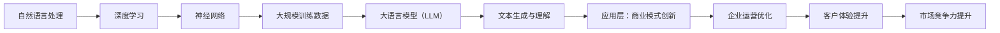

                 

# LLM对传统商业模式的颠覆与创新

> **关键词：** 大语言模型，商业模式，创新，颠覆，技术应用

> **摘要：** 本文旨在探讨大语言模型（LLM）对传统商业模式的颠覆与创新。通过对LLM的基本原理、技术架构和应用场景的深入分析，本文揭示了LLM如何改变企业运营方式、优化客户体验、提升市场竞争力，并展望了未来的发展趋势与挑战。

## 1. 背景介绍

### 1.1 目的和范围

本文的目的是分析大语言模型（LLM）如何影响传统商业模式，以及这种影响所带来的创新和颠覆。我们将探讨LLM的核心原理、技术架构、应用场景，并分析其对企业运营、客户体验和市场竞争力的影响。

### 1.2 预期读者

本文适合对人工智能和商业模式有一定了解的技术人员、企业决策者以及对创新感兴趣的研究者阅读。无论您是人工智能领域的专业人士，还是关注商业发展的决策者，本文都希望能为您带来新的启示。

### 1.3 文档结构概述

本文分为十个部分，首先介绍LLM的基本概念和背景，然后逐步深入探讨LLM的技术原理、应用场景、商业模式创新和颠覆，最后总结未来的发展趋势与挑战。

### 1.4 术语表

#### 1.4.1 核心术语定义

- **大语言模型（LLM）：** 一种基于深度学习的自然语言处理模型，能够对自然语言文本进行建模和生成。
- **商业模式：** 企业如何创造、传递和获取价值的一种体系。
- **颠覆性创新：** 一种新的商业模式或技术，能够破坏现有的市场结构，改变行业竞争格局。
- **创新性应用：** 在现有商业模式中引入新技术，以实现效率提升、成本降低或市场扩张。

#### 1.4.2 相关概念解释

- **自然语言处理（NLP）：** 计算机科学领域中的一个分支，涉及对自然语言的理解、生成和交互。
- **深度学习：** 一种机器学习技术，通过构建深度神经网络来模拟人脑的学习过程。
- **数据驱动决策：** 通过分析大量数据，从中提取有价值的信息，从而支持决策制定。

#### 1.4.3 缩略词列表

- **NLP：** 自然语言处理
- **LLM：** 大语言模型
- **AI：** 人工智能
- **GAN：** 生成对抗网络
- **CNN：** 卷积神经网络

## 2. 核心概念与联系

在深入探讨LLM对商业模式的影响之前，我们首先需要理解LLM的基本概念和技术架构。以下是一个简化的Mermaid流程图，展示了LLM的核心概念和组成部分。

### 2.1 大语言模型（LLM）的核心原理

大语言模型（LLM）是一种基于深度学习的自然语言处理模型，其核心原理是通过大规模的文本数据进行训练，使得模型能够对自然语言文本进行建模和生成。LLM的基本原理可以概括为以下几个方面：

1. **神经网络架构：** LL

