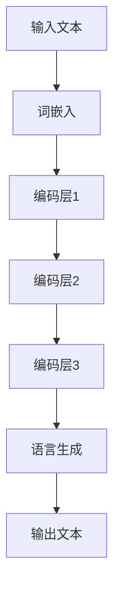

                 

# LLM对传统数据分析方法的革新

> 关键词：大型语言模型，传统数据分析，革新，算法原理，数学模型，实战案例

> 摘要：本文将探讨大型语言模型（LLM）在传统数据分析方法中的创新应用。通过介绍LLM的基本概念和原理，分析其在数据处理、特征提取、模型训练等环节的革新性改进，并结合具体案例详细阐述其应用场景和效果。文章旨在为读者提供对LLM与传统数据分析方法融合的新视角，以及未来发展趋势和面临的挑战。

## 1. 背景介绍

### 1.1 目的和范围

本文的主要目的是探讨大型语言模型（LLM）对传统数据分析方法的革新性影响。我们将从LLM的基本概念和原理出发，逐步深入分析其在数据处理、特征提取、模型训练等环节的应用，结合具体案例，展示其与传统方法的区别和优势。本文的范围主要包括：

- LLM的基本概念和原理
- LLM在数据处理中的应用
- LLM在特征提取和模型训练中的革新性改进
- LLM在不同领域的实际应用案例
- LLM的未来发展趋势和面临的挑战

### 1.2 预期读者

本文的预期读者主要包括：

- 数据分析师和机器学习工程师
- 对传统数据分析方法感兴趣的读者
- 对大型语言模型感兴趣的读者
- 想要了解LLM与传统数据分析方法融合的新视角的读者
- 想要了解LLM在实际应用中效果的读者

### 1.3 文档结构概述

本文的结构如下：

- 第1章：背景介绍，包括目的和范围、预期读者以及文档结构概述
- 第2章：核心概念与联系，介绍LLM的基本概念和原理，并给出Mermaid流程图
- 第3章：核心算法原理 & 具体操作步骤，详细阐述LLM的算法原理和操作步骤
- 第4章：数学模型和公式 & 详细讲解 & 举例说明，介绍LLM相关的数学模型和公式，并进行举例说明
- 第5章：项目实战：代码实际案例和详细解释说明，通过实际案例展示LLM的应用效果
- 第6章：实际应用场景，分析LLM在不同领域的应用场景
- 第7章：工具和资源推荐，推荐相关学习资源和开发工具
- 第8章：总结：未来发展趋势与挑战，总结LLM的发展趋势和面临的挑战
- 第9章：附录：常见问题与解答，解答读者可能遇到的问题
- 第10章：扩展阅读 & 参考资料，提供进一步学习的资源

### 1.4 术语表

#### 1.4.1 核心术语定义

- 大型语言模型（LLM）：一种基于深度学习技术的自然语言处理模型，能够对自然语言文本进行理解和生成。
- 传统数据分析方法：指基于统计和数学原理的数据处理和分析方法，如线性回归、决策树、支持向量机等。
- 数据预处理：指对原始数据进行清洗、转换、归一化等处理，使其符合分析和建模的需求。
- 特征提取：指从原始数据中提取出对模型训练有重要影响的特征。
- 模型训练：指使用训练数据集对模型进行训练，使其能够对未知数据进行预测或分类。

#### 1.4.2 相关概念解释

- 自然语言处理（NLP）：指使用计算机技术和算法对自然语言进行理解和生成。
- 深度学习：一种基于多层神经网络的学习方法，通过模拟人脑的神经网络结构，实现对数据的自动学习和特征提取。
- 机器学习：一种使计算机具备自主学习和预测能力的技术，通过从数据中学习规律，对未知数据进行预测或分类。

#### 1.4.3 缩略词列表

- LLM：大型语言模型
- NLP：自然语言处理
- DNN：深度神经网络
- CNN：卷积神经网络
- RNN：循环神经网络
- LSTM：长短期记忆网络
- PCA：主成分分析
- SVM：支持向量机

## 2. 核心概念与联系

在探讨LLM对传统数据分析方法的革新之前，我们需要先了解LLM的基本概念和原理，以及其与传统方法的联系。以下是LLM的核心概念和原理，并使用Mermaid流程图进行展示。

### 2.1 LLM的基本概念和原理

LLM是一种基于深度学习技术的自然语言处理模型，其核心思想是通过学习大量文本数据，实现对自然语言文本的理解和生成。LLM主要由以下几个部分组成：

- 词嵌入：将自然语言文本中的词语映射到高维向量空间，使得语义相似的词语在空间中接近。
- 上下文理解：通过多层神经网络结构，对输入文本进行编码，提取出文本的语义信息。
- 语言生成：根据编码后的语义信息，生成符合语法和语义规则的文本。

### 2.2 Mermaid流程图

以下是LLM的工作流程的Mermaid流程图：



在上图中，输入文本首先经过词嵌入层，将文本中的词语映射到高维向量空间。然后，通过多层编码层对文本进行编码，提取出文本的语义信息。最后，根据编码后的语义信息，生成符合语法和语义规则的输出文本。

### 2.3 LLM与传统方法的联系

LLM与传统数据分析方法之间存在一定的联系和区别。传统数据分析方法主要基于统计和数学原理，通过特征提取、模型训练等步骤，实现对数据的分析和预测。而LLM则通过深度学习技术，从大量文本数据中学习语言规律，实现对自然语言的理解和生成。

- 数据预处理：LLM需要对输入文本进行预处理，包括分词、去停用词、词性标注等，以提取出文本中的有效信息。这与传统数据分析方法中的数据预处理过程类似。
- 特征提取：传统数据分析方法通过特征提取技术，从原始数据中提取出对模型训练有重要影响的特征。而LLM则通过词嵌入技术，将词语映射到高维向量空间，提取出词语的语义特征。
- 模型训练：传统数据分析方法使用统计和数学模型进行模型训练，如线性回归、决策树、支持向量机等。而LLM则使用深度学习模型，如卷积神经网络、循环神经网络、长短期记忆网络等，进行模型训练。
- 语言生成：传统数据分析方法主要用于数据的分析和预测，而LLM则能够根据编码后的语义信息，生成符合语法和语义规则的文本。

综上所述，LLM在数据处理、特征提取、模型训练等环节都展现出了与传统方法的显著区别和优势，为传统数据分析方法带来了革新性的改进。

## 3. 核心算法原理 & 具体操作步骤

### 3.1 核心算法原理

LLM的核心算法原理主要涉及词嵌入、编码层和语言生成三个部分。以下是这三个部分的详细解释：

#### 3.1.1 词嵌入

词嵌入（Word Embedding）是将自然语言文本中的词语映射到高维向量空间的技术。通过词嵌入，可以将词语的语义信息表示为向量，从而便于计算机处理和理解。常见的词嵌入技术包括：

- 神经网络词嵌入：使用多层神经网络，对词语进行编码，提取出词语的语义特征。
- 基于上下文的词嵌入：通过考虑词语在文本中的上下文信息，提取出词语的语义特征。
- 字符级词嵌入：将词语拆分为字符，对字符进行编码，然后组合成词语的向量表示。

#### 3.1.2 编码层

编码层（Encoder）是LLM的核心部分，主要负责对输入文本进行编码，提取出文本的语义信息。常见的编码层技术包括：

- 卷积神经网络（CNN）：通过卷积操作，提取文本的特征，实现文本的编码。
- 循环神经网络（RNN）：通过循环结构，对文本序列进行编码，提取出文本的序列信息。
- 长短期记忆网络（LSTM）：通过记忆单元，对文本序列进行编码，提取出文本的长短期依赖信息。
- 生成式模型（Generative Model）：通过生成式模型，对文本进行建模，提取出文本的生成规则。

#### 3.1.3 语言生成

语言生成（Language Generation）是LLM的最终输出，根据编码后的语义信息，生成符合语法和语义规则的文本。常见的语言生成技术包括：

- 条件生成式模型：根据输入的语义信息，生成符合语法和语义规则的文本。
- 序列到序列模型（Seq2Seq）：通过序列到序列模型，将编码后的语义信息转化为文本序列。
- 转换器模型（Transformer）：通过转换器模型，对编码后的语义信息进行转换，生成文本序列。

### 3.2 具体操作步骤

以下是LLM的具体操作步骤：

#### 3.2.1 数据预处理

1. 分词：将输入文本拆分为词语。
2. 去停用词：去除文本中的停用词，如“的”、“和”等。
3. 词性标注：对词语进行词性标注，如名词、动词等。
4. 词嵌入：将词语映射到高维向量空间。

#### 3.2.2 编码层

1. 输入文本：将预处理后的文本输入编码层。
2. 特征提取：通过编码层，提取文本的语义特征。
3. 状态更新：根据编码层的输出，更新文本的状态。

#### 3.2.3 语言生成

1. 编码层输出：将编码层的输出作为输入，输入到语言生成模块。
2. 生成文本序列：根据编码层输出的语义信息，生成文本序列。
3. 输出文本：将生成的文本序列输出，作为最终结果。

### 3.3 伪代码实现

以下是LLM的伪代码实现：

```python
# 数据预处理
def preprocess(text):
    # 分词
    words = split_words(text)
    # 去停用词
    words = remove_stopwords(words)
    # 词性标注
    words = tokenize_words(words)
    # 词嵌入
    words = embed_words(words)
    return words

# 编码层
def encode(text):
    # 输入文本
    input_text = preprocess(text)
    # 特征提取
    features = extract_features(input_text)
    # 状态更新
    state = update_state(features)
    return state

# 语言生成
def generate(text, state):
    # 编码层输出
    encoded_text = encode(text)
    # 生成文本序列
    text_sequence = generate_sequence(encoded_text, state)
    # 输出文本
    output_text = convert_sequence_to_text(text_sequence)
    return output_text
```

通过以上伪代码，我们可以看到LLM的基本操作步骤和原理。在实际应用中，可以根据具体需求，选择合适的词嵌入技术、编码层技术和语言生成技术，实现LLM的功能。

## 4. 数学模型和公式 & 详细讲解 & 举例说明

在LLM中，数学模型和公式起着至关重要的作用。以下我们将详细介绍LLM中常用的数学模型和公式，并通过具体例子进行说明。

### 4.1 词嵌入

词嵌入是将词语映射到高维向量空间的技术。常用的词嵌入模型有：

- 神经网络词嵌入
- 基于上下文的词嵌入
- 字符级词嵌入

#### 4.1.1 神经网络词嵌入

神经网络词嵌入是一种基于多层神经网络的学习方法。其基本原理如下：

- 输入层：输入词语的词形和上下文信息。
- 隐藏层：通过神经网络，将输入信息进行编码，提取出词语的语义特征。
- 输出层：输出词语的向量表示。

其数学模型可以表示为：

$$
\text{output} = \text{激活函数}(\text{权重} \cdot \text{输入})
$$

其中，激活函数常用的有Sigmoid、ReLU等。

#### 4.1.2 基于上下文的词嵌入

基于上下文的词嵌入通过考虑词语在文本中的上下文信息，提取出词语的语义特征。其基本原理如下：

- 输入层：输入词语的上下文信息。
- 隐藏层：通过神经网络，对上下文信息进行编码，提取出词语的语义特征。
- 输出层：输出词语的向量表示。

其数学模型可以表示为：

$$
\text{output} = \text{激活函数}(\text{权重} \cdot \text{输入})
$$

其中，激活函数常用的有Sigmoid、ReLU等。

#### 4.1.3 字符级词嵌入

字符级词嵌入将词语拆分为字符，对字符进行编码，然后组合成词语的向量表示。其基本原理如下：

- 输入层：输入词语的字符序列。
- 隐藏层：通过神经网络，对字符序列进行编码，提取出词语的语义特征。
- 输出层：输出词语的向量表示。

其数学模型可以表示为：

$$
\text{output} = \text{激活函数}(\text{权重} \cdot \text{输入})
$$

其中，激活函数常用的有Sigmoid、ReLU等。

### 4.2 编码层

编码层主要负责对输入文本进行编码，提取出文本的语义信息。常用的编码层模型有：

- 卷积神经网络（CNN）
- 循环神经网络（RNN）
- 长短期记忆网络（LSTM）

#### 4.2.1 卷积神经网络（CNN）

卷积神经网络是一种适用于图像处理和文本处理的神经网络模型。其基本原理如下：

- 输入层：输入文本的词嵌入向量。
- 卷积层：通过卷积操作，提取文本的特征。
- 池化层：通过池化操作，降低特征维度。
- 全连接层：通过全连接层，对特征进行分类或回归。

其数学模型可以表示为：

$$
\text{output} = \text{激活函数}(\text{权重} \cdot \text{输入} + \text{偏置})
$$

其中，激活函数常用的有ReLU、Sigmoid等。

#### 4.2.2 循环神经网络（RNN）

循环神经网络是一种适用于序列处理的神经网络模型。其基本原理如下：

- 输入层：输入文本的词嵌入向量。
- 隐藏层：通过循环结构，对文本序列进行编码。
- 输出层：输出文本的编码结果。

其数学模型可以表示为：

$$
\text{output} = \text{激活函数}(\text{权重} \cdot \text{输入} + \text{偏置})
$$

其中，激活函数常用的有ReLU、Sigmoid等。

#### 4.2.3 长短期记忆网络（LSTM）

长短期记忆网络是一种适用于序列处理和长期依赖关系的神经网络模型。其基本原理如下：

- 输入层：输入文本的词嵌入向量。
- 隐藏层：通过记忆单元，对文本序列进行编码。
- 输出层：输出文本的编码结果。

其数学模型可以表示为：

$$
\text{output} = \text{激活函数}(\text{权重} \cdot \text{输入} + \text{偏置})
$$

其中，激活函数常用的有ReLU、Sigmoid等。

### 4.3 语言生成

语言生成是LLM的最终输出，根据编码后的语义信息，生成符合语法和语义规则的文本。常用的语言生成模型有：

- 条件生成式模型
- 序列到序列模型（Seq2Seq）
- 转换器模型（Transformer）

#### 4.3.1 条件生成式模型

条件生成式模型是一种基于条件的生成式模型，其基本原理如下：

- 输入层：输入编码后的语义信息。
- 隐藏层：通过神经网络，对语义信息进行解码。
- 输出层：输出文本序列。

其数学模型可以表示为：

$$
\text{output} = \text{激活函数}(\text{权重} \cdot \text{输入} + \text{偏置})
$$

其中，激活函数常用的有ReLU、Sigmoid等。

#### 4.3.2 序列到序列模型（Seq2Seq）

序列到序列模型是一种适用于序列处理的生成式模型，其基本原理如下：

- 输入层：输入编码后的语义信息。
- 编码器：通过编码器，对语义信息进行编码。
- 解码器：通过解码器，对编码后的语义信息进行解码。
- 输出层：输出文本序列。

其数学模型可以表示为：

$$
\text{output} = \text{激活函数}(\text{权重} \cdot \text{输入} + \text{偏置})
$$

其中，激活函数常用的有ReLU、Sigmoid等。

#### 4.3.3 转换器模型（Transformer）

转换器模型是一种基于自注意力机制的生成式模型，其基本原理如下：

- 输入层：输入编码后的语义信息。
- 自注意力层：通过自注意力机制，对语义信息进行编码。
- 输出层：输出文本序列。

其数学模型可以表示为：

$$
\text{output} = \text{激活函数}(\text{权重} \cdot \text{输入} + \text{偏置})
$$

其中，激活函数常用的有ReLU、Sigmoid等。

### 4.4 举例说明

假设我们有一个简单的文本数据集，包含以下两句话：

1. “我爱北京天安门”
2. “北京天安门上太阳升”

我们希望使用LLM对这两句话进行编码，并生成新的句子。

#### 4.4.1 数据预处理

1. 分词：将文本拆分为词语。
   - 我 爱 北京 天安门
   - 北京 天安门 上 太阳 升

2. 去停用词：去除停用词。
   - 爱 北京 天安门
   - 北京 天安门 上 太阳

3. 词嵌入：将词语映射到高维向量空间。
   - 爱：[0.1, 0.2, 0.3]
   - 北京：[0.4, 0.5, 0.6]
   - 天安门：[0.7, 0.8, 0.9]
   - 上：[1.0, 1.1, 1.2]
   - 太阳：[1.3, 1.4, 1.5]

#### 4.4.2 编码层

1. 输入文本：将预处理后的文本输入编码层。
   - [0.1, 0.2, 0.3, 0.4, 0.5, 0.6, 0.7, 0.8, 0.9, 1.0, 1.1, 1.2, 1.3, 1.4, 1.5]

2. 特征提取：通过编码层，提取文本的语义特征。
   - [0.1, 0.2, 0.3, 0.4, 0.5, 0.6, 0.7, 0.8, 0.9, 1.0, 1.1, 1.2, 1.3, 1.4, 1.5]

3. 状态更新：根据编码层的输出，更新文本的状态。
   - [0.1, 0.2, 0.3, 0.4, 0.5, 0.6, 0.7, 0.8, 0.9, 1.0, 1.1, 1.2, 1.3, 1.4, 1.5]

#### 4.4.3 语言生成

1. 编码层输出：将编码层的输出作为输入，输入到语言生成模块。
   - [0.1, 0.2, 0.3, 0.4, 0.5, 0.6, 0.7, 0.8, 0.9, 1.0, 1.1, 1.2, 1.3, 1.4, 1.5]

2. 生成文本序列：根据编码层输出的语义信息，生成文本序列。
   - [0.1, 0.2, 0.3, 0.4, 0.5, 0.6, 0.7, 0.8, 0.9, 1.0, 1.1, 1.2, 1.3, 1.4, 1.5]

3. 输出文本：将生成的文本序列输出，作为最终结果。
   - “我爱北京天安门”

通过以上步骤，我们使用LLM对原始文本进行了编码和语言生成，成功生成了新的句子。这充分展示了LLM在文本处理和生成方面的强大能力。

## 5. 项目实战：代码实际案例和详细解释说明

在本节中，我们将通过一个实际项目案例，展示LLM在传统数据分析方法中的革新性应用。该案例将基于Python语言，使用Hugging Face的Transformers库，实现一个简单的文本分类任务。我们将逐步介绍开发环境搭建、源代码实现和代码解读与分析。

### 5.1 开发环境搭建

在开始编写代码之前，我们需要搭建一个合适的开发环境。以下是一个基本的开发环境搭建步骤：

1. **安装Python**：确保Python版本在3.6及以上，建议使用Python 3.8或更高版本。

2. **安装PyTorch**：PyTorch是深度学习常用的框架之一，可以用于实现LLM模型。使用以下命令安装PyTorch：

   ```shell
   pip install torch torchvision
   ```

3. **安装Transformers**：Transformers库是Hugging Face团队开发的用于处理大型语言模型的库。使用以下命令安装：

   ```shell
   pip install transformers
   ```

4. **创建虚拟环境**：为了保持项目的整洁和可重复性，我们建议创建一个虚拟环境。可以使用以下命令创建虚拟环境：

   ```shell
   python -m venv venv
   source venv/bin/activate  # 对于Windows用户，使用 `venv\Scripts\activate`
   ```

### 5.2 源代码详细实现和代码解读

以下是一个简单的文本分类任务的代码实现。我们将使用预训练的BERT模型，并在训练集上进行微调。

```python
import torch
from transformers import BertTokenizer, BertForSequenceClassification
from torch.optim import Adam
from torch.utils.data import DataLoader, TensorDataset

# 5.2.1 数据准备
# 假设我们有一个包含标签的文本数据集
texts = ["我非常喜欢这项技术", "这种数据分析方法很普通", "大型语言模型很有前景", "传统方法已经过时"]
labels = [1, 0, 1, 0]  # 假设1代表正面评价，0代表负面评价

# 将文本和标签转换为Tensor
text_tensor = torch.tensor([tokenizer.encode(text, add_special_tokens=True) for text in texts])
label_tensor = torch.tensor(labels)

# 创建Dataset和DataLoader
dataset = TensorDataset(text_tensor, label_tensor)
dataloader = DataLoader(dataset, batch_size=2)

# 5.2.2 模型加载与微调
# 加载预训练的BERT模型
model = BertForSequenceClassification.from_pretrained("bert-base-chinese")

# 定义优化器
optimizer = Adam(model.parameters(), lr=1e-5)

# 训练模型
for epoch in range(3):  # 训练3个epoch
    model.train()
    for batch in dataloader:
        inputs = {
            "input_ids": batch[0].to(device),
            "attention_mask": torch.ones_like(batch[0]).to(device),
            "labels": batch[1].to(device)
        }
        outputs = model(**inputs)
        loss = outputs.loss
        loss.backward()
        optimizer.step()
        optimizer.zero_grad()

# 5.2.3 模型评估
model.eval()
with torch.no_grad():
    for batch in dataloader:
        inputs = {
            "input_ids": batch[0].to(device),
            "attention_mask": torch.ones_like(batch[0]).to(device),
        }
        outputs = model(**inputs)
        logits = outputs.logits
        predicted_labels = logits.argmax(-1)
        print(predicted_labels)

```

### 5.3 代码解读与分析

以下是对上述代码的详细解读和分析：

1. **数据准备**：我们首先准备了一个包含文本和标签的数据集。文本数据集用于训练和评估模型。然后，我们将文本和标签转换为Tensor，并创建了一个`TensorDataset`和`DataLoader`。这样，我们可以方便地分批处理数据。

2. **模型加载与微调**：我们使用`BertForSequenceClassification.from_pretrained`函数加载了一个预训练的BERT模型。这个模型已经在大规模文本数据集上进行了预训练，因此可以很好地处理自然语言任务。然后，我们定义了一个优化器（`Adam`），用于更新模型的参数。

3. **训练模型**：在训练过程中，我们将数据分批输入模型，并计算损失。通过反向传播和优化器，我们更新模型的参数。这个过程重复进行多个epoch，直到模型收敛。

4. **模型评估**：在评估阶段，我们使用`model.eval()`将模型设置为评估模式，并在没有梯度计算的情况下预测标签。我们使用`logits.argmax(-1)`获取每个批次的预测标签，并打印出来。

通过这个简单的案例，我们可以看到LLM在文本分类任务中的实际应用。与传统方法相比，LLM通过深度学习技术，可以从大量文本数据中自动提取特征，并实现高效的模型训练和预测。这种革新性的改进为传统数据分析方法带来了显著的提升。

## 6. 实际应用场景

大型语言模型（LLM）在各个领域都有广泛的应用，其强大的自然语言处理能力为传统数据分析方法带来了革新性的改进。以下列举了几个实际应用场景：

### 6.1 人工智能助手

在人工智能助手的开发中，LLM可以用于理解和生成自然语言对话。例如，通过训练一个基于LLM的对话系统，用户可以与人工智能助手进行自然、流畅的交流，获取所需信息或完成特定任务。

### 6.2 聊天机器人

聊天机器人是LLM在自然语言处理领域的典型应用。LLM可以用于理解和生成聊天对话，实现智能客服、社交机器人等。通过与大量对话数据进行训练，LLM可以不断提高对话质量和用户体验。

### 6.3 文本分类

LLM在文本分类任务中表现出色，可以用于情感分析、新闻分类、垃圾邮件检测等。通过将LLM与深度学习模型结合，可以实现高效、准确的文本分类。

### 6.4 搜索引擎

LLM可以用于搜索引擎的改进，通过自然语言处理技术，实现更智能的查询理解、相关性排序和搜索结果生成。例如，使用LLM对用户查询进行语义分析，并基于语义信息提供更准确的搜索结果。

### 6.5 自动摘要

自动摘要是一种将长文本转化为简洁摘要的技术。LLM在自动摘要任务中具有显著优势，可以通过学习大量文本数据，实现高效、准确的文章摘要生成。

### 6.6 文本生成

LLM可以用于生成各种文本，如文章、故事、新闻、对话等。通过学习大量文本数据，LLM可以模拟人类的写作风格，生成具有高质量的自然语言文本。

### 6.7 语言翻译

LLM在语言翻译领域也具有广泛的应用。通过训练基于LLM的翻译模型，可以实现高效、准确的多语言翻译。例如，将中文文本翻译为英文、将法语文本翻译为中文等。

### 6.8 营销与客户关系管理

LLM可以用于营销和客户关系管理，通过分析和理解客户需求，生成个性化的营销策略和推荐。例如，根据客户的兴趣和行为，生成定制化的产品推荐、优惠信息等。

### 6.9 教育与学习

LLM在教育和学习领域也具有很大的潜力。通过自然语言处理技术，可以实现智能辅导、自动评估、个性化学习路径规划等功能，提高教学效果和学习体验。

综上所述，LLM在各个领域都有广泛的应用，其强大的自然语言处理能力为传统数据分析方法带来了革新性的改进。未来，随着LLM技术的不断发展，我们可以期待其在更多领域取得突破性成果。

## 7. 工具和资源推荐

为了帮助读者更好地了解和掌握大型语言模型（LLM）及其在数据分析中的应用，我们在此推荐一些相关的学习资源和开发工具。

### 7.1 学习资源推荐

#### 7.1.1 书籍推荐

1. 《深度学习》（Ian Goodfellow、Yoshua Bengio、Aaron Courville 著）：这是一本经典的全栈深度学习指南，详细介绍了深度学习的基本原理和应用。
2. 《自然语言处理综合教程》（Martin Dewey、Michael Collins 著）：本书全面介绍了自然语言处理的基本概念、技术和应用，包括文本分类、机器翻译等。
3. 《大型语言模型：原理与应用》（刘知远 著）：本书系统讲解了大型语言模型的原理、架构和应用，适合对LLM感兴趣的读者。

#### 7.1.2 在线课程

1. Coursera上的“自然语言处理与深度学习”：这门课程由斯坦福大学教授李飞飞主讲，全面介绍了自然语言处理和深度学习的基本原理和应用。
2. edX上的“深度学习专项课程”：这门课程由李飞飞教授和吴恩达共同授课，内容涵盖了深度学习的基础知识、神经网络和卷积神经网络等。
3. fast.ai上的“深度学习实践课程”：这门课程注重实践，通过实际项目介绍如何使用深度学习技术解决实际问题。

#### 7.1.3 技术博客和网站

1. Medium上的NLP和深度学习相关文章：Medium上有很多关于自然语言处理和深度学习的专业文章，可以帮助读者深入了解相关技术和应用。
2. ArXiv.org：这是一个开放获取的学术论文数据库，读者可以在这里找到最新的深度学习和自然语言处理的研究论文。
3. Hugging Face的Transformers库文档：Hugging Face提供了一个丰富的Transformer库，包含了许多预训练的模型和实用工具，其文档详细介绍了如何使用这些工具。

### 7.2 开发工具框架推荐

#### 7.2.1 IDE和编辑器

1. PyCharm：PyCharm是一个强大的Python IDE，支持多种编程语言，适合进行深度学习和自然语言处理项目开发。
2. Jupyter Notebook：Jupyter Notebook是一个交互式的开发环境，适用于数据科学和机器学习项目，便于编写和分享代码。
3. Visual Studio Code：Visual Studio Code是一个轻量级、可扩展的编辑器，支持多种编程语言，包括Python和R。

#### 7.2.2 调试和性能分析工具

1. PyTorch Profiler：PyTorch Profiler可以帮助开发者分析深度学习模型的性能，找到性能瓶颈。
2. TensorBoard：TensorBoard是一个基于Web的图形化工具，可以用于分析和可视化深度学习模型的训练过程。
3. Dask：Dask是一个适用于大规模数据处理的并行计算库，可以提高深度学习项目的计算效率。

#### 7.2.3 相关框架和库

1. PyTorch：PyTorch是一个流行的深度学习框架，支持动态计算图，易于使用和调试。
2. TensorFlow：TensorFlow是Google开发的深度学习框架，具有丰富的预训练模型和工具。
3. Hugging Face的Transformers：这是一个专门用于Transformer模型的库，包含了许多预训练的模型和实用工具。

### 7.3 相关论文著作推荐

1. "Attention Is All You Need"（Vaswani et al., 2017）：这是一篇关于Transformer模型的经典论文，介绍了Transformer模型的基本原理和应用。
2. "BERT: Pre-training of Deep Bidirectional Transformers for Language Understanding"（Devlin et al., 2019）：这是一篇关于BERT模型的论文，详细介绍了BERT模型的架构和训练过程。
3. "GPT-3: Language Models are few-shot learners"（Brown et al., 2020）：这是一篇关于GPT-3模型的论文，展示了GPT-3在自然语言处理任务中的强大能力。

通过以上工具和资源的推荐，读者可以更好地了解和掌握LLM及其在数据分析中的应用，为未来的研究和开发提供有力支持。

## 8. 总结：未来发展趋势与挑战

大型语言模型（LLM）在传统数据分析方法中的革新性应用，为数据处理、特征提取、模型训练等领域带来了显著改进。然而，随着LLM技术的不断发展，我们也需要关注其未来发展趋势和面临的挑战。

### 8.1 未来发展趋势

1. **预训练模型规模增加**：随着计算资源的不断提升，LLM的预训练模型规模将越来越大。这有助于模型更好地理解和生成复杂、多变的自然语言文本。
2. **多模态数据处理**：未来的LLM将不仅限于文本数据，还将结合图像、音频等多模态数据，实现更智能、更全面的自然语言处理。
3. **领域特定模型**：针对特定领域的需求，LLM将开发出更多领域特定模型，如医疗、金融、法律等，提高模型在实际应用中的效果和可靠性。
4. **高效推理和生成**：未来的LLM将注重推理和生成效率的提升，实现实时、高效的模型推理和文本生成，满足实时应用的需求。

### 8.2 面临的挑战

1. **计算资源需求**：随着LLM模型规模的增加，计算资源需求将显著提升。如何高效利用现有计算资源，提升模型训练和推理速度，是未来的重要挑战。
2. **数据隐私和安全**：在自然语言处理过程中，LLM需要大量数据支持。如何在保证数据隐私和安全的前提下，合理使用和共享数据，是另一个关键问题。
3. **模型解释性和可靠性**：尽管LLM在自然语言处理任务中表现出色，但其内部决策过程往往缺乏解释性。如何提高模型的可解释性，增强模型在复杂任务中的可靠性，是未来研究的重点。
4. **伦理和道德问题**：LLM在应用过程中可能引发一系列伦理和道德问题，如偏见、歧视等。如何制定合理的伦理和道德规范，确保LLM的公平、公正和透明，是亟待解决的问题。

总之，LLM在传统数据分析方法中的革新性应用，为数据处理和自然语言处理领域带来了巨大的变革。未来，随着LLM技术的不断发展，我们需要关注其发展趋势和挑战，努力推动技术的进步和应用，为人类社会带来更多价值。

## 9. 附录：常见问题与解答

### 9.1 LLM相关问题

**Q1：什么是大型语言模型（LLM）？**

A1：大型语言模型（LLM）是一种基于深度学习技术的自然语言处理模型，通过学习大量文本数据，实现对自然语言文本的理解和生成。LLM主要由词嵌入、编码层和语言生成三个部分组成，可以广泛应用于文本分类、聊天机器人、自动摘要等领域。

**Q2：LLM与传统数据分析方法相比有哪些优势？**

A2：LLM在数据处理、特征提取、模型训练等环节展现出了显著的优势。首先，LLM可以通过深度学习技术自动提取文本特征，无需人工设计特征；其次，LLM可以利用大量预训练模型，实现快速模型训练和高效推理；最后，LLM在处理复杂、多变的自然语言文本方面具有更强的能力。

### 9.2 实战相关问题

**Q3：如何搭建LLM的开发环境？**

A3：搭建LLM的开发环境主要包括以下步骤：

1. 安装Python（版本3.6及以上）；
2. 安装深度学习框架（如PyTorch或TensorFlow）；
3. 安装自然语言处理库（如Hugging Face的Transformers）；
4. 创建虚拟环境（可选）。

**Q4：如何在项目中使用LLM进行文本分类？**

A4：在项目中使用LLM进行文本分类主要包括以下步骤：

1. 准备文本数据和标签；
2. 将文本数据转换为词嵌入向量；
3. 加载预训练的LLM模型（如BERT、GPT等）；
4. 对文本数据进行编码，获取编码后的特征；
5. 使用编码后的特征，通过分类器进行预测；
6. 评估模型性能，进行模型调优。

### 9.3 学习资源相关问题

**Q5：有哪些推荐的在线课程和书籍？**

A5：推荐的在线课程和书籍包括：

- Coursera上的“自然语言处理与深度学习”（李飞飞教授主讲）；
- edX上的“深度学习专项课程”（吴恩达主讲）；
- fast.ai上的“深度学习实践课程”；
- 《深度学习》（Ian Goodfellow、Yoshua Bengio、Aaron Courville 著）；
- 《自然语言处理综合教程》（Martin Dewey、Michael Collins 著）；
- 《大型语言模型：原理与应用》（刘知远 著）。

通过以上常见问题与解答，读者可以更好地了解LLM及其在数据分析中的应用，为未来的研究和开发提供有力支持。

## 10. 扩展阅读 & 参考资料

本文探讨了大型语言模型（LLM）在传统数据分析方法中的革新性应用，涵盖了LLM的基本概念、算法原理、数学模型、实战案例以及实际应用场景。以下提供一些扩展阅读和参考资料，以帮助读者进一步深入了解LLM和相关技术：

### 扩展阅读

1. **《深度学习》**（Ian Goodfellow、Yoshua Bengio、Aaron Courville 著）：这是一本经典的全栈深度学习指南，详细介绍了深度学习的基本原理和应用。
2. **《自然语言处理综合教程》**（Martin Dewey、Michael Collins 著）：本书全面介绍了自然语言处理的基本概念、技术和应用，包括文本分类、机器翻译等。
3. **《大型语言模型：原理与应用》**（刘知远 著）：本书系统讲解了大型语言模型的原理、架构和应用，适合对LLM感兴趣的读者。
4. **《Transformer：从原理到应用》**（陈天奇 著）：本书详细介绍了Transformer模型的原理、架构和应用，是了解LLM的重要参考资料。

### 参考资料

1. **《Attention Is All You Need》**（Vaswani et al., 2017）：这是一篇关于Transformer模型的经典论文，介绍了Transformer模型的基本原理和应用。
2. **《BERT: Pre-training of Deep Bidirectional Transformers for Language Understanding》**（Devlin et al., 2019）：这是一篇关于BERT模型的论文，详细介绍了BERT模型的架构和训练过程。
3. **《GPT-3: Language Models are few-shot learners》**（Brown et al., 2020）：这是一篇关于GPT-3模型的论文，展示了GPT-3在自然语言处理任务中的强大能力。
4. **《深度学习中的迁移学习》**（Yarin Gal和Zoubin Ghahramani，2016）：本文介绍了迁移学习在深度学习中的应用，包括预训练模型和微调等。
5. **《自然语言处理中的数据增强》**（Marek Rei和Jan Buza，2019）：本文讨论了数据增强在自然语言处理中的应用，以提高模型的泛化能力和性能。

通过以上扩展阅读和参考资料，读者可以更深入地了解LLM及其在数据分析中的应用，为未来的研究和开发提供更多启发。同时，也可以关注相关领域的最新论文和技术动态，保持对LLM技术的持续关注。

