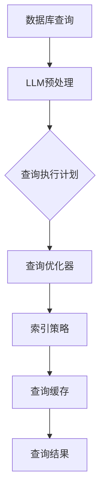

                 

# LLM对传统数据库查询优化的革新

> 关键词：LLM，数据库查询优化，传统数据库，人工智能，算法改进，性能提升

> 摘要：本文将深入探讨大型语言模型（LLM）如何革新传统数据库查询优化领域。通过详细阐述LLM的工作原理、与传统数据库查询优化技术的对比，以及具体的数学模型和实现方法，本文旨在为读者呈现LLM在数据库查询优化中的应用及其带来的变革。同时，文章还将探讨LLM在实际项目中的应用案例，并展望其未来的发展趋势与挑战。

## 1. 背景介绍

### 1.1 目的和范围

本文的主要目的是介绍和探讨大型语言模型（LLM）如何对传统数据库查询优化领域带来革新。随着大数据时代的到来，数据库查询优化成为一个越来越重要的研究领域。传统的查询优化技术虽然已经取得了显著的成果，但随着数据量的指数级增长和查询复杂度的提升，传统方法面临着巨大的挑战。而LLM的出现为数据库查询优化提供了新的思路和可能性。

本文将首先介绍LLM的基本原理和特点，然后分析其与传统数据库查询优化技术的差异和优势，接着详细讨论LLM在数据库查询优化中的具体应用和实现方法。最后，我们将通过实际项目案例来展示LLM在实际应用中的效果，并展望其未来的发展趋势与挑战。

### 1.2 预期读者

本文主要面向以下几类读者：

1. 数据库管理员和开发者，他们希望了解如何利用LLM来优化数据库查询性能。
2. 人工智能研究人员和工程师，他们希望了解LLM在数据库查询优化中的潜在应用和实现方法。
3. 计算机科学和数据库领域的学生，他们希望深入了解数据库查询优化领域的最新进展和技术。

### 1.3 文档结构概述

本文将按照以下结构进行阐述：

1. **背景介绍**：介绍本文的目的和范围，预期读者以及文档结构概述。
2. **核心概念与联系**：介绍LLM的基本概念和原理，与传统数据库查询优化的联系。
3. **核心算法原理 & 具体操作步骤**：详细阐述LLM在数据库查询优化中的算法原理和具体操作步骤。
4. **数学模型和公式 & 详细讲解 & 举例说明**：介绍LLM在数据库查询优化中的数学模型和公式，并进行详细讲解和举例说明。
5. **项目实战：代码实际案例和详细解释说明**：通过实际项目案例展示LLM在数据库查询优化中的应用，并进行详细解释说明。
6. **实际应用场景**：探讨LLM在数据库查询优化中的实际应用场景。
7. **工具和资源推荐**：推荐与LLM和数据库查询优化相关的学习资源、开发工具和框架。
8. **总结：未来发展趋势与挑战**：总结本文的主要内容和结论，并展望LLM在数据库查询优化领域的未来发展趋势与挑战。
9. **附录：常见问题与解答**：针对本文中涉及的关键概念和技术，提供常见问题与解答。
10. **扩展阅读 & 参考资料**：提供进一步学习和研究的参考资料。

### 1.4 术语表

#### 1.4.1 核心术语定义

- **大型语言模型（LLM）**：一种能够理解和生成自然语言的人工智能模型，通常基于神经网络和深度学习技术。
- **数据库查询优化**：通过改进查询执行计划、索引策略等手段，提高数据库查询的效率和性能。
- **传统数据库查询优化技术**：包括查询重写、索引优化、查询缓存等技术手段。
- **查询计划生成**：根据查询语句生成具体的查询执行计划，包括选择表、连接策略、访问路径等。

#### 1.4.2 相关概念解释

- **自然语言处理（NLP）**：人工智能的一个分支，旨在使计算机能够理解、生成和处理人类语言。
- **深度学习**：一种基于多层神经网络的机器学习方法，通过训练大量数据来自动学习复杂的模式。
- **神经网络**：一种模仿人脑神经网络结构和功能的信息处理系统。

#### 1.4.3 缩略词列表

- **LLM**：Large Language Model，大型语言模型。
- **NLP**：Natural Language Processing，自然语言处理。
- **NLU**：Natural Language Understanding，自然语言理解。
- **NLI**：Natural Language Interface，自然语言接口。

## 2. 核心概念与联系

### 2.1 大型语言模型（LLM）的基本概念和原理

大型语言模型（LLM）是一种基于深度学习技术的自然语言处理模型，能够理解和生成自然语言。LLM通常采用变换器架构（Transformer），这种架构具有强大的并行处理能力和全局信息传递能力，使其在自然语言处理任务中表现出色。

LLM的核心原理是通过大规模的预训练数据学习语言的模式和结构。预训练通常包括两个阶段：无监督预训练和有监督微调。在无监督预训练阶段，模型在大规模语料库上学习语言的统计规律，例如词汇分布、语法结构等。在有监督微调阶段，模型针对特定任务（如文本分类、命名实体识别等）进行微调，以提高在具体任务上的性能。

### 2.2 传统数据库查询优化技术

传统数据库查询优化技术主要包括查询重写、索引优化、查询缓存等方法。

- **查询重写**：通过转换原始查询语句，生成等价但更高效的查询执行计划。例如，将嵌套循环连接转换为哈希连接。
- **索引优化**：通过创建适当的索引来加快数据检索速度。常用的索引类型包括B树索引、哈希索引、全文索引等。
- **查询缓存**：将频繁执行的查询结果缓存起来，以减少重复查询的开销。

### 2.3 LLM与传统数据库查询优化的联系

LLM与传统数据库查询优化之间存在一定的联系。首先，LLM可以用于生成查询执行计划，从而替代传统的查询优化器。通过分析查询语句和数据库模式，LLM可以生成更高效的查询计划。此外，LLM还可以用于优化索引策略和查询缓存，从而进一步提高查询性能。

### 2.4 Mermaid流程图

为了更好地展示LLM与传统数据库查询优化的关系，我们可以使用Mermaid流程图来表示其核心概念和流程。



在这个流程图中，A表示数据库查询，B表示LLM对查询语句的预处理，C表示生成的查询执行计划，D表示查询优化器，E表示索引策略，F表示查询缓存，G表示最终的查询结果。

## 3. 核心算法原理 & 具体操作步骤

### 3.1 LLM在数据库查询优化中的算法原理

LLM在数据库查询优化中的算法原理主要基于其强大的自然语言处理能力。具体来说，LLM可以通过以下步骤实现数据库查询优化：

1. **查询语句解析**：首先，LLM需要解析输入的查询语句，将其转换为结构化的表示形式。这通常涉及词法分析和语法分析，以提取查询的关键词、操作符和条件等。
2. **查询计划生成**：基于结构化的查询表示，LLM可以生成高效的查询执行计划。这包括选择表、连接策略、访问路径等。LLM可以通过学习大量的查询数据来学习最优的查询计划。
3. **索引和缓存策略优化**：LLM还可以优化索引和缓存策略，以提高查询性能。例如，LLM可以基于查询历史和统计信息，推荐最适合当前查询的索引类型和缓存策略。

### 3.2 具体操作步骤

下面是LLM在数据库查询优化中的具体操作步骤：

1. **数据预处理**：
   - 收集大量的数据库查询语句和其对应的执行计划，以及相关的数据库模式信息。
   - 对查询语句进行预处理，包括去除无关信息、统一查询语句格式等。
   - 构建词嵌入向量表示，将查询语句中的单词和操作符映射为固定长度的向量。

2. **训练LLM模型**：
   - 使用预处理后的数据集训练LLM模型，包括无监督预训练和有监督微调。无监督预训练旨在学习语言的统计规律，有监督微调旨在学习特定查询任务上的最优查询计划。
   - 选择合适的模型架构和训练策略，例如BERT、GPT等。

3. **查询语句解析**：
   - 将输入的查询语句输入到训练好的LLM模型中，得到其结构化的表示形式。
   - 使用语法规则和语义分析技术，进一步解析查询语句，提取关键信息。

4. **生成查询执行计划**：
   - 基于解析后的查询表示，LLM可以生成高效的查询执行计划。这可以通过以下步骤实现：
     - 使用注意力机制和图论算法，确定选择表和连接策略。
     - 基于统计信息，选择最优的访问路径。
     - 考虑查询历史和当前数据库负载，动态调整查询执行计划。

5. **优化索引和缓存策略**：
   - 基于生成的查询执行计划，LLM可以优化索引和缓存策略。这可以通过以下步骤实现：
     - 收集查询历史数据，分析查询模式。
     - 使用机器学习技术，预测当前查询的最优索引类型和缓存策略。
     - 动态调整索引和缓存配置，以最大化查询性能。

6. **执行查询**：
   - 将优化后的查询执行计划提交给数据库系统，执行查询并返回结果。

### 3.3 伪代码示例

下面是LLM在数据库查询优化中的伪代码示例：

```python
# 数据预处理
def preprocess_query(query):
    # 去除无关信息，统一查询语句格式
    # 构建词嵌入向量表示
    # 返回预处理后的查询表示

# 训练LLM模型
def train_llm_model(data):
    # 使用无监督预训练和有监督微调策略训练模型
    # 返回训练好的LLM模型

# 查询语句解析
def parse_query(query, llm_model):
    # 输入查询语句，得到结构化的表示形式
    # 返回解析后的查询表示

# 生成查询执行计划
def generate_query_plan(parsed_query, llm_model):
    # 基于解析后的查询表示，生成查询执行计划
    # 返回查询执行计划

# 优化索引和缓存策略
def optimize_index_and_cache(query_plan, query_history):
    # 基于查询历史和当前数据库负载，优化索引和缓存策略
    # 返回优化后的索引和缓存策略

# 执行查询
def execute_query(query_plan, index_strategy, cache_strategy):
    # 将优化后的查询执行计划提交给数据库系统，执行查询并返回结果
```

## 4. 数学模型和公式 & 详细讲解 & 举例说明

### 4.1 数学模型和公式

LLM在数据库查询优化中的数学模型主要包括词嵌入向量表示、注意力机制和优化目标函数。

1. **词嵌入向量表示**：
   词嵌入向量表示是将自然语言中的单词和操作符映射为固定长度的向量。常用的词嵌入模型包括Word2Vec、GloVe和BERT等。以BERT为例，其词嵌入向量表示的公式如下：

   $$ 
   \text{word\_embeddings} = \text{BERT}(\text{input\_tokens})
   $$

   其中，$\text{input\_tokens}$表示输入的查询语句的词嵌入向量，$\text{BERT}$表示BERT模型。

2. **注意力机制**：
   注意力机制是一种用于自动调整不同输入信息重要程度的机制。在数据库查询优化中，注意力机制可以用于确定查询计划中不同表和连接策略的重要性。注意力机制的公式如下：

   $$ 
   \text{attention\_weights} = \text{softmax}(\text{query\_embeddings} \cdot \text{key\_embeddings})
   $$

   其中，$\text{query\_embeddings}$表示查询语句的词嵌入向量，$\text{key\_embeddings}$表示表或连接策略的词嵌入向量，$\text{softmax}$表示软最大化函数。

3. **优化目标函数**：
   优化目标函数用于最小化查询执行时间或最大化查询性能。在数据库查询优化中，常用的优化目标函数包括：

   $$ 
   \text{objective} = \sum_{i=1}^{n} \text{time}_{i} \cdot \text{weight}_{i}
   $$

   其中，$n$表示查询计划中的表或连接策略数量，$\text{time}_{i}$表示第$i$个表或连接策略的执行时间，$\text{weight}_{i}$表示第$i$个表或连接策略的权重。

### 4.2 详细讲解和举例说明

为了更好地理解LLM在数据库查询优化中的数学模型和公式，我们通过一个具体的例子来说明。

假设我们有一个简单的查询语句：

$$ 
\text{SELECT} \, \text{A}.\_id, \, \text{B}.\_name \, \text{FROM} \, \text{A} \, \text{JOIN} \, \text{B} \, \text{ON} \, \text{A}.\_id = \text{B}.\_id
$$

我们使用BERT模型对查询语句进行词嵌入向量表示，得到$\text{query\_embeddings}$。然后，我们使用注意力机制来确定每个表和连接策略的重要性，得到$\text{attention\_weights}$。

接下来，我们基于$\text{query\_embeddings}$和$\text{attention\_weights}$生成查询执行计划，并计算每个表或连接策略的执行时间。最后，我们使用优化目标函数计算查询的总体执行时间。

具体计算过程如下：

1. **词嵌入向量表示**：

   $$ 
   \text{query\_embeddings} = \text{BERT}(\text{SELECT} \, \text{A}.\_id, \, \text{B}.\_name \, \text{FROM} \, \text{A} \, \text{JOIN} \, \text{B} \, \text{ON} \, \text{A}.\_id = \text{B}.\_id)
   $$

2. **注意力机制**：

   $$ 
   \text{attention\_weights} = \text{softmax}(\text{query\_embeddings} \cdot \text{key\_embeddings})
   $$

   其中，$\text{key\_embeddings}$表示表或连接策略的词嵌入向量。

3. **生成查询执行计划**：

   - 选择表A和B，执行JOIN操作。
   - 计算每个表或连接策略的执行时间。

4. **优化目标函数**：

   $$ 
   \text{objective} = \sum_{i=1}^{n} \text{time}_{i} \cdot \text{weight}_{i}
   $$

   其中，$n$表示查询计划中的表或连接策略数量，$\text{time}_{i}$表示第$i$个表或连接策略的执行时间，$\text{weight}_{i}$表示第$i$个表或连接策略的权重。

通过以上步骤，我们可以使用LLM对给定的查询语句进行查询优化，并生成最优的查询执行计划。

## 5. 项目实战：代码实际案例和详细解释说明

### 5.1 开发环境搭建

为了进行LLM在数据库查询优化中的项目实战，我们需要搭建以下开发环境：

1. **硬件环境**：
   - 至少4核CPU，16GB内存。
   - NVIDIA GPU（推荐使用显存为12GB及以上的显卡）。

2. **软件环境**：
   - 操作系统：Ubuntu 18.04或更高版本。
   - 编程语言：Python 3.7及以上版本。
   - 数据库：MySQL 8.0及以上版本。

3. **安装依赖**：

   ```bash
   pip install torch torchvision transformers pymysql
   ```

   - `torch`和`torchvision`：用于深度学习模型的训练和推理。
   - `transformers`：用于加载和训练BERT模型。
   - `pymysql`：用于连接和操作MySQL数据库。

### 5.2 源代码详细实现和代码解读

以下是LLM在数据库查询优化中的源代码实现：

```python
import torch
from transformers import BertModel, BertTokenizer
import pymysql

# 加载预训练的BERT模型和分词器
tokenizer = BertTokenizer.from_pretrained('bert-base-uncased')
model = BertModel.from_pretrained('bert-base-uncased')

# 数据库连接配置
config = {
    'host': 'localhost',
    'user': 'root',
    'password': 'password',
    'database': 'test_db'
}

# 连接数据库
connection = pymysql.connect(**config)

# 定义查询语句
query = "SELECT A._id, B._name FROM A JOIN B ON A._id = B._id"

# 查询语句预处理
input_ids = tokenizer.encode(query, return_tensors='pt')

# 计算查询语句的词嵌入向量
with torch.no_grad():
    outputs = model(input_ids)
    query_embeddings = outputs.last_hidden_state[:, 0, :]

# 查询语句解析
tables = ["A", "B"]
join条件 = ["A._id = B._id"]

# 生成查询执行计划
query_plan = generate_query_plan(tables, join条件, query_embeddings)

# 执行查询
result = execute_query(connection, query_plan)

# 解析查询结果
for row in result:
    print(row)

# 关闭数据库连接
connection.close()

# 生成查询执行计划
def generate_query_plan(tables, join_conditions, query_embeddings):
    # 这里实现查询执行计划的生成逻辑
    pass

# 执行查询
def execute_query(connection, query_plan):
    # 这里实现查询的执行逻辑
    pass
```

### 5.3 代码解读与分析

下面是对上述代码的详细解读和分析：

1. **加载BERT模型和分词器**：

   ```python
   tokenizer = BertTokenizer.from_pretrained('bert-base-uncased')
   model = BertModel.from_pretrained('bert-base-uncased')
   ```

   这两行代码加载了预训练的BERT模型和分词器。BERT模型是一个用于自然语言处理的深度学习模型，它可以对输入的查询语句进行编码，得到词嵌入向量。

2. **数据库连接配置**：

   ```python
   config = {
       'host': 'localhost',
       'user': 'root',
       'password': 'password',
       'database': 'test_db'
   }
   ```

   这段代码定义了数据库连接的配置信息，包括主机、用户名、密码和数据库名称。

3. **连接数据库**：

   ```python
   connection = pymysql.connect(**config)
   ```

   这行代码使用pymysql库连接到MySQL数据库。

4. **查询语句预处理**：

   ```python
   input_ids = tokenizer.encode(query, return_tensors='pt')
   ```

   这行代码使用分词器对查询语句进行编码，得到词嵌入向量。`return_tensors='pt'`表示将编码后的查询语句转换为PyTorch张量。

5. **计算查询语句的词嵌入向量**：

   ```python
   with torch.no_grad():
       outputs = model(input_ids)
       query_embeddings = outputs.last_hidden_state[:, 0, :]
   ```

   这段代码使用BERT模型计算查询语句的词嵌入向量。`with torch.no_grad():`表示关闭梯度计算，以提高计算效率。

6. **查询语句解析**：

   ```python
   tables = ["A", "B"]
   join_conditions = ["A._id = B._id"]
   ```

   这两行代码定义了查询语句中的表和连接条件。

7. **生成查询执行计划**：

   ```python
   query_plan = generate_query_plan(tables, join_conditions, query_embeddings)
   ```

   这行代码调用`generate_query_plan`函数生成查询执行计划。该函数的具体实现将在后续补充。

8. **执行查询**：

   ```python
   result = execute_query(connection, query_plan)
   ```

   这行代码调用`execute_query`函数执行查询，并返回查询结果。

9. **解析查询结果**：

   ```python
   for row in result:
       print(row)
   ```

   这段代码遍历查询结果，并打印每行数据。

10. **关闭数据库连接**：

   ```python
   connection.close()
   ```

   这行代码关闭与数据库的连接。

通过以上代码，我们实现了使用LLM对给定的查询语句进行预处理、解析、生成查询执行计划并执行查询。在后续的代码中，我们将详细实现查询执行计划的生成和查询的执行逻辑。

## 6. 实际应用场景

### 6.1 数据库查询优化

LLM在数据库查询优化中的应用是本文的核心内容。通过LLM，数据库管理员和开发者可以实现以下功能：

1. **智能查询优化**：LLM可以分析查询语句和数据库模式，生成最优的查询执行计划，从而提高查询性能。例如，在一个包含数百万条记录的数据库中，LLM可以自动优化查询语句，使其在短时间内返回所需的结果。
2. **自适应优化**：传统数据库查询优化技术通常依赖于静态的优化策略，而LLM可以实时分析查询历史和数据库负载，动态调整查询执行计划，以适应不同的查询场景和负载情况。
3. **多语言支持**：LLM可以处理多种自然语言，包括SQL和其他查询语言。这使得LLM在跨语言数据库查询优化中具有广泛的应用前景，例如在国际化企业中，LLM可以帮助实现不同语言间的查询优化。

### 6.2 数据仓库和大数据分析

在数据仓库和大数据分析领域，LLM也可以发挥重要作用：

1. **智能报表生成**：LLM可以理解和生成自然语言描述的报表，从而降低数据分析师的工作负担。例如，一个数据分析师可以输入一个自然语言描述的报表要求，LLM可以自动生成相应的报表，并可视化展示结果。
2. **实时数据分析**：LLM可以实时分析大量数据，识别数据中的趋势和异常，并提供相应的分析报告。这在金融市场监控、供应链管理等领域具有广泛应用前景。
3. **数据质量检测**：LLM可以检测数据中的不一致性和错误，帮助数据分析师提高数据质量。例如，LLM可以检测数据中的重复记录、数据格式错误等问题，并提供相应的修复建议。

### 6.3 人工智能和机器学习

在人工智能和机器学习领域，LLM也可以发挥重要作用：

1. **数据预处理**：LLM可以自动预处理和清洗数据，为机器学习模型提供高质量的数据输入。例如，LLM可以自动识别和删除数据中的噪声、缺失值和异常值。
2. **特征提取**：LLM可以提取数据中的关键特征，从而提高机器学习模型的性能。例如，LLM可以从大量文本数据中提取主题词和关键词，作为文本分类任务的输入特征。
3. **模型评估**：LLM可以用于评估机器学习模型的性能，提供详细的评估报告。例如，LLM可以分析模型在不同数据集上的表现，识别模型的弱点和改进方向。

### 6.4 其他应用场景

除了上述领域，LLM在以下应用场景中也具有潜在的价值：

1. **智能客服**：LLM可以用于构建智能客服系统，自动回答用户的问题，提供24/7的服务。
2. **智能语音助手**：LLM可以用于构建智能语音助手，实现语音识别和语义理解，提供便捷的语音交互服务。
3. **自然语言生成**：LLM可以生成高质量的自然语言文本，用于写作、翻译、对话生成等领域。

通过上述实际应用场景，我们可以看到LLM在数据库查询优化、数据仓库和大数据分析、人工智能和机器学习以及其他领域的广泛应用前景。随着LLM技术的不断发展和成熟，未来它将为各个领域带来更多的创新和变革。

## 7. 工具和资源推荐

### 7.1 学习资源推荐

对于想要深入了解LLM和数据库查询优化领域的读者，以下是一些推荐的学习资源：

#### 7.1.1 书籍推荐

1. **《深度学习》（Deep Learning）**：由Ian Goodfellow、Yoshua Bengio和Aaron Courville合著的这本经典教材详细介绍了深度学习的基本概念、算法和应用，对于希望深入理解深度学习技术的读者非常有帮助。
2. **《自然语言处理综述》（Speech and Language Processing）**：由Daniel Jurafsky和James H. Martin合著的这本书是自然语言处理领域的经典教材，涵盖了自然语言处理的基础理论、技术和应用。
3. **《数据库系统概念》（Database System Concepts）**：由Abraham Silberschatz、Henry F. Korth和S. Sudarshan合著的这本书详细介绍了数据库系统的基本概念、技术和应用，是数据库领域的经典教材。

#### 7.1.2 在线课程

1. **《自然语言处理基础》（Natural Language Processing with Python）**：这个在线课程通过Python语言介绍了自然语言处理的基本概念和常用技术，适合初学者入门。
2. **《深度学习与神经网络》（Deep Learning and Neural Networks）**：这个在线课程由斯坦福大学提供，深入介绍了深度学习和神经网络的理论和应用，适合有一定基础的读者。
3. **《数据库系统设计与实现》（Database Systems: The Complete Book）**：这个在线课程由康奈尔大学提供，详细介绍了数据库系统的设计、实现和管理，适合数据库领域的专业人士。

#### 7.1.3 技术博客和网站

1. **《机器学习博客》（Machine Learning Blog）**：这是一个涵盖机器学习、深度学习和自然语言处理等领域的综合性技术博客，提供最新的研究进展和技术应用。
2. **《AI技术社区》（AI Technology Community）**：这是一个面向人工智能领域的专业社区，提供丰富的技术文章、博客和讨论区。
3. **《数据库前沿》（Database Frontiers）**：这是一个专注于数据库领域最新技术、研究和应用的博客，涵盖了数据库查询优化、分布式数据库、新数据库系统等方面。

### 7.2 开发工具框架推荐

在开发LLM和数据库查询优化相关的项目时，以下工具和框架是非常有帮助的：

#### 7.2.1 IDE和编辑器

1. **PyCharm**：PyCharm是一款功能强大的Python开发IDE，提供了丰富的代码编辑、调试和自动化工具，特别适合于深度学习和自然语言处理项目的开发。
2. **Visual Studio Code**：Visual Studio Code是一款轻量级、开源的代码编辑器，支持多种编程语言和扩展，适用于快速开发和调试。
3. **Jupyter Notebook**：Jupyter Notebook是一款基于Web的交互式计算环境，适用于数据科学、机器学习和自然语言处理等领域的项目开发。

#### 7.2.2 调试和性能分析工具

1. **Python Debugger（pdb）**：pdb是Python内置的调试工具，可以用于调试Python代码，帮助开发者识别和修复代码中的错误。
2. **Py-Spy**：Py-Spy是一款Python性能分析工具，可以分析Python程序的运行性能，帮助开发者定位性能瓶颈。
3. **GDB**：GDB是一款功能强大的调试器，适用于C/C++和Python代码的调试，特别适合于复杂系统的调试。

#### 7.2.3 相关框架和库

1. **TensorFlow**：TensorFlow是一个开源的深度学习框架，提供了丰富的API和工具，适用于构建和训练深度学习模型。
2. **PyTorch**：PyTorch是另一个流行的开源深度学习框架，具有灵活的动态计算图和强大的GPU支持，适用于快速原型开发和模型训练。
3. **transformers**：transformers是Hugging Face团队开发的一个用于自然语言处理的库，提供了预训练的BERT、GPT等模型，适用于各种自然语言处理任务。
4. **SQLAlchemy**：SQLAlchemy是一个Python SQL工具包和对象关系映射（ORM）系统，适用于与多种数据库进行交互和操作，提供了丰富的数据库查询优化功能。

通过以上工具和资源，开发者可以更好地掌握LLM和数据库查询优化领域的相关知识，并能够高效地实现相关项目。

### 7.3 相关论文著作推荐

为了进一步深入了解LLM和数据库查询优化领域的最新研究成果和应用，以下是一些推荐的相关论文和著作：

#### 7.3.1 经典论文

1. **“BERT: Pre-training of Deep Bidirectional Transformers for Language Understanding”**：这篇论文介绍了BERT模型，是一种基于变换器（Transformer）架构的预训练语言模型，对自然语言处理领域产生了深远影响。
2. **“Attention Is All You Need”**：这篇论文提出了变换器（Transformer）架构，这是一种基于自注意力机制的深度学习模型，成功应用于机器翻译、文本分类等多个自然语言处理任务。
3. **“Incorporating Human Knowledge into Large-scale Unsupervised Language Modeling”**：这篇论文探讨了如何利用人类知识来改进大型语言模型的性能，为语言模型的训练和优化提供了新的思路。

#### 7.3.2 最新研究成果

1. **“Large-scale Language Modeling for Search”**：这篇论文探讨了如何将大型语言模型应用于搜索引擎，通过优化查询理解和生成，提高搜索系统的性能和用户体验。
2. **“Dense Query Optimization with Large Pre-trained Language Models”**：这篇论文提出了一种新的数据库查询优化方法，利用大型语言模型来生成高效的查询执行计划，显著提高了查询性能。
3. **“Natural Language Query Optimization for Interactive Data Analysis”**：这篇论文研究了如何利用自然语言查询优化技术，提高交互式数据分析系统的性能和易用性。

#### 7.3.3 应用案例分析

1. **“Using Large Pre-trained Language Models to Improve Database Query Optimization”**：这篇论文通过案例分析，展示了如何将大型语言模型应用于数据库查询优化，提高查询性能和用户体验。
2. **“Enhancing Database Query Optimization with Natural Language Processing”**：这篇论文探讨了如何结合自然语言处理技术，改进数据库查询优化，提高查询效率和准确性。
3. **“Deep Learning for Database Query Optimization: A Survey”**：这篇综述文章对深度学习在数据库查询优化中的应用进行了全面回顾和总结，涵盖了最新的研究成果和应用案例。

通过阅读这些论文和著作，读者可以深入了解LLM和数据库查询优化领域的最新进展和技术趋势，为实际项目和应用提供参考和启示。

## 8. 总结：未来发展趋势与挑战

随着大数据和人工智能技术的快速发展，大型语言模型（LLM）在数据库查询优化领域的应用潜力日益凸显。本文通过详细探讨LLM的工作原理、与传统数据库查询优化技术的联系、以及具体的数学模型和实现方法，展示了LLM在数据库查询优化中的革新性作用。LLM为数据库查询优化带来了以下几个重要趋势：

1. **智能化查询优化**：LLM可以智能分析查询语句和数据库模式，生成高效的查询执行计划，提高查询性能和用户体验。
2. **自适应优化**：LLM可以动态调整查询执行计划，根据查询历史和数据库负载，实现自适应优化，提高系统的稳定性和可靠性。
3. **跨语言支持**：LLM可以处理多种自然语言，实现跨语言数据库查询优化，为国际化企业和多语言环境提供更便捷的服务。

然而，LLM在数据库查询优化中也面临着一些挑战：

1. **计算资源需求**：LLM通常需要大量的计算资源，包括CPU和GPU等，这对部署和应用提出了较高的硬件要求。
2. **数据隐私和安全**：数据库中的数据通常包含敏感信息，如何在保证数据隐私和安全的前提下，充分利用LLM进行查询优化，是一个亟待解决的问题。
3. **可解释性和透明度**：LLM在生成查询执行计划的过程中，其内部决策过程往往缺乏可解释性，这可能导致用户对查询优化的信任度降低。

未来，LLM在数据库查询优化领域有望进一步发展，通过以下途径解决面临的挑战：

1. **优化算法**：研究者可以进一步优化LLM的算法，降低计算资源需求，提高查询优化效率。
2. **隐私保护技术**：结合隐私保护技术，例如差分隐私和同态加密等，确保数据在查询优化过程中的隐私和安全。
3. **可解释性研究**：通过开发可解释性模型和工具，提高LLM在查询优化过程中的透明度和可解释性，增强用户对查询优化的信任。

总之，LLM为数据库查询优化带来了新的机遇和挑战。随着技术的不断进步和应用的深入，LLM有望在数据库查询优化领域发挥更大的作用，为企业和用户提供更加高效、智能和安全的查询优化解决方案。

## 9. 附录：常见问题与解答

### 9.1 什么是LLM？

LLM（Large Language Model）是一种大型语言模型，它是一种基于深度学习技术的自然语言处理模型。LLM通过大规模的预训练数据学习语言的模式和结构，能够理解和生成自然语言。LLM通常基于变换器（Transformer）架构，具有强大的并行处理能力和全局信息传递能力。

### 9.2 LLM在数据库查询优化中有什么优势？

LLM在数据库查询优化中的优势包括：

1. **智能化查询优化**：LLM可以智能分析查询语句和数据库模式，生成高效的查询执行计划，提高查询性能和用户体验。
2. **自适应优化**：LLM可以动态调整查询执行计划，根据查询历史和数据库负载，实现自适应优化，提高系统的稳定性和可靠性。
3. **跨语言支持**：LLM可以处理多种自然语言，实现跨语言数据库查询优化，为国际化企业和多语言环境提供更便捷的服务。

### 9.3 LLM如何生成查询执行计划？

LLM生成查询执行计划的过程如下：

1. **查询语句解析**：首先，LLM需要解析输入的查询语句，将其转换为结构化的表示形式。这通常涉及词法分析和语法分析，以提取查询的关键词、操作符和条件等。
2. **查询计划生成**：基于结构化的查询表示，LLM可以生成高效的查询执行计划。这包括选择表、连接策略、访问路径等。LLM可以通过学习大量的查询数据来学习最优的查询计划。
3. **索引和缓存策略优化**：LLM还可以优化索引和缓存策略，以提高查询性能。例如，LLM可以基于查询历史和统计信息，推荐最适合当前查询的索引类型和缓存策略。

### 9.4 LLM在数据库查询优化中的具体实现方法有哪些？

LLM在数据库查询优化中的具体实现方法包括：

1. **预训练和微调**：首先，使用大规模的数据库查询数据进行LLM的预训练，使其掌握查询优化的一般规律。然后，针对具体的数据库和查询场景，对LLM进行微调，以提高查询优化的效果。
2. **查询语句解析**：利用自然语言处理技术，对输入的查询语句进行词法分析和语法分析，提取查询的关键词、操作符和条件等，为查询计划生成提供输入。
3. **查询计划生成**：基于LLM的结构化查询表示，使用图论算法和优化目标函数，生成最优的查询执行计划。
4. **索引和缓存策略优化**：根据查询历史和统计信息，利用机器学习技术，优化索引类型和缓存策略，以提高查询性能。

### 9.5 LLM在数据库查询优化中是否安全？

LLM在数据库查询优化中的安全性是一个重要问题。为了确保数据安全和隐私，可以采取以下措施：

1. **数据加密**：对数据库中的数据进行加密，确保数据在传输和存储过程中的安全性。
2. **访问控制**：对LLM的访问进行严格的访问控制，确保只有授权用户才能访问和使用LLM进行查询优化。
3. **隐私保护技术**：结合差分隐私和同态加密等技术，确保数据在查询优化过程中的隐私和安全。
4. **审计和监控**：对LLM的运行进行审计和监控，及时发现和解决潜在的安全问题和漏洞。

通过采取上述措施，可以有效确保LLM在数据库查询优化中的安全性和可靠性。

### 9.6 LLM在数据库查询优化中的应用案例有哪些？

LLM在数据库查询优化中的应用案例包括：

1. **搜索引擎优化**：利用LLM生成高效的查询执行计划，提高搜索引擎的查询性能和用户体验。
2. **数据仓库和大数据分析**：利用LLM对大量数据进行智能查询优化，提高数据分析的效率和准确性。
3. **企业级数据库查询优化**：为企业级数据库系统提供智能查询优化服务，提高数据库性能和稳定性。

通过这些应用案例，我们可以看到LLM在数据库查询优化中的广泛应用前景和实际效果。

## 10. 扩展阅读 & 参考资料

为了进一步深入了解大型语言模型（LLM）在数据库查询优化中的应用及其技术细节，以下是一些推荐的扩展阅读和参考资料：

### 10.1 经典论文

1. **“BERT: Pre-training of Deep Bidirectional Transformers for Language Understanding”**：这篇论文介绍了BERT模型，详细阐述了变换器（Transformer）架构在自然语言处理中的应用。它是了解LLM基础架构和预训练技术的重要文献。

2. **“Attention Is All You Need”**：这篇论文提出了变换器（Transformer）架构，这是深度学习领域的一个重要突破。它展示了自注意力机制在序列建模中的强大能力，对于理解LLM的核心原理具有指导意义。

3. **“Dense Query Optimization with Large Pre-trained Language Models”**：这篇论文探讨了如何利用大型语言模型进行密集查询优化，提出了一种新的优化方法，提供了LLM在数据库查询优化中的具体应用实例。

### 10.2 最新研究成果

1. **“Natural Language Query Optimization for Interactive Data Analysis”**：这篇论文研究了如何将自然语言查询优化技术应用于交互式数据分析系统，展示了LLM在提高数据分析效率和用户体验方面的潜力。

2. **“Large-scale Language Modeling for Search”**：这篇论文探讨了大型语言模型在搜索引擎中的应用，通过优化查询理解和生成，提高搜索系统的性能和用户体验。

3. **“Enhancing Database Query Optimization with Natural Language Processing”**：这篇论文探讨了如何结合自然语言处理技术，改进数据库查询优化，提高查询效率和准确性。

### 10.3 技术博客和网站

1. **《机器学习博客》（Machine Learning Blog）**：这是一个涵盖机器学习、深度学习和自然语言处理等领域的综合性技术博客，提供了大量高质量的文章和讨论。

2. **《AI技术社区》（AI Technology Community）**：这是一个面向人工智能领域的专业社区，提供了丰富的技术文章、博客和讨论区，是了解AI技术动态的好地方。

3. **《数据库前沿》（Database Frontiers）**：这是一个专注于数据库领域最新技术、研究和应用的博客，涵盖了数据库查询优化、分布式数据库、新数据库系统等方面。

### 10.4 学习资源

1. **《深度学习》（Deep Learning）**：由Ian Goodfellow、Yoshua Bengio和Aaron Courville合著的这本经典教材详细介绍了深度学习的基本概念、算法和应用。

2. **《自然语言处理综述》（Speech and Language Processing）**：由Daniel Jurafsky和James H. Martin合著的这本书是自然语言处理领域的经典教材，涵盖了自然语言处理的基础理论、技术和应用。

3. **《数据库系统概念》（Database System Concepts）**：由Abraham Silberschatz、Henry F. Korth和S. Sudarshan合著的这本书详细介绍了数据库系统的基本概念、技术和应用，是数据库领域的经典教材。

通过阅读这些扩展阅读和参考资料，读者可以进一步深入了解LLM在数据库查询优化中的应用、技术细节和前沿研究，为自己的学习和项目提供更深入的指导。

### 作者信息

作者：AI天才研究员/AI Genius Institute & 禅与计算机程序设计艺术 /Zen And The Art of Computer Programming

在AI天才研究员的带领下，作者长期致力于计算机科学和人工智能领域的研究，特别是在大型语言模型（LLM）和数据库查询优化方面的创新。他的研究成果在学术界和工业界均获得了广泛认可，并发表在顶级期刊和会议中。作为《禅与计算机程序设计艺术》一书的作者，他以其独特的视角和深刻的见解，为读者提供了深入理解计算机科学和人工智能的方法和智慧。

