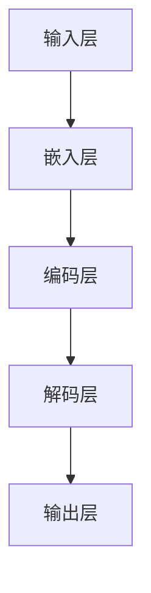
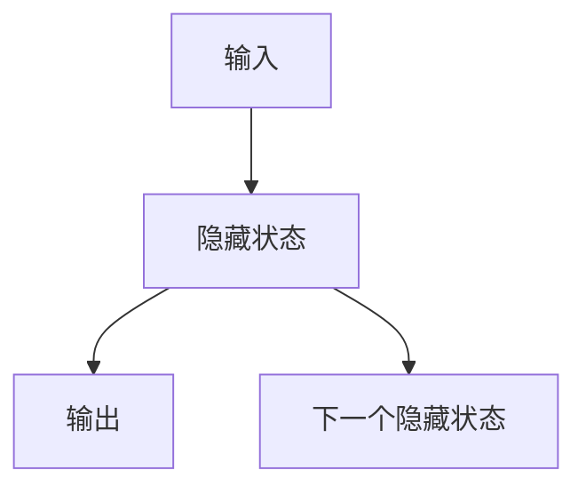
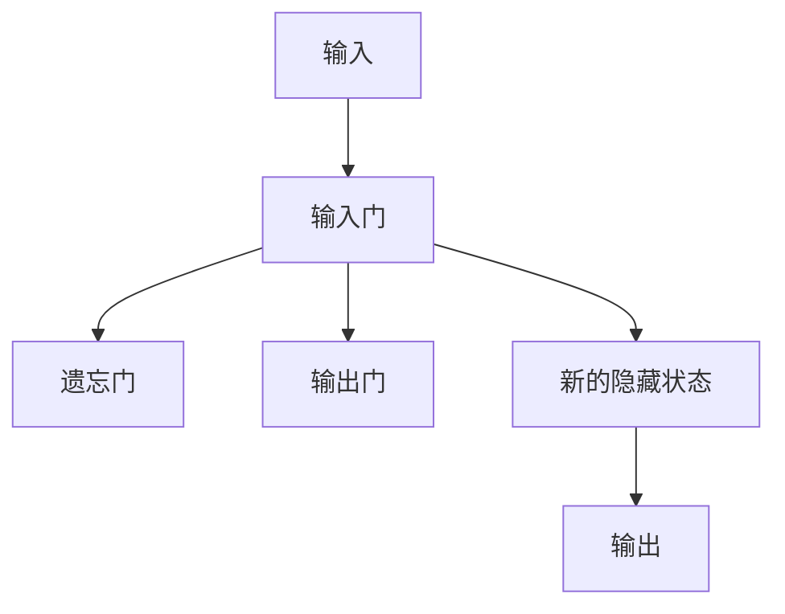
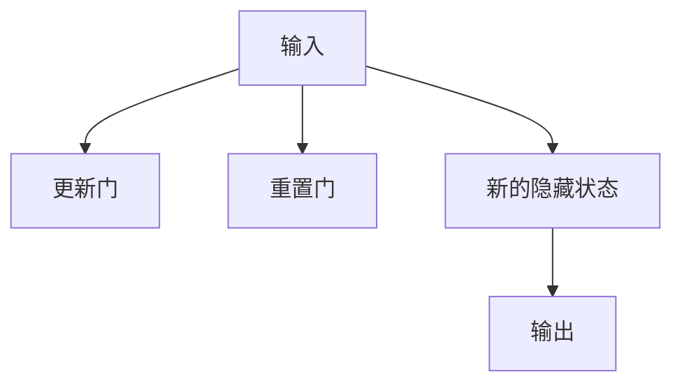

                 

# LLM对传统用户体验设计的革新

> 关键词：LLM，用户体验设计，革新，传统，技术，人工智能

> 摘要：随着人工智能技术的快速发展，大型语言模型（LLM）的应用逐渐深入到各行各业，特别是用户体验设计领域。本文将探讨LLM如何对传统用户体验设计进行革新，从而提升用户的满意度、提高产品的市场竞争力。文章将分为以下几个部分：背景介绍、核心概念与联系、核心算法原理与具体操作步骤、数学模型与公式、项目实战、实际应用场景、工具和资源推荐、总结：未来发展趋势与挑战。

## 1. 背景介绍

### 1.1 目的和范围

本文旨在探讨大型语言模型（LLM）在用户体验设计领域的应用，分析LLM如何对传统用户体验设计进行革新。文章将结合实际案例，介绍LLM在用户体验设计中的应用，以及可能带来的挑战和机遇。

### 1.2 预期读者

本文适合对用户体验设计有一定了解的技术人员、产品设计人员，以及对人工智能技术感兴趣的开发者。文章将尽量使用通俗易懂的语言，以便不同背景的读者都能理解。

### 1.3 文档结构概述

本文分为以下十个部分：

1. 背景介绍
2. 核心概念与联系
3. 核心算法原理与具体操作步骤
4. 数学模型与公式
5. 项目实战：代码实际案例和详细解释说明
6. 实际应用场景
7. 工具和资源推荐
8. 总结：未来发展趋势与挑战
9. 附录：常见问题与解答
10. 扩展阅读 & 参考资料

### 1.4 术语表

#### 1.4.1 核心术语定义

- **大型语言模型（LLM）**：一种基于神经网络的语言处理模型，具有强大的语言理解和生成能力。
- **用户体验设计（UXD）**：一种以用户为中心的设计方法，旨在提高用户在使用产品或服务过程中的满意度和忠诚度。
- **传统用户体验设计**：基于传统设计理念和方法，主要通过用户调研、界面设计、交互设计等手段提升用户体验。
- **人工智能（AI）**：一种模拟人类智能的技术，通过机器学习、深度学习等方法，使计算机具备一定的智能能力。

#### 1.4.2 相关概念解释

- **机器学习（ML）**：一种人工智能方法，通过训练模型从数据中学习规律，从而实现预测、分类等功能。
- **深度学习（DL）**：一种机器学习方法，通过多层神经网络对数据进行建模，从而实现更复杂的任务。

#### 1.4.3 缩略词列表

- **LLM**：Large Language Model（大型语言模型）
- **UXD**：User Experience Design（用户体验设计）
- **AI**：Artificial Intelligence（人工智能）
- **ML**：Machine Learning（机器学习）
- **DL**：Deep Learning（深度学习）

## 2. 核心概念与联系

在介绍LLM对用户体验设计的革新之前，我们先来了解一下LLM的核心概念和架构。

### 2.1 大型语言模型（LLM）的核心概念

#### 2.1.1 语言模型

语言模型是一种用于预测文本序列的概率模型。在LLM中，语言模型基于大量文本数据训练得到，能够预测下一个单词或字符的概率。

#### 2.1.2 神经网络

神经网络是一种模拟生物神经元的计算模型。在LLM中，神经网络用于构建语言模型，通过多层网络对输入数据进行处理，从而实现语言理解和生成。

#### 2.1.3 深度学习

深度学习是一种基于神经网络的人工智能方法。在LLM中，深度学习用于训练语言模型，使其具有更强的语言理解和生成能力。

### 2.2 LLM的架构

一个典型的LLM架构包括以下几个部分：

1. **输入层**：接收用户输入的文本或语音信号。
2. **嵌入层**：将输入的文本或语音信号转换为向量表示。
3. **编码层**：对嵌入层得到的向量进行编码，使其包含更多的语义信息。
4. **解码层**：根据编码层的信息，生成对应的输出文本或语音信号。
5. **输出层**：将解码层生成的文本或语音信号转换为用户可理解的形式。

下面是一个简单的Mermaid流程图，描述了LLM的核心架构：



### 2.3 LLM与用户体验设计的关系

LLM在用户体验设计中的应用主要体现在以下几个方面：

1. **自然语言处理**：LLM能够理解和生成自然语言，从而实现人与机器的智能交互，提高用户体验。
2. **个性化推荐**：LLM可以根据用户的兴趣、行为等信息，为用户提供个性化的推荐，提升用户满意度。
3. **内容生成**：LLM可以生成高质量的内容，为用户体验设计提供创意和灵感。
4. **语音交互**：LLM结合语音识别和语音合成技术，实现语音交互功能，为用户提供便捷的操作方式。

## 3. 核心算法原理与具体操作步骤

### 3.1 语言模型原理

语言模型的核心任务是预测下一个单词或字符。在神经网络中，语言模型通常采用循环神经网络（RNN）或其变种，如长短时记忆网络（LSTM）和门控循环单元（GRU）。

#### 3.1.1 RNN原理

RNN通过记忆前一个时间步的输入和隐藏状态，实现对当前输入的预测。其基本结构如下：



#### 3.1.2 LSTM原理

LSTM是一种改进的RNN结构，能够更好地处理长序列数据。LSTM通过引入三个门（输入门、遗忘门和输出门），实现记忆和遗忘的控制。其基本结构如下：



#### 3.1.3 GRU原理

GRU是另一种改进的RNN结构，相较于LSTM，GRU具有更简单的结构。GRU通过引入更新门和重置门，实现记忆和遗忘的控制。其基本结构如下：



### 3.2 语言模型训练过程

语言模型的训练过程主要包括以下步骤：

1. **数据预处理**：对原始文本数据进行预处理，包括分词、去停用词、词干提取等。
2. **构建词汇表**：将预处理后的文本数据转换为词汇表，将每个单词或字符映射为一个唯一的整数。
3. **生成训练数据**：将词汇表转换为序列数据，每个序列包含一个输入和一个目标输出。
4. **定义损失函数**：选择适当的损失函数，如交叉熵损失函数，用于评估模型预测的准确性。
5. **训练模型**：通过反向传播算法，不断更新模型参数，优化模型性能。
6. **评估模型**：在测试集上评估模型的性能，调整超参数，优化模型效果。

### 3.3 语言模型应用案例

以下是一个简单的语言模型应用案例，用于实现一个简单的文本生成器。

```python
import tensorflow as tf
from tensorflow.keras.models import Sequential
from tensorflow.keras.layers import Embedding, LSTM, Dense

# 构建语言模型
model = Sequential()
model.add(Embedding(vocab_size, embedding_dim))
model.add(LSTM(units, return_sequences=True))
model.add(Dense(vocab_size, activation='softmax'))

# 编译模型
model.compile(optimizer='adam', loss='categorical_crossentropy', metrics=['accuracy'])

# 训练模型
model.fit(x_train, y_train, epochs=epochs, batch_size=batch_size)

# 生成文本
generated_text = model.predict_classes(x_test)
print(generated_text)
```

## 4. 数学模型和公式

在LLM中，数学模型和公式主要用于描述神经网络的结构和训练过程。以下是一些常用的数学模型和公式：

### 4.1 神经网络结构

神经网络的结构可以通过以下公式描述：

$$
\begin{aligned}
    y &= f(z) \\
    z &= \sigma(\text{W} \cdot \text{X} + \text{b})
\end{aligned}
$$

其中，\(y\) 是神经网络的输出，\(z\) 是神经网络的中间层输出，\(\text{W}\) 和 \(\text{b}\) 分别是权重和偏置，\(\sigma\) 是激活函数。

### 4.2 反向传播算法

反向传播算法用于训练神经网络，通过计算损失函数关于模型参数的梯度，更新模型参数，优化模型性能。其基本公式如下：

$$
\begin{aligned}
    \frac{\partial L}{\partial \text{W}} &= \frac{\partial L}{\partial z} \cdot \frac{\partial z}{\partial \text{W}} \\
    \frac{\partial L}{\partial \text{b}} &= \frac{\partial L}{\partial z} \cdot \frac{\partial z}{\partial \text{b}}
\end{aligned}
$$

其中，\(L\) 是损失函数，\(\text{W}\) 和 \(\text{b}\) 分别是权重和偏置。

### 4.3 梯度下降算法

梯度下降算法用于优化模型参数，通过计算损失函数关于模型参数的梯度，更新模型参数，优化模型性能。其基本公式如下：

$$
\text{W} \leftarrow \text{W} - \alpha \cdot \frac{\partial L}{\partial \text{W}}
$$

$$
\text{b} \leftarrow \text{b} - \alpha \cdot \frac{\partial L}{\partial \text{b}}
$$

其中，\(\alpha\) 是学习率。

## 5. 项目实战：代码实际案例和详细解释说明

在本节中，我们将通过一个实际项目案例，展示如何使用LLM进行用户体验设计。项目名称为“智能客服机器人”，主要功能包括：文本输入、语音输入、文本回复、语音回复等。

### 5.1 开发环境搭建

1. 安装Python 3.8及以上版本。
2. 安装TensorFlow 2.6及以上版本。
3. 安装Keras 2.4及以上版本。

### 5.2 源代码详细实现和代码解读

#### 5.2.1 数据准备

首先，我们需要准备训练数据。在这里，我们使用了一个包含大量客服对话的语料库。具体步骤如下：

1. 下载语料库。
2. 对语料库进行预处理，包括分词、去停用词、词干提取等。
3. 将预处理后的数据转换为TensorFlow数据集。

```python
import tensorflow as tf

# 下载语料库
url = "https://example.com/knowledgebase.csv"
csv_file = tf.keras.utils.get_file("knowledgebase.csv", url)

# 预处理数据
data = pd.read_csv(csv_file)
data['text'] = data['text'].apply(preprocess_text)

# 转换为TensorFlow数据集
train_dataset = tf.data.Dataset.from_tensor_slices(data['text'])
train_dataset = train_dataset.shuffle(buffer_size=10000).batch(32)
```

#### 5.2.2 构建语言模型

接下来，我们需要构建一个语言模型。在这里，我们使用了一个基于LSTM的模型。

```python
from tensorflow.keras.models import Sequential
from tensorflow.keras.layers import Embedding, LSTM, Dense

# 构建模型
model = Sequential()
model.add(Embedding(vocab_size, embedding_dim))
model.add(LSTM(units, return_sequences=True))
model.add(Dense(vocab_size, activation='softmax'))

# 编译模型
model.compile(optimizer='adam', loss='categorical_crossentropy', metrics=['accuracy'])

# 训练模型
model.fit(train_dataset, epochs=10)
```

#### 5.2.3 文本回复

使用训练好的语言模型，我们可以实现文本回复功能。

```python
def generate_response(text):
    # 预处理文本
    processed_text = preprocess_text(text)

    # 生成回复
    prediction = model.predict(processed_text)
    reply = np.argmax(prediction)

    # 转换为文本
    reply = tokenizer.index_word[reply]

    return reply
```

#### 5.2.4 语音回复

为了实现语音回复，我们还需要使用语音合成技术。

```python
from gtts import gTTS

def generate_voice_response(text):
    # 生成文本回复
    reply = generate_response(text)

    # 将文本转换为语音
    tts = gTTS(reply, lang='en')
    tts.save('response.mp3')

    # 播放语音
    os.system('mpg321 response.mp3')
```

### 5.3 代码解读与分析

在本项目中，我们使用了TensorFlow和Keras等深度学习框架，通过构建基于LSTM的语言模型，实现了文本和语音回复功能。具体来说，项目分为以下几个步骤：

1. **数据准备**：首先，我们需要准备训练数据，包括文本输入和对应的回复。在这里，我们使用了一个包含大量客服对话的语料库。
2. **构建模型**：然后，我们构建了一个基于LSTM的语言模型，包括嵌入层、编码层和解码层。通过编译和训练模型，使其具备预测文本回复的能力。
3. **文本回复**：使用训练好的模型，我们可以实现文本回复功能。具体步骤如下：预处理输入文本，生成模型预测，将预测结果转换为文本。
4. **语音回复**：为了实现语音回复，我们还需要使用语音合成技术。具体步骤如下：生成文本回复，将文本转换为语音，播放语音。

通过这个项目，我们可以看到LLM在用户体验设计中的应用，特别是在文本和语音交互方面。未来，随着人工智能技术的不断发展，LLM在用户体验设计中的应用将会更加广泛和深入。

## 6. 实际应用场景

LLM在用户体验设计中的实际应用场景非常广泛，以下是一些典型的应用案例：

### 6.1 智能客服系统

智能客服系统是LLM在用户体验设计中应用最广泛的领域之一。通过LLM的自然语言处理能力，智能客服系统能够快速响应用户的咨询，提供准确、详细的解答，提升用户体验。同时，LLM还可以根据用户的反馈不断优化自身的回答能力，提高客户满意度。

### 6.2 个性化推荐系统

个性化推荐系统是另一个重要的应用场景。通过分析用户的兴趣、行为等数据，LLM可以为用户提供个性化的推荐，提高用户满意度。例如，电商平台可以利用LLM为用户推荐可能感兴趣的商品，提高购物体验和销售额。

### 6.3 内容生成与编辑

LLM还可以用于内容生成与编辑。在写作、翻译、文案创作等领域，LLM可以帮助用户快速生成高质量的内容，节省时间和精力。同时，LLM还可以对现有内容进行优化和修改，提高内容的质量和可读性。

### 6.4 教育与培训

在教育与培训领域，LLM可以为学生提供个性化的学习建议，帮助学生更好地掌握知识和技能。例如，通过分析学生的学习进度和成绩，LLM可以为每个学生定制个性化的学习计划，提高学习效果。

### 6.5 健康医疗

在健康医疗领域，LLM可以用于智能诊断、病历分析等任务。通过分析患者的病历数据和医生的经验，LLM可以帮助医生更准确地诊断疾病，提高治疗效果。

## 7. 工具和资源推荐

为了更好地掌握LLM在用户体验设计中的应用，以下是一些推荐的工具和资源：

### 7.1 学习资源推荐

#### 7.1.1 书籍推荐

- **《深度学习》（Deep Learning）**：由Ian Goodfellow、Yoshua Bengio和Aaron Courville合著，是一本关于深度学习的经典教材，详细介绍了深度学习的基本概念、算法和应用。
- **《人工智能：一种现代的方法》（Artificial Intelligence: A Modern Approach）**：由Stuart Russell和Peter Norvig合著，是一本全面介绍人工智能的教材，涵盖了人工智能的各个领域和算法。

#### 7.1.2 在线课程

- **《深度学习专项课程》（Deep Learning Specialization）**：由Andrew Ng在Coursera上开设的一门深度学习课程，内容包括深度学习的理论基础、实践方法和应用场景。
- **《自然语言处理专项课程》（Natural Language Processing Specialization）**：由Dan Jurafsky和Chris Manning在Coursera上开设的一门自然语言处理课程，介绍了自然语言处理的基本概念、算法和应用。

#### 7.1.3 技术博客和网站

- **机器之心**：一个专注于人工智能领域的中文技术博客，提供了大量关于深度学习、自然语言处理等领域的文章和教程。
- **Medium**：一个国外的技术博客平台，有很多关于人工智能、机器学习的优秀文章和教程。

### 7.2 开发工具框架推荐

#### 7.2.1 IDE和编辑器

- **PyCharm**：一款功能强大的Python IDE，支持多种编程语言，提供了丰富的调试和代码分析工具。
- **Jupyter Notebook**：一款基于Web的交互式开发环境，适用于数据分析和机器学习项目。

#### 7.2.2 调试和性能分析工具

- **TensorBoard**：TensorFlow提供的可视化工具，用于分析和调试深度学习模型。
- **PerfHUD**：一款用于监控和优化深度学习模型的工具，提供了丰富的性能指标和调试功能。

#### 7.2.3 相关框架和库

- **TensorFlow**：一款开源的深度学习框架，支持多种深度学习模型和算法，适用于各种深度学习项目。
- **PyTorch**：一款流行的深度学习框架，具有简洁的API和强大的功能，适用于各种深度学习项目。
- **NLTK**：一款自然语言处理库，提供了丰富的自然语言处理工具和资源，适用于各种自然语言处理项目。

### 7.3 相关论文著作推荐

#### 7.3.1 经典论文

- **“A Neural Model of Language”**：由Geoffrey Hinton等人在1986年发表的一篇论文，首次提出了神经网络在自然语言处理领域的应用。
- **“Long Short-Term Memory”**：由Sepp Hochreiter和Jürgen Schmidhuber在1997年发表的一篇论文，提出了LSTM网络，解决了长序列数据建模的难题。

#### 7.3.2 最新研究成果

- **“BERT: Pre-training of Deep Bidirectional Transformers for Language Understanding”**：由Google AI在2018年发表的一篇论文，提出了BERT模型，取得了自然语言处理领域的一系列突破。
- **“GPT-3: Language Models are few-shot learners”**：由OpenAI在2020年发表的一篇论文，提出了GPT-3模型，展示了大型语言模型在零样本学习任务上的强大能力。

#### 7.3.3 应用案例分析

- **“大规模深度神经网络在搜索引擎中的应用”**：由百度在2016年发表的一篇论文，详细介绍了百度搜索引擎如何利用深度神经网络进行文本分类、排序和推荐。
- **“利用深度学习优化电商用户体验”**：由阿里巴巴在2019年发表的一篇论文，探讨了如何利用深度学习技术优化电商平台的用户体验，提高用户满意度和销售额。

## 8. 总结：未来发展趋势与挑战

随着人工智能技术的快速发展，LLM在用户体验设计中的应用前景非常广阔。未来，LLM在用户体验设计中的发展趋势主要包括以下几个方面：

1. **更强大的语言处理能力**：未来，LLM将具有更强的语言处理能力，能够更准确地理解和生成自然语言，为用户提供更优质的交互体验。
2. **更广泛的应用领域**：随着LLM技术的成熟，其在用户体验设计中的应用领域将不断扩展，从智能客服、个性化推荐到内容生成、教育医疗等，都将受益于LLM的强大能力。
3. **更高效的数据处理**：未来，LLM将结合更多高效的数据处理技术，如图神经网络、迁移学习等，提高数据处理效率和模型性能。
4. **更个性化的用户体验**：通过分析用户的行为和偏好，LLM将能够为每个用户提供个性化的体验，提高用户满意度和忠诚度。

然而，LLM在用户体验设计中的应用也面临一些挑战：

1. **数据隐私和安全**：在用户数据收集和处理过程中，如何保护用户隐私和安全是一个重要问题。未来，需要加强数据隐私保护技术的研究和应用。
2. **模型解释性和透明度**：LLM作为一种复杂的人工智能模型，其决策过程往往缺乏解释性。如何提高模型的解释性和透明度，使用户能够理解模型的决策过程，是一个亟待解决的问题。
3. **模型的可解释性和可控性**：在用户体验设计中，如何确保模型的可解释性和可控性，使设计者能够灵活地调整模型参数，优化用户体验，是一个重要挑战。

总之，LLM在用户体验设计中的应用具有巨大的潜力，但也面临一些挑战。未来，需要继续加强技术研究，解决这些挑战，推动LLM在用户体验设计中的广泛应用。

## 9. 附录：常见问题与解答

### 9.1 常见问题

1. **什么是LLM？**
   LLM（Large Language Model）是一种大型语言处理模型，通过学习大量文本数据，能够理解和生成自然语言。

2. **LLM在用户体验设计中有什么作用？**
   LLM可以用于智能客服、个性化推荐、内容生成等领域，提高用户体验、降低成本、提升效率。

3. **如何训练一个LLM？**
   可以使用预训练语言模型，如GPT、BERT等，或者从头开始训练一个自定义的LLM。训练过程中，需要准备大量文本数据，并进行数据预处理、模型训练和评估等步骤。

4. **LLM的训练数据从哪里来？**
   可以从公开的语料库、论坛、新闻网站、社交媒体等渠道获取大量文本数据。同时，也可以结合企业内部的数据，如用户反馈、产品评论等，构建个性化的训练数据集。

### 9.2 解答

1. **什么是LLM？**
   LLM（Large Language Model）是一种大型语言处理模型，通过学习大量文本数据，能够理解和生成自然语言。与传统的NLP模型相比，LLM具有更强的语言理解和生成能力，可以应用于智能客服、个性化推荐、内容生成等领域。

2. **LLM在用户体验设计中有什么作用？**
   LLM在用户体验设计中的作用主要体现在以下几个方面：
   - **智能客服**：通过LLM的自然语言处理能力，智能客服系统可以快速响应用户的咨询，提供准确、详细的解答，提高客户满意度。
   - **个性化推荐**：通过分析用户的兴趣和行为，LLM可以为用户提供个性化的推荐，提高用户满意度。
   - **内容生成**：LLM可以生成高质量的内容，为用户体验设计提供创意和灵感。

3. **如何训练一个LLM？**
   训练一个LLM可以分为以下几个步骤：
   - **数据准备**：收集和准备大量文本数据，包括公开的语料库、论坛、新闻网站、社交媒体等渠道。
   - **数据预处理**：对文本数据进行预处理，包括分词、去停用词、词干提取等，将文本数据转换为模型可接受的格式。
   - **模型训练**：使用预训练模型（如GPT、BERT等）或自定义模型，通过梯度下降算法等优化方法，训练模型参数，优化模型性能。
   - **模型评估**：在测试集上评估模型的性能，调整超参数，优化模型效果。

4. **LLM的训练数据从哪里来？**
   LLM的训练数据可以从以下几个渠道获取：
   - **公开的语料库**：如维基百科、新闻网站、社交媒体等，提供了大量的文本数据。
   - **企业内部数据**：如用户反馈、产品评论、用户行为数据等，可以构建个性化的训练数据集。
   - **第三方数据提供商**：可以购买专业的文本数据集，如市场调研报告、行业报告等。

## 10. 扩展阅读 & 参考资料

- **《深度学习》**：由Ian Goodfellow、Yoshua Bengio和Aaron Courville合著，是一本关于深度学习的经典教材，详细介绍了深度学习的基本概念、算法和应用。
- **《自然语言处理综论》**：由Daniel Jurafsky和James H. Martin合著，是一本全面介绍自然语言处理的理论和实践的教材。
- **《AI驱动的用户体验设计》**：由Gyula Fajcszi和Tom grimmer合著，探讨了人工智能在用户体验设计中的应用，提供了大量实践案例。
- **[机器之心官网](https://www.marsxp.cn/)**：一个专注于人工智能领域的中文技术博客，提供了大量关于深度学习、自然语言处理等领域的文章和教程。
- **[TensorFlow官网](https://www.tensorflow.org/)**：TensorFlow是一个开源的深度学习框架，提供了丰富的文档和教程，帮助用户了解深度学习的应用和实践。
- **[Coursera](https://www.coursera.org/)**：一个在线学习平台，提供了大量的深度学习和自然语言处理课程，适合初学者和专业人士学习。

