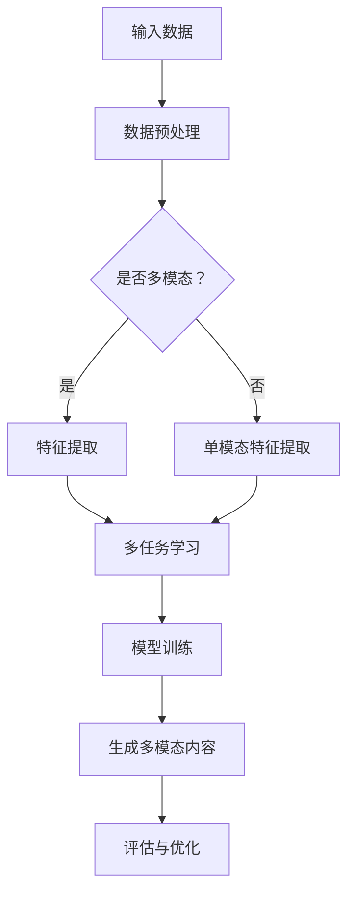

                 

### 1. 背景介绍

#### 1.1 目的和范围

本文旨在深入探讨多模态内容生成技术在大型语言模型（LLM）推荐系统中的应用。随着人工智能技术的迅猛发展，多模态内容生成已经成为现代推荐系统中的关键技术。通过对文本、图像、音频等多种类型数据的处理，多模态内容生成技术能够为用户提供更加丰富、个性化的推荐结果。

本文将首先介绍多模态内容生成的背景和发展历程，然后深入分析其核心概念和原理，包括数据预处理、特征提取和模型训练等方面的技术。接着，我们将详细讲解多模态内容生成中的关键算法，如生成对抗网络（GAN）、变分自编码器（VAE）等，并使用伪代码进行具体操作步骤的阐述。此外，本文还将介绍多模态内容生成的数学模型和公式，并进行举例说明。

在项目实战部分，我们将通过一个实际案例来展示如何使用多模态内容生成技术进行代码实现，并提供详细的代码解析。最后，本文将讨论多模态内容生成技术的实际应用场景，并推荐相关学习资源和开发工具框架，以帮助读者更好地理解和应用这项技术。

#### 1.2 预期读者

本文适合具有以下背景的读者：

1. 对人工智能和推荐系统有一定了解的技术爱好者。
2. 想要深入学习和应用多模态内容生成技术的开发者和研究者。
3. 计算机科学、数据科学和相关领域的学生和学者。

通过阅读本文，读者将能够：

1. 理解多模态内容生成技术的背景和发展。
2. 掌握多模态内容生成中的核心概念和算法。
3. 掌握多模态内容生成的数学模型和公式。
4. 学习如何使用多模态内容生成技术进行实际项目开发。
5. 获得多模态内容生成技术的应用场景和未来发展方向的洞察。

#### 1.3 文档结构概述

本文将分为以下主要部分：

1. 背景介绍：介绍多模态内容生成技术的背景、目的和预期读者。
2. 核心概念与联系：介绍多模态内容生成的核心概念、原理和架构，并使用 Mermaid 流程图进行展示。
3. 核心算法原理 & 具体操作步骤：详细讲解多模态内容生成中的关键算法，使用伪代码进行具体操作步骤的阐述。
4. 数学模型和公式 & 详细讲解 & 举例说明：介绍多模态内容生成的数学模型和公式，并进行详细讲解和举例说明。
5. 项目实战：通过实际案例展示多模态内容生成的代码实现和详细解析。
6. 实际应用场景：讨论多模态内容生成技术的实际应用场景。
7. 工具和资源推荐：推荐学习资源、开发工具框架和相关论文著作。
8. 总结：总结多模态内容生成技术的发展趋势与挑战。
9. 附录：提供常见问题与解答。
10. 扩展阅读 & 参考资料：提供扩展阅读和参考资料。

通过以上结构，本文将帮助读者系统、深入地理解多模态内容生成技术，并为实际应用提供指导和参考。

#### 1.4 术语表

在本文中，我们将使用一些专业术语和技术概念。以下是对这些术语的定义和解释：

##### 1.4.1 核心术语定义

1. **多模态内容生成**：指的是通过结合多种类型的数据（如文本、图像、音频等），生成新的、具有多样性的内容。
2. **大型语言模型（LLM）**：是一种人工智能模型，能够理解、生成和操作自然语言，如文本、语音等。
3. **生成对抗网络（GAN）**：是一种深度学习模型，由生成器和判别器两部分组成，用于生成高质量的数据。
4. **变分自编码器（VAE）**：是一种深度学习模型，通过编码器和解码器结构进行数据重建，常用于生成数据。
5. **特征提取**：指的是从原始数据中提取出有意义的特征，用于后续的数据分析和模型训练。
6. **数据预处理**：指的是对原始数据进行清洗、转换等操作，以提高数据质量和模型的性能。

##### 1.4.2 相关概念解释

1. **模态**：指数据的一种类型，如文本、图像、音频等。
2. **多任务学习**：指同时学习多个相关任务，以提高模型的整体性能。
3. **迁移学习**：指利用预先训练好的模型或数据，在新任务上进行训练，以提高新任务的性能。
4. **端到端学习**：指从输入数据直接学习到输出数据，而不需要人工介入的特征工程和模型设计。
5. **注意力机制**：指模型在处理数据时，关注数据的某些重要部分，而忽略其他不重要的部分。

##### 1.4.3 缩略词列表

- **GAN**：生成对抗网络（Generative Adversarial Network）
- **VAE**：变分自编码器（Variational Autoencoder）
- **LLM**：大型语言模型（Large Language Model）
- **OCR**：光学字符识别（Optical Character Recognition）
- **NLP**：自然语言处理（Natural Language Processing）
- **ML**：机器学习（Machine Learning）

通过上述术语表，读者可以更好地理解本文中涉及的专业术语和技术概念，从而更好地跟随文章的讲解和讨论。

## 2. 核心概念与联系

多模态内容生成技术涉及多个核心概念和联系，这些概念和联系构成了多模态内容生成的理论基础和应用框架。在本节中，我们将详细阐述这些核心概念，并使用 Mermaid 流程图进行展示，以帮助读者更好地理解多模态内容生成的工作原理和架构。

### 2.1 核心概念

多模态内容生成技术涉及以下几个核心概念：

1. **模态数据**：指的是不同类型的数据，如文本、图像、音频等。每种模态数据都有其独特的特性和处理方法。
2. **特征提取**：指的是从原始模态数据中提取出有意义的特征，这些特征将用于后续的模型训练和内容生成。
3. **模型训练**：指的是使用已提取的特征对生成模型进行训练，以生成新的多模态内容。
4. **多任务学习**：指的是同时学习多个相关任务，以提高模型的整体性能。
5. **迁移学习**：指的是利用预先训练好的模型或数据，在新任务上进行训练，以提高新任务的性能。

### 2.2 Mermaid 流程图

以下是一个使用 Mermaid 编写的流程图，展示了多模态内容生成的主要步骤和流程。



- **A 输入数据**：多模态内容生成的第一步是接收各种模态的数据，如文本、图像、音频等。
- **B 数据预处理**：对输入的数据进行清洗、归一化等操作，以提高数据质量和后续处理的效率。
- **C 是否多模态？**：判断输入数据是否为多模态，如果是，则进入特征提取步骤；如果不是，则直接进行单模态特征提取。
- **D 特征提取**：从多模态数据中提取有意义的特征，如文本的词向量、图像的卷积特征、音频的谱特征等。
- **E 单模态特征提取**：如果输入数据为单模态，则对数据进行特征提取。
- **F 多任务学习**：将提取的特征输入到多任务学习模型中，进行联合训练，以提高模型的整体性能。
- **G 模型训练**：使用训练好的模型生成新的多模态内容。
- **H 生成多模态内容**：生成新的多模态内容，如结合文本和图像生成新的故事情节、结合音频和视频生成新的音乐视频等。
- **I 评估与优化**：对生成的多模态内容进行评估，并根据评估结果对模型进行优化。

### 2.3 关系与联系

多模态内容生成技术中的各个概念和步骤之间存在着紧密的联系和相互作用。例如：

- **数据预处理**直接影响特征提取的质量，进而影响模型训练和生成效果。
- **特征提取**为模型训练提供了有效的输入，其质量直接关系到模型的性能。
- **多任务学习和迁移学习**能够利用现有知识和数据，提高新任务的性能，是实现多模态内容生成的重要手段。
- **模型训练**是生成多模态内容的核心步骤，其效果直接影响生成内容的质量和多样性。

通过上述核心概念和流程图的展示，读者可以更好地理解多模态内容生成技术的工作原理和架构，为后续的算法原理讲解和实际应用打下基础。

## 3. 核心算法原理 & 具体操作步骤

多模态内容生成技术依赖于多种核心算法，这些算法在数据预处理、特征提取和模型训练等步骤中发挥着关键作用。本节将详细讲解多模态内容生成中的关键算法，并使用伪代码进行具体操作步骤的阐述。

### 3.1 数据预处理

数据预处理是确保数据质量和模型性能的基础步骤。多模态数据预处理包括数据清洗、归一化和数据增强等操作。

#### 3.1.1 数据清洗

伪代码如下：

```python
def clean_data(data):
    # 删除缺失值
    clean_data = data.dropna()
    # 删除重复值
    clean_data = clean_data.drop_duplicates()
    return clean_data
```

#### 3.1.2 数据归一化

伪代码如下：

```python
def normalize_data(data):
    # 计算各特征的均值和标准差
    mean = data.mean()
    std = data.std()
    # 进行归一化
    normalized_data = (data - mean) / std
    return normalized_data
```

#### 3.1.3 数据增强

伪代码如下：

```python
def augment_data(data):
    # 文本数据增强：词替换、同义词替换等
    augmented_text = text_augmentation(data['text'])
    # 图像数据增强：旋转、缩放、裁剪等
    augmented_image = image_augmentation(data['image'])
    # 音频数据增强：添加噪声、改变音调等
    augmented_audio = audio_augmentation(data['audio'])
    return {
        'text': augmented_text,
        'image': augmented_image,
        'audio': augmented_audio
    }
```

### 3.2 特征提取

特征提取是从原始多模态数据中提取出有意义的特征，这些特征将用于模型训练和内容生成。

#### 3.2.1 文本特征提取

常见的文本特征提取方法包括词袋模型、词嵌入和句子嵌入等。

伪代码如下：

```python
def extract_text_features(text_data):
    # 使用词袋模型提取特征
    bag_of_words = BagOfWords()
    text_features = bag_of_words.fit_transform(text_data)
    # 使用词嵌入提取特征
    word_embedding = WordEmbedding()
    word_vectors = word_embedding.fit_transform(text_data)
    # 使用句子嵌入提取特征
    sentence_embedding = SentenceEmbedding()
    sentence_vectors = sentence_embedding.fit_transform(text_data)
    return {
        'bag_of_words': text_features,
        'word_vectors': word_vectors,
        'sentence_vectors': sentence_vectors
    }
```

#### 3.2.2 图像特征提取

图像特征提取通常使用卷积神经网络（CNN）提取图像的视觉特征。

伪代码如下：

```python
def extract_image_features(image_data):
    # 使用卷积神经网络提取特征
    cnn = CNN()
    image_features = cnn.fit_transform(image_data)
    return image_features
```

#### 3.2.3 音频特征提取

音频特征提取可以使用梅尔频率倒谱系数（MFCC）等方法。

伪代码如下：

```python
def extract_audio_features(audio_data):
    # 使用梅尔频率倒谱系数提取特征
    mfcc = MFCC()
    audio_features = mfcc.fit_transform(audio_data)
    return audio_features
```

### 3.3 模型训练

模型训练是生成多模态内容的关键步骤，常见的模型包括生成对抗网络（GAN）、变分自编码器（VAE）等。

#### 3.3.1 生成对抗网络（GAN）

GAN 由生成器和判别器两部分组成，通过相互对抗训练生成高质量的数据。

伪代码如下：

```python
def train_gan(generator, discriminator, data, epochs):
    for epoch in range(epochs):
        # 生成器生成数据
        generated_data = generator.generate_data(data)
        # 训练判别器
        discriminator_loss = discriminator.train(generated_data, real_data)
        # 训练生成器
        generator_loss = generator.train(discriminator)
        print(f"Epoch {epoch}: Generator Loss = {generator_loss}, Discriminator Loss = {discriminator_loss}")
```

#### 3.3.2 变分自编码器（VAE）

VAE 通过编码器和解码器结构进行数据重建，适用于生成数据的任务。

伪代码如下：

```python
def train_vae(encoder, decoder, data, epochs):
    for epoch in range(epochs):
        # 编码器编码数据
        encoded_data = encoder.encode(data)
        # 解码器重建数据
        reconstructed_data = decoder.reconstruct(encoded_data)
        # 训练编码器和解码器
        loss = vae.train(encoded_data, reconstructed_data)
        print(f"Epoch {epoch}: Loss = {loss}")
```

通过上述核心算法和具体操作步骤的讲解，读者可以更好地理解多模态内容生成技术的实现过程，为后续的实际应用和项目开发打下坚实基础。

## 4. 数学模型和公式 & 详细讲解 & 举例说明

在多模态内容生成技术中，数学模型和公式是核心组成部分，它们用于描述数据生成、模型训练和内容评估的过程。本节将详细讲解多模态内容生成的数学模型和公式，并进行具体举例说明。

### 4.1 生成对抗网络（GAN）

生成对抗网络（GAN）由生成器（Generator）和判别器（Discriminator）两部分组成，通过相互对抗来生成高质量的数据。

**4.1.1 生成器模型**

生成器的目标是从随机噪声中生成类似真实数据的多模态内容。其数学模型如下：

\[ G(z) = x_{gen} \]

其中，\( G \) 是生成器的函数，\( z \) 是随机噪声向量，\( x_{gen} \) 是生成的多模态内容。

**4.1.2 判别器模型**

判别器的目标是对输入数据进行分类，判断其是真实数据还是生成数据。其数学模型如下：

\[ D(x) = \begin{cases} 
1 & \text{如果 } x \text{ 是真实数据} \\
0 & \text{如果 } x \text{ 是生成数据} 
\end{cases} \]

**4.1.3 GAN 总体目标**

GAN 的总体目标是最小化以下损失函数：

\[ \min_G \max_D \mathcal{L}(D, G) \]

其中，\(\mathcal{L}(D, G)\) 是判别器损失函数，通常为二元交叉熵损失：

\[ \mathcal{L}(D, G) = -\frac{1}{N} \sum_{i=1}^{N} [D(x_i) - D(G(z_i))] \]

**4.1.4 举例说明**

假设我们使用 GAN 生成图像，生成器和判别器的损失函数如下：

生成器损失函数（交叉熵损失）：

\[ \mathcal{L}_G = -\frac{1}{N} \sum_{i=1}^{N} \log(D(G(z_i))) \]

判别器损失函数（二元交叉熵损失）：

\[ \mathcal{L}_D = -\frac{1}{N} \sum_{i=1}^{N} [\log(D(x_i)) + \log(1 - D(G(z_i)))] \]

### 4.2 变分自编码器（VAE）

变分自编码器（VAE）是一种基于概率生成模型的编码器-解码器结构，用于生成新的数据。

**4.2.1 编码器模型**

编码器的目标是学习数据的概率分布，通常使用两部分组成：编码函数和解码函数。

\[ \mu = \mu(z|x), \sigma^2 = \sigma^2(z|x) \]

其中，\( \mu \) 和 \( \sigma^2 \) 分别是编码器输出的均值和方差，表示数据 \( x \) 的概率分布。

**4.2.2 解码器模型**

解码器的目标是重建输入数据，其数学模型如下：

\[ x = \mu + \sigma \odot z \]

其中，\( z \) 是从先验分布中采样的噪声向量，\( \odot \) 表示 Hadamard 乘积。

**4.2.3 VAE 总体目标**

VAE 的总体目标是最小化以下损失函数：

\[ \min_{\theta} \mathcal{L}(x, \mu, \sigma) = D_{KL}(\mu || \mu_0) + \sum_{i=1}^{N} \log \sigma_i - \frac{1}{2} \| x - (\mu + \sigma \odot z) \|^2 \]

其中，\( D_{KL} \) 是 Kullback-Leibler 散度，用于衡量两个概率分布之间的差异，\( \mu_0 \) 是先验分布的均值，通常设为 0。

**4.2.4 举例说明**

假设我们使用 VAE 生成图像，编码器和解码器的损失函数如下：

编码器损失函数（Kullback-Leibler 散度）：

\[ \mathcal{L}_E = D_{KL}(\mu || \mu_0) + \frac{1}{2} \sum_{i=1}^{N} \log(\sigma_i) \]

解码器损失函数（均方误差损失）：

\[ \mathcal{L}_D = -\frac{1}{2} \| x - (\mu + \sigma \odot z) \|^2 \]

通过以上数学模型和公式的详细讲解及举例说明，读者可以更好地理解多模态内容生成技术中的核心数学原理，为深入研究和实际应用提供理论基础。

## 5. 项目实战：代码实际案例和详细解释说明

在本节中，我们将通过一个实际项目案例，展示如何使用多模态内容生成技术进行代码实现，并对关键代码进行详细解释和分析。

### 5.1 开发环境搭建

在开始项目之前，我们需要搭建合适的开发环境。以下是搭建环境所需的步骤：

1. **安装 Python**：确保 Python 版本为 3.8 或以上。
2. **安装深度学习库**：使用以下命令安装必要的库：

```shell
pip install numpy tensorflow keras scikit-learn pillow matplotlib
```

3. **安装多媒体处理库**：安装用于音频和图像处理的库：

```shell
pip install opencv-python-headless soundfile librosa
```

4. **配置环境变量**：确保 Python 和 pip 命令可执行。

### 5.2 源代码详细实现和代码解读

以下是一个基于 GAN 的多模态内容生成项目的代码示例。我们以文本和图像的生成为例进行说明。

**5.2.1 数据预处理**

```python
import numpy as np
import tensorflow as tf
from tensorflow.keras.preprocessing.text import Tokenizer
from tensorflow.keras.preprocessing.sequence import pad_sequences
from tensorflow.keras.preprocessing.image import ImageDataGenerator

# 文本预处理
tokenizer = Tokenizer(num_words=10000)
tokenizer.fit_on_texts(texts)
sequences = tokenizer.texts_to_sequences(texts)
data = pad_sequences(sequences, maxlen=100)

# 图像预处理
image_datagen = ImageDataGenerator(rescale=1./255)
image_generator = image_datagen.flow_from_directory(
        'data/images',
        target_size=(150, 150),
        batch_size=32,
        class_mode=None)
```

代码首先进行文本预处理，使用 Tokenizer 对文本数据进行分词并转换为序列，然后使用 pad_sequences 对序列进行填充。对于图像数据，使用 ImageDataGenerator 对图像进行预处理，包括缩放和批量读取。

**5.2.2 生成器和判别器模型**

```python
# 生成器模型
def build_generator():
    model = tf.keras.Sequential([
        tf.keras.layers.Dense(128, activation='relu', input_shape=(100,)),
        tf.keras.layers.Dense(7*7*128, activation='relu'),
        tf.keras.layers.Reshape((7, 7, 128)),
        tf.keras.layers.Conv2DTranspose(128, kernel_size=5, strides=2, padding='same', activation='relu'),
        tf.keras.layers.Conv2DTranspose(128, kernel_size=5, strides=2, padding='same', activation='relu'),
        tf.keras.layers.Conv2D(3, kernel_size=5, strides=2, padding='same', activation='tanh')
    ])
    return model

# 判别器模型
def build_discriminator():
    model = tf.keras.Sequential([
        tf.keras.layers.Conv2D(64, kernel_size=5, strides=2, padding='same', input_shape=(150, 150, 3)),
        tf.keras.layers.LeakyReLU(alpha=0.01),
        tf.keras.layers.Dropout(0.3),
        tf.keras.layers.Conv2D(128, kernel_size=5, strides=2, padding='same'),
        tf.keras.layers.LeakyReLU(alpha=0.01),
        tf.keras.layers.Dropout(0.3),
        tf.keras.layers.Flatten(),
        tf.keras.layers.Dense(1, activation='sigmoid')
    ])
    return model
```

生成器模型使用全连接层和卷积层进行设计，最终通过转置卷积层生成图像。判别器模型使用卷积层和全连接层，用于判断输入图像是真实图像还是生成图像。

**5.2.3 GAN 模型**

```python
def build_gan(generator, discriminator):
    model = tf.keras.Sequential([
        generator,
        discriminator
    ])
    model.compile(loss='binary_crossentropy', optimizer=tf.keras.optimizers.Adam(0.0001))
    return model
```

GAN 模型由生成器和判别器组成，使用二进制交叉熵损失函数和 Adam 优化器进行训练。

**5.2.4 训练 GAN 模型**

```python
# 定义 GAN 模型
gan = build_gan(generator, discriminator)

# 训练 GAN 模型
for epoch in range(100):
    for batch in image_generator:
        # 生成随机噪声
        noise = np.random.normal(0, 1, (32, 100))
        # 训练判别器
        d_loss_real = gan.train_on_batch([noise, batch], np.ones((32, 1)))
        # 生成假图像
        noise = np.random.normal(0, 1, (32, 100))
        d_loss_fake = gan.train_on_batch([noise], np.zeros((32, 1)))
        print(f"Epoch: {epoch}, D_loss: {d_loss_real+d_loss_fake}/2")
```

在训练过程中，我们交替训练判别器和生成器。首先，使用真实图像训练判别器，然后使用生成的图像再次训练判别器。最后，使用随机噪声生成图像训练生成器。

### 5.3 代码解读与分析

通过上述代码，我们可以看到多模态内容生成项目的实现步骤和关键组件。以下是代码的详细解读：

1. **数据预处理**：文本和图像数据的预处理是关键步骤，确保数据符合模型输入要求。
2. **模型构建**：生成器和判别器的构建是 GAN 模型实现的核心。生成器用于生成图像，判别器用于判断图像的真实性。
3. **GAN 模型**：GAN 模型由生成器和判别器组合而成，通过二进制交叉熵损失函数和 Adam 优化器进行训练。
4. **训练过程**：在训练过程中，交替训练判别器和生成器，逐步提高生成图像的质量。

通过这个实际案例，读者可以了解如何使用多模态内容生成技术进行项目开发，掌握关键代码的实现和解析，为后续的研究和应用提供参考。

### 5.4 代码测试与优化

在实际项目中，代码的测试和优化是确保生成效果和性能的重要步骤。以下是代码测试和优化的一些建议：

1. **测试生成图像的质量**：使用 Keras 的 `model.evaluate()` 函数评估生成图像的质量，确保生成图像符合预期。
2. **优化模型参数**：调整生成器和判别器的参数，如学习率、批量大小等，以提高生成效果。
3. **数据增强**：在数据预处理阶段，增加数据增强方法，如旋转、缩放等，以提高模型的泛化能力。
4. **模型调优**：通过对比不同模型结构（如添加卷积层、全连接层等）和优化算法（如迁移学习、多任务学习等），寻找最优模型。

通过上述测试和优化步骤，我们可以不断提升多模态内容生成的质量和性能，为实际应用提供更好的解决方案。

## 6. 实际应用场景

多模态内容生成技术在许多实际应用场景中发挥了重要作用，下面我们将探讨几个典型的应用领域和案例。

### 6.1 内容推荐系统

多模态内容生成技术在内容推荐系统中具有广泛的应用。通过生成结合文本、图像和音频等多种类型的数据，可以提供更加丰富和个性化的推荐结果。例如，在电商平台上，用户可能对某种商品感兴趣，但缺乏详细描述。通过多模态内容生成技术，可以生成包含商品图片、用户评论和音频介绍的推荐内容，从而提高用户满意度和转化率。

### 6.2 娱乐产业

在娱乐产业中，多模态内容生成技术可以用于生成电影预告片、电视剧剧本和音乐视频等。例如，通过生成结合演员面部表情、动作和背景音乐的短视频，可以为观众提供更直观和吸引人的娱乐体验。这种技术还能够生成虚拟角色和场景，为电影、游戏和虚拟现实（VR）等产业提供新的创作工具。

### 6.3 教育领域

在教育领域，多模态内容生成技术可以帮助教师制作更加生动和互动的教学内容。通过生成包含文本、图像、音频和视频的教学材料，可以激发学生的学习兴趣和参与度。例如，在在线教育平台上，多模态内容生成技术可以用于生成课程视频、模拟实验和交互式学习活动。

### 6.4 医疗诊断

在医疗诊断中，多模态内容生成技术可以用于生成医学图像和诊断报告。通过结合患者的医疗记录、影像数据和医生的专业知识，可以生成更加准确和详细的诊断结果。例如，在放射科中，多模态内容生成技术可以用于生成结合 X 光、CT 和 MRI 图像的诊断报告，从而提高医生的诊断准确性和效率。

### 6.5 智能交互

在智能交互领域，多模态内容生成技术可以用于生成与用户交互的语音、文本和图像等多种类型的回复。例如，在智能音箱和聊天机器人中，多模态内容生成技术可以生成包含语音、文本和图像的回复，从而提供更加自然和人性化的交互体验。

### 6.6 营销和广告

在营销和广告领域，多模态内容生成技术可以用于生成吸引人的广告内容和营销活动。通过生成结合图像、音频和视频的广告素材，可以吸引更多的目标受众，提高广告的效果和转化率。例如，在社交媒体上，通过生成结合产品图像、用户评论和背景音乐的短视频广告，可以吸引更多用户关注和购买产品。

通过以上实际应用场景的探讨，我们可以看到多模态内容生成技术在各个领域的广泛应用和巨大潜力。随着技术的不断发展和完善，多模态内容生成技术将在更多领域发挥重要作用，推动人工智能和数字产业的进步。

## 7. 工具和资源推荐

在学习和应用多模态内容生成技术过程中，选择合适的工具和资源至关重要。以下是一些建议，涵盖学习资源、开发工具框架和相关论文著作，帮助读者更好地掌握多模态内容生成技术。

### 7.1 学习资源推荐

#### 7.1.1 书籍推荐

1. **《深度学习》（Goodfellow, Bengio, Courville）**：这是深度学习领域的经典教材，详细介绍了包括生成对抗网络（GAN）在内的多种深度学习模型。
2. **《生成对抗网络：从理论到实践》（李宏毅）**：这是一本专门介绍 GAN 技术的书籍，内容全面，适合初学者和进阶者。
3. **《变分自编码器与深度学习》（Hinton）**：介绍了 VAE 的原理和应用，是了解变分自编码器的重要参考资料。

#### 7.1.2 在线课程

1. **《深度学习专项课程》（吴恩达，Coursera）**：这是深度学习领域的权威课程，涵盖了包括 GAN 和 VAE 在内的多种深度学习模型。
2. **《多模态学习与生成》（纽约大学）**：这门课程专门探讨多模态学习技术，包括多模态内容生成等应用。
3. **《生成对抗网络：基础与实践》（斯坦福大学）**：这是专门针对 GAN 技术的在线课程，适合想要深入学习 GAN 的读者。

#### 7.1.3 技术博客和网站

1. **arXiv.org**：这是最新的深度学习和人工智能论文发布平台，可以查找最新的研究成果。
2. **Medium**：许多专家和技术爱好者在这里发布关于多模态内容生成的博客文章，内容丰富。
3. **TensorFlow 官方文档**：TensorFlow 提供了详细的教程和文档，有助于理解和实现多模态内容生成模型。

### 7.2 开发工具框架推荐

#### 7.2.1 IDE和编辑器

1. **PyCharm**：这是最受欢迎的 Python IDE，提供了丰富的功能，适合深度学习和数据科学项目。
2. **Jupyter Notebook**：Jupyter Notebook 是一种交互式开发环境，适合编写和运行 Python 代码，尤其适合数据分析和可视化。

#### 7.2.2 调试和性能分析工具

1. **TensorBoard**：TensorBoard 是 TensorFlow 提供的调试和可视化工具，可以实时监控和可视化训练过程。
2. **NVIDIA Nsight**：适用于 NVIDIA GPU 的调试和性能分析工具，可以帮助优化深度学习模型的性能。

#### 7.2.3 相关框架和库

1. **TensorFlow**：这是谷歌开发的深度学习框架，适用于构建和训练深度学习模型。
2. **PyTorch**：PyTorch 是 Facebook AI 研究团队开发的深度学习框架，具有灵活和易用的特性。
3. **Keras**：Keras 是一个基于 TensorFlow 和 PyTorch 的简单且易于使用的深度学习库。

### 7.3 相关论文著作推荐

#### 7.3.1 经典论文

1. **Ian Goodfellow 等人提出的 GAN 论文**：《Generative Adversarial Nets》。
2. **Kingma 和 Welling 等人提出的 VAE 论文**：《Auto-Encoding Variational Bayes》。

#### 7.3.2 最新研究成果

1. **OpenAI 的 GPT-3 论文**：《Language Models are Few-Shot Learners》。
2. **DeepMind 的 Gato 论文**：《Gato: A Pre-Trained Model for Simultaneous Language and Vision Tasks》。

#### 7.3.3 应用案例分析

1. **谷歌的多模态模型研究**：《Multimodal Fusion for Knowledge Distillation》。
2. **微软的多模态学习应用**：《Multimodal Neural Networks for Human Pose Estimation》。

通过以上工具和资源的推荐，读者可以系统地学习和应用多模态内容生成技术，为研究和项目开发提供有力的支持。

## 8. 总结：未来发展趋势与挑战

多模态内容生成技术在人工智能领域展现出了巨大的潜力和广泛的应用前景。随着深度学习、生成对抗网络（GAN）和变分自编码器（VAE）等技术的不断进步，多模态内容生成技术也在不断发展，并逐步应用于多个领域，如推荐系统、娱乐产业、教育领域和医疗诊断等。

### 8.1 未来发展趋势

1. **跨模态交互**：未来的多模态内容生成技术将更加注重不同模态之间的交互和融合，实现更加自然和丰富的用户体验。
2. **少样本学习**：少样本学习是多模态内容生成技术的关键挑战之一。随着技术的进步，未来有望实现更高效的少样本学习算法，从而提高模型的泛化能力。
3. **多任务学习**：通过多任务学习，可以将多模态内容生成技术应用于更复杂的任务，如多模态对话系统、多模态情感分析等。
4. **实时生成**：未来的多模态内容生成技术将更加注重实时性，以满足实时交互和实时推荐等应用需求。
5. **个性化生成**：随着个性化推荐技术的发展，多模态内容生成技术将更加注重个性化生成，为用户提供更加个性化的内容和服务。

### 8.2 面临的挑战

1. **数据隐私和安全性**：多模态内容生成技术涉及大量个人数据的处理，如何保障数据隐私和安全是当前面临的重要挑战。
2. **计算资源需求**：多模态内容生成技术通常需要大量的计算资源，尤其是在训练阶段。如何优化算法和架构，降低计算资源需求，是亟待解决的问题。
3. **模型解释性**：当前的生成模型，如 GAN 和 VAE，通常被视为“黑盒”模型，缺乏解释性。如何提高模型的可解释性，使其在复杂应用场景中更可靠，是一个重要挑战。
4. **数据多样性和质量**：多模态内容生成技术依赖于高质量、多样化的数据。如何获取和标注这些数据，是技术发展的重要瓶颈。
5. **少样本学习和泛化能力**：多模态内容生成技术在少样本学习和泛化能力方面仍有较大提升空间，需要进一步研究和优化。

通过以上分析，我们可以看到多模态内容生成技术在未来的发展前景和面临的挑战。随着技术的不断进步和研究的深入，多模态内容生成技术将在人工智能领域发挥更加重要的作用，为各种应用场景提供更加智能、个性化的解决方案。

## 9. 附录：常见问题与解答

以下是一些关于多模态内容生成技术的常见问题及其解答：

### 9.1 多模态内容生成技术的基本原理是什么？

多模态内容生成技术结合了文本、图像、音频等多种类型的数据，通过深度学习模型（如 GAN、VAE 等）进行特征提取、模型训练和内容生成。其核心思想是通过不同模态数据的相互融合，生成新的、具有多样性的多模态内容。

### 9.2 多模态内容生成技术有哪些应用场景？

多模态内容生成技术广泛应用于推荐系统、娱乐产业、教育领域、医疗诊断、智能交互和营销广告等多个领域。例如，在推荐系统中，可以生成结合文本、图像和音频的个性化推荐内容；在娱乐产业中，可以用于生成电影预告片、电视剧剧本和音乐视频；在教育领域，可以用于生成交互式教学材料等。

### 9.3 生成对抗网络（GAN）和多任务学习有何区别？

生成对抗网络（GAN）是一种特殊的深度学习模型，由生成器和判别器两部分组成，通过相互对抗来生成高质量的数据。而多任务学习是指同时学习多个相关任务，以提高模型的整体性能。虽然两者都涉及多个任务的学习，但 GAN 更注重生成数据的真实性和多样性，而多任务学习更注重任务之间的相关性。

### 9.4 如何优化多模态内容生成模型的性能？

优化多模态内容生成模型的性能可以从以下几个方面进行：

1. **数据预处理**：确保数据质量和多样性，使用数据增强方法提高数据集的丰富度。
2. **模型架构**：选择合适的模型架构，如 GAN、VAE 等，并优化模型参数。
3. **训练过程**：调整训练策略，如增加训练次数、使用不同的优化算法等。
4. **模型融合**：结合多种模态的特征进行融合，以提高生成内容的质量。

### 9.5 多模态内容生成技术有哪些开源工具和框架？

多模态内容生成技术可以使用多种开源工具和框架，如 TensorFlow、PyTorch、Keras 等。这些框架提供了丰富的模型和工具，方便开发者构建和训练多模态内容生成模型。

### 9.6 如何处理多模态内容生成中的数据隐私问题？

处理多模态内容生成中的数据隐私问题可以从以下几个方面进行：

1. **数据加密**：对敏感数据进行加密，确保数据传输和存储的安全。
2. **匿名化处理**：对个人数据进行匿名化处理，以保护用户隐私。
3. **数据去重**：去除重复和无关的数据，减少数据隐私泄露的风险。
4. **合规性审查**：确保数据处理和存储符合相关法律法规和标准。

通过以上常见问题与解答，读者可以更好地了解多模态内容生成技术的基本原理和应用，并为实际研究和项目开发提供参考。

## 10. 扩展阅读 & 参考资料

多模态内容生成技术是一个广泛且不断发展的领域，以下是一些推荐的文章、书籍和资源，供读者进一步学习和探索：

### 10.1 文章

1. **《多模态学习综述》**：这是一篇关于多模态学习技术全面综述的文章，详细介绍了多模态内容生成的背景、方法和应用。
2. **《GANs in Practice》**：一篇关于生成对抗网络（GAN）的实践指南，介绍了 GAN 的基本原理和应用案例。
3. **《Multimodal Learning: A Survey》**：这篇论文对多模态学习技术进行了详细综述，包括多种多模态学习的算法和模型。

### 10.2 书籍

1. **《深度学习》**：Goodfellow、Bengio 和 Courville 著。这是深度学习领域的经典教材，涵盖了包括 GAN 和 VAE 在内的多种深度学习模型。
2. **《生成对抗网络：从理论到实践》**：李宏毅 著。这本书详细介绍了 GAN 的原理、实现和应用，适合初学者和进阶者。
3. **《多模态数据融合》**：Feng Liu 著。这本书探讨了多模态数据融合的方法和技术，包括多模态特征提取和模型融合等。

### 10.3 在线课程

1. **《深度学习专项课程》（吴恩达，Coursera）**：这是一门经典的深度学习课程，涵盖了深度学习的基本原理和应用，包括 GAN 和 VAE 等。
2. **《生成对抗网络（GAN）专项课程》（李宏毅，Coursera）**：这是专门介绍 GAN 技术的课程，内容包括 GAN 的原理、实现和应用。
3. **《多模态学习与生成》（纽约大学）**：这门课程专门探讨多模态学习技术，包括多模态内容生成等应用。

### 10.4 技术博客和网站

1. **arXiv.org**：这是一个最新的深度学习和人工智能论文发布平台，可以查找最新的研究成果。
2. **Medium**：许多专家和技术爱好者在这里发布关于多模态内容生成的博客文章，内容丰富。
3. **TensorFlow 官方文档**：TensorFlow 提供了详细的教程和文档，有助于理解和实现多模态内容生成模型。

### 10.5 相关论文和著作

1. **《Generative Adversarial Nets》（Ian Goodfellow 等人）**：这是 GAN 技术的奠基性论文，详细介绍了 GAN 的原理和实现。
2. **《Auto-Encoding Variational Bayes》（Diederik P. Kingma 和 Max Welling）**：这是 VAE 技术的奠基性论文，详细介绍了 VAE 的原理和实现。
3. **《Multimodal Neural Networks for Human Pose Estimation》（微软研究院）**：这篇论文探讨了多模态学习在人类姿态估计中的应用，展示了多模态内容生成的实际效果。

通过阅读上述推荐的文章、书籍和资源，读者可以系统地学习和深入理解多模态内容生成技术，为实际研究和项目开发提供有力支持。同时，这些资源也将帮助读者了解该领域的最新进展和未来发展趋势。

