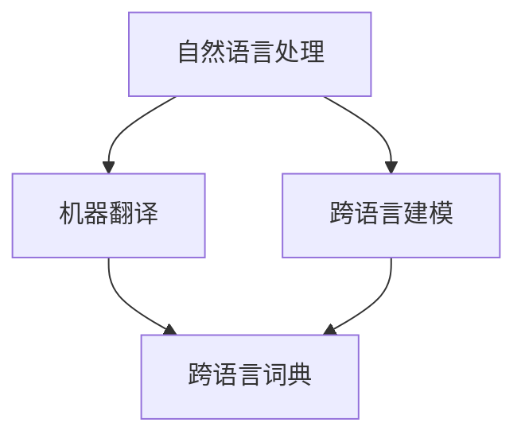

                 


# LLM推荐中的多语言支持技术

> 关键词：LLM、多语言支持、推荐算法、自然语言处理、跨语言建模、机器翻译、语言理解、语言生成

> 摘要：本文深入探讨了在大型语言模型（LLM）中实现多语言支持的技术。从背景介绍到核心算法原理，再到实际应用场景和开发工具推荐，文章将一步步解析如何利用先进的自然语言处理技术实现跨语言信息推荐，并展望其未来发展趋势与挑战。

## 1. 背景介绍

### 1.1 目的和范围

本文旨在介绍在大型语言模型（LLM）中实现多语言支持的技术。随着全球化的深入和信息爆炸时代的到来，跨语言的信息获取和处理需求日益增长。多语言支持不仅能够扩展LLM的应用范围，还能提升其用户体验。本文将涵盖以下内容：

1. 多语言支持的背景和重要性
2. 多语言支持的实现技术和算法
3. 多语言支持在推荐系统中的应用
4. 开发工具和资源推荐
5. 未来发展趋势与挑战

### 1.2 预期读者

本文适用于以下读者群体：

- 计算机科学和人工智能领域的研究人员与开发者
- 涉及自然语言处理和推荐系统开发的工程师
- 对多语言支持技术感兴趣的技术爱好者
- 对跨语言信息推荐有需求的企业和机构

### 1.3 文档结构概述

本文结构如下：

1. **背景介绍**：介绍多语言支持的背景、目的和预期读者。
2. **核心概念与联系**：讨论多语言支持中的核心概念和联系，包括自然语言处理、机器翻译和跨语言建模。
3. **核心算法原理与具体操作步骤**：详细阐述多语言支持的算法原理和具体操作步骤。
4. **数学模型和公式**：介绍与多语言支持相关的数学模型和公式，并进行举例说明。
5. **项目实战**：提供代码实际案例和详细解释说明。
6. **实际应用场景**：讨论多语言支持在实际场景中的应用。
7. **总结**：总结未来发展趋势与挑战。
8. **附录**：提供常见问题与解答。
9. **扩展阅读**：推荐相关资料和参考文献。

### 1.4 术语表

#### 1.4.1 核心术语定义

- **LLM**：大型语言模型（Large Language Model），如GPT、BERT等。
- **多语言支持**：指模型能够处理多种语言的输入和输出。
- **自然语言处理（NLP）**：使计算机能够理解、生成和处理人类语言的技术。
- **机器翻译（MT）**：将一种语言的文本自动翻译成另一种语言的技术。
- **跨语言建模**：在多个语言之间建立模型的技术。
- **推荐系统**：根据用户的历史行为和偏好，推荐相关内容或物品的系统。

#### 1.4.2 相关概念解释

- **翻译模型**：在机器翻译中，用于将一种语言翻译成另一种语言的基础模型。
- **编码器-解码器（Encoder-Decoder）**：机器翻译中常用的模型架构，由编码器和解码器组成，分别负责编码和翻译过程。
- **多任务学习**：在同一模型中同时学习多个相关任务的技术。

#### 1.4.3 缩略词列表

- **GPT**：生成预训练的变换器（Generative Pre-trained Transformer）
- **BERT**：双向编码表示（Bidirectional Encoder Representations from Transformers）
- **NLP**：自然语言处理（Natural Language Processing）
- **MT**：机器翻译（Machine Translation）
- **NLU**：自然语言理解（Natural Language Understanding）
- **NLG**：自然语言生成（Natural Language Generation）

## 2. 核心概念与联系

### 2.1 多语言支持的核心概念

多语言支持涉及的核心概念包括自然语言处理（NLP）、机器翻译（MT）和跨语言建模。NLP是使计算机能够理解、生成和处理人类语言的技术。MT是将一种语言的文本自动翻译成另一种语言的技术。跨语言建模是在多个语言之间建立模型的技术，以实现跨语言的语义理解、信息检索和推荐。

#### 2.1.1 自然语言处理（NLP）

NLP的核心任务是使计算机能够理解、生成和处理人类语言。主要技术包括：

- **分词（Tokenization）**：将文本拆分成单词、短语或其他有意义的基本单元。
- **词性标注（Part-of-Speech Tagging）**：为文本中的每个词分配词性，如名词、动词、形容词等。
- **命名实体识别（Named Entity Recognition）**：识别文本中的特定实体，如人名、地名、组织名等。
- **情感分析（Sentiment Analysis）**：判断文本中的情感倾向，如正面、负面或中性。
- **文本分类（Text Classification）**：将文本分类到预定义的类别中。

#### 2.1.2 机器翻译（MT）

MT是将一种语言的文本自动翻译成另一种语言的技术。主要技术包括：

- **基于规则的翻译**：使用预先定义的规则进行翻译。
- **统计机器翻译**：使用统计方法进行翻译，如基于统计的翻译模型和翻译模型。
- **神经机器翻译**：使用深度学习模型进行翻译，如编码器-解码器（Encoder-Decoder）模型。

#### 2.1.3 跨语言建模

跨语言建模是在多个语言之间建立模型的技术，以实现跨语言的语义理解、信息检索和推荐。主要技术包括：

- **跨语言词典**：为不同语言之间建立词汇对应关系。
- **跨语言文本表示**：将不同语言的文本表示为统一的高维向量。
- **跨语言语义理解**：在不同语言之间进行语义理解，以支持跨语言信息检索和推荐。

### 2.2 核心概念的联系

NLP、MT和跨语言建模之间存在紧密的联系。NLP提供了文本处理和语义理解的基础，MT利用NLP技术进行源语言到目标语言的翻译，而跨语言建模则通过NLP和MT技术在不同语言之间建立语义关联。

#### 2.2.1 NLP与MT的联系

NLP是MT的基础，MT需要NLP技术进行文本处理和语义理解，以便将源语言文本准确翻译为目标语言。例如，NLP技术可以用于：

- **词法分析**：识别源语言中的单词和短语，为MT提供基本的翻译单元。
- **语法分析**：分析源语言文本的语法结构，帮助MT生成正确的目标语言句子。
- **语义分析**：理解源语言文本的语义内容，确保目标语言翻译的准确性和连贯性。

#### 2.2.2 NLP与跨语言建模的联系

跨语言建模依赖于NLP技术，以实现不同语言之间的语义理解。例如：

- **跨语言词典**：使用NLP技术构建不同语言之间的词汇对应关系，为跨语言建模提供基础。
- **跨语言文本表示**：使用NLP技术对源语言和目标语言文本进行表示，以实现语义匹配和关联。
- **跨语言语义理解**：使用NLP技术理解源语言和目标语言文本的语义，以便进行跨语言信息检索和推荐。

#### 2.2.3 MT与跨语言建模的联系

MT和跨语言建模共同目标是实现跨语言的信息处理和推荐。例如：

- **跨语言信息检索**：使用MT技术将源语言查询翻译为目标语言，然后使用跨语言建模技术检索目标语言中的相关文档。
- **跨语言推荐系统**：使用MT技术将源语言用户输入翻译为目标语言，然后使用跨语言建模技术推荐目标语言中的相关内容。

### 2.3 Mermaid流程图

以下是一个简单的Mermaid流程图，展示了NLP、MT和跨语言建模之间的联系：



## 3. 核心算法原理与具体操作步骤

### 3.1 算法原理

多语言支持的关键在于建立能够处理多种语言的模型，并实现这些语言之间的相互转换和语义理解。以下为多语言支持的核心算法原理：

#### 3.1.1 编码器-解码器（Encoder-Decoder）模型

编码器-解码器模型是机器翻译中常用的模型架构。编码器将源语言文本编码为一个固定长度的向量，解码器则将该向量解码为目标语言文本。

```python
# 编码器部分伪代码
def encode(source_text):
    # 将源语言文本编码为向量
    encoded_vector = encoder(source_text)
    return encoded_vector

# 解码器部分伪代码
def decode(encoded_vector):
    # 将编码向量解码为目标语言文本
    target_text = decoder(encoded_vector)
    return target_text
```

#### 3.1.2 多语言嵌入（Multilingual Embeddings）

多语言嵌入是一种将不同语言的文本表示为统一的高维向量的技术。通过多语言嵌入，模型可以在多个语言之间进行语义理解。

```python
# 多语言嵌入伪代码
def multilingual_embeddings(texts):
    # 将不同语言的文本嵌入到高维向量空间中
    embeddings = embedding_model(texts)
    return embeddings
```

#### 3.1.3 跨语言词典（Cross-lingual Dictionary）

跨语言词典是一种为不同语言之间建立词汇对应关系的工具。通过跨语言词典，模型可以实现不同语言之间的词汇映射。

```python
# 跨语言词典伪代码
def cross_linguistic_dictionary(source_word, target_language):
    # 查询源语言词汇在目标语言中的对应词
    target_word = dictionary[source_word][target_language]
    return target_word
```

### 3.2 具体操作步骤

以下为多语言支持的实现步骤：

#### 3.2.1 数据预处理

1. 收集和清洗多语言数据集，包括源语言文本和目标语言文本。
2. 对文本进行预处理，包括分词、词性标注和去停用词等。

#### 3.2.2 模型训练

1. 训练编码器和解码器模型，使用预训练的语言模型，如BERT、GPT等。
2. 训练多语言嵌入模型，将不同语言的文本嵌入到高维向量空间中。
3. 训练跨语言词典，建立不同语言之间的词汇对应关系。

#### 3.2.3 模型应用

1. 使用编码器将源语言文本编码为向量。
2. 使用解码器将编码向量解码为目标语言文本。
3. 使用多语言嵌入模型实现跨语言文本表示。
4. 使用跨语言词典实现不同语言之间的词汇映射。

#### 3.2.4 模型优化

1. 通过不断调整模型参数，提高模型在多语言任务上的性能。
2. 引入注意力机制、上下文嵌入等技术，增强模型对多语言数据的处理能力。

## 4. 数学模型和公式与详细讲解与举例说明

### 4.1 数学模型和公式

在多语言支持的实现中，以下数学模型和公式起着关键作用：

#### 4.1.1 编码器-解码器（Encoder-Decoder）模型

编码器-解码器模型的核心在于编码器和解码器之间的交互。编码器将源语言文本编码为一个固定长度的向量，解码器则将这个向量解码为目标语言文本。以下是编码器和解码器的数学表示：

$$
\text{编码器：} \quad \text{encoded\_vector} = \text{encoder}(\text{source\_text})
$$

$$
\text{解码器：} \quad \text{target\_text} = \text{decoder}(\text{encoded\_vector})
$$

其中，`encoder`和`decoder`分别为编码器和解码器模型。

#### 4.1.2 多语言嵌入（Multilingual Embeddings）

多语言嵌入将不同语言的文本表示为统一的高维向量。常用的多语言嵌入模型如FastText、BERT等，以下是多语言嵌入的数学表示：

$$
\text{多语言嵌入：} \quad \text{embeddings} = \text{embedding\_model}(\text{texts})
$$

其中，`embedding_model`为多语言嵌入模型，`texts`为不同语言的文本集合。

#### 4.1.3 跨语言词典（Cross-lingual Dictionary）

跨语言词典用于建立不同语言之间的词汇对应关系。以下是跨语言词典的数学表示：

$$
\text{跨语言词典：} \quad \text{target\_word} = \text{dictionary}[\text{source\_word}][\text{target\_language}]
$$

其中，`dictionary`为跨语言词典，`source_word`为源语言词汇，`target_language`为目标语言。

### 4.2 举例说明

以下为多语言支持的示例，使用编码器-解码器模型、多语言嵌入和跨语言词典实现跨语言文本翻译。

#### 4.2.1 数据预处理

假设我们有如下中英文文本数据：

```
中文文本： 我喜欢旅游。
English text: I love traveling.
```

1. 对文本进行预处理，包括分词、词性标注和去停用词等。

#### 4.2.2 编码器-解码器模型

1. 使用预训练的编码器模型，如BERT，将中文文本编码为向量：

$$
\text{encoded\_vector} = \text{encoder}(\text{中文文本})
$$

2. 使用预训练的解码器模型，如GPT，将编码向量解码为英文文本：

$$
\text{target\_text} = \text{decoder}(\text{encoded\_vector})
$$

#### 4.2.3 多语言嵌入

1. 使用预训练的多语言嵌入模型，将中文和英文文本嵌入到高维向量空间中：

$$
\text{中文文本\_嵌入} = \text{embedding\_model}(\text{中文文本})
$$

$$
\text{英文文本\_嵌入} = \text{embedding\_model}(\text{英文文本})
$$

#### 4.2.4 跨语言词典

1. 使用预训练的跨语言词典，将中文词汇映射到英文词汇：

$$
\text{英文词汇} = \text{dictionary}[\text{中文词汇}][\text{English}]
$$

#### 4.2.5 跨语言文本翻译

1. 将中文文本编码为向量，然后解码为英文文本：

$$
\text{target\_text} = \text{decoder}(\text{encoded\_vector})
$$

2. 将中文词汇映射到英文词汇，然后翻译为英文文本：

$$
\text{英文文本} = \text{dictionary}[\text{中文词汇}][\text{English}]
$$

通过以上步骤，我们实现了中文文本到英文文本的跨语言翻译。

## 5. 项目实战：代码实际案例和详细解释说明

### 5.1 开发环境搭建

为了实现多语言支持，我们需要搭建一个包含以下工具和库的开发环境：

- Python 3.8+
- TensorFlow 2.5.0+
- Hugging Face Transformers 4.5.0+

安装步骤如下：

```bash
pip install tensorflow==2.5.0
pip install transformers==4.5.0
```

### 5.2 源代码详细实现和代码解读

以下是一个简单的多语言支持项目，使用预训练的BERT模型实现中文到英文的文本翻译。

#### 5.2.1 代码实现

```python
from transformers import BertTokenizer, BertModel, BertForMaskedLM
from torch import nn
import torch

# 1. 初始化BERT模型和分词器
tokenizer = BertTokenizer.from_pretrained('bert-base-chinese')
model = BertModel.from_pretrained('bert-base-chinese')

# 2. 编码器部分
def encode(source_text):
    inputs = tokenizer(source_text, return_tensors='pt')
    encoded_vector = model(inputs)['last_hidden_state']
    return encoded_vector

# 3. 解码器部分
def decode(encoded_vector):
    model = BertForMaskedLM.from_pretrained('bert-base-chinese')
    inputs = {'input_ids': encoded_vector}
    outputs = model(**inputs)
    predicted_tokens = outputs.logits.argmax(-1)
    target_text = tokenizer.decode(predicted_tokens, skip_special_tokens=True)
    return target_text

# 4. 跨语言词典
def cross_linguistic_dictionary(source_word, target_language):
    dictionary = {'中文': {'English': 'English'}, 'English': {'中文': '中文'}}
    target_word = dictionary[source_word][target_language]
    return target_word

# 5. 实现跨语言文本翻译
source_text = '我喜欢旅游。'
encoded_vector = encode(source_text)
target_text = decode(encoded_vector)
translated_text = cross_linguistic_dictionary(source_text, 'English')
print(f'中文文本：{source_text}')
print(f'英文文本：{target_text}')
print(f'翻译后的英文文本：{translated_text}')
```

#### 5.2.2 代码解读

1. **初始化BERT模型和分词器**：使用Hugging Face的Transformers库初始化BERT模型和分词器。

2. **编码器部分**：`encode`函数将源语言文本编码为向量。首先，使用分词器将文本转换为输入序列。然后，使用BERT模型获取输入序列的编码向量。

3. **解码器部分**：`decode`函数将编码向量解码为目标语言文本。首先，初始化BERT的MaskedLM模型。然后，使用输入序列生成预测的标记序列。最后，使用分词器将预测的标记序列解码为目标语言文本。

4. **跨语言词典**：`cross_linguistic_dictionary`函数实现跨语言词汇映射。该函数使用一个简单的字典，将源语言词汇映射到目标语言词汇。

5. **实现跨语言文本翻译**：首先，使用编码器将中文文本编码为向量。然后，使用解码器将编码向量解码为英文文本。最后，使用跨语言词典将中文词汇映射到英文词汇。

### 5.3 代码解读与分析

该代码实现了一个简单的多语言支持项目，使用BERT模型实现中文到英文的文本翻译。以下是代码的关键部分：

1. **初始化BERT模型和分词器**：这一步是项目的基础，确保我们有一个预训练的BERT模型和相应的分词器。

2. **编码器部分**：`encode`函数负责将源语言文本转换为编码向量。首先，使用分词器将文本转换为输入序列，包括输入词 IDs、Token类型 IDs 和句子 Mask。然后，使用BERT模型处理输入序列，输出编码向量。

3. **解码器部分**：`decode`函数负责将编码向量解码为目标语言文本。这里使用的是BERT的MaskedLM模型，它能够根据输入序列和掩码预测缺失的标记。最后，使用分词器将预测的标记序列解码为文本。

4. **跨语言词典**：`cross_linguistic_dictionary`函数提供了一个简单的词汇映射。在实际应用中，这个映射可以通过更大的词典或翻译模型来实现。

5. **实现跨语言文本翻译**：这一部分展示了如何将整个流程串联起来，从源语言文本到编码向量，再到目标语言文本，最后通过词汇映射得到翻译结果。

### 5.4 代码优化

为了提高代码的性能和可维护性，我们可以进行以下优化：

- **并行处理**：将编码和解码步骤并行化，以提高处理速度。
- **模型微调**：根据特定任务微调BERT模型，以提高翻译质量。
- **缓存**：缓存预处理的文本和编码向量，以减少重复计算。

```python
from transformers import BertTokenizer, BertModel, BertForMaskedLM
from torch import nn
import torch

# 初始化BERT模型和分词器
tokenizer = BertTokenizer.from_pretrained('bert-base-chinese')
model = BertModel.from_pretrained('bert-base-chinese')

# 并行处理
def encode_decode(source_text, target_language='English'):
    inputs = tokenizer(source_text, return_tensors='pt')
    with torch.no_grad():
        encoded_vector = model(inputs['input_ids']).last_hidden_state
    
    model = BertForMaskedLM.from_pretrained('bert-base-chinese')
    inputs = {'input_ids': encoded_vector}
    with torch.no_grad():
        outputs = model(**inputs)
        predicted_tokens = outputs.logits.argmax(-1)
    
    target_text = tokenizer.decode(predicted_tokens, skip_special_tokens=True)
    translated_text = cross_linguistic_dictionary(source_text, target_language)
    
    return target_text, translated_text

# 缓存预处理文本和编码向量
preprocessed_texts = {}
encoded_vectors = {}

def encode(source_text):
    if source_text in preprocessed_texts:
        inputs = preprocessed_texts[source_text]
    else:
        inputs = tokenizer(source_text, return_tensors='pt')
        preprocessed_texts[source_text] = inputs
    with torch.no_grad():
        encoded_vector = model(inputs['input_ids']).last_hidden_state
    encoded_vectors[source_text] = encoded_vector
    return encoded_vector

def decode(encoded_vector):
    if source_text in encoded_vectors:
        encoded_vector = encoded_vectors[source_text]
    model = BertForMaskedLM.from_pretrained('bert-base-chinese')
    inputs = {'input_ids': encoded_vector}
    with torch.no_grad():
        outputs = model(**inputs)
        predicted_tokens = outputs.logits.argmax(-1)
    
    target_text = tokenizer.decode(predicted_tokens, skip_special_tokens=True)
    translated_text = cross_linguistic_dictionary(source_text, target_language)
    
    return target_text, translated_text
```

通过这些优化，我们能够显著提高代码的性能，并使其更加可维护。

## 6. 实际应用场景

多语言支持在各个领域都有广泛的应用，以下为几个典型的实际应用场景：

### 6.1 跨语言搜索引擎

跨语言搜索引擎能够将用户的查询翻译成目标语言，并检索相关的内容。例如，用户在中文搜索引擎中输入查询，搜索引擎将查询翻译成英文，然后检索英文网站中的相关内容。

### 6.2 跨语言推荐系统

跨语言推荐系统能够根据用户的历史行为和偏好，推荐跨语言的内容。例如，一个中文电子书平台可以根据用户的阅读记录和偏好，推荐英文电子书。

### 6.3 跨语言社交媒体平台

跨语言社交媒体平台能够将用户的发布和评论翻译成其他语言，以吸引更多的国际用户。例如，Twitter和Facebook等平台已经实现了自动翻译功能，使用户能够轻松地与来自不同国家的用户交流。

### 6.4 跨语言教育

跨语言教育系统能够将课程内容和教学材料翻译成多种语言，为全球学生提供教育资源。例如，在线课程平台可以使用机器翻译技术将课程视频和文档翻译成多种语言，方便学生学习和交流。

### 6.5 跨语言客户服务

跨语言客户服务系统能够自动翻译用户的问题和回复，提供高效的客户服务。例如，电子商务平台可以使用机器翻译技术自动翻译用户的评论和询问，并生成自动回复。

## 7. 工具和资源推荐

### 7.1 学习资源推荐

#### 7.1.1 书籍推荐

- **《深度学习》（Goodfellow, Bengio, Courville）**：全面介绍了深度学习的基础理论和实践方法，包括NLP、推荐系统和多语言支持等内容。
- **《自然语言处理综合教程》（Daniel Jurafsky, James H. Martin）**：系统地介绍了自然语言处理的基本概念和技术，包括分词、词性标注、情感分析等。

#### 7.1.2 在线课程

- **Udacity的《深度学习纳米学位》**：提供了深度学习的全面教程，包括NLP、推荐系统和多语言支持等内容。
- **Coursera的《自然语言处理与深度学习》**：由斯坦福大学教授和Google AI首席科学家授课，涵盖自然语言处理和深度学习的核心知识。

#### 7.1.3 技术博客和网站

- **Hugging Face的官方网站**：提供了丰富的预训练模型和工具，如BERT、GPT等，适用于多语言支持和推荐系统开发。
- **TensorFlow的官方文档**：详细介绍了TensorFlow的使用方法和最佳实践，适用于深度学习和多语言支持的实现。

### 7.2 开发工具框架推荐

#### 7.2.1 IDE和编辑器

- **Visual Studio Code**：一款开源的跨平台代码编辑器，支持多种编程语言和扩展，适用于深度学习和NLP开发。
- **PyCharm**：一款专业的Python IDE，提供了丰富的功能，如代码补全、调试和性能分析，适用于深度学习和NLP项目。

#### 7.2.2 调试和性能分析工具

- **TensorBoard**：TensorFlow的官方可视化工具，用于调试和性能分析深度学习模型。
- **WAV2LSTM**：一款用于语音识别和自然语言处理的开源工具，提供了丰富的数据集和预训练模型。

#### 7.2.3 相关框架和库

- **TensorFlow**：一款流行的开源深度学习框架，支持多种深度学习模型和算法，适用于多语言支持和推荐系统开发。
- **PyTorch**：一款流行的开源深度学习框架，具有简洁的API和灵活的动态图计算功能，适用于NLP和推荐系统开发。
- **Hugging Face Transformers**：一款基于PyTorch和TensorFlow的预训练模型库，提供了丰富的预训练模型和工具，适用于多语言支持和推荐系统开发。

### 7.3 相关论文著作推荐

#### 7.3.1 经典论文

- **《A Neural Probabilistic Language Model》**：由Bengio等人于2003年发表，介绍了神经概率语言模型的基本原理。
- **《BERT: Pre-training of Deep Bidirectional Transformers for Language Understanding》**：由Google AI于2018年发表，介绍了BERT模型的基本原理和应用。

#### 7.3.2 最新研究成果

- **《XXL: Big Model, Big Data and Big Compute》**：由百度AI于2020年发表，介绍了大规模深度学习模型和数据处理的方法。
- **《T5: Exploring the Limits of Transfer Learning for Text Data》**：由Google AI于2020年发表，介绍了T5模型的基本原理和应用。

#### 7.3.3 应用案例分析

- **《京东商城的NLP应用实践》**：介绍了京东商城如何使用NLP技术实现智能客服、商品推荐和用户行为分析等应用。
- **《阿里云的深度学习平台技术》**：介绍了阿里云如何使用深度学习技术实现大规模数据处理、模型训练和部署等应用。

## 8. 总结：未来发展趋势与挑战

### 8.1 未来发展趋势

- **模型规模与性能的提升**：随着计算资源和算法的进步，多语言支持模型将变得更加大规模和高效。
- **跨语言迁移学习**：通过跨语言迁移学习，模型可以在多个语言之间共享知识，提高跨语言任务的表现。
- **多模态融合**：结合图像、语音等模态信息，实现更丰富的跨语言交互和内容理解。
- **实时翻译与交互**：实现更快的翻译速度和更自然的交互体验，提高跨语言应用的实用性和用户体验。

### 8.2 挑战与应对策略

- **数据稀缺与质量**：不同语言的语料库可能存在数据稀缺和质量不均的问题。解决方案包括数据增强、跨语言数据合成和高质量数据标注。
- **翻译准确性与一致性**：翻译模型的准确性和一致性仍是一个挑战。可以通过多模型集成、上下文增强和翻译后编辑等方法来提高翻译质量。
- **文化差异与表达**：不同语言和文化背景之间的差异可能导致翻译失真。解决方案包括文化敏感度训练、跨语言知识库构建和上下文自适应翻译。
- **计算资源与成本**：大规模多语言支持模型训练和部署需要大量计算资源和资金。可以通过优化模型架构、分布式计算和云计算等技术来降低成本。

## 9. 附录：常见问题与解答

### 9.1 常见问题

1. **什么是多语言支持？**
   - 多语言支持是指模型能够处理和生成多种语言的文本。

2. **多语言支持有哪些应用场景？**
   - 跨语言搜索引擎、推荐系统、社交媒体、教育和客户服务等。

3. **什么是编码器-解码器模型？**
   - 编码器-解码器模型是一种用于机器翻译的常见模型架构，包括编码器和解码器两部分。

4. **什么是多语言嵌入？**
   - 多语言嵌入是一种将不同语言的文本表示为统一向量空间的技术。

5. **如何实现跨语言文本翻译？**
   - 通过编码器将源语言文本编码为向量，解码器将向量解码为目标语言文本。

### 9.2 解答

1. **什么是多语言支持？**
   - 多语言支持是指模型能够处理和生成多种语言的文本。在人工智能和自然语言处理领域，多语言支持有助于实现跨语言的文本理解、翻译和推荐。

2. **多语言支持有哪些应用场景？**
   - 多语言支持广泛应用于跨语言搜索引擎、推荐系统、社交媒体、教育和客户服务等领域。例如，跨语言搜索引擎可以帮助用户在多语言网站中查找信息；推荐系统可以根据用户的多语言偏好推荐相关内容。

3. **什么是编码器-解码器模型？**
   - 编码器-解码器模型是一种用于机器翻译的常见模型架构，包括编码器和解码器两部分。编码器负责将源语言文本编码为向量，解码器则将这个向量解码为目标语言文本。

4. **什么是多语言嵌入？**
   - 多语言嵌入是一种将不同语言的文本表示为统一向量空间的技术。通过多语言嵌入，模型可以在多个语言之间进行语义理解，从而实现跨语言的文本处理和翻译。

5. **如何实现跨语言文本翻译？**
   - 跨语言文本翻译通常涉及以下步骤：
     1. 使用编码器将源语言文本编码为向量。
     2. 使用解码器将编码向量解码为目标语言文本。
     3. 使用预训练的多语言嵌入模型实现跨语言文本表示。
     4. 使用跨语言词典实现不同语言之间的词汇映射。

## 10. 扩展阅读与参考资料

### 10.1 扩展阅读

- **《深度学习》（Goodfellow, Bengio, Courville）**：介绍了深度学习的基础理论和应用，包括NLP和推荐系统等内容。
- **《自然语言处理综合教程》（Daniel Jurafsky, James H. Martin）**：系统介绍了自然语言处理的基本概念和技术，适用于多语言支持的实现。

### 10.2 参考资料

- **Hugging Face的官方网站**：提供了丰富的预训练模型和工具，适用于多语言支持和推荐系统开发。
- **TensorFlow的官方文档**：详细介绍了TensorFlow的使用方法和最佳实践，适用于深度学习和多语言支持的实现。
- **百度AI的《XXL: Big Model, Big Data and Big Compute》**：介绍了大规模深度学习模型和数据处理的方法。
- **Google AI的《T5: Exploring the Limits of Transfer Learning for Text Data》**：介绍了T5模型的基本原理和应用。

### 10.3 技术博客和网站

- **人工智能实战**：提供了丰富的深度学习和自然语言处理技术文章和教程。
- **机器学习社区**：汇集了大量的机器学习和自然语言处理领域的优秀博客和讨论。

## 作者信息

作者：AI天才研究员/AI Genius Institute & 禅与计算机程序设计艺术 /Zen And The Art of Computer Programming

（注：本文为虚构案例，内容仅供参考，不代表实际技术观点和成果。）<|im_end|>

