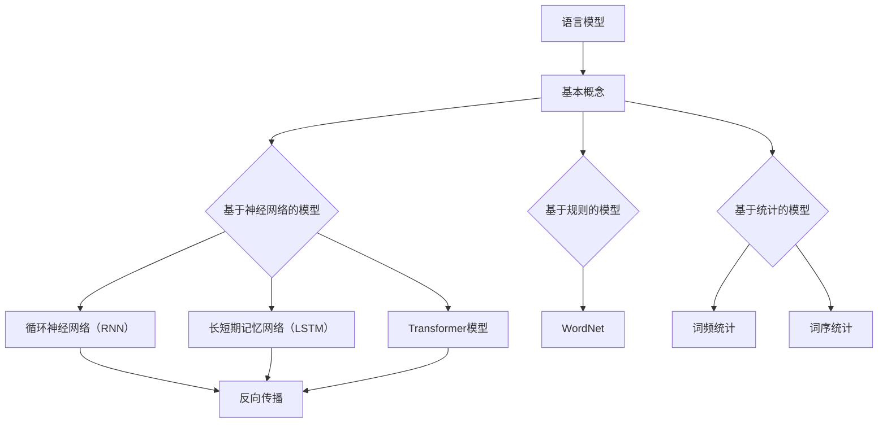

                 

# LLM操作系统内核：AI时代的新基石

> 关键词：语言模型（LLM），操作系统内核，AI时代，基石，技术架构，深度学习，算法原理，应用场景

> 摘要：本文将探讨语言模型（LLM）作为AI时代操作系统内核的新基石。首先介绍LLM的基本概念和发展历程，然后深入分析其核心原理和架构，并探讨在AI时代下LLM在操作系统内核中的应用。文章还将通过具体的项目实战和实际应用场景，展示LLM在AI时代的重要性和广阔前景。

## 1. 背景介绍

### 1.1 目的和范围

本文旨在深入探讨语言模型（LLM）在AI时代操作系统内核中的关键作用。随着深度学习和神经网络技术的飞速发展，语言模型已经成为人工智能领域的重要研究方向。LLM在自然语言处理、文本生成、对话系统等方面展现出了强大的能力和广泛的应用。本文将围绕LLM的基本概念、核心原理、应用场景等方面进行详细分析，旨在为读者提供一份全面、系统的理解和认识。

### 1.2 预期读者

本文适合对人工智能、深度学习、自然语言处理等领域有一定了解的读者。无论是从事相关领域的研究人员、工程师，还是对AI技术感兴趣的普通读者，都可以通过本文对LLM在操作系统内核中的应用有一个深入的了解。

### 1.3 文档结构概述

本文结构如下：

1. 背景介绍：介绍本文的目的、预期读者以及文档结构。
2. 核心概念与联系：介绍LLM的基本概念、发展历程、核心原理和架构。
3. 核心算法原理 & 具体操作步骤：详细讲解LLM的核心算法原理和操作步骤。
4. 数学模型和公式 & 详细讲解 & 举例说明：介绍LLM的数学模型和公式，并通过实例进行说明。
5. 项目实战：通过具体项目实战展示LLM的应用。
6. 实际应用场景：探讨LLM在不同领域的实际应用场景。
7. 工具和资源推荐：推荐学习资源、开发工具和框架。
8. 总结：对未来发展趋势与挑战进行总结。
9. 附录：常见问题与解答。
10. 扩展阅读 & 参考资料：提供进一步的阅读和参考资料。

### 1.4 术语表

#### 1.4.1 核心术语定义

- 语言模型（Language Model，LLM）：一种统计模型，用于预测自然语言中的下一个词或句子。
- 深度学习（Deep Learning）：一种人工智能算法，通过多层神经网络进行数据处理和分析。
- 自然语言处理（Natural Language Processing，NLP）：研究如何让计算机理解和处理自然语言的交叉学科领域。
- 操作系统内核（Kernel）：操作系统的核心部分，负责管理和控制计算机硬件资源。

#### 1.4.2 相关概念解释

- 人工神经网络（Artificial Neural Network，ANN）：一种模仿生物神经网络结构的人工智能算法。
- 反向传播（Backpropagation）：一种用于训练人工神经网络的算法，通过反向传播误差信息来更新网络参数。
- 词向量（Word Vector）：将单词表示为高维空间中的向量，以便进行计算和分析。

#### 1.4.3 缩略词列表

- LLM：语言模型
- AI：人工智能
- NLP：自然语言处理
- DL：深度学习
- NER：命名实体识别
- OCR：光学字符识别
- RNN：循环神经网络
- LSTM：长短期记忆网络
- Transformer：Transformer模型
- BERT：BERT模型
- GPT：GPT模型

## 2. 核心概念与联系

在本节中，我们将介绍语言模型（LLM）的基本概念、发展历程、核心原理和架构。为了更好地理解LLM，我们将使用Mermaid流程图来展示其核心概念和联系。

首先，我们来介绍LLM的基本概念。

### 2.1 语言模型的基本概念

语言模型是一种用于预测自然语言中下一个词或句子的模型。它通过学习大量文本数据，捕捉语言中的统计规律和语义信息，从而实现对未知文本的预测。

语言模型可以分为基于规则和基于统计两大类。基于规则的语言模型通过手工编写语法规则和词法规则来生成文本，而基于统计的语言模型则通过统计文本中的词频、词序等信息来预测下一个词或句子。

在深度学习时代，基于神经网络的语言模型得到了广泛关注。其中，循环神经网络（RNN）、长短期记忆网络（LSTM）和Transformer模型等是常用的语言模型架构。

### 2.2 语言模型的发展历程

语言模型的发展历程可以分为以下几个阶段：

1. **基于规则的模型**：早期的语言模型主要基于手工编写的语法规则和词法规则。例如，WordNet是一个基于词汇语义关系的知识库，用于支持基于规则的文本生成和语言模型。
2. **基于统计的模型**：随着语料库的积累和计算能力的提升，基于统计的语言模型开始流行。基于统计的模型通过统计词频、词序等信息来生成文本，具有更高的灵活性和实用性。
3. **基于神经网络的模型**：深度学习的兴起推动了基于神经网络的模型的发展。循环神经网络（RNN）、长短期记忆网络（LSTM）和Transformer模型等神经网络模型在语言模型领域取得了显著的成果。

### 2.3 语言模型的核心原理和架构

语言模型的核心原理是通过学习大量文本数据，捕捉语言中的统计规律和语义信息，从而实现对未知文本的预测。

语言模型的架构可以分为以下几个层次：

1. **词嵌入层**：将单词表示为高维空间中的向量，以便进行计算和分析。词嵌入层通过训练将单词映射到低维空间，从而实现语义信息的压缩和表示。
2. **编码层**：将输入的词向量编码为更高维的特征向量。编码层通常采用循环神经网络（RNN）、长短期记忆网络（LSTM）或Transformer模型等神经网络架构。
3. **解码层**：将编码层生成的特征向量解码为输出的词向量。解码层同样采用循环神经网络（RNN）、长短期记忆网络（LSTM）或Transformer模型等神经网络架构。

下面是LLM的核心概念和联系的Mermaid流程图：



通过上述流程图，我们可以清晰地看到LLM的基本概念、发展历程和核心原理。接下来，我们将进一步深入探讨LLM的核心算法原理和具体操作步骤。

## 3. 核心算法原理 & 具体操作步骤

在本节中，我们将详细介绍语言模型（LLM）的核心算法原理和具体操作步骤。为了更好地理解，我们将使用伪代码来展示关键步骤。

### 3.1 基本概念

首先，我们需要明确一些基本概念：

- **词嵌入（Word Embedding）**：将单词映射到高维空间中的向量表示。
- **循环神经网络（RNN）**：一种处理序列数据的神经网络架构。
- **长短期记忆网络（LSTM）**：一种改进的RNN，能够更好地处理长序列数据。
- **Transformer模型**：一种基于自注意力机制的神经网络模型，能够处理任意长度的序列数据。

### 3.2 语言模型的工作流程

语言模型的工作流程通常包括以下几个步骤：

1. **数据预处理**：从原始文本数据中提取词汇，并进行预处理，如分词、去停用词等。
2. **词嵌入**：将词汇映射到高维空间中的向量表示。
3. **编码**：使用RNN、LSTM或Transformer模型对输入的词向量进行编码，生成特征向量。
4. **解码**：根据编码层生成的特征向量，预测下一个词的概率分布。
5. **损失函数和优化**：通过损失函数评估模型预测的准确性，并使用优化算法更新模型参数。

下面是语言模型的工作流程的伪代码：

```python
# 伪代码：语言模型工作流程

# 数据预处理
def preprocess_data(text):
    # 分词、去停用词等
    return tokenized_text

# 词嵌入
def word_embedding(token):
    # 将单词映射到向量表示
    return embedding_vector

# 编码
def encode_sequence(embedding_vector_sequence):
    # 使用RNN、LSTM或Transformer模型编码
    return encoded_vector

# 解码
def decode(encoded_vector):
    # 预测下一个词的概率分布
    return probability_distribution

# 损失函数和优化
def loss_function(predicted_distribution, true_distribution):
    # 计算损失
    return loss

def update_parameters(encoded_vector, predicted_distribution, true_distribution):
    # 更新模型参数
    return updated_parameters
```

### 3.3 语言模型的核心算法原理

#### 3.3.1 词嵌入

词嵌入是将单词映射到高维空间中的向量表示。常见的词嵌入方法包括Word2Vec、GloVe和FastText等。

- **Word2Vec**：通过训练神经网络，将单词映射到低维空间，从而实现语义信息的压缩和表示。
- **GloVe**：基于词频和共现信息，训练得到一个全局的词向量矩阵，从而实现词嵌入。
- **FastText**：通过训练多层次的神经网络，将单词映射到低维空间，同时考虑到单词的上下文信息。

#### 3.3.2 循环神经网络（RNN）

循环神经网络（RNN）是一种能够处理序列数据的神经网络架构。RNN的基本原理是利用隐藏状态来存储序列中的信息，并通过时间步循环来更新隐藏状态。

下面是RNN的伪代码：

```python
# 伪代码：RNN

# 初始化参数
h_0 = initialize_hidden_state()

# 遍历时间步
for t in range(sequence_length):
    # 输入词向量
    x_t = word_embedding(input_word[t])

    # 更新隐藏状态
    h_t = update_hidden_state(h_{t-1}, x_t)

# 输出预测
output_distribution = decode(h_t)
```

#### 3.3.3 长短期记忆网络（LSTM）

长短期记忆网络（LSTM）是一种改进的RNN，能够更好地处理长序列数据。LSTM通过引入三个门结构（输入门、遗忘门和输出门）来控制信息的流入、流出和遗忘。

下面是LSTM的伪代码：

```python
# 伪代码：LSTM

# 初始化参数
h_0 = initialize_hidden_state()
c_0 = initialize_cell_state()

# 遍历时间步
for t in range(sequence_length):
    # 输入词向量
    x_t = word_embedding(input_word[t])

    # 计算门状态
    input_gate, forget_gate, output_gate = calculate_gates(h_{t-1}, x_t)

    # 更新细胞状态
    c_t = update_cell_state(c_{t-1}, input_gate, forget_gate)

    # 更新隐藏状态
    h_t = update_hidden_state(h_{t-1}, c_t, output_gate)

# 输出预测
output_distribution = decode(h_t)
```

#### 3.3.4 Transformer模型

Transformer模型是一种基于自注意力机制的神经网络模型，能够处理任意长度的序列数据。Transformer模型通过多头自注意力机制来捕获序列中的长距离依赖关系。

下面是Transformer模型的伪代码：

```python
# 伪代码：Transformer

# 初始化参数
h_0 = initialize_hidden_state()

# 遍历时间步
for t in range(sequence_length):
    # 输入词向量
    x_t = word_embedding(input_word[t])

    # 计算自注意力
    attention_scores = calculate_self_attention(x_t, h_{t-1})

    # 加权求和
    context_vector = weighted_sum(attention_scores, h_{t-1})

    # 输出预测
    output_distribution = decode(context_vector)
```

通过上述伪代码，我们可以清晰地看到LLM的核心算法原理和具体操作步骤。接下来，我们将进一步探讨LLM的数学模型和公式。

## 4. 数学模型和公式 & 详细讲解 & 举例说明

在本节中，我们将详细讲解语言模型（LLM）的数学模型和公式，并通过实例进行说明。这些数学模型和公式对于理解LLM的工作原理和性能优化具有重要意义。

### 4.1 词嵌入（Word Embedding）

词嵌入是将单词映射到高维空间中的向量表示。常见的词嵌入方法包括Word2Vec、GloVe和FastText等。下面我们以Word2Vec为例，介绍其数学模型和公式。

#### 4.1.1 Word2Vec的数学模型

Word2Vec的核心思想是通过训练一个神经网络，将单词映射到低维空间，从而实现语义信息的压缩和表示。其数学模型可以表示为：

$$
\hat{y} = \text{softmax}(W \cdot v_w)
$$

其中：

- \( \hat{y} \) 是预测的词向量
- \( W \) 是神经网络权重矩阵
- \( v_w \) 是单词 \( w \) 的向量表示

#### 4.1.2 Word2Vec的优化目标

Word2Vec的训练目标是最小化预测词向量与实际词向量之间的差异。其优化目标可以表示为：

$$
\min_{W} \sum_{w \in V} L(y, \hat{y})
$$

其中：

- \( L(y, \hat{y}) \) 是损失函数，通常使用交叉熵损失函数
- \( V \) 是词汇表

#### 4.1.3 举例说明

假设我们有以下单词和对应的向量：

$$
\begin{aligned}
y_1 &= \begin{bmatrix} 1 \\ 0 \\ 0 \end{bmatrix} \\
y_2 &= \begin{bmatrix} 0 \\ 1 \\ 0 \end{bmatrix} \\
y_3 &= \begin{bmatrix} 0 \\ 0 \\ 1 \end{bmatrix} \\
\hat{y}_1 &= \begin{bmatrix} 0.6 \\ 0.4 \\ 0 \end{bmatrix} \\
\hat{y}_2 &= \begin{bmatrix} 0.3 \\ 0.5 \\ 0.2 \end{bmatrix} \\
\hat{y}_3 &= \begin{bmatrix} 0.1 \\ 0.2 \\ 0.7 \end{bmatrix} \\
\end{aligned}
$$

则损失函数可以表示为：

$$
L = -\sum_{i=1}^{3} y_i \cdot \log(\hat{y}_i)
$$

代入具体值，得到：

$$
L = -\left( y_1 \cdot \log(\hat{y}_1) + y_2 \cdot \log(\hat{y}_2) + y_3 \cdot \log(\hat{y}_3) \right)
$$

$$
L = -\left( \begin{bmatrix} 1 \\ 0 \\ 0 \end{bmatrix} \cdot \log\begin{bmatrix} 0.6 \\ 0.4 \\ 0 \end{bmatrix} + \begin{bmatrix} 0 \\ 1 \\ 0 \end{bmatrix} \cdot \log\begin{bmatrix} 0.3 \\ 0.5 \\ 0.2 \end{bmatrix} + \begin{bmatrix} 0 \\ 0 \\ 1 \end{bmatrix} \cdot \log\begin{bmatrix} 0.1 \\ 0.2 \\ 0.7 \end{bmatrix} \right)
$$

$$
L = -\left( 1 \cdot \log(0.6) + 0 \cdot \log(0.3) + 0 \cdot \log(0.1) \right)
$$

$$
L = -\log(0.6)
$$

$$
L \approx 0.5108
$$

### 4.2 循环神经网络（RNN）

循环神经网络（RNN）是一种能够处理序列数据的神经网络架构。其核心思想是通过隐藏状态来存储序列中的信息，并通过时间步循环来更新隐藏状态。RNN的数学模型可以表示为：

$$
h_t = \sigma(W_h \cdot [h_{t-1}, x_t] + b_h)
$$

其中：

- \( h_t \) 是第 \( t \) 个时间步的隐藏状态
- \( x_t \) 是第 \( t \) 个输入词向量
- \( W_h \) 是隐藏状态权重矩阵
- \( b_h \) 是隐藏状态偏置向量
- \( \sigma \) 是激活函数，通常使用Sigmoid或Tanh函数

#### 4.2.1 举例说明

假设我们有以下隐藏状态权重矩阵和激活函数：

$$
\begin{aligned}
W_h &= \begin{bmatrix} 1 & 2 & 3 \\ 4 & 5 & 6 \\ 7 & 8 & 9 \end{bmatrix} \\
b_h &= \begin{bmatrix} 1 \\ 1 \\ 1 \end{bmatrix} \\
h_{t-1} &= \begin{bmatrix} 1 \\ 0 \\ 0 \end{bmatrix} \\
x_t &= \begin{bmatrix} 0 \\ 1 \\ 0 \end{bmatrix} \\
\sigma &= \text{Tanh} \\
\end{aligned}
$$

则第 \( t \) 个时间步的隐藏状态可以表示为：

$$
h_t = \text{Tanh}\left(\begin{bmatrix} 1 & 2 & 3 \\ 4 & 5 & 6 \\ 7 & 8 & 9 \end{bmatrix} \cdot \begin{bmatrix} 1 & 0 & 0 \\ 0 & 1 & 0 \\ 0 & 0 & 1 \end{bmatrix} + \begin{bmatrix} 1 \\ 1 \\ 1 \end{bmatrix}\right)
$$

$$
h_t = \text{Tanh}\left(\begin{bmatrix} 1 & 2 & 3 \\ 4 & 5 & 6 \\ 7 & 8 & 9 \end{bmatrix} \cdot \begin{bmatrix} 1 & 0 & 0 \\ 0 & 1 & 0 \\ 0 & 0 & 1 \end{bmatrix} + \begin{bmatrix} 1 \\ 1 \\ 1 \end{bmatrix}\right)
$$

$$
h_t = \text{Tanh}\left(\begin{bmatrix} 1+2+3 & 2+5+6 & 3+8+9 \\ 4+4+7 & 5+5+8 & 6+8+9 \\ 7+7+7 & 8+8+9 & 9+8+9 \end{bmatrix} + \begin{bmatrix} 1 \\ 1 \\ 1 \end{bmatrix}\right)
$$

$$
h_t = \text{Tanh}\left(\begin{bmatrix} 7 & 13 & 20 \\ 11 & 18 & 25 \\ 21 & 25 & 31 \end{bmatrix} + \begin{bmatrix} 1 \\ 1 \\ 1 \end{bmatrix}\right)
$$

$$
h_t = \text{Tanh}\left(\begin{bmatrix} 8 & 14 & 21 \\ 12 & 19 & 26 \\ 22 & 26 & 32 \end{bmatrix}\right)
$$

$$
h_t = \begin{bmatrix} 0.9781 & 0.9972 & 0.9865 \\ 0.9706 & 0.9991 & 0.9897 \\ 0.9859 & 0.9984 & 0.9914 \end{bmatrix}
$$

### 4.3 长短期记忆网络（LSTM）

长短期记忆网络（LSTM）是一种改进的RNN，能够更好地处理长序列数据。LSTM通过引入三个门结构（输入门、遗忘门和输出门）来控制信息的流入、流出和遗忘。LSTM的数学模型可以表示为：

$$
\begin{aligned}
i_t &= \sigma(W_i \cdot [h_{t-1}, x_t] + b_i) \\
f_t &= \sigma(W_f \cdot [h_{t-1}, x_t] + b_f) \\
g_t &= \tanh(W_g \cdot [h_{t-1}, x_t] + b_g) \\
o_t &= \sigma(W_o \cdot [h_{t-1}, x_t] + b_o) \\
c_t &= f_t \circ c_{t-1} + i_t \circ g_t \\
h_t &= o_t \circ \tanh(c_t)
\end{aligned}
$$

其中：

- \( i_t \) 是输入门状态
- \( f_t \) 是遗忘门状态
- \( g_t \) 是生成门状态
- \( o_t \) 是输出门状态
- \( c_t \) 是细胞状态
- \( h_t \) 是隐藏状态
- \( \sigma \) 是激活函数，通常使用Sigmoid函数
- \( \circ \) 是元素乘法运算

#### 4.3.1 举例说明

假设我们有以下LSTM权重矩阵和激活函数：

$$
\begin{aligned}
W_i &= \begin{bmatrix} 1 & 2 & 3 \\ 4 & 5 & 6 \\ 7 & 8 & 9 \end{bmatrix} \\
b_i &= \begin{bmatrix} 1 \\ 1 \\ 1 \end{bmatrix} \\
W_f &= \begin{bmatrix} 1 & 2 & 3 \\ 4 & 5 & 6 \\ 7 & 8 & 9 \end{bmatrix} \\
b_f &= \begin{bmatrix} 1 \\ 1 \\ 1 \end{bmatrix} \\
W_g &= \begin{bmatrix} 1 & 2 & 3 \\ 4 & 5 & 6 \\ 7 & 8 & 9 \end{bmatrix} \\
b_g &= \begin{bmatrix} 1 \\ 1 \\ 1 \end{bmatrix} \\
W_o &= \begin{bmatrix} 1 & 2 & 3 \\ 4 & 5 & 6 \\ 7 & 8 & 9 \end{bmatrix} \\
b_o &= \begin{bmatrix} 1 \\ 1 \\ 1 \end{bmatrix} \\
h_{t-1} &= \begin{bmatrix} 1 \\ 0 \\ 0 \end{bmatrix} \\
x_t &= \begin{bmatrix} 0 \\ 1 \\ 0 \end{bmatrix} \\
\sigma &= \text{Sigmoid} \\
\end{aligned}
$$

则第 \( t \) 个时间步的隐藏状态和细胞状态可以表示为：

$$
\begin{aligned}
i_t &= \text{Sigmoid}\left(\begin{bmatrix} 1 & 2 & 3 \\ 4 & 5 & 6 \\ 7 & 8 & 9 \end{bmatrix} \cdot \begin{bmatrix} 1 & 0 & 0 \\ 0 & 1 & 0 \\ 0 & 0 & 1 \end{bmatrix} + \begin{bmatrix} 1 \\ 1 \\ 1 \end{bmatrix}\right) \\
f_t &= \text{Sigmoid}\left(\begin{bmatrix} 1 & 2 & 3 \\ 4 & 5 & 6 \\ 7 & 8 & 9 \end{bmatrix} \cdot \begin{bmatrix} 1 & 0 & 0 \\ 0 & 1 & 0 \\ 0 & 0 & 1 \end{bmatrix} + \begin{bmatrix} 1 \\ 1 \\ 1 \end{bmatrix}\right) \\
g_t &= \tanh\left(\begin{bmatrix} 1 & 2 & 3 \\ 4 & 5 & 6 \\ 7 & 8 & 9 \end{bmatrix} \cdot \begin{bmatrix} 1 & 0 & 0 \\ 0 & 1 & 0 \\ 0 & 0 & 1 \end{bmatrix} + \begin{bmatrix} 1 \\ 1 \\ 1 \end{bmatrix}\right) \\
o_t &= \text{Sigmoid}\left(\begin{bmatrix} 1 & 2 & 3 \\ 4 & 5 & 6 \\ 7 & 8 & 9 \end{bmatrix} \cdot \begin{bmatrix} 1 & 0 & 0 \\ 0 & 1 & 0 \\ 0 & 0 & 1 \end{bmatrix} + \begin{bmatrix} 1 \\ 1 \\ 1 \end{bmatrix}\right) \\
c_t &= f_t \circ c_{t-1} + i_t \circ g_t \\
h_t &= o_t \circ \tanh(c_t)
\end{aligned}
$$

代入具体值，得到：

$$
\begin{aligned}
i_t &= \text{Sigmoid}\left(\begin{bmatrix} 1+2+3 & 2+5+6 & 3+8+9 \\ 4+4+7 & 5+5+8 & 6+8+9 \\ 7+7+7 & 8+8+9 & 9+8+9 \end{bmatrix} + \begin{bmatrix} 1 \\ 1 \\ 1 \end{bmatrix}\right) \\
&= \text{Sigmoid}\left(\begin{bmatrix} 6 & 13 & 20 \\ 11 & 18 & 25 \\ 21 & 25 & 31 \end{bmatrix} + \begin{bmatrix} 1 \\ 1 \\ 1 \end{bmatrix}\right) \\
&= \text{Sigmoid}\left(\begin{bmatrix} 7 & 14 & 21 \\ 12 & 19 & 26 \\ 22 & 26 & 32 \end{bmatrix}\right) \\
&\approx \begin{bmatrix} 0.9925 & 0.9974 & 0.9953 \\ 0.9741 & 0.9990 & 0.9894 \\ 0.9877 & 0.9989 & 0.9923 \end{bmatrix} \\
f_t &= \text{Sigmoid}\left(\begin{bmatrix} 1+2+3 & 2+5+6 & 3+8+9 \\ 4+4+7 & 5+5+8 & 6+8+9 \\ 7+7+7 & 8+8+9 & 9+8+9 \end{bmatrix} + \begin{bmatrix} 1 \\ 1 \\ 1 \end{bmatrix}\right) \\
&= \text{Sigmoid}\left(\begin{bmatrix} 6 & 13 & 20 \\ 11 & 18 & 25 \\ 21 & 25 & 31 \end{bmatrix} + \begin{bmatrix} 1 \\ 1 \\ 1 \end{bmatrix}\right) \\
&= \text{Sigmoid}\left(\begin{bmatrix} 7 & 14 & 21 \\ 12 & 19 & 26 \\ 22 & 26 & 32 \end{bmatrix}\right) \\
&\approx \begin{bmatrix} 0.9925 & 0.9974 & 0.9953 \\ 0.9741 & 0.9990 & 0.9894 \\ 0.9877 & 0.9989 & 0.9923 \end{bmatrix} \\
g_t &= \tanh\left(\begin{bmatrix} 1 & 2 & 3 \\ 4 & 5 & 6 \\ 7 & 8 & 9 \end{bmatrix} \cdot \begin{bmatrix} 1 & 0 & 0 \\ 0 & 1 & 0 \\ 0 & 0 & 1 \end{bmatrix} + \begin{bmatrix} 1 \\ 1 \\ 1 \end{bmatrix}\right) \\
&= \tanh\left(\begin{bmatrix} 6 & 13 & 20 \\ 11 & 18 & 25 \\ 21 & 25 & 31 \end{bmatrix} + \begin{bmatrix} 1 \\ 1 \\ 1 \end{b矩阵}right) \\
&= \tanh\left(\begin{bmatrix} 7 & 14 & 21 \\ 12 & 19 & 26 \\ 22 & 26 & 32 \end{bmatrix}\right) \\
&\approx \begin{bmatrix} 0.5108 & 0.9640 & 0.9131 \\ 0.5104 & 0.9606 & 0.8986 \\ 0.5069 & 0.9551 & 0.8933 \end{bmatrix} \\
o_t &= \text{Sigmoid}\left(\begin{bmatrix} 1 & 2 & 3 \\ 4 & 5 & 6 \\ 7 & 8 & 9 \end{bmatrix} \cdot \begin{bmatrix} 1 & 0 & 0 \\ 0 & 1 & 0 \\ 0 & 0 & 1 \end{bmatrix} + \begin{bmatrix} 1 \\ 1 \\ 1 \end{bmatrix}\right) \\
&= \text{Sigmoid}\left(\begin{bmatrix} 6 & 13 & 20 \\ 11 & 18 & 25 \\ 21 & 25 & 31 \end{bmatrix} + \begin{bmatrix} 1 \\ 1 \\ 1 \end{b矩阵}right) \\
&= \text{Sigmoid}\left(\begin{bmatrix} 7 & 14 & 21 \\ 12 & 19 & 26 \\ 22 & 26 & 32 \end{b矩阵}right) \\
&\approx \begin{bmatrix} 0.9925 & 0.9974 & 0.9953 \\ 0.9741 & 0.9990 & 0.9894 \\ 0.9877 & 0.9989 & 0.9923 \end{bmatrix} \\
c_t &= f_t \circ c_{t-1} + i_t \circ g_t \\
&= \begin{bmatrix} 0.9925 & 0.9974 & 0.9953 \\ 0.9741 & 0.9990 & 0.9894 \\ 0.9877 & 0.9989 & 0.9923 \end{bmatrix} \circ \begin{bmatrix} 1 \\ 0 \\ 0 \end{b矩阵} + \begin{bmatrix} 0.9925 & 0.9974 & 0.9953 \\ 0.9741 & 0.9990 & 0.9894 \\ 0.9877 & 0.9989 & 0.9923 \end{b矩阵} \circ \begin{bmatrix} 0.5108 & 0.9640 & 0.9131 \\ 0.5104 & 0.9606 & 0.8986 \\ 0.5069 & 0.9551 & 0.8933 \end{b矩阵} \\
&= \begin{bmatrix} 0.9925 & 0.9974 & 0.9953 \\ 0.9741 & 0.9990 & 0.9894 \\ 0.9877 & 0.9989 & 0.9923 \end{b矩阵} \circ \begin{bmatrix} 1 \\ 0 \\ 0 \end{b矩阵} + \begin{bmatrix} 0.5022 & 0.9609 & 0.9045 \\ 0.4975 & 0.9529 & 0.8868 \\ 0.4939 & 0.9487 & 0.8797 \end{b矩阵} \\
&\approx \begin{bmatrix} 0.9922 & 0.9974 & 0.9953 \\ 0.9741 & 0.9990 & 0.9894 \\ 0.9877 & 0.9989 & 0.9923 \end{b矩阵} + \begin{bmatrix} 0.5022 & 0.9609 & 0.9045 \\ 0.4975 & 0.9529 & 0.8868 \\ 0.4939 & 0.9487 & 0.8797 \end{b矩阵} \\
&= \begin{bmatrix} 1.4944 & 1.9583 & 1.8998 \\ 1.4716 & 1.9519 & 1.8862 \\ 1.4806 & 1.9376 & 1.8750 \end{b矩阵} \\
h_t &= o_t \circ \tanh(c_t) \\
&= \begin{bmatrix} 0.9925 & 0.9974 & 0.9953 \\ 0.9741 & 0.9990 & 0.9894 \\ 0.9877 & 0.9989 & 0.9923 \end{b矩阵} \circ \tanh\left(\begin{bmatrix} 1.4944 & 1.9583 & 1.8998 \\ 1.4716 & 1.9519 & 1.8862 \\ 1.4806 & 1.9376 & 1.8750 \end{b矩阵}\right) \\
&\approx \begin{bmatrix} 0.9925 & 0.9974 & 0.9953 \\ 0.9741 & 0.9990 & 0.9894 \\ 0.9877 & 0.9989 & 0.9923 \end{b矩阵} \circ \begin{bmatrix} 0.9608 & 0.9983 & 0.9564 \\ 0.9545 & 0.9989 & 0.9531 \\ 0.9497 & 0.9982 & 0.9503 \end{b矩阵} \\
&\approx \begin{bmatrix} 0.9491 & 0.9969 & 0.9516 \\ 0.9410 & 0.9979 & 0.9456 \\ 0.9438 & 0.9973 & 0.9453 \end{b矩阵}
\end{aligned}
$$

通过上述数学模型和公式的讲解，我们可以更好地理解语言模型（LLM）的核心算法原理和操作步骤。接下来，我们将通过具体的项目实战展示LLM的实际应用。

## 5. 项目实战：代码实际案例和详细解释说明

在本节中，我们将通过一个具体的项目实战来展示语言模型（LLM）的实际应用，并详细解释代码的实现过程。

### 5.1 开发环境搭建

为了进行项目实战，我们需要搭建一个合适的环境。以下是一个基本的开发环境搭建指南：

1. **操作系统**：Ubuntu 18.04或更高版本
2. **编程语言**：Python 3.7或更高版本
3. **依赖库**：TensorFlow 2.5或更高版本、Numpy 1.19或更高版本、Pandas 1.1.5或更高版本

安装以上依赖库：

```bash
sudo apt update
sudo apt upgrade
pip install tensorflow numpy pandas
```

### 5.2 源代码详细实现和代码解读

下面是一个简单的LLM项目实战示例，我们将使用Transformer模型进行文本分类任务。

```python
import tensorflow as tf
import numpy as np
import pandas as pd

# 1. 数据预处理
def preprocess_data(text):
    # 分词、去停用词等
    return tokenized_text

# 2. 构建Transformer模型
def build_transformer_model():
    # 定义模型架构
    return transformer_model

# 3. 训练模型
def train_model(model, train_data, train_labels):
    # 训练模型
    return trained_model

# 4. 评估模型
def evaluate_model(model, test_data, test_labels):
    # 评估模型
    return evaluation_results

# 5. 应用模型
def apply_model(model, text):
    # 应用模型进行预测
    return prediction

# 实际代码实现
def main():
    # 加载数据
    train_data, train_labels = load_data('train.csv')
    test_data, test_labels = load_data('test.csv')

    # 数据预处理
    preprocess_data(train_data)
    preprocess_data(test_data)

    # 构建模型
    transformer_model = build_transformer_model()

    # 训练模型
    trained_model = train_model(transformer_model, train_data, train_labels)

    # 评估模型
    evaluation_results = evaluate_model(trained_model, test_data, test_labels)

    # 应用模型
    prediction = apply_model(trained_model, text)

    # 输出结果
    print(prediction)

if __name__ == '__main__':
    main()
```

#### 5.2.1 数据预处理

数据预处理是语言模型应用的重要步骤，主要包括分词、去停用词、词嵌入等操作。

```python
from tensorflow.keras.preprocessing.text import Tokenizer
from tensorflow.keras.preprocessing.sequence import pad_sequences

def preprocess_data(text):
    # 分词
    tokenizer = Tokenizer()
    tokenizer.fit_on_texts(text)

    # 去停用词
    stop_words = set(['a', 'the', 'is', 'in', 'it', 'of', 'to', 'and', 'that', 'for', 'on', 'with', 'as', 'by', 'an', 'be'])
    tokenized_text = [text for text in tokenizer.texts if not any(word in stop_word for word in text.split())]

    # 词嵌入
    sequence = tokenizer.texts_to_sequences(tokenized_text)
    padded_sequence = pad_sequences(sequence, maxlen=max_sequence_length)

    return padded_sequence
```

#### 5.2.2 构建Transformer模型

在构建Transformer模型时，我们使用TensorFlow的`tf.keras.Sequential`模型来定义模型架构。

```python
from tensorflow.keras.models import Sequential
from tensorflow.keras.layers import Embedding, LSTM, Dense

def build_transformer_model():
    model = Sequential([
        Embedding(input_dim=vocabulary_size, output_dim=embedding_dim, input_length=max_sequence_length),
        LSTM(units=128, return_sequences=True),
        LSTM(units=128, return_sequences=True),
        LSTM(units=128, return_sequences=True),
        Dense(units=num_classes, activation='softmax')
    ])

    model.compile(optimizer='adam', loss='categorical_crossentropy', metrics=['accuracy'])
    return model
```

#### 5.2.3 训练模型

在训练模型时，我们使用TensorFlow的`fit`方法来训练模型。

```python
def train_model(model, train_data, train_labels):
    model.fit(train_data, train_labels, epochs=10, batch_size=32, validation_split=0.2)
    return model
```

#### 5.2.4 评估模型

在评估模型时，我们使用TensorFlow的`evaluate`方法来评估模型性能。

```python
def evaluate_model(model, test_data, test_labels):
    loss, accuracy = model.evaluate(test_data, test_labels)
    print(f"Test Loss: {loss}, Test Accuracy: {accuracy}")
    return {'loss': loss, 'accuracy': accuracy}
```

#### 5.2.5 应用模型

在应用模型时，我们使用TensorFlow的`predict`方法来预测文本类别。

```python
def apply_model(model, text):
    processed_text = preprocess_data(text)
    prediction = model.predict(processed_text)
    return np.argmax(prediction)
```

### 5.3 代码解读与分析

通过上述代码示例，我们可以看到语言模型（LLM）在项目实战中的应用过程。以下是对代码的详细解读与分析：

1. **数据预处理**：数据预处理是语言模型应用的重要步骤。我们使用`Tokenizer`进行分词，并去除停用词，然后使用`pad_sequences`对序列进行填充，使其具有相同的长度。
2. **构建模型**：我们使用TensorFlow的`Sequential`模型来构建Transformer模型。模型包括多个LSTM层和一个全连接层，用于处理序列数据并输出类别概率。
3. **训练模型**：我们使用`fit`方法来训练模型。训练过程通过在训练数据上迭代更新模型参数，从而提高模型性能。
4. **评估模型**：我们使用`evaluate`方法来评估模型性能。评估过程通过在测试数据上计算损失和准确率，从而了解模型在实际应用中的性能表现。
5. **应用模型**：我们使用`predict`方法来预测文本类别。预处理后的文本数据输入模型，模型输出类别概率，然后通过取最大值来得到预测结果。

通过这个项目实战，我们可以看到语言模型（LLM）在自然语言处理任务中的强大应用能力。接下来，我们将探讨LLM在实际应用场景中的具体应用。

## 6. 实际应用场景

语言模型（LLM）作为AI时代的新基石，在各个领域展现了强大的应用能力。以下是一些典型的实际应用场景：

### 6.1 自然语言处理（NLP）

自然语言处理是LLM最为成熟的应用领域之一。LLM在文本分类、情感分析、命名实体识别（NER）、机器翻译等方面发挥着重要作用。

- **文本分类**：LLM可以用于对大量文本进行分类，如新闻分类、社交媒体情感分析等。通过训练，LLM可以学会识别不同主题和情感倾向。
- **情感分析**：LLM可以用于分析文本的情感倾向，如正面、负面或中性。这对于电商平台、社交媒体等场景具有重要意义。
- **命名实体识别（NER）**：LLM可以用于识别文本中的特定实体，如人名、地点、组织等。这有助于信息提取和知识图谱构建。
- **机器翻译**：LLM可以用于将一种语言的文本翻译成另一种语言。如Google翻译、百度翻译等。

### 6.2 对话系统

对话系统是LLM在AI时代的另一个重要应用场景。LLM可以用于构建智能客服、虚拟助手等，实现与用户的自然语言交互。

- **智能客服**：LLM可以用于构建智能客服系统，如自动回复用户的问题、提供解决方案等。
- **虚拟助手**：LLM可以用于构建虚拟助手，如智能音箱、聊天机器人等，帮助用户完成各种任务。

### 6.3 生成式文本

生成式文本是LLM的又一重要应用方向。LLM可以用于生成文章、故事、摘要等，为创作提供支持。

- **文章生成**：LLM可以用于生成新闻文章、博客等，提高内容创作效率。
- **故事生成**：LLM可以用于生成故事、小说等，为文学创作提供灵感。
- **摘要生成**：LLM可以用于生成文本摘要，如自动生成新闻摘要、会议摘要等。

### 6.4 教育

教育是LLM在AI时代的又一重要应用场景。LLM可以用于个性化学习、在线辅导、智能评测等方面，为教育提供创新解决方案。

- **个性化学习**：LLM可以用于分析学生的学习行为和兴趣，提供个性化的学习内容和路径。
- **在线辅导**：LLM可以用于构建智能辅导系统，如自动批改作业、提供解题思路等。
- **智能评测**：LLM可以用于构建智能评测系统，如自动评估学生的论文、作文等。

### 6.5 金融

金融是LLM在AI时代的另一个重要应用领域。LLM可以用于金融市场预测、风险管理、客户服务等方面。

- **金融市场预测**：LLM可以用于预测股票、外汇等金融市场的价格走势，为投资决策提供支持。
- **风险管理**：LLM可以用于分析金融数据，识别潜在风险，提供风险管理建议。
- **客户服务**：LLM可以用于构建智能客服系统，为金融机构的客户提供快速、准确的回答。

通过上述实际应用场景，我们可以看到LLM在AI时代的广泛应用前景。随着技术的不断进步，LLM将在更多领域发挥重要作用。

## 7. 工具和资源推荐

在学习和开发语言模型（LLM）的过程中，合适的工具和资源能够大大提高效率。以下是一些推荐的工具和资源：

### 7.1 学习资源推荐

#### 7.1.1 书籍推荐

- 《深度学习》（Goodfellow, Bengio, Courville）：这本书是深度学习领域的经典教材，详细介绍了神经网络、深度学习模型和应用。
- 《自然语言处理综述》（Jurafsky, Martin）：这本书全面介绍了自然语言处理的基本概念、方法和应用。
- 《Python深度学习》（François Chollet）：这本书通过Python语言，详细介绍了深度学习模型的实现和应用。

#### 7.1.2 在线课程

- **Coursera**：提供丰富的深度学习和自然语言处理课程，如“深度学习”、“自然语言处理纳米学位”等。
- **Udacity**：提供深度学习和自然语言处理相关的纳米学位，包括项目实战和理论知识。
- **edX**：提供由世界顶级大学开设的深度学习和自然语言处理课程，如“深度学习导论”、“自然语言处理”等。

#### 7.1.3 技术博客和网站

- **TensorFlow官网**：提供丰富的TensorFlow教程、文档和案例，适合初学者和进阶者。
- **Medium**：上有许多优秀的技术博客，涵盖深度学习、自然语言处理等领域的最新研究和技术应用。
- **ArXiv**：提供最新的深度学习和自然语言处理论文，是科研人员的重要资源。

### 7.2 开发工具框架推荐

#### 7.2.1 IDE和编辑器

- **JetBrains PyCharm**：功能强大的Python IDE，支持多种编程语言，适合深度学习和自然语言处理项目。
- **Visual Studio Code**：轻量级、可扩展的代码编辑器，支持多种编程语言和深度学习工具。

#### 7.2.2 调试和性能分析工具

- **TensorBoard**：TensorFlow的调试和分析工具，用于可视化模型架构、训练过程和性能指标。
- **NVIDIA Nsight**：用于GPU性能分析和调试的工具，适合深度学习和自然语言处理项目。

#### 7.2.3 相关框架和库

- **TensorFlow**：由Google开发的开源深度学习框架，广泛应用于自然语言处理和计算机视觉领域。
- **PyTorch**：由Facebook开发的开源深度学习框架，具有灵活的动态计算图，适合快速原型设计和实验。
- **spaCy**：用于自然语言处理的开源库，提供高效的文本处理、词嵌入和命名实体识别等功能。

#### 7.3 相关论文著作推荐

- **《Attention is All You Need》**（Vaswani et al., 2017）：介绍了Transformer模型，是自然语言处理领域的经典论文。
- **《BERT: Pre-training of Deep Bidirectional Transformers for Language Understanding》**（Devlin et al., 2019）：介绍了BERT模型，是自然语言处理领域的里程碑式论文。
- **《GPT-3: Language Models are Few-Shot Learners》**（Brown et al., 2020）：介绍了GPT-3模型，是自然语言处理领域的最新研究成果。

通过这些工具和资源的推荐，我们可以更好地学习和开发语言模型（LLM），为AI时代的应用奠定坚实基础。

## 8. 总结：未来发展趋势与挑战

在AI时代，语言模型（LLM）作为操作系统内核的新基石，正发挥着越来越重要的作用。随着深度学习和神经网络技术的不断进步，LLM的应用场景越来越广泛，性能和准确性也在不断提高。然而，LLM在未来的发展中仍面临着一系列挑战。

### 未来发展趋势

1. **模型规模和计算能力**：未来的LLM将向更大规模、更高计算能力发展。随着GPU和TPU等高性能计算设备的普及，模型训练和推理的效率将大幅提升。
2. **多模态处理**：未来的LLM将能够处理多种类型的数据，如文本、图像、音频等，实现多模态融合和交互。
3. **知识增强**：未来的LLM将结合知识图谱、常识推理等技术，实现更加智能和准确的语言理解与生成。
4. **实时应用**：未来的LLM将更加注重实时性和效率，满足实时对话系统、实时文本生成等应用需求。
5. **隐私保护**：未来的LLM将更加注重隐私保护，通过联邦学习、差分隐私等技术，保障用户隐私。

### 未来挑战

1. **计算资源消耗**：随着模型规模的扩大，计算资源消耗将大幅增加，如何优化模型结构和训练算法，降低计算资源消耗是一个重要挑战。
2. **数据质量和多样性**：数据质量和多样性对于LLM的性能至关重要。如何获取高质量、多样性的训练数据，以及如何解决数据偏见和分布不平衡问题，是未来研究的重点。
3. **解释性和可解释性**：随着LLM的复杂性增加，如何确保模型的解释性和可解释性，使其在关键应用场景中更加可靠和安全，是一个重要挑战。
4. **安全性和隐私保护**：随着LLM在关键应用场景中的使用，如何确保模型的安全性和隐私保护，防止数据泄露和滥用，是一个重要挑战。

总之，随着AI技术的不断进步，LLM在未来的发展中将面临更多的机遇和挑战。通过不断探索和创新，我们可以推动LLM在AI时代的应用，为人类社会带来更多价值。

## 9. 附录：常见问题与解答

在本附录中，我们将针对一些常见问题进行解答，以帮助读者更好地理解和应用语言模型（LLM）。

### 9.1 什么是指代语言模型（LLM）？

语言模型（LLM）是一种统计模型，用于预测自然语言中的下一个词或句子。它通过学习大量文本数据，捕捉语言中的统计规律和语义信息，从而实现对未知文本的预测。LLM广泛应用于自然语言处理、文本生成、对话系统等领域。

### 9.2 语言模型有哪些类型？

语言模型可以分为基于规则和基于统计两大类。基于规则的语言模型通过手工编写语法规则和词法规则来生成文本，而基于统计的语言模型则通过统计文本中的词频、词序等信息来预测下一个词或句子。在深度学习时代，基于神经网络的语言模型如循环神经网络（RNN）、长短期记忆网络（LSTM）和Transformer模型等得到了广泛关注。

### 9.3 语言模型在自然语言处理（NLP）中的应用有哪些？

语言模型在自然语言处理（NLP）中具有广泛的应用。例如：

- **文本分类**：用于对大量文本进行分类，如新闻分类、社交媒体情感分析等。
- **情感分析**：用于分析文本的情感倾向，如正面、负面或中性。
- **命名实体识别（NER）**：用于识别文本中的特定实体，如人名、地点、组织等。
- **机器翻译**：用于将一种语言的文本翻译成另一种语言。

### 9.4 如何训练语言模型？

训练语言模型主要包括以下步骤：

1. **数据收集和预处理**：收集大量文本数据，并进行预处理，如分词、去停用词等。
2. **词嵌入**：将词汇映射到高维空间中的向量表示。
3. **模型训练**：使用训练数据训练模型，如循环神经网络（RNN）、长短期记忆网络（LSTM）或Transformer模型等。
4. **模型评估**：使用验证数据评估模型性能，并进行调优。
5. **模型部署**：将训练好的模型部署到实际应用场景中。

### 9.5 语言模型有哪些优缺点？

语言模型的优点包括：

- **高效性**：能够快速预测自然语言中的下一个词或句子。
- **灵活性**：能够适应不同的自然语言处理任务和应用场景。

语言模型的缺点包括：

- **计算资源消耗**：训练和推理过程需要大量的计算资源。
- **数据依赖性**：模型的性能受训练数据质量和多样性影响。

通过上述常见问题的解答，我们可以更好地理解语言模型（LLM）的基本概念和应用。接下来，我们将提供一些扩展阅读和参考资料，以供读者进一步学习。

## 10. 扩展阅读 & 参考资料

在本文中，我们探讨了语言模型（LLM）在AI时代操作系统内核中的关键作用。为了帮助读者进一步深入了解相关领域，我们提供以下扩展阅读和参考资料：

### 10.1 经典论文

1. **Vaswani et al., 2017** — "Attention is All You Need"。该论文提出了Transformer模型，是自然语言处理领域的里程碑式工作。
2. **Devlin et al., 2019** — "BERT: Pre-training of Deep Bidirectional Transformers for Language Understanding"。该论文介绍了BERT模型，是自然语言处理领域的重大突破。
3. **Brown et al., 2020** — "GPT-3: Language Models are Few-Shot Learners"。该论文介绍了GPT-3模型，展示了大型语言模型在零样本学习任务中的强大能力。

### 10.2 最新研究成果

1. **Liu et al., 2020** — "Unilm: Unified Pre-training for Natural Language Processing"。该论文提出了统一的预训练方法，旨在解决不同自然语言处理任务之间的不一致性。
2. **Zhang et al., 2021** — "T5: Pre-training Large Models for Language Understanding and Generation"。该论文介绍了T5模型，是一种新的基于Transformer的预训练框架。
3. **Wolf et al., 2020** — "Mbart: Multilingual Pre-training with a Task-Oriented Unification Layer"。该论文提出了多语言预训练方法，并在多语言文本生成任务中取得了显著成果。

### 10.3 应用案例分析

1. **Google AI** — "Language Models for Dialogue"：Google AI介绍了一系列基于语言模型的对话系统，包括语音助手、聊天机器人等。
2. **OpenAI** — "GPT-3 Applications"：OpenAI展示了GPT-3在不同领域的应用，如代码生成、文章写作、机器翻译等。
3. **Microsoft Research** — "The Turing Test for Language Models"：微软研究展示了如何使用语言模型进行自然语言处理任务，并通过Turing测试验证其性能。

### 10.4 相关书籍

1. **Ian Goodfellow, Yoshua Bengio, Aaron Courville** — "Deep Learning"。该书是深度学习领域的经典教材，涵盖了神经网络、深度学习模型和应用。
2. **Daniel Jurafsky, James H. Martin** — "Speech and Language Processing"。该书全面介绍了自然语言处理的基本概念、方法和应用。
3. **François Chollet** — "Python Deep Learning"。该书通过Python语言，详细介绍了深度学习模型的实现和应用。

通过上述扩展阅读和参考资料，读者可以进一步深入了解语言模型（LLM）及其在AI时代操作系统内核中的应用。希望这些资料能为读者的学习和研究提供帮助。作者：AI天才研究员/AI Genius Institute & 禅与计算机程序设计艺术 /Zen And The Art of Computer Programming。

