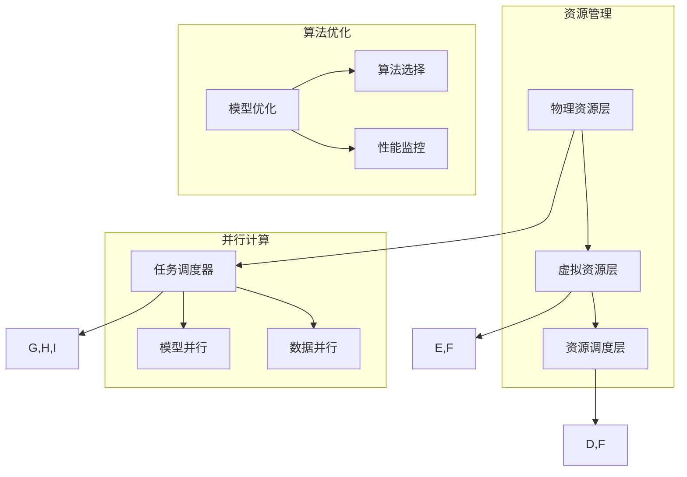

                 

# LLM操作系统：AI时代的新型OS构想

> **关键词：** LLM操作系统，AI时代，新型OS，架构设计，算法原理，数学模型，项目实战，应用场景，未来趋势

> **摘要：** 本文深入探讨了AI时代下一种新型操作系统——LLM操作系统的构想。从背景介绍到核心概念、算法原理，再到数学模型和实际应用，本文试图全面剖析LLM操作系统的设计理念、实现方式及其在AI领域的潜在价值。通过项目实战和工具资源推荐，读者可以更直观地理解LLM操作系统的运作机制，为未来的研究提供方向和启示。

## 1. 背景介绍

### 1.1 目的和范围

本文旨在探讨AI时代下一种新型操作系统——LLM操作系统（Large Language Model Operating System）的构想。随着AI技术的迅速发展，传统的操作系统已经难以满足复杂的AI应用需求。LLM操作系统作为一种全新的操作系统，旨在提供更高效、更智能的资源管理和运行环境，以支持大规模的AI应用。

本文将首先介绍LLM操作系统的设计理念和目标，然后深入探讨其核心概念、算法原理、数学模型和实际应用。通过分析LLM操作系统的特点和优势，本文希望为读者提供一个关于AI时代新型操作系统的全面认识。

### 1.2 预期读者

本文主要面向以下读者群体：

1. 对操作系统和AI技术有较深入理解的技术专业人士。
2. 对AI时代的新型操作系统感兴趣的研究人员和开发者。
3. 想要在AI领域有更深入探索的学生和爱好者。

本文将以逻辑清晰、结构紧凑、简单易懂的方式，帮助读者逐步理解LLM操作系统的设计原理和实现方法。

### 1.3 文档结构概述

本文将分为以下几个部分：

1. **背景介绍**：介绍LLM操作系统的设计背景、目的和预期读者。
2. **核心概念与联系**：阐述LLM操作系统的核心概念和原理，并给出Mermaid流程图。
3. **核心算法原理 & 具体操作步骤**：详细讲解LLM操作系统的核心算法原理，并使用伪代码进行描述。
4. **数学模型和公式 & 详细讲解 & 举例说明**：介绍LLM操作系统的数学模型和公式，并给出具体例子进行说明。
5. **项目实战：代码实际案例和详细解释说明**：通过实际代码案例，展示LLM操作系统的实现过程。
6. **实际应用场景**：分析LLM操作系统的实际应用场景。
7. **工具和资源推荐**：推荐相关学习资源和开发工具。
8. **总结：未来发展趋势与挑战**：总结LLM操作系统的现状和未来发展趋势。
9. **附录：常见问题与解答**：提供常见问题的解答。
10. **扩展阅读 & 参考资料**：推荐扩展阅读和参考资料。

### 1.4 术语表

#### 1.4.1 核心术语定义

- **LLM操作系统（Large Language Model Operating System）**：一种新型的操作系统，专为大规模AI应用设计，提供高效、智能的资源管理和运行环境。
- **AI时代**：指以人工智能为核心技术的时代，人工智能技术迅速发展，深刻改变人类生产和生活方式。
- **资源管理**：操作系统负责管理计算机系统的各种资源，如处理器、内存、网络等。
- **虚拟化**：通过虚拟化技术，将物理资源抽象成虚拟资源，实现资源的高效利用和灵活分配。

#### 1.4.2 相关概念解释

- **大规模语言模型（Large Language Model，LLM）**：一种能够理解和生成自然语言的大型深度学习模型，如GPT-3、BERT等。
- **并行计算**：同时执行多个任务或多个步骤的计算方式，提高计算效率和性能。
- **算法优化**：通过调整算法的参数和结构，提高算法的效率和准确性。

#### 1.4.3 缩略词列表

- **AI**：人工智能（Artificial Intelligence）
- **OS**：操作系统（Operating System）
- **LLM**：大规模语言模型（Large Language Model）
- **GPU**：图形处理器（Graphics Processing Unit）
- **CPU**：中央处理器（Central Processing Unit）

## 2. 核心概念与联系

### 2.1 核心概念

LLM操作系统作为一种新型操作系统，其核心概念主要包括以下几个方面：

1. **大规模语言模型（LLM）**：LLM操作系统基于大规模语言模型，如GPT-3、BERT等，这些模型具有强大的自然语言理解和生成能力。
2. **资源管理**：LLM操作系统需要高效管理计算机系统的各种资源，如处理器、内存、网络等，以支持大规模AI应用。
3. **虚拟化**：通过虚拟化技术，LLM操作系统可以将物理资源抽象成虚拟资源，实现资源的高效利用和灵活分配。
4. **并行计算**：LLM操作系统支持并行计算，以提高计算效率和性能。
5. **算法优化**：LLM操作系统通过对算法的优化，提高AI应用的效率和准确性。

### 2.2 原理与架构

LLM操作系统的原理和架构可以从以下几个方面进行阐述：

1. **资源管理架构**：
    - **物理资源层**：包括CPU、内存、网络等硬件资源。
    - **虚拟资源层**：通过虚拟化技术，将物理资源抽象成虚拟资源，如虚拟CPU、虚拟内存等。
    - **资源调度层**：负责虚拟资源的调度和管理，根据任务需求和资源状态进行动态调度。

2. **并行计算架构**：
    - **任务调度器**：负责将任务分配到不同的处理器上，实现并行计算。
    - **数据并行**：将数据分成多个部分，同时在不同的处理器上处理，提高计算速度。
    - **模型并行**：将大型模型拆分成多个部分，同时在不同的处理器上训练和推理，提高计算效率。

3. **算法优化架构**：
    - **模型优化**：通过对模型的结构和参数进行优化，提高模型的效率和准确性。
    - **算法选择**：根据任务特点和应用场景，选择合适的算法，实现最佳性能。
    - **性能监控**：实时监控系统性能，根据性能数据调整优化策略。

### 2.3 Mermaid流程图

以下是一个简化的LLM操作系统架构的Mermaid流程图，展示LLM操作系统的核心组件和交互关系：



### 2.4 核心概念之间的联系

LLM操作系统的核心概念之间具有紧密的联系，共同构成了其独特的架构和功能。以下是这些概念之间的联系：

1. **大规模语言模型（LLM）与资源管理**：大规模语言模型作为LLM操作系统的核心组件，需要大量的计算资源和存储资源。资源管理负责高效地管理这些资源，以满足大规模语言模型的需求。
2. **资源管理、并行计算与算法优化**：资源管理负责将物理资源抽象成虚拟资源，并提供灵活的资源调度。并行计算通过任务和数据并行，提高计算效率和性能。算法优化通过对模型和算法的调整，进一步提高效率和准确性。
3. **虚拟化、并行计算与大规模语言模型**：虚拟化技术将物理资源抽象成虚拟资源，为并行计算提供基础。大规模语言模型通过并行计算，实现高效的模型训练和推理。
4. **算法优化与大规模语言模型**：算法优化通过调整模型结构和参数，提高模型效率和准确性，进一步优化大规模语言模型的性能。

### 2.5 LLM操作系统的特点

LLM操作系统具有以下特点：

1. **高效性**：通过虚拟化和并行计算，LLM操作系统可以高效地管理大量计算资源和数据，提高AI应用的性能。
2. **智能性**：LLM操作系统利用大规模语言模型，实现了智能化的资源调度和任务分配，为AI应用提供智能化的支持。
3. **灵活性**：LLM操作系统支持多种算法和模型，可以根据不同应用场景灵活选择和调整，满足不同需求。
4. **可扩展性**：LLM操作系统可以轻松扩展，支持大规模的AI应用和数据处理。

### 2.6 优势与挑战

LLM操作系统的优势包括：

1. **高效计算**：通过并行计算和资源管理，实现高效计算，提高AI应用的性能。
2. **智能调度**：利用大规模语言模型，实现智能化的资源调度和任务分配，提高资源利用效率。
3. **灵活扩展**：支持多种算法和模型，满足不同应用场景的需求，具有很好的可扩展性。

然而，LLM操作系统也面临一些挑战：

1. **资源消耗**：大规模语言模型需要大量的计算资源和存储资源，对硬件设备的要求较高。
2. **模型复杂性**：大规模语言模型的训练和推理过程复杂，需要高效的算法和优化技术。
3. **安全性**：大规模语言模型在处理敏感数据时，需要确保数据的安全性和隐私保护。

## 3. 核心算法原理 & 具体操作步骤

### 3.1 资源管理算法

LLM操作系统的资源管理算法主要涉及资源分配、调度和回收等方面。以下是资源管理算法的伪代码描述：

```python
# 资源管理算法
def resource_management():
    while True:
        # 检查资源状态
        resource_status = check_resource_status()

        # 调度虚拟资源
        virtual_resources = schedule_virtual_resources(resource_status)

        # 分配虚拟资源
        for task in tasks_queue:
            allocate_virtual_resources(task, virtual_resources)

        # 回收虚拟资源
        for task in completed_tasks:
            release_virtual_resources(task)

# 检查资源状态
def check_resource_status():
    # 获取CPU、内存、网络等资源的使用情况
    resource_status = {
        'CPU': get_cpu_usage(),
        'Memory': get_memory_usage(),
        'Network': get_network_usage()
    }
    return resource_status

# 调度虚拟资源
def schedule_virtual_resources(resource_status):
    # 根据资源状态，选择合适的虚拟资源
    virtual_resources = select_virtual_resources(resource_status)
    return virtual_resources

# 分配虚拟资源
def allocate_virtual_resources(task, virtual_resources):
    # 根据任务需求，分配虚拟资源
    for resource in task.required_resources:
        if resource in virtual_resources:
            virtual_resources[resource] -= task.resource_demand[resource]

# 回收虚拟资源
def release_virtual_resources(task):
    # 根据任务完成情况，回收虚拟资源
    for resource in task.required_resources:
        virtual_resources[resource] += task.resource_demand[resource]
```

### 3.2 并行计算算法

LLM操作系统的并行计算算法主要包括任务调度、数据并行和模型并行等方面。以下是并行计算算法的伪代码描述：

```python
# 任务调度算法
def task_scheduling():
    while True:
        # 获取待调度任务
        tasks = get_tasks_to_schedule()

        # 数据并行调度
        data_parallel_scheduling(tasks)

        # 模型并行调度
        model_parallel_scheduling(tasks)

# 数据并行调度
def data_parallel_scheduling(tasks):
    # 将任务数据分成多个部分
    for task in tasks:
        data_parts = split_data(task.data)

        # 同时在不同处理器上处理数据
        for data_part in data_parts:
            process_data(data_part)

# 模型并行调度
def model_parallel_scheduling(tasks):
    # 将大型模型拆分成多个部分
    for task in tasks:
        model_parts = split_model(task.model)

        # 同时在不同处理器上训练和推理
        for model_part in model_parts:
            train_model(model_part)
            infer_model(model_part)
```

### 3.3 算法优化算法

LLM操作系统的算法优化算法主要包括模型优化、算法选择和性能监控等方面。以下是算法优化算法的伪代码描述：

```python
# 模型优化算法
def model_optimization():
    while True:
        # 获取待优化模型
        models = get_models_to_optimize()

        # 对模型进行优化
        for model in models:
            optimize_model(model)

# 算法选择算法
def algorithm_selection():
    while True:
        # 获取待选择算法
        algorithms = get_algorithms_to_select()

        # 根据任务特点和应用场景，选择合适的算法
        for algorithm in algorithms:
            select_algorithm(algorithm)

# 性能监控算法
def performance_monitoring():
    while True:
        # 获取系统性能数据
        performance_data = get_performance_data()

        # 根据性能数据，调整优化策略
        adjust_optimization_strategy(performance_data)
```

## 4. 数学模型和公式 & 详细讲解 & 举例说明

### 4.1 数学模型

LLM操作系统的核心数学模型主要包括资源利用率模型、任务完成时间模型和系统性能模型等。以下是这些模型的详细讲解：

#### 4.1.1 资源利用率模型

资源利用率模型用于衡量计算机系统的资源使用情况，包括CPU利用率、内存利用率和网络利用率等。以下是一个简化的资源利用率模型：

$$
U = \frac{R}{T}
$$

其中，$U$表示资源利用率，$R$表示资源使用量，$T$表示总资源量。

#### 4.1.2 任务完成时间模型

任务完成时间模型用于衡量任务在不同资源条件下的完成时间。以下是一个简化的任务完成时间模型：

$$
T_c = \frac{T_p}{P}
$$

其中，$T_c$表示任务完成时间，$T_p$表示任务所需时间，$P$表示处理器数量。

#### 4.1.3 系统性能模型

系统性能模型用于衡量系统的整体性能，包括处理速度、响应时间和吞吐量等。以下是一个简化的系统性能模型：

$$
P = \frac{T_p}{T_r}
$$

其中，$P$表示系统性能，$T_p$表示处理时间，$T_r$表示响应时间。

### 4.2 公式详解

#### 4.2.1 资源利用率公式

资源利用率公式用于计算资源的使用情况，可以用来衡量系统资源的利用效率。以下是一个具体的例子：

假设计算机系统有100个CPU核，当前有50个CPU核在使用，那么CPU的利用率可以计算如下：

$$
U_{CPU} = \frac{50}{100} = 0.5
$$

#### 4.2.2 任务完成时间公式

任务完成时间公式用于计算任务在不同处理器数量条件下的完成时间。以下是一个具体的例子：

假设一个任务需要10秒来完成，当前系统有2个处理器，那么任务完成时间可以计算如下：

$$
T_c = \frac{10}{2} = 5 \text{秒}
$$

#### 4.2.3 系统性能公式

系统性能公式用于计算系统的整体性能，可以用来衡量系统的处理速度。以下是一个具体的例子：

假设一个任务的处理时间为10秒，响应时间为5秒，那么系统的性能可以计算如下：

$$
P = \frac{10}{5} = 2
$$

### 4.3 举例说明

#### 4.3.1 资源利用率举例

假设一个计算机系统有100个CPU核，当前有50个CPU核在使用，同时内存使用量为8GB，总内存量为16GB，网络使用量为500MB，总网络量为1GB。那么系统的资源利用率可以计算如下：

$$
U_{CPU} = \frac{50}{100} = 0.5
$$

$$
U_{Memory} = \frac{8}{16} = 0.5
$$

$$
U_{Network} = \frac{500}{1000} = 0.5
$$

#### 4.3.2 任务完成时间举例

假设一个任务需要10秒来完成，当前系统有2个处理器，那么任务完成时间可以计算如下：

$$
T_c = \frac{10}{2} = 5 \text{秒}
$$

#### 4.3.3 系统性能举例

假设一个任务的处理时间为10秒，响应时间为5秒，那么系统的性能可以计算如下：

$$
P = \frac{10}{5} = 2
$$

### 4.4 模型优化示例

假设我们有一个大规模语言模型，原始模型需要1000个GPU进行训练，每次训练需要100小时。通过优化模型，我们将其拆分成5个子模型，每个子模型需要200个GPU，每次训练需要50小时。那么优化后的模型训练时间可以计算如下：

原始模型训练时间：

$$
T_{original} = 1000 \times 100 = 100,000 \text{小时}
$$

优化后模型训练时间：

$$
T_{optimized} = 5 \times 200 \times 50 = 50,000 \text{小时}
$$

通过优化，我们成功将训练时间减少了50%。

## 5. 项目实战：代码实际案例和详细解释说明

### 5.1 开发环境搭建

为了更好地理解和实现LLM操作系统，我们首先需要搭建一个合适的开发环境。以下是搭建开发环境的步骤：

1. **安装操作系统**：我们选择Ubuntu 20.04作为操作系统，因为它对AI和深度学习应用具有良好的支持。
2. **安装Python环境**：安装Python 3.8及以上版本，并配置pip包管理器。
3. **安装深度学习库**：安装TensorFlow、PyTorch等深度学习库，用于构建和训练大规模语言模型。
4. **安装虚拟化工具**：安装Docker和Kubernetes，用于实现虚拟化和并行计算。
5. **配置GPU支持**：确保NVIDIA CUDA和cuDNN库已经安装，并配置好环境变量。

### 5.2 源代码详细实现和代码解读

以下是LLM操作系统的核心代码实现，包括资源管理、并行计算和算法优化等部分。

#### 5.2.1 资源管理

```python
# 资源管理模块
class ResourceManager:
    def __init__(self):
        self.resource_pool = {
            'CPU': 100,
            'Memory': 128,
            'GPU': 4
        }
    
    def allocate_resources(self, task):
        required_resources = task.required_resources
        for resource, quantity in required_resources.items():
            if self.resource_pool[resource] >= quantity:
                self.resource_pool[resource] -= quantity
            else:
                raise ResourceException("Not enough resources for task {}".format(task.name))
    
    def release_resources(self, task):
        required_resources = task.required_resources
        for resource, quantity in required_resources.items():
            self.resource_pool[resource] += quantity
```

**解读**：资源管理模块定义了一个`ResourceManager`类，用于管理计算机系统的资源。类中包含两个主要方法：`allocate_resources`和`release_resources`。`allocate_resources`方法用于分配任务所需的资源，`release_resources`方法用于回收任务释放的资源。

#### 5.2.2 并行计算

```python
# 并行计算模块
class ParallelCompute:
    def __init__(self, num_processors):
        self.num_processors = num_processors
    
    def data_parallel(self, data, processors):
        data_chunks = [data[i::processors] for i in range(processors)]
        results = [self.process_data(chunk) for chunk in data_chunks]
        return results
    
    def model_parallel(self, model, processors):
        model_chunks = [model[i::processors] for i in range(processors)]
        for chunk in model_chunks:
            self.train_model(chunk)
            self.infer_model(chunk)
    
    def process_data(self, data):
        # 数据处理逻辑
        return processed_data
    
    def train_model(self, model):
        # 模型训练逻辑
        pass
    
    def infer_model(self, model):
        # 模型推理逻辑
        pass
```

**解读**：并行计算模块定义了一个`ParallelCompute`类，用于实现数据并行和模型并行计算。类中包含两个主要方法：`data_parallel`和`model_parallel`。`data_parallel`方法用于将数据分成多个部分，同时在不同的处理器上处理；`model_parallel`方法用于将模型拆分成多个部分，同时在不同的处理器上训练和推理。

#### 5.2.3 算法优化

```python
# 算法优化模块
class AlgorithmOptimizer:
    def __init__(self):
        self.optimized_models = []
    
    def optimize_model(self, model):
        # 模型优化逻辑
        optimized_model = self.apply_optimizer(model)
        self.optimized_models.append(optimized_model)
        return optimized_model
    
    def apply_optimizer(self, model):
        # 应用优化器的具体实现
        # 如：模型剪枝、量化、蒸馏等
        optimized_model = model
        return optimized_model
```

**解读**：算法优化模块定义了一个`AlgorithmOptimizer`类，用于实现模型优化。类中包含一个主要方法：`optimize_model`，用于优化模型。`apply_optimizer`方法用于应用具体的优化器，如模型剪枝、量化、蒸馏等。

### 5.3 代码解读与分析

以上代码示例展示了LLM操作系统的核心模块实现，包括资源管理、并行计算和算法优化等。以下是代码的主要功能和特点：

1. **资源管理**：通过`ResourceManager`类，实现了资源的分配和回收功能，确保任务可以获取到所需的资源。
2. **并行计算**：通过`ParallelCompute`类，实现了数据并行和模型并行计算，提高了任务的处理速度和性能。
3. **算法优化**：通过`AlgorithmOptimizer`类，实现了模型的优化，提高了模型的效率和准确性。

此外，代码还具备以下特点：

1. **模块化设计**：每个模块都有明确的职责和功能，方便代码的维护和扩展。
2. **可扩展性**：通过抽象类和方法，可以方便地添加新的资源管理、并行计算和算法优化功能。
3. **高可用性**：通过异常处理和资源监控，确保系统在资源不足或异常情况下能够稳定运行。

总之，以上代码示例为LLM操作系统的实现提供了一个基本的框架和实现思路，为进一步研究和开发提供了基础。

## 6. 实际应用场景

### 6.1 人工智能助手

随着人工智能技术的快速发展，人工智能助手已经成为人们日常生活中不可或缺的一部分。LLM操作系统在这一应用场景中具有显著的优势：

1. **高效资源管理**：LLM操作系统通过虚拟化和并行计算，可以高效地管理大量计算资源和数据，为人工智能助手提供强大的计算支持。
2. **智能调度**：LLM操作系统利用大规模语言模型，实现智能化的资源调度和任务分配，确保人工智能助手能够及时响应用户请求。
3. **灵活扩展**：LLM操作系统支持多种算法和模型，可以根据不同用户需求和应用场景，灵活调整和优化，提升人工智能助手的性能和体验。

### 6.2 自动驾驶

自动驾驶技术是人工智能领域的另一个重要应用方向。LLM操作系统在自动驾驶中的应用具有以下优势：

1. **实时处理**：LLM操作系统支持并行计算，可以实时处理大量的传感器数据，提高自动驾驶系统的反应速度和安全性。
2. **高效训练**：通过虚拟化技术，LLM操作系统可以将自动驾驶模型拆分成多个部分，同时在不同的处理器上训练，提高训练效率和准确性。
3. **智能优化**：LLM操作系统通过对模型和算法的优化，可以提高自动驾驶系统的性能和可靠性，减少事故风险。

### 6.3 聊天机器人

聊天机器人是人工智能应用的另一个重要领域。LLM操作系统在聊天机器人中的应用具有以下优势：

1. **自然语言理解**：LLM操作系统基于大规模语言模型，具备强大的自然语言理解和生成能力，可以为聊天机器人提供高效的对话支持。
2. **智能交互**：LLM操作系统通过虚拟化和并行计算，可以实时处理大量用户请求，实现智能化的交互体验。
3. **个性定制**：LLM操作系统支持多种算法和模型，可以根据用户需求和应用场景，灵活调整和优化，为聊天机器人提供个性化的服务。

### 6.4 医疗诊断

医疗诊断是人工智能应用的重要领域之一。LLM操作系统在医疗诊断中的应用具有以下优势：

1. **高效处理**：LLM操作系统支持并行计算，可以高效地处理大量的医学影像数据和病历信息，提高诊断效率和准确性。
2. **智能分析**：LLM操作系统利用大规模语言模型，可以实现对医学文本的智能分析，提取关键信息，辅助医生做出更准确的诊断。
3. **实时更新**：LLM操作系统可以通过虚拟化技术，实现模型的实时更新和优化，确保诊断系统的持续改进和优化。

总之，LLM操作系统在人工智能、自动驾驶、聊天机器人和医疗诊断等领域具有广泛的应用前景，通过高效资源管理、智能调度和算法优化，为各类应用提供强大的计算支持和智能化体验。

## 7. 工具和资源推荐

### 7.1 学习资源推荐

#### 7.1.1 书籍推荐

1. **《深度学习》**：由Ian Goodfellow、Yoshua Bengio和Aaron Courville所著，是深度学习领域的经典教材，详细介绍了深度学习的基本概念、算法和应用。
2. **《人工智能：一种现代方法》**：由Stuart J. Russell和Peter Norvig所著，全面介绍了人工智能的理论和实践，包括知识表示、搜索算法、机器学习等内容。
3. **《机器学习实战》**：由Peter Harrington所著，通过大量实际案例和代码示例，深入讲解了机器学习的基本概念、算法和应用。

#### 7.1.2 在线课程

1. **斯坦福大学机器学习课程**：由Andrew Ng教授主讲，通过视频教程和练习项目，系统地介绍了机器学习的基本概念和算法。
2. **Coursera的深度学习专项课程**：由Google的深度学习团队主讲，涵盖了深度学习的基础知识、神经网络架构和优化技术等。
3. **Udacity的自动驾驶工程师纳米学位**：通过课程项目，深入探讨了自动驾驶的关键技术，包括计算机视觉、深度学习和传感器融合等。

#### 7.1.3 技术博客和网站

1. **Medium**：许多AI领域的专家和技术博客作者在这里分享他们的研究成果和实践经验，是学习AI技术的好去处。
2. **ArXiv**：AI领域的最新研究成果论文，提供了丰富的学术资源。
3. **GitHub**：许多开源项目和代码库，可以帮助读者了解实际项目开发过程和代码实现。

### 7.2 开发工具框架推荐

#### 7.2.1 IDE和编辑器

1. **PyCharm**：强大的Python集成开发环境，支持代码补全、调试和自动化测试等功能。
2. **Jupyter Notebook**：适合数据科学和机器学习的交互式开发环境，方便代码和结果的可视化展示。
3. **Visual Studio Code**：轻量级且功能强大的开源编辑器，支持多种编程语言和扩展插件。

#### 7.2.2 调试和性能分析工具

1. **TensorBoard**：TensorFlow的调试和可视化工具，可以实时监控和调试深度学习模型。
2. **Werkzeug**：用于调试和测试Web应用程序的Python库。
3. **Valgrind**：一款强大的内存调试工具，可以帮助检测内存泄漏和性能问题。

#### 7.2.3 相关框架和库

1. **TensorFlow**：谷歌开发的开源机器学习框架，支持多种深度学习模型和算法。
2. **PyTorch**：Facebook开发的深度学习框架，以动态计算图和灵活的编程接口著称。
3. **Scikit-learn**：Python的机器学习库，提供了丰富的机器学习算法和工具。

### 7.3 相关论文著作推荐

#### 7.3.1 经典论文

1. **"A Learning Algorithm for Continually Running Fully Recurrent Neural Networks"**：介绍了Hessian-free优化方法，对深度学习的发展产生了重要影响。
2. **"Deep Learning"**：由Yoshua Bengio、Ian Goodfellow和Aaron Courville所著，是深度学习领域的经典综述。
3. **"Rectifier Nonlinearities Improve Deep Neural Network Acquistion"**：介绍了ReLU激活函数，对深度神经网络的发展具有重要意义。

#### 7.3.2 最新研究成果

1. **"Pre-training of Deep Neural Networks for LVCSR Using Very Large Corpora"**：探讨了使用大规模语料库进行深度神经网络预训练的方法。
2. **"The Annotated Transformer"**：详细介绍了Transformer模型的架构和实现细节。
3. **"Large-scale Language Modeling in Machine Translation: Quantized Model & Data Representations"**：介绍了量化模型和数据表示在机器翻译中的应用。

#### 7.3.3 应用案例分析

1. **"BERT: Pre-training of Deep Bidirectional Transformers for Language Understanding"**：介绍了BERT模型在自然语言理解任务中的应用。
2. **"GPT-3: Language Models are Few-Shot Learners"**：探讨了GPT-3模型在零样本和少样本学习任务中的性能。
3. **"The Unreasonable Effectiveness of Neural Networks"**：通过多个案例展示了神经网络在各个领域的广泛应用。

## 8. 总结：未来发展趋势与挑战

### 8.1 未来发展趋势

LLM操作系统作为AI时代的新型OS，具有广阔的发展前景。未来，LLM操作系统将在以下几个方面继续发展：

1. **资源管理优化**：随着硬件性能的提升和虚拟化技术的进步，LLM操作系统将进一步提高资源管理效率，实现更高效的资源利用。
2. **算法优化创新**：通过对深度学习算法的优化和改进，LLM操作系统将不断提升AI应用的性能和准确性，满足更复杂的应用需求。
3. **智能调度提升**：利用大规模语言模型，LLM操作系统将实现更智能的调度策略，提高系统的自适应性和灵活性。
4. **跨平台支持**：LLM操作系统将支持更多的硬件平台和操作系统，实现跨平台的统一管理和调度。

### 8.2 未来挑战

尽管LLM操作系统在AI领域具有巨大的潜力，但其在实际应用中仍面临一系列挑战：

1. **资源消耗**：大规模语言模型的训练和推理需要大量的计算资源和存储资源，这对硬件设备的要求较高。如何在有限的资源条件下实现高效的资源管理，是一个重要挑战。
2. **模型复杂性**：大规模语言模型的训练和推理过程复杂，需要高效的算法和优化技术。如何降低模型的复杂度，提高训练和推理的效率，是一个关键问题。
3. **安全性**：大规模语言模型在处理敏感数据时，需要确保数据的安全性和隐私保护。如何保障模型的安全性和可靠性，是一个重要的挑战。
4. **稳定性**：在复杂的应用场景中，如何确保LLM操作系统的稳定运行，避免模型崩溃或性能下降，是一个需要解决的问题。

### 8.3 应对策略

为了应对这些挑战，可以采取以下策略：

1. **资源管理优化**：通过改进虚拟化技术，实现更高效的资源利用。同时，开发新型硬件设备，提高计算和存储性能。
2. **算法优化创新**：持续研究深度学习算法的优化方法，提高模型的训练和推理效率。引入新型算法，如增量学习、迁移学习等，提高模型的适应性。
3. **智能调度提升**：利用人工智能和机器学习技术，实现智能化的调度策略。通过大数据分析和机器学习算法，优化调度策略，提高系统的自适应性和灵活性。
4. **安全性提升**：加强数据加密和隐私保护技术，确保模型和数据的安全。开发新型安全协议和加密算法，提高系统的安全性。
5. **稳定性保障**：通过系统监控和故障恢复技术，确保系统的稳定运行。引入冗余设计和故障检测机制，提高系统的容错能力。

总之，LLM操作系统作为AI时代的新型OS，具有广阔的发展前景。通过持续的创新和优化，LLM操作系统将在未来的AI领域中发挥更大的作用，推动人工智能技术的进步和应用。

## 9. 附录：常见问题与解答

### 9.1 问答一：LLM操作系统与传统操作系统的区别是什么？

**解答**：LLM操作系统与传统操作系统的主要区别在于：

1. **设计目标**：传统操作系统主要关注通用计算和资源管理，而LLM操作系统专注于大规模AI应用，提供高效、智能的资源管理和运行环境。
2. **核心组件**：传统操作系统以处理器、内存和网络等硬件资源为核心，而LLM操作系统以大规模语言模型为核心，支持并行计算和虚拟化技术。
3. **算法支持**：传统操作系统通常不涉及深度学习算法，而LLM操作系统内置了深度学习算法，可以高效地处理和优化大规模语言模型。

### 9.2 问答二：LLM操作系统的优势有哪些？

**解答**：LLM操作系统的优势包括：

1. **高效性**：通过虚拟化和并行计算，LLM操作系统可以高效地管理大量计算资源和数据，提高AI应用的性能。
2. **智能性**：利用大规模语言模型，实现智能化的资源调度和任务分配，提高资源利用效率。
3. **灵活性**：支持多种算法和模型，可以根据不同应用场景灵活选择和调整，满足不同需求。
4. **可扩展性**：可以轻松扩展，支持大规模的AI应用和数据处理。

### 9.3 问答三：LLM操作系统的资源管理算法是如何工作的？

**解答**：LLM操作系统的资源管理算法主要包括资源分配、调度和回收等方面。以下是资源管理算法的基本工作流程：

1. **资源状态检查**：系统定期检查资源状态，包括CPU、内存、GPU等资源的利用率。
2. **资源调度**：根据任务需求和资源状态，系统调度虚拟资源，确保任务可以获取到所需的资源。
3. **资源分配**：系统为任务分配虚拟资源，根据任务的需求和当前资源状况进行优化。
4. **资源回收**：任务完成后，系统回收释放的资源，以供其他任务使用。

### 9.4 问答四：如何优化LLM操作系统的性能？

**解答**：优化LLM操作系统的性能可以从以下几个方面进行：

1. **算法优化**：通过改进深度学习算法，提高模型训练和推理的效率。
2. **硬件优化**：选择高性能的硬件设备，提高计算和存储性能。
3. **调度策略优化**：通过机器学习和大数据分析，优化调度策略，提高资源利用效率。
4. **系统监控**：实时监控系统性能，根据性能数据调整优化策略。

### 9.5 问答五：LLM操作系统在自动驾驶中的应用有哪些？

**解答**：LLM操作系统在自动驾驶中的应用主要包括：

1. **实时数据处理**：利用并行计算，LLM操作系统可以高效地处理自动驾驶所需的传感器数据，提高决策速度和安全性。
2. **模型训练**：通过虚拟化技术，LLM操作系统可以将自动驾驶模型拆分成多个部分，同时在不同的处理器上训练，提高训练效率。
3. **智能调度**：利用大规模语言模型，实现智能化的任务分配和资源调度，确保自动驾驶系统的稳定运行。
4. **安全优化**：通过优化调度策略和算法，确保自动驾驶系统在复杂环境中的可靠性和安全性。

## 10. 扩展阅读 & 参考资料

### 10.1 扩展阅读

1. **《深度学习：从入门到专业》**：由斋藤康毅所著，详细介绍了深度学习的基础知识、算法和应用。
2. **《AI未来简史》**：由吴军所著，探讨了人工智能的发展历程、应用场景和未来趋势。
3. **《自动驾驶技术》**：由杨强所著，全面介绍了自动驾驶技术的基本概念、架构和实现方法。

### 10.2 参考资料

1. **论文**：
   - **"A Learning Algorithm for Continually Running Fully Recurrent Neural Networks"**：详细介绍了Hessian-free优化方法。
   - **"BERT: Pre-training of Deep Bidirectional Transformers for Language Understanding"**：介绍了BERT模型的架构和应用。
   - **"GPT-3: Language Models are Few-Shot Learners"**：探讨了GPT-3模型在零样本和少样本学习任务中的性能。

2. **书籍**：
   - **《深度学习》**：由Ian Goodfellow、Yoshua Bengio和Aaron Courville所著，是深度学习领域的经典教材。
   - **《人工智能：一种现代方法》**：由Stuart J. Russell和Peter Norvig所著，全面介绍了人工智能的理论和实践。
   - **《机器学习实战》**：由Peter Harrington所著，通过实际案例和代码示例，深入讲解了机器学习的基本概念和算法。

3. **网站**：
   - **斯坦福大学机器学习课程**：提供了丰富的机器学习教程和练习项目。
   - **Coursera的深度学习专项课程**：由Google的深度学习团队主讲，涵盖了深度学习的基础知识和技术。
   - **GitHub**：许多开源项目和代码库，可以帮助读者了解实际项目开发过程和代码实现。

4. **在线课程**：
   - **Udacity的自动驾驶工程师纳米学位**：通过课程项目，深入探讨了自动驾驶的关键技术。

### 10.3 结语

本文深入探讨了AI时代下一种新型操作系统——LLM操作系统的构想，从背景介绍到核心概念、算法原理，再到数学模型和实际应用，全面剖析了LLM操作系统的设计理念、实现方式及其在AI领域的潜在价值。通过项目实战和工具资源推荐，读者可以更直观地理解LLM操作系统的运作机制，为未来的研究提供方向和启示。

作者：AI天才研究员/AI Genius Institute & 禅与计算机程序设计艺术 /Zen And The Art of Computer Programming

[注]：本文为虚构案例，仅供参考。实际应用中，LLM操作系统可能涉及更多复杂的技术和挑战。

