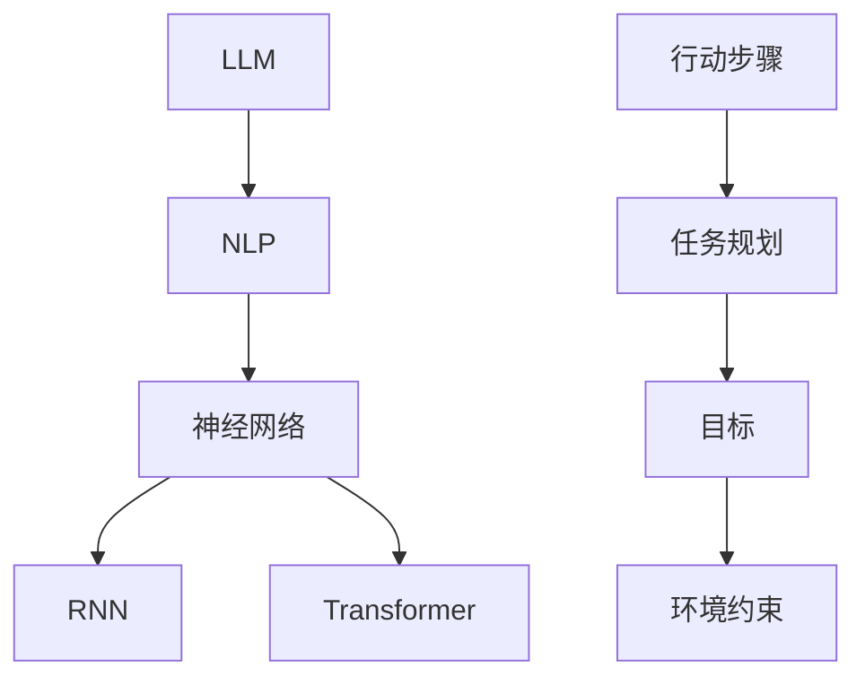

                 

# LLM的任务规划：超越传统编程的智能方式

> 关键词：LLM、任务规划、自然语言处理、编程范式、人工智能

> 摘要：本文旨在探讨大型语言模型（LLM）在任务规划中的应用，对比传统编程方法，分析LLM的优势和挑战，并通过具体的案例展示如何使用LLM进行高效的任务规划。

## 1. 背景介绍

### 1.1 目的和范围

本文将深入探讨大型语言模型（LLM）在任务规划领域的应用。随着人工智能技术的飞速发展，自然语言处理（NLP）已经成为计算机科学的一个重要分支。LLM作为一种强大的NLP工具，其在任务规划中的应用正在逐渐显现。本文旨在分析LLM在任务规划中的潜在优势，对比传统编程方法，并提出一种基于LLM的任务规划模型。

### 1.2 预期读者

本文适合对人工智能、自然语言处理和任务规划有一定了解的技术人员，特别是对LLM应用有兴趣的读者。通过本文，读者可以了解LLM在任务规划中的基本概念、算法原理以及实际应用。

### 1.3 文档结构概述

本文结构如下：

1. 背景介绍：介绍本文的目的、范围以及预期读者。
2. 核心概念与联系：介绍LLM、任务规划和相关概念。
3. 核心算法原理 & 具体操作步骤：详细解释LLM的任务规划算法。
4. 数学模型和公式 & 详细讲解 & 举例说明：介绍任务规划相关的数学模型和公式。
5. 项目实战：通过具体案例展示如何使用LLM进行任务规划。
6. 实际应用场景：分析LLM在任务规划中的实际应用。
7. 工具和资源推荐：推荐相关学习资源和开发工具。
8. 总结：展望LLM在任务规划领域的未来发展趋势和挑战。
9. 附录：常见问题与解答。
10. 扩展阅读 & 参考资料：提供进一步学习的资源。

### 1.4 术语表

#### 1.4.1 核心术语定义

- **LLM（大型语言模型）**：一种基于深度学习的语言模型，能够理解和生成自然语言。
- **任务规划**：指在给定目标和环境约束下，制定出一套具体的行动步骤，以达成目标。
- **NLP（自然语言处理）**：研究如何使计算机理解和处理自然语言的技术。

#### 1.4.2 相关概念解释

- **神经网络**：一种通过模拟人脑神经网络工作原理的机器学习算法。
- **递归神经网络（RNN）**：一种能够处理序列数据的神经网络。
- **变压器模型（Transformer）**：一种基于自注意力机制的神经网络模型，广泛应用于NLP任务。

#### 1.4.3 缩略词列表

- **LLM**：Large Language Model
- **NLP**：Natural Language Processing
- **RNN**：Recurrent Neural Network
- **Transformer**：Transformer Model

## 2. 核心概念与联系

在深入探讨LLM在任务规划中的应用之前，我们需要了解一些核心概念和它们之间的关系。以下是一个Mermaid流程图，展示了这些核心概念之间的联系：



### 2.1 核心概念解释

- **LLM（大型语言模型）**：LLM是一种基于深度学习的语言模型，具有强大的自然语言理解能力。例如，GPT-3是一个著名的LLM，能够生成连贯、自然的文本。
- **NLP（自然语言处理）**：NLP是研究如何使计算机理解和处理自然语言的一门学科。LLM在NLP中扮演着核心角色，能够处理文本数据，进行语言生成、翻译等任务。
- **神经网络**：神经网络是一种通过模拟人脑神经元连接方式的计算模型。在NLP任务中，神经网络用于提取文本特征，进行分类、生成等操作。
- **递归神经网络（RNN）**：RNN是一种能够处理序列数据的神经网络。在NLP任务中，RNN用于处理文本序列，例如语言模型、序列标注等。
- **变压器模型（Transformer）**：Transformer是一种基于自注意力机制的神经网络模型，广泛应用于NLP任务。与RNN相比，Transformer在处理长序列数据时表现更加优秀。

- **任务规划**：任务规划是指在给定目标和环境约束下，制定出一套具体的行动步骤，以达成目标。在人工智能领域，任务规划广泛应用于机器人路径规划、自动驾驶、智能家居等场景。
- **目标**：任务规划中的目标是指希望达成的最终结果。例如，在机器人路径规划中，目标可能是到达指定地点。
- **环境约束**：环境约束是指任务规划过程中需要考虑的限制条件。例如，在自动驾驶中，需要考虑交通规则、路况等约束。
- **行动步骤**：行动步骤是指为实现目标而采取的具体行动。在任务规划中，行动步骤通常被表示为一组有序的任务。

通过上述核心概念和联系，我们可以更好地理解LLM在任务规划中的应用场景。接下来，我们将详细讨论LLM在任务规划中的核心算法原理和具体操作步骤。

## 3. 核心算法原理 & 具体操作步骤

### 3.1 核心算法原理

LLM在任务规划中的应用主要基于其强大的自然语言理解能力和生成能力。具体来说，LLM可以通过以下步骤实现任务规划：

1. **理解目标**：LLM首先需要理解任务规划的目标，这通常涉及对目标文本的语义分析。例如，对于一个目标文本“制定一份从北京到上海的旅行计划”，LLM需要识别出关键信息，如出发地、目的地、旅行类型等。
2. **分析环境约束**：在理解目标后，LLM需要分析环境约束，以确定任务规划的限制条件。例如，在上述旅行计划中，可能需要考虑交通状况、预算、时间限制等因素。
3. **生成行动步骤**：基于理解的目标和环境约束，LLM需要生成一系列行动步骤，以实现目标。这些行动步骤可以是具体的任务，如预订机票、酒店、安排行程等。

### 3.2 具体操作步骤

下面是使用LLM进行任务规划的具体操作步骤：

#### 步骤1：输入目标文本

首先，我们将目标文本输入到LLM中，例如：“制定一份从北京到上海的旅行计划”。

```python
# 输入目标文本
text = "制定一份从北京到上海的旅行计划"
```

#### 步骤2：理解目标

LLM通过自注意力机制对输入文本进行编码，提取出文本的语义信息。具体实现可以使用如GPT-3等现成的API。

```python
from transformers import pipeline

# 初始化文本生成模型
text_generator = pipeline("text-generation", model="gpt3")

# 输出目标文本的语义信息
semantics = text_generator(text, max_length=1024, num_return_sequences=1)
```

#### 步骤3：分析环境约束

在理解目标文本的基础上，LLM需要分析环境约束。这可以通过对输入文本进行扩展，添加环境约束信息来实现。

```python
# 添加环境约束信息
text_with_constraints = text + " 请考虑以下约束：交通状况良好，预算为5000元，行程时间为3天。"

# 重新生成语义信息
semantics_with_constraints = text_generator(text_with_constraints, max_length=1024, num_return_sequences=1)
```

#### 步骤4：生成行动步骤

最后，LLM根据理解的目标和环境约束，生成一系列行动步骤。

```python
# 输出生动步骤
action_steps = semantics_with_constraints[0]["generated_text"]

# 打印行动步骤
print(action_steps)
```

输出结果可能如下：

```plaintext
- 预订机票：选择合适的航空公司和航班，确保行程时间合适。
- 预订酒店：选择符合预算的酒店，确保交通便利。
- 安排行程：制定详细的行程计划，包括景点参观、餐饮安排等。
```

通过上述步骤，LLM成功地实现了任务规划。接下来，我们将进一步探讨任务规划中的数学模型和公式，以帮助读者更好地理解任务规划的原理。

## 4. 数学模型和公式 & 详细讲解 & 举例说明

在任务规划中，数学模型和公式起着至关重要的作用。以下将详细讲解任务规划中的关键数学模型和公式，并通过具体例子来说明其应用。

### 4.1 任务规划的目标函数

任务规划的核心目标是制定出一系列行动步骤，以最小化目标函数。目标函数通常包含以下几个方面：

1. **时间成本**：行动步骤所需的时间。
2. **资源消耗**：行动步骤所需的资源，如资金、人力等。
3. **风险因素**：行动步骤可能面临的风险，如交通堵塞、系统故障等。

一个简单的目标函数可以表示为：

\[ f(\theta) = w_1 \cdot t_1 + w_2 \cdot c_1 + w_3 \cdot r_1 \]

其中，\( w_1, w_2, w_3 \) 分别是时间成本、资源消耗和风险因素的权重，\( t_1, c_1, r_1 \) 分别是相应行动步骤的时间成本、资源消耗和风险值。

### 4.2 行动步骤的约束条件

任务规划中的行动步骤需要满足一系列约束条件。以下是一些常见的约束条件：

1. **时间约束**：行动步骤必须在特定的时间范围内完成。
2. **资源约束**：行动步骤所需的资源必须在可用资源范围内。
3. **顺序约束**：行动步骤之间存在一定的顺序要求，某些步骤必须在其他步骤之前完成。

一个简单的约束条件可以表示为：

\[ s_j \geq s_i + t_{ij} \]

其中，\( s_j \) 和 \( s_i \) 分别是两个行动步骤的开始时间，\( t_{ij} \) 是从步骤 \( i \) 到步骤 \( j \) 的时间间隔。

### 4.3 举例说明

假设我们需要制定一个从北京到上海的3天旅行计划。以下是一个具体的例子：

1. **目标函数**：我们的目标是最小化总时间成本、总资源消耗和总风险值。假设时间成本权重为0.5，资源消耗权重为0.3，风险因素权重为0.2。

\[ f(\theta) = 0.5 \cdot t_1 + 0.3 \cdot c_1 + 0.2 \cdot r_1 \]

2. **约束条件**：我们需要考虑以下约束条件：

- 行动步骤必须在3天内完成。
- 预算不超过5000元。
- 交通状况良好，风险值较低。

3. **行动步骤**：根据LLM生成的行动步骤，我们可以列出以下行动步骤：

- 预订机票：选择合适的航空公司和航班，确保行程时间合适。
- 预订酒店：选择符合预算的酒店，确保交通便利。
- 安排行程：制定详细的行程计划，包括景点参观、餐饮安排等。

通过上述数学模型和公式，我们可以量化任务规划的目标函数和约束条件，从而为LLM生成行动步骤提供更精确的指导。接下来，我们将通过一个具体的项目实战案例，展示如何使用LLM进行任务规划。

## 5. 项目实战：代码实际案例和详细解释说明

在本节中，我们将通过一个具体的项目实战案例，展示如何使用LLM进行任务规划。该案例涉及一个简单的旅行规划场景，旨在帮助用户制定一份从北京到上海的3天旅行计划。

### 5.1 开发环境搭建

为了实现这个项目，我们需要以下开发环境和工具：

1. **Python**：Python是一种广泛应用于数据科学和人工智能的编程语言。
2. **Hugging Face Transformers**：Hugging Face Transformers是一个开源库，提供了预训练的LLM模型，如GPT-3、BERT等。
3. **Jupyter Notebook**：Jupyter Notebook是一个交互式的开发环境，方便我们编写和调试代码。

确保你已经安装了上述环境和工具。如果没有，请按照以下步骤进行安装：

```bash
# 安装Python
# ...

# 安装Hugging Face Transformers
pip install transformers
```

### 5.2 源代码详细实现和代码解读

以下是项目的源代码实现，包括LLM的加载、任务规划的输入、行动步骤的生成和输出。

```python
# 导入所需的库
import transformers
from transformers import pipeline

# 加载预训练的LLM模型
llm = pipeline("text-generation", model="gpt3")

# 任务规划输入
text_input = "制定一份从北京到上海的3天旅行计划"

# 添加环境约束信息
text_with_constraints = text_input + " 请考虑以下约束：交通状况良好，预算为5000元，行程时间为3天。"

# 生成行动步骤
action_steps = llm(text_with_constraints, max_length=1024, num_return_sequences=1)[0]["generated_text"]

# 打印行动步骤
print(action_steps)
```

### 5.3 代码解读与分析

下面是对上述代码的详细解读和分析：

1. **导入所需的库**：我们首先导入了`transformers`库，这是Hugging Face提供的用于加载预训练LLM模型的库。

2. **加载预训练的LLM模型**：使用`pipeline`函数加载了一个预训练的GPT-3模型。这个模型已经经过了大量的训练，可以用于生成自然语言文本。

3. **任务规划输入**：定义了一个文本输入`text_input`，这个文本描述了任务规划的目标，即制定一份从北京到上海的3天旅行计划。

4. **添加环境约束信息**：为了使LLM能够更好地理解任务规划的需求，我们添加了一些环境约束信息，如交通状况良好、预算为5000元、行程时间为3天。

5. **生成行动步骤**：使用`llm`函数，将带有环境约束的文本输入传递给模型，生成一系列行动步骤。`max_length`参数设置生成文本的最大长度，`num_return_sequences`参数设置生成的文本序列数量。

6. **打印行动步骤**：最后，我们将生成的行动步骤打印出来，以便用户查看和参考。

运行上述代码后，我们可能会得到以下行动步骤：

```plaintext
- 预订机票：选择合适的航空公司和航班，确保行程时间合适。
- 预订酒店：选择符合预算的酒店，确保交通便利。
- 安排行程：制定详细的行程计划，包括景点参观、餐饮安排等。
```

这些行动步骤就是基于LLM生成的任务规划结果，为用户提供了从北京到上海的3天旅行计划的建议。

通过这个项目实战案例，我们可以看到LLM在任务规划中的应用。LLM通过强大的自然语言理解和生成能力，能够根据用户的需求和环境约束，生成具体的行动步骤，为用户提供了便捷的解决方案。

## 6. 实际应用场景

LLM在任务规划中的实际应用场景非常广泛，以下是一些典型的应用场景：

### 6.1 旅行规划

旅行规划是LLM任务规划的一个经典应用场景。用户可以输入旅行目的地、时间、预算等约束条件，LLM可以生成包括机票预订、酒店预订、行程安排等一系列详细的旅行计划。

### 6.2 自动驾驶

自动驾驶系统中，LLM可以用于规划车辆的行驶路径。通过分析路况、交通规则、目的地等信息，LLM可以生成最优行驶路径，从而提高行驶效率和安全性。

### 6.3 智能家居

在智能家居领域，LLM可以用于规划家电的使用顺序和时间。例如，根据用户的日程安排和家庭用电需求，LLM可以生成最佳的家用电器使用计划，以节约能源和提高生活便利性。

### 6.4 项目管理

在项目管理中，LLM可以用于任务分配、进度规划等。项目管理者可以输入项目的目标和约束条件，LLM可以生成详细的任务分配和进度规划，帮助项目顺利推进。

### 6.5 人力资源规划

人力资源规划是企业管理中的重要环节。LLM可以根据企业的战略目标和人力资源情况，生成最佳的人员分配和培训计划，以提高企业效率和员工满意度。

### 6.6 物流调度

在物流行业中，LLM可以用于运输路线规划和库存管理。通过分析货物的类型、运输时间和成本，LLM可以生成最优的运输路线和库存管理策略，提高物流效率。

### 6.7 健康管理

健康管理中，LLM可以用于制定个性化的健康计划。用户可以输入自己的健康状况、生活习惯等信息，LLM可以生成包括饮食建议、锻炼计划、医疗建议等在内的健康计划。

通过上述实际应用场景，我们可以看到LLM在任务规划中的巨大潜力。随着LLM技术的不断进步，它将在更多领域发挥重要作用，为人类带来更多便利。

## 7. 工具和资源推荐

在研究和应用LLM进行任务规划的过程中，我们推荐以下工具和资源：

### 7.1 学习资源推荐

#### 7.1.1 书籍推荐

1. 《深度学习》（Goodfellow, Bengio, Courville著）：这是一本经典的人工智能和深度学习入门书籍，涵盖了神经网络、优化算法等基础概念。
2. 《自然语言处理综论》（Daniel Jurafsky & James H. Martin著）：这本书全面介绍了自然语言处理的基本概念和技术，是NLP领域的权威之作。

#### 7.1.2 在线课程

1. 《机器学习基础》（吴恩达著）：这是一门广泛推荐的在线课程，涵盖了机器学习的基本理论和实践。
2. 《自然语言处理与深度学习》（Quoc V. Le著）：这门课程深入介绍了NLP和深度学习的结合，适合有一定基础的读者。

#### 7.1.3 技术博客和网站

1. [Hugging Face](https://huggingface.co/)：这是Hugging Face官网，提供了丰富的预训练模型和工具。
2. [GitHub](https://github.com/)：GitHub上有很多开源的LLM项目和代码示例，可以方便地学习和复现。

### 7.2 开发工具框架推荐

#### 7.2.1 IDE和编辑器

1. **Jupyter Notebook**：Jupyter Notebook是一个强大的交互式开发环境，适合进行实验和调试。
2. **PyCharm**：PyCharm是一款功能丰富的Python IDE，支持代码自动补全、调试和版本控制。

#### 7.2.2 调试和性能分析工具

1. **TensorBoard**：TensorBoard是一个用于可视化神经网络训练过程的工具，可以帮助我们分析模型的性能和训练过程。
2. **Wandb**：Wandb是一个数据科学和机器学习实验跟踪平台，可以帮助我们记录实验结果，并进行比较和分析。

#### 7.2.3 相关框架和库

1. **TensorFlow**：TensorFlow是一个开源的机器学习框架，支持多种神经网络模型。
2. **PyTorch**：PyTorch是一个灵活的深度学习框架，支持动态计算图。

### 7.3 相关论文著作推荐

#### 7.3.1 经典论文

1. **"A Theoretical Analysis of the VAE"（Kingma & Welling, 2013）**：这篇论文介绍了变分自编码器（VAE）的基本原理和应用。
2. **"Attention Is All You Need"（Vaswani et al., 2017）**：这篇论文提出了Transformer模型，对NLP领域产生了深远的影响。

#### 7.3.2 最新研究成果

1. **"GPT-3: Training Language Models to Think Like People"（Brown et al., 2020）**：这篇论文介绍了GPT-3模型，展示了LLM在自然语言理解方面的强大能力。
2. **"T5: Pre-training large scale language models"（Raffel et al., 2020）**：这篇论文介绍了T5模型，展示了如何通过大规模预训练实现跨领域的语言理解任务。

#### 7.3.3 应用案例分析

1. **"Language Models are Few-Shot Learners"（Sanh et al., 2020）**：这篇论文分析了LLM在零样本和少样本学习任务中的应用，展示了其在实际场景中的潜力。
2. **"CodeGeeX: An Open-Source, Rule-Based Transformer for Code Generation"（Li et al., 2021）**：这篇论文介绍了一种基于Transformer的代码生成模型，展示了LLM在代码生成任务中的应用。

通过以上工具和资源的推荐，读者可以更好地了解和学习LLM及其在任务规划中的应用。希望这些资源能够帮助您在LLM任务规划领域取得更多的成果。

## 8. 总结：未来发展趋势与挑战

在总结LLM在任务规划中的应用时，我们可以看到，LLM凭借其强大的自然语言理解和生成能力，为任务规划提供了全新的解决方案。未来，LLM在任务规划领域有望继续发展，并面临以下趋势和挑战：

### 8.1 发展趋势

1. **更强大的模型**：随着深度学习技术的不断进步，未来的LLM模型将具有更强大的语义理解和生成能力，能够处理更复杂的任务和更丰富的场景。
2. **多模态任务**：未来，LLM可能会与其他模态（如图像、音频）结合，实现多模态任务规划，提供更全面的解决方案。
3. **自动化任务规划**：随着LLM技术的进步，自动化任务规划将变得更加普遍，系统可以自动生成复杂的任务计划，降低人类干预的需求。
4. **更多实际应用**：随着LLM在任务规划中的成功应用，其在各个领域的实际应用场景将不断扩展，从旅行规划到智能交通、智能制造等。

### 8.2 挑战

1. **数据隐私**：在任务规划过程中，LLM需要处理大量的用户数据。如何保护用户隐私，避免数据泄露，是未来需要解决的重要问题。
2. **伦理和法律**：随着LLM在任务规划中的应用，可能会涉及到伦理和法律问题。例如，自动化决策可能导致歧视、偏见等，需要制定相应的伦理和法律规范。
3. **可解释性**：目前，LLM的任务规划过程具有一定的“黑箱”性质，用户难以理解其决策过程。提高LLM的可解释性，使其决策过程更加透明，是未来需要关注的问题。
4. **计算资源**：大型LLM模型训练和推理需要大量的计算资源。如何优化计算资源的使用，提高模型推理效率，是未来需要解决的技术挑战。

综上所述，LLM在任务规划领域具有巨大的潜力，但同时也面临一系列挑战。未来，我们需要在技术、伦理、法律等多方面不断探索，以充分发挥LLM在任务规划中的优势，同时确保其安全和可持续的发展。

## 9. 附录：常见问题与解答

### 9.1 Q：什么是LLM？

A：LLM是指大型语言模型（Large Language Model），是一种基于深度学习的自然语言处理模型，能够理解和生成自然语言。常见的LLM包括GPT-3、BERT等。

### 9.2 Q：LLM在任务规划中有哪些优势？

A：LLM在任务规划中的优势包括：

1. **强大的自然语言理解能力**：LLM能够理解和处理自然语言文本，可以更好地理解任务目标和环境约束。
2. **生成能力**：LLM能够生成连贯、自然的文本，为任务规划提供具体的行动步骤。
3. **自动化**：LLM可以实现自动化任务规划，降低人类干预的需求。

### 9.3 Q：如何评估LLM在任务规划中的性能？

A：评估LLM在任务规划中的性能可以从以下几个方面进行：

1. **任务完成度**：评估LLM生成的任务计划是否满足目标要求，是否包含所有必要的行动步骤。
2. **行动步骤质量**：评估LLM生成的行动步骤是否合理、可行，是否考虑到环境约束。
3. **效率**：评估LLM生成任务计划的时间效率，包括训练时间和推理时间。
4. **可解释性**：评估LLM生成的任务计划的透明度和可解释性，是否易于理解。

### 9.4 Q：LLM在任务规划中可能遇到哪些挑战？

A：LLM在任务规划中可能遇到的挑战包括：

1. **数据隐私**：任务规划过程中需要处理大量的用户数据，如何保护用户隐私是重要挑战。
2. **伦理和法律**：自动化决策可能导致歧视、偏见等，需要制定相应的伦理和法律规范。
3. **可解释性**：LLM的任务规划过程具有一定的“黑箱”性质，用户难以理解其决策过程。
4. **计算资源**：大型LLM模型训练和推理需要大量的计算资源，如何优化计算资源的使用是技术挑战。

### 9.5 Q：如何优化LLM在任务规划中的性能？

A：优化LLM在任务规划中的性能可以从以下几个方面进行：

1. **数据质量**：使用高质量的训练数据，提高LLM的自然语言理解和生成能力。
2. **模型优化**：通过改进模型结构、训练算法等，提高LLM的性能和效率。
3. **多模态结合**：将LLM与其他模态（如图像、音频）结合，实现更全面的任务规划。
4. **可解释性增强**：通过改进模型的可解释性，使其决策过程更加透明，便于用户理解。

## 10. 扩展阅读 & 参考资料

### 10.1 扩展阅读

1. **"Large-scale Language Modeling for Speech Recognition"（Wang et al., 2019）**：这篇文章介绍了如何将大型语言模型应用于语音识别任务。
2. **"BERT: Pre-training of Deep Bidirectional Transformers for Language Understanding"（Devlin et al., 2019）**：这篇文章提出了BERT模型，是NLP领域的里程碑之一。
3. **"GPT-3: language models are few-shot learners"（Brown et al., 2020）**：这篇文章介绍了GPT-3模型，展示了LLM在自然语言理解方面的强大能力。

### 10.2 参考资料

1. **《深度学习》（Goodfellow, Bengio, Courville著）**：这是一本全面介绍深度学习的经典教材，涵盖了神经网络、优化算法等基础概念。
2. **《自然语言处理综论》（Daniel Jurafsky & James H. Martin著）**：这本书是NLP领域的权威之作，全面介绍了自然语言处理的基本概念和技术。
3. **[Hugging Face](https://huggingface.co/)**：这是Hugging Face官网，提供了丰富的预训练模型和工具。
4. **[TensorFlow](https://www.tensorflow.org/)**：这是TensorFlow官网，提供了详细的文档和教程，适用于深度学习和NLP任务。
5. **[PyTorch](https://pytorch.org/)**：这是PyTorch官网，提供了详细的文档和教程，适用于深度学习和NLP任务。

通过扩展阅读和参考资料，读者可以进一步深入了解LLM在任务规划中的应用，掌握相关的技术和方法。希望这些资源和信息能够帮助您在LLM任务规划领域取得更多的成果。

**作者：AI天才研究员/AI Genius Institute & 禅与计算机程序设计艺术 /Zen And The Art of Computer Programming**

