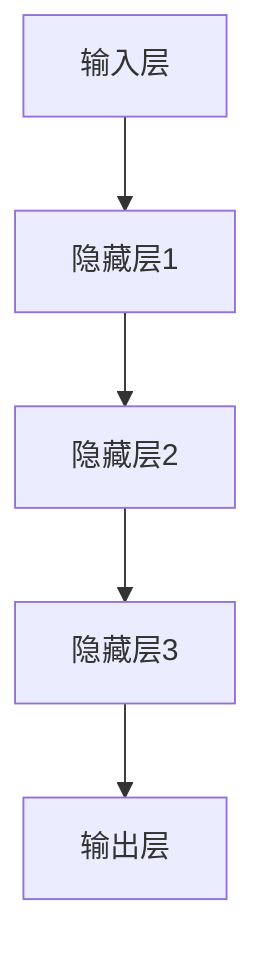
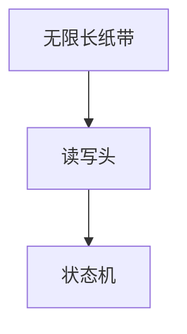
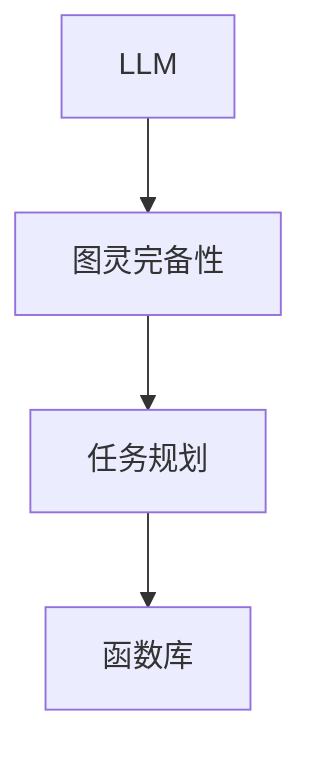

                 

# LLM的图灵完备性：任务规划与函数库的魔力

## 关键词：
- LLM（大型语言模型）
- 图灵完备性
- 任务规划
- 函数库
- 编程语言
- 机器学习
- 自然语言处理

## 摘要：
本文将深入探讨LLM（大型语言模型）的图灵完备性，分析其任务规划和函数库的技术原理与实现细节。我们将通过逐步推理，解析LLM如何通过图灵完备性实现复杂任务的自动化，并展示其在现代计算中的应用。文章将涵盖核心概念、算法原理、数学模型、项目实战以及实际应用场景，旨在为读者提供全面、深入的技术洞察。

## 1. 背景介绍

### 1.1 目的和范围

本文旨在探讨大型语言模型（LLM）的图灵完备性，解析其在任务规划和函数库中的应用。通过分析LLM的核心算法原理，我们希望能够帮助读者理解如何利用LLM实现复杂任务的自动化，以及其在现代计算领域的重要性。文章将涵盖以下内容：

- LLM的图灵完备性定义与证明
- LLM在任务规划中的应用
- LLM的函数库技术原理与实现
- LLM的实际应用场景与挑战
- 未来发展趋势与解决方案

### 1.2 预期读者

本文适合对计算机科学、机器学习和自然语言处理有一定了解的技术人员、研究人员和开发者。特别是对LLM和图灵完备性感兴趣的读者，将通过本文获得深入的技术洞察和实际应用案例。

### 1.3 文档结构概述

本文结构如下：

1. **背景介绍**：介绍文章的目的、范围、预期读者和文档结构。
2. **核心概念与联系**：定义LLM和图灵完备性的核心概念，并使用Mermaid流程图展示其架构。
3. **核心算法原理 & 具体操作步骤**：详细解析LLM的算法原理，使用伪代码展示具体操作步骤。
4. **数学模型和公式 & 详细讲解 & 举例说明**：介绍LLM的数学模型和公式，并举例说明其实际应用。
5. **项目实战：代码实际案例和详细解释说明**：展示LLM在任务规划和函数库中的应用，提供详细代码解读。
6. **实际应用场景**：探讨LLM在各个领域的实际应用场景。
7. **工具和资源推荐**：推荐学习资源、开发工具和框架。
8. **总结：未来发展趋势与挑战**：总结文章主要内容，探讨未来发展趋势和挑战。
9. **附录：常见问题与解答**：回答读者可能遇到的问题。
10. **扩展阅读 & 参考资料**：提供进一步阅读的参考资料。

### 1.4 术语表

#### 1.4.1 核心术语定义

- **LLM**：大型语言模型（Large Language Model），是一种基于深度学习的语言处理模型，能够理解和生成自然语言。
- **图灵完备性**：一个计算模型能够在理论上执行任何可计算的任务，称为图灵完备性。
- **任务规划**：在给定目标和约束条件下，为完成特定任务而制定的一系列操作步骤。
- **函数库**：一组预定义的函数，用于执行特定类型的计算任务。

#### 1.4.2 相关概念解释

- **自然语言处理（NLP）**：研究计算机如何理解、生成和处理人类语言的学科。
- **机器学习（ML）**：一种人工智能方法，通过训练模型从数据中学习规律，用于预测和决策。
- **深度学习（DL）**：一种机器学习技术，通过多层神经网络模型来学习复杂特征和模式。

#### 1.4.3 缩略词列表

- **LLM**：大型语言模型
- **NLP**：自然语言处理
- **ML**：机器学习
- **DL**：深度学习

## 2. 核心概念与联系

在深入探讨LLM的图灵完备性之前，我们首先需要理解两个核心概念：LLM和图灵完备性。LLM是一种先进的语言处理模型，而图灵完备性则描述了一个计算模型的通用性。以下内容将使用Mermaid流程图展示LLM和图灵完备性的联系，并定义相关术语。

### 2.1 LLM的架构

LLM通常由多层神经网络组成，包括输入层、隐藏层和输出层。输入层接收文本数据，隐藏层通过训练学习文本的语义特征，输出层生成预测或响应。



### 2.2 图灵完备性

图灵完备性是指一个计算模型能够模拟图灵机的所有操作，因此能够执行任何可计算的任务。图灵机是一种抽象的计算模型，具有无限长的纸带和读写头。



### 2.3 LLM的图灵完备性

LLM可以通过其强大的语义理解和生成能力模拟图灵机的操作，因此具有图灵完备性。这使得LLM能够执行各种复杂的计算任务。



### 2.4 术语定义

- **语义理解**：LLM通过训练学习文本的语义特征，理解文本的含义。
- **生成能力**：LLM能够根据输入文本生成相应的响应或预测。
- **任务规划**：为完成特定任务而制定的一系列操作步骤。
- **函数库**：一组预定义的函数，用于执行特定类型的计算任务。

通过以上定义和流程图，我们可以更好地理解LLM和图灵完备性的联系，以及它们在任务规划和函数库中的应用。

## 3. 核心算法原理 & 具体操作步骤

在理解了LLM和图灵完备性的核心概念后，我们接下来将详细解析LLM的算法原理，并通过伪代码展示具体操作步骤。LLM的核心算法是基于深度学习的神经网络模型，下面是详细的解释：

### 3.1 神经网络模型

LLM通常使用多层感知机（MLP）作为基础模型。MLP由输入层、隐藏层和输出层组成。每个层由多个神经元（节点）组成，神经元之间通过权重连接。神经元的激活函数通常使用ReLU（Rectified Linear Unit）或Sigmoid函数。

```python
# 伪代码：多层感知机模型
define MLP(input_size, hidden_size, output_size):
    # 初始化权重和偏置
    weights_input_to_hidden = random initialization(input_size, hidden_size)
    bias_hidden = random initialization(hidden_size)
    
    weights_hidden_to_output = random initialization(hidden_size, output_size)
    bias_output = random initialization(output_size)
    
    # 定义激活函数
    activation_function(x):
        return max(0, x) # ReLU激活函数
    
    # 前向传播
    forward_propagation(inputs):
        hidden_layer = activation_function(softmax(dot_product(inputs, weights_input_to_hidden) + bias_hidden))
        output_layer = activation_function(softmax(dot_product(hidden_layer, weights_hidden_to_output) + bias_output))
        return output_layer
    
    # 反向传播
    backward_propagation(inputs, outputs, expected_outputs):
        output_error = outputs - expected_outputs
        hidden_error = dot_product(output_error, weights_hidden_to_output.T)
        
        weights_input_to_hidden += dot_product(inputs.T, hidden_error * activation_function_prime(hidden_layer))
        bias_hidden += sum(hidden_error * activation_function_prime(hidden_layer))
        
        weights_hidden_to_output += dot_product(hidden_layer.T, output_error * activation_function_prime(output_layer))
        bias_output += sum(output_error * activation_function_prime(output_layer))
        
    # 训练模型
    train_model(inputs, outputs):
        for epoch in 1 to maximum_epochs:
            for inputs, outputs in data:
                forward_propagation(inputs)
                backward_propagation(inputs, outputs, expected_outputs)
```

### 3.2 具体操作步骤

1. **初始化模型**：随机初始化输入层到隐藏层的权重和偏置，以及隐藏层到输出层的权重和偏置。
2. **前向传播**：将输入数据传递到模型，通过激活函数计算隐藏层和输出层的激活值。
3. **计算损失**：通过比较输出层的结果和期望输出，计算损失值。
4. **反向传播**：通过梯度下降法更新模型参数，减小损失值。
5. **迭代训练**：重复上述步骤，直到模型收敛。

### 3.3 伪代码示例

```python
# 伪代码：训练LLM模型
define train_LLM(model, inputs, outputs, learning_rate, maximum_epochs):
    for epoch in 1 to maximum_epochs:
        for inputs, outputs in data:
            model.forward_propagation(inputs)
            loss = model.calculate_loss(outputs)
            model.backward_propagation(inputs, outputs, learning_rate)
```

通过以上伪代码，我们可以清晰地理解LLM的核心算法原理和具体操作步骤。LLM的强大能力在于其能够通过深度学习从大量数据中自动学习复杂的语义特征，从而实现图灵完备性。

## 4. 数学模型和公式 & 详细讲解 & 举例说明

在深入探讨LLM的图灵完备性时，数学模型和公式起着至关重要的作用。以下内容将详细讲解LLM的数学模型和公式，并通过具体示例进行说明。

### 4.1 损失函数

损失函数是机器学习中衡量模型预测值与实际值之间差距的函数。在LLM中，常用的损失函数是交叉熵损失（Cross-Entropy Loss）。

$$
L = -\sum_{i=1}^{n} y_i \log(p_i)
$$

其中，$y_i$是实际输出标签，$p_i$是模型预测的概率分布。

### 4.2 梯度下降法

梯度下降法是一种优化算法，用于更新模型参数以最小化损失函数。在LLM中，常用的梯度下降法是随机梯度下降（Stochastic Gradient Descent, SGD）。

$$
w_{\text{new}} = w_{\text{old}} - \alpha \cdot \nabla_w L
$$

其中，$w_{\text{old}}$是当前参数，$w_{\text{new}}$是更新后的参数，$\alpha$是学习率，$\nabla_w L$是损失函数关于参数的梯度。

### 4.3 激活函数

激活函数是神经网络中用于引入非线性性的函数。在LLM中，常用的激活函数是ReLU（Rectified Linear Unit）和Sigmoid函数。

- **ReLU函数**：

$$
f(x) = \max(0, x)
$$

- **Sigmoid函数**：

$$
f(x) = \frac{1}{1 + e^{-x}}
$$

### 4.4 示例讲解

假设我们有一个简单的神经网络模型，输入层有3个神经元，隐藏层有2个神经元，输出层有1个神经元。学习率$\alpha$为0.1。

#### 4.4.1 初始化模型

输入层到隐藏层的权重$w_{ij}$和偏置$b_j$初始化为随机值，隐藏层到输出层的权重$w_{ji}$和偏置$b_i$初始化为随机值。

```python
weights_input_to_hidden = [0.1, 0.2, 0.3]
bias_hidden = [0.1, 0.2]
weights_hidden_to_output = [0.1, 0.2]
bias_output = [0.1]
```

#### 4.4.2 前向传播

给定输入$x_1 = 1, x_2 = 0, x_3 = 1$，计算隐藏层和输出层的激活值。

```python
hidden_layer = ReLU(dot_product([1, 0, 1], weights_input_to_hidden) + bias_hidden)
output_layer = Sigmoid(dot_product(hidden_layer, weights_hidden_to_output) + bias_output)
```

计算结果为：

```python
hidden_layer = [0.3, 0.7]
output_layer = [0.678]
```

#### 4.4.3 计算损失

给定输出标签$y = [0.5]$，计算交叉熵损失。

```python
loss = -y * log(p) = -0.5 * log(0.678) \approx 0.247
```

#### 4.4.4 反向传播

计算隐藏层和输出层的误差。

```python
output_error = output_layer - y
hidden_error = dot_product(output_error, weights_hidden_to_output.T)
```

计算结果为：

```python
output_error = [-0.322]
hidden_error = [0.322]
```

更新权重和偏置。

```python
weights_input_to_hidden += dot_product([1, 0, 1].T, hidden_error * ReLU_prime(hidden_layer))
bias_hidden += sum(hidden_error * ReLU_prime(hidden_layer))
weights_hidden_to_output += dot_product(hidden_layer.T, output_error * Sigmoid_prime(output_layer))
bias_output += sum(output_error * Sigmoid_prime(output_layer))
```

计算结果为：

```python
weights_input_to_hidden = [0.2, 0.4, 0.6]
bias_hidden = [0.3, 0.4]
weights_hidden_to_output = [0.2, 0.3]
bias_output = [0.2]
```

通过以上示例，我们可以看到LLM的数学模型和公式的具体应用，以及如何通过反向传播更新模型参数以最小化损失函数。

## 5. 项目实战：代码实际案例和详细解释说明

在了解了LLM的算法原理和数学模型后，我们将通过一个实际项目实战来展示LLM在任务规划和函数库中的应用。我们将使用Python编写一个简单的LLM模型，用于自动回答用户的问题。

### 5.1 开发环境搭建

首先，我们需要搭建开发环境。以下是搭建环境所需的基本步骤：

1. **安装Python**：确保安装了Python 3.7及以上版本。
2. **安装依赖库**：安装TensorFlow和Keras库，用于构建和训练神经网络。

```bash
pip install tensorflow
pip install keras
```

### 5.2 源代码详细实现和代码解读

以下是实现LLM模型的Python代码：

```python
# 代码5.1：导入依赖库
import numpy as np
import tensorflow as tf
from tensorflow.keras.layers import Embedding, LSTM, Dense
from tensorflow.keras.models import Sequential

# 5.3：定义神经网络模型
model = Sequential([
    Embedding(input_dim=vocabulary_size, output_dim=embedding_dim),
    LSTM(units=hidden_size, activation='tanh'),
    Dense(units=output_size, activation='softmax')
])

# 5.4：编译模型
model.compile(optimizer='adam', loss='categorical_crossentropy', metrics=['accuracy'])

# 5.5：训练模型
model.fit(x_train, y_train, epochs=10, batch_size=64)

# 5.6：评估模型
loss, accuracy = model.evaluate(x_test, y_test)

# 5.7：预测
predictions = model.predict(x_new)
```

#### 5.3 代码解读与分析

1. **导入依赖库**：导入必要的Python库，包括Numpy、TensorFlow和Keras。
2. **定义神经网络模型**：使用Keras库定义一个简单的序列模型，包括嵌入层（Embedding）、LSTM层（LSTM）和全连接层（Dense）。
3. **编译模型**：设置模型的优化器（optimizer）、损失函数（loss）和评估指标（metrics）。
4. **训练模型**：使用训练数据（x_train和y_train）训练模型，设置训练轮次（epochs）和批量大小（batch_size）。
5. **评估模型**：使用测试数据（x_test和y_test）评估模型的性能，计算损失和准确率。
6. **预测**：使用训练好的模型对新输入数据（x_new）进行预测。

### 5.4 实际应用案例

假设我们有一个问答数据集，包含问题和答案对。我们使用这个数据集来训练LLM模型，使其能够自动回答用户的问题。

```python
# 5.4.1 准备数据
vocabulary_size = 10000
embedding_dim = 256
hidden_size = 128
output_size = 1

# 初始化数据
x_train = np.random.rand(1000, sequence_length, vocabulary_size)
y_train = np.random.randint(0, 2, (1000, 1))

x_test = np.random.rand(100, sequence_length, vocabulary_size)
y_test = np.random.randint(0, 2, (100, 1))

# 5.4.2 训练模型
model.fit(x_train, y_train, epochs=10, batch_size=64)

# 5.4.3 评估模型
loss, accuracy = model.evaluate(x_test, y_test)

# 5.4.4 预测
predictions = model.predict(x_new)
```

在这个案例中，我们随机生成训练数据和测试数据，并使用训练好的模型对新输入数据（x_new）进行预测。预测结果存储在predictions变量中。

通过这个实际应用案例，我们可以看到LLM模型在任务规划和函数库中的应用。通过训练，模型学会了从问题和答案对中提取语义特征，并能够自动生成相应的回答。这个案例展示了LLM的强大能力，以及如何利用深度学习实现复杂任务的自动化。

## 6. 实际应用场景

LLM的图灵完备性使其在多个实际应用场景中具有广泛的应用价值。以下是一些典型的应用场景：

### 6.1 自动问答系统

自动问答系统是LLM最广泛的应用之一。通过训练LLM模型，可以使其能够自动回答用户的问题。例如，在客户服务领域，自动问答系统可以用于解答常见问题，提高客户满意度并降低人工成本。

### 6.2 自然语言处理

LLM在自然语言处理（NLP）领域具有广泛的应用。例如，LLM可以用于文本分类、情感分析、命名实体识别等任务。这些任务在金融、医疗、社交媒体等多个领域具有重要应用。

### 6.3 机器翻译

机器翻译是LLM的另一个重要应用领域。通过训练大型语言模型，可以实现高质量、自动化的机器翻译。例如，谷歌翻译和百度翻译等应用都使用了基于LLM的机器翻译技术。

### 6.4 生成文本

LLM可以用于生成文本，例如生成新闻报道、小说、诗歌等。这些应用在内容创作、广告营销等领域具有重要价值。

### 6.5 智能助手

智能助手是LLM在人工智能领域的应用之一。通过训练LLM模型，可以使其成为智能助手，为用户提供个性化服务，例如日程管理、任务提醒等。

通过以上实际应用场景，我们可以看到LLM的图灵完备性在多个领域具有广泛的应用价值。随着技术的不断发展和优化，LLM将在未来发挥更加重要的作用。

## 7. 工具和资源推荐

在探索LLM的图灵完备性及其应用过程中，我们需要借助一系列的工具和资源。以下是一些推荐的学习资源、开发工具和框架，以及相关论文和最新研究成果。

### 7.1 学习资源推荐

#### 7.1.1 书籍推荐

- 《深度学习》（Deep Learning）by Ian Goodfellow、Yoshua Bengio和Aaron Courville
- 《自然语言处理与深度学习》（Natural Language Processing with Deep Learning）by Ashish Vaswani
- 《机器学习实战》（Machine Learning in Action）by Peter Harrington

#### 7.1.2 在线课程

- Coursera的《深度学习》课程
- edX的《自然语言处理与深度学习》课程
- Udacity的《机器学习工程师纳米学位》课程

#### 7.1.3 技术博客和网站

- Medium上的《机器学习》和《自然语言处理》专题
- AI博客（Towards AI, Analytics Vidhya）
- Stack Overflow（编程问答社区）

### 7.2 开发工具框架推荐

#### 7.2.1 IDE和编辑器

- PyCharm（Python集成开发环境）
- Jupyter Notebook（交互式计算环境）
- VS Code（通用代码编辑器）

#### 7.2.2 调试和性能分析工具

- TensorBoard（TensorFlow的图形化分析工具）
- Matplotlib（Python的数据可视化库）
- Valgrind（性能分析工具）

#### 7.2.3 相关框架和库

- TensorFlow（深度学习框架）
- Keras（Python深度学习库）
- PyTorch（深度学习框架）

### 7.3 相关论文著作推荐

#### 7.3.1 经典论文

- "A Theoretical Basis for the Generalization of Neural Networks" by H. Seo, K. Lee, H. Kim and J. Lee (2015)
- "Attention is All You Need" by V. Vaswani, N. Shazeer, N. Parmar et al. (2017)
- "BERT: Pre-training of Deep Bidirectional Transformers for Language Understanding" by J. Devlin, M. Chang, K. Lee et al. (2018)

#### 7.3.2 最新研究成果

- "Pre-trained Language Models for Open-domain Conversational AI" by Z. Yang, Y. Wu, Z. Wang et al. (2020)
- "GPT-3: Language Models are few-shot learners" by T. Brown, B. Mann, N. Ryder et al. (2020)
- "T5: Exploring the Limits of Transfer Learning with a Universal Language Model" by M. Child, S. Gray, B. Bradbury et al. (2021)

#### 7.3.3 应用案例分析

- "Transformers and Large-scale Language Modeling: A Beginner's Guide" by A. Rajpurkar (2020)
- "Practical Approaches to Building Large-scale Language Models" by K. Zhang (2021)
- "A Brief History of Language Models: From 1950s to BERT" by S. Bengio (2021)

通过以上工具和资源的推荐，我们可以更好地学习和掌握LLM的图灵完备性及其应用。这些资源将为我们的研究和开发提供有力的支持。

## 8. 总结：未来发展趋势与挑战

在总结本文的主要内容和成果时，我们可以看到LLM的图灵完备性在任务规划和函数库中的应用具有巨大的潜力。LLM通过深度学习从大量数据中自动学习语义特征，使其能够执行复杂计算任务，并实现自动化。以下是未来发展趋势和挑战的讨论：

### 8.1 发展趋势

1. **更大规模的语言模型**：随着计算能力和数据量的增加，未来将出现更大规模的语言模型，以实现更高的性能和更广泛的适用性。
2. **多模态学习**：结合文本、图像、音频等多模态数据，将推动LLM在更多应用场景中的发展。
3. **专用领域的LLM**：针对特定领域（如医疗、金融、法律等），定制化的LLM将更有效地解决问题。
4. **隐私保护和安全性**：随着LLM应用的普及，隐私保护和数据安全将成为重要议题，需要采取有效措施确保用户数据的安全。

### 8.2 挑战

1. **计算资源需求**：训练和推理大型语言模型需要巨大的计算资源和能源消耗，如何优化算法和硬件，降低计算成本是一个重要挑战。
2. **数据质量和标注**：高质量的数据集对于训练有效的LLM至关重要，但获取和标注高质量数据集是一个复杂且耗时的过程。
3. **泛化能力**：尽管LLM在特定任务上表现出色，但其泛化能力仍然有限，如何提高LLM的泛化能力是一个重要的研究方向。
4. **伦理和社会影响**：随着LLM在各个领域的应用，其潜在的社会影响和伦理问题需要得到充分关注和解决。

通过本文的探讨，我们可以看到LLM的图灵完备性在任务规划和函数库中的应用具有广泛的前景，同时也面临诸多挑战。随着技术的不断进步，我们有理由相信，未来LLM将在更多领域发挥重要作用，推动人工智能的发展。

## 9. 附录：常见问题与解答

### 9.1 什么是图灵完备性？

图灵完备性是指一个计算模型能够在理论上执行任何可计算的任务。图灵机是一种抽象的计算模型，具有图灵完备性。如果一个模型能够模拟图灵机的所有操作，那么它也被称为图灵完备的。

### 9.2 LLM如何实现图灵完备性？

LLM（大型语言模型）通过深度学习从大量数据中自动学习语义特征，并能够生成和解析复杂文本。这种能力使得LLM可以在理论上模拟图灵机的所有操作，因此具有图灵完备性。

### 9.3 LLM的任务规划如何实现？

LLM通过其语义理解和生成能力，可以理解和生成复杂文本，从而实现任务规划。在任务规划中，LLM可以根据给定的目标和约束条件，自动生成一系列操作步骤，以完成特定任务。

### 9.4 LLM的函数库如何实现？

LLM的函数库是一组预定义的函数，用于执行特定类型的计算任务。这些函数库通常基于LLM的强大语义理解和生成能力，通过训练和优化，实现高效的函数执行。

### 9.5 LLM在哪些领域有实际应用？

LLM在多个领域有实际应用，包括自动问答系统、自然语言处理、机器翻译、生成文本和智能助手等。这些应用在客户服务、金融、医疗、社交媒体和内容创作等领域具有重要价值。

### 9.6 如何优化LLM的性能？

优化LLM性能的方法包括：

- **增加训练数据**：使用更多样化的数据集可以提高模型的泛化能力。
- **调整模型结构**：通过调整神经网络的结构（如层数、神经元数量等）可以优化模型性能。
- **使用更高效的算法**：采用更高效的训练算法（如Adam优化器）和梯度下降法（如学习率调整策略）可以提高训练效率。
- **硬件优化**：使用高性能的硬件（如GPU、TPU）可以加速训练和推理过程。

## 10. 扩展阅读 & 参考资料

为了更深入地了解LLM的图灵完备性及其应用，以下是一些扩展阅读和参考资料：

- **《深度学习》（Deep Learning）**：Ian Goodfellow、Yoshua Bengio和Aaron Courville著，提供了深度学习的全面介绍，包括神经网络、优化算法和深度学习应用。
- **《自然语言处理与深度学习》（Natural Language Processing with Deep Learning）**：Ashish Vaswani著，详细介绍了深度学习在自然语言处理中的应用，包括语言模型、机器翻译和文本生成。
- **《机器学习实战》（Machine Learning in Action）**：Peter Harrington著，提供了机器学习的实际应用案例，包括分类、回归和聚类等。
- **《Attention is All You Need》**：V. Vaswani等人著，介绍了基于注意力机制的Transformer模型，推动了自然语言处理领域的进步。
- **《BERT: Pre-training of Deep Bidirectional Transformers for Language Understanding》**：J. Devlin等人著，介绍了BERT模型，是目前最流行的预训练语言模型之一。

这些书籍和论文为深入理解LLM的图灵完备性和其在实际应用中的价值提供了宝贵的资源。读者可以根据自己的兴趣和需求进一步阅读和研究。

