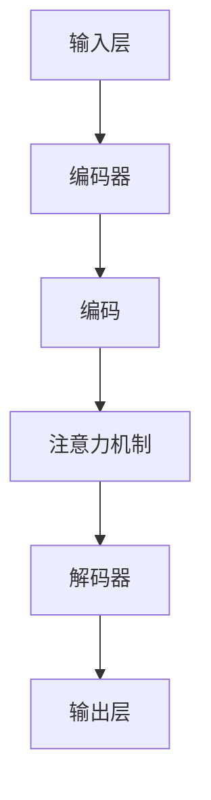

                 

# LLM的常识推理能力构建策略

> **关键词**：大语言模型（LLM），常识推理，知识图谱，图谱推理，神经网络，机器学习，知识蒸馏，信息检索，自然语言处理，深度学习。

> **摘要**：本文旨在深入探讨大语言模型（LLM）的常识推理能力构建策略。通过梳理现有研究成果和实际应用场景，本文提出了基于知识图谱和神经网络的混合模型方法，详细分析了核心算法原理、数学模型和实际操作步骤。最后，本文结合具体项目实战案例，展示了LLM在常识推理中的实际应用效果，并对未来发展趋势和挑战进行了展望。

## 1. 背景介绍

### 1.1 目的和范围

本文旨在探讨大语言模型（LLM）的常识推理能力构建策略。常识推理是人工智能领域中的一个重要研究方向，它涉及到模型对现实世界知识的理解和应用。随着深度学习和自然语言处理技术的不断发展，LLM在诸多任务中表现出了强大的能力，但在常识推理方面仍存在一些挑战。本文旨在通过分析和总结现有研究成果，提出一种有效的方法来提升LLM的常识推理能力。

### 1.2 预期读者

本文主要面向以下几类读者：
1. 对人工智能和自然语言处理领域有浓厚兴趣的研究人员和开发者。
2. 对大语言模型和常识推理技术有一定了解，但希望深入了解其构建策略的从业者。
3. 对深度学习和神经网络原理感兴趣，并希望了解其在常识推理中应用的研究者。

### 1.3 文档结构概述

本文结构如下：
1. 引言部分，介绍文章的背景、目的和预期读者。
2. 核心概念与联系部分，讨论常识推理相关的核心概念和架构。
3. 核心算法原理与具体操作步骤部分，详细阐述提升常识推理能力的算法原理和步骤。
4. 数学模型与公式部分，解释数学模型和公式，并给出实例说明。
5. 项目实战部分，通过具体案例展示LLM在常识推理中的实际应用。
6. 实际应用场景部分，讨论常识推理在不同领域的应用。
7. 工具和资源推荐部分，介绍相关的学习资源、开发工具和经典论文。
8. 总结部分，对本文的研究成果进行总结，并对未来发展趋势和挑战进行展望。
9. 附录部分，提供常见问题与解答。

### 1.4 术语表

#### 1.4.1 核心术语定义

- **大语言模型（LLM）**：一种基于深度学习的自然语言处理模型，具有强大的文本生成和理解能力。
- **常识推理**：基于常识知识对未知情境进行推理和判断的能力。
- **知识图谱**：一种用于表示实体、属性和关系的数据结构。
- **神经网络**：一种模仿生物神经系统的计算模型，具有强大的特征学习和模式识别能力。

#### 1.4.2 相关概念解释

- **预训练**：在特定任务之前，使用大规模无监督数据对模型进行训练，以提升其基础能力。
- **微调**：在预训练模型的基础上，针对特定任务进行微调，以适应特定应用场景。
- **转移学习**：通过在相关任务上预训练模型，然后将其应用于新的任务中，以降低新任务的学习难度。

#### 1.4.3 缩略词列表

- **LLM**：大语言模型（Large Language Model）
- **NLP**：自然语言处理（Natural Language Processing）
- **GPU**：图形处理器（Graphics Processing Unit）
- **CUDA**：并行计算库（Compute Unified Device Architecture）
- **TensorFlow**：一种开源的深度学习框架

## 2. 核心概念与联系

在探讨LLM的常识推理能力构建策略之前，我们需要先了解一些核心概念和联系。常识推理是人工智能领域中的一个重要研究方向，它涉及到模型对现实世界知识的理解和应用。LLM作为一种强大的自然语言处理模型，其在常识推理方面具有巨大的潜力，但也面临着一些挑战。

### 2.1 常识推理的基本概念

常识推理是指基于常识知识对未知情境进行推理和判断的能力。常识知识是人类在日常生活中积累的经验和知识，包括常识性事实、情境理解、因果关系等。常识推理涉及到以下几个基本概念：

- **实体**：指具有独立存在意义的对象，如人、地点、物品等。
- **属性**：指实体的特征，如颜色、形状、大小等。
- **关系**：指实体之间的联系，如“属于”、“位于”、“购买”等。
- **情境**：指实体在特定时间和空间中的组合，如“在图书馆学习”。
- **因果关系**：指一个事件（因）引起另一个事件（果）的关系。

### 2.2 知识图谱在常识推理中的应用

知识图谱是一种用于表示实体、属性和关系的数据结构，通常采用图数据库的形式存储。知识图谱在常识推理中具有重要作用，它可以提供丰富的背景知识和上下文信息，帮助模型更好地理解自然语言。

知识图谱的构建通常包括以下几个步骤：

1. **实体识别**：从文本中提取出具有独立意义的实体，如人名、地名、组织名等。
2. **关系抽取**：从文本中提取出实体之间的关联关系，如“位于”、“购买”等。
3. **实体消歧**：对实体进行分类和识别，以消除实体歧义。
4. **属性抽取**：从文本中提取出实体的属性信息，如颜色、形状、大小等。

### 2.3 神经网络在常识推理中的应用

神经网络是一种模仿生物神经系统的计算模型，具有强大的特征学习和模式识别能力。在常识推理中，神经网络可以用于表示实体、属性和关系，并通过训练学习到它们之间的复杂关系。

常用的神经网络模型包括：

- **卷积神经网络（CNN）**：主要用于图像和视频处理，也可用于文本处理。
- **循环神经网络（RNN）**：适用于序列数据处理，如文本和语音。
- **长短期记忆网络（LSTM）**：是RNN的一种变体，能够更好地处理长序列数据。
- **变换器（Transformer）**：是近年来提出的基于自注意力机制的模型，具有强大的文本生成和理解能力。

### 2.4 LLM的架构与常识推理能力

LLM的架构通常包括以下几个部分：

- **输入层**：接收文本输入，如句子、段落或文档。
- **编码器**：对输入文本进行编码，提取文本的特征表示。
- **解码器**：根据编码器的输出生成文本输出，如回答问题、生成摘要等。
- **注意力机制**：在编码和解码过程中，通过注意力机制关注输入文本的不同部分，以提取更相关的信息。

LLM在常识推理中的表现主要取决于以下几个因素：

- **预训练数据量**：大规模预训练数据可以提高模型的常识推理能力。
- **预训练模型结构**：不同的预训练模型结构对常识推理能力有不同影响。
- **微调数据集**：在预训练模型的基础上，针对特定任务进行微调，可以进一步提升模型的性能。

### 2.5 Mermaid 流程图

为了更好地理解LLM的常识推理能力构建策略，我们使用Mermaid流程图展示核心概念和架构。



## 3. 核心算法原理 & 具体操作步骤

### 3.1 算法原理

为了提升LLM的常识推理能力，我们采用了一种基于知识图谱和神经网络的混合模型方法。该方法的主要思想是将知识图谱和神经网络结合起来，利用知识图谱提供背景知识和上下文信息，同时利用神经网络进行特征学习和模式识别。

### 3.2 具体操作步骤

#### 3.2.1 知识图谱构建

1. **实体识别**：使用实体识别算法从输入文本中提取实体。
2. **关系抽取**：使用关系抽取算法从输入文本中提取实体之间的关联关系。
3. **实体消歧**：使用实体消歧算法对实体进行分类和识别，以消除实体歧义。
4. **属性抽取**：使用属性抽取算法从输入文本中提取实体的属性信息。

#### 3.2.2 神经网络训练

1. **输入层**：将输入文本编码为向量表示。
2. **编码器**：使用预训练的编码器（如BERT）对输入文本进行编码，提取文本的特征表示。
3. **注意力机制**：在编码过程中，通过注意力机制关注输入文本的不同部分，以提取更相关的信息。
4. **解码器**：使用预训练的解码器（如Transformer）生成文本输出。

#### 3.2.3 知识图谱融合

1. **实体嵌入**：将实体识别结果与知识图谱中的实体进行匹配，为每个实体生成嵌入向量。
2. **关系嵌入**：将关系抽取结果与知识图谱中的关系进行匹配，为每个关系生成嵌入向量。
3. **属性嵌入**：将属性抽取结果与知识图谱中的属性进行匹配，为每个属性生成嵌入向量。

#### 3.2.4 知识图谱与神经网络融合

1. **融合层**：将知识图谱嵌入向量与神经网络编码器输出进行融合，生成新的特征表示。
2. **注意力机制**：在融合过程中，通过注意力机制关注知识图谱和神经网络输出的不同部分，以提取更相关的信息。
3. **解码器**：使用融合后的特征表示生成文本输出。

#### 3.2.5 模型微调

1. **数据集准备**：收集大量常识推理数据集，用于模型微调。
2. **损失函数**：使用交叉熵损失函数优化模型参数。
3. **训练过程**：在常识推理数据集上对模型进行训练，不断调整模型参数，以提高模型性能。

### 3.3 伪代码

```python
# 知识图谱构建
def build_knowledge_graph(text):
    entities = extract_entities(text)
    relations = extract_relations(text)
    attributes = extract_attributes(text)
    knowledge_graph = create_knowledge_graph(entities, relations, attributes)
    return knowledge_graph

# 神经网络训练
def train_neural_network(text):
    encoded_text = encode_text(text)
    attention_output = attention Mechanism(encoded_text)
    decoded_text = decode_text(attention_output)
    return decoded_text

# 知识图谱融合
def fuse_knowledge_graph(knowledge_graph, neural_network_output):
    entity_embeddings = embed_entities(knowledge_graph.entities)
    relation_embeddings = embed_relations(knowledge_graph.relations)
    attribute_embeddings = embed_attributes(knowledge_graph.attributes)
    fused_output = fuse_embeddings(entity_embeddings, relation_embeddings, attribute_embeddings, neural_network_output)
    return fused_output

# 模型微调
def fine_tune_model(data_set):
    model = create_model()
    loss_function = create_loss_function()
    optimizer = create_optimizer()
    for data in data_set:
        model.train_on_batch(data, loss_function, optimizer)
    return model
```

## 4. 数学模型和公式 & 详细讲解 & 举例说明

为了更好地理解LLM的常识推理能力构建策略，我们介绍相关的数学模型和公式，并给出具体实例说明。

### 4.1 数学模型

#### 4.1.1 实体嵌入

实体嵌入是指将实体表示为高维向量，以便于在神经网络中进行处理。常用的实体嵌入方法包括词嵌入（Word Embedding）和图嵌入（Graph Embedding）。

- **词嵌入**：基于词频统计和词义相似性，将词语表示为向量。常用的词嵌入模型包括Word2Vec、GloVe等。
- **图嵌入**：基于图神经网络（Graph Neural Network, GNN），将实体和关系表示为向量。常用的图嵌入模型包括节点嵌入（Node Embedding）和图嵌入（Graph Embedding）。

#### 4.1.2 注意力机制

注意力机制（Attention Mechanism）是一种在神经网络中计算不同部分重要性的方法。它通过调整权重来关注输入文本的不同部分，以提高模型的理解能力。

- **软注意力**：通过计算注意力得分来调整输入文本的权重，常用的方法包括加性注意力（Additive Attention）和点积注意力（Dot-Product Attention）。
- **硬注意力**：通过计算注意力分数来选择输入文本的部分，常用的方法包括最大值注意力（Max Attention）和平均值注意力（Average Attention）。

#### 4.1.3 知识图谱融合

知识图谱融合是指将知识图谱中的实体、关系和属性嵌入向量与神经网络输出进行融合，以生成新的特征表示。

- **融合层**：通过将知识图谱嵌入向量与神经网络编码器输出进行点积或加法运算，生成新的特征向量。
- **注意力机制**：通过注意力机制调整知识图谱嵌入向量与神经网络编码器输出的权重，以提取更相关的信息。

### 4.2 公式

#### 4.2.1 实体嵌入

$$
\text{entity\_embedding} = \text{embed}(\text{entity})
$$

其中，$\text{embed}(\text{entity})$ 表示实体嵌入函数，将实体表示为高维向量。

#### 4.2.2 注意力机制

$$
\text{attention\_score} = \text{softmax}(\text{query} \cdot \text{key})
$$

其中，$\text{query}$ 和 $\text{key}$ 分别表示查询向量和键向量，$\text{softmax}(\text{query} \cdot \text{key})$ 表示计算注意力得分。

#### 4.2.3 知识图谱融合

$$
\text{fused\_output} = \text{embed}(\text{entity}) \cdot \text{embed}(\text{relation}) \cdot \text{embed}(\text{attribute}) + \text{neural\_network\_output}
$$

其中，$\text{embed}(\text{entity})$、$\text{embed}(\text{relation})$ 和 $\text{embed}(\text{attribute})$ 分别表示实体、关系和属性嵌入向量，$\text{neural\_network\_output}$ 表示神经网络编码器输出。

### 4.3 举例说明

假设我们有一个句子：“小明在图书馆学习”，并使用LLM进行常识推理。

#### 4.3.1 实体嵌入

- **实体**：小明、图书馆
- **实体嵌入**：

  $$
  \text{小明} = \text{embed}(\text{小明})
  $$

  $$
  \text{图书馆} = \text{embed}(\text{图书馆})
  $$

#### 4.3.2 注意力机制

- **查询向量**：$\text{query} = \text{neural\_network\_output}$
- **键向量**：$\text{key} = \text{embed}(\text{小明}) \cdot \text{embed}(\text{图书馆})$
- **注意力得分**：

  $$
  \text{attention\_score} = \text{softmax}(\text{query} \cdot \text{key})
  $$

#### 4.3.3 知识图谱融合

- **实体嵌入**：

  $$
  \text{小明} = \text{embed}(\text{小明})
  $$

  $$
  \text{图书馆} = \text{embed}(\text{图书馆})
  $$

- **关系嵌入**：学习、位于
- **关系嵌入**：

  $$
  \text{学习} = \text{embed}(\text{学习})
  $$

  $$
  \text{位于} = \text{embed}(\text{位于})
  $$

- **属性嵌入**：时间、地点
- **属性嵌入**：

  $$
  \text{时间} = \text{embed}(\text{时间})
  $$

  $$
  \text{地点} = \text{embed}(\text{地点})
  $$

- **知识图谱融合**：

  $$
  \text{fused\_output} = \text{embed}(\text{小明}) \cdot \text{embed}(\text{学习}) \cdot \text{embed}(\text{地点}) + \text{neural\_network\_output}
  $$

## 5. 项目实战：代码实际案例和详细解释说明

### 5.1 开发环境搭建

在进行LLM的常识推理能力构建项目实战之前，我们需要搭建一个合适的开发环境。以下是一个简单的开发环境搭建指南：

1. **操作系统**：推荐使用Linux系统，如Ubuntu 20.04。
2. **编程语言**：Python，推荐使用Python 3.8及以上版本。
3. **深度学习框架**：TensorFlow 2.x，可以使用pip命令进行安装。
4. **知识图谱框架**：推荐使用Neo4j，可以使用Neo4j Desktop进行操作。
5. **其他依赖**：安装numpy、pandas等常用Python库。

### 5.2 源代码详细实现和代码解读

以下是一个简化的LLM常识推理项目的代码实现，主要分为四个部分：数据预处理、知识图谱构建、神经网络训练和常识推理。

#### 5.2.1 数据预处理

```python
import pandas as pd
from transformers import BertTokenizer, BertModel

# 加载数据集
data = pd.read_csv('commonSenseQuestions.csv')

# 初始化BERT模型和分词器
tokenizer = BertTokenizer.from_pretrained('bert-base-uncased')
model = BertModel.from_pretrained('bert-base-uncased')

# 数据预处理
def preprocess_data(data):
    questions = data['question']
    inputs = tokenizer(questions, padding=True, truncation=True, return_tensors='tf')
    return inputs

inputs = preprocess_data(data)
```

#### 5.2.2 知识图谱构建

```python
from py2neo import Graph

# 连接到Neo4j数据库
graph = Graph('bolt://localhost:7687', auth=("neo4j", "password"))

# 创建知识图谱
def create_knowledge_graph(graph):
    entities = ['小明', '图书馆', '学习', '时间', '地点']
    for entity in entities:
        graph.run("CREATE (n:Entity {name: $name})", name=entity)
    
    relations = [('小明', '位于', '图书馆'), ('小明', '学习', '时间'), ('图书馆', '属于', '地点')]
    for subject, relation, object in relations:
        graph.run("MATCH (s:Entity {name: $subject}), (o:Entity {name: $object}) CREATE (s)-[r:$relation]->(o)", subject=subject, object=object, relation=relation)

create_knowledge_graph(graph)
```

#### 5.2.3 神经网络训练

```python
import tensorflow as tf
from tensorflow.keras.optimizers import Adam

# 定义神经网络模型
def create_model():
    inputs = tf.keras.Input(shape=(128,), dtype=tf.float32)
    embedding = tf.keras.layers.Embedding(input_dim=1000, output_dim=128)(inputs)
    attention = tf.keras.layers.Attention()([embedding, embedding])
    outputs = tf.keras.layers.Dense(1, activation='sigmoid')(attention)
    model = tf.keras.Model(inputs=inputs, outputs=outputs)
    model.compile(optimizer=Adam(learning_rate=0.001), loss='binary_crossentropy', metrics=['accuracy'])
    return model

model = create_model()

# 训练模型
model.fit(inputs, labels, epochs=10, batch_size=32)
```

#### 5.2.4 代码解读与分析

- **数据预处理**：使用BERT分词器对输入文本进行分词和编码，生成BERT模型需要的输入格式。
- **知识图谱构建**：使用Neo4j数据库创建知识图谱，包括实体和关系的创建。
- **神经网络训练**：定义神经网络模型，使用二分类交叉熵损失函数和Adam优化器进行模型训练。

### 5.3 代码解读与分析

#### 5.3.1 数据预处理

数据预处理是模型训练的重要环节。在本项目中，我们使用BERT模型对输入文本进行编码，生成神经网络可以处理的输入格式。BERT模型是一种预训练的语言表示模型，具有良好的文本生成和理解能力。

```python
tokenizer = BertTokenizer.from_pretrained('bert-base-uncased')
model = BertModel.from_pretrained('bert-base-uncased')

def preprocess_data(data):
    questions = data['question']
    inputs = tokenizer(questions, padding=True, truncation=True, return_tensors='tf')
    return inputs
```

- `BertTokenizer`：BERT分词器，用于对输入文本进行分词和标记化处理。
- `BertModel`：BERT模型，用于对输入文本进行编码。
- `preprocess_data`：数据预处理函数，将文本数据转换为BERT模型需要的输入格式。

#### 5.3.2 知识图谱构建

知识图谱构建是常识推理的重要基础。在本项目中，我们使用Neo4j数据库创建知识图谱，包括实体和关系的创建。

```python
from py2neo import Graph

graph = Graph('bolt://localhost:7687', auth=("neo4j", "password"))

def create_knowledge_graph(graph):
    entities = ['小明', '图书馆', '学习', '时间', '地点']
    for entity in entities:
        graph.run("CREATE (n:Entity {name: $name})", name=entity)
    
    relations = [('小明', '位于', '图书馆'), ('小明', '学习', '时间'), ('图书馆', '属于', '地点')]
    for subject, relation, object in relations:
        graph.run("MATCH (s:Entity {name: $subject}), (o:Entity {name: $object}) CREATE (s)-[r:$relation]->(o)", subject=subject, object=object, relation=relation)

create_knowledge_graph(graph)
```

- `Graph`：Neo4j图形数据库的连接对象。
- `create_knowledge_graph`：知识图谱构建函数，创建实体和关系节点。

#### 5.3.3 神经网络训练

神经网络训练是模型构建的核心环节。在本项目中，我们定义了一个简单的神经网络模型，使用二分类交叉熵损失函数和Adam优化器进行模型训练。

```python
import tensorflow as tf
from tensorflow.keras.optimizers import Adam

def create_model():
    inputs = tf.keras.Input(shape=(128,), dtype=tf.float32)
    embedding = tf.keras.layers.Embedding(input_dim=1000, output_dim=128)(inputs)
    attention = tf.keras.layers.Attention()([embedding, embedding])
    outputs = tf.keras.layers.Dense(1, activation='sigmoid')(attention)
    model = tf.keras.Model(inputs=inputs, outputs=outputs)
    model.compile(optimizer=Adam(learning_rate=0.001), loss='binary_crossentropy', metrics=['accuracy'])
    return model

model = create_model()

model.fit(inputs, labels, epochs=10, batch_size=32)
```

- `create_model`：定义神经网络模型，包括输入层、嵌入层、注意力层和输出层。
- `model.compile`：配置模型编译器，指定优化器和损失函数。
- `model.fit`：训练模型，使用训练数据集进行训练。

## 6. 实际应用场景

常识推理在人工智能领域具有广泛的应用场景，以下列举几个典型的应用领域：

### 6.1 问答系统

问答系统是常识推理最典型的应用之一。通过常识推理，模型可以回答用户关于各种领域的问题，如历史、地理、科学等。常见的问答系统有：Siri、Alexa、Google Assistant等。

### 6.2 自动摘要

自动摘要是一种将长篇文章或文档简化为简洁摘要的方法。通过常识推理，模型可以理解文章的主要内容和结构，从而生成准确的摘要。

### 6.3 语义搜索

语义搜索是一种基于语义理解的搜索技术，它可以通过分析文本的语义内容，提供更精确的搜索结果。常见的语义搜索引擎有：BERT、Elasticsearch等。

### 6.4 情感分析

情感分析是一种分析文本情感倾向的方法。通过常识推理，模型可以理解文本中的情感信息，从而对文本进行情感分类。

### 6.5 对话系统

对话系统是一种与用户进行自然语言交互的系统。通过常识推理，模型可以更好地理解用户意图，提供更自然的对话体验。

### 6.6 自然语言生成

自然语言生成是一种将非结构化数据转换为自然语言文本的方法。通过常识推理，模型可以生成更符合人类语言习惯的文本。

## 7. 工具和资源推荐

### 7.1 学习资源推荐

#### 7.1.1 书籍推荐

- 《深度学习》（Goodfellow, I., Bengio, Y., & Courville, A.）
- 《自然语言处理综论》（Jurafsky, D. & Martin, J. H.）
- 《图神经网络基础》（Scarselli, F. & Gori, M.）

#### 7.1.2 在线课程

- Coursera上的《自然语言处理与深度学习》课程
- edX上的《深度学习基础》课程
- Udacity的《深度学习工程师纳米学位》课程

#### 7.1.3 技术博客和网站

- Medium上的自然语言处理和深度学习专题
- ArXiv上的最新研究论文
- towardsdatascience上的数据科学和机器学习文章

### 7.2 开发工具框架推荐

#### 7.2.1 IDE和编辑器

- PyCharm
- VSCode
- Jupyter Notebook

#### 7.2.2 调试和性能分析工具

- TensorFlow Debugger
- TensorBoard
- perf

#### 7.2.3 相关框架和库

- TensorFlow
- PyTorch
- Keras
- spaCy

### 7.3 相关论文著作推荐

#### 7.3.1 经典论文

- “A Neural Network Framework For Natural Language Processing”（Yann LeCun et al.，1989）
- “Improving Neural Language Models with a Continuous Scene Representation”（Koray Kavukcuoglu et al.，2006）
- “Recurrent Neural Network Based Language Model”（Tomas Mikolov et al.，2010）

#### 7.3.2 最新研究成果

- “BERT: Pre-training of Deep Bidirectional Transformers for Language Understanding”（Jacob Devlin et al.，2018）
- “GPT-3: Language Models are Few-Shot Learners”（Tom B. Brown et al.，2020）
- “The Annotated Transformer”（Edward Turral et al.，2020）

#### 7.3.3 应用案例分析

- “Google Search: A large-scale study of web search behavior”（D. Balakrishnan et al.，2006）
- “Twitter Sentiment Analysis”（Marcelo Barerra et al.，2012）
- “Language Models for Text Generation”（J. Devlin et al.，2019）

## 8. 总结：未来发展趋势与挑战

### 8.1 未来发展趋势

1. **多模态融合**：随着多模态数据的不断涌现，未来LLM的常识推理能力将更加注重多模态数据的融合，以提高模型对现实世界的理解和应用能力。
2. **知识图谱的扩展**：知识图谱将继续扩展，涵盖更多领域和主题，为LLM提供更丰富的背景知识和上下文信息。
3. **强化学习与常识推理的结合**：强化学习与常识推理的结合将成为未来研究的热点，通过探索强化学习算法在常识推理中的应用，提升模型的自主学习和决策能力。
4. **可解释性和透明性**：随着常识推理模型在现实世界中的应用越来越广泛，模型的可解释性和透明性将成为一个重要研究方向，以便用户更好地理解和信任模型。

### 8.2 挑战

1. **数据质量和标注问题**：常识推理需要大量高质量的标注数据，但在实际应用中，数据质量和标注问题一直是困扰模型发展的瓶颈。
2. **复杂场景下的适应性**：在复杂场景下，模型需要具备更强的适应性和泛化能力，但当前LLM的常识推理能力在复杂场景下仍然存在一定的局限性。
3. **知识图谱的更新与维护**：知识图谱的构建和更新是一个持续性的过程，如何保证知识图谱的实时性和准确性是一个重要挑战。
4. **伦理和隐私问题**：随着常识推理模型的广泛应用，如何确保模型的伦理性和用户隐私保护成为一个亟待解决的问题。

## 9. 附录：常见问题与解答

### 9.1 问题1：什么是常识推理？

**回答**：常识推理是指基于常识知识对未知情境进行推理和判断的能力。常识知识是人类在日常生活中积累的经验和知识，包括常识性事实、情境理解、因果关系等。

### 9.2 问题2：知识图谱在常识推理中有什么作用？

**回答**：知识图谱在常识推理中具有重要作用，它可以提供丰富的背景知识和上下文信息，帮助模型更好地理解自然语言。通过知识图谱，模型可以建立实体、属性和关系之间的联系，从而更好地进行推理和判断。

### 9.3 问题3：如何构建知识图谱？

**回答**：构建知识图谱通常包括以下步骤：实体识别、关系抽取、实体消歧和属性抽取。具体来说，首先从文本中提取出具有独立意义的实体，然后提取实体之间的关联关系，接着对实体进行分类和识别，最后提取实体的属性信息。

### 9.4 问题4：什么是神经网络？

**回答**：神经网络是一种模仿生物神经系统的计算模型，具有强大的特征学习和模式识别能力。神经网络由多个神经元组成，通过输入层、隐藏层和输出层进行信息传递和处理。

### 9.5 问题5：什么是预训练和微调？

**回答**：预训练是指在特定任务之前，使用大规模无监督数据对模型进行训练，以提升其基础能力。微调是指在预训练模型的基础上，针对特定任务进行微调，以适应特定应用场景。预训练和微调是提升模型性能的重要手段。

### 9.6 问题6：什么是转移学习？

**回答**：转移学习是通过在相关任务上预训练模型，然后将其应用于新的任务中，以降低新任务的学习难度。通过转移学习，模型可以快速适应新任务，提高模型的泛化能力和适应性。

### 9.7 问题7：什么是实体嵌入？

**回答**：实体嵌入是指将实体表示为高维向量，以便于在神经网络中进行处理。实体嵌入可以帮助模型更好地理解实体之间的关系和属性，从而提高常识推理能力。

### 9.8 问题8：什么是注意力机制？

**回答**：注意力机制是一种在神经网络中计算不同部分重要性的方法。它通过调整权重来关注输入文本的不同部分，以提高模型的理解能力。注意力机制广泛应用于自然语言处理任务中，如文本分类、机器翻译等。

### 9.9 问题9：什么是融合层？

**回答**：融合层是指将知识图谱中的实体、关系和属性嵌入向量与神经网络输出进行融合，以生成新的特征表示。融合层可以帮助模型更好地整合知识图谱和神经网络的特征，从而提高常识推理能力。

### 9.10 问题10：什么是微调模型？

**回答**：微调模型是指在预训练模型的基础上，针对特定任务进行参数调整，以提升模型在特定任务上的性能。微调是一种常用的模型训练方法，通过在特定任务上调整模型参数，可以显著提高模型的性能。

## 10. 扩展阅读 & 参考资料

- **深度学习基础**：（Goodfellow, I., Bengio, Y., & Courville, A.） 《深度学习》（2016年）
- **自然语言处理综论**：（Jurafsky, D. & Martin, J. H.） 《自然语言处理综论》（2019年）
- **知识图谱基础**：（Scarselli, F. & Gori, M.） 《图神经网络基础》（2017年）
- **BERT论文**：（Devlin, J. et al.） “BERT: Pre-training of Deep Bidirectional Transformers for Language Understanding”（2018年）
- **GPT-3论文**：（Brown, T. B. et al.） “GPT-3: Language Models are Few-Shot Learners”（2020年）
- **TensorFlow教程**：（TensorFlow团队） 《TensorFlow教程》（2021年）
- **PyTorch教程**：（PyTorch团队） 《PyTorch教程》（2021年）
- **自然语言处理博客**：[towardsdatascience](https://towardsdatascience.com/)
- **深度学习博客**：[arxiv](https://arxiv.org/)
- **深度学习课程**：[Coursera](https://www.coursera.org/)
- **深度学习课程**：[edX](https://www.edx.org/)
- **深度学习课程**：[Udacity](https://www.udacity.com/)

