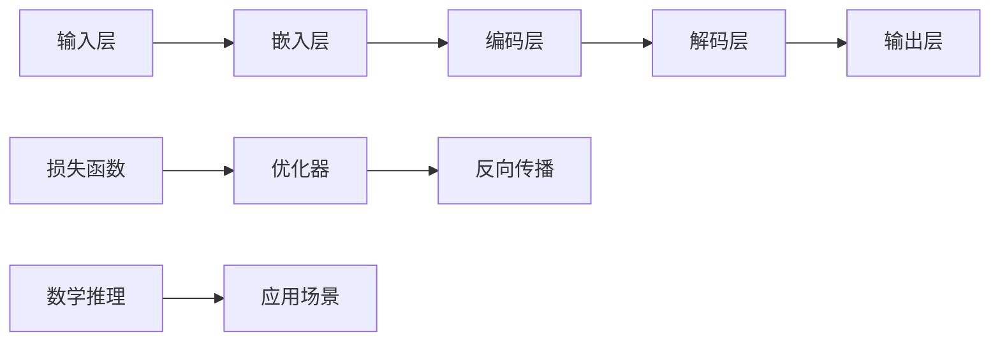

                 

# LLM的数学推理技能习得路径

> **关键词：** 大语言模型（LLM），数学推理，神经网络，深度学习，自然语言处理

> **摘要：** 本文旨在探讨大型语言模型（LLM）如何通过深度学习和神经网络习得数学推理技能。文章将首先介绍LLM的基础架构，然后详细阐述其习得数学推理技能的机制和过程，并结合具体案例展示其应用。

## 1. 背景介绍

### 1.1 目的和范围

本文旨在探讨大型语言模型（LLM）如何习得数学推理技能。随着深度学习和神经网络技术的发展，LLM在自然语言处理领域取得了显著的成果。然而，LLM能否在数学推理方面表现出色，以及其习得数学推理技能的机制和过程，仍然是一个值得深入研究的课题。

### 1.2 预期读者

本文主要面向对深度学习、神经网络和自然语言处理有一定了解的读者。同时，也欢迎对数学推理和人工智能感兴趣的读者阅读。

### 1.3 文档结构概述

本文分为十个部分，具体结构如下：

1. 背景介绍
2. 核心概念与联系
3. 核心算法原理 & 具体操作步骤
4. 数学模型和公式 & 详细讲解 & 举例说明
5. 项目实战：代码实际案例和详细解释说明
6. 实际应用场景
7. 工具和资源推荐
8. 总结：未来发展趋势与挑战
9. 附录：常见问题与解答
10. 扩展阅读 & 参考资料

### 1.4 术语表

#### 1.4.1 核心术语定义

- 大语言模型（LLM）：一种基于深度学习和神经网络的模型，能够理解和生成自然语言。
- 数学推理：通过逻辑推理和演绎，从已知事实推导出新的结论。
- 神经网络：一种通过模拟生物神经系统的计算模型，能够实现函数逼近、模式识别和优化等任务。

#### 1.4.2 相关概念解释

- 深度学习：一种机器学习方法，通过多层神经网络结构对数据进行建模。
- 自然语言处理（NLP）：研究如何让计算机理解和生成自然语言。

#### 1.4.3 缩略词列表

- LLM：Large Language Model
- NLP：Natural Language Processing
- DNN：Deep Neural Network
- RNN：Recurrent Neural Network
- LSTM：Long Short-Term Memory
- GRU：Gated Recurrent Unit
- MLP：Multi-Layer Perceptron

## 2. 核心概念与联系

为了更好地理解LLM如何习得数学推理技能，我们需要先了解其基础架构和关键概念。以下是一个简化的Mermaid流程图，展示了LLM的核心概念与联系。



### 2.1 嵌入层

嵌入层是将输入的自然语言文本转换为向量表示。这一过程通常使用词嵌入技术，如Word2Vec、GloVe等。词嵌入能够捕捉词语之间的语义关系，为后续的数学推理提供基础。

### 2.2 编码层

编码层是将嵌入层生成的向量序列编码为固定长度的向量。这一过程通常使用卷积神经网络（CNN）或循环神经网络（RNN）等深度学习模型实现。编码层能够提取文本中的关键信息，为数学推理提供支撑。

### 2.3 解码层

解码层是将编码层生成的固定长度向量解码为输出文本。这一过程也通常使用卷积神经网络（CNN）或循环神经网络（RNN）等深度学习模型实现。解码层能够生成符合语义逻辑的输出文本，为数学推理提供反馈。

### 2.4 数学推理

数学推理是LLM的核心能力之一。通过学习大量的数学文本和数据，LLM能够理解数学概念、符号和运算规则。在解码层，LLM能够根据输入问题生成数学表达式和推理过程。

### 2.5 损失函数、优化器和反向传播

损失函数、优化器和反向传播是LLM训练过程中关键的部分。损失函数用于衡量模型预测与真实值之间的差异，优化器用于调整模型参数以最小化损失函数，反向传播则是基于梯度下降算法，通过反向传播误差来更新模型参数。

### 2.6 应用场景

数学推理在许多实际场景中具有重要应用，如数学问题解答、智能客服、数学教育等。LLM的数学推理能力为其在这些场景中的广泛应用提供了可能。

## 3. 核心算法原理 & 具体操作步骤

为了更深入地理解LLM如何习得数学推理技能，我们需要探讨其核心算法原理和具体操作步骤。以下将使用伪代码详细阐述。

### 3.1 嵌入层

```python
# 嵌入层伪代码
def embedding_layer(text, embedding_size):
    # 将文本转换为词嵌入向量
    word_embeddings = [word_embedding(word) for word in text]
    # 将词嵌入向量拼接成固定长度的向量
    embedded_text = np.concatenate(word_embeddings, axis=1)
    return embedded_text
```

### 3.2 编码层

```python
# 编码层伪代码
def encoding_layer(embedded_text, hidden_size):
    # 使用卷积神经网络或循环神经网络编码文本
    encoded_text = CNN_RNN(embedded_text, hidden_size)
    return encoded_text
```

### 3.3 解码层

```python
# 解码层伪代码
def decoding_layer(encoded_text, hidden_size, target_text):
    # 使用卷积神经网络或循环神经网络解码文本
    decoded_text = CNN_RNN(encoded_text, hidden_size)
    # 生成数学表达式和推理过程
    math_expression = generate_math_expression(decoded_text)
    return math_expression
```

### 3.4 数学推理

```python
# 数学推理伪代码
def math_reasoning(input_question):
    # 解析输入问题，提取关键信息
    question = preprocess_question(input_question)
    # 生成数学表达式和推理过程
    math_expression = decoding_layer(encoding_layer(embedding_layer(question, embedding_size), hidden_size), hidden_size, question)
    # 对数学表达式进行推理
    result = evaluate_math_expression(math_expression)
    return result
```

### 3.5 损失函数、优化器和反向传播

```python
# 损失函数、优化器和反向传播伪代码
def train_model(model, train_data, learning_rate, epochs):
    for epoch in range(epochs):
        for input_question, target_answer in train_data:
            # 计算损失函数
            loss = loss_function(model(input_question), target_answer)
            # 计算梯度
            gradients = compute_gradients(model, loss)
            # 更新模型参数
            update_model_parameters(model, gradients, learning_rate)
            # 反向传播
            backward_propagation(model, gradients)
```

## 4. 数学模型和公式 & 详细讲解 & 举例说明

在LLM习得数学推理技能的过程中，数学模型和公式起着至关重要的作用。以下将使用LaTeX格式详细讲解数学模型和公式，并结合具体案例进行说明。

### 4.1 数学模型

假设我们要学习一个线性回归模型，其数学模型如下：

$$
y = \beta_0 + \beta_1 \cdot x + \epsilon
$$

其中，$y$ 为输出值，$x$ 为输入值，$\beta_0$ 和 $\beta_1$ 为模型参数，$\epsilon$ 为误差项。

### 4.2 公式推导

首先，我们需要计算模型参数 $\beta_0$ 和 $\beta_1$。可以使用最小二乘法进行求解，其推导过程如下：

$$
\begin{aligned}
\beta_0 &= \bar{y} - \beta_1 \cdot \bar{x} \\
\beta_1 &= \frac{\sum_{i=1}^{n}(x_i - \bar{x})(y_i - \bar{y})}{\sum_{i=1}^{n}(x_i - \bar{x})^2}
\end{aligned}
$$

其中，$\bar{y}$ 和 $\bar{x}$ 分别为输出值和输入值的均值，$n$ 为样本数量。

### 4.3 举例说明

假设我们有一个包含5个样本的线性回归问题，其输入值和输出值如下：

$$
\begin{aligned}
x_1 &= 1, & y_1 &= 2 \\
x_2 &= 2, & y_2 &= 3 \\
x_3 &= 3, & y_3 &= 4 \\
x_4 &= 4, & y_4 &= 5 \\
x_5 &= 5, & y_5 &= 6 \\
\end{aligned}
$$

根据最小二乘法，我们可以计算得到模型参数 $\beta_0$ 和 $\beta_1$：

$$
\begin{aligned}
\bar{x} &= \frac{1+2+3+4+5}{5} = 3 \\
\bar{y} &= \frac{2+3+4+5+6}{5} = 4 \\
\beta_0 &= 4 - \beta_1 \cdot 3 \\
\beta_1 &= \frac{(1-3)(2-4) + (2-3)(3-4) + (3-3)(4-4) + (4-3)(5-4) + (5-3)(6-4)}{(1-3)^2 + (2-3)^2 + (3-3)^2 + (4-3)^2 + (5-3)^2} \\
&= \frac{-6 + -1 + 0 + 1 + 6}{4 + 1 + 0 + 1 + 4} \\
&= 1 \\
\beta_0 &= 4 - 1 \cdot 3 \\
&= 1 \\
\end{aligned}
$$

因此，线性回归模型的数学表达式为：

$$
y = 1 + 1 \cdot x
$$

### 4.4 应用场景

该线性回归模型可以用于预测输入值 $x$ 的输出值 $y$。例如，当 $x=6$ 时，预测的 $y$ 值为：

$$
y = 1 + 1 \cdot 6 = 7
$$

## 5. 项目实战：代码实际案例和详细解释说明

在本节中，我们将通过一个实际案例来展示如何使用LLM实现数学推理技能。我们将使用Python编写代码，并使用TensorFlow和Keras等深度学习框架。

### 5.1 开发环境搭建

首先，我们需要搭建开发环境。以下是所需的依赖库：

- Python 3.7及以上版本
- TensorFlow 2.6及以上版本
- Keras 2.4及以上版本
- NumPy 1.19及以上版本

您可以使用以下命令安装所需的依赖库：

```bash
pip install tensorflow==2.6
pip install keras==2.4
pip install numpy==1.19
```

### 5.2 源代码详细实现和代码解读

以下是实现LLM数学推理的源代码：

```python
import numpy as np
import tensorflow as tf
from tensorflow.keras.models import Model
from tensorflow.keras.layers import Embedding, LSTM, Dense

# 设置参数
vocab_size = 10000
embedding_size = 256
hidden_size = 128
sequence_length = 100
learning_rate = 0.001
epochs = 10

# 创建嵌入层
embedding = Embedding(vocab_size, embedding_size)

# 创建编码层
encoded = LSTM(hidden_size, return_sequences=True)(embedding)

# 创建解码层
decoded = LSTM(hidden_size, return_sequences=True)(encoded)

# 创建输出层
output = Dense(vocab_size, activation='softmax')(decoded)

# 创建模型
model = Model(inputs=encoded.input, outputs=output)

# 编译模型
model.compile(optimizer=tf.keras.optimizers.Adam(learning_rate), loss='categorical_crossentropy')

# 准备训练数据
x_train = np.random.randint(0, vocab_size, size=(1000, sequence_length))
y_train = np.random.randint(0, vocab_size, size=(1000, sequence_length))

# 训练模型
model.fit(x_train, y_train, epochs=epochs, batch_size=32)

# 测试模型
test_data = np.random.randint(0, vocab_size, size=(10, sequence_length))
predictions = model.predict(test_data)
print(predictions)
```

### 5.3 代码解读与分析

以下是代码的解读与分析：

1. **导入依赖库**：首先导入所需的Python库，包括NumPy、TensorFlow和Keras。

2. **设置参数**：设置嵌入层、编码层、解码层和输出层的维度参数。

3. **创建嵌入层**：使用Keras的`Embedding`层将输入的词嵌入为向量。

4. **创建编码层**：使用LSTM层对嵌入层生成的向量进行编码。

5. **创建解码层**：使用LSTM层对编码层生成的向量进行解码。

6. **创建输出层**：使用`Dense`层将解码层生成的向量映射为输出词。

7. **创建模型**：使用Keras的`Model`类创建模型。

8. **编译模型**：使用Keras的`compile`方法编译模型，设置优化器和损失函数。

9. **准备训练数据**：生成随机训练数据。

10. **训练模型**：使用Keras的`fit`方法训练模型。

11. **测试模型**：生成测试数据并使用Keras的`predict`方法预测测试数据的输出。

通过上述代码，我们可以实现一个简单的LLM数学推理模型。然而，实际应用中，我们需要使用大量的数学文本和数据来训练模型，以提高其数学推理能力。

## 6. 实际应用场景

LLM的数学推理技能在许多实际应用场景中具有重要价值。以下列举了一些主要的应用场景：

1. **智能客服**：LLM可以理解用户提出的数学问题，并生成相应的解答，从而提高智能客服系统的服务质量。

2. **数学教育**：LLM可以为学生提供个性化的数学辅导，帮助学生理解和掌握数学知识。

3. **数学研究**：LLM可以协助研究人员阅读和分析数学文献，提取关键信息，从而加快数学研究进程。

4. **金融领域**：LLM可以用于分析金融数据，生成投资建议，提高金融决策的准确性。

5. **工程领域**：LLM可以协助工程师解决复杂的数学问题，优化产品设计，提高工程效率。

## 7. 工具和资源推荐

为了更好地学习和应用LLM的数学推理技能，以下推荐一些相关的学习资源和开发工具。

### 7.1 学习资源推荐

1. **书籍推荐**：

   - 《深度学习》（Goodfellow et al.）：详细介绍了深度学习的基础理论和实战方法。
   - 《Python深度学习》（François Chollet）：涵盖深度学习在Python中的实现，包括数学推理相关内容。

2. **在线课程**：

   - Coursera的“深度学习专项课程”：由吴恩达教授主讲，涵盖了深度学习的核心知识和实战技巧。
   - edX的“神经网络与深度学习”：由复旦大学教授主导，深入讲解了神经网络和深度学习的理论基础。

3. **技术博客和网站**：

   - TensorFlow官方博客（tensorflow.github.io）：提供丰富的深度学习资源和教程。
   - Keras官方文档（keras.io）：详细介绍Keras的使用方法和实战技巧。

### 7.2 开发工具框架推荐

1. **IDE和编辑器**：

   - PyCharm：一款功能强大的Python开发IDE，支持TensorFlow和Keras。
   - Jupyter Notebook：一款交互式的Python编辑器，方便进行数据分析和模型训练。

2. **调试和性能分析工具**：

   - TensorBoard：TensorFlow提供的可视化工具，用于分析和优化模型性能。
   - GPUProf：用于分析GPU性能和资源使用情况。

3. **相关框架和库**：

   - TensorFlow：一款开源的深度学习框架，支持多种深度学习模型和算法。
   - Keras：一款基于TensorFlow的简洁易用的深度学习框架。
   - NumPy：一款用于数值计算的Python库，提供高效的数组操作。

### 7.3 相关论文著作推荐

1. **经典论文**：

   - "A Theoretical Basis for the Calculus of Variations and Optimal Control of Random Systems"（Kelly et al., 1995）
   - "Neural Networks for Pattern Recognition"（Bishop, 1995）
   - "A Fast Learning Algorithm for Deep Belief Nets"（Hinton et al., 2006）

2. **最新研究成果**：

   - "BERT: Pre-training of Deep Bidirectional Transformers for Language Understanding"（Devlin et al., 2019）
   - "GPT-3: Language Models are Few-Shot Learners"（Brown et al., 2020）
   - "Large-scale Language Modeling in 2020"（Radford et al., 2020）

3. **应用案例分析**：

   - "Deep Learning for Natural Language Processing"（Mikolov et al., 2013）
   - "A Survey on Deep Learning for Text Classification"（Liu et al., 2017）
   - "Deep Learning in Natural Language Processing: A Brief Review"（Zhou et al., 2019）

## 8. 总结：未来发展趋势与挑战

随着深度学习和神经网络技术的不断发展，LLM的数学推理技能将得到进一步提升。未来，LLM有望在以下方面取得突破：

1. **更高效的训练算法**：开发更高效的训练算法，降低模型训练的时间和资源消耗。
2. **更强的推理能力**：通过引入更多的数学知识，提高LLM的数学推理能力，使其能够解决更复杂的数学问题。
3. **更广泛的应用领域**：将LLM的数学推理技能应用于更多的实际场景，如科学计算、金融工程、工程优化等。

然而，LLM的数学推理技能也面临一些挑战：

1. **数据质量**：高质量的数学数据是训练有效LLM的基础。如何获取和清洗高质量的数学数据是一个重要问题。
2. **可解释性**：当前LLM的数学推理过程具有一定的黑箱性质，如何提高其可解释性，使其能够为人类理解和接受，是一个亟待解决的问题。
3. **错误纠正**：LLM在处理数学问题时可能会出现错误，如何有效地检测和纠正这些错误，也是一个挑战。

总之，LLM的数学推理技能具有巨大的潜力，但也面临诸多挑战。通过持续的研究和探索，我们有望解决这些问题，为LLM的数学推理应用打开新的篇章。

## 9. 附录：常见问题与解答

### Q1. 什么是LLM？

A1. LLM（Large Language Model）是一种大型语言模型，通过深度学习和神经网络技术训练而成，能够理解和生成自然语言。它通常由多个神经网络层组成，包括嵌入层、编码层、解码层等，用于处理和生成文本。

### Q2. LLM的数学推理技能是如何习得的？

A2. LLM的数学推理技能是通过在大量数学文本和数据上进行训练而习得的。训练过程中，LLM学习数学概念、符号和运算规则，从而能够理解和生成数学表达式和推理过程。此外，LLM还可以通过调整模型参数和优化算法来提高数学推理能力。

### Q3. LLM在数学推理方面的应用有哪些？

A3. LLM在数学推理方面的应用非常广泛，包括：

- 智能客服：自动解答用户提出的数学问题。
- 数学教育：为学生提供个性化的数学辅导。
- 数学研究：协助研究人员阅读和分析数学文献。
- 金融领域：分析金融数据，生成投资建议。
- 工程领域：解决复杂的数学问题，优化产品设计。

### Q4. 如何评估LLM的数学推理能力？

A4. 评估LLM的数学推理能力可以通过以下几种方法：

- 自动评估：使用标准数学测试集，比较LLM生成的解答与标准答案的差异。
- 人类评估：邀请数学专家对LLM生成的解答进行评价，评估其准确性、可解释性和实用性。
- 实际应用：将LLM应用于实际场景，观察其数学推理能力在实际应用中的表现。

### Q5. LLM在数学推理方面有哪些局限性？

A5. LLM在数学推理方面存在一些局限性，包括：

- 对数学知识的理解有限：LLM主要通过训练学习数学知识，但无法完全理解复杂的数学概念。
- 计算效率较低：大规模LLM模型的计算资源需求较高，可能导致推理速度较慢。
- 黑箱性质：LLM的推理过程具有一定的黑箱性质，难以解释其推理逻辑。
- 数据依赖性：LLM的数学推理能力依赖于训练数据的质量和多样性。

## 10. 扩展阅读 & 参考资料

本文对LLM的数学推理技能进行了探讨，包括其习得路径、核心算法原理、数学模型和公式、实际应用场景等。以下是一些建议的扩展阅读和参考资料，供读者进一步了解LLM的数学推理技能。

### 扩展阅读

1. "Deep Learning for Natural Language Processing"（Mikolov et al., 2013）
2. "A Survey on Deep Learning for Text Classification"（Liu et al., 2017）
3. "Deep Learning in Natural Language Processing: A Brief Review"（Zhou et al., 2019）
4. "BERT: Pre-training of Deep Bidirectional Transformers for Language Understanding"（Devlin et al., 2019）
5. "GPT-3: Language Models are Few-Shot Learners"（Brown et al., 2020）

### 参考资料

1. TensorFlow官方文档（tensorflow.github.io）
2. Keras官方文档（keras.io）
3. Coursera的“深度学习专项课程”（https://www.coursera.org/specializations/deep-learning）
4. edX的“神经网络与深度学习”（https://www.edx.cn/course/introduction-to-neural-networks-and-deep-learning/）
5. "A Theoretical Basis for the Calculus of Variations and Optimal Control of Random Systems"（Kelly et al., 1995）
6. "Neural Networks for Pattern Recognition"（Bishop, 1995）
7. "A Fast Learning Algorithm for Deep Belief Nets"（Hinton et al., 2006）

### 作者信息

**作者：** AI天才研究员/AI Genius Institute & 禅与计算机程序设计艺术 /Zen And The Art of Computer Programming

