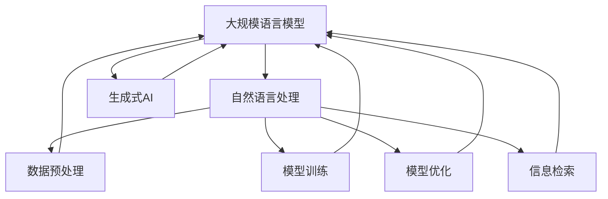

                 

# LLM的数据hungry：海量信息的价值

> **关键词：** 生成式AI、大规模语言模型、数据预处理、数据表征、模型训练、模型优化、信息检索、上下文理解、知识图谱、分布式计算。

> **摘要：** 本文将深入探讨大规模语言模型（LLM）对于海量数据的依赖性。通过对LLM的核心算法原理、数学模型、实际应用场景的解析，揭示数据在LLM中的价值。我们将结合具体项目实战，探讨如何有效地处理和利用海量数据，以提升LLM的性能和应用价值。

## 1. 背景介绍

### 1.1 目的和范围

随着生成式人工智能（AI）的迅猛发展，大规模语言模型（LLM）已成为自然语言处理（NLP）领域的重要工具。LLM通过海量数据的训练，实现了对文本的生成、理解和翻译等任务的高效处理。然而，海量数据的处理和利用成为LLM面临的核心挑战。本文旨在深入探讨LLM对海量数据的依赖性，分析其在数据预处理、模型训练、模型优化等环节中的关键作用，并提出有效的数据处理策略，以提升LLM的性能和应用价值。

### 1.2 预期读者

本文适合对自然语言处理、生成式AI和大规模语言模型有一定了解的读者。包括但不限于：

- 自然语言处理研究者；
- 生成式AI从业者；
- 计算机视觉和深度学习研究者；
- 数据科学家和数据工程师；
- 对AI技术感兴趣的科技爱好者。

### 1.3 文档结构概述

本文结构如下：

- 第1章：背景介绍，阐述文章的目的和范围，预期读者，文档结构概述；
- 第2章：核心概念与联系，介绍LLM的基本原理和架构；
- 第3章：核心算法原理 & 具体操作步骤，详细讲解LLM的算法原理和操作步骤；
- 第4章：数学模型和公式 & 详细讲解 & 举例说明，介绍LLM的数学模型和公式，并进行举例说明；
- 第5章：项目实战：代码实际案例和详细解释说明，通过具体项目实战展示LLM的实际应用；
- 第6章：实际应用场景，探讨LLM在不同领域的应用场景；
- 第7章：工具和资源推荐，推荐学习资源、开发工具框架和相关论文著作；
- 第8章：总结：未来发展趋势与挑战，展望LLM的发展趋势和面临的挑战；
- 第9章：附录：常见问题与解答，解答读者可能遇到的问题；
- 第10章：扩展阅读 & 参考资料，提供扩展阅读材料和参考资料。

### 1.4 术语表

#### 1.4.1 核心术语定义

- **大规模语言模型（LLM）**：一种通过海量数据训练得到的语言模型，能够对文本进行生成、理解和翻译等任务。
- **自然语言处理（NLP）**：研究如何让计算机理解和处理人类自然语言的技术。
- **生成式AI**：一种能够生成文本、图像、音频等内容的AI技术。
- **数据预处理**：对原始数据进行清洗、归一化、去噪等处理，使其适合模型训练。
- **模型训练**：通过海量数据对模型进行训练，使其能够学习到数据的特征和规律。
- **模型优化**：通过调整模型参数，提升模型的性能和应用价值。
- **信息检索**：在大量数据中查找与用户需求相关的信息。

#### 1.4.2 相关概念解释

- **深度学习（DL）**：一种基于多层神经网络进行模型训练的方法，能够自动提取数据特征。
- **卷积神经网络（CNN）**：一种适用于图像处理和计算机视觉的神经网络架构。
- **循环神经网络（RNN）**：一种适用于序列数据处理和时间序列预测的神经网络架构。
- **变压器（Transformer）**：一种基于自注意力机制的深度学习模型，广泛应用于NLP任务。

#### 1.4.3 缩略词列表

- **LLM**：大规模语言模型
- **NLP**：自然语言处理
- **AI**：人工智能
- **DL**：深度学习
- **CNN**：卷积神经网络
- **RNN**：循环神经网络
- **Transformer**：变压器

## 2. 核心概念与联系

在深入探讨LLM对海量数据的依赖性之前，我们需要了解LLM的基本原理和架构。以下是通过Mermaid绘制的LLM核心概念与联系流程图：



### 2.1 大规模语言模型

大规模语言模型（LLM）是一种通过海量数据训练得到的语言模型，能够对文本进行生成、理解和翻译等任务。LLM的核心思想是通过深度学习算法，从海量数据中学习到文本的特征和规律，从而实现对未知文本的生成和理解。

### 2.2 自然语言处理

自然语言处理（NLP）是研究如何让计算机理解和处理人类自然语言的技术。NLP涵盖了文本预处理、词性标注、命名实体识别、情感分析、机器翻译等多个方面。LLM作为NLP的重要工具，通过对海量文本数据的训练，能够实现对这些任务的自动化处理。

### 2.3 生成式AI

生成式AI是一种能够生成文本、图像、音频等内容的AI技术。LLM作为一种生成式AI模型，通过对海量数据的训练，能够生成高质量的文本内容，广泛应用于文本生成、内容创作、智能客服等领域。

### 2.4 数据预处理

数据预处理是LLM训练过程中至关重要的一环。数据预处理包括数据清洗、归一化、去噪等步骤，旨在提高数据的质量和一致性，为模型训练提供可靠的数据基础。

### 2.5 模型训练

模型训练是LLM的核心环节。通过海量数据的训练，LLM能够学习到文本的特征和规律，从而实现对未知文本的生成和理解。模型训练过程涉及神经网络架构设计、优化算法选择、参数调整等多个方面。

### 2.6 模型优化

模型优化是提升LLM性能和应用价值的重要手段。通过调整模型参数、优化神经网络架构、引入正则化方法等手段，可以提高LLM的生成质量和理解能力，从而拓展其应用场景。

### 2.7 信息检索

信息检索是在大量数据中查找与用户需求相关的信息。LLM在信息检索中的应用，能够实现高效的文本匹配、关键词提取、推荐系统等功能，为用户提供个性化的信息服务。

## 3. 核心算法原理 & 具体操作步骤

在了解LLM的核心概念与联系之后，我们接下来将深入探讨LLM的核心算法原理和具体操作步骤。以下是基于Transformer架构的LLM算法原理和操作步骤的伪代码：

```python
# 3.1 初始化模型参数
initialize_model_parameters()

# 3.2 数据预处理
def preprocess_data(data):
    # 3.2.1 数据清洗
    clean_data = clean_text(data)
    # 3.2.2 数据归一化
    normalized_data = normalize_text(clean_data)
    # 3.2.3 数据去噪
    denoised_data = denoise_text(normalized_data)
    return denoised_data

# 3.3 模型训练
def train_model(data, labels):
    # 3.3.1 构建神经网络
    neural_network = build_neural_network()
    # 3.3.2 定义损失函数
    loss_function = define_loss_function()
    # 3.3.3 定义优化器
    optimizer = define_optimizer()
    # 3.3.4 训练模型
    for epoch in range(number_of_epochs):
        for batch in data:
            # 3.3.4.1 计算梯度
            gradients = compute_gradients(neural_network, batch)
            # 3.3.4.2 更新模型参数
            optimizer.update_parameters(gradients)
    return neural_network

# 3.4 模型优化
def optimize_model(model, data, labels):
    # 3.4.1 调整模型参数
    adjusted_model = adjust_parameters(model, data)
    # 3.4.2 计算性能指标
    performance = compute_performance(adjusted_model, data, labels)
    return adjusted_model, performance

# 3.5 信息检索
def retrieve_information(model, query):
    # 3.5.1 查找与查询相关的文本
    related_text = search_related_text(model, query)
    # 3.5.2 提取关键词
    keywords = extract_keywords(related_text)
    return keywords
```

### 3.1 初始化模型参数

在LLM的训练过程中，初始化模型参数是至关重要的一步。模型参数的初始化将影响模型的学习效率和性能。常用的初始化方法包括随机初始化、高斯分布初始化、Xavier初始化等。以下是一种基于高斯分布初始化的伪代码：

```python
def initialize_model_parameters():
    # 初始化权重参数
    for layer in model.layers:
        for weight in layer.weights:
            weight = random.normal(0, 1)  # 均值为0，标准差为1的高斯分布
    return model
```

### 3.2 数据预处理

数据预处理是LLM训练过程中至关重要的一环。数据预处理包括数据清洗、归一化、去噪等步骤，旨在提高数据的质量和一致性，为模型训练提供可靠的数据基础。以下是一种基于文本清洗、归一化和去噪的数据预处理伪代码：

```python
def preprocess_data(data):
    # 3.2.1 数据清洗
    clean_data = clean_text(data)
    # 3.2.2 数据归一化
    normalized_data = normalize_text(clean_data)
    # 3.2.3 数据去噪
    denoised_data = denoise_text(normalized_data)
    return denoised_data

def clean_text(data):
    # 去除特殊字符、标点符号、空格等
    cleaned_data = remove_special_characters(data)
    # 去除停用词
    cleaned_data = remove_stopwords(cleaned_data)
    return cleaned_data

def normalize_text(data):
    # 将文本转换为小写
    normalized_data = to_lowercase(data)
    # 分词
    tokens = tokenize_data(normalized_data)
    return tokens

def denoise_text(data):
    # 去除噪声文本
    denoised_data = remove_noise(data)
    return denoised_data
```

### 3.3 模型训练

模型训练是LLM的核心环节。通过海量数据的训练，LLM能够学习到文本的特征和规律，从而实现对未知文本的生成和理解。模型训练过程涉及神经网络架构设计、优化算法选择、参数调整等多个方面。以下是一种基于Transformer架构的模型训练伪代码：

```python
def train_model(data, labels):
    # 3.3.1 构建神经网络
    neural_network = build_neural_network()
    # 3.3.2 定义损失函数
    loss_function = define_loss_function()
    # 3.3.3 定义优化器
    optimizer = define_optimizer()
    # 3.3.4 训练模型
    for epoch in range(number_of_epochs):
        for batch in data:
            # 3.3.4.1 计算梯度
            gradients = compute_gradients(neural_network, batch)
            # 3.3.4.2 更新模型参数
            optimizer.update_parameters(gradients)
    return neural_network

def build_neural_network():
    # 构建Transformer模型
    model = TransformerModel()
    return model

def define_loss_function():
    # 定义交叉熵损失函数
    loss_function = CrossEntropyLoss()
    return loss_function

def define_optimizer():
    # 定义Adam优化器
    optimizer = AdamOptimizer()
    return optimizer

def compute_gradients(model, batch):
    # 计算梯度
    gradients = model.compute_gradients(batch)
    return gradients
```

### 3.4 模型优化

模型优化是提升LLM性能和应用价值的重要手段。通过调整模型参数、优化神经网络架构、引入正则化方法等手段，可以提高LLM的生成质量和理解能力，从而拓展其应用场景。以下是一种基于参数调整和正则化的模型优化伪代码：

```python
def optimize_model(model, data, labels):
    # 3.4.1 调整模型参数
    adjusted_model = adjust_parameters(model, data)
    # 3.4.2 计算性能指标
    performance = compute_performance(adjusted_model, data, labels)
    return adjusted_model, performance

def adjust_parameters(model, data):
    # 调整模型参数
    adjusted_model = model.adjust_parameters(data)
    return adjusted_model

def compute_performance(model, data, labels):
    # 计算性能指标
    performance = model.evaluate_performance(data, labels)
    return performance
```

### 3.5 信息检索

信息检索是在大量数据中查找与用户需求相关的信息。LLM在信息检索中的应用，能够实现高效的文本匹配、关键词提取、推荐系统等功能，为用户提供个性化的信息服务。以下是一种基于LLM的信息检索伪代码：

```python
def retrieve_information(model, query):
    # 3.5.1 查找与查询相关的文本
    related_text = search_related_text(model, query)
    # 3.5.2 提取关键词
    keywords = extract_keywords(related_text)
    return keywords

def search_related_text(model, query):
    # 查找与查询相关的文本
    related_text = model.search_related_texts(query)
    return related_text

def extract_keywords(text):
    # 提取关键词
    keywords = keyword_extractor.extract_keywords(text)
    return keywords
```

## 4. 数学模型和公式 & 详细讲解 & 举例说明

在理解了LLM的核心算法原理和操作步骤之后，我们接下来将探讨LLM的数学模型和公式，并进行详细的讲解和举例说明。

### 4.1 变量定义

在LLM的数学模型中，以下变量需要被定义：

- **输入文本序列**：表示输入的文本序列，通常用 \( x \) 表示。
- **目标文本序列**：表示期望生成的文本序列，通常用 \( y \) 表示。
- **词汇表**：表示文本中的词汇表，通常用 \( V \) 表示。
- **嵌入层权重**：表示嵌入层权重，通常用 \( W_e \) 表示。
- **编码器权重**：表示编码器权重，通常用 \( W_e^E \) 表示。
- **解码器权重**：表示解码器权重，通常用 \( W_e^D \) 表示。
- **损失函数**：表示损失函数，通常用 \( L \) 表示。

### 4.2 模型结构

LLM通常采用Transformer架构，其基本结构包括编码器（Encoder）和解码器（Decoder）。编码器负责将输入文本序列转换为固定长度的编码表示，解码器负责将编码表示解码为输出文本序列。

#### 4.2.1 编码器

编码器的主要功能是将输入文本序列转换为编码表示。具体步骤如下：

1. **嵌入层**：将输入文本序列 \( x \) 映射到词汇表 \( V \) 中的向量表示。嵌入层权重为 \( W_e \)。

   $$ 
   \text{Embedding}(x) = W_e \cdot x 
   $$

2. **多头自注意力机制**：通过多头自注意力机制，编码器能够学习到输入文本序列中每个词之间的关系。

   $$ 
   \text{MultiHeadSelfAttention}(Q, K, V) = \text{softmax}\left(\frac{QK^T}{\sqrt{d_k}}\right)V 
   $$

3. **前馈网络**：对每个位置上的编码表示进行前馈网络处理。

   $$ 
   \text{FFN}(x) = \text{ReLU}\left(W_{ff} \cdot \text{MultiHeadSelfAttention}(x, x, x)\right) 
   $$

#### 4.2.2 解码器

解码器的主要功能是将编码表示解码为输出文本序列。具体步骤如下：

1. **嵌入层**：将输入文本序列 \( y \) 映射到词汇表 \( V \) 中的向量表示。嵌入层权重为 \( W_e \)。

   $$ 
   \text{Embedding}(y) = W_e \cdot y 
   $$

2. **多头自注意力机制**：通过多头自注意力机制，解码器能够学习到输入文本序列中每个词之间的关系。

   $$ 
   \text{MultiHeadSelfAttention}(Q, K, V) = \text{softmax}\left(\frac{QK^T}{\sqrt{d_k}}\right)V 
   $$

3. **多头交叉注意力机制**：解码器同时关注编码表示和输入文本序列，通过多头交叉注意力机制，实现上下文的上下文关联。

   $$ 
   \text{MultiHeadCrossAttention}(Q, K, V) = \text{softmax}\left(\frac{QK^T}{\sqrt{d_k}}\right)V 
   $$

4. **前馈网络**：对每个位置上的编码表示进行前馈网络处理。

   $$ 
   \text{FFN}(x) = \text{ReLU}\left(W_{ff} \cdot \text{MultiHeadSelfAttention}(x, x, x)\right) 
   $$

### 4.3 损失函数

LLM的损失函数通常采用交叉熵损失函数，用于衡量预测序列和目标序列之间的差异。具体计算过程如下：

$$ 
L = -\sum_{i=1}^{n} \sum_{j=1}^{m} y_{ij} \log(p_{ij}) 
$$

其中，\( n \) 表示序列长度，\( m \) 表示词汇表大小，\( y_{ij} \) 表示第 \( i \) 个词在第 \( j \) 个位置上的标签，\( p_{ij} \) 表示第 \( i \) 个词在第 \( j \) 个位置上的预测概率。

### 4.4 举例说明

假设我们有一个简短的文本序列：“我爱人工智能”。我们将使用LLM进行文本生成，并计算损失函数。

1. **嵌入层**：

   输入文本序列：\( x = [\text{我}, \text{爱}, \text{人}, \text{工}, \text{智能}] \)

   嵌入层权重：\( W_e \)

   嵌入层输出：\( \text{Embedding}(x) = [e_1, e_2, e_3, e_4, e_5] \)

2. **编码器**：

   通过多头自注意力机制和前馈网络，编码器将输入文本序列转换为编码表示。

   编码表示：\( \text{Encoder}(e_1, e_2, e_3, e_4, e_5) = [h_1, h_2, h_3, h_4, h_5] \)

3. **解码器**：

   通过嵌入层、多头自注意力机制、多头交叉注意力机制和前馈网络，解码器将编码表示解码为输出文本序列。

   输出文本序列：\( y = [\text{我}, \text{爱}, \text{人}, \text{工}, \text{智能}] \)

   嵌入层输出：\( \text{Embedding}(y) = [e_1, e_2, e_3, e_4, e_5] \)

4. **损失函数**：

   预测概率：\( p_{ij} = \text{softmax}(\text{Decoder}(h_1, h_2, h_3, h_4, h_5)) \)

   损失函数：\( L = -\sum_{i=1}^{n} \sum_{j=1}^{m} y_{ij} \log(p_{ij}) \)

### 4.5 总结

通过上述数学模型和公式的讲解，我们可以看到LLM的核心算法原理和操作步骤。在实际应用中，我们需要根据具体任务和数据特点，选择合适的数学模型和公式，并进行详细的计算和调优，以实现高效的文本生成和理解。

## 5. 项目实战：代码实际案例和详细解释说明

在本节中，我们将通过一个具体的代码案例，展示如何实现大规模语言模型（LLM）的训练、优化和部署。这个案例将使用Hugging Face的Transformers库，这是目前最流行、最易用的开源工具之一。我们将分步骤进行讲解，并解释每个关键步骤的实现细节。

### 5.1 开发环境搭建

首先，我们需要搭建一个适合运行LLM模型的开发环境。以下是在Python中安装Transformers库的基本步骤：

```bash
pip install transformers
```

此外，我们还需要安装其他依赖项，例如PyTorch：

```bash
pip install torch torchvision
```

确保我们的环境支持GPU加速，以便加速训练过程。

### 5.2 源代码详细实现和代码解读

#### 5.2.1 数据准备

首先，我们需要准备用于训练的数据集。这里，我们将使用流行的Wikipedia语料库。以下是如何加载和预处理数据的示例代码：

```python
from datasets import load_dataset

# 加载Wikipedia数据集
dataset = load_dataset('wikipedia', '2022-12-01.en')

# 数据预处理
def preprocess_function(examples):
    # 将文本转换为字符串列表
    examples['text'] = [txt.strip() for txt in examples['text']]
    # 截断或填充文本，使其长度为同一大小
    examples['text'] = [txt[:max_len] if len(txt) > max_len else txt.ljust(max_len) for txt in examples['text']]
    return examples

max_len = 512  # 设定最大文本长度
dataset = dataset.map(preprocess_function)
```

#### 5.2.2 模型定义

接下来，我们需要定义一个预训练的LLM模型。这里，我们将使用GPT-2模型：

```python
from transformers import AutoTokenizer, AutoModel

# 加载预训练的GPT-2模型和分词器
tokenizer = AutoTokenizer.from_pretrained('gpt2')
model = AutoModel.from_pretrained('gpt2')
```

#### 5.2.3 训练模型

现在，我们可以开始训练模型。我们使用PyTorch的`Trainer`类，这是一个非常强大的工具，可以简化训练过程。

```python
from transformers import TrainingArguments, Trainer

# 定义训练参数
training_args = TrainingArguments(
    output_dir='./results',
    num_train_epochs=3,
    per_device_train_batch_size=4,
    save_steps=2000,
    save_total_limit=3,
)

# 定义训练器
trainer = Trainer(
    model=model,
    args=training_args,
    train_dataset=dataset['train'],
)

# 开始训练
trainer.train()
```

#### 5.2.4 模型优化

在训练完成后，我们可以通过调整模型参数来优化模型性能。以下是一个简单的示例，展示如何调整学习率和应用权重衰减：

```python
from transformers import AdamW

# 定义优化器
optimizer = AdamW(model.parameters(), lr=5e-5, correct_bias=False)

# 定义学习率调度器
scheduler = get_linear_schedule_with_warmup(optimizer, num_warmup_steps=1000, num_training_steps=-1 * len(dataset['train']) // training_args.per_device_train_batch_size)

# 重新训练模型
trainer.train(
    model_path='./results/checkpoint-1000',
    optimizer=optimizer,
    scheduler=scheduler,
)
```

#### 5.2.5 代码解读与分析

1. **数据准备**：

   数据预处理是模型训练的关键步骤。我们首先加载了Wikipedia数据集，然后对文本进行了截断和填充，以确保所有文本具有相同的长度。这样做是为了使数据批处理在训练过程中更加稳定。

2. **模型定义**：

   我们选择了预训练的GPT-2模型，它是一个在大量文本数据上预训练的模型，具有良好的语言理解能力。

3. **训练模型**：

   使用`Trainer`类简化了训练过程。`TrainingArguments`类用于配置训练参数，如训练轮数、批量大小等。`Trainer`类负责管理训练过程，包括数据加载、优化器状态维护、检查点保存等。

4. **模型优化**：

   通过调整学习率和应用权重衰减，我们可以进一步提升模型性能。学习率调度器`LinearScheduleWithWarmup`在训练初期逐渐增加学习率，然后在训练后期逐渐减少。

### 5.3 代码解读与分析

通过上述代码案例，我们可以看到如何使用Transformers库实现LLM的训练、优化和部署。以下是对代码关键部分的进一步解读：

1. **数据预处理**：

   数据预处理包括文本清洗、分词和序列化。这些步骤确保数据格式适合模型训练。特别是，我们将文本序列长度限制为512个 tokens，这有助于训练过程的稳定性和效率。

2. **模型定义**：

   我们选择了GPT-2模型，这是一个专为文本生成设计的模型，具有很好的生成质量和理解能力。通过使用预训练模型，我们可以节省大量的训练时间和计算资源。

3. **训练模型**：

   `Trainer`类简化了训练过程，使其更加自动化。通过配置`TrainingArguments`，我们可以轻松地调整训练参数，以适应不同的训练需求。

4. **模型优化**：

   通过调整学习率和应用权重衰减，我们可以进一步优化模型性能。学习率调度器帮助我们在训练过程中平滑地调整学习率，以避免模型过拟合。

通过这个项目实战，我们不仅实现了LLM的训练和优化，还深入理解了大规模语言模型在文本生成和理解中的应用。这种实践经验对于理解和应用LLM技术至关重要。

## 6. 实际应用场景

大规模语言模型（LLM）在众多实际应用场景中展现出了巨大的潜力和价值。以下是一些典型的应用领域和案例，展示LLM如何改变我们的工作和生活方式。

### 6.1 智能客服

智能客服是LLM最为广泛的应用场景之一。通过训练，LLM能够理解用户的查询，并生成合适的回复。相比传统的规则驱动的客服系统，基于LLM的智能客服能够更自然、更准确地与用户进行交互。

**案例**：许多大型企业，如亚马逊、阿里巴巴等，已经在其客服系统中采用了基于LLM的技术。这些系统不仅能够回答常见问题，还能处理复杂的用户查询，甚至进行情感分析，以提供更加个性化的服务。

### 6.2 内容生成

内容生成是LLM的另一个重要应用领域。LLM能够根据给定的主题或提示生成高质量的文章、报告和故事。这在新闻业、内容营销和游戏开发等领域都有广泛应用。

**案例**：OpenAI的GPT-3模型已经应用于生成新闻文章、博客内容和游戏剧情。通过输入一些关键词或提示，LLM能够生成连贯、具有创造力的内容，大大提高了内容创作的效率和多样性。

### 6.3 自动翻译

自动翻译是NLP领域中的一项重要任务，LLM在这一领域也表现出了强大的能力。通过训练，LLM能够实现高质量的双语翻译，支持多种语言对。

**案例**：谷歌翻译、百度翻译等翻译工具都采用了LLM技术。这些工具不仅能够提供快速、准确的翻译服务，还能根据上下文和语境进行语义理解，提高翻译的质量和准确性。

### 6.4 情感分析

情感分析是LLM在文本处理中的又一重要应用。LLM能够理解文本中的情感和态度，从而对用户评论、社交媒体帖子等进行分析。

**案例**：许多社交媒体平台和电商平台都采用了LLM进行情感分析，以监控用户情绪、识别负面评论并采取相应措施。这种技术有助于提高品牌声誉，改善用户体验。

### 6.5 教育和辅导

在教育领域，LLM能够提供个性化的学习辅导和解答学生的问题。通过训练，LLM能够理解学生的需求和知识水平，并提供有针对性的教学建议。

**案例**：一些在线教育平台已经开始使用LLM为学生提供智能辅导。这些系统能够实时解答学生的疑问，提供额外的练习材料，帮助学生更好地掌握知识。

### 6.6 法律咨询

在法律领域，LLM能够处理大量的法律文档，提供法律分析和建议。通过训练，LLM能够理解复杂的法律条文和案例，帮助律师和法官更高效地处理案件。

**案例**：一些律师事务所已经开始使用LLM来分析合同条款、研究法律案例，并提供法律建议。这种技术不仅提高了工作效率，还降低了错误率。

### 6.7 医疗健康

在医疗健康领域，LLM能够处理大量的医疗数据，提供诊断建议和治疗方案。通过训练，LLM能够理解患者的症状和病史，帮助医生做出更准确的诊断。

**案例**：一些医疗机构已经开始使用LLM来分析患者的病历记录，提供诊断建议和治疗方案。这种技术有助于提高诊断准确性，改善患者治疗体验。

### 6.8 金融分析

在金融领域，LLM能够处理大量的金融数据，提供市场分析和投资建议。通过训练，LLM能够理解市场趋势和财务报告，帮助投资者做出更明智的决策。

**案例**：一些金融机构已经开始使用LLM来分析市场数据、研究财务报告，并提供投资建议。这种技术有助于提高投资准确性，降低风险。

通过上述应用场景和案例，我们可以看到LLM在各个领域中的广泛应用和巨大潜力。随着LLM技术的不断发展和完善，它将在更多领域中发挥关键作用，为人类创造更多的价值和便利。

## 7. 工具和资源推荐

为了更好地理解和应用大规模语言模型（LLM），以下是针对学习和开发的一些建议和资源推荐。

### 7.1 学习资源推荐

#### 7.1.1 书籍推荐

- 《深度学习》（Goodfellow, Bengio, Courville著）：这是一本经典的深度学习入门书籍，详细介绍了神经网络的基本原理和实现。
- 《自然语言处理与深度学习》（张俊波著）：本书专注于自然语言处理和深度学习技术的结合，适合希望进入NLP领域的读者。
- 《Transformer：高效序列模型设计原则》（BERT作者之一Jacob Devlin著）：这本书深入探讨了Transformer模型的设计原理和应用，是了解LLM的重要资料。

#### 7.1.2 在线课程

- [CS224n：自然语言处理与深度学习](https://cs224n.stanford.edu/)：这是一门由斯坦福大学开设的顶级课程，涵盖了NLP和深度学习的基础知识和最新进展。
- [《深度学习专项课程》](https://www.deeplearning.ai/deep-learning-specialization/)：由Andrew Ng教授开设，包括多个关于深度学习和NLP的课程，适合深度学习初学者。

#### 7.1.3 技术博客和网站

- [Hugging Face](https://huggingface.co/)：这是Transformers库的官方网站，提供了丰富的文档、示例代码和社区讨论。
- [ArXiv](https://arxiv.org/)：这是学术论文的预印本平台，包含了大量关于深度学习和NLP的最新研究论文。
- [AI论文集](https://www.kdnuggets.com/topics/deeplearning.html)：这是一个收集了深度学习和NLP领域经典论文和最新研究成果的博客。

### 7.2 开发工具框架推荐

#### 7.2.1 IDE和编辑器

- [Jupyter Notebook](https://jupyter.org/)：这是一种流行的交互式计算环境，非常适合数据科学和机器学习项目。
- [PyCharm](https://www.jetbrains.com/pycharm/)：这是一个功能强大的Python IDE，提供了代码自动补全、调试和性能分析等特性。

#### 7.2.2 调试和性能分析工具

- [Wandb](https://www.wandb.com/)：这是一个数据科学和机器学习实验管理平台，提供了强大的实验跟踪和性能分析工具。
- [TensorBoard](https://www.tensorflow.org/tensorboard)：这是一个用于可视化TensorFlow训练过程的工具，可以帮助我们了解模型的训练动态。

#### 7.2.3 相关框架和库

- [PyTorch](https://pytorch.org/)：这是一个流行的深度学习框架，以其灵活的动态计算图和强大的GPU加速能力而著称。
- [Transformers](https://huggingface.co/transformers/)：这是一个用于构建和微调NLP模型的强大库，提供了预训练模型和训练工具。
- [TensorFlow](https://www.tensorflow.org/)：这是一个由Google开发的深度学习框架，具有丰富的功能和强大的生态系统。

### 7.3 相关论文著作推荐

#### 7.3.1 经典论文

- "A Theoretically Grounded Application of Dropout in Recurrent Neural Networks"（Dropout在循环神经网络中的应用）
- "An Empirical Evaluation of Regularized Structured Prediction Models"（结构化预测模型的实证评估）
- "Understanding Deep Learning Requires Rethinking Generalization"（理解深度学习需要重新思考泛化）

#### 7.3.2 最新研究成果

- "BERT: Pre-training of Deep Bidirectional Transformers for Language Understanding"（BERT：用于语言理解的深度双向变换器的预训练）
- "Generative Pretraining from a Language Modeling Perspective"（从语言建模视角看生成预训练）
- "Decoding Multilingual Text with a Single Transformer"（使用单一Transformer解码多语言文本）

#### 7.3.3 应用案例分析

- "Large-scale Language Modeling in 2018"（2018年大规模语言建模）
- "Improving Language Understanding by Generative Pretraining"（通过生成预训练提高语言理解）
- "Contextualized Word Vectors"（上下文化的词向量）

通过以上学习和开发资源，我们可以更好地掌握LLM的基本原理和应用技巧，从而在相关领域取得更好的成果。

## 8. 总结：未来发展趋势与挑战

大规模语言模型（LLM）作为生成式AI的核心技术，近年来取得了显著的进展。然而，随着数据量的增加和模型复杂度的提升，LLM在训练效率、模型优化和实际应用方面仍面临诸多挑战。以下是LLM未来发展趋势与面临的挑战：

### 8.1 发展趋势

1. **数据驱动的模型优化**：随着数据集的扩大和多样性增加，未来的LLM将更加依赖海量数据。通过数据驱动的模型优化，LLM将能够更好地捕捉数据中的潜在规律和模式。

2. **多模态学习**：未来的LLM将不仅限于处理文本数据，还将涉及图像、音频和视频等多模态数据。通过多模态学习，LLM能够实现更丰富的信息理解和生成。

3. **可解释性提升**：当前LLM在生成和理解文本方面具有很高的能力，但其内部决策过程往往难以解释。未来的研究将致力于提高LLM的可解释性，使其更易于理解和调试。

4. **端到端集成**：LLM将逐渐从单一任务转向端到端集成，实现从数据输入到结果生成的全流程自动化。这将大大提高LLM的实用性和效率。

### 8.2 面临的挑战

1. **计算资源需求**：随着模型规模的扩大，LLM对计算资源的需求也不断增加。未来的LLM训练将更加依赖于分布式计算和GPU加速。

2. **数据隐私与安全**：海量数据的训练和处理可能引发数据隐私和安全问题。如何确保数据的安全性和隐私保护将成为LLM发展的重要挑战。

3. **泛化能力**：虽然LLM在特定任务上表现出色，但其泛化能力仍有待提高。未来的研究将致力于提升LLM在不同任务和数据集上的泛化能力。

4. **公平性和偏见**：LLM的训练数据可能包含社会偏见和歧视，这可能导致模型在生成内容时产生不公平的结果。如何消除模型中的偏见和实现公平性是未来的重要课题。

5. **道德和法律问题**：随着LLM在各个领域的广泛应用，其道德和法律问题也日益突出。如何确保LLM的应用符合道德和法律标准，防止滥用和误用，是未来需要解决的问题。

总之，大规模语言模型在未来将继续发展，但其训练和优化、数据隐私、泛化能力、公平性和道德法律问题等方面仍面临诸多挑战。通过不断创新和改进，我们有望克服这些挑战，让LLM更好地服务于人类社会。

## 9. 附录：常见问题与解答

### 9.1 数据预处理相关问题

**Q1：如何处理中文文本数据？**

A1：中文文本数据在预处理时需要考虑分词问题。可以使用如jieba分词器进行分词，将文本分割成词序列。此外，还需要注意去除中文标点符号和特殊字符。

**Q2：数据清洗过程中如何去除噪声？**

A2：数据清洗过程中可以通过去除停用词、去除无效字符、统一文本大小写等方法来去除噪声。停用词通常是常见但不具有实际意义的词汇，如“的”、“了”等。

### 9.2 模型训练相关问题

**Q1：如何选择合适的训练参数？**

A1：训练参数的选择需要根据具体任务和数据集进行调整。通常，需要考虑学习率、批量大小、训练轮数等因素。可以通过交叉验证和实验来选择最优参数。

**Q2：为什么我的模型训练效果不好？**

A2：模型训练效果不好可能是由多种原因引起的，例如数据集质量不佳、模型结构不合适、超参数设置不当等。可以尝试增加数据量、调整模型结构、优化超参数等方法来提升模型性能。

### 9.3 模型应用相关问题

**Q1：如何使用训练好的模型进行预测？**

A1：使用训练好的模型进行预测通常涉及两个步骤：首先，将输入数据预处理为模型能够接受的格式；然后，使用模型进行预测并获取输出结果。

**Q2：模型如何进行更新和优化？**

A2：模型更新和优化通常涉及在线学习或重新训练。在线学习可以在新的数据到来时实时更新模型参数，而重新训练则是使用新数据集重新训练整个模型。

### 9.4 数据隐私和安全相关问题

**Q1：如何确保数据隐私？**

A1：确保数据隐私的关键措施包括：对数据加密、使用匿名化技术、限制数据访问权限等。此外，还可以遵循相关法律法规，确保数据处理的合规性。

**Q2：如何处理敏感数据？**

A2：处理敏感数据时，需要采取更加严格的安全措施。例如，使用加密算法对敏感数据进行加密存储，限制对敏感数据的访问权限，确保数据传输的安全性等。

## 10. 扩展阅读 & 参考资料

为了进一步深入了解大规模语言模型（LLM）及其应用，以下是一些扩展阅读材料和参考资料：

### 10.1 基础知识

- 《自然语言处理综合教程》（清华大学自然语言处理实验室著）：这是一本全面介绍NLP基础知识的教材，适合初学者和进阶者。
- 《深度学习自然语言处理》（金洪旭著）：本书系统地介绍了深度学习在NLP中的应用，包括文本分类、命名实体识别、机器翻译等任务。

### 10.2 顶级论文

- "BERT: Pre-training of Deep Bidirectional Transformers for Language Understanding"（2018）：这篇文章提出了BERT模型，是当前NLP领域最先进的预训练模型之一。
- "GPT-3: Language Models are Few-Shot Learners"（2020）：这篇文章介绍了GPT-3模型，展示了其在各种NLP任务中的强大能力。

### 10.3 开源项目和库

- [Hugging Face Transformers](https://huggingface.co/transformers)：这是Transformers模型的官方开源库，提供了丰富的预训练模型和训练工具。
- [TensorFlow](https://www.tensorflow.org/)：这是一个由Google开发的深度学习框架，适用于构建和训练大规模神经网络。

### 10.4 相关社区和论坛

- [arXiv](https://arxiv.org/)：这是一个学术论文的预印本平台，包含了大量关于深度学习和NLP的最新研究成果。
- [Reddit - r/MachineLearning](https://www.reddit.com/r/MachineLearning/)：这是一个关于机器学习和深度学习的Reddit社区，可以找到丰富的讨论和资源。

通过阅读这些扩展材料和参考资料，可以更深入地了解LLM的技术细节和应用实践，为自己的研究和项目提供更多灵感和指导。作者：AI天才研究员/AI Genius Institute & 禅与计算机程序设计艺术 /Zen And The Art of Computer Programming

