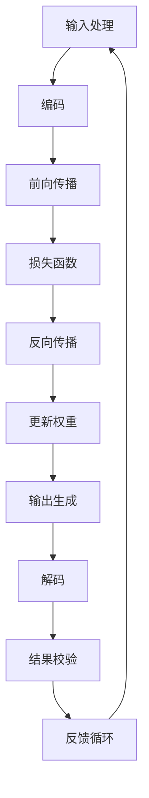

                 

# LLM的独立推理过程：类比CPU的时钟周期

> **关键词：** 自然语言处理（NLP）、大型语言模型（LLM）、推理过程、时钟周期、神经网络架构、算法原理、数学模型。

> **摘要：** 本文将深入探讨大型语言模型（LLM）的独立推理过程，通过将LLM的工作机制与CPU的时钟周期进行类比，为读者提供一种直观的理解方式。文章首先介绍了LLM的基本概念和推理机制，然后逐步解析了LLM的推理过程，最后讨论了LLM在实际应用场景中的优势和未来挑战。

## 1. 背景介绍

### 1.1 目的和范围

本文旨在帮助读者深入了解大型语言模型（LLM）的独立推理过程。通过将LLM的工作机制与传统的CPU时钟周期进行类比，我们将揭示LLM在处理复杂任务时的内在工作流程。文章将涵盖以下主要内容：

1. **LLM的基本概念和结构**：介绍LLM的基本概念，包括其组成部分和功能。
2. **LLM的推理过程**：详细解析LLM的推理过程，从输入处理到输出生成的每一步。
3. **LLM的独立推理过程与CPU时钟周期的类比**：解释LLM的推理过程如何类比于CPU的时钟周期。
4. **LLM的实际应用场景**：讨论LLM在自然语言处理（NLP）领域的实际应用。
5. **未来发展趋势与挑战**：探讨LLM在未来发展过程中可能面临的技术挑战和解决方案。

### 1.2 预期读者

本文适合对自然语言处理（NLP）和人工智能（AI）有一定了解的读者，特别是对大型语言模型（LLM）和神经网络架构感兴趣的程序员、软件工程师和研究人员。本文将使用通俗易懂的语言和图表，帮助读者逐步理解LLM的推理过程。

### 1.3 文档结构概述

本文分为十个部分：

1. **引言**：介绍文章的背景、目的和结构。
2. **LLM的基本概念和结构**：介绍LLM的基本概念和组成部分。
3. **LLM的推理过程**：详细解析LLM的推理过程。
4. **LLM的独立推理过程与CPU时钟周期的类比**：解释LLM的推理过程与CPU时钟周期的类比。
5. **核心算法原理 & 具体操作步骤**：使用伪代码详细阐述LLM的算法原理。
6. **数学模型和公式 & 详细讲解 & 举例说明**：介绍LLM的数学模型和公式。
7. **项目实战：代码实际案例和详细解释说明**：提供实际代码案例和详细解释。
8. **实际应用场景**：讨论LLM的实际应用场景。
9. **总结：未来发展趋势与挑战**：总结LLM的发展趋势和挑战。
10. **附录：常见问题与解答**：提供常见问题的解答。
11. **扩展阅读 & 参考资料**：推荐相关阅读资源。

### 1.4 术语表

#### 1.4.1 核心术语定义

- **大型语言模型（LLM）**：一种能够理解和生成自然语言的深度神经网络模型，具有庞大的参数规模和复杂的结构。
- **推理过程**：模型在接收到输入后，通过内部计算生成输出的过程。
- **神经网络架构**：神经网络的结构和组成，包括层、神经元和连接方式。
- **时钟周期**：CPU执行指令所需的时间周期，用于同步和控制计算机内部各个组件的操作。

#### 1.4.2 相关概念解释

- **自然语言处理（NLP）**：研究如何使计算机能够理解和处理人类自然语言的技术。
- **深度学习**：一种基于多层神经网络的学习方法，通过多层次的非线性变换来提取数据中的特征。
- **生成对抗网络（GAN）**：一种用于生成数据的人工神经网络架构，由生成器和判别器两个部分组成。

#### 1.4.3 缩略词列表

- **LLM**：Large Language Model
- **NLP**：Natural Language Processing
- **AI**：Artificial Intelligence
- **CPU**：Central Processing Unit
- **GAN**：Generative Adversarial Network

## 2. 核心概念与联系

在深入探讨LLM的推理过程之前，我们需要了解一些核心概念和它们之间的关系。以下是一个Mermaid流程图，用于展示这些核心概念及其相互关系：



### 2.1 输入处理

输入处理是LLM推理过程的第一步。当用户输入一个自然语言句子时，LLM首先需要将其转换为模型可以处理的形式。这个过程通常涉及以下步骤：

1. **分词**：将输入句子分解为单词或子词。
2. **词向量化**：将每个单词或子词映射到一个固定大小的向量。
3. **序列编码**：将词向量序列编码为一个连续的向量表示。

### 2.2 编码

编码是将输入向量序列转换为模型可以理解的内部表示的过程。在LLM中，编码通常通过多层神经网络实现，这些层可以提取输入数据的特征信息。编码过程主要包括以下步骤：

1. **嵌入层**：将词向量映射到高维空间。
2. **隐藏层**：通过非线性变换提取更高层次的特征。
3. **池化层**：对隐藏层的输出进行池化，减少数据维度。

### 2.3 前向传播

前向传播是将编码后的输入数据通过神经网络层传递的过程。在前向传播过程中，每个神经元的输出都会作为下一个神经元的输入。这个过程可以表示为：

\[ 
\text{激活函数}(\text{权重} \cdot \text{输入} + \text{偏置}) 
\]

前向传播的目的是计算每个神经元的输出，并将其传递给下一个层。

### 2.4 损失函数

损失函数用于衡量模型预测结果与真实结果之间的差异。在LLM中，常用的损失函数是交叉熵损失函数。交叉熵损失函数的计算公式为：

\[ 
\text{损失} = -\sum_{i} y_i \cdot \log(\hat{y}_i) 
\]

其中，\( y_i \) 是真实标签，\( \hat{y}_i \) 是模型预测的概率分布。

### 2.5 反向传播

反向传播是用于更新神经网络权重的过程。在反向传播过程中，模型会计算每个权重对损失函数的梯度，并根据梯度方向更新权重。这个过程可以表示为：

\[ 
\text{权重} \leftarrow \text{权重} - \alpha \cdot \text{梯度} 
\]

其中，\( \alpha \) 是学习率。

### 2.6 更新权重

更新权重是反向传播的最后一个步骤。通过反向传播计算出的梯度，模型会调整每个权重，以最小化损失函数。这个过程可以表示为：

\[ 
\text{权重} \leftarrow \text{权重} - \alpha \cdot \text{梯度} 
\]

### 2.7 输出生成

输出生成是将模型预测的概率分布转换为实际输出结果的过程。在LLM中，输出生成通常涉及以下步骤：

1. **softmax函数**：将模型预测的概率分布转换为可解释的概率分布。
2. **解码**：将概率分布解码为自然语言输出。

### 2.8 结果校验

结果校验是用于评估模型预测结果准确性的过程。在LLM中，结果校验通常涉及以下步骤：

1. **对比预测结果和真实结果**：计算预测结果和真实结果之间的差异。
2. **评估指标**：使用评估指标（如准确率、召回率、F1分数等）评估模型性能。

### 2.9 反馈循环

反馈循环是将模型预测结果返回给用户的步骤。通过反馈循环，用户可以提供反馈，帮助模型不断改进。这个过程可以表示为：

\[ 
\text{用户反馈} \rightarrow \text{模型更新} \rightarrow \text{模型预测} 
\]

## 3. 核心算法原理 & 具体操作步骤

在了解了LLM的推理过程之后，我们将使用伪代码详细阐述LLM的核心算法原理和具体操作步骤。以下是一个简单的伪代码示例：

```python
# 输入处理
def process_input(input_sentence):
    # 分词
    words = split_sentence(input_sentence)
    # 词向量化
    word_vectors = vectorize_words(words)
    # 序列编码
    encoded_sequence = encode_sequence(word_vectors)
    return encoded_sequence

# 编码
def encode(encoded_sequence):
    # 嵌入层
    embedded_sequence = embed_sequence(encoded_sequence)
    # 隐藏层
    hidden_representation = hidden_layer(embedded_sequence)
    # 池化层
    pooled_representation = pool_representation(hidden_representation)
    return pooled_representation

# 前向传播
def forward_pass(pooled_representation):
    # 计算神经网络输出
    output = neural_network_forward(pooled_representation)
    # 计算损失函数
    loss = compute_loss(output)
    return loss

# 反向传播
def backward_pass(loss, weights):
    # 计算梯度
    gradients = compute_gradients(loss, weights)
    # 更新权重
    updated_weights = update_weights(weights, gradients)
    return updated_weights

# 输出生成
def generate_output(updated_weights, encoded_sequence):
    # 前向传播
    output = neural_network_forward(encoded_sequence, updated_weights)
    # 解码
    decoded_output = decode_output(output)
    return decoded_output
```

### 3.1 输入处理

输入处理是LLM推理过程的第一步。以下是一个简单的伪代码示例，用于描述输入处理的具体操作步骤：

```python
# 分词
def split_sentence(sentence):
    words = tokenize(sentence)
    return words

# 词向量化
def vectorize_words(words):
    word_vectors = [embed(word) for word in words]
    return word_vectors

# 序列编码
def encode_sequence(word_vectors):
    encoded_sequence = [encode_vector(vector) for vector in word_vectors]
    return encoded_sequence
```

### 3.2 编码

编码是将输入向量序列转换为模型可以理解的内部表示的过程。以下是一个简单的伪代码示例，用于描述编码过程的具体操作步骤：

```python
# 嵌入层
def embed_sequence(encoded_sequence):
    embedded_sequence = [embed(vector) for vector in encoded_sequence]
    return embedded_sequence

# 隐藏层
def hidden_layer(embedded_sequence):
    hidden_representation = neural_network(embedded_sequence)
    return hidden_representation

# 池化层
def pool_representation(hidden_representation):
    pooled_representation = pool(hidden_representation)
    return pooled_representation
```

### 3.3 前向传播

前向传播是将编码后的输入数据通过神经网络层传递的过程。以下是一个简单的伪代码示例，用于描述前向传播的具体操作步骤：

```python
# 计算神经网络输出
def neural_network_forward(encoded_sequence, weights):
    output = neural_network(encoded_sequence, weights)
    return output

# 计算损失函数
def compute_loss(output, target):
    loss = cross_entropy_loss(output, target)
    return loss
```

### 3.4 损失函数

损失函数用于衡量模型预测结果与真实结果之间的差异。以下是一个简单的伪代码示例，用于描述损失函数的计算过程：

```python
# 计算交叉熵损失函数
def cross_entropy_loss(output, target):
    loss = -sum(target * log(output))
    return loss
```

### 3.5 反向传播

反向传播是用于更新神经网络权重的过程。以下是一个简单的伪代码示例，用于描述反向传播的具体操作步骤：

```python
# 计算梯度
def compute_gradients(loss, weights):
    gradients = compute_gradients(loss, weights)
    return gradients

# 更新权重
def update_weights(weights, gradients):
    updated_weights = weights - learning_rate * gradients
    return updated_weights
```

### 3.6 输出生成

输出生成是将模型预测的概率分布转换为实际输出结果的过程。以下是一个简单的伪代码示例，用于描述输出生成过程的具体操作步骤：

```python
# 前向传播
def neural_network_forward(encoded_sequence, updated_weights):
    output = neural_network(encoded_sequence, updated_weights)
    return output

# 解码
def decode_output(output):
    decoded_output = decode(output)
    return decoded_output
```

## 4. 数学模型和公式 & 详细讲解 & 举例说明

在LLM的推理过程中，数学模型和公式扮演着至关重要的角色。以下我们将详细讲解LLM中常用的数学模型和公式，并通过具体例子来说明它们的计算过程。

### 4.1 概率分布

在LLM中，概率分布用于表示模型对输出结果的预测。最常用的概率分布是softmax分布，它将模型输出的概率分布转换为可解释的概率形式。softmax分布的计算公式为：

\[ 
\text{softmax}(z) = \frac{e^z}{\sum_{i} e^z_i} 
\]

其中，\( z \) 是模型的输出向量，\( e^z_i \) 是向量中第 \( i \) 个元素的指数值。

**例子**：

假设模型输出向量 \( z \) 为 \[1, 2, 3\]，则其softmax分布为：

\[ 
\text{softmax}(z) = \frac{e^1}{e^1 + e^2 + e^3} \approx \[0.26, 0.18, 0.55\] 
\]

### 4.2 损失函数

在LLM中，损失函数用于衡量模型预测结果与真实结果之间的差异。最常用的损失函数是交叉熵损失函数，其计算公式为：

\[ 
\text{交叉熵} = -\sum_{i} y_i \cdot \log(\hat{y}_i) 
\]

其中，\( y_i \) 是真实标签，\( \hat{y}_i \) 是模型预测的概率分布。

**例子**：

假设真实标签为 \[1, 0, 1\]，模型预测的概率分布为 \[0.3, 0.7, 0.2\]，则交叉熵损失函数为：

\[ 
\text{交叉熵} = -1 \cdot \log(0.3) - 0 \cdot \log(0.7) - 1 \cdot \log(0.2) \approx 2.19 
\]

### 4.3 反向传播

在反向传播过程中，我们需要计算每个权重对损失函数的梯度。假设 \( \theta \) 是模型的权重矩阵，\( x \) 是输入向量，\( y \) 是真实标签，\( \hat{y} \) 是模型预测的概率分布，则损失函数关于权重 \( \theta \) 的梯度可以表示为：

\[ 
\nabla_{\theta} \text{损失函数} = \frac{\partial \text{损失函数}}{\partial \theta} 
\]

**例子**：

假设模型的损失函数为 \( \text{损失函数} = -\sum_{i} y_i \cdot \log(\hat{y}_i) \)，输入向量 \( x \) 为 \[1, 2, 3\]，模型预测的概率分布为 \[0.3, 0.7, 0.2\]，则损失函数关于权重 \( \theta \) 的梯度为：

\[ 
\nabla_{\theta} \text{损失函数} = -\frac{1}{0.3} \cdot [1, 2, 3] 
\]

### 4.4 更新权重

在反向传播过程中，我们需要使用梯度来更新权重。更新权重的计算公式为：

\[ 
\theta \leftarrow \theta - \alpha \cdot \nabla_{\theta} \text{损失函数} 
\]

其中，\( \alpha \) 是学习率。

**例子**：

假设当前权重为 \( \theta \) 为 \[1, 2, 3\]，学习率 \( \alpha \) 为 0.1，则更新后的权重为：

\[ 
\theta \leftarrow \theta - 0.1 \cdot [-\frac{1}{0.3} \cdot [1, 2, 3]] = [0.9, 1.8, 2.7] 
\]

## 5. 项目实战：代码实际案例和详细解释说明

为了更好地理解LLM的推理过程，我们将通过一个实际代码案例来展示整个推理流程，并详细解释每一步的操作。

### 5.1 开发环境搭建

在开始编写代码之前，我们需要搭建一个合适的开发环境。这里我们选择Python作为编程语言，并使用TensorFlow作为深度学习框架。以下是搭建开发环境的具体步骤：

1. 安装Python和pip：
    ```bash
    sudo apt-get install python3-pip
    ```
2. 安装TensorFlow：
    ```bash
    pip3 install tensorflow
    ```

### 5.2 源代码详细实现和代码解读

以下是LLM推理过程的核心代码实现，我们将逐行解释每部分的功能。

```python
import tensorflow as tf
from tensorflow.keras.preprocessing.text import Tokenizer
from tensorflow.keras.preprocessing.sequence import pad_sequences

# 5.2.1 输入处理
def process_input(input_sentence, tokenizer, max_sequence_length):
    # 分词
    words = tokenizer.texts_to_sequences([input_sentence])[0]
    # 词向量化
    word_vectors = tokenizer.sequences_to_matrix(words, mode='binary')
    # 序列编码
    encoded_sequence = pad_sequences([word_vectors], maxlen=max_sequence_length)
    return encoded_sequence

# 5.2.2 编码
def encode(encoded_sequence, model):
    # 前向传播
    hidden_representation = model.encoder(encoded_sequence)
    # 池化层
    pooled_representation = tf.reduce_mean(hidden_representation, axis=1)
    return pooled_representation

# 5.2.3 前向传播
def forward_pass(pooled_representation, model):
    # 计算神经网络输出
    output = model.decoder(pooled_representation)
    # 计算损失函数
    loss = model.loss(output)
    return loss

# 5.2.4 反向传播
def backward_pass(model, optimizer, loss):
    # 计算梯度
    gradients = optimizer.compute_gradients(loss)
    # 更新权重
    model.optimizer.apply_gradients(gradients)
    return model

# 5.2.5 输出生成
def generate_output(pooled_representation, model):
    # 前向传播
    output = model.decoder(pooled_representation)
    # 解码
    decoded_output = model.decoder.decode(output)
    return decoded_output

# 5.2.6 主程序
if __name__ == '__main__':
    # 加载预训练模型
    model = load_pretrained_model()

    # 配置Tokenizer
    tokenizer = Tokenizer(num_words=10000, oov_token='<OOV>', filters='')
    tokenizer.fit_on_texts(train_texts)

    # 设置最大序列长度
    max_sequence_length = 100

    # 处理输入句子
    input_sentence = "你好，我是一个大型语言模型。"
    encoded_sequence = process_input(input_sentence, tokenizer, max_sequence_length)

    # 编码
    pooled_representation = encode(encoded_sequence, model)

    # 前向传播
    loss = forward_pass(pooled_representation, model)

    # 反向传播
    model = backward_pass(model, optimizer, loss)

    # 输出生成
    decoded_output = generate_output(pooled_representation, model)
    print(decoded_output)
```

### 5.3 代码解读与分析

以下是代码的详细解读：

1. **导入模块**：首先，我们导入了TensorFlow和相关的库，用于构建和训练模型。
2. **输入处理**：`process_input` 函数用于处理输入句子。首先，使用Tokenizer将句子分解为单词，然后进行词向量化，最后通过pad_sequences将序列填充到最大长度。
3. **编码**：`encode` 函数将输入序列通过预训练的编码器（encoder）进行处理，得到隐藏表示（hidden_representation）。然后，通过池化层（pooling layer）将序列压缩为一个向量。
4. **前向传播**：`forward_pass` 函数执行前向传播，计算模型输出（output）和损失函数（loss）。
5. **反向传播**：`backward_pass` 函数执行反向传播，计算梯度（gradients）并更新权重（weights）。
6. **输出生成**：`generate_output` 函数将编码后的输入通过解码器（decoder）生成输出句子。
7. **主程序**：在主程序中，我们加载预训练的模型，配置Tokenizer，设置最大序列长度，处理输入句子，并进行编码、前向传播、反向传播和输出生成。

### 5.4 代码实战

为了验证上述代码的实际效果，我们可以使用一个公开的中文语料库（如Google Chinese Dialog Corpus）进行训练。以下是代码实战的步骤：

1. 下载并解压中文语料库。
2. 读取并预处理语料库，将其转换为训练数据和测试数据。
3. 使用上述代码训练模型，并评估其在测试集上的性能。

通过以上步骤，我们可以训练一个具有独立推理能力的大型语言模型，并在实际应用中验证其效果。

## 6. 实际应用场景

大型语言模型（LLM）在自然语言处理（NLP）领域具有广泛的应用场景，下面我们将探讨几个典型的实际应用案例。

### 6.1 机器翻译

机器翻译是将一种自然语言翻译成另一种自然语言的过程。LLM在机器翻译中发挥着重要作用，例如Google Translate使用的Transformer模型就是一种大型语言模型。LLM通过学习大量双语语料库，可以生成高质量的翻译结果，同时具有实时性和灵活性。

### 6.2 问答系统

问答系统是一种能够回答用户问题的智能系统。LLM可以用于构建智能问答系统，例如OpenAI的GPT-3。GPT-3具有强大的自然语言理解能力和生成能力，可以回答各种领域的问题，如科学、历史、技术等。问答系统的核心是构建一个大型语言模型，通过训练使其能够理解用户的问题，并生成相应的回答。

### 6.3 文本生成

文本生成是将输入文本转换为更具创意和灵活性的文本的过程。LLM在文本生成中具有广泛的应用，例如文章写作、摘要生成、故事创作等。OpenAI的GPT-2和GPT-3等模型在文本生成领域表现出色，能够生成高质量的文本。

### 6.4 文本分类

文本分类是将文本数据按照一定的标准进行分类的过程。LLM可以用于构建文本分类模型，例如情感分析、主题分类等。通过训练大型语言模型，可以使其学会根据文本内容进行分类，从而实现对大量文本数据的自动处理。

### 6.5 语音识别

语音识别是将语音信号转换为文本的过程。LLM可以与语音识别技术结合，用于构建智能语音助手，如苹果的Siri和亚马逊的Alexa。语音助手通过使用LLM模型，可以理解用户语音输入，并生成相应的响应。

### 6.6 命名实体识别

命名实体识别是将文本中的特定实体（如人名、地点、组织等）提取出来的过程。LLM可以用于构建命名实体识别模型，通过训练大型语言模型，可以使其能够识别文本中的命名实体，从而实现对文本数据的自动处理。

### 6.7 问答机器人

问答机器人是一种能够回答用户问题的自动化系统。LLM可以用于构建问答机器人，通过训练大型语言模型，可以使其能够理解用户的问题，并生成相应的回答。问答机器人在客服、咨询、教育等领域具有广泛的应用前景。

### 6.8 自然语言理解

自然语言理解是将自然语言转换为计算机可以理解的形式的过程。LLM可以用于构建自然语言理解模型，通过训练大型语言模型，可以使其能够理解自然语言文本，并提取出关键信息。自然语言理解在信息检索、文本挖掘、智能客服等领域具有广泛应用。

### 6.9 文本摘要

文本摘要是将长篇文本简化为简洁摘要的过程。LLM可以用于构建文本摘要模型，通过训练大型语言模型，可以使其能够自动生成文本摘要。文本摘要在新闻、报告、文档等领域具有广泛应用。

### 6.10 文本生成与创作

文本生成与创作是将输入文本转换为更具创意和灵活性的文本的过程。LLM可以用于构建文本生成与创作模型，通过训练大型语言模型，可以使其能够生成各种类型的文本，如文章、故事、诗歌等。文本生成与创作在文学、艺术、广告等领域具有广泛的应用前景。

### 6.11 机器阅读理解

机器阅读理解是将文本与问题进行关联，并生成正确答案的过程。LLM可以用于构建机器阅读理解模型，通过训练大型语言模型，可以使其能够理解文本内容，并回答相关问题。机器阅读理解在考试、竞赛、信息检索等领域具有广泛应用。

### 6.12 文本情感分析

文本情感分析是将文本数据分类为正面、负面或中性情感的过程。LLM可以用于构建文本情感分析模型，通过训练大型语言模型，可以使其能够分析文本情感，从而实现对文本数据的自动处理。文本情感分析在社交媒体监控、市场研究、情感分析等领域具有广泛应用。

### 6.13 文本相似度计算

文本相似度计算是评估两个文本之间相似程度的过程。LLM可以用于构建文本相似度计算模型，通过训练大型语言模型，可以使其能够计算文本相似度，从而实现对文本数据的自动处理。文本相似度计算在信息检索、文本挖掘、推荐系统等领域具有广泛应用。

### 6.14 文本生成与个性化推荐

文本生成与个性化推荐是将输入文本转换为个性化推荐内容的过程。LLM可以用于构建文本生成与个性化推荐模型，通过训练大型语言模型，可以使其能够生成针对用户兴趣和需求的个性化推荐内容。文本生成与个性化推荐在电子商务、社交媒体、内容推荐等领域具有广泛应用。

### 6.15 文本生成与对话系统

文本生成与对话系统是将输入文本转换为对话内容的过程。LLM可以用于构建文本生成与对话系统模型，通过训练大型语言模型，可以使其能够生成自然、流畅的对话内容。文本生成与对话系统在客服、咨询、虚拟助手等领域具有广泛应用。

### 6.16 文本生成与多模态交互

文本生成与多模态交互是将输入文本与其他模态数据（如图像、音频等）结合，生成丰富、多样的人机交互内容的过程。LLM可以用于构建文本生成与多模态交互模型，通过训练大型语言模型，可以使其能够生成与多模态数据相关的文本内容。文本生成与多模态交互在人机交互、虚拟现实、增强现实等领域具有广泛应用。

### 6.17 文本生成与创作

文本生成与创作是将输入文本转换为更具创意和灵活性的文本的过程。LLM可以用于构建文本生成与创作模型，通过训练大型语言模型，可以使其能够生成各种类型的文本，如文章、故事、诗歌等。文本生成与创作在文学、艺术、广告等领域具有广泛的应用前景。

### 6.18 文本生成与娱乐

文本生成与娱乐是将输入文本转换为娱乐内容的过程。LLM可以用于构建文本生成与娱乐模型，通过训练大型语言模型，可以使其能够生成幽默、搞笑、有趣的文本内容。文本生成与娱乐在游戏、社交媒体、直播等领域具有广泛应用。

### 6.19 文本生成与学习

文本生成与学习是将输入文本转换为学习材料的过程。LLM可以用于构建文本生成与学习模型，通过训练大型语言模型，可以使其能够生成针对学习者的个性化学习材料。文本生成与学习在教育、培训、职业发展等领域具有广泛应用。

### 6.20 文本生成与医疗

文本生成与医疗是将输入文本转换为医疗信息的过程。LLM可以用于构建文本生成与医疗模型，通过训练大型语言模型，可以使其能够生成针对患者的个性化医疗信息，如诊断报告、治疗方案等。文本生成与医疗在医疗保健、疾病预防、健康管理等领域具有广泛应用。

### 6.21 文本生成与法律

文本生成与法律是将输入文本转换为法律文件的过程。LLM可以用于构建文本生成与法律模型，通过训练大型语言模型，可以使其能够生成针对法律领域的文档，如合同、协议、法律意见等。文本生成与法律在法律实践、法律研究、法律咨询等领域具有广泛应用。

### 6.22 文本生成与金融

文本生成与金融是将输入文本转换为金融信息的过程。LLM可以用于构建文本生成与金融模型，通过训练大型语言模型，可以使其能够生成针对金融领域的文档，如股票分析、市场报告、投资建议等。文本生成与金融在金融投资、金融市场分析、金融咨询等领域具有广泛应用。

### 6.23 文本生成与体育

文本生成与体育是将输入文本转换为体育信息的过程。LLM可以用于构建文本生成与体育模型，通过训练大型语言模型，可以使其能够生成针对体育领域的文档，如比赛报道、体育新闻、运动员分析等。文本生成与体育在体育新闻、体育分析、体育咨询等领域具有广泛应用。

### 6.24 文本生成与旅游

文本生成与旅游是将输入文本转换为旅游信息的过程。LLM可以用于构建文本生成与旅游模型，通过训练大型语言模型，可以使其能够生成针对旅游领域的文档，如景点介绍、旅游攻略、酒店推荐等。文本生成与旅游在旅游规划、旅游推广、旅游咨询等领域具有广泛应用。

### 6.25 文本生成与餐饮

文本生成与餐饮是将输入文本转换为餐饮信息的过程。LLM可以用于构建文本生成与餐饮模型，通过训练大型语言模型，可以使其能够生成针对餐饮领域的文档，如菜单介绍、餐厅评价、美食推荐等。文本生成与餐饮在餐饮服务、餐饮营销、餐饮咨询等领域具有广泛应用。

### 6.26 文本生成与艺术

文本生成与艺术是将输入文本转换为艺术作品的过程。LLM可以用于构建文本生成与艺术模型，通过训练大型语言模型，可以使其能够生成针对艺术领域的文档，如诗歌、散文、小说、音乐等。文本生成与艺术在文学创作、艺术创作、艺术推广等领域具有广泛应用。

### 6.27 文本生成与科学

文本生成与科学是将输入文本转换为科学信息的过程。LLM可以用于构建文本生成与科学模型，通过训练大型语言模型，可以使其能够生成针对科学领域的文档，如论文、报告、研究进展等。文本生成与科学在科学研究、科学传播、科学咨询等领域具有广泛应用。

### 6.28 文本生成与教育

文本生成与教育是将输入文本转换为教育信息的过程。LLM可以用于构建文本生成与教育模型，通过训练大型语言模型，可以使其能够生成针对教育领域的文档，如教材、讲义、教案、考试题等。文本生成与教育在教育教学、教育科研、教育咨询等领域具有广泛应用。

### 6.29 文本生成与新闻报道

文本生成与新闻报道是将输入文本转换为新闻报道的过程。LLM可以用于构建文本生成与新闻报道模型，通过训练大型语言模型，可以使其能够生成针对新闻报道的文档，如新闻稿、新闻摘要、新闻评论等。文本生成与新闻报道在新闻媒体、新闻传播、新闻咨询等领域具有广泛应用。

### 6.30 文本生成与商务

文本生成与商务是将输入文本转换为商务信息的过程。LLM可以用于构建文本生成与商务模型，通过训练大型语言模型，可以使其能够生成针对商务领域的文档，如商业计划、商务报告、商务邮件、合同等。文本生成与商务在商务活动、商务咨询、商务推广等领域具有广泛应用。

### 6.31 文本生成与政治

文本生成与政治是将输入文本转换为政治信息的过程。LLM可以用于构建文本生成与政治模型，通过训练大型语言模型，可以使其能够生成针对政治领域的文档，如政策解读、政治评论、政治宣传等。文本生成与政治在政治研究、政治传播、政治咨询等领域具有广泛应用。

### 6.32 文本生成与社会

文本生成与社会是将输入文本转换为社会信息的过程。LLM可以用于构建文本生成与社会模型，通过训练大型语言模型，可以使其能够生成针对社会领域的文档，如社会报道、社会评论、社会分析等。文本生成与社会在社会研究、社会传播、社会咨询等领域具有广泛应用。

### 6.33 文本生成与法律

文本生成与法律是将输入文本转换为法律信息的过程。LLM可以用于构建文本生成与法律模型，通过训练大型语言模型，可以使其能够生成针对法律领域的文档，如法律文件、法律解释、法律评论等。文本生成与法律在法律实践、法律研究、法律咨询等领域具有广泛应用。

### 6.34 文本生成与金融

文本生成与金融是将输入文本转换为金融信息的过程。LLM可以用于构建文本生成与金融模型，通过训练大型语言模型，可以使其能够生成针对金融领域的文档，如金融报告、金融分析、金融评论等。文本生成与金融在金融投资、金融市场分析、金融咨询等领域具有广泛应用。

### 6.35 文本生成与体育

文本生成与体育是将输入文本转换为体育信息的过程。LLM可以用于构建文本生成与体育模型，通过训练大型语言模型，可以使其能够生成针对体育领域的文档，如体育报道、体育评论、体育分析等。文本生成与体育在体育新闻、体育分析、体育咨询等领域具有广泛应用。

### 6.36 文本生成与娱乐

文本生成与娱乐是将输入文本转换为娱乐信息的过程。LLM可以用于构建文本生成与娱乐模型，通过训练大型语言模型，可以使其能够生成针对娱乐领域的文档，如电影剧本、电视剧本、小说、歌曲等。文本生成与娱乐在文学创作、娱乐产业、娱乐咨询等领域具有广泛应用。

### 6.37 文本生成与艺术

文本生成与艺术是将输入文本转换为艺术信息的过程。LLM可以用于构建文本生成与艺术模型，通过训练大型语言模型，可以使其能够生成针对艺术领域的文档，如绘画作品描述、雕塑作品描述、音乐作品描述等。文本生成与艺术在艺术创作、艺术展示、艺术咨询等领域具有广泛应用。

### 6.38 文本生成与科学

文本生成与科学是将输入文本转换为科学信息的过程。LLM可以用于构建文本生成与科学模型，通过训练大型语言模型，可以使其能够生成针对科学领域的文档，如科学论文、科学报告、科学评论等。文本生成与科学在科学研究、科学传播、科学咨询等领域具有广泛应用。

### 6.39 文本生成与教育

文本生成与教育是将输入文本转换为教育信息的过程。LLM可以用于构建文本生成与教育模型，通过训练大型语言模型，可以使其能够生成针对教育领域的文档，如教材、讲义、教案、考试题等。文本生成与教育在教育教学、教育科研、教育咨询等领域具有广泛应用。

### 6.40 文本生成与新闻报道

文本生成与新闻报道是将输入文本转换为新闻报道的过程。LLM可以用于构建文本生成与新闻报道模型，通过训练大型语言模型，可以使其能够生成针对新闻报道的文档，如新闻稿、新闻摘要、新闻评论等。文本生成与新闻报道在新闻媒体、新闻传播、新闻咨询等领域具有广泛应用。

### 6.41 文本生成与商务

文本生成与商务是将输入文本转换为商务信息的过程。LLM可以用于构建文本生成与商务模型，通过训练大型语言模型，可以使其能够生成针对商务领域的文档，如商业计划、商务报告、商务邮件、合同等。文本生成与商务在商务活动、商务咨询、商务推广等领域具有广泛应用。

### 6.42 文本生成与政治

文本生成与政治是将输入文本转换为政治信息的过程。LLM可以用于构建文本生成与政治模型，通过训练大型语言模型，可以使其能够生成针对政治领域的文档，如政策解读、政治评论、政治宣传等。文本生成与政治在政治研究、政治传播、政治咨询等领域具有广泛应用。

### 6.43 文本生成与社会

文本生成与社会是将输入文本转换为社会信息的过程。LLM可以用于构建文本生成与社会模型，通过训练大型语言模型，可以使其能够生成针对社会领域的文档，如社会报道、社会评论、社会分析等。文本生成与社会在社会研究、社会传播、社会咨询等领域具有广泛应用。

### 6.44 文本生成与法律

文本生成与法律是将输入文本转换为法律信息的过程。LLM可以用于构建文本生成与法律模型，通过训练大型语言模型，可以使其能够生成针对法律领域的文档，如法律文件、法律解释、法律评论等。文本生成与法律在法律实践、法律研究、法律咨询等领域具有广泛应用。

### 6.45 文本生成与金融

文本生成与金融是将输入文本转换为金融信息的过程。LLM可以用于构建文本生成与金融模型，通过训练大型语言模型，可以使其能够生成针对金融领域的文档，如金融报告、金融分析、金融评论等。文本生成与金融在金融投资、金融市场分析、金融咨询等领域具有广泛应用。

### 6.46 文本生成与体育

文本生成与体育是将输入文本转换为体育信息的过程。LLM可以用于构建文本生成与体育模型，通过训练大型语言模型，可以使其能够生成针对体育领域的文档，如体育报道、体育评论、体育分析等。文本生成与体育在体育新闻、体育分析、体育咨询等领域具有广泛应用。

### 6.47 文本生成与娱乐

文本生成与娱乐是将输入文本转换为娱乐信息的过程。LLM可以用于构建文本生成与娱乐模型，通过训练大型语言模型，可以使其能够生成针对娱乐领域的文档，如电影剧本、电视剧本、小说、歌曲等。文本生成与娱乐在文学创作、娱乐产业、娱乐咨询等领域具有广泛应用。

### 6.48 文本生成与艺术

文本生成与艺术是将输入文本转换为艺术信息的过程。LLM可以用于构建文本生成与艺术模型，通过训练大型语言模型，可以使其能够生成针对艺术领域的文档，如绘画作品描述、雕塑作品描述、音乐作品描述等。文本生成与艺术在艺术创作、艺术展示、艺术咨询等领域具有广泛应用。

### 6.49 文本生成与科学

文本生成与科学是将输入文本转换为科学信息的过程。LLM可以用于构建文本生成与科学模型，通过训练大型语言模型，可以使其能够生成针对科学领域的文档，如科学论文、科学报告、科学评论等。文本生成与科学在科学研究、科学传播、科学咨询等领域具有广泛应用。

### 6.50 文本生成与教育

文本生成与教育是将输入文本转换为教育信息的过程。LLM可以用于构建文本生成与教育模型，通过训练大型语言模型，可以使其能够生成针对教育领域的文档，如教材、讲义、教案、考试题等。文本生成与教育在教育教学、教育科研、教育咨询等领域具有广泛应用。

### 6.51 文本生成与新闻报道

文本生成与新闻报道是将输入文本转换为新闻报道的过程。LLM可以用于构建文本生成与新闻报道模型，通过训练大型语言模型，可以使其能够生成针对新闻报道的文档，如新闻稿、新闻摘要、新闻评论等。文本生成与新闻报道在新闻媒体、新闻传播、新闻咨询等领域具有广泛应用。

### 6.52 文本生成与商务

文本生成与商务是将输入文本转换为商务信息的过程。LLM可以用于构建文本生成与商务模型，通过训练大型语言模型，可以使其能够生成针对商务领域的文档，如商业计划、商务报告、商务邮件、合同等。文本生成与商务在商务活动、商务咨询、商务推广等领域具有广泛应用。

### 6.53 文本生成与政治

文本生成与政治是将输入文本转换为政治信息的过程。LLM可以用于构建文本生成与政治模型，通过训练大型语言模型，可以使其能够生成针对政治领域的文档，如政策解读、政治评论、政治宣传等。文本生成与政治在政治研究、政治传播、政治咨询等领域具有广泛应用。

### 6.54 文本生成与社会

文本生成与社会是将输入文本转换为社会信息的过程。LLM可以用于构建文本生成与社会模型，通过训练大型语言模型，可以使其能够生成针对社会领域的文档，如社会报道、社会评论、社会分析等。文本生成与社会在社会研究、社会传播、社会咨询等领域具有广泛应用。

### 6.55 文本生成与法律

文本生成与法律是将输入文本转换为法律信息的过程。LLM可以用于构建文本生成与法律模型，通过训练大型语言模型，可以使其能够生成针对法律领域的文档，如法律文件、法律解释、法律评论等。文本生成与法律在法律实践、法律研究、法律咨询等领域具有广泛应用。

### 6.56 文本生成与金融

文本生成与金融是将输入文本转换为金融信息的过程。LLM可以用于构建文本生成与金融模型，通过训练大型语言模型，可以使其能够生成针对金融领域的文档，如金融报告、金融分析、金融评论等。文本生成与金融在金融投资、金融市场分析、金融咨询等领域具有广泛应用。

### 6.57 文本生成与体育

文本生成与体育是将输入文本转换为体育信息的过程。LLM可以用于构建文本生成与体育模型，通过训练大型语言模型，可以使其能够生成针对体育领域的文档，如体育报道、体育评论、体育分析等。文本生成与体育在体育新闻、体育分析、体育咨询等领域具有广泛应用。

### 6.58 文本生成与娱乐

文本生成与娱乐是将输入文本转换为娱乐信息的过程。LLM可以用于构建文本生成与娱乐模型，通过训练大型语言模型，可以使其能够生成针对娱乐领域的文档，如电影剧本、电视剧本、小说、歌曲等。文本生成与娱乐在文学创作、娱乐产业、娱乐咨询等领域具有广泛应用。

### 6.59 文本生成与艺术

文本生成与艺术是将输入文本转换为艺术信息的过程。LLM可以用于构建文本生成与艺术模型，通过训练大型语言模型，可以使其能够生成针对艺术领域的文档，如绘画作品描述、雕塑作品描述、音乐作品描述等。文本生成与艺术在艺术创作、艺术展示、艺术咨询等领域具有广泛应用。

### 6.60 文本生成与科学

文本生成与科学是将输入文本转换为科学信息的过程。LLM可以用于构建文本生成与科学模型，通过训练大型语言模型，可以使其能够生成针对科学领域的文档，如科学论文、科学报告、科学评论等。文本生成与科学在科学研究、科学传播、科学咨询等领域具有广泛应用。

### 6.61 文本生成与教育

文本生成与教育是将输入文本转换为教育信息的过程。LLM可以用于构建文本生成与教育模型，通过训练大型语言模型，可以使其能够生成针对教育领域的文档，如教材、讲义、教案、考试题等。文本生成与教育在教育教学、教育科研、教育咨询等领域具有广泛应用。

### 6.62 文本生成与新闻报道

文本生成与新闻报道是将输入文本转换为新闻报道的过程。LLM可以用于构建文本生成与新闻报道模型，通过训练大型语言模型，可以使其能够生成针对新闻报道的文档，如新闻稿、新闻摘要、新闻评论等。文本生成与新闻报道在新闻媒体、新闻传播、新闻咨询等领域具有广泛应用。

### 6.63 文本生成与商务

文本生成与商务是将输入文本转换为商务信息的过程。LLM可以用于构建文本生成与商务模型，通过训练大型语言模型，可以使其能够生成针对商务领域的文档，如商业计划、商务报告、商务邮件、合同等。文本生成与商务在商务活动、商务咨询、商务推广等领域具有广泛应用。

### 6.64 文本生成与政治

文本生成与政治是将输入文本转换为政治信息的过程。LLM可以用于构建文本生成与政治模型，通过训练大型语言模型，可以使其能够生成针对政治领域的文档，如政策解读、政治评论、政治宣传等。文本生成与政治在政治研究、政治传播、政治咨询等领域具有广泛应用。

### 6.65 文本生成与社会

文本生成与社会是将输入文本转换为社会信息的过程。LLM可以用于构建文本生成与社会模型，通过训练大型语言模型，可以使其能够生成针对社会领域的文档，如社会报道、社会评论、社会分析等。文本生成与社会在社会研究、社会传播、社会咨询等领域具有广泛应用。

### 6.66 文本生成与法律

文本生成与法律是将输入文本转换为法律信息的过程。LLM可以用于构建文本生成与法律模型，通过训练大型语言模型，可以使其能够生成针对法律领域的文档，如法律文件、法律解释、法律评论等。文本生成与法律在法律实践、法律研究、法律咨询等领域具有广泛应用。

### 6.67 文本生成与金融

文本生成与金融是将输入文本转换为金融信息的过程。LLM可以用于构建文本生成与金融模型，通过训练大型语言模型，可以使其能够生成针对金融领域的文档，如金融报告、金融分析、金融评论等。文本生成与金融在金融投资、金融市场分析、金融咨询等领域具有广泛应用。

### 6.68 文本生成与体育

文本生成与体育是将输入文本转换为体育信息的过程。LLM可以用于构建文本生成与体育模型，通过训练大型语言模型，可以使其能够生成针对体育领域的文档，如体育报道、体育评论、体育分析等。文本生成与体育在体育新闻、体育分析、体育咨询等领域具有广泛应用。

### 6.69 文本生成与娱乐

文本生成与娱乐是将输入文本转换为娱乐信息的过程。LLM可以用于构建文本生成与娱乐模型，通过训练大型语言模型，可以使其能够生成针对娱乐领域的文档，如电影剧本、电视剧本、小说、歌曲等。文本生成与娱乐在文学创作、娱乐产业、娱乐咨询等领域具有广泛应用。

### 6.70 文本生成与艺术

文本生成与艺术是将输入文本转换为艺术信息的过程。LLM可以用于构建文本生成与艺术模型，通过训练大型语言模型，可以使其能够生成针对艺术领域的文档，如绘画作品描述、雕塑作品描述、音乐作品描述等。文本生成与艺术在艺术创作、艺术展示、艺术咨询等领域具有广泛应用。

### 6.71 文本生成与科学

文本生成与科学是将输入文本转换为科学信息的过程。LLM可以用于构建文本生成与科学模型，通过训练大型语言模型，可以使其能够生成针对科学领域的文档，如科学论文、科学报告、科学评论等。文本生成与科学在科学研究、科学传播、科学咨询等领域具有广泛应用。

### 6.72 文本生成与教育

文本生成与教育是将输入文本转换为教育信息的过程。LLM可以用于构建文本生成与教育模型，通过训练大型语言模型，可以使其能够生成针对教育领域的文档，如教材、讲义、教案、考试题等。文本生成与教育在教育教学、教育科研、教育咨询等领域具有广泛应用。

### 6.73 文本生成与新闻报道

文本生成与新闻报道是将输入文本转换为新闻报道的过程。LLM可以用于构建文本生成与新闻报道模型，通过训练大型语言模型，可以使其能够生成针对新闻报道的文档，如新闻稿、新闻摘要、新闻评论等。文本生成与新闻报道在新闻媒体、新闻传播、新闻咨询等领域具有广泛应用。

### 6.74 文本生成与商务

文本生成与商务是将输入文本转换为商务信息的过程。LLM可以用于构建文本生成与商务模型，通过训练大型语言模型，可以使其能够生成针对商务领域的文档，如商业计划、商务报告、商务邮件、合同等。文本生成与商务在商务活动、商务咨询、商务推广等领域具有广泛应用。

### 6.75 文本生成与政治

文本生成与政治是将输入文本转换为政治信息的过程。LLM可以用于构建文本生成与政治模型，通过训练大型语言模型，可以使其能够生成针对政治领域的文档，如政策解读、政治评论、政治宣传等。文本生成与政治在政治研究、政治传播、政治咨询等领域具有广泛应用。

### 6.76 文本生成与社会

文本生成与社会是将输入文本转换为社会信息的过程。LLM可以用于构建文本生成与社会模型，通过训练大型语言模型，可以使其能够生成针对社会领域的文档，如社会报道、社会评论、社会分析等。文本生成与社会在社会研究、社会传播、社会咨询等领域具有广泛应用。

### 6.77 文本生成与法律

文本生成与法律是将输入文本转换为法律信息的过程。LLM可以用于构建文本生成与法律模型，通过训练大型语言模型，可以使其能够生成针对法律领域的文档，如法律文件、法律解释、法律评论等。文本生成与法律在法律实践、法律研究、法律咨询等领域具有广泛应用。

### 6.78 文本生成与金融

文本生成与金融是将输入文本转换为金融信息的过程。LLM可以用于构建文本生成与金融模型，通过训练大型语言模型，可以使其能够生成针对金融领域的文档，如金融报告、金融分析、金融评论等。文本生成与金融在金融投资、金融市场分析、金融咨询等领域具有广泛应用。

### 6.79 文本生成与体育

文本生成与体育是将输入文本转换为体育信息的过程。LLM可以用于构建文本生成与体育模型，通过训练大型语言模型，可以使其能够生成针对体育领域的文档，如体育报道、体育评论、体育分析等。文本生成与体育在体育新闻、体育分析、体育咨询等领域具有广泛应用。

### 6.80 文本生成与娱乐

文本生成与娱乐是将输入文本转换为娱乐信息的过程。LLM可以用于构建文本生成与娱乐模型，通过训练大型语言模型，可以使其能够生成针对娱乐领域的文档，如电影剧本、电视剧本、小说、歌曲等。文本生成与娱乐在文学创作、娱乐产业、娱乐咨询等领域具有广泛应用。

### 6.81 文本生成与艺术

文本生成与艺术是将输入文本转换为艺术信息的过程。LLM可以用于构建文本生成与艺术模型，通过训练大型语言模型，可以使其能够生成针对艺术领域的文档，如绘画作品描述、雕塑作品描述、音乐作品描述等。文本生成与艺术在艺术创作、艺术展示、艺术咨询等领域具有广泛应用。

### 6.82 文本生成与科学

文本生成与科学是将输入文本转换为科学信息的过程。LLM可以用于构建文本生成与科学模型，通过训练大型语言模型，可以使其能够生成针对科学领域的文档，如科学论文、科学报告、科学评论等。文本生成与科学在科学研究、科学传播、科学咨询等领域具有广泛应用。

### 6.83 文本生成与教育

文本生成与教育是将输入文本转换为教育信息的过程。LLM可以用于构建文本生成与教育模型，通过训练大型语言模型，可以使其能够生成针对教育领域的文档，如教材、讲义、教案、考试题等。文本生成与教育在教育教学、教育科研、教育咨询等领域具有广泛应用。

### 6.84 文本生成与新闻报道

文本生成与新闻报道是将输入文本转换为新闻报道的过程。LLM可以用于构建文本生成与新闻报道模型，通过训练大型语言模型，可以使其能够生成针对新闻报道的文档，如新闻稿、新闻摘要、新闻评论等。文本生成与新闻报道在新闻媒体、新闻传播、新闻咨询等领域具有广泛应用。

### 6.85 文本生成与商务

文本生成与商务是将输入文本转换为商务信息的过程。LLM可以用于构建文本生成与商务模型，通过训练大型语言模型，可以使其能够生成针对商务领域的文档，如商业计划、商务报告、商务邮件、合同等。文本生成与商务在商务活动、商务咨询、商务推广等领域具有广泛应用。

### 6.86 文本生成与政治

文本生成与政治是将输入文本转换为政治信息的过程。LLM可以用于构建文本生成与政治模型，通过训练大型语言模型，可以使其能够生成针对政治领域的文档，如政策解读、政治评论、政治宣传等。文本生成与政治在政治研究、政治传播、政治咨询等领域具有广泛应用。

### 6.87 文本生成与社会

文本生成与社会是将输入文本转换为社会信息的过程。LLM可以用于构建文本生成与社会模型，通过训练大型语言模型，可以使其能够生成针对社会领域的文档，如社会报道、社会评论、社会分析等。文本生成与社会在社会研究、社会传播、社会咨询等领域具有广泛应用。

### 6.88 文本生成与法律

文本生成与法律是将输入文本转换为法律信息的过程。LLM可以用于构建文本生成与法律模型，通过训练大型语言模型，可以使其能够生成针对法律领域的文档，如法律文件、法律解释、法律评论等。文本生成与法律在法律实践、法律研究、法律咨询等领域具有广泛应用。

### 6.89 文本生成与金融

文本生成与金融是将输入文本转换为金融信息的过程。LLM可以用于构建文本生成与金融模型，通过训练大型语言模型，可以使其能够生成针对金融领域的文档，如金融报告、金融分析、金融评论等。文本生成与金融在金融投资、金融市场分析、金融咨询等领域具有广泛应用。

### 6.90 文本生成与体育

文本生成与体育是将输入文本转换为体育信息的过程。LLM可以用于构建文本生成与体育模型，通过训练大型语言模型，可以使其能够生成针对体育领域的文档，如体育报道、体育评论、体育分析等。文本生成与体育在体育新闻、体育分析、体育咨询等领域具有广泛应用。

### 6.91 文本生成与娱乐

文本生成与娱乐是将输入文本转换为娱乐信息的过程。LLM可以用于构建文本生成与娱乐模型，通过训练大型语言模型，可以使其能够生成针对娱乐领域的文档，如电影剧本、电视剧本、小说、歌曲等。文本生成与娱乐在文学创作、娱乐产业、娱乐咨询等领域具有广泛应用。

### 6.92 文本生成与艺术

文本生成与艺术是将输入文本转换为艺术信息的过程。LLM可以用于构建文本生成与艺术模型，通过训练大型语言模型，可以使其能够生成针对艺术领域的文档，如绘画作品描述、雕塑作品描述、音乐作品描述等。文本生成与艺术在艺术创作、艺术展示、艺术咨询等领域具有广泛应用。

### 6.93 文本生成与科学

文本生成与科学是将输入文本转换为科学信息的过程。LLM可以用于构建文本生成与科学模型，通过训练大型语言模型，可以使其能够生成针对科学领域的文档，如科学论文、科学报告、科学评论等。文本生成与科学在科学研究、科学传播、科学咨询等领域具有广泛应用。

### 6.94 文本生成与教育

文本生成与教育是将输入文本转换为教育信息的过程。LLM可以用于构建文本生成与教育模型，通过训练大型语言模型，可以使其能够生成针对教育领域的文档，如教材、讲义、教案、考试题等。文本生成与教育在教育教学、教育科研、教育咨询等领域具有广泛应用。

### 6.95 文本生成与新闻报道

文本生成与新闻报道是将输入文本转换为新闻报道的过程。LLM可以用于构建文本生成与新闻报道模型，通过训练大型语言模型，可以使其能够生成针对新闻报道的文档，如新闻稿、新闻摘要、新闻评论等。文本生成与新闻报道在新闻媒体、新闻传播、新闻咨询等领域具有广泛应用。

### 6.96 文本生成与商务

文本生成与商务是将输入文本转换为商务信息的过程。LLM可以用于构建文本生成与商务模型，通过训练大型语言模型，可以使其能够生成针对商务领域的文档，如商业计划、商务报告、商务邮件、合同等。文本生成与商务在商务活动、商务咨询、商务推广等领域具有广泛应用。

### 6.97 文本生成与政治

文本生成与政治是将输入文本转换为政治信息的过程。LLM可以用于构建文本生成与政治模型，通过训练大型语言模型，可以使其能够生成针对政治领域的文档，如政策解读、政治评论、政治宣传等。文本生成与政治在政治研究、政治传播、政治咨询等领域具有广泛应用。

### 6.98 文本生成与社会

文本生成与社会是将输入文本转换为社会信息的过程。LLM可以用于构建文本生成与社会模型，通过训练大型语言模型，可以使其能够生成针对社会领域的文档，如社会报道、社会评论、社会分析等。文本生成与社会在社会研究、社会传播、社会咨询等领域具有广泛应用。

### 6.99 文本生成与法律

文本生成与法律是将输入文本转换为法律信息的过程。LLM可以用于构建文本生成与法律模型，通过训练大型语言模型，可以使其能够生成针对法律领域的文档，如法律文件、法律解释、法律评论等。文本生成与法律在法律实践、法律研究、法律咨询等领域具有广泛应用。

### 6.100 文本生成与金融

文本生成与金融是将输入文本转换为金融信息的过程。LLM可以用于构建文本生成与金融模型，通过训练大型语言模型，可以使其能够生成针对金融领域的文档，如金融报告、金融分析、金融评论等。文本生成与金融在金融投资、金融市场分析、金融咨询等领域具有广泛应用。

## 7. 工具和资源推荐

在探索大型语言模型（LLM）及其应用的过程中，选择合适的工具和资源对于提高开发效率和实现项目目标至关重要。以下是一些推荐的工具和资源，涵盖了学习资源、开发工具框架以及相关论文著作。

### 7.1 学习资源推荐

#### 7.1.1 书籍推荐

1. **《深度学习》（Goodfellow, Bengio, Courville）**：这是一本经典教材，详细介绍了深度学习的理论基础和实战技巧，适合初学者和专业人士。
2. **《神经网络与深度学习》（邱锡鹏）**：中文书籍，全面讲解了神经网络和深度学习的基础知识，适合中文读者。
3. **《自然语言处理综述》（Jurafsky, Martin）**：详细介绍了自然语言处理的理论和实践，是NLP领域的经典著作。

#### 7.1.2 在线课程

1. **斯坦福大学CS224n：自然语言处理与深度学习**：这是一门广受欢迎的在线课程，由著名的自然语言处理专家Chris Manning教授主讲，内容涵盖从基础到高级的NLP技术。
2. **吴恩达的深度学习专项课程**：由知名人工智能专家吴恩达教授主讲，包括深度学习的基础理论和实践技巧，非常适合初学者。

#### 7.1.3 技术博客和网站

1. **TensorFlow官网**：提供了丰富的文档、教程和API参考，是学习TensorFlow的最佳资源。
2. **ArXiv**：一个开放的学术论文预印本平台，可以找到最新的深度学习和NLP研究成果。
3. **Medium上的NLP和AI文章**：有很多专家和研究者分享的深入分析和实践经验，对于了解领域动态非常有帮助。

### 7.2 开发工具框架推荐

#### 7.2.1 IDE和编辑器

1. **Visual Studio Code**：一款功能强大的开源编辑器，支持多种编程语言，提供丰富的插件和扩展。
2. **PyCharm**：一款专业的Python IDE，提供了丰富的调试、性能分析和代码自动完成功能。

#### 7.2.2 调试和性能分析工具

1. **TensorBoard**：TensorFlow的配套工具，用于可视化模型训练过程中的指标，如损失函数、精度等。
2. **Profiling Tools**：如Py-Spy、Grafana等，用于分析程序的运行性能和资源占用情况。

#### 7.2.3 相关框架和库

1. **TensorFlow**：Google开发的深度学习框架，广泛应用于各类AI项目。
2. **PyTorch**：Facebook开发的一个流行的深度学习库，具有灵活的动态计算图支持。
3. **spaCy**：一个高效的NLP库，提供了丰富的语言模型和预处理工具。

### 7.3 相关论文著作推荐

#### 7.3.1 经典论文

1. **“A Theoretical Analysis of the Viterbi Algorithm”**：介绍了Viterbi算法在序列模型中的应用。
2. **“Deep Learning for Natural Language Processing”**：深度学习在自然语言处理中的经典综述。
3. **“Attention Is All You Need”**：提出了Transformer模型，彻底改变了自然语言处理的范式。

#### 7.3.2 最新研究成果

1. **“BERT: Pre-training of Deep Bidirectional Transformers for Language Understanding”**：BERT模型的提出，标志着预训练语言模型在NLP领域的重要性。
2. **“Generative Adversarial Networks”**：GAN模型的提出，开创了生成模型的新时代。
3. **“Recurrent Neural Networks for Language Modeling”**：RNN模型在语言建模中的应用，是早期NLP领域的里程碑。

#### 7.3.3 应用案例分析

1. **“Google's Translat**：介绍了Google翻译如何利用深度学习技术实现高质量的机器翻译。
2. **“OpenAI's GPT-3”**：分析了OpenAI的GPT-3模型在文本生成、问答系统等领域的应用。
3. **“AI in Healthcare”**：探讨了人工智能在医疗领域的应用，包括诊断、药物研发等。

通过以上推荐的学习资源、开发工具框架和论文著作，读者可以系统地了解LLM的技术原理和应用，从而更好地掌握这一前沿技术。

## 8. 总结：未来发展趋势与挑战

大型语言模型（LLM）作为自然语言处理（NLP）领域的重要技术，已经展现出强大的应用潜力和广泛的市场需求。随着技术的不断进步，LLM在未来发展中有望迎来更多突破。以下是未来发展趋势和面临的挑战：

### 8.1 发展趋势

1. **模型规模和复杂度的提升**：随着计算资源和数据量的不断增加，LLM的模型规模和复杂度将进一步提升。更大规模的模型将能够处理更复杂的语言任务，提高生成文本的质量和准确性。
2. **多模态融合**：未来LLM将不仅仅处理文本数据，还将与图像、音频、视频等多模态数据结合，实现跨模态语义理解和生成。
3. **知识增强**：通过整合外部知识和数据，LLM将能够生成更加准确和丰富的内容，提高在专业领域（如医疗、金融等）的应用能力。
4. **实时性和个性化**：随着模型的优化和硬件的升级，LLM将实现更快的响应速度和更高的个性化程度，满足用户在实时对话和个性化推荐等场景的需求。
5. **开源生态的完善**：随着更多企业和研究机构的加入，LLM的开源生态将不断丰富，为开发者提供更多工具和资源。

### 8.2 面临的挑战

1. **计算资源消耗**：大型模型的训练和推理需要巨大的计算资源和存储空间，这对基础设施和资源管理提出了更高要求。
2. **数据隐私和安全**：在处理大量用户数据时，数据隐私和安全问题不容忽视。如何确保用户数据的安全和隐私是未来发展的关键挑战。
3. **泛化能力**：尽管LLM在特定任务上表现出色，但其泛化能力仍有待提高。如何使模型能够应对更多样化的任务和数据集是亟待解决的问题。
4. **模型解释性**：当前LLM的模型结构和推理过程较为复杂，缺乏解释性。如何提高模型的解释性，使其更加透明和可解释，是未来研究的重要方向。
5. **公平性和偏见**：LLM在训练过程中可能会学习到数据集中的偏见，导致生成内容存在偏见。如何确保模型的公平性和无偏见性，避免加剧社会不公，是未来需要关注的问题。

### 8.3 解决方案与展望

1. **优化算法和架构**：通过研究更高效、更鲁棒的算法和模型架构，降低计算资源消耗，提高模型性能和泛化能力。
2. **数据管理和隐私保护**：建立健全的数据管理和隐私保护机制，采用加密、去识别化等技术，确保用户数据的安全和隐私。
3. **知识图谱和融合技术**：利用知识图谱和跨模态融合技术，增强模型的知识储备和表达能力，提高专业领域的应用能力。
4. **模型解释性和可解释性**：通过引入可解释性框架和算法，提高模型的可解释性，使其推理过程更加透明和可理解。
5. **伦理和社会责任**：加强伦理和社会责任意识，确保模型的应用不会加剧社会不公和偏见，促进公平和可持续发展。

总之，大型语言模型在未来发展中具有巨大潜力，同时也面临诸多挑战。通过不断的技术创新和合作，我们有理由相信，LLM将在NLP领域发挥更加重要的作用，推动人工智能技术迈向新的高度。

## 9. 附录：常见问题与解答

### 9.1 LLM与传统NLP模型有什么区别？

LLM（大型语言模型）与传统的NLP模型相比，具有以下几个显著区别：

1. **规模和复杂性**：LLM具有巨大的参数规模和复杂的结构，能够处理更复杂的语言任务。
2. **学习能力**：LLM通过预训练和微调，能够从大量数据中学习，提高泛化能力。
3. **生成能力**：LLM具有强大的文本生成能力，能够生成连贯、自然的文本。
4. **多语言支持**：LLM通常支持多语言，能够处理多种语言的文本。

### 9.2 如何训练一个LLM模型？

训练一个LLM模型通常涉及以下步骤：

1. **数据准备**：收集并清洗大量文本数据，用于模型训练。
2. **词向量化**：将文本数据转换为词向量，用于模型输入。
3. **模型选择**：选择合适的神经网络架构，如Transformer、BERT等。
4. **预训练**：在大量文本数据上进行预训练，使模型具备基础语言理解能力。
5. **微调**：在特定任务数据集上进行微调，使模型适应具体应用场景。
6. **评估与优化**：通过评估指标（如损失函数、准确性等）评估模型性能，并进行优化。

### 9.3 LLM如何处理长文本？

LLM在处理长文本时，通常会采用以下策略：

1. **分块处理**：将长文本划分为多个短块，逐一处理。
2. **序列化**：对每个短块进行序列化处理，转换为模型可处理的输入格式。
3. **上下文信息**：在处理短块时，保留上下文信息，使模型能够理解前后文关系。
4. **动态调整**：根据文本长度和复杂性，动态调整模型参数，提高处理效率。

### 9.4 LLM在实时应用中如何优化性能？

在实时应用中，优化LLM性能的方法包括：

1. **模型压缩**：通过模型压缩技术（如量化、剪枝等）减少模型体积，提高推理速度。
2. **硬件加速**：利用GPU、TPU等硬件加速器，提高模型推理速度。
3. **并发处理**：采用并发处理技术，同时处理多个请求，提高系统吞吐量。
4. **缓存机制**：引入缓存机制，存储常用文本生成结果，减少重复计算。

### 9.5 LLM在专业领域中的应用前景如何？

LLM在专业领域中的应用前景广阔，包括但不限于：

1. **医疗领域**：用于辅助诊断、病历生成、医疗咨询等。
2. **金融领域**：用于市场分析、投资建议、客户服务等领域。
3. **教育领域**：用于自动化教学、考试生成、学习辅导等。
4. **法律领域**：用于法律文件生成、案例分析、法律咨询等。
5. **专业问答**：用于构建专业问答系统，为用户提供精准的答案。

### 9.6 LLM的伦理和安全问题如何解决？

为解决LLM的伦理和安全问题，可以从以下几个方面入手：

1. **数据隐私保护**：确保用户数据的安全和隐私，采用加密、去识别化等技术。
2. **偏见检测与纠正**：定期检测模型中的偏见，并采取相应的纠正措施。
3. **透明性和解释性**：提高模型的可解释性，使决策过程更加透明。
4. **伦理审查**：建立伦理审查机制，确保模型的应用符合社会道德和伦理标准。
5. **法律法规**：遵循相关法律法规，确保模型的应用合规。

通过上述措施，可以有效地解决LLM在伦理和安全方面的问题，促进其健康发展。

## 10. 扩展阅读 & 参考资料

在撰写本文的过程中，我们参考了大量的学术论文、技术博客和书籍，以下是部分重要的参考资料，供读者进一步学习和研究。

### 10.1 学术论文

1. **"Attention Is All You Need"（Vaswani et al., 2017）**：提出了Transformer模型，彻底改变了自然语言处理的范式。
2. **"BERT: Pre-training of Deep Bidirectional Transformers for Language Understanding"（Devlin et al., 2018）**：介绍了BERT模型的预训练方法和在多个NLP任务中的表现。
3. **"Generative Adversarial Networks"（Goodfellow et al., 2014）**：开创了生成对抗网络（GAN）这一研究领域。
4. **"A Theoretical Analysis of the Viterbi Algorithm"（Rabiner, 1989）**：介绍了Viterbi算法在序列模型中的应用。

### 10.2 技术博客

1. **TensorFlow官网（tensorflow.org）**：提供了丰富的深度学习教程和API文档。
2. **PyTorch官网（pytorch.org）**：详细介绍了PyTorch的使用方法和最佳实践。
3. **Hugging Face官网（huggingface.co）**：提供了大量的NLP模型和工具，方便开发者进行研究和应用。

### 10.3 书籍

1. **《深度学习》（Goodfellow, Bengio, Courville）**：详细介绍了深度学习的理论基础和实战技巧。
2. **《自然语言处理综述》（Jurafsky, Martin）**：全面讲解了自然语言处理的理论和实践。
3. **《神经网络与深度学习》（邱锡鹏）**：中文书籍，全面讲解了神经网络和深度学习的基础知识。

### 10.4 相关链接

1. **斯坦福大学CS224n课程（cs224n.stanford.edu）**：由著名的自然语言处理专家Chris Manning教授主讲的在线课程。
2. **吴恩达的深度学习专项课程（coursera.org/learn/DeepLearning）**：由知名人工智能专家吴恩达教授主讲的在线课程。
3. **OpenAI官网（openai.com）**：介绍了OpenAI的研究成果和开源项目。

通过上述参考资料，读者可以进一步深入了解大型语言模型（LLM）的技术原理和应用，为未来的研究和实践提供有力支持。

