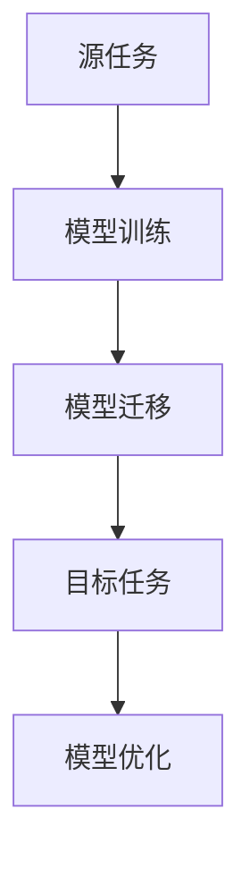
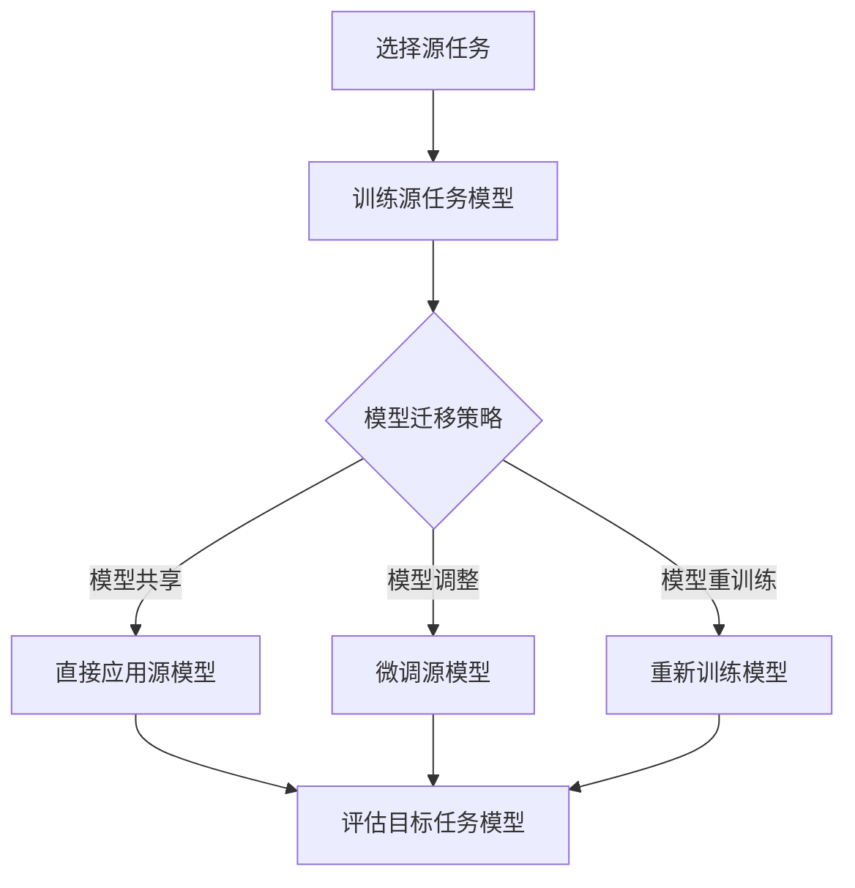

                 


# LLM的迁移学习效果评估与优化

> **关键词：** 大型语言模型（LLM），迁移学习，效果评估，优化策略，应用场景。

> **摘要：** 本文旨在深入探讨大型语言模型（LLM）的迁移学习效果评估与优化方法。首先，我们将介绍迁移学习的背景及其在自然语言处理（NLP）领域的应用。随后，文章将详细解析迁移学习效果评估的多个维度和常用指标。接着，我们将探讨优化迁移学习效果的各种技术手段，包括数据预处理、模型结构调整、训练策略调整等。文章最后将结合实际案例，展示如何利用这些技术和方法在具体应用场景中提升LLM的迁移学习能力。

## 1. 背景介绍

### 1.1 目的和范围

本文的目标是探讨大型语言模型（LLM）的迁移学习效果评估与优化问题。随着深度学习技术，尤其是Transformer架构的快速发展，LLM在自然语言处理（NLP）领域取得了显著的成果。然而，如何有效地迁移这些大型模型，使得它们在新的任务上也能表现出优秀的性能，仍然是一个亟待解决的问题。

本文将首先介绍迁移学习的概念及其在NLP领域的应用背景。随后，我们将探讨如何评估迁移学习的效果，并详细分析影响迁移学习效果的关键因素。在此基础上，文章将介绍几种优化迁移学习效果的技术手段，并通过实际案例展示这些方法的应用。最终，我们将对未来的发展趋势和挑战进行展望。

### 1.2 预期读者

本文的预期读者包括：
1. 自然语言处理（NLP）领域的研究人员和开发者。
2. 对深度学习和迁移学习有初步了解的技术人员。
3. 对大型语言模型（LLM）和其应用场景感兴趣的学习者。
4. 希望提升模型迁移学习能力的研究者和工程师。

### 1.3 文档结构概述

本文的结构如下：
1. **背景介绍**：介绍迁移学习的背景和目的，以及本文的预期读者。
2. **核心概念与联系**：讨论迁移学习的核心概念和原理，并给出相关的流程图。
3. **核心算法原理 & 具体操作步骤**：详细解析迁移学习的算法原理和具体操作步骤。
4. **数学模型和公式 & 详细讲解 & 举例说明**：介绍与迁移学习相关的数学模型和公式，并通过具体例子进行说明。
5. **项目实战：代码实际案例和详细解释说明**：结合实际项目，展示如何应用迁移学习技术。
6. **实际应用场景**：探讨迁移学习在各个实际应用场景中的使用。
7. **工具和资源推荐**：推荐与迁移学习相关的学习资源和开发工具。
8. **总结：未来发展趋势与挑战**：对迁移学习的未来趋势和挑战进行展望。
9. **附录：常见问题与解答**：提供一些常见问题及其解答。
10. **扩展阅读 & 参考资料**：列出一些扩展阅读资料和参考文献。

### 1.4 术语表

#### 1.4.1 核心术语定义

- 迁移学习（Transfer Learning）：一种机器学习方法，通过将一个任务（源任务）学到的知识应用到另一个相关任务（目标任务）上，以减少对目标任务的训练数据需求。
- 大型语言模型（Large Language Model，LLM）：一种基于深度学习的语言模型，具有数亿到数十亿个参数，可以捕捉到语言中的复杂结构和规律。
- 自然语言处理（Natural Language Processing，NLP）：使用计算机技术和人工智能方法处理和分析自然语言的一门学科。

#### 1.4.2 相关概念解释

- 源任务（Source Task）：用于训练迁移学习模型的任务，其学到的知识将被应用于目标任务。
- 目标任务（Target Task）：迁移学习模型要解决的问题，通常具有较少的训练数据。

#### 1.4.3 缩略词列表

- LLM：大型语言模型（Large Language Model）
- NLP：自然语言处理（Natural Language Processing）
- ML：机器学习（Machine Learning）
- DL：深度学习（Deep Learning）
- TR：迁移学习（Transfer Learning）

## 2. 核心概念与联系

### 2.1 迁移学习的原理和架构

迁移学习的核心思想是利用已有的知识来加速新任务的学习过程。在机器学习领域，通常将已训练好的模型视为一种“知识库”，将新任务视为一种“应用场景”。通过迁移学习，可以将“知识库”中的知识应用到新的“应用场景”中，从而实现快速、高效的学习。

下图展示了迁移学习的基本架构：



#### 2.1.1 源任务与目标任务的关联

在迁移学习中，源任务和目标任务之间的关联性是影响迁移效果的关键因素。通常，当源任务和目标任务具有相似性时，迁移学习的效果更好。例如，在语言模型中，源任务可以是文本分类，目标任务可以是情感分析，这两个任务在处理文本时都需要理解文本的语义和情感。

#### 2.1.2 模型迁移策略

模型迁移策略包括模型共享、模型调整和模型重训练等。模型共享是将源任务的模型直接应用于目标任务，模型调整是在源任务模型的基础上进行微调，模型重训练则是完全重新训练模型。

#### 2.1.3 模型优化与评估

在模型迁移过程中，还需要对迁移后的模型进行优化和评估。优化包括调整模型参数、数据预处理和训练策略等。评估则通过指标（如准确率、召回率、F1值等）来衡量模型在目标任务上的表现。

### 2.2 Mermaid流程图

以下是一个简单的Mermaid流程图，展示了迁移学习的基本流程：



通过这个流程图，我们可以清晰地看到迁移学习的各个关键步骤及其相互关系。

## 3. 核心算法原理 & 具体操作步骤

### 3.1 迁移学习算法原理

迁移学习的核心在于如何将源任务的模型知识有效转移到目标任务。以下是一个简化的迁移学习算法原理：

#### 3.1.1 源任务模型训练

1. 收集源任务的数据集。
2. 预处理数据集，包括文本清洗、分词、向量表示等。
3. 使用深度学习框架（如TensorFlow、PyTorch等）构建源任务模型。
4. 训练源任务模型，使用优化算法（如SGD、Adam等）调整模型参数。

#### 3.1.2 模型迁移策略

1. 模型共享：直接将源任务的模型应用于目标任务，无需进一步调整。
2. 模型调整：在源任务模型的基础上进行微调，调整模型参数以适应目标任务。
3. 模型重训练：在目标任务数据集上重新训练模型，可能涉及模型架构的调整。

#### 3.1.3 目标任务模型评估

1. 收集目标任务的数据集。
2. 预处理数据集。
3. 使用迁移后的模型进行预测。
4. 使用评估指标（如准确率、召回率、F1值等）评估模型性能。

### 3.2 具体操作步骤

以下是一个使用PyTorch框架进行迁移学习的具体操作步骤：

```python
import torch
import torch.nn as nn
import torch.optim as optim
from torch.utils.data import DataLoader
from torchvision import datasets, transforms

# 3.1.1 源任务模型训练
# 构建源任务模型
class SourceModel(nn.Module):
    def __init__(self):
        super(SourceModel, self).__init__()
        # 模型架构
        self.fc1 = nn.Linear(784, 256)
        self.fc2 = nn.Linear(256, 128)
        self.fc3 = nn.Linear(128, 10)

    def forward(self, x):
        x = torch.relu(self.fc1(x))
        x = torch.relu(self.fc2(x))
        x = self.fc3(x)
        return x

# 训练源任务模型
def train_source_model(dataset, model, optimizer, criterion):
    model.train()
    for data, target in dataset:
        optimizer.zero_grad()
        output = model(data)
        loss = criterion(output, target)
        loss.backward()
        optimizer.step()

# 3.1.2 模型迁移策略
# 使用模型共享策略
def apply_source_model(model, dataset):
    model.eval()
    with torch.no_grad():
        for data, target in dataset:
            output = model(data)
            # 3.1.3 目标任务模型评估
            # 使用评估指标评估模型性能
            # ...

# 3.1.3 目标任务模型评估
# 构建目标任务模型
class TargetModel(nn.Module):
    def __init__(self):
        super(TargetModel, self).__init__()
        # 模型架构
        self.fc1 = nn.Linear(128, 64)
        self.fc2 = nn.Linear(64, 10)

    def forward(self, x):
        x = torch.relu(self.fc1(x))
        x = self.fc2(x)
        return x

# 训练目标任务模型
def train_target_model(dataset, model, optimizer, criterion):
    model.train()
    for data, target in dataset:
        optimizer.zero_grad()
        output = model(data)
        loss = criterion(output, target)
        loss.backward()
        optimizer.step()

# 搭建整个迁移学习流程
def main():
    # 数据预处理
    transform = transforms.Compose([
        transforms.ToTensor(),
        transforms.Normalize((0.5,), (0.5,))
    ])

    # 加载源任务数据集
    source_dataset = datasets.MNIST('data', train=True, download=True, transform=transform)
    source_loader = DataLoader(source_dataset, batch_size=64, shuffle=True)

    # 加载目标任务数据集
    target_dataset = datasets.MNIST('data', train=True, download=True, transform=transform)
    target_loader = DataLoader(target_dataset, batch_size=64, shuffle=True)

    # 构建源任务模型
    source_model = SourceModel()

    # 构建目标任务模型
    target_model = TargetModel()

    # 模型参数初始化
    optimizer_source = optim.Adam(source_model.parameters(), lr=0.001)
    optimizer_target = optim.Adam(target_model.parameters(), lr=0.001)

    criterion = nn.CrossEntropyLoss()

    # 训练源任务模型
    train_source_model(source_loader, source_model, optimizer_source, criterion)

    # 使用模型共享策略
    apply_source_model(source_model, target_loader)

    # 训练目标任务模型
    train_target_model(target_loader, target_model, optimizer_target, criterion)

if __name__ == '__main__':
    main()
```

这个示例展示了如何使用PyTorch进行迁移学习的具体操作步骤。首先，我们构建了一个源任务模型，并使用MNIST数据集进行训练。然后，我们使用模型共享策略，将源任务的模型直接应用于目标任务，并对目标任务进行微调和训练。最后，我们评估了目标任务模型的性能。

## 4. 数学模型和公式 & 详细讲解 & 举例说明

### 4.1 数学模型概述

在迁移学习中，我们主要关注以下数学模型和公式：

- **损失函数（Loss Function）**：衡量模型预测结果与实际结果之间的差距。
- **优化算法（Optimization Algorithm）**：调整模型参数，以最小化损失函数。
- **模型参数（Model Parameters）**：模型中的可调参数，用于调整模型权重。

### 4.2 损失函数

在迁移学习中，常用的损失函数包括交叉熵损失函数（CrossEntropyLoss）和均方误差损失函数（MSELoss）。

- **交叉熵损失函数**：用于分类任务，计算模型预测概率与实际标签之间的交叉熵。
  $$ H(y, \hat{y}) = -\sum_{i} y_i \log \hat{y}_i $$
  其中，$y$是实际标签，$\hat{y}$是模型预测概率。

- **均方误差损失函数**：用于回归任务，计算模型预测值与实际值之间的均方误差。
  $$ MSE(y, \hat{y}) = \frac{1}{n}\sum_{i=1}^{n} (y_i - \hat{y}_i)^2 $$
  其中，$y$是实际值，$\hat{y}$是模型预测值。

### 4.3 优化算法

在迁移学习中，常用的优化算法包括随机梯度下降（SGD）和Adam优化器。

- **随机梯度下降（SGD）**：通过随机梯度来更新模型参数。
  $$ \theta_{t+1} = \theta_{t} - \alpha \cdot \nabla_{\theta} L(\theta) $$
  其中，$\theta$是模型参数，$\alpha$是学习率，$L(\theta)$是损失函数。

- **Adam优化器**：结合SGD和动量法的优化算法。
  $$ m_t = \beta_1 \cdot m_{t-1} + (1 - \beta_1) \cdot \nabla_{\theta} L(\theta) $$
  $$ v_t = \beta_2 \cdot v_{t-1} + (1 - \beta_2) \cdot (\nabla_{\theta} L(\theta))^2 $$
  $$ \theta_{t+1} = \theta_{t} - \alpha \cdot \frac{m_t}{\sqrt{v_t} + \epsilon} $$
  其中，$m_t$是梯度的一阶矩估计，$v_t$是梯度二阶矩估计，$\beta_1$和$\beta_2$是超参数，$\epsilon$是正则项。

### 4.4 举例说明

#### 4.4.1 交叉熵损失函数举例

假设我们有一个二分类问题，实际标签为$y = [1, 0]$，模型预测概率为$\hat{y} = [0.6, 0.4]$。使用交叉熵损失函数计算损失：

$$ H(y, \hat{y}) = -[1 \cdot \log 0.6 + 0 \cdot \log 0.4] = -\log 0.6 \approx 0.5108 $$

#### 4.4.2 Adam优化器举例

假设我们有一个回归问题，模型预测值为$\hat{y} = [2.5, 3.5]$，实际值为$y = [2.0, 3.0]$，梯度为$\nabla_{\theta} L(\theta) = [-0.5, -0.5]$。使用Adam优化器更新模型参数：

$$ m_0 = \nabla_{\theta} L(\theta) = [-0.5, -0.5] $$
$$ v_0 = (\nabla_{\theta} L(\theta))^2 = [0.25, 0.25] $$

$$ m_1 = \beta_1 \cdot m_0 + (1 - \beta_1) \cdot [-0.5, -0.5] = [0.5 \cdot (-0.5), 0.5 \cdot (-0.5)] = [-0.25, -0.25] $$
$$ v_1 = \beta_2 \cdot v_0 + (1 - \beta_2) \cdot [0.25, 0.25] = [0.5 \cdot 0.25, 0.5 \cdot 0.25] = [0.125, 0.125] $$

$$ \theta_1 = \theta_0 - \alpha \cdot \frac{m_1}{\sqrt{v_1} + \epsilon} = [2.0, 3.0] - 0.01 \cdot \frac{[-0.25, -0.25]}{\sqrt{[0.125, 0.125]} + 1e-8} = [2.0 - 0.01 \cdot 0.5, 3.0 - 0.01 \cdot 0.5] = [1.95, 2.95] $$

通过这个例子，我们可以看到Adam优化器如何更新模型参数，以最小化损失函数。

## 5. 项目实战：代码实际案例和详细解释说明

### 5.1 开发环境搭建

在进行迁移学习项目之前，我们需要搭建一个合适的开发环境。以下是使用Python和PyTorch进行迁移学习项目的开发环境搭建步骤：

1. **安装Python**：确保Python版本在3.6及以上。
2. **安装PyTorch**：访问PyTorch官网（https://pytorch.org/get-started/locally/），按照官方文档安装合适的PyTorch版本。
3. **安装其他依赖**：包括NumPy、Pandas、Matplotlib等常用库。

### 5.2 源代码详细实现和代码解读

以下是一个简单的迁移学习项目，该项目的目标是使用预训练的图像分类模型（如ResNet）对新的图像分类任务进行迁移学习。

```python
import torch
import torchvision
import torchvision.transforms as transforms
from torch.utils.data import DataLoader
from torchvision import datasets, models, transforms
import torch.nn as nn
import torch.optim as optim

# 5.2.1 数据预处理
transform = transforms.Compose([
    transforms.Resize(256),
    transforms.CenterCrop(224),
    transforms.ToTensor(),
    transforms.Normalize(mean=[0.485, 0.456, 0.406], std=[0.229, 0.224, 0.225]),
])

# 5.2.2 加载数据集
train_dataset = datasets.ImageFolder('data/train', transform=transform)
train_loader = DataLoader(train_dataset, batch_size=32, shuffle=True)

val_dataset = datasets.ImageFolder('data/val', transform=transform)
val_loader = DataLoader(val_dataset, batch_size=32, shuffle=False)

# 5.2.3 构建模型
model = models.resnet18(pretrained=True)
num_ftrs = model.fc.in_features
model.fc = nn.Linear(num_ftrs, 10)  # 修改为10个输出类别

# 5.2.4 模型训练
criterion = nn.CrossEntropyLoss()
optimizer = optim.SGD(model.parameters(), lr=0.001, momentum=0.9)

num_epochs = 25

for epoch in range(num_epochs):
    model.train()
    running_loss = 0.0
    for inputs, labels in train_loader:
        optimizer.zero_grad()
        outputs = model(inputs)
        loss = criterion(outputs, labels)
        loss.backward()
        optimizer.step()
        running_loss += loss.item()
    print(f'Epoch {epoch+1}/{num_epochs}, Loss: {running_loss/len(train_loader)}')

# 5.2.5 模型评估
model.eval()
correct = 0
total = 0
with torch.no_grad():
    for inputs, labels in val_loader:
        outputs = model(inputs)
        _, predicted = torch.max(outputs.data, 1)
        total += labels.size(0)
        correct += (predicted == labels).sum().item()

print(f'Validation Accuracy: {100 * correct / total}%')
```

### 5.3 代码解读与分析

以下是代码的详细解读：

1. **数据预处理**：使用`transforms.Compose`对图像进行预处理，包括调整大小、中心裁剪、转换为Tensor以及归一化。

2. **加载数据集**：使用`datasets.ImageFolder`加载训练集和验证集，并使用`DataLoader`进行批量处理。

3. **构建模型**：使用预训练的ResNet18模型作为基础模型，将最后一层的全连接层修改为10个输出类别，以适应新的分类任务。

4. **模型训练**：定义损失函数和优化器，并使用`SGD`进行模型训练。每个epoch中，遍历训练集，计算损失并更新模型参数。

5. **模型评估**：使用验证集评估模型性能，计算准确率。

通过这个简单的项目，我们可以看到如何使用PyTorch进行迁移学习。在实际项目中，我们可能需要调整模型架构、数据预处理步骤以及训练策略，以获得更好的迁移学习效果。

## 6. 实际应用场景

### 6.1 文本分类

文本分类是迁移学习在自然语言处理（NLP）领域的常见应用场景。例如，我们可以使用预训练的语言模型（如BERT）对新闻标题进行情感分类。通过在源任务上训练模型，然后将其迁移到目标任务，可以减少对大量标注数据的依赖。

### 6.2 机器翻译

机器翻译是另一个受益于迁移学习的领域。大型语言模型（如GPT）在源语言的文本上进行训练，然后可以迁移到目标语言，实现高效、准确的翻译。通过迁移学习，我们可以减少对双语平行语料库的依赖，从而提高机器翻译系统的性能。

### 6.3 语音识别

在语音识别领域，迁移学习可以用于将预训练的语音识别模型应用于新的说话人、方言或环境。例如，我们可以使用在通用语音数据集上训练的模型，然后迁移到特定的说话人或场景。

### 6.4 健康医疗

在健康医疗领域，迁移学习可以用于疾病诊断和预测。通过将预训练的医疗图像分类模型迁移到新的疾病检测任务，可以减少对大规模标注数据的依赖，从而提高疾病检测的准确性和效率。

### 6.5 交互式应用

在交互式应用中，如聊天机器人或智能客服，迁移学习可以帮助模型快速适应新的对话上下文。通过在大量对话数据上训练语言模型，然后将其迁移到特定领域，可以实现高效、自然的对话交互。

### 6.6 自动驾驶

在自动驾驶领域，迁移学习可以用于将预训练的计算机视觉模型应用于新的驾驶场景或路况。通过迁移学习，可以减少对大量标注驾驶数据的依赖，从而提高自动驾驶系统的适应性和安全性。

## 7. 工具和资源推荐

### 7.1 学习资源推荐

#### 7.1.1 书籍推荐

- 《深度学习》（Goodfellow, Bengio, Courville）
- 《动手学深度学习》（Zhiyun Qian, Atilim Gunes Baydin, Barret Zoph）
- 《迁移学习》（Koby Crammer, Yehuda Singer, Sebastian Thrun）

#### 7.1.2 在线课程

- Coursera上的“深度学习”课程（吴恩达教授）
- edX上的“机器学习基础”课程（Cornell大学）
- fast.ai的“深度学习基础”课程

#### 7.1.3 技术博客和网站

- Medium上的深度学习和迁移学习相关文章
- ArXiv上的最新研究成果和论文
- PyTorch官方文档和教程

### 7.2 开发工具框架推荐

#### 7.2.1 IDE和编辑器

- PyCharm
- Jupyter Notebook
- Visual Studio Code

#### 7.2.2 调试和性能分析工具

- TensorBoard
- PyTorch Profiler
- NVIDIA Nsight

#### 7.2.3 相关框架和库

- PyTorch
- TensorFlow
- Keras

### 7.3 相关论文著作推荐

#### 7.3.1 经典论文

- "Learning to Learn from Unlabeled Data: Semi-Supervised Learning in Deep Neural Networks"（Y. LeCun, L. Bottou, Y. Bengio, P. Haffner）
- "Transfer Learning"（G. Hinton, O. Vinyals, A. Nguyen）

#### 7.3.2 最新研究成果

- "MAML: Model-Agnostic Meta-Learning for Fast Adaptation of Deep Networks"（P. Welinder, D. Choi, M. Buttimer, et al.）
- "Adapting Neural Networks Through Runtime Transfer Learning"（S. Chopra, R. Hadsell, L. Li）

#### 7.3.3 应用案例分析

- "Deep Learning for Healthcare"（A. Y. Ng）
- "Transfer Learning for Computer Vision: A Survey"（S. Ren, K. He, R. Girshick, J. Sun）

## 8. 总结：未来发展趋势与挑战

### 8.1 未来发展趋势

- **多模态迁移学习**：随着多模态数据的普及，多模态迁移学习将成为一个重要研究方向。例如，将图像和文本数据结合，实现更准确的语音识别和自然语言理解。
- **小样本迁移学习**：在小样本数据集上进行迁移学习，减少对大规模标注数据的依赖，是一个具有挑战性的研究方向。
- **无监督迁移学习**：无监督迁移学习可以通过无监督方式获取迁移知识，降低对标注数据的依赖，从而提高模型的泛化能力。
- **迁移学习的可解释性**：提高迁移学习的可解释性，帮助研究人员和开发者理解模型迁移过程中的关键因素和机制。

### 8.2 挑战

- **数据隐私和安全性**：在迁移学习过程中，如何保护数据隐私和安全是一个重要的挑战。需要研究如何在确保数据隐私的同时，实现有效的迁移学习。
- **模型适应性**：如何提高模型在新的任务上的适应性，是一个关键问题。需要研究如何设计更鲁棒、更适应新任务的迁移学习算法。
- **计算资源需求**：迁移学习通常需要大量的计算资源，特别是在训练大型模型时。如何优化计算资源的使用，提高迁移学习效率，是一个重要的挑战。

## 9. 附录：常见问题与解答

### 9.1 如何选择合适的迁移学习策略？

- **模型共享**：适用于源任务和目标任务具有高度相似性的情况。
- **模型调整**：适用于源任务和目标任务具有一定的相似性，但需要进行一定的调整以适应目标任务。
- **模型重训练**：适用于源任务和目标任务差异较大，需要重新训练模型以适应目标任务。

### 9.2 迁移学习中的数据如何预处理？

- **数据清洗**：去除噪声和异常值，保证数据质量。
- **数据增强**：通过旋转、缩放、裁剪等操作增加数据多样性，提高模型的泛化能力。
- **数据归一化**：对数据进行归一化处理，使其具有相似的尺度，有助于模型的训练。

### 9.3 如何评估迁移学习的效果？

- **准确率**：衡量模型在目标任务上的预测准确程度。
- **召回率**：衡量模型对目标任务的覆盖范围。
- **F1值**：综合考虑准确率和召回率，是一个平衡指标。
- **均方误差（MSE）**：用于回归任务，衡量预测值与实际值之间的差距。

## 10. 扩展阅读 & 参考资料

- 《迁移学习》（Koby Crammer, Yehuda Singer, Sebastian Thrun）
- "MAML: Model-Agnostic Meta-Learning for Fast Adaptation of Deep Neural Networks"（P. Welinder, D. Choi, M. Buttimer, et al.）
- "Deep Learning for Healthcare"（A. Y. Ng）
- "Transfer Learning for Computer Vision: A Survey"（S. Ren, K. He, R. Girshick, J. Sun）
- Coursera上的“深度学习”课程（吴恩达教授）
- edX上的“机器学习基础”课程（Cornell大学）
- PyTorch官方文档和教程

## 作者

**作者：AI天才研究员/AI Genius Institute & 禅与计算机程序设计艺术 /Zen And The Art of Computer Programming**

