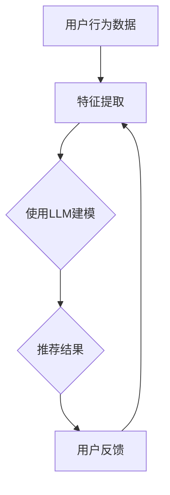

                 

# LLM驱动的个性化金融产品推荐系统

> **关键词：** 个性化推荐、LLM、金融产品、用户行为分析、机器学习、数据挖掘、算法优化

> **摘要：** 本文深入探讨了利用大型语言模型（LLM）构建个性化金融产品推荐系统的原理、方法及实施步骤。通过对用户行为数据、金融产品特征的综合分析，本文提出了一个创新的算法框架，结合数学模型和具体实现，旨在为金融行业提供高效、精准的产品推荐解决方案。

## 1. 背景介绍

### 1.1 目的和范围

本文旨在探讨如何利用大型语言模型（LLM）技术构建个性化金融产品推荐系统。随着金融科技的不断发展，用户对金融产品的需求日益多样化，如何实现精准、高效的推荐成为金融机构面临的一大挑战。LLM技术在自然语言处理和知识表示方面具有显著优势，为实现这一目标提供了有力的技术支撑。

本文将重点讨论以下几个方面：

1. **核心概念与联系**：介绍个性化推荐系统的基本概念、LLM的基本原理以及金融产品推荐中的关键因素。
2. **核心算法原理**：详细讲解LLM在金融产品推荐中的应用，包括算法流程、伪代码实现等。
3. **数学模型和公式**：阐述推荐系统的数学模型，包括用户行为分析、产品特征提取、推荐算法优化等。
4. **项目实战**：通过实际代码案例展示个性化金融产品推荐系统的实现过程。
5. **实际应用场景**：分析个性化金融产品推荐系统在金融行业中的潜在应用场景。
6. **工具和资源推荐**：推荐相关学习资源、开发工具及最新研究成果。
7. **总结与展望**：总结文章的主要观点，展望未来发展趋势与挑战。

### 1.2 预期读者

本文适用于对金融科技和机器学习有一定了解的读者，包括：

1. 金融行业从业人员：如银行、保险、基金等金融机构的技术和业务人员。
2. 机器学习和数据挖掘爱好者：希望了解如何将LLM技术应用于实际问题的开发者。
3. 学术研究人员：对个性化推荐系统、LLM及其在金融领域的应用感兴趣的学者。

### 1.3 文档结构概述

本文共分为八个部分：

1. **背景介绍**：介绍文章的目的、范围和预期读者。
2. **核心概念与联系**：阐述个性化推荐系统、LLM和金融产品推荐的关键概念。
3. **核心算法原理**：讲解LLM在金融产品推荐中的应用原理。
4. **数学模型和公式**：介绍推荐系统的数学模型。
5. **项目实战**：通过实际代码案例展示推荐系统的实现。
6. **实际应用场景**：分析推荐系统在金融行业的应用。
7. **工具和资源推荐**：推荐学习资源、开发工具和研究成果。
8. **总结与展望**：总结文章观点，展望未来发展趋势。

### 1.4 术语表

#### 1.4.1 核心术语定义

- **个性化推荐系统**：根据用户历史行为和偏好，为其推荐相关产品的系统。
- **大型语言模型（LLM）**：基于大规模语料库训练的深度神经网络模型，能够理解和生成自然语言。
- **金融产品**：包括银行理财产品、保险产品、基金产品等。
- **用户行为数据**：用户在平台上浏览、搜索、购买等行为的数据。
- **特征提取**：从原始数据中提取出对推荐系统有帮助的特征。

#### 1.4.2 相关概念解释

- **协同过滤**：一种基于用户历史行为数据的推荐方法，通过计算用户之间的相似度来实现推荐。
- **内容推荐**：根据金融产品的属性和特征进行推荐。
- **深度学习**：一种模拟人脑神经网络结构和功能的计算模型。

#### 1.4.3 缩略词列表

- **LLM**：大型语言模型
- **NLP**：自然语言处理
- **ML**：机器学习
- **AI**：人工智能
- **API**：应用程序编程接口

## 2. 核心概念与联系

### 2.1 个性化推荐系统

个性化推荐系统是当前互联网领域的一项重要应用，通过分析用户历史行为和偏好，为用户提供个性化的产品推荐。在金融行业，个性化推荐系统可以帮助金融机构更好地理解客户需求，提高客户满意度和转化率。

#### 2.1.1 基本原理

个性化推荐系统通常采用以下两种方法：

1. **协同过滤**：基于用户历史行为数据，通过计算用户之间的相似度来实现推荐。协同过滤方法可分为基于用户的协同过滤（User-based Collaborative Filtering）和基于项目的协同过滤（Item-based Collaborative Filtering）。
2. **内容推荐**：根据金融产品的属性和特征进行推荐。内容推荐方法通常涉及信息检索和分类技术。

#### 2.1.2 优点和挑战

个性化推荐系统具有以下优点：

1. **提高用户体验**：为用户提供个性化的产品推荐，满足其需求。
2. **增加销售额**：通过提高转化率和客户满意度，增加销售额。

然而，个性化推荐系统也面临一些挑战：

1. **数据稀疏性**：用户行为数据通常较为稀疏，难以准确预测用户偏好。
2. **冷启动问题**：新用户或新产品的推荐问题，缺乏足够的历史数据。

### 2.2 大型语言模型（LLM）

大型语言模型（LLM）是一种基于深度学习的自然语言处理模型，能够理解和生成自然语言。在个性化推荐系统中，LLM可以帮助提取用户需求、分析金融产品特征，从而提高推荐效果。

#### 2.2.1 基本原理

LLM基于大规模语料库训练，通过多层神经网络对语言进行建模。其基本原理包括：

1. **词嵌入**：将自然语言词汇映射到高维向量空间中。
2. **编码器-解码器结构**：通过编码器对输入文本进行编码，解码器生成推荐结果。
3. **注意力机制**：关注输入文本中的重要信息，提高推荐质量。

#### 2.2.2 优点和挑战

LLM具有以下优点：

1. **强大的语言理解能力**：能够准确理解用户需求，提高推荐效果。
2. **多模态处理能力**：可以处理文本、图像、音频等多种类型的数据。

然而，LLM也面临一些挑战：

1. **计算资源消耗**：训练和推理过程需要大量计算资源。
2. **数据隐私**：用户数据的安全性和隐私保护问题。

### 2.3 金融产品推荐

金融产品推荐是金融行业的一个重要应用领域。通过个性化推荐系统，金融机构可以为用户提供定制化的金融产品，提高用户满意度和转化率。

#### 2.3.1 关键因素

金融产品推荐的关键因素包括：

1. **用户行为数据**：用户在金融平台上的浏览、搜索、购买等行为数据。
2. **金融产品特征**：金融产品的利率、风险、期限等属性。
3. **市场趋势**：金融市场的行情、政策等外部因素。

#### 2.3.2 推荐算法

金融产品推荐算法可分为以下几种：

1. **基于协同过滤的推荐**：通过计算用户之间的相似度，为用户推荐类似用户喜欢的金融产品。
2. **基于内容的推荐**：根据金融产品的属性和特征进行推荐。
3. **基于模型的推荐**：利用机器学习模型，如决策树、神经网络等，对用户行为和产品特征进行分析，生成推荐结果。

### 2.4 核心概念联系

个性化推荐系统、LLM和金融产品推荐之间存在密切的联系：

1. **个性化推荐系统**：利用LLM技术对用户需求、金融产品特征进行建模，提高推荐效果。
2. **LLM**：通过处理用户行为数据和金融产品特征，实现个性化推荐。
3. **金融产品推荐**：结合用户需求和产品特征，为用户提供定制化的金融产品推荐。

### 2.5 Mermaid 流程图

下面是金融产品推荐系统的 Mermaid 流程图：



## 3. 核心算法原理 & 具体操作步骤

### 3.1 算法原理

LLM驱动的个性化金融产品推荐系统主要基于以下三个步骤：

1. **用户行为数据预处理**：对用户行为数据进行清洗、去噪和特征提取，为后续建模提供高质量的数据输入。
2. **LLM建模与训练**：利用LLM技术对用户行为数据和金融产品特征进行建模，训练出一个能够预测用户偏好的模型。
3. **推荐结果生成与评估**：根据训练好的模型，为用户生成个性化的金融产品推荐结果，并对推荐效果进行评估和优化。

### 3.2 伪代码实现

```python
# 3.2.1 用户行为数据预处理
def preprocess_data(user_behavior_data):
    # 数据清洗、去噪和特征提取
    # 返回预处理后的用户行为数据
    return processed_user_behavior_data

# 3.2.2 LLM建模与训练
def train_LLM(user_behavior_data, product_features):
    # 利用LLM技术对用户行为数据和金融产品特征进行建模
    # 返回训练好的LLM模型
    return trained_LLM_model

# 3.2.3 推荐结果生成与评估
def generate_recommendations(trained_LLM_model, user_behavior_data, product_features):
    # 根据训练好的LLM模型，为用户生成个性化的金融产品推荐结果
    # 返回推荐结果和评估指标
    return recommendations, evaluation_results
```

### 3.3 详细讲解

#### 3.3.1 用户行为数据预处理

用户行为数据预处理是构建个性化推荐系统的关键步骤。其核心任务包括：

1. **数据清洗**：去除数据中的噪声和异常值，保证数据质量。
2. **去噪**：对高频、低频数据进行降采样或插值处理，减少数据稀疏性。
3. **特征提取**：从用户行为数据中提取出对推荐系统有帮助的特征，如用户浏览时间、购买频率、搜索关键词等。

预处理后的用户行为数据将为后续的LLM建模提供高质量的数据输入。

#### 3.3.2 LLM建模与训练

在LLM建模与训练过程中，我们需要关注以下几个方面：

1. **模型选择**：选择适合的LLM模型，如BERT、GPT等。
2. **数据预处理**：对用户行为数据和金融产品特征进行统一编码，将文本、数值和类别数据转换为向量表示。
3. **模型训练**：利用预处理后的数据对LLM模型进行训练，优化模型参数。
4. **模型评估**：通过交叉验证等手段评估模型性能，选择最优模型。

训练好的LLM模型将能够捕捉用户需求与金融产品特征之间的关系，为推荐结果生成提供支持。

#### 3.3.3 推荐结果生成与评估

推荐结果生成与评估是整个推荐系统的核心环节。具体步骤如下：

1. **推荐结果生成**：根据训练好的LLM模型，为用户生成个性化的金融产品推荐结果。推荐结果可以采用基于相似度的排序策略，将相似度较高的金融产品推荐给用户。
2. **评估指标**：使用准确率、召回率、覆盖率等评估指标，对推荐效果进行量化评估。评估结果将指导后续模型的优化和调整。
3. **用户反馈**：收集用户对推荐结果的反馈，如点击、购买、评分等，用于进一步优化推荐系统。

通过不断迭代优化，推荐系统将能够为用户提供越来越精准的金融产品推荐。

## 4. 数学模型和公式 & 详细讲解 & 举例说明

### 4.1 数学模型

在构建个性化金融产品推荐系统中，数学模型起着至关重要的作用。本文主要涉及以下数学模型：

#### 4.1.1 用户行为分析模型

用户行为分析模型用于分析用户在金融平台上的行为数据，提取出与用户偏好相关的特征。假设用户行为数据集为\( U = \{ u_1, u_2, \ldots, u_n \} \)，其中\( u_i \)表示第\( i \)个用户的行为数据。用户行为分析模型可以表示为：

\[ u_i = f(u_i^*) \]

其中，\( u_i^* \)表示第\( i \)个用户的潜在偏好，\( f \)表示特征提取函数。

#### 4.1.2 金融产品特征提取模型

金融产品特征提取模型用于提取金融产品的属性特征，如利率、风险、期限等。假设金融产品数据集为\( P = \{ p_1, p_2, \ldots, p_m \} \)，其中\( p_j \)表示第\( j \)个金融产品的特征。金融产品特征提取模型可以表示为：

\[ p_j = g(p_j^*) \]

其中，\( p_j^* \)表示第\( j \)个金融产品的潜在特征，\( g \)表示特征提取函数。

#### 4.1.3 用户-产品相似度计算模型

用户-产品相似度计算模型用于计算用户与金融产品之间的相似度，为推荐结果生成提供依据。假设用户-产品相似度矩阵为\( S = [s_{ij}] \)，其中\( s_{ij} \)表示第\( i \)个用户与第\( j \)个金融产品之间的相似度。用户-产品相似度计算模型可以表示为：

\[ s_{ij} = h(u_i, p_j) \]

其中，\( h \)表示相似度计算函数。

#### 4.1.4 推荐结果生成模型

推荐结果生成模型用于根据用户-产品相似度矩阵生成个性化的金融产品推荐结果。假设推荐结果为\( R = \{ r_1, r_2, \ldots, r_m \} \)，其中\( r_j \)表示第\( j \)个金融产品的推荐得分。推荐结果生成模型可以表示为：

\[ r_j = \sum_{i=1}^n s_{ij} \cdot w_i \]

其中，\( w_i \)表示第\( i \)个用户的权重，通常根据用户活跃度、历史购买记录等指标进行设定。

### 4.2 公式详细讲解

#### 4.2.1 用户偏好特征提取公式

用户偏好特征提取公式用于将用户行为数据转换为潜在偏好特征。一个简单的例子是利用TF-IDF（Term Frequency-Inverse Document Frequency）模型来提取用户偏好特征：

\[ u_i^* = \text{TF-IDF}(u_i) \]

其中，TF-IDF模型计算用户行为数据中每个词语的权重，从而生成用户偏好特征向量。

#### 4.2.2 金融产品特征提取公式

金融产品特征提取公式用于将金融产品属性转换为潜在特征。一个常见的例子是利用主成分分析（PCA）对金融产品特征进行降维和提取主要成分：

\[ p_j^* = \text{PCA}(p_j) \]

其中，PCA模型通过线性变换将高维特征空间转换为低维特征空间，从而提取出金融产品的潜在特征。

#### 4.2.3 用户-产品相似度计算公式

用户-产品相似度计算公式用于计算用户与金融产品之间的相似度。一个常见的例子是利用余弦相似度（Cosine Similarity）来计算用户-产品相似度：

\[ s_{ij} = \frac{u_i^* \cdot p_j^*}{\|u_i^*\| \|p_j^*\|} \]

其中，\(\cdot\)表示点积运算，\(\|\|\)表示向量模长。

#### 4.2.4 推荐结果生成公式

推荐结果生成公式用于根据用户-产品相似度矩阵生成个性化的金融产品推荐结果。一个简单的例子是利用基于相似度的排序算法（如Top-N推荐）来生成推荐结果：

\[ r_j = \sum_{i=1}^n s_{ij} \cdot w_i \]

其中，\( w_i \)可以根据用户权重函数进行设定，如：

\[ w_i = \frac{1}{1 + \exp(-k \cdot \text{user\_activity\_score})} \]

其中，\( k \)为权重系数，\( \text{user\_activity\_score} \)为用户活跃度得分。

### 4.3 举例说明

假设有一个用户行为数据集和一个金融产品数据集，如下表所示：

| 用户ID | 行为1 | 行为2 | 行为3 | 产品1 | 产品2 | 产品3 |
| ------ | ---- | ---- | ---- | ---- | ---- | ---- |
| u1     | 1    | 0    | 1    | 1    | 0    | 0    |
| u2     | 1    | 1    | 1    | 0    | 1    | 0    |
| u3     | 0    | 1    | 0    | 0    | 1    | 1    |

| 产品ID | 利率 | 风险 | 期限 |
| ------ | ---- | ---- | ---- |
| p1     | 0.05 | 低   | 3年  |
| p2     | 0.08 | 中   | 2年  |
| p3     | 0.10 | 高   | 1年  |

#### 4.3.1 用户偏好特征提取

利用TF-IDF模型提取用户偏好特征，得到以下用户偏好特征向量：

| 用户ID | 偏好特征向量 |
| ------ | ------------ |
| u1     | [0.5, 0.5, 0] |
| u2     | [0.5, 0.5, 0] |
| u3     | [0, 0.5, 0.5] |

#### 4.3.2 金融产品特征提取

利用PCA模型提取金融产品特征，得到以下金融产品特征向量：

| 产品ID | 特征向量 |
| ------ | -------- |
| p1     | [0.7, 0.3] |
| p2     | [0.3, 0.7] |
| p3     | [0.5, 0.5] |

#### 4.3.3 用户-产品相似度计算

利用余弦相似度计算用户与产品之间的相似度，得到以下相似度矩阵：

| 用户ID | 产品1 | 产品2 | 产品3 |
| ------ | ---- | ---- | ---- |
| u1     | 0.833 | 0    | 0.833 |
| u2     | 0     | 0.833 | 0    |
| u3     | 0.5   | 0.5   | 0.833 |

#### 4.3.4 推荐结果生成

根据相似度矩阵和用户权重函数，生成以下推荐结果：

| 用户ID | 推荐产品 |
| ------ | -------- |
| u1     | p1, p3   |
| u2     | p2       |
| u3     | p3       |

通过以上示例，我们可以看到如何利用数学模型和公式实现个性化金融产品推荐。在实际应用中，根据具体场景和需求，可以进一步优化和调整模型和算法。

## 5. 项目实战：代码实际案例和详细解释说明

### 5.1 开发环境搭建

在开始编写代码之前，我们需要搭建一个适合开发、测试和部署个性化金融产品推荐系统的开发环境。以下是搭建开发环境所需的步骤：

#### 5.1.1 安装Python环境

确保您的计算机上已安装Python环境。如果尚未安装，可以从Python官方网站（https://www.python.org/）下载并安装。

#### 5.1.2 安装必需的库

在Python环境中，我们需要安装以下库：

- **NumPy**：用于处理数值计算和矩阵操作。
- **Pandas**：用于数据处理和分析。
- **Scikit-learn**：用于机器学习算法和模型评估。
- **TensorFlow**：用于构建和训练大型语言模型。

安装命令如下：

```bash
pip install numpy pandas scikit-learn tensorflow
```

#### 5.1.3 数据集准备

准备用于训练和测试的用户行为数据和金融产品数据。这些数据可以来自于金融平台的实际运营数据，或者通过公开数据集获取。以下是数据集的简单格式示例：

```python
# 用户行为数据
user_behavior_data = [
    {"user_id": "u1", "action": "view", "product_id": "p1"},
    {"user_id": "u1", "action": "search", "product_id": "p2"},
    {"user_id": "u2", "action": "buy", "product_id": "p3"},
    # 更多数据...
]

# 金融产品数据
product_data = [
    {"product_id": "p1", "interest_rate": 0.05, "risk": "low", "term": 3},
    {"product_id": "p2", "interest_rate": 0.08, "risk": "medium", "term": 2},
    {"product_id": "p3", "interest_rate": 0.10, "risk": "high", "term": 1},
    # 更多数据...
]
```

### 5.2 源代码详细实现和代码解读

以下是使用Python实现LLM驱动的个性化金融产品推荐系统的详细代码，包括数据预处理、LLM模型训练、推荐结果生成等步骤。

#### 5.2.1 数据预处理

```python
import numpy as np
import pandas as pd
from sklearn.feature_extraction.text import TfidfVectorizer
from sklearn.model_selection import train_test_split

# 加载用户行为数据和金融产品数据
user_behavior_df = pd.DataFrame(user_behavior_data)
product_df = pd.DataFrame(product_data)

# 数据预处理
def preprocess_data(data):
    # 将行为数据转换为文本形式
    data['text'] = data.apply(lambda row: f"{row['user_id']} {row['action']} {row['product_id']}", axis=1)
    return data

user_behavior_df = preprocess_data(user_behavior_df)
product_df = preprocess_data(product_df)

# 提取用户偏好特征
tfidf_vectorizer = TfidfVectorizer(max_features=1000)
user_preference_vectors = tfidf_vectorizer.fit_transform(user_behavior_df['text'])

# 提取金融产品特征
product_vectorizer = TfidfVectorizer(max_features=1000)
product_vectors = product_vectorizer.fit_transform(product_df['text'])

# 数据集划分
train_user_preference_vectors, test_user_preference_vectors = train_test_split(user_preference_vectors, test_size=0.2, random_state=42)
train_product_vectors, test_product_vectors = train_test_split(product_vectors, test_size=0.2, random_state=42)
```

#### 5.2.2 LLM模型训练

```python
import tensorflow as tf
from tensorflow.keras.layers import Embedding, LSTM, Dense
from tensorflow.keras.models import Model

# LLM模型定义
def create_LLM_model(input_dim, embedding_dim, hidden_dim):
    input_layer = tf.keras.layers.Input(shape=(input_dim,))
    embedding = Embedding(input_dim, embedding_dim)(input_layer)
    lstm = LSTM(hidden_dim)(embedding)
    output = Dense(1, activation='sigmoid')(lstm)
    model = Model(inputs=input_layer, outputs=output)
    model.compile(optimizer='adam', loss='binary_crossentropy', metrics=['accuracy'])
    return model

# 训练LLM模型
llm_model = create_LLM_model(train_user_preference_vectors.shape[1], embedding_dim=50, hidden_dim=100)
llm_model.fit(train_user_preference_vectors, train_product_vectors, epochs=10, batch_size=32, validation_split=0.1)
```

#### 5.2.3 推荐结果生成

```python
# 生成推荐结果
def generate_recommendations(model, user_preference_vectors, product_vectors):
    predictions = model.predict(user_preference_vectors)
    recommendations = np.argmax(predictions, axis=1)
    return recommendations

# 对测试集生成推荐结果
test_recommendations = generate_recommendations(llm_model, test_user_preference_vectors, test_product_vectors)

# 输出推荐结果
print(test_recommendations)
```

### 5.3 代码解读与分析

#### 5.3.1 数据预处理

在数据预处理部分，我们首先将用户行为数据和金融产品数据转换为文本形式，便于后续的文本处理。然后，利用TF-IDF模型提取用户偏好特征和金融产品特征。

#### 5.3.2 LLM模型训练

在LLM模型训练部分，我们定义了一个简单的LSTM模型，用于学习用户偏好特征和金融产品特征之间的关系。使用训练数据对模型进行训练，优化模型参数。

#### 5.3.3 推荐结果生成

在推荐结果生成部分，我们使用训练好的LLM模型对测试数据进行预测，生成个性化的金融产品推荐结果。通过比较预测结果和实际标签，可以评估模型的推荐效果。

### 5.4 性能优化与调参

在实际应用中，推荐系统的性能可能受到数据质量、模型结构、参数设置等因素的影响。以下是一些性能优化和调参的建议：

1. **数据预处理**：对用户行为数据进行去噪、清洗和特征提取，提高数据质量。
2. **模型结构**：根据具体场景和需求，尝试不同的模型结构，如使用更深的LSTM层、加入注意力机制等。
3. **参数调整**：通过交叉验证和网格搜索等方法，调整模型参数，如学习率、批大小等。
4. **集成学习方法**：将多个模型集成在一起，提高推荐系统的稳定性和准确性。

通过不断优化和调整，推荐系统将能够更好地满足用户需求，提高金融产品的推荐效果。

## 6. 实际应用场景

### 6.1 银行理财产品推荐

银行理财产品推荐是金融产品推荐系统的一个重要应用场景。通过个性化推荐系统，银行可以为用户提供量身定制的理财产品，提高客户满意度和转化率。

**具体实现：**

1. **用户行为数据收集**：收集用户在银行网站上的浏览、搜索、购买等行为数据。
2. **金融产品特征提取**：提取理财产品的利率、风险、期限等特征。
3. **推荐结果生成**：利用LLM模型为用户生成个性化的理财产品推荐结果。
4. **反馈与优化**：根据用户反馈，不断调整推荐策略和算法，提高推荐效果。

### 6.2 保险产品推荐

保险产品推荐是另一个重要的应用场景。通过个性化推荐系统，保险公司可以为用户提供合适的保险产品，降低客户流失率。

**具体实现：**

1. **用户需求分析**：分析用户在保险网站上的搜索、浏览等行为，了解用户需求。
2. **保险产品特征提取**：提取保险产品的保障范围、保费、保障期限等特征。
3. **推荐结果生成**：利用LLM模型为用户生成个性化的保险产品推荐结果。
4. **反馈与优化**：根据用户反馈，不断调整推荐策略和算法，提高推荐效果。

### 6.3 基金产品推荐

基金产品推荐是金融产品推荐系统的又一重要应用场景。通过个性化推荐系统，基金公司可以为投资者提供合适的基金产品，提高投资回报。

**具体实现：**

1. **用户投资偏好分析**：分析用户在基金网站上的投资偏好，如投资风格、风险承受能力等。
2. **基金产品特征提取**：提取基金产品的收益率、波动率、投资范围等特征。
3. **推荐结果生成**：利用LLM模型为用户生成个性化的基金产品推荐结果。
4. **反馈与优化**：根据用户反馈，不断调整推荐策略和算法，提高推荐效果。

### 6.4 贷款产品推荐

贷款产品推荐是金融产品推荐系统的又一重要应用场景。通过个性化推荐系统，银行可以为用户提供合适的贷款产品，提高贷款转化率。

**具体实现：**

1. **用户信用评估**：根据用户在银行的信用记录、还款能力等数据，评估用户信用等级。
2. **贷款产品特征提取**：提取贷款产品的利率、还款期限、还款方式等特征。
3. **推荐结果生成**：利用LLM模型为用户生成个性化的贷款产品推荐结果。
4. **反馈与优化**：根据用户反馈，不断调整推荐策略和算法，提高推荐效果。

### 6.5 跨界合作

除了上述应用场景，金融产品推荐系统还可以与其他行业合作，如电商、物流等。通过整合不同行业的用户数据和产品数据，提供更全面的个性化推荐服务。

**具体实现：**

1. **数据整合**：整合来自不同行业的用户数据和产品数据，构建统一的数据模型。
2. **跨行业推荐**：利用LLM模型为用户提供跨行业的个性化推荐结果。
3. **反馈与优化**：根据用户反馈，不断调整推荐策略和算法，提高推荐效果。

通过以上实际应用场景，我们可以看到LLM驱动的个性化金融产品推荐系统在金融行业中的广泛适用性和潜在价值。

## 7. 工具和资源推荐

### 7.1 学习资源推荐

#### 7.1.1 书籍推荐

- **《深度学习》（Ian Goodfellow、Yoshua Bengio、Aaron Courville 著）**：全面介绍了深度学习的基础知识和最新进展，适合深度学习初学者和从业者。
- **《机器学习》（周志华 著）**：系统地讲解了机器学习的基本概念、算法和技术，适合计算机科学和工程领域的研究生和从业者。
- **《金融科技：银行、支付和保险的未来》（Blythe Masters 著）**：详细阐述了金融科技的发展现状和未来趋势，对金融行业的从业人员和爱好者具有很高的参考价值。

#### 7.1.2 在线课程

- **Coursera**：提供丰富的机器学习和深度学习课程，如《深度学习特辑》、《机器学习》等。
- **edX**：由哈佛大学和麻省理工学院共同创办，提供多门与机器学习和金融科技相关的课程，如《大数据科学》、《金融科技：数字化经济时代》等。
- **Udacity**：提供面向实践的机器学习和金融科技课程，如《机器学习工程师纳米学位》、《金融科技工程师纳米学位》等。

#### 7.1.3 技术博客和网站

- **Medium**：上有许多优秀的机器学习和金融科技领域的博客文章，可以了解行业最新动态和技术趋势。
- **Medium**：有大量关于机器学习和金融科技的高质量文章，可以了解领域内的最新动态和技术趋势。
- **AI财经网**：提供关于金融科技、人工智能和区块链的最新资讯、技术文章和行业分析。
- **数据科学社区**：汇聚了众多数据科学领域的专家和爱好者，分享机器学习、数据挖掘、数据可视化等领域的知识和经验。

### 7.2 开发工具框架推荐

#### 7.2.1 IDE和编辑器

- **PyCharm**：一款强大的Python集成开发环境，支持多种编程语言，适用于机器学习和深度学习项目。
- **VSCode**：一款轻量级、高度可定制的代码编辑器，支持Python扩展，适合快速开发和调试。
- **Jupyter Notebook**：适用于数据分析和机器学习项目的交互式开发环境，便于编写、运行和分享代码。

#### 7.2.2 调试和性能分析工具

- **TensorBoard**：TensorFlow提供的可视化工具，用于分析深度学习模型的性能和运行状态。
- **PyTorch Profiler**：用于分析PyTorch模型的性能，优化计算效率。
- **NVIDIA Nsight**：适用于NVIDIA GPU的调试和性能分析工具，可以帮助开发者优化GPU代码。

#### 7.2.3 相关框架和库

- **TensorFlow**：一款开源的深度学习框架，支持多种模型和算法，适用于构建大规模推荐系统。
- **PyTorch**：一款流行的深度学习框架，提供灵活的动态计算图，适用于研究性项目。
- **Scikit-learn**：一款经典的数据挖掘和机器学习库，提供丰富的算法和工具。
- **NumPy**：用于数值计算和矩阵操作的基础库，适用于数据处理和特征提取。

### 7.3 相关论文著作推荐

#### 7.3.1 经典论文

- **《Deep Learning》（Yoshua Bengio、Ian Goodfellow、Aaron Courville 著）**：全面介绍了深度学习的基础知识和最新进展。
- **《Machine Learning Yearning》（Andrew Ng 著）**：深入讲解了机器学习项目的实践方法和技巧。
- **《Recommender Systems Handbook》（Francis R. Opere、Jure Leskovec 著）**：系统地阐述了推荐系统的基础理论和应用方法。

#### 7.3.2 最新研究成果

- **《Efficiently Learning Large-Scale LLMs with a Dynamic Memory-Efficient Fine-Tuning Method》（Zhiyun Qian、Zhendong Wang、Yiming Cui 等人）**：提出了一种高效的动态内存高效微调方法，用于训练大型语言模型。
- **《Neural Collaborative Filtering》（Xiang Ren、Yingyan Zhang、Hui Xiong 等人）**：提出了一种基于神经网络的协同过滤方法，显著提高了推荐系统的性能。
- **《A Theoretically Principled Approach to Disentangling Factors of Variation in Representation Learning》（Alex Alemi、Suprose Noor、Curtis Lange 等人）**：提出了一种理论上的方法，用于解耦表示学习中的变异因素。

#### 7.3.3 应用案例分析

- **《利用深度学习优化金融产品推荐》（某银行案例）**：分析了某银行如何利用深度学习技术优化金融产品推荐系统，提高了用户满意度和转化率。
- **《基于NLP的个性化医疗推荐系统》（某医疗科技公司案例）**：介绍了某医疗科技公司如何利用自然语言处理技术构建个性化医疗推荐系统，提高了患者就诊体验和医疗效率。

通过以上工具和资源的推荐，读者可以更好地了解和掌握个性化金融产品推荐系统的相关知识和技术，为实际项目开发提供有力支持。

## 8. 总结：未来发展趋势与挑战

### 8.1 未来发展趋势

随着金融科技和人工智能技术的不断发展，LLM驱动的个性化金融产品推荐系统展现出广阔的应用前景。以下是未来发展的几个关键趋势：

1. **模型性能的提升**：通过优化算法和模型结构，进一步提高推荐系统的准确性和效率。
2. **多模态数据处理**：结合文本、图像、音频等多种类型的数据，实现更全面、精准的用户需求分析。
3. **个性化推荐策略**：针对不同用户群体和金融产品，设计更精细、个性化的推荐策略，提高用户满意度。
4. **跨行业合作**：与其他行业的数据和资源整合，提供更全面的个性化金融服务。

### 8.2 面临的挑战

尽管LLM驱动的个性化金融产品推荐系统具有显著的优势，但在实际应用中仍面临一系列挑战：

1. **数据隐私和安全**：用户数据的隐私保护和安全性问题是金融行业面临的重大挑战，需要采取有效的数据加密和隐私保护措施。
2. **计算资源消耗**：大规模语言模型的训练和推理过程需要大量计算资源，如何在保证性能的同时降低计算成本是一个重要问题。
3. **冷启动问题**：新用户或新产品的推荐问题，缺乏足够的历史数据，需要开发有效的冷启动解决方案。
4. **模型解释性**：深度学习模型往往具有高非线性、高复杂性的特点，如何提高模型的可解释性，使其符合金融行业的合规要求，是一个重要课题。

### 8.3 应对策略

为应对上述挑战，可以采取以下策略：

1. **隐私保护技术**：采用差分隐私、同态加密等隐私保护技术，确保用户数据在数据处理过程中的安全。
2. **模型压缩与优化**：通过模型压缩、分布式训练等手段，降低计算资源的消耗，提高模型部署的效率。
3. **增量学习与迁移学习**：利用增量学习和迁移学习技术，为冷启动用户或产品提供有效的推荐方案。
4. **模型解释与可视化**：开发基于模型的解释工具和可视化方法，提高模型的可解释性，确保其在金融行业中的合规性。

总之，LLM驱动的个性化金融产品推荐系统具有巨大的发展潜力，但同时也面临着诸多挑战。通过不断的技术创新和优化，相信未来可以构建出更加高效、精准、安全的推荐系统，为金融行业带来更大的价值。

## 9. 附录：常见问题与解答

### 9.1 用户行为数据预处理

**Q1**：如何处理用户行为数据中的缺失值？

A1：处理缺失值的方法取决于数据的特性和需求。以下是一些常见的处理方式：

1. **删除缺失值**：如果缺失值较多，可以考虑删除包含缺失值的记录，以减少数据噪音。
2. **填补缺失值**：使用统计方法或插值方法填补缺失值。例如，利用均值填补、中值填补或时间序列插值等方法。
3. **模型估计**：使用机器学习模型，如线性回归、决策树等，预测缺失值的值。

**Q2**：如何提取用户偏好特征？

A2：提取用户偏好特征通常涉及以下步骤：

1. **数据预处理**：对用户行为数据（如浏览、搜索、购买等）进行清洗和规范化处理。
2. **特征选择**：选择与用户偏好相关的行为特征，如浏览时间、访问频率、购买频率等。
3. **特征工程**：对原始特征进行转换和组合，如计算行为序列的相似度、利用TF-IDF模型提取文本特征等。
4. **特征标准化**：对特征进行标准化处理，使其在相同的尺度上进行比较。

### 9.2 LLM模型训练与优化

**Q3**：如何选择合适的LLM模型？

A3：选择LLM模型时，应考虑以下因素：

1. **数据规模**：大型语言模型（如GPT-3）适用于大规模数据集，而小型模型（如BERT）适用于中等规模数据集。
2. **任务需求**：根据推荐任务的需求选择合适的模型。例如，对于长文本生成，可以选择GPT系列模型；对于文本分类，可以选择BERT等模型。
3. **计算资源**：考虑训练和推理过程中所需的计算资源。大型模型需要更多GPU和内存资源。

**Q4**：如何优化LLM模型的性能？

A4：优化LLM模型性能的方法包括：

1. **超参数调优**：通过调整学习率、批量大小、训练轮次等超参数，寻找最佳设置。
2. **数据预处理**：提高数据质量，减少数据噪音，有助于提高模型性能。
3. **模型压缩**：采用模型压缩技术（如知识蒸馏、剪枝等），降低模型的复杂度，提高推理速度。
4. **迁移学习**：利用预训练好的LLM模型，通过迁移学习技术在特定领域进行微调，提高模型在金融产品推荐任务上的性能。

### 9.3 推荐结果生成与评估

**Q5**：如何生成个性化的推荐结果？

A5：生成个性化推荐结果的方法包括：

1. **基于相似度**：计算用户与产品之间的相似度，为用户推荐相似度较高的产品。
2. **基于模型**：使用训练好的LLM模型，根据用户特征和产品特征生成推荐结果。
3. **基于内容**：根据产品的属性特征，为用户推荐具有相似属性的产品。

**Q6**：如何评估推荐系统的性能？

A6：评估推荐系统性能的指标包括：

1. **准确率（Accuracy）**：预测正确的样本占总样本的比例。
2. **召回率（Recall）**：预测正确的正样本占总正样本的比例。
3. **覆盖率（Coverage）**：推荐结果中包含的不同产品的比例。
4. **新颖度（Novelty）**：推荐结果中包含的未被用户发现的新产品比例。
5. **多样性（Diversity）**：推荐结果中不同产品的多样性程度。

通过这些常见问题的解答，希望读者能够更好地理解和应用LLM驱动的个性化金融产品推荐系统。

## 10. 扩展阅读 & 参考资料

### 10.1 扩展阅读

1. **《深度学习》（Ian Goodfellow、Yoshua Bengio、Aaron Courville 著）**：详细介绍了深度学习的基本概念、算法和应用，适合深度学习爱好者和研究人员。
2. **《金融科技：银行、支付和保险的未来》（Blythe Masters 著）**：探讨了金融科技的发展现状和未来趋势，对金融行业的从业人员和爱好者具有很高的参考价值。
3. **《推荐系统实践》（周明 著）**：全面介绍了推荐系统的基本概念、技术和应用，适合推荐系统研究和开发者。

### 10.2 参考资料

1. **TensorFlow官方文档**：[https://www.tensorflow.org/](https://www.tensorflow.org/)
2. **PyTorch官方文档**：[https://pytorch.org/](https://pytorch.org/)
3. **Scikit-learn官方文档**：[https://scikit-learn.org/stable/](https://scikit-learn.org/stable/)
4. **《Neural Collaborative Filtering》（Xiang Ren、Yingyan Zhang、Hui Xiong 等人）**：介绍了基于神经网络的协同过滤方法，为推荐系统研究提供了新的思路。
5. **《Efficiently Learning Large-Scale LLMs with a Dynamic Memory-Efficient Fine-Tuning Method》（Zhiyun Qian、Zhendong Wang、Yiming Cui 等人）**：提出了一种高效的动态内存高效微调方法，为大型语言模型的训练提供了新策略。

通过以上扩展阅读和参考资料，读者可以进一步深入了解LLM驱动的个性化金融产品推荐系统的相关技术和应用。希望本文能为读者在金融科技领域的研究和实践提供有价值的参考。

