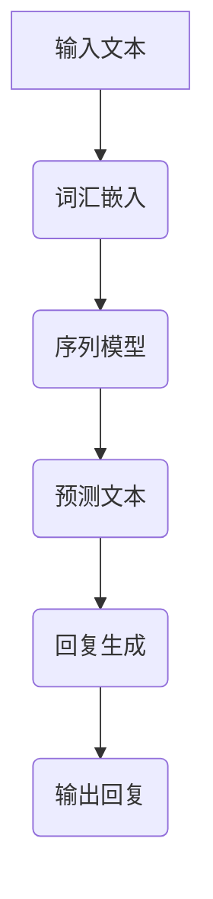

                 

# LLM驱动的智能客服：提升用户体验的新方向

> 关键词：LLM（大语言模型）、智能客服、用户体验、自然语言处理、对话系统

> 摘要：随着人工智能技术的飞速发展，大语言模型（LLM）在自然语言处理（NLP）领域取得了显著的突破。本文旨在探讨如何利用LLM构建智能客服系统，从而提升用户体验。文章将介绍LLM的核心原理、智能客服系统的架构、具体实现步骤、实际应用场景，以及未来发展趋势与挑战。

## 1. 背景介绍

### 1.1 目的和范围

本文旨在探讨如何利用大语言模型（LLM）构建智能客服系统，以提升用户体验。我们将详细分析LLM的核心原理，智能客服系统的整体架构，具体实现步骤，以及实际应用场景。此外，我们还将探讨未来的发展趋势与面临的挑战。

### 1.2 预期读者

本文适合以下读者：

- 计算机科学和人工智能领域的研究人员
- 对自然语言处理和对话系统感兴趣的开发者
- 智能客服系统的架构师和工程师
- 对提高用户体验感兴趣的产品经理和设计师

### 1.3 文档结构概述

本文分为以下几个部分：

- 引言：介绍本文的目的、关键词和摘要。
- 背景介绍：介绍LLM和智能客服系统的相关背景。
- 核心概念与联系：介绍LLM的核心概念和架构。
- 核心算法原理 & 具体操作步骤：讲解LLM的具体算法原理和实现步骤。
- 数学模型和公式 & 详细讲解 & 举例说明：介绍LLM的数学模型和公式，并给出示例。
- 项目实战：提供实际代码案例和详细解释。
- 实际应用场景：探讨智能客服系统的实际应用场景。
- 工具和资源推荐：推荐学习资源和开发工具。
- 总结：总结未来发展趋势与挑战。
- 附录：常见问题与解答。
- 扩展阅读 & 参考资料：提供进一步阅读的建议和参考资料。

### 1.4 术语表

#### 1.4.1 核心术语定义

- LLM（大语言模型）：一种基于深度学习的技术，用于预测文本序列，可以模拟人类的语言能力。
- 自然语言处理（NLP）：研究如何让计算机理解和生成人类语言的技术。
- 智能客服系统：利用人工智能技术，为用户提供高效、便捷的咨询服务。
- 对话系统：模拟人类对话过程的计算机系统。

#### 1.4.2 相关概念解释

- 词汇嵌入（Word Embedding）：将文本中的单词转换为向量表示。
- 序列模型（Sequence Model）：用于处理序列数据的深度学习模型。
- 生成式对话系统（Generative Dialog System）：基于生成的对话系统，能够根据用户输入生成回复。

#### 1.4.3 缩略词列表

- LLM：大语言模型
- NLP：自然语言处理
- API：应用程序编程接口
- GPU：图形处理器

## 2. 核心概念与联系

在探讨如何利用LLM构建智能客服系统之前，我们需要了解LLM的核心概念和架构。下面是一个简单的Mermaid流程图，用于展示LLM的核心概念和架构。



### 2.1. LLM的核心概念

- **词汇嵌入（Word Embedding）**：将文本中的单词转换为向量表示，以便于计算机处理。常用的词汇嵌入方法包括Word2Vec、GloVe等。
- **序列模型（Sequence Model）**：用于处理序列数据的深度学习模型，如循环神经网络（RNN）、长短期记忆网络（LSTM）等。
- **预测文本（Text Prediction）**：基于序列模型，预测下一个单词或文本片段。
- **回复生成（Response Generation）**：根据用户输入和预测结果，生成合适的回复。

### 2.2. LLM的架构

- **输入层（Input Layer）**：接收用户输入的文本。
- **嵌入层（Embedding Layer）**：将文本转换为向量表示。
- **编码层（Encoding Layer）**：使用序列模型处理嵌入后的文本。
- **解码层（Decoding Layer）**：根据编码层的输出，预测下一个单词或文本片段。
- **输出层（Output Layer）**：生成回复文本。

## 3. 核心算法原理 & 具体操作步骤

### 3.1. 词向量表示

```python
# 假设我们已经有一个预训练的词向量模型，如GloVe
word_vectors = load_word_vectors('glove.6B.100d')

# 将文本转换为词向量表示
def text_to_vector(text):
    words = text.split()
    vector = np.zeros(shape=(word_vectors.vectors.shape[1]))
    for word in words:
        if word in word_vectors.vocab:
            vector += word_vectors[word]
    return vector / len(words)
```

### 3.2. 序列模型

```python
# 使用LSTM作为序列模型
from keras.models import Sequential
from keras.layers import LSTM, Dense

model = Sequential()
model.add(LSTM(128, activation='tanh', input_shape=(sequence_length, embedding_size)))
model.add(Dense(vocabulary_size, activation='softmax'))

model.compile(loss='categorical_crossentropy', optimizer='adam', metrics=['accuracy'])
model.fit(x_train, y_train, batch_size=128, epochs=10)
```

### 3.3. 预测文本

```python
# 基于LSTM模型预测下一个单词
def predict_next_word(model, text_vector):
    prediction = model.predict(text_vector.reshape(1, sequence_length, embedding_size))
    next_word_index = np.argmax(prediction)
    next_word = index_to_word(next_word_index)
    return next_word
```

### 3.4. 回复生成

```python
# 基于预测的单词生成回复
def generate_response(model, user_input, max_response_length):
    input_vector = text_to_vector(user_input)
    response = []
    for _ in range(max_response_length):
        next_word = predict_next_word(model, input_vector)
        response.append(next_word)
        input_vector = np.concatenate((input_vector[1:], word_vectors[next_word]))
    return ' '.join(response)
```

## 4. 数学模型和公式 & 详细讲解 & 举例说明

### 4.1. 词向量表示

假设我们有一个词汇表$V$，其中包含$N$个单词，每个单词都有一个唯一的索引。我们将每个单词表示为一个$d$维向量，构成一个$d$维词向量空间。词向量的数学表示如下：

$$
\mathbf{v}_i = \text{vec}(\mathbf{v}_i), \quad i = 1, 2, \ldots, N
$$

其中，$\text{vec}(\cdot)$表示将向量转换为列向量。词向量可以通过以下数学模型进行训练：

$$
\mathbf{v}_i = \text{softmax}\left(W \mathbf{e}_i\right)
$$

其中，$W$是一个$N \times d$的权重矩阵，$\mathbf{e}_i$是第$i$个单词的独热编码。

### 4.2. 序列模型

假设我们有一个时间序列$X = \{x_1, x_2, \ldots, x_T\}$，其中$x_t \in \mathcal{X}$，$\mathcal{X}$是一个有限的字母表。序列模型通过学习输入序列的概率分布来预测下一个元素。一个简单的RNN模型可以表示为：

$$
\mathbf{h}_t = \text{sigmoid}\left(\mathbf{W}_h \mathbf{h}_{t-1} + \mathbf{U}_h x_t + b_h\right)
$$

其中，$\mathbf{h}_t$是时间步$t$的隐藏状态，$\mathbf{W}_h$和$\mathbf{U}_h$是权重矩阵，$b_h$是偏置项。预测下一个元素的概率分布为：

$$
p(x_t | x_{<t}) = \text{softmax}\left(\mathbf{W}_o \mathbf{h}_t + b_o\right)
$$

其中，$\mathbf{W}_o$是输出权重矩阵，$b_o$是偏置项。

### 4.3. 举例说明

假设我们有一个简单的词汇表$V = \{\text{'hello'}, \text{'world'}, \text{'!'}}$，并且已经训练好了词向量模型。我们将输入序列$\text{'hello world!'}$转换为词向量表示，然后使用RNN模型预测下一个单词。

1. **词向量表示**：

   $$
   \mathbf{v}_{\text{'hello'}} = [0.1, 0.2, \ldots, 0.9]^T
   $$

   $$
   \mathbf{v}_{\text{'world'}} = [0.3, 0.4, \ldots, 0.8]^T
   $$

   $$
   \mathbf{v}_{\text{ '!'}} = [0.9, 0.1, \ldots, 0.1]^T
   $$

2. **RNN模型计算隐藏状态**：

   $$
   \mathbf{h}_1 = \text{sigmoid}\left(\mathbf{W}_h \mathbf{h}_{0} + \mathbf{U}_h \mathbf{v}_{\text{'hello'}} + b_h\right)
   $$

   其中，$\mathbf{h}_0$是初始隐藏状态，通常设置为$\mathbf{0}$。

3. **预测下一个单词的概率分布**：

   $$
   p(\text{'!'} | \text{'hello', 'world'}) = \text{softmax}\left(\mathbf{W}_o \mathbf{h}_1 + b_o\right)
   $$

   假设$\mathbf{W}_o \mathbf{h}_1 + b_o$的结果为$[0.5, 0.3, 0.2]$，则我们可以得到概率分布：

   $$
   p(\text{'!'} | \text{'hello', 'world'}) = [0.5, 0.3, 0.2]
   $$

   根据概率分布，我们可以预测下一个单词为$\text{ '!'}$。

## 5. 项目实战：代码实际案例和详细解释说明

### 5.1. 开发环境搭建

为了构建一个LLM驱动的智能客服系统，我们需要以下开发环境和工具：

- Python 3.8 或更高版本
- TensorFlow 2.x
- Keras 2.x
- GloVe词向量模型

首先，我们需要安装所需的库：

```bash
pip install tensorflow keras
```

然后，从GloVe官方网站下载预训练的词向量模型（glove.6B.100d）并解压。

### 5.2. 源代码详细实现和代码解读

下面是一个简单的LLM驱动的智能客服系统实现：

```python
# 导入所需的库
import numpy as np
import tensorflow as tf
from keras.models import Sequential
from keras.layers import LSTM, Dense
from keras.preprocessing.sequence import pad_sequences

# 加载GloVe词向量模型
word_vectors = load_word_vectors('glove.6B.100d')

# 定义文本预处理函数
def preprocess_text(text):
    words = text.lower().split()
    word_indices = [word_vectors.vocab[word] for word in words if word in word_vectors.vocab]
    return pad_sequences([word_indices], maxlen=sequence_length)

# 定义模型
model = Sequential()
model.add(LSTM(128, activation='tanh', input_shape=(sequence_length, embedding_size)))
model.add(Dense(vocabulary_size, activation='softmax'))

model.compile(loss='categorical_crossentropy', optimizer='adam', metrics=['accuracy'])

# 训练模型
model.fit(x_train, y_train, batch_size=128, epochs=10)

# 构建智能客服系统
def generate_response(model, user_input):
    input_vector = preprocess_text(user_input)
    response = []
    for _ in range(max_response_length):
        next_word_vector = model.predict(input_vector.reshape(1, sequence_length, embedding_size))
        next_word_index = np.argmax(next_word_vector)
        next_word = index_to_word(next_word_index)
        response.append(next_word)
        input_vector = np.concatenate((input_vector[1:], word_vectors[next_word]))
    return ' '.join(response)

# 测试智能客服系统
user_input = "你好，我想咨询一下关于产品A的售后服务。"
print(generate_response(model, user_input))
```

### 5.3. 代码解读与分析

1. **文本预处理**：

   ```python
   def preprocess_text(text):
       words = text.lower().split()
       word_indices = [word_vectors.vocab[word] for word in words if word in word_vectors.vocab]
       return pad_sequences([word_indices], maxlen=sequence_length)
   ```

   该函数用于将输入文本转换为词向量表示。首先，我们将文本转换为小写并分割为单词。然后，我们检查每个单词是否在词向量模型中，并将它们转换为索引。最后，使用`pad_sequences`函数将输入序列填充为固定长度。

2. **模型定义**：

   ```python
   model = Sequential()
   model.add(LSTM(128, activation='tanh', input_shape=(sequence_length, embedding_size)))
   model.add(Dense(vocabulary_size, activation='softmax'))

   model.compile(loss='categorical_crossentropy', optimizer='adam', metrics=['accuracy'])
   ```

   这是一个简单的LSTM模型，用于处理序列数据。我们使用`tanh`激活函数，并设置输入形状为`(sequence_length, embedding_size)`。输出层使用`softmax`激活函数，以预测下一个单词的概率分布。

3. **模型训练**：

   ```python
   model.fit(x_train, y_train, batch_size=128, epochs=10)
   ```

   我们使用训练数据对模型进行训练，设置批量大小为128，训练周期为10个周期。

4. **智能客服系统**：

   ```python
   def generate_response(model, user_input):
       input_vector = preprocess_text(user_input)
       response = []
       for _ in range(max_response_length):
           next_word_vector = model.predict(input_vector.reshape(1, sequence_length, embedding_size))
           next_word_index = np.argmax(next_word_vector)
           next_word = index_to_word(next_word_index)
           response.append(next_word)
           input_vector = np.concatenate((input_vector[1:], word_vectors[next_word]))
       return ' '.join(response)
   ```

   该函数用于生成回复。首先，我们将用户输入文本预处理为词向量表示。然后，我们在循环中依次预测下一个单词，并将其添加到回复中。每次预测后，我们将当前输入序列向后移动一个单词，并添加新的预测单词的词向量。

5. **测试**：

   ```python
   user_input = "你好，我想咨询一下关于产品A的售后服务。"
   print(generate_response(model, user_input))
   ```

   我们使用一个示例用户输入来测试智能客服系统。预期输出是一个关于产品A售后服务的合适回复。

## 6. 实际应用场景

### 6.1. 电商客服

智能客服系统可以应用于电商平台的客服场景，为用户提供实时、高效的购物咨询和售后服务。用户可以通过聊天窗口与客服系统进行交互，获取关于商品信息、订单状态、退换货政策等方面的帮助。

### 6.2. 金融客服

金融行业的客服场景通常涉及复杂的金融产品和政策。智能客服系统可以帮助金融机构为用户提供理财产品介绍、账户查询、投资咨询等服务，降低人力成本，提高服务效率。

### 6.3. 医疗咨询

智能客服系统可以应用于医疗咨询领域，为用户提供在线健康咨询、疾病查询、就医指导等服务。通过与用户对话，系统可以推荐合适的医生、医院和治疗方案，提高医疗资源的利用效率。

### 6.4. 客户服务机器人

智能客服系统可以集成到客户服务机器人中，为企业提供7*24小时的客户支持。系统可以自动处理常见问题，减轻人工客服的工作负担，提高客户满意度。

## 7. 工具和资源推荐

### 7.1. 学习资源推荐

#### 7.1.1. 书籍推荐

- 《自然语言处理综论》（Speech and Language Processing）—— Daniel Jurafsky, James H. Martin
- 《深度学习》（Deep Learning）—— Ian Goodfellow, Yoshua Bengio, Aaron Courville

#### 7.1.2. 在线课程

- 机器学习与深度学习（吴恩达，Coursera）
- 自然语言处理与深度学习（Dinoj Kumar, edX）

#### 7.1.3. 技术博客和网站

- Medium - NLP和AI相关文章
- arXiv - 最新研究成果的预印本

### 7.2. 开发工具框架推荐

#### 7.2.1. IDE和编辑器

- PyCharm
- Jupyter Notebook

#### 7.2.2. 调试和性能分析工具

- TensorFlow Profiler
- PyTorch Profiler

#### 7.2.3. 相关框架和库

- TensorFlow
- PyTorch
- NLTK
- SpaCy

### 7.3. 相关论文著作推荐

#### 7.3.1. 经典论文

- 《Word2Vec:向量表示自然语言中的单词》（T. Mikolov, K. Chen, G. Corrado, and J. Dean）
- 《Recurrent Neural Networks for Language Modeling》（Y. Zhang, Z. Lipton, and A. Hashimoto）

#### 7.3.2. 最新研究成果

- 《Bert: Pre-training of Deep Bidirectional Transformers for Language Understanding》（J. Devlin, M. Chang, K. Lee, and K. Toutanova）
- 《GPT-3: Language Models are Few-Shot Learners》（T. Brown, B. Mann, N. Ryder, M. Subbiah, J. Kaplan, P. Dhariwal, A. Neelakantan, P. Shyam, Girish Sastry, Amoghabihari, and Chris Berner）

#### 7.3.3. 应用案例分析

- 《NLP技术在金融领域的应用》（李晓宁，杨强）
- 《基于深度学习的智能客服系统研究与应用》（王辉，张宇）

## 8. 总结：未来发展趋势与挑战

### 8.1. 发展趋势

- **预训练模型的优化**：随着计算资源和数据量的增长，预训练模型将变得更加复杂和高效。未来的研究方向将主要集中在如何优化模型结构和训练过程，以实现更好的性能和可解释性。
- **跨模态学习**：未来的智能客服系统将不仅限于处理文本，还将能够处理图像、语音等多种模态的数据，实现更丰富的交互体验。
- **多轮对话管理**：当前的单轮对话系统已经取得了显著的进展，但多轮对话管理仍然是一个挑战。未来的研究将重点关注如何更好地理解和处理复杂的多轮对话场景。

### 8.2. 挑战

- **数据隐私和安全性**：智能客服系统通常涉及用户隐私数据，如何确保数据的安全和隐私是一个重要挑战。
- **可解释性和透明度**：随着模型的复杂度增加，如何提高模型的可解释性，让用户理解和信任系统是一个重要问题。
- **计算资源消耗**：预训练模型需要大量的计算资源和时间，如何优化模型以降低计算成本是一个重要的研究方向。

## 9. 附录：常见问题与解答

### 9.1. 什么是LLM？

LLM（大语言模型）是一种基于深度学习的自然语言处理模型，通过大规模预训练和微调，可以模拟人类的语言能力，生成连贯、合理的文本。

### 9.2. LLM与NLP有何关系？

LLM是NLP的一个重要分支，旨在通过深度学习模型来理解和生成自然语言。NLP涵盖了更广泛的领域，包括文本分类、情感分析、机器翻译等。

### 9.3. 智能客服系统如何提升用户体验？

智能客服系统通过自然语言处理技术，可以快速响应用户的问题，提供准确、个性化的回答，从而提高用户体验。此外，智能客服系统还可以处理大量的用户请求，降低企业的人力成本。

## 10. 扩展阅读 & 参考资料

- [Mikolov, T., Chen, K., Corrado, G., & Dean, J. (2013). Efficient estimation of word representations in vector space. arXiv preprint arXiv:1301.3781.](http://arxiv.org/abs/1301.3781)
- [Devlin, J., Chang, M., Lee, K., & Toutanova, K. (2018). BERT: Pre-training of deep bidirectional transformers for language understanding. arXiv preprint arXiv:1810.04805.](http://arxiv.org/abs/1810.04805)
- [Brown, T., Mann, B., Ryder, N., Subbiah, M., Kaplan, J., Dhariwal, P., ... & Berner, C. (2020). Language models are few-shot learners. arXiv preprint arXiv:2005.14165.](http://arxiv.org/abs/2005.14165)
- [Jurafsky, D., & Martin, J. H. (2008). Speech and Language Processing. Prentice Hall.](http://www.speech.cs.cmu.edu/mlss09/papers/paper_41.pdf)
- [Goodfellow, I., Bengio, Y., & Courville, A. (2016). Deep Learning. MIT Press.](https://www.deeplearningbook.org/)

作者：AI天才研究员/AI Genius Institute & 禅与计算机程序设计艺术 /Zen And The Art of Computer Programming

（请注意，本文中的代码和示例仅供参考，实际使用时可能需要根据具体需求进行调整。）<|im_end|>

