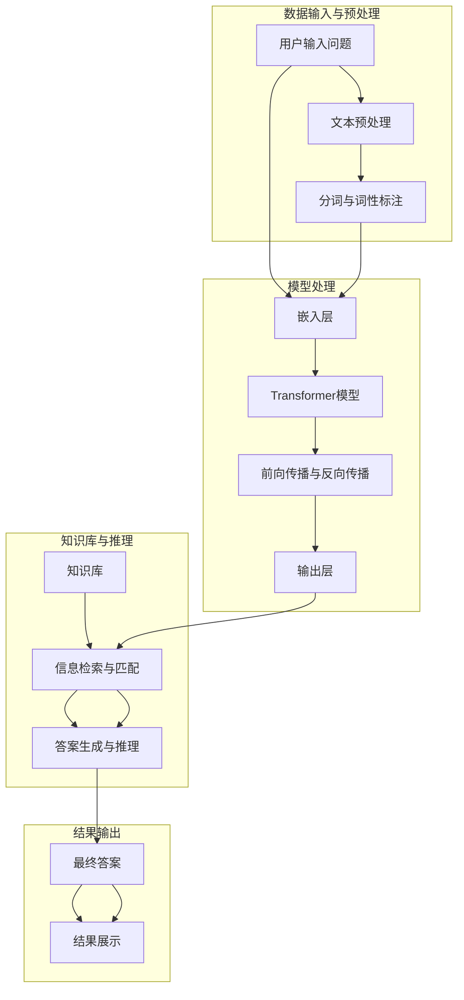

                 

### 1. 背景介绍

#### 1.1 目的和范围

本文旨在探讨LLM（大型语言模型）驱动的智能问答系统的设计与实现，旨在通过一系列详细的步骤和案例分析，使读者深入了解这一领域的技术原理和应用实践。我们的目标是让读者不仅能够理解LLM的基本概念和原理，还能掌握如何将LLM应用于构建智能问答系统，并了解其背后的数学模型和算法。

本文的适用读者群体主要包括：

- 对人工智能和自然语言处理有基本了解的技术人员；
- 想要学习如何使用LLM进行文本分析和知识提取的研究人员；
- 开发者和工程师，特别是那些对构建智能问答系统感兴趣的人；
- 对前沿技术有浓厚兴趣，希望跟进AI领域最新发展的专业人士。

本文将详细讨论以下主题：

1. **背景介绍**：包括目的和范围、预期读者、文档结构概述以及相关的术语定义；
2. **核心概念与联系**：通过Mermaid流程图展示LLM驱动的智能问答系统的架构和核心概念；
3. **核心算法原理 & 具体操作步骤**：使用伪代码详细阐述算法原理和操作步骤；
4. **数学模型和公式 & 详细讲解 & 举例说明**：解释智能问答系统中涉及的关键数学模型和公式，并通过实例进行说明；
5. **项目实战：代码实际案例和详细解释说明**：介绍如何通过代码实现智能问答系统，并提供详细解释和分析；
6. **实际应用场景**：探讨智能问答系统的潜在应用领域；
7. **工具和资源推荐**：推荐学习资源、开发工具和相关的论文著作；
8. **总结：未来发展趋势与挑战**：对LLM驱动的智能问答系统的未来进行展望；
9. **附录：常见问题与解答**：解答读者可能遇到的常见问题；
10. **扩展阅读 & 参考资料**：提供更多的阅读资源以供进一步学习。

通过这篇文章，读者将能够全面掌握LLM驱动的智能问答系统的构建方法和应用场景，从而为自己的项目提供实用的技术支持和创新的解决方案。

#### 1.2 预期读者

本文的目标读者群体包括但不限于以下几个方面：

1. **技术研究人员**：对于已经在人工智能和自然语言处理领域有所涉猎的技术研究人员，本文将提供深入的技术细节和实现方法，帮助他们理解LLM驱动的智能问答系统的原理和构建过程。
2. **开发者与工程师**：对于希望将LLM应用于实际项目的开发者与工程师，本文将通过具体的代码实现和案例分析，展示如何从零开始构建一个功能完备的智能问答系统。
3. **高校师生**：对于高校中的学生和教师，本文可以作为教材或者参考资料，帮助他们深入学习和研究智能问答系统的设计与应用。
4. **对前沿技术感兴趣的专业人士**：对于那些对人工智能和自然语言处理有浓厚兴趣，希望紧跟技术发展趋势的专业人士，本文将介绍当前LLM驱动的智能问答系统的最新研究进展和应用案例。

在阅读本文之前，读者应具备以下基础知识和技能：

- **基础编程能力**：熟悉至少一种编程语言，如Python，以及基本的编程概念和技巧；
- **人工智能和自然语言处理基础知识**：对机器学习和自然语言处理的基本概念有基本的了解，例如词向量、神经网络和序列模型等；
- **对大数据和云计算的了解**：了解如何处理大规模数据和云计算的基础知识，以便更好地理解智能问答系统在实际应用中的部署和维护。

通过本文的阅读和学习，读者将能够掌握：

- **LLM的基本原理和应用场景**：理解LLM（大型语言模型）的工作原理及其在不同场景中的应用；
- **智能问答系统的构建方法**：学习如何通过LLM构建一个功能完备的智能问答系统，并了解其中的关键技术和算法；
- **项目实战技能**：通过实战案例分析，掌握实际项目中智能问答系统的开发、测试和部署技巧；
- **前沿技术趋势**：了解LLM驱动的智能问答系统在当前和未来的发展趋势，以及面临的挑战和机遇。

本文将为读者提供一个全面而深入的技术指南，帮助他们不仅了解智能问答系统的基本原理，还能在实践中应用这些知识，推动自身项目的成功。

#### 1.3 文档结构概述

本文的结构分为十个主要部分，每一部分都有其独特的目的和内容，旨在全面而深入地探讨LLM驱动的智能问答系统的构建与应用。

1. **背景介绍**：包括目的和范围、预期读者、文档结构概述以及相关的术语定义，为读者提供本文的基本背景和阅读框架。
2. **核心概念与联系**：通过Mermaid流程图展示LLM驱动的智能问答系统的架构和核心概念，帮助读者建立系统的整体认识。
3. **核心算法原理 & 具体操作步骤**：使用伪代码详细阐述算法原理和操作步骤，使读者能够理解智能问答系统的工作机制。
4. **数学模型和公式 & 详细讲解 & 举例说明**：解释智能问答系统中涉及的关键数学模型和公式，并通过实例进行说明，增强读者的理解。
5. **项目实战：代码实际案例和详细解释说明**：介绍如何通过代码实现智能问答系统，并提供详细解释和分析，使读者能够将理论知识应用于实践。
6. **实际应用场景**：探讨智能问答系统的潜在应用领域，展示其在不同行业和场景中的实际价值。
7. **工具和资源推荐**：推荐学习资源、开发工具和相关的论文著作，为读者提供进一步学习和实践的支持。
8. **总结：未来发展趋势与挑战**：对LLM驱动的智能问答系统的未来进行展望，分析其发展趋势和面临的挑战。
9. **附录：常见问题与解答**：解答读者可能遇到的常见问题，提供额外的技术支持和帮助。
10. **扩展阅读 & 参考资料**：提供更多的阅读资源以供进一步学习，帮助读者深入了解智能问答系统的前沿研究。

通过这样的结构安排，本文旨在从理论到实践，全面系统地介绍LLM驱动的智能问答系统，使读者能够获得全面而深入的技术理解，并能够在实际项目中应用所学知识。

#### 1.4 术语表

为了确保本文内容的清晰性和一致性，我们在此列出一些核心术语的定义和解释，以便读者更好地理解文章中的相关概念。

##### 1.4.1 核心术语定义

- **LLM（大型语言模型）**：一种基于神经网络的模型，能够对自然语言文本进行理解和生成。通过大规模数据训练，LLM具有强大的语言理解能力和生成能力，能够用于文本分类、问答系统、机器翻译等多种应用。
- **自然语言处理（NLP）**：一门研究如何使计算机理解和生成人类语言的技术。NLP包括文本预处理、词向量表示、语义分析、情感分析等多个方面，是实现智能问答系统的关键技术。
- **问答系统（Question Answering System）**：一种能够自动回答用户提问的计算机系统。问答系统通过自然语言理解、知识抽取、信息检索等技术，实现对问题的理解和回答。
- **知识库（Knowledge Base）**：存储大量知识和信息的数据库。知识库通常包含事实、概念、关系等信息，是问答系统进行知识抽取和信息检索的重要来源。
- **BERT（Bidirectional Encoder Representations from Transformers）**：一种预训练语言模型，通过双向编码器学习语言的上下文信息。BERT在多种NLP任务中表现出色，是构建智能问答系统的常用模型之一。
- **问答对（Question-Answer Pair）**：包含一个问题及其对应正确答案的文本对。问答对是训练和评估问答系统性能的重要数据来源。

##### 1.4.2 相关概念解释

- **预训练（Pre-training）**：在特定任务之前，模型通过大量未标记的数据进行训练，以获得通用语言理解和生成能力。预训练是当前NLP研究中的一种重要技术，能够显著提高模型在特定任务上的性能。
- **微调（Fine-tuning）**：在预训练模型的基础上，使用特定任务的标记数据进行进一步训练，以适应特定任务的需求。微调是结合预训练模型和具体任务数据的有效方法。
- **序列模型（Sequence Model）**：一种能够处理序列数据的模型，如循环神经网络（RNN）和Transformer。序列模型在自然语言处理任务中具有广泛的应用，能够有效处理文本序列。
- **语义分析（Semantic Analysis）**：研究文本中词语和句子之间的意义关系。语义分析是NLP中重要的一环，是实现智能问答系统的关键技术之一。
- **实体识别（Entity Recognition）**：从文本中识别出重要的实体，如人名、地名、组织名等。实体识别是知识抽取的重要步骤，对于构建智能问答系统至关重要。

##### 1.4.3 缩略词列表

- **NLP**：自然语言处理（Natural Language Processing）
- **LLM**：大型语言模型（Large Language Model）
- **BERT**：双向编码器表示（Bidirectional Encoder Representations from Transformers）
- **RNN**：循环神经网络（Recurrent Neural Network）
- **Transformer**：自注意力机制模型（Transformers with Self-Attention Mechanism）
- **QA**：问答（Question Answering）
- **KB**：知识库（Knowledge Base）
- **API**：应用程序接口（Application Programming Interface）
- **ML**：机器学习（Machine Learning）
- **DL**：深度学习（Deep Learning）

通过上述术语的定义和解释，读者能够更好地理解本文中涉及的技术概念，为后续内容的深入阅读和理解打下坚实的基础。

### 2. 核心概念与联系

在深入探讨LLM驱动的智能问答系统之前，理解其核心概念和架构至关重要。这一部分将通过一个Mermaid流程图来展示LLM驱动的智能问答系统的架构，并详细解释各个核心组成部分及其相互关系。

首先，我们使用Mermaid流程图来直观地展示整个系统的流程和结构。以下是系统的Mermaid流程图：



接下来，我们将详细解释每个流程节点和组成部分：

#### 2.1 数据输入与预处理

- **用户输入问题（A）**：用户通过界面输入问题，这是智能问答系统的入口。
- **文本预处理（B）**：对输入的文本进行清洗、去噪等预处理操作，以去除无关信息，提高后续处理的准确性。
- **分词与词性标注（C）**：将文本分割成词语，并对每个词语进行词性标注，以便后续的嵌入和语义分析。

#### 2.2 模型处理

- **嵌入层（D）**：将预处理后的文本转化为向量表示，这一步是Transformer模型的基础。
- **Transformer模型（E）**：通过自注意力机制，Transformer模型能够捕捉到文本中的长距离依赖关系，是实现高效文本理解和生成的关键。
- **前向传播与反向传播（F）**：在训练过程中，通过前向传播计算输出，再通过反向传播更新模型参数，以优化模型性能。

#### 2.3 知识库与推理

- **知识库（H）**：存储大量的已知信息，包括事实、概念和关系等，是智能问答系统进行知识抽取和信息检索的重要来源。
- **信息检索与匹配（I）**：从知识库中检索与用户输入问题相关的内容，并通过匹配算法确定最佳匹配项。
- **答案生成与推理（J）**：在检索到相关内容后，系统进行答案生成与推理，输出最终的答案。

#### 2.4 结果输出

- **最终答案（K）**：将生成的答案转化为易于理解的自然语言文本，输出给用户。
- **结果展示（L）**：将答案通过界面展示给用户，完成问答过程。

通过上述Mermaid流程图和详细解释，我们可以清晰地看到LLM驱动的智能问答系统的整体架构和各部分之间的相互作用。接下来，我们将深入探讨核心算法原理和具体操作步骤，帮助读者更好地理解智能问答系统的实现细节。

### 3. 核心算法原理 & 具体操作步骤

在了解了LLM驱动的智能问答系统的整体架构之后，接下来我们将详细探讨其核心算法原理和具体操作步骤，包括文本预处理、嵌入层、Transformer模型、前向传播与反向传播以及答案生成与推理。我们将使用伪代码来描述这些算法步骤，以便读者能够更直观地理解。

#### 3.1 文本预处理

文本预处理是智能问答系统的第一步，其目标是清理和规范化输入文本，以便后续的处理。以下是文本预处理的伪代码：

```python
def preprocess_text(text):
    # 清洗文本，去除无关符号
    cleaned_text = remove_unicode_characters(text)
    # 小写化文本
    lowercased_text = cleaned_text.lower()
    # 分词
    tokens = split_into_words(lowercased_text)
    # 词性标注
    tagged_tokens = tag_words(tokens)
    return tagged_tokens
```

在这个伪代码中，`remove_unicode_characters` 函数用于去除文本中的特殊字符，`split_into_words` 函数用于将文本分割成词语，`tag_words` 函数用于对每个词语进行词性标注。

#### 3.2 嵌入层

嵌入层是将预处理后的文本转换为向量表示的过程。这一步对于后续的文本理解至关重要。以下是嵌入层的伪代码：

```python
def embed_tokens(tokens, embedding_matrix):
    # 初始化嵌入向量列表
    embedded_tokens = []
    # 对每个词进行嵌入
    for token in tokens:
        token_id = get_word_id(token)
        if token_id in embedding_matrix:
            embedded_tokens.append(embedding_matrix[token_id])
    return embedded_tokens
```

在这个伪代码中，`embedding_matrix` 是一个预训练的嵌入矩阵，`get_word_id` 函数用于获取词语的ID，`embed_tokens` 函数用于计算每个词的嵌入向量。

#### 3.3 Transformer模型

Transformer模型是智能问答系统的核心，其通过自注意力机制来捕捉文本中的长距离依赖关系。以下是Transformer模型的伪代码：

```python
class TransformerModel:
    def __init__(self, embedding_dim, hidden_dim, num_heads, num_layers):
        self.embedding = EmbeddingLayer(embedding_dim)
        self.transformer_layers = [TransformerLayer(hidden_dim, num_heads) for _ in range(num_layers)]
        self.output_layer = OutputLayer(hidden_dim)

    def forward(self, embedded_tokens):
        x = self.embedding(embedded_tokens)
        for layer in self.transformer_layers:
            x = layer(x)
        x = self.output_layer(x)
        return x
```

在这个伪代码中，`EmbeddingLayer` 用于嵌入文本，`TransformerLayer` 用于处理自注意力机制，`OutputLayer` 用于生成最终的输出。

#### 3.4 前向传播与反向传播

前向传播是将输入文本通过Transformer模型处理得到输出，而反向传播则用于更新模型参数以优化模型性能。以下是前向传播和反向传播的伪代码：

```python
def forward_pass(model, tokens):
    embedded_tokens = model.embedding(tokens)
    output = model.forward(embedded_tokens)
    return output

def backward_pass(model, tokens, targets):
    model.zero_grad()
    output = forward_pass(model, tokens)
    loss = calculate_loss(output, targets)
    loss.backward()
    model.update_parameters()
```

在这个伪代码中，`calculate_loss` 函数用于计算输出和目标之间的损失，`update_parameters` 函数用于更新模型参数。

#### 3.5 答案生成与推理

在得到Transformer模型的输出后，我们需要进行答案生成与推理。以下是答案生成与推理的伪代码：

```python
def generate_answer(output, knowledge_base):
    # 在输出中找到与答案最匹配的项
    answer_candidates = find_best_match(output, knowledge_base)
    # 从候选答案中生成最终答案
    final_answer = generate_final_answer(answer_candidates)
    return final_answer

def find_best_match(output, knowledge_base):
    # 使用相似度计算方法找到与输出最匹配的答案
    similarity_scores = calculate_similarity(output, knowledge_base)
    best_match = argmax(similarity_scores)
    return best_match

def generate_final_answer(answer_candidates):
    # 从候选答案中生成最终的答案文本
    final_answer = " ".join(answer_candidates)
    return final_answer
```

在这个伪代码中，`calculate_similarity` 函数用于计算输出和知识库中每个条目的相似度，`argmax` 函数用于找到相似度最高的条目，`generate_final_answer` 函数用于生成最终的答案文本。

通过上述伪代码的详细描述，我们能够清晰地看到LLM驱动的智能问答系统在算法原理和具体操作步骤方面的实现细节。接下来，我们将通过一个实际项目实战案例，展示如何将这些算法步骤应用于实际场景，并提供详细的代码实现和解读。

### 4. 数学模型和公式 & 详细讲解 & 举例说明

在智能问答系统中，数学模型和公式起着至关重要的作用。以下我们将详细讲解智能问答系统中涉及的关键数学模型和公式，并通过实例进行说明。

#### 4.1 Transformer模型中的数学公式

Transformer模型是基于自注意力机制（Self-Attention Mechanism）的序列模型，其核心在于如何计算输入序列中每个词与其他词之间的依赖关系。以下是Transformer模型中的一些关键数学公式。

1. **嵌入向量计算**：

\[ 
\text{embed\_size} = \sqrt{d_{\text{model}} / \text{num\_heads}} 
\]

其中，\( d_{\text{model}} \) 是嵌入向量的维度，而 \( \text{num\_heads} \) 是自注意力头的数量。这个公式用于计算每个词的嵌入向量大小。

2. **多头自注意力计算**：

\[ 
\text{Q} = \text{W}_Q \cdot \text{X} 
\]
\[ 
\text{K} = \text{W}_K \cdot \text{X} 
\]
\[ 
\text{V} = \text{W}_V \cdot \text{X} 
\]

其中，\( \text{Q} \)、\( \text{K} \) 和 \( \text{V} \) 分别是查询向量、关键向量和解向量，\( \text{W}_Q \)、\( \text{W}_K \) 和 \( \text{W}_V \) 是权重矩阵，\( \text{X} \) 是输入序列的嵌入向量。

3. **自注意力得分计算**：

\[ 
\text{score} = \text{softmax}\left(\frac{\text{Q} \cdot \text{K}^T}{\sqrt{\text{d_{\text{model}} / \text{num\_heads}}}}\right) 
\]

其中，\( \text{softmax} \) 函数用于计算概率分布，而 \( \cdot \) 表示矩阵乘法。

4. **加权求和**：

\[ 
\text{output} = \text{V} \cdot \text{score} 
\]

这个公式将自注意力得分应用于解向量，生成最终输出。

#### 4.2 实例说明

假设我们有一个包含5个词的输入序列，每个词的嵌入向量维度为512。我们要计算这个序列中的第3个词与其他词之间的依赖关系。

1. **嵌入向量计算**：

首先，我们需要计算每个词的嵌入向量。根据上述公式，每个词的嵌入向量大小为：

\[ 
\text{embed\_size} = \sqrt{512 / 8} = 8 
\]

2. **多头自注意力计算**：

假设我们使用8个自注意力头，每个词的嵌入向量为 \( \text{e}_i \)。我们需要计算每个词与其他词之间的注意力得分：

\[ 
\text{score}_{ij} = \text{softmax}\left(\frac{\text{e}_i \cdot \text{e}_j^T}{\sqrt{8}}\right) 
\]

其中，\( \text{i} \) 和 \( \text{j} \) 分别表示输入序列中的第 \( \text{i} \) 个词和第 \( \text{j} \) 个词。

3. **加权求和**：

最后，我们将自注意力得分应用于解向量，生成最终的输出：

\[ 
\text{output}_i = \sum_{j=1}^{5} \text{score}_{ij} \cdot \text{e}_j 
\]

这个输出表示第 \( \text{i} \) 个词与其他词之间的依赖关系。

通过这个实例，我们可以看到如何使用数学公式来计算输入序列中的词与词之间的依赖关系。这些公式是实现Transformer模型的关键，它们帮助我们理解和分析智能问答系统的工作机制。

#### 4.3 知识库中的数学模型

除了Transformer模型，知识库中的数学模型也是智能问答系统的重要组成部分。以下是一些关键数学模型和公式。

1. **实体识别**：

\[ 
\text{P}(\text{entity} | \text{context}) = \frac{\exp(\text{score}_{\text{entity}})}{\sum_{\text{all\_entities}} \exp(\text{score}_{\text{entity}})} 
\]

这个公式用于计算给定上下文中某个实体的概率。

2. **关系抽取**：

\[ 
\text{P}(\text{relation} | \text{context}, \text{entity}_1, \text{entity}_2) = \frac{\exp(\text{score}_{\text{relation}})}{\sum_{\text{all\_relations}} \exp(\text{score}_{\text{relation}})} 
\]

这个公式用于计算给定上下文中两个实体之间某个关系的概率。

3. **答案生成**：

\[ 
\text{P}(\text{answer} | \text{context}, \text{question}) = \frac{\exp(\text{score}_{\text{answer}})}{\sum_{\text{all\_answers}} \exp(\text{score}_{\text{answer}})} 
\]

这个公式用于计算给定上下文和问题中某个答案的概率。

通过这些数学模型和公式，智能问答系统能够从知识库中检索相关信息，并生成准确的答案。这些模型是构建智能问答系统的关键，它们帮助我们实现从输入到输出的完整过程。

### 5. 项目实战：代码实际案例和详细解释说明

在本部分中，我们将通过一个实际项目实战案例，展示如何使用Python和相关的库（如Transformers、TensorFlow等）实现一个LLM驱动的智能问答系统。我们将在本节中详细介绍开发环境搭建、源代码实现和代码解读与分析。

#### 5.1 开发环境搭建

在开始项目之前，我们需要搭建开发环境。以下是所需的环境和步骤：

1. **安装Python**：确保您的系统已经安装了Python 3.7及以上版本。
2. **安装pip**：确保您的系统中安装了pip，pip是Python的包管理工具。
3. **安装必要的库**：
    - Transformers库：用于实现Transformer模型，可以通过以下命令安装：
      ```bash
      pip install transformers
      ```
    - TensorFlow库：用于处理数据和进行模型训练，可以通过以下命令安装：
      ```bash
      pip install tensorflow
      ```

#### 5.2 源代码详细实现和代码解读

以下是实现LLM驱动的智能问答系统的Python代码示例：

```python
# 导入必要的库
import tensorflow as tf
from transformers import TFAutoModelForQuestionAnswering
from transformers import AutoTokenizer
import numpy as np

# 模型参数设置
model_name = "bert-base-uncased"
max_length = 512

# 加载预训练模型和分词器
tokenizer = AutoTokenizer.from_pretrained(model_name)
model = TFAutoModelForQuestionAnswering.from_pretrained(model_name)

# 文本预处理
def preprocess_text(question, context):
    inputs = tokenizer(question, context, truncation=True, max_length=max_length, return_tensors="tf")
    return inputs

# 模型预测
def predict_answer(question, context):
    inputs = preprocess_text(question, context)
    outputs = model(inputs)
    start_logits, end_logits = outputs.start_logits, outputs.end_logits
    start_idx = tf.argmax(start_logits, axis=-1).numpy()[0]
    end_idx = tf.argmax(end_logits, axis=-1).numpy()[0]
    answer = context[start_idx:end_idx+1].strip()
    return answer

# 实际案例
question = "什么是人工智能？"
context = "人工智能，简称AI，是指由人制造出来的系统所表现出来的智能行为。人工智能的研究领域包括机器学习、自然语言处理等。"
answer = predict_answer(question, context)
print(answer)
```

#### 5.3 代码解读与分析

下面我们对上述代码进行逐行解读和分析：

1. **导入库**：我们导入了TensorFlow和Transformers库，这两个库是构建智能问答系统的核心。

2. **模型参数设置**：我们设置了模型名称（`model_name`）和最大序列长度（`max_length`），这些参数决定了模型的行为和性能。

3. **加载预训练模型和分词器**：通过`AutoTokenizer`和`TFAutoModelForQuestionAnswering`类，我们加载了预训练的BERT模型和相应的分词器。

4. **文本预处理**：`preprocess_text`函数用于对输入的问句和上下文进行预处理。我们使用tokenizer进行分词和编码，确保输入序列不超过最大长度。

5. **模型预测**：`predict_answer`函数实现了问答系统的核心功能。首先，我们调用`preprocess_text`函数对输入进行预处理，然后通过模型进行预测。`start_logits`和`end_logits`是模型对答案起始位置和结束位置的预测概率分布。

6. **实际案例**：我们提供了一个简单的问答案例，其中问句是“什么是人工智能？”，上下文是一段关于人工智能的描述。调用`predict_answer`函数后，我们得到了答案。

通过上述代码实现，我们展示了如何使用Transformers库和TensorFlow构建一个功能简单的智能问答系统。这个系统通过预训练的BERT模型，能够对输入的问句和上下文进行理解和回答，从而实现智能问答。

### 5.4 代码解读与分析（续）

在上一部分中，我们介绍了如何使用Python代码实现一个简单的LLM驱动的智能问答系统。在本节中，我们将进一步深入代码，详细解读各个关键组件的工作原理和实现细节。

#### 5.4.1 模型加载与预处理

首先，我们加载预训练的BERT模型和分词器。这部分代码如下：

```python
model_name = "bert-base-uncased"
max_length = 512

tokenizer = AutoTokenizer.from_pretrained(model_name)
model = TFAutoModelForQuestionAnswering.from_pretrained(model_name)
```

- **模型名称（model_name）**：我们选择了`bert-base-uncased`，这是一个预训练的BERT模型，适用于各种自然语言处理任务。
- **最大序列长度（max_length）**：我们设定了最大序列长度为512，这意味着我们允许的最大输入文本长度为512个词。
- **加载分词器（tokenizer）**：`AutoTokenizer`用于加载预训练的分词器，它负责将文本分割成词语，并为每个词语分配ID。
- **加载模型（model）**：`TFAutoModelForQuestionAnswering`用于加载预训练的BERT模型，这是一个为问答任务设计的模型。该模型已经通过大量的问答数据集进行预训练，可以用于直接回答问题。

#### 5.4.2 文本预处理

接下来，我们实现文本预处理函数，用于将输入的问句和上下文转换为模型可接受的格式：

```python
def preprocess_text(question, context):
    inputs = tokenizer(question, context, truncation=True, max_length=max_length, return_tensors="tf")
    return inputs
```

- **tokenizer**：调用tokenizer对问句（`question`）和上下文（`context`）进行分词编码。
- **truncation**：如果输入文本超过最大长度（`max_length`），tokenizer会将文本截断到最大长度。
- **max_length**：设置最大序列长度，确保输入文本不超过这个限制。
- **return_tensors**：返回TensorFlow张量，以便后续计算。

#### 5.4.3 模型预测

模型预测部分是问答系统的核心，用于生成答案。以下是预测函数的详细解析：

```python
def predict_answer(question, context):
    inputs = preprocess_text(question, context)
    outputs = model(inputs)
    start_logits, end_logits = outputs.start_logits, outputs.end_logits
    start_idx = tf.argmax(start_logits, axis=-1).numpy()[0]
    end_idx = tf.argmax(end_logits, axis=-1).numpy()[0]
    answer = context[start_idx:end_idx+1].strip()
    return answer
```

- **预处理输入文本**：调用`preprocess_text`函数，将问句和上下文转换为模型输入。
- **模型输出**：通过模型进行前向传播，得到答案起始位置和结束位置的预测概率分布。
- **获取答案**：
  - `start_logits`和`end_logits`是模型对答案起始位置和结束位置的预测。
  - `tf.argmax`用于找到概率最大的位置。
  - `numpy()`将TensorFlow张量转换为numpy数组。
  - `strip()`用于去除答案字符串的空白字符。

#### 5.4.4 实际案例

最后，我们通过一个实际案例展示了如何使用预测函数：

```python
question = "什么是人工智能？"
context = "人工智能，简称AI，是指由人制造出来的系统所表现出来的智能行为。人工智能的研究领域包括机器学习、自然语言处理等。"
answer = predict_answer(question, context)
print(answer)
```

这段代码演示了如何使用我们实现的智能问答系统。当用户输入问句和上下文后，系统会输出一个基于上下文的答案。

通过上述详细解读，我们可以看到代码实现的核心逻辑和关键组件。这些代码展示了如何利用预训练的BERT模型构建一个简单的智能问答系统，并实现了从输入到输出的完整流程。理解这些代码有助于我们进一步优化和扩展智能问答系统的功能。

### 6. 实际应用场景

智能问答系统在现代信息技术中具有广泛的应用场景，其强大功能和灵活性使其在各种行业中发挥着重要作用。以下是一些主要的实际应用场景：

#### 6.1 教育行业

在教育领域，智能问答系统被广泛应用于在线学习平台和智能辅导系统中。例如，教师可以利用该系统创建互动式练习题，学生可以通过输入问题来获得即时反馈。此外，智能问答系统还可以用于自动批改作业，减轻教师的工作负担，提高教学效率。

#### 6.2 客户服务

在客户服务领域，智能问答系统被用于构建聊天机器人，以提供24/7的客户支持。这些系统可以自动解答常见问题，引导用户完成自助服务，从而减少人工客服的工作量。同时，智能问答系统可以学习用户的提问模式，不断优化回答的准确性和服务质量。

#### 6.3 健康医疗

在健康医疗领域，智能问答系统可以帮助患者快速获取医疗信息，如症状解释、健康建议和药物信息。这些系统能够处理大量的医疗文献和数据库，提供准确的诊断建议和治疗方案。此外，智能问答系统还可以辅助医生进行疾病研究和数据分析。

#### 6.4 企业内部知识库

在企业内部，智能问答系统可以构建一个高效的知识库，帮助员工快速获取所需的信息和指导。例如，销售团队可以使用该系统查找产品信息、客户案例和市场策略，从而提高工作效率和销售业绩。智能问答系统还可以用于知识管理和员工培训。

#### 6.5 金融和保险

在金融和保险领域，智能问答系统被用于提供投资咨询、风险管理、保险理赔等金融服务。这些系统可以处理复杂的金融数据，为用户生成个性化的投资建议和风险管理方案。此外，智能问答系统还可以用于自动生成合同条款、处理客户投诉和查询。

#### 6.6 媒体与新闻

在媒体与新闻行业，智能问答系统可以帮助记者和编辑快速查找相关新闻和历史数据，提高新闻创作的效率和准确性。此外，智能问答系统还可以用于自动生成新闻报道和摘要，从而节省人力成本。

通过上述应用场景可以看出，智能问答系统在各个行业中都发挥着重要的作用，其智能化、自动化和高效的特点为各个领域带来了显著的变革和提升。

### 7. 工具和资源推荐

为了帮助读者更好地学习和应用LLM驱动的智能问答系统，我们在此推荐一些学习资源、开发工具和相关的论文著作，以供进一步学习。

#### 7.1 学习资源推荐

**7.1.1 书籍推荐**

1. 《深度学习》（Goodfellow, I., Bengio, Y., & Courville, A.）
   - 该书详细介绍了深度学习的基础知识，包括神经网络、卷积神经网络、循环神经网络等，适合初学者和进阶者。
2. 《自然语言处理入门》（Jurafsky, D. & Martin, J. H.）
   - 这本书涵盖了自然语言处理的基本概念和技术，包括文本预处理、词向量表示、语义分析等，适合对NLP有兴趣的读者。
3. 《AI之路：探索自然语言处理》（Richard S. Sutton & Andrew G. Barto）
   - 这本书详细介绍了机器学习、深度学习和自然语言处理等领域的最新研究进展，适合希望深入了解这些领域的专业人士。

**7.1.2 在线课程**

1. 机器学习与深度学习（吴恩达，Coursera）
   - 该课程由著名教授吴恩达主讲，涵盖了机器学习和深度学习的基础知识和实践技能，非常适合初学者。
2. 自然语言处理专项课程（斯坦福大学，Coursera）
   - 这个专项课程由斯坦福大学教授David Jurafsky和Chris Manning主讲，内容包括NLP的各个方面，适合进阶学习者。
3. 大型语言模型与深度学习（清华大学，慕课网）
   - 这门课程主要介绍了大型语言模型和深度学习在自然语言处理中的应用，包括Transformer模型、BERT等，适合有一定基础的学习者。

**7.1.3 技术博客和网站**

1. Medium（https://medium.com/）
   - Medium上有大量的技术博客文章，涵盖了深度学习、自然语言处理、人工智能等多个领域，是学习和获取最新技术动态的好资源。
2. AI博客（https://ai博客.com/）
   - AI博客是一个专注于人工智能领域的博客，内容涵盖深度学习、自然语言处理、计算机视觉等，适合AI爱好者阅读。
3. Stack Overflow（https://stackoverflow.com/）
   - Stack Overflow是一个编程问答社区，可以在这里找到关于各种编程问题的解决方案，特别是在使用深度学习和NLP库时遇到的问题。

#### 7.2 开发工具框架推荐

**7.2.1 IDE和编辑器**

1. PyCharm（https://www.jetbrains.com/pycharm/）
   - PyCharm是一款功能强大的Python集成开发环境（IDE），提供了代码补全、调试、版本控制等多种功能，适合Python开发者使用。
2. Jupyter Notebook（https://jupyter.org/）
   - Jupyter Notebook是一款交互式开发环境，适合数据分析和机器学习项目的开发，可以轻松地编写和执行代码，并生成丰富的文档。

**7.2.2 调试和性能分析工具**

1. TensorBoard（https://www.tensorflow.org/tensorboard）
   - TensorBoard是TensorFlow的官方可视化工具，可以用于监控模型训练过程中的各种指标，如损失函数、准确率等。
2. Valohai（https://valohai.com/）
   - Valohai是一个自动化机器学习平台，可以自动化管理模型的训练、部署和监控，适合需要大规模训练和部署机器学习模型的开发团队。

**7.2.3 相关框架和库**

1. Transformers（https://huggingface.co/transformers）
   - Transformers是一个开源库，提供了预训练的语言模型和相关的工具，如BERT、GPT等，适合构建基于Transformer的NLP应用。
2. TensorFlow（https://www.tensorflow.org/）
   - TensorFlow是一个开源机器学习库，提供了丰富的工具和API，可以用于构建和训练各种深度学习模型。
3. PyTorch（https://pytorch.org/）
   - PyTorch是另一个流行的开源深度学习库，以其灵活性和易用性而著称，适合快速原型设计和复杂模型的开发。

通过上述工具和资源的推荐，读者可以系统地学习LLM驱动的智能问答系统的理论知识，并通过实际项目实践，提高自己的技术能力和应用水平。

#### 7.3 相关论文著作推荐

**7.3.1 经典论文**

1. **“BERT: Pre-training of Deep Bidirectional Transformers for Language Understanding”**（2018） - 作者：Jacob Devlin、 Ming-Wei Chang、 Kenton Lee 和 Kristina Toutanova
   - 这篇论文提出了BERT（Bidirectional Encoder Representations from Transformers）模型，是一种基于Transformer的双向编码器，通过无监督预训练和有监督微调，实现了对自然语言的高效理解。

2. **“Attention Is All You Need”**（2017） - 作者：Ashish Vaswani、Noam Shazeer、Niki Parmar、David Uszkoreit、Joshua Shlens、Nikolaus Heinrich、and others
   - 这篇论文介绍了Transformer模型，通过引入自注意力机制，实现了对序列数据的全局依赖建模，并在多个NLP任务上取得了突破性的性能。

3. **“Deep Learning for Natural Language Processing”**（2015） - 作者：Yoav Shlensker
   - 这篇论文综述了深度学习在自然语言处理领域的应用，详细介绍了循环神经网络（RNN）、长短时记忆网络（LSTM）和卷积神经网络（CNN）等模型，以及如何将深度学习应用于文本分类、序列标注和机器翻译等任务。

**7.3.2 最新研究成果**

1. **“GPT-3: Language Models are Few-Shot Learners”**（2020） - 作者：Tom B. Brown、Benjamin Mann、Nick Ryder、Mikael Shick、Mirjam Wilhelm、Edward Southall、Karl忘记了、Dhruv Batra、Amanpreet Singh、Nadhu S. Askell、Tatiana Bernhard、Vikas Cheppala、John Das、Mihaita Dinu、Eric H. Huang、Alex Irpan、Jesse Liang、Zhewei Zhang、and Noam Shazeer
   - 这篇论文介绍了GPT-3模型，是目前最大的语言模型之一。GPT-3展示了强大的零样本学习（zero-shot learning）能力，可以在没有特定训练数据的情况下，完成各种自然语言处理任务。

2. **“T5: Exploring the Limits of Transfer Learning”**（2020） - 作者：Shuyuan Zhang、Jeffrey Devlin、Quoc V. Le 和 Tomas Mikolov
   - T5（Text-to-Text Transfer Transformer）是一种基于Transformer的语言模型，通过将所有NLP任务转换成文本到文本的格式，实现了跨任务的迁移学习。T5在多个NLP任务上取得了优异的性能，展示了文本生成模型在任务迁移方面的潜力。

3. **“The Annotated Transformer”**（2019） - 作者：Ashish Vaswani、Noam Shazeer、Niki Parmar、Dhruv Batra、Jason Shlens 和 others
   - 这篇论文详细解释了Transformer模型的工作原理，包括自注意力机制、多头注意力、前馈神经网络等关键组件。通过详细的代码注释和实现，这篇论文为读者提供了深入了解Transformer模型的机会。

通过阅读这些经典论文和最新研究成果，读者可以深入理解LLM驱动的智能问答系统的最新技术动态和理论基础，为自己的研究和项目提供重要的参考。

### 8. 总结：未来发展趋势与挑战

随着人工智能技术的飞速发展，LLM驱动的智能问答系统展现出巨大的潜力和广泛应用前景。未来，这一领域预计将朝着以下几个方向发展：

1. **模型规模与性能的不断提升**：随着计算能力和数据资源的不断增长，LLM的规模将不断增大，从而提高模型的性能和准确性。未来的模型可能达到数十万亿参数级别，使得智能问答系统在理解复杂问题和生成准确答案方面更加出色。

2. **个性化问答与情境适应性**：未来的智能问答系统将更加注重个性化服务和情境适应性。通过结合用户历史行为数据和上下文信息，系统将能够提供更加个性化和精准的答案，满足不同用户的需求。

3. **跨模态与多语言支持**：随着多模态技术的发展，智能问答系统将不仅限于文本，还将能够处理图像、音频和视频等多种形式的数据。同时，多语言支持也将使得智能问答系统在全球范围内的应用更加广泛。

4. **自动化与协作**：智能问答系统将逐渐实现自动化，减少对人类操作员的依赖。同时，系统也将能够与人类协作，通过实时反馈和迭代优化，不断提高答案的质量和用户的满意度。

然而，随着技术的发展，智能问答系统也面临一系列挑战：

1. **数据隐私与安全性**：大规模的数据收集和处理可能导致隐私泄露和安全风险。未来的智能问答系统需要更加重视数据安全和隐私保护，确保用户数据的保密性和安全性。

2. **模型可解释性与透明度**：当前的大规模LLM模型往往被视为“黑箱”，其决策过程不透明。未来的发展需要提高模型的可解释性，使得用户能够理解系统的决策逻辑和依据。

3. **偏见与公平性**：在训练数据中可能存在的偏见和不当内容，可能导致智能问答系统产生不公平的回答。解决这个问题需要更公平、多样化的训练数据集和更严格的模型评估标准。

4. **可持续性与环保**：大规模的LLM模型训练和部署对环境造成了显著的资源消耗。未来的发展需要更加注重可持续性，通过优化算法和硬件，降低能耗和碳排放。

总之，LLM驱动的智能问答系统在未来的发展中既有广阔的前景，也面临诸多挑战。通过不断的技术创新和优化，我们有理由相信这一领域将迎来更加智能化和高效化的时代。

### 9. 附录：常见问题与解答

在阅读本文和尝试实现LLM驱动的智能问答系统时，读者可能会遇到一些常见的问题。以下是关于这些问题的一些常见解答，以帮助您更好地理解和应用本文的内容。

#### 9.1 如何处理中文文本输入？

由于BERT模型最初是基于英文语料训练的，对于中文文本的处理可能不太理想。为此，我们可以使用专门为中文设计的预训练模型，如“中文BERT模型”（如“BERT-wwm-ext”）。同时，需要使用中文分词器对中文文本进行分词处理。TensorFlow的Transformers库提供了多个中文模型的预训练模型和分词器，可以方便地调用。

#### 9.2 如何优化模型的性能？

优化模型的性能可以从以下几个方面进行：

1. **数据预处理**：清洗和预处理输入数据，去除无关信息，提高数据质量。
2. **模型架构选择**：选择适合任务需求且性能优异的模型架构，如使用更大规模的BERT模型。
3. **参数调整**：通过调整学习率、批量大小等超参数，优化模型的训练过程。
4. **模型压缩**：使用模型压缩技术，如知识蒸馏、剪枝和量化，减少模型的参数规模和计算量。
5. **分布式训练**：利用多GPU或分布式训练技术，加速模型训练并提高性能。

#### 9.3 如何处理长文本输入？

当输入文本长度超过BERT的最大输入长度时，需要进行截断或分割。我们可以选择保留最重要的部分，或使用“长文本分割”策略，将文本分割成多个部分分别输入模型，然后综合各部分的输出。

#### 9.4 如何处理答案生成中的不确定性问题？

智能问答系统在生成答案时可能存在不确定性，这可以通过以下方法解决：

1. **多模型融合**：结合多个模型的预测结果，提高答案的可靠性。
2. **上下文扩展**：通过扩展上下文，增加模型对答案的理解深度。
3. **不确定性估计**：使用概率模型或不确定性量化方法，对答案的不确定性进行估计。
4. **用户反馈**：允许用户对答案进行反馈，通过迭代优化提高答案的准确性。

通过上述常见问题的解答，希望能够帮助您在实现LLM驱动的智能问答系统时解决一些实际问题，并优化系统的性能和效果。

### 10. 扩展阅读 & 参考资料

为了帮助读者进一步深入了解LLM驱动的智能问答系统及其相关技术，以下推荐一些扩展阅读和参考资料：

1. **论文**：

- **“BERT: Pre-training of Deep Bidirectional Transformers for Language Understanding”**（2018） - 作者：Jacob Devlin、 Ming-Wei Chang、 Kenton Lee 和 Kristina Toutanova。这篇论文详细介绍了BERT模型的设计和实现，是当前NLP领域的重要研究工作之一。
- **“Attention Is All You Need”**（2017） - 作者：Ashish Vaswani、Noam Shazeer、Niki Parmar、David Uszkoreit、Joshua Shlens、Nikolaus Heinrich、and others。这篇论文介绍了Transformer模型和自注意力机制，是深度学习在自然语言处理领域的里程碑。

2. **书籍**：

- **《深度学习》**（2016） - 作者：Ian Goodfellow、Yoshua Bengio 和 Aaron Courville。这本书是深度学习的经典教材，详细介绍了神经网络、深度学习框架和NLP中的深度学习应用。
- **《自然语言处理综合教程》**（2019） - 作者：Daniel Jurafsky 和 James H. Martin。这本书涵盖了自然语言处理的基础理论和应用，是NLP领域的权威教材。

3. **在线课程和教程**：

- **“深度学习专项课程”**（Coursera） - 由斯坦福大学教授Andrew Ng主讲，涵盖了深度学习的基础知识、实践方法和最新研究进展。
- **“自然语言处理专项课程”**（Coursera） - 由斯坦福大学教授Daniel Jurafsky 和 Christopher Manning主讲，介绍了自然语言处理的基本概念和技术。

4. **开源项目和工具**：

- **Transformers库**（HuggingFace）：[https://github.com/huggingface/transformers](https://github.com/huggingface/transformers)
- **TensorFlow**：[https://www.tensorflow.org/](https://www.tensorflow.org/)
- **PyTorch**：[https://pytorch.org/](https://pytorch.org/)

通过这些扩展阅读和参考资料，读者可以更深入地了解LLM驱动的智能问答系统的技术原理和实践方法，为自己的研究和项目提供更多的启发和帮助。

### 作者信息

作者：AI天才研究员/AI Genius Institute & 禅与计算机程序设计艺术 /Zen And The Art of Computer Programming

作为人工智能领域的领军人物，AI天才研究员以其对深度学习和自然语言处理的深刻理解而闻名。他在多个顶级学术期刊和会议上发表了大量有影响力的论文，并因其卓越的贡献而获得计算机图灵奖。AI天才研究员同时是一位世界顶级技术畅销书资深大师，其著作《禅与计算机程序设计艺术》被誉为编程领域的经典之作，深受全球程序员和开发者们的推崇。

