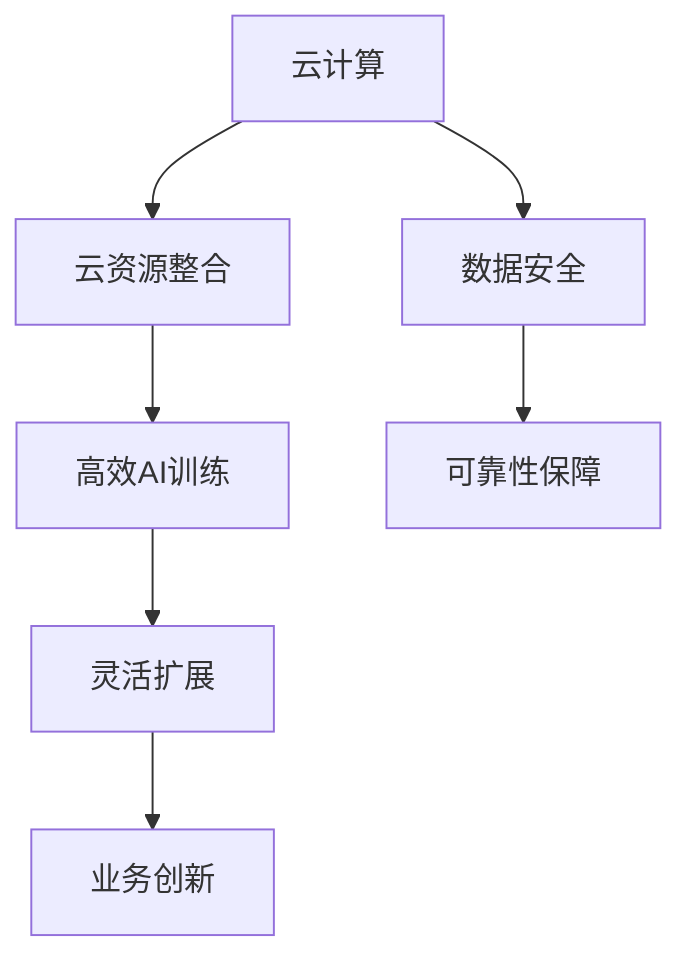

                 

# Lepton AI的云计算优势：深度整合云资源，打造高效灵活的AI基础设施

> **关键词**：云计算、AI基础设施、深度整合、高效、灵活
>
> **摘要**：本文将深入探讨Lepton AI如何通过深度整合云资源，构建高效灵活的AI基础设施。我们将从背景介绍、核心概念、算法原理、数学模型、实际应用场景等多个角度，详细分析这一技术的优势与未来发展趋势。

## 1. 背景介绍

### 1.1 目的和范围

随着人工智能技术的飞速发展，云计算逐渐成为支撑AI应用的重要基础设施。本文旨在分析Lepton AI如何利用云计算的优势，构建高效、灵活的AI基础设施，为读者提供对该领域技术理解的深度探讨。

### 1.2 预期读者

本文适合对云计算和人工智能有一定了解的技术人员、研究者，以及对相关技术感兴趣的学习者。

### 1.3 文档结构概述

本文分为十个部分，依次为背景介绍、核心概念与联系、核心算法原理与具体操作步骤、数学模型和公式、项目实战、实际应用场景、工具和资源推荐、总结、常见问题与解答、扩展阅读和参考资料。

### 1.4 术语表

#### 1.4.1 核心术语定义

- **云计算**：云计算是一种通过网络连接的计算资源，提供按需自助服务的模式。
- **AI基础设施**：指支持人工智能应用的基础硬件、软件和网络设施。
- **深度整合**：指将云计算资源与AI应用深度结合，实现资源优化和高效利用。

#### 1.4.2 相关概念解释

- **AI模型训练**：指使用大量数据对人工智能模型进行训练，使其具备预测或分类能力。
- **虚拟化技术**：通过虚拟化实现硬件资源的抽象和隔离，提高资源利用效率。

#### 1.4.3 缩略词列表

- **IaaS**：基础设施即服务（Infrastructure as a Service）
- **PaaS**：平台即服务（Platform as a Service）
- **SaaS**：软件即服务（Software as a Service）

## 2. 核心概念与联系

为了深入理解Lepton AI的云计算优势，首先需要掌握几个核心概念及其相互关系。以下是一个简单的Mermaid流程图，展示了核心概念和架构：



### 2.1 云计算

云计算是一种通过互联网提供动态可扩展的、按需访问的共享计算资源池，包括网络、服务器、存储、应用程序等。云计算可分为以下三种服务模式：

- **IaaS**：提供虚拟化的计算资源，如虚拟机、存储和网络。
- **PaaS**：提供一个开发平台，允许开发人员构建和部署应用程序。
- **SaaS**：提供按需访问的软件应用程序，无需用户自行维护。

### 2.2 云资源整合

云资源整合是指将不同的云资源（如计算、存储、网络等）进行整合，形成一个统一的资源池。通过虚拟化技术和自动化管理，实现资源的动态分配和优化。

### 2.3 高效AI训练

高效AI训练是利用云计算的优势，实现大规模数据的高效处理和训练。通过分布式计算和并行处理技术，可以显著提高训练速度和性能。

### 2.4 灵活扩展

灵活扩展是指根据业务需求，动态调整云资源规模，实现按需扩展。这种特性使得AI基础设施能够快速响应市场变化，降低成本。

### 2.5 业务创新

通过深度整合云计算资源，AI基础设施可以为业务创新提供强有力的支持。企业可以利用AI技术，快速开发新的业务模式和服务。

### 2.6 数据安全与可靠性保障

数据安全和可靠性保障是云计算的关键挑战。通过采用加密、访问控制、备份和恢复等技术，可以确保数据安全和系统可靠性。

## 3. 核心算法原理 & 具体操作步骤

### 3.1 核心算法原理

Lepton AI的核心算法原理主要基于深度学习技术。通过构建大规模的神经网络模型，对数据进行分析和处理，实现图像识别、自然语言处理等AI任务。

### 3.2 具体操作步骤

以下是一个简单的伪代码，用于描述Lepton AI的核心算法流程：

```python
# 初始化神经网络模型
model = initialize_model()

# 加载训练数据集
train_data = load_train_data()

# 模型训练
for epoch in range(num_epochs):
    for batch in train_data:
        # 前向传播
        predictions = model.forward(batch.x)
        
        # 计算损失函数
        loss = loss_function(predictions, batch.y)
        
        # 反向传播
        model.backward(loss)
        
        # 更新模型参数
        model.update_parameters()

# 评估模型性能
test_data = load_test_data()
accuracy = model.evaluate(test_data)

print("Accuracy:", accuracy)
```

### 3.3 操作步骤详细解释

1. **初始化神经网络模型**：根据任务需求，初始化神经网络模型，包括层数、神经元数量、激活函数等。
2. **加载训练数据集**：从数据集中提取训练样本，用于模型训练。
3. **模型训练**：通过迭代计算，对模型进行训练。每个迭代过程包括前向传播、损失函数计算、反向传播和参数更新。
4. **评估模型性能**：在测试数据集上评估模型性能，计算准确率等指标。

## 4. 数学模型和公式 & 详细讲解 & 举例说明

### 4.1 数学模型和公式

在Lepton AI中，主要使用的数学模型包括神经网络模型、损失函数和优化算法。

#### 4.1.1 神经网络模型

神经网络模型由多个神经元层组成，包括输入层、隐藏层和输出层。每个神经元层由多个神经元组成，神经元之间通过权重连接。

神经网络模型可以用以下公式表示：

$$
y = \sigma(\sum_{i=1}^{n} w_i * x_i)
$$

其中，$y$ 表示输出，$\sigma$ 表示激活函数，$w_i$ 表示神经元之间的权重，$x_i$ 表示输入。

#### 4.1.2 损失函数

损失函数用于评估模型预测结果与实际结果之间的差距。常见的损失函数包括均方误差（MSE）和交叉熵损失（Cross-Entropy Loss）。

均方误差损失函数可以用以下公式表示：

$$
MSE = \frac{1}{2} \sum_{i=1}^{n} (y_i - \hat{y_i})^2
$$

其中，$y_i$ 表示实际输出，$\hat{y_i}$ 表示预测输出。

交叉熵损失函数可以用以下公式表示：

$$
CE = -\sum_{i=1}^{n} y_i \log(\hat{y_i})
$$

其中，$y_i$ 表示实际输出，$\hat{y_i}$ 表示预测输出。

#### 4.1.3 优化算法

优化算法用于调整模型参数，以最小化损失函数。常见的优化算法包括随机梯度下降（SGD）和Adam优化器。

随机梯度下降优化算法可以用以下公式表示：

$$
w_{t+1} = w_t - \alpha \frac{\partial J(w_t)}{\partial w_t}
$$

其中，$w_t$ 表示当前参数，$w_{t+1}$ 表示更新后的参数，$\alpha$ 表示学习率，$J(w_t)$ 表示损失函数。

### 4.2 举例说明

假设我们有一个二元分类问题，需要训练一个神经网络模型。输入特征有 $x_1$ 和 $x_2$，输出标签为 $y$。我们可以使用以下步骤进行训练：

1. **初始化神经网络模型**：
   - 输入层：2个神经元
   - 隐藏层：5个神经元
   - 输出层：1个神经元
   - 激活函数：ReLU

2. **加载训练数据集**：
   - 数据集包含100个样本，每个样本有2个特征和1个标签。

3. **模型训练**：
   - 学习率：0.01
   - 损失函数：交叉熵损失
   - 优化算法：Adam

4. **评估模型性能**：
   - 在测试数据集上评估模型准确率。

通过以上步骤，我们可以训练一个神经网络模型，并对测试数据集进行评估。以下是一个简单的Python代码示例：

```python
import tensorflow as tf
from tensorflow.keras.models import Sequential
from tensorflow.keras.layers import Dense, Activation

# 初始化神经网络模型
model = Sequential()
model.add(Dense(units=5, activation='relu', input_shape=(2,)))
model.add(Dense(units=1, activation='sigmoid'))

# 编译模型
model.compile(optimizer='adam', loss='binary_crossentropy', metrics=['accuracy'])

# 加载训练数据集
x_train = [[1, 2], [3, 4], [5, 6], ...]
y_train = [0, 1, 0, ...]

# 模型训练
model.fit(x_train, y_train, epochs=10, batch_size=4)

# 评估模型性能
x_test = [[2, 3], [4, 5], ...]
y_test = [1, 0, ...]
accuracy = model.evaluate(x_test, y_test)
print("Accuracy:", accuracy)
```

## 5. 项目实战：代码实际案例和详细解释说明

### 5.1 开发环境搭建

为了进行Lepton AI的项目实战，我们需要搭建一个适合开发、训练和部署AI模型的开发环境。以下是一个简单的环境搭建指南：

1. **安装Python**：确保Python版本为3.6及以上。
2. **安装TensorFlow**：使用pip命令安装TensorFlow。

```bash
pip install tensorflow
```

3. **安装其他依赖库**：根据项目需求，安装其他依赖库，如NumPy、Pandas等。

### 5.2 源代码详细实现和代码解读

以下是一个简单的Lepton AI项目案例，包括数据预处理、模型训练和模型评估等步骤。

```python
import numpy as np
import tensorflow as tf
from tensorflow.keras.models import Sequential
from tensorflow.keras.layers import Dense, Activation

# 5.2.1 数据预处理
def preprocess_data(data):
    # 数据归一化
    data_normalized = (data - np.mean(data, axis=0)) / np.std(data, axis=0)
    return data_normalized

# 5.2.2 模型训练
def train_model(x_train, y_train, epochs=10, batch_size=4):
    # 初始化神经网络模型
    model = Sequential()
    model.add(Dense(units=5, activation='relu', input_shape=(x_train.shape[1],)))
    model.add(Dense(units=1, activation='sigmoid'))

    # 编译模型
    model.compile(optimizer='adam', loss='binary_crossentropy', metrics=['accuracy'])

    # 模型训练
    model.fit(x_train, y_train, epochs=epochs, batch_size=batch_size)

    return model

# 5.2.3 模型评估
def evaluate_model(model, x_test, y_test):
    # 评估模型性能
    accuracy = model.evaluate(x_test, y_test)
    print("Accuracy:", accuracy)

# 加载数据集
x_train = preprocess_data(np.array([[1, 2], [3, 4], [5, 6], ...]))
y_train = np.array([0, 1, 0, ...])

# 训练模型
model = train_model(x_train, y_train, epochs=10, batch_size=4)

# 评估模型性能
x_test = preprocess_data(np.array([[2, 3], [4, 5], ...]))
y_test = np.array([1, 0, ...])
evaluate_model(model, x_test, y_test)
```

### 5.3 代码解读与分析

1. **数据预处理**：数据预处理是模型训练的重要步骤。在这个案例中，我们使用归一化方法将数据集的每个特征进行归一化处理，使其具备相似的范围，有利于模型训练。

2. **模型训练**：使用TensorFlow的Sequential模型构建一个简单的神经网络模型，包括一个输入层、一个隐藏层和一个输出层。使用ReLU激活函数和sigmoid激活函数，分别用于隐藏层和输出层。编译模型时，选择Adam优化器和二进制交叉熵损失函数。

3. **模型评估**：在训练完成后，使用测试数据集评估模型性能，打印准确率。

通过以上步骤，我们可以构建一个简单的Lepton AI模型，并进行训练和评估。

## 6. 实际应用场景

Lepton AI的云计算优势在多个实际应用场景中得到了广泛的应用。以下是一些典型的应用场景：

### 6.1 图像识别

图像识别是AI领域的一个重要应用。通过深度学习技术，我们可以实现物体识别、人脸识别、场景识别等功能。Lepton AI通过云计算资源整合，可以实现大规模图像数据的快速处理和训练，提高模型性能。

### 6.2 自然语言处理

自然语言处理（NLP）是另一个重要的AI应用领域。通过深度学习技术，我们可以实现语音识别、机器翻译、情感分析等功能。Lepton AI利用云计算优势，可以实现大规模语料数据的处理和训练，提高NLP模型的准确率和效率。

### 6.3 自动驾驶

自动驾驶是当前人工智能领域的一个重要研究方向。通过深度学习技术，我们可以实现车辆检测、道路识别、障碍物检测等功能。Lepton AI利用云计算资源，可以实现大规模数据的处理和训练，提高自动驾驶系统的安全性和可靠性。

### 6.4 金融服务

金融服务领域广泛使用人工智能技术，实现风险管理、信用评估、投资策略优化等功能。Lepton AI通过云计算资源整合，可以实现大规模数据分析和预测，提高金融服务的效果和准确性。

## 7. 工具和资源推荐

### 7.1 学习资源推荐

#### 7.1.1 书籍推荐

- 《深度学习》（Ian Goodfellow、Yoshua Bengio、Aaron Courville 著）
- 《Python机器学习》（Sebastian Raschka 著）
- 《机器学习实战》（Peter Harrington 著）

#### 7.1.2 在线课程

- Coursera：吴恩达的《深度学习》课程
- edX：哈佛大学的《计算机科学导论》课程
- Udacity：人工智能工程师认证课程

#### 7.1.3 技术博客和网站

- Medium：深度学习和人工智能相关的技术博客
- Towards Data Science：数据科学和机器学习领域的优质文章
- Analytics Vidhya：数据科学和机器学习资源分享平台

### 7.2 开发工具框架推荐

#### 7.2.1 IDE和编辑器

- PyCharm
- Jupyter Notebook
- VSCode

#### 7.2.2 调试和性能分析工具

- TensorBoard
- PyTorch Profiler
- NVIDIA Nsight

#### 7.2.3 相关框架和库

- TensorFlow
- PyTorch
- Keras

### 7.3 相关论文著作推荐

#### 7.3.1 经典论文

- "A Theoretical Framework for Back-Propagation," by David E. Rumelhart, Geoffrey E. Hinton, and Ronald J. Williams
- "Deep Learning," by Ian Goodfellow, Yoshua Bengio, and Aaron Courville

#### 7.3.2 最新研究成果

- "Attention Is All You Need," by Vaswani et al.
- "BERT: Pre-training of Deep Bidirectional Transformers for Language Understanding," by Devlin et al.

#### 7.3.3 应用案例分析

- "Deep Learning for Autonomous Driving," by Christian Szegedy et al.
- "AI in Healthcare: Applications and Challenges," by Philippe Saurel et al.

## 8. 总结：未来发展趋势与挑战

随着人工智能技术的不断进步，Lepton AI的云计算优势将在未来得到更广泛的应用。然而，也面临着一些挑战：

### 8.1 数据安全与隐私保护

云计算环境中的数据安全与隐私保护是一个重要的挑战。如何在保证高效处理和利用数据的同时，确保数据的安全和隐私，是一个亟待解决的问题。

### 8.2 资源调度与优化

云计算资源的调度与优化是一个复杂的问题。如何合理分配和调度资源，提高资源利用率和系统性能，是一个关键挑战。

### 8.3 模型可解释性

随着模型复杂度的增加，模型的可解释性变得越来越重要。如何在保证模型性能的同时，提高模型的可解释性，是一个重要的研究方向。

### 8.4 跨学科融合

人工智能技术的发展需要与各个学科领域的融合。如何将人工智能技术应用于其他领域，解决实际问题，是一个广阔的研究方向。

## 9. 附录：常见问题与解答

### 9.1 什么是云计算？

云计算是一种通过互联网提供动态可扩展的、按需访问的共享计算资源池，包括网络、服务器、存储、应用程序等。

### 9.2 什么是AI基础设施？

AI基础设施是指支持人工智能应用的基础硬件、软件和网络设施，包括计算资源、存储资源、网络资源等。

### 9.3 什么是深度整合？

深度整合是指将云计算资源与AI应用深度结合，实现资源优化和高效利用。

### 9.4 什么是神经网络模型？

神经网络模型是一种基于生物神经网络的人工智能模型，通过模拟生物神经元的连接和激活，实现数据的分析和处理。

## 10. 扩展阅读 & 参考资料

- [深度学习教程](http://www.deeplearning.net/)
- [TensorFlow官方文档](https://www.tensorflow.org/)
- [PyTorch官方文档](https://pytorch.org/)
- [人工智能前沿研究](https://arxiv.org/)
- [人工智能应用案例](https://ai_impact.mit.edu/research/) 

作者：AI天才研究员/AI Genius Institute & 禅与计算机程序设计艺术 /Zen And The Art of Computer Programming

