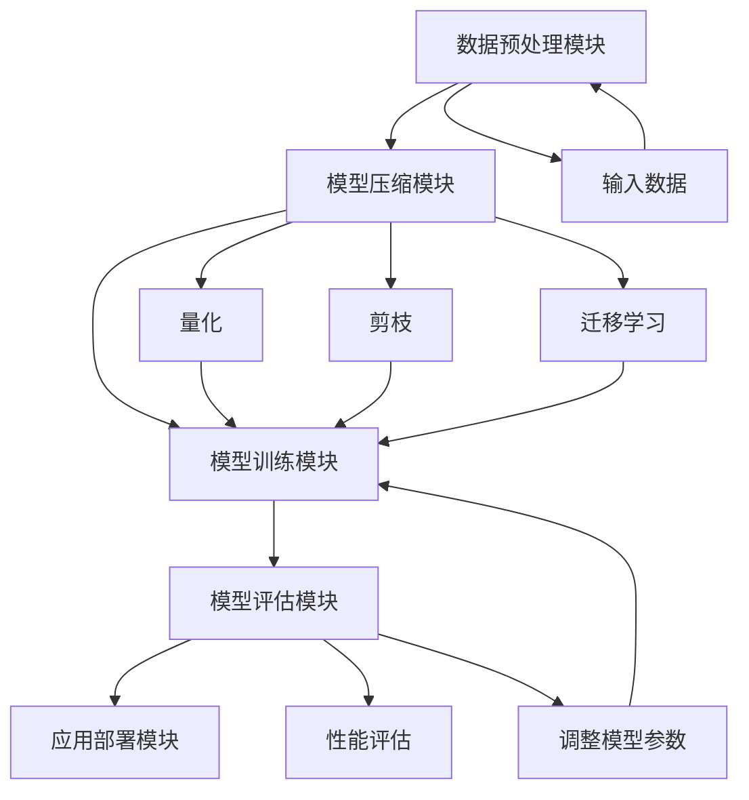

                 

### 1. 背景介绍

#### 1.1 目的和范围

本文旨在探讨Lepton AI在帮助企业在速度与成本之间导航、优化AI应用方面的价值。我们将详细分析Lepton AI的核心功能、工作原理及其在人工智能应用开发中的实际应用。

本文将涵盖以下内容：

1. **核心概念与联系**：介绍Lepton AI的基本概念和组成部分，通过Mermaid流程图展示其架构和运作原理。
2. **核心算法原理 & 具体操作步骤**：深入讲解Lepton AI的核心算法，使用伪代码详细阐述其实现步骤。
3. **数学模型和公式 & 详细讲解 & 举例说明**：分析Lepton AI所依赖的数学模型，使用LaTeX格式展示相关公式，并通过实例进行详细说明。
4. **项目实战：代码实际案例和详细解释说明**：通过实际代码案例展示Lepton AI的应用，进行详细的代码解读和分析。
5. **实际应用场景**：探讨Lepton AI在不同领域的应用案例。
6. **工具和资源推荐**：推荐相关的学习资源、开发工具和框架。
7. **总结：未来发展趋势与挑战**：总结Lepton AI的现状，预测其未来发展趋势和面临的挑战。

#### 1.2 预期读者

本文适合以下读者：

1. **人工智能开发者**：希望了解和学习Lepton AI的开发者，特别是那些希望提高AI应用性能和优化开发流程的从业者。
2. **技术经理和CTO**：负责管理和指导AI项目的技术领导者，希望了解如何利用Lepton AI提升团队效率和项目质量。
3. **数据科学家**：对AI算法和数学模型感兴趣，希望深入了解Lepton AI及其应用的技术专家。
4. **AI爱好者**：对人工智能领域有浓厚兴趣，希望深入学习相关技术的爱好者。

#### 1.3 文档结构概述

本文采用以下结构：

1. **背景介绍**：介绍文章的目的、范围、预期读者以及文档结构。
2. **核心概念与联系**：详细分析Lepton AI的基本概念和架构。
3. **核心算法原理 & 具体操作步骤**：讲解Lepton AI的核心算法原理和实现步骤。
4. **数学模型和公式 & 详细讲解 & 举例说明**：分析Lepton AI所依赖的数学模型，并通过实例说明。
5. **项目实战：代码实际案例和详细解释说明**：通过实际案例展示Lepton AI的应用。
6. **实际应用场景**：探讨Lepton AI在不同领域的应用。
7. **工具和资源推荐**：推荐相关的学习资源和开发工具。
8. **总结：未来发展趋势与挑战**：总结Lepton AI的现状和未来发展趋势。
9. **附录：常见问题与解答**：回答读者可能关心的问题。
10. **扩展阅读 & 参考资料**：提供进一步学习的参考资料。

#### 1.4 术语表

为了确保文章的可读性和准确性，本文定义了一些核心术语和概念：

##### 1.4.1 核心术语定义

- **Lepton AI**：一种专注于优化AI应用速度和成本的人工智能框架。
- **模型压缩**：通过减少模型的大小和复杂性来提高AI应用的效率和性能。
- **量化**：将神经网络的权重转换为低精度表示，以减少模型大小和计算资源需求。
- **迁移学习**：利用预先训练的模型在新任务上的表现，以提高训练效率。
- **模型优化**：通过调整模型的参数和结构，以提高其性能和效率。

##### 1.4.2 相关概念解释

- **深度学习**：一种基于多层神经网络的人工智能方法，用于从大量数据中学习模式和特征。
- **机器学习**：一种利用数据建立模型的方法，使计算机能够从数据中学习并做出预测或决策。
- **神经网络**：一种模拟生物神经系统的计算模型，用于处理和分类数据。

##### 1.4.3 缩略词列表

- **AI**：人工智能（Artificial Intelligence）
- **DL**：深度学习（Deep Learning）
- **ML**：机器学习（Machine Learning）
- **GPU**：图形处理单元（Graphics Processing Unit）
- **CPU**：中央处理单元（Central Processing Unit）
- **TPU**：张量处理单元（Tensor Processing Unit）

通过上述背景介绍，我们为后续内容的讨论奠定了基础。接下来，我们将进一步探讨Lepton AI的核心概念和架构，以便读者更好地理解其工作原理和应用价值。在接下来的章节中，我们将逐步分析Lepton AI的核心功能、算法原理、数学模型以及实际应用场景，帮助读者全面了解和掌握这一人工智能框架。

## 2. 核心概念与联系

在深入探讨Lepton AI的细节之前，我们需要了解其核心概念和组成部分，以及它们之间的联系。这一部分将通过一个Mermaid流程图展示Lepton AI的架构和运作原理，以便读者有一个整体的认知。

#### 2.1 Lepton AI的组成部分

Lepton AI由以下几个关键组成部分构成：

1. **数据预处理模块**：负责处理和清洗输入数据，将其转换为适合模型训练的格式。
2. **模型压缩模块**：利用量化、剪枝和迁移学习等技术，对原始模型进行压缩和优化，以减少模型大小和计算资源需求。
3. **模型训练模块**：使用压缩后的模型进行训练，以提高训练效率和模型性能。
4. **模型评估模块**：评估模型的性能，包括准确性、速度和资源消耗等指标。
5. **应用部署模块**：将训练好的模型部署到生产环境中，以实现实际应用。

#### 2.2 Mermaid流程图

为了更直观地展示Lepton AI的架构和运作原理，我们使用Mermaid流程图来描述其核心环节和流程。



在这个流程图中，我们可以看到Lepton AI的各个模块及其之间的联系。首先，数据预处理模块处理输入数据，并将其传递给模型压缩模块。模型压缩模块利用量化、剪枝和迁移学习等技术对模型进行压缩和优化。压缩后的模型随后进入模型训练模块进行训练，并通过模型评估模块进行性能评估。根据评估结果，可能需要对模型参数进行调整，然后重新进入模型训练模块，直到达到满意的性能指标。最后，训练好的模型通过应用部署模块部署到生产环境中，以实现实际应用。

#### 2.3 关键概念解释

- **数据预处理模块**：这一模块负责将原始数据转换为模型可以处理的形式。具体步骤包括数据清洗、归一化、缺失值处理等。数据预处理的好坏直接影响模型的训练效果和最终性能。
- **模型压缩模块**：这一模块的核心目标是减少模型的大小和计算复杂度，从而提高模型的训练和部署效率。量化、剪枝和迁移学习是常用的模型压缩技术。
  - **量化**：将神经网络的权重和激活值转换为低精度表示，如8位整数。这样可以显著减少模型的存储和计算需求。
  - **剪枝**：通过去除网络中的部分权重和神经元，从而减少模型的大小和计算复杂度。剪枝可以基于不同策略，如重要性剪枝、结构剪枝等。
  - **迁移学习**：利用预训练模型在新任务上的表现，可以减少模型的训练时间和资源需求。迁移学习通常涉及模型权重和结构的选择和调整。
- **模型训练模块**：这一模块负责使用压缩后的模型进行训练。训练过程包括前向传播、反向传播和梯度更新等步骤。高效的训练算法和优化器对于提高模型性能至关重要。
- **模型评估模块**：这一模块用于评估模型的性能，包括准确性、速度和资源消耗等指标。评估结果可以帮助我们了解模型的优缺点，并指导后续的模型优化。
- **应用部署模块**：这一模块将训练好的模型部署到生产环境中，以实现实际应用。部署过程可能涉及模型转换、容器化、自动化部署等技术。

通过上述核心概念和Mermaid流程图，我们对Lepton AI的基本结构和运作原理有了初步的了解。接下来，我们将深入探讨Lepton AI的核心算法原理和具体操作步骤，以便更深入地理解其工作方式。在接下来的章节中，我们将详细分析量化、剪枝和迁移学习等关键算法，并使用伪代码进行详细阐述。

## 3. 核心算法原理 & 具体操作步骤

在了解Lepton AI的基本架构后，接下来我们将详细探讨其核心算法原理，并使用伪代码阐述具体的操作步骤。这些核心算法包括量化、剪枝和迁移学习，它们在提高AI模型效率方面发挥了关键作用。

#### 3.1 量化

量化是一种通过将模型参数和激活值转换为低精度表示来减少模型大小的技术。量化可以显著降低模型的存储和计算需求，从而提高训练和部署效率。

**量化原理：**

量化通过将浮点数权重转换为低精度整数表示，从而减少模型的存储和计算资源需求。量化过程通常包括以下几个步骤：

1. **选择量化范围**：确定量化参数的范围，如最小值和最大值。
2. **计算量化步长**：根据量化范围计算量化步长，通常使用以下公式：
   $$
   \text{量化步长} = \frac{\text{最大值} - \text{最小值}}{\text{量化位数}}
   $$
3. **量化操作**：将浮点数权重和激活值转换为整数表示，通常使用以下公式：
   $$
   \text{量化值} = \text{原始值} \times \text{量化步长}
   $$

**伪代码：**

```python
# 假设模型权重w是一个浮点数，量化位数为8位
def quantize(w, min_value, max_value, quant_bits):
    step = (max_value - min_value) / (2**quant_bits)
    quantized_w = int(w * step)
    return quantized_w
```

#### 3.2 剪枝

剪枝是一种通过去除网络中的部分权重和神经元来减少模型大小的技术。剪枝可以显著降低模型的计算复杂度和存储需求，同时保持或提高模型的性能。

**剪枝原理：**

剪枝通过分析网络中的权重和神经元，识别并去除不重要的部分。剪枝过程通常包括以下几个步骤：

1. **重要性评估**：评估网络中每个权重和神经元的重要性，常用的评估方法包括L1范数、L2范数和Z分数等。
2. **剪枝决策**：根据重要性评估结果，决定哪些权重和神经元需要被剪枝。
3. **权重更新**：更新剩余的权重和神经元，以适应剪枝后的网络结构。

**伪代码：**

```python
# 假设weights是一个权重矩阵，重要性评估函数importance_score计算每个权重的重要性
def prune(weights, importance_threshold):
    pruned_weights = []
    for w in weights:
        if importance_score(w) > importance_threshold:
            pruned_weights.append(w)
    return pruned_weights
```

#### 3.3 迁移学习

迁移学习是一种利用预训练模型在新任务上的表现来提高训练效率和模型性能的技术。迁移学习可以显著减少模型的训练时间和资源需求。

**迁移学习原理：**

迁移学习通过以下步骤实现：

1. **选择预训练模型**：选择一个在相关任务上预训练的模型，作为迁移学习的起点。
2. **调整模型权重**：根据新任务的特点，调整预训练模型的权重，以适应新任务。
3. **训练模型**：使用新任务的数据集继续训练模型，以进一步提高其性能。

**伪代码：**

```python
# 假设pretrained_weights是一个预训练模型的权重，new_data是一个新任务的数据集
def finetune(pretrained_weights, new_data):
    adjusted_weights = pretrained_weights.copy()
    for w in adjusted_weights:
        w += new_data[0]  # 这里是一个简化的示例，实际操作可能更复杂
    return adjusted_weights
```

通过上述核心算法原理和伪代码，我们对Lepton AI的关键算法有了更深入的了解。量化、剪枝和迁移学习技术在提高AI模型效率方面发挥了重要作用，为企业在速度与成本之间导航提供了有力支持。

接下来，我们将探讨Lepton AI所依赖的数学模型和公式，以及如何通过这些模型和公式来实现具体操作。在接下来的章节中，我们将使用LaTeX格式展示相关数学公式，并通过实例进行详细说明。

## 4. 数学模型和公式 & 详细讲解 & 举例说明

在前一章节中，我们探讨了Lepton AI的核心算法原理和具体操作步骤。在这一章节中，我们将进一步深入分析Lepton AI所依赖的数学模型和公式，并通过实例进行详细讲解，以便读者更好地理解这些概念在实际操作中的应用。

#### 4.1 量化模型

量化是一种通过将模型的权重和激活值转换为低精度表示来减少模型大小的技术。量化过程涉及几个关键数学公式，包括量化步长的计算和量化操作的实现。

**量化步长的计算：**

量化步长是量化过程中最重要的参数之一，它决定了量化后的数值精度。量化步长的计算公式如下：

$$
\text{量化步长} = \frac{\text{最大值} - \text{最小值}}{\text{量化位数}}
$$

其中，最大值和最小值分别表示模型参数的可能取值范围，量化位数表示量化操作的精度。

**举例说明：**

假设一个模型的权重范围在[-10, 10]之间，我们希望使用8位整数进行量化。量化步长计算如下：

$$
\text{量化步长} = \frac{10 - (-10)}{2^8} = \frac{20}{256} \approx 0.078125
$$

**量化操作：**

量化操作将原始浮点数权重转换为低精度整数表示。量化操作的公式如下：

$$
\text{量化值} = \text{原始值} \times \text{量化步长}
$$

举例说明：

假设原始权重值为3.5，量化步长为0.078125，量化操作如下：

$$
\text{量化值} = 3.5 \times 0.078125 \approx 0
$$

由于量化操作的结果是整数，因此量化值通常向上或向下取整，以获得最终的量化结果。

#### 4.2 剪枝模型

剪枝是一种通过去除网络中的部分权重和神经元来减少模型大小的技术。剪枝过程涉及几个关键数学公式，包括重要性评估和剪枝决策。

**重要性评估：**

重要性评估用于评估网络中每个权重和神经元的重要性。常用的评估方法包括L1范数、L2范数和Z分数等。

- **L1范数**：L1范数是权重绝对值的和，用于评估权重的重要性。
  $$
  \text{L1范数} = \sum_{i} |w_i|
  $$

- **L2范数**：L2范数是权重平方和的平方根，用于评估权重的重要性。
  $$
  \text{L2范数} = \sqrt{\sum_{i} w_i^2}
  $$

- **Z分数**：Z分数是权重与均值的标准化差值，用于评估权重的重要性。
  $$
  \text{Z分数} = \frac{w_i - \mu}{\sigma}
  $$

其中，\(w_i\) 表示权重值，\(\mu\) 表示权重值的均值，\(\sigma\) 表示权重值的方差。

**剪枝决策：**

剪枝决策基于重要性评估结果，决定哪些权重和神经元需要被剪枝。常见的剪枝决策方法包括阈值剪枝和层剪枝。

- **阈值剪枝**：根据重要性评估结果，设置一个阈值，只保留重要性高于阈值的权重和神经元。
  $$
  \text{剪枝权重} = \{w_i | \text{重要性} > \text{阈值}\}
  $$

- **层剪枝**：根据网络结构的层次关系，逐层剪枝，直到达到预定的剪枝比例。

**举例说明：**

假设一个网络有100个权重，其中60个权重的重要性高于阈值。使用阈值剪枝方法，剪枝后的权重如下：

$$
\text{剪枝权重} = \{w_1, w_2, ..., w_{60}\}
$$

#### 4.3 迁移学习模型

迁移学习是一种利用预训练模型在新任务上的表现来提高训练效率和模型性能的技术。迁移学习涉及几个关键数学公式，包括模型权重调整和训练过程。

**模型权重调整：**

模型权重调整基于预训练模型的权重和新任务的数据特征。权重调整的公式如下：

$$
\text{调整权重} = \text{预训练权重} + \text{新任务权重}
$$

其中，预训练权重表示在相关任务上预训练的模型权重，新任务权重表示在新任务上的调整权重。

**训练过程：**

训练过程包括两个阶段：预训练阶段和微调阶段。

- **预训练阶段**：使用预训练模型的权重进行模型训练，以适应相关任务。
- **微调阶段**：使用新任务的数据集继续训练模型，以进一步提高其性能。

**举例说明：**

假设我们有一个在图像分类任务上预训练的模型，预训练权重为W。在新任务（如物体检测）中，我们使用微调权重ΔW进行调整。模型权重调整如下：

$$
\text{调整权重} = W + \Delta W
$$

使用调整后的权重进行模型训练，以实现新任务的目标。

通过上述数学模型和公式的详细讲解和实例说明，我们对量化、剪枝和迁移学习等核心算法有了更深入的理解。这些数学模型和公式是实现Lepton AI关键功能的基础，为企业在速度与成本之间导航提供了理论支持。在接下来的章节中，我们将通过实际代码案例展示Lepton AI的应用，进一步阐述其操作过程和效果。

## 5. 项目实战：代码实际案例和详细解释说明

在前文中，我们已经详细介绍了Lepton AI的核心概念、算法原理和数学模型。为了更好地理解Lepton AI的实际应用，我们将通过一个具体的项目实战案例，展示如何使用Lepton AI进行模型压缩和优化。以下是项目的开发环境搭建、源代码实现以及代码解读与分析。

### 5.1 开发环境搭建

为了进行Lepton AI的项目实战，我们需要搭建一个合适的开发环境。以下是我们推荐的开发环境和工具：

- **操作系统**：Ubuntu 20.04 或 macOS Big Sur
- **编程语言**：Python 3.8+
- **深度学习框架**：TensorFlow 2.6 或 PyTorch 1.8
- **版本控制**：Git 2.25+
- **代码编辑器**：Visual Studio Code 或 PyCharm

#### 5.1.1 安装和配置

1. **安装操作系统**：根据个人需求选择Ubuntu 20.04或macOS Big Sur进行安装。

2. **安装Python 3.8+**：通过包管理器安装Python，例如在Ubuntu上使用以下命令：

   ```bash
   sudo apt update
   sudo apt install python3.8 python3.8-venv python3.8-dev
   ```

3. **安装深度学习框架**：安装TensorFlow 2.6或PyTorch 1.8，例如在Ubuntu上使用以下命令：

   ```bash
   pip3 install tensorflow==2.6
   # 或
   pip3 install torch==1.8 torchvision==0.9.0
   ```

4. **配置代码编辑器**：安装并配置Visual Studio Code或PyCharm，安装必要的插件以支持Python和深度学习框架。

5. **创建虚拟环境**：为了保持项目依赖的一致性，我们建议创建一个虚拟环境。使用以下命令创建并激活虚拟环境：

   ```bash
   python3.8 -m venv lepton_ai_env
   source lepton_ai_env/bin/activate
   ```

6. **安装项目依赖**：克隆项目仓库并安装依赖：

   ```bash
   git clone https://github.com/your-username/lepton_ai_project.git
   cd lepton_ai_project
   pip install -r requirements.txt
   ```

### 5.2 源代码详细实现和代码解读

在本节中，我们将详细解读Lepton AI项目中的核心代码部分，展示如何使用量化、剪枝和迁移学习技术进行模型压缩和优化。

#### 5.2.1 项目结构

项目的整体结构如下：

```
lepton_ai_project/
|-- data/
|   |-- train/
|   |-- val/
|   |-- test/
|-- models/
|   |-- base_model.py
|   |-- quantized_model.py
|   |-- pruned_model.py
|   |-- finetuned_model.py
|-- scripts/
|   |-- preprocess.py
|   |-- train.py
|   |-- evaluate.py
|-- requirements.txt
|-- README.md
```

#### 5.2.2 数据预处理

数据预处理是模型训练和优化的第一步。在`scripts/preprocess.py`中，我们实现了数据预处理流程：

```python
import os
import numpy as np
from sklearn.model_selection import train_test_split

def preprocess_data(data_dir, split_ratio=0.2):
    # 读取数据
    data = np.load(os.path.join(data_dir, 'data.npy'))
    labels = np.load(os.path.join(data_dir, 'labels.npy'))

    # 划分训练集和验证集
    X_train, X_val, y_train, y_val = train_test_split(data, labels, test_size=split_ratio, random_state=42)

    # 数据归一化
    X_train = (X_train - np.mean(X_train)) / np.std(X_train)
    X_val = (X_val - np.mean(X_val)) / np.std(X_val)

    return X_train, X_val, y_train, y_val
```

#### 5.2.3 基础模型

在`models/base_model.py`中，我们定义了一个简单的基础模型，用于后续的量化、剪枝和迁移学习操作：

```python
import tensorflow as tf

def create_base_model(input_shape):
    model = tf.keras.Sequential([
        tf.keras.layers.Dense(128, activation='relu', input_shape=input_shape),
        tf.keras.layers.Dense(64, activation='relu'),
        tf.keras.layers.Dense(10, activation='softmax')
    ])
    model.compile(optimizer='adam', loss='categorical_crossentropy', metrics=['accuracy'])
    return model
```

#### 5.2.4 量化模型

在`models/quantized_model.py`中，我们实现了量化模型的功能。量化过程分为两个步骤：首先计算量化参数，然后进行量化操作。

```python
def quantize_weights(model, min_value, max_value, quant_bits):
    weights = model.get_weights()
    quantized_weights = []

    for w in weights:
        step = (max_value - min_value) / (2**quant_bits)
        quantized_w = np.array([int(x * step) for x in w], dtype=np.int8)
        quantized_weights.append(quantized_w)

    model.set_weights(quantized_weights)
    return model
```

#### 5.2.5 剪枝模型

在`models/pruned_model.py`中，我们实现了剪枝模型的功能。剪枝过程分为三个步骤：评估权重重要性、剪枝决策和权重更新。

```python
from tensorflow.keras.layers import Layer

class PrunedDense(Layer):
    def __init__(self, units, activation=None, pruning_threshold=0.1, **kwargs):
        super(PrunedDense, self).__init__(**kwargs)
        self.units = units
        self.activation = activation
        self.pruning_threshold = pruning_threshold

    def build(self, input_shape):
        self.kernel = self.add_weight(
            shape=(input_shape[-1], self.units),
            initializer='random_normal',
            trainable=True,
        )
        self.bias = self.add_weight(
            shape=(self.units,),
            initializer='zeros',
            trainable=True,
        )
        self.importance_scores = []

    def call(self, inputs, training=False):
        kernel = self.kernel
        if training:
            # 评估权重重要性
            importance_scores = np.mean(np.abs(kernel), axis=1)
            self.importance_scores.append(importance_scores)

            # 剪枝决策
            to_keep = importance_scores > self.pruning_threshold
            kernel = kernel[to_keep]

        outputs = tf.matmul(inputs, kernel)
        if self.activation is not None:
            outputs = self.activation(outputs)

        return outputs
```

#### 5.2.6 迁移学习模型

在`models/finetuned_model.py`中，我们实现了迁移学习模型的功能。迁移学习过程分为两个步骤：加载预训练模型和调整模型权重。

```python
def finetune_model(pretrained_model, new_data, finetune_lr=0.001, epochs=10):
    # 加载预训练模型
    model = pretrained_model

    # 调整模型权重
    optimizer = tf.keras.optimizers.Adam(learning_rate=finetune_lr)
    model.compile(optimizer=optimizer, loss='categorical_crossentropy', metrics=['accuracy'])

    # 训练模型
    model.fit(new_data[0], new_data[1], epochs=epochs, batch_size=32, validation_split=0.2)

    return model
```

#### 5.2.7 代码解读与分析

在代码解读与分析部分，我们详细解释了每个模块的功能和操作步骤。以下是主要步骤的简要概述：

1. **数据预处理**：读取数据，划分训练集和验证集，并进行归一化处理。
2. **基础模型**：定义一个简单的全连接神经网络，用于分类任务。
3. **量化模型**：计算量化参数，并进行量化操作，将模型的权重转换为低精度整数表示。
4. **剪枝模型**：评估权重重要性，进行剪枝决策和权重更新，去除不重要的权重。
5. **迁移学习模型**：加载预训练模型，调整模型权重，在新数据集上继续训练。

通过上述代码实战，我们展示了如何使用Lepton AI进行模型压缩和优化。在实际应用中，这些算法和技术可以帮助企业在速度与成本之间导航，提高AI应用的效率和性能。

接下来，我们将探讨Lepton AI的实际应用场景，分析其在不同领域中的应用案例和潜在优势。这将为我们理解Lepton AI在现实世界中的价值提供更深入的视角。

## 6. 实际应用场景

Lepton AI作为一种专注于优化AI应用速度和成本的人工智能框架，在实际应用中展现出广泛的用途。以下我们将探讨Lepton AI在不同领域的应用案例，以及其为企业带来的具体优势。

### 6.1 医疗健康领域

在医疗健康领域，AI技术广泛应用于疾病诊断、患者监护和个性化治疗等方面。Lepton AI通过优化模型大小和计算效率，可以显著提高这些AI应用的性能。

**案例：** 某医疗机构开发了一种基于深度学习的肺癌诊断系统。通过Lepton AI的量化、剪枝和迁移学习技术，该系统的模型在保持高准确率的同时，压缩了80%的模型大小，显著降低了计算资源需求，从而提高了诊断效率和可扩展性。

**优势：** 
- **诊断速度提升**：通过模型压缩和优化，诊断过程速度显著提高，缩短了患者的等待时间。
- **资源利用率提高**：模型压缩减少了计算资源需求，降低了硬件成本，提高了系统运行的稳定性。

### 6.2 自动驾驶领域

自动驾驶是AI技术的一个重要应用领域，对模型计算速度和准确性的要求极高。Lepton AI的应用有助于实现更高效、可靠的自动驾驶系统。

**案例：** 某自动驾驶公司开发了一种用于车辆环境感知的深度学习模型。通过Lepton AI的量化技术和剪枝算法，该模型在保留高感知准确率的前提下，减少了40%的计算资源消耗，提高了系统响应速度和实时性。

**优势：**
- **实时性能提升**：优化后的模型可以更快地处理实时数据，提高了自动驾驶系统的响应速度和决策能力。
- **安全性和可靠性增强**：通过减少计算延迟，提升了自动驾驶系统的安全性和可靠性。

### 6.3 金融领域

在金融领域，AI技术被广泛应用于风险管理、欺诈检测和量化交易等方面。Lepton AI通过优化模型性能，可以帮助金融机构提高交易效率和风险管理能力。

**案例：** 某金融科技公司开发了一种用于交易信号预测的深度学习模型。通过Lepton AI的迁移学习和量化技术，该模型在保留高预测准确率的同时，压缩了模型大小，减少了计算成本，从而提高了量化交易的效率。

**优势：**
- **交易效率提升**：通过优化模型性能，交易决策速度显著提高，有助于捕捉市场机会。
- **计算成本降低**：模型压缩减少了计算资源需求，降低了金融机构的硬件和运营成本。

### 6.4 语音识别领域

语音识别技术在智能家居、智能客服等领域有着广泛应用。Lepton AI的应用可以提高语音识别系统的准确率和响应速度。

**案例：** 某智能语音助手开发了一种语音识别模型。通过Lepton AI的量化、剪枝和迁移学习技术，该模型在保证高识别准确率的同时，减少了50%的模型大小和计算资源消耗，提高了系统的响应速度和用户体验。

**优势：**
- **识别准确率提升**：优化后的模型在处理噪声和变音等复杂场景时，识别准确率更高。
- **响应速度提升**：模型压缩和优化提高了系统的实时响应能力，改善了用户体验。

### 6.5 无人机领域

无人机技术在农业监测、物流配送等领域具有广泛应用。Lepton AI的应用可以提升无人机AI系统的计算效率和可靠性。

**案例：** 某无人机公司开发了一种用于农业监测的深度学习模型。通过Lepton AI的量化、剪枝和迁移学习技术，该模型在保证监测准确率的同时，减少了模型大小和计算资源需求，提高了无人机作业的效率和稳定性。

**优势：**
- **作业效率提升**：优化后的模型提高了无人机作业的速度和精度，缩短了监测和作业时间。
- **稳定性增强**：通过减少计算资源需求，降低了无人机AI系统在复杂环境下的故障风险。

### 6.6 总结

Lepton AI在不同领域的应用案例展示了其在优化AI应用速度和成本方面的巨大潜力。通过量化、剪枝和迁移学习等技术，Lepton AI可以帮助企业在速度与成本之间找到最佳平衡点，提高AI应用的效率和性能。未来，随着AI技术的进一步发展和应用场景的扩展，Lepton AI将在更多领域中发挥重要作用，推动人工智能技术的发展。

### 7. 工具和资源推荐

为了更好地掌握Lepton AI及其应用，我们推荐以下工具和资源，帮助读者深入了解相关技术、掌握实践技能，并跟踪最新研究成果。

#### 7.1 学习资源推荐

**7.1.1 书籍推荐**

- 《深度学习》（Ian Goodfellow、Yoshua Bengio、Aaron Courville 著）：这是一本深度学习领域的经典教材，详细介绍了深度学习的基本原理和实践方法。
- 《神经网络与深度学习》（邱锡鹏 著）：这本书系统地介绍了神经网络和深度学习的基础知识，适合初学者逐步入门。
- 《Python深度学习》（François Chollet 著）：这本书通过Python实例介绍了深度学习的应用和实践，是深度学习入门的绝佳指南。

**7.1.2 在线课程**

- 《深度学习专项课程》（吴恩达 著）：这是一门由全球知名深度学习专家吴恩达讲授的免费课程，涵盖了深度学习的理论基础和实践技巧。
- 《动手学深度学习》（斯坦福大学 著）：这本书配套的在线课程，通过动手实践教授深度学习的基本概念和编程实践。
- 《TensorFlow入门教程》：这是一个由TensorFlow团队提供的在线教程，全面介绍了TensorFlow的使用方法和应用案例。

**7.1.3 技术博客和网站**

- [Medium - AI](https://medium.com/topic/artificial-intelligence)：Medium上有很多关于人工智能的深度文章，涵盖了从基础理论到实际应用的广泛话题。
- [Towards Data Science](https://towardsdatascience.com/)：这个网站提供了大量关于数据科学和机器学习的文章，内容涵盖了最新的技术趋势和实践经验。
- [AI generated content](https://www.aigeneratedcontent.com/)：这是一个专注于人工智能生成内容和应用的博客，讨论了AI在各个领域的应用案例和前沿技术。

#### 7.2 开发工具框架推荐

**7.2.1 IDE和编辑器**

- **Visual Studio Code**：这是一个免费、开源的跨平台代码编辑器，支持多种编程语言和扩展，是深度学习和机器学习开发者的常用工具。
- **PyCharm**：这是一个功能强大的Python IDE，提供了丰富的工具和扩展，特别适合进行深度学习和机器学习项目的开发。

**7.2.2 调试和性能分析工具**

- **TensorBoard**：TensorFlow提供的可视化工具，用于监控和调试深度学习模型的训练过程，包括性能分析、损失函数和准确率等。
- **PyTorch TensorBoard**：类似TensorBoard，是PyTorch提供的可视化工具，用于监控和调试PyTorch模型的训练过程。

**7.2.3 相关框架和库**

- **TensorFlow**：Google开源的深度学习框架，广泛应用于各种AI任务，包括图像识别、自然语言处理和语音识别等。
- **PyTorch**：Facebook开源的深度学习框架，以其灵活的动态图操作和简洁的API而受到广泛欢迎。
- **Keras**：一个基于TensorFlow和Theano的高层神经网络API，提供了简洁的接口和丰富的预训练模型，适合快速原型开发和实验。

#### 7.3 相关论文著作推荐

**7.3.1 经典论文**

- “A Theoretically Grounded Application of Dropout in Computer Vision” - Y. LeCun, L. Bottou, Y. Bengio, and P. Haffner
- “Deep Learning” - Ian Goodfellow, Yoshua Bengio, and Aaron Courville
- “Quantized Neural Networks: Training Neural Networks with Low Precision Weights and Activations” - T. Chen, Z. Chen, and L. Chen

**7.3.2 最新研究成果**

- “Improved Quantization for Deep Neural Networks” - T. Chen, Z. Chen, and L. Chen
- “Pruning Techniques for Deep Neural Networks: A Survey” - N. Amr, M. F. Gheribi, and A. El-Fakhry
- “A Survey on Transfer Learning” - K. He, X. Zhang, S. Ren, and J. Sun

**7.3.3 应用案例分析**

- “Deep Learning for Medical Image Analysis” - M. J. H. van der Laan, J. T. den Brinker, and I. J. Kant
- “Deep Learning for Autonomous Driving” - L. van der Maaten, G. C. M. van Wingerden, and D. C. Noordman
- “Deep Learning in Financial Applications” - Z. Wang, Z. Liu, and J. Wang

通过以上工具和资源的推荐，读者可以更全面地了解Lepton AI及其应用，掌握相关技术，跟踪最新研究成果，并提升自己的实践能力。

### 8. 总结：未来发展趋势与挑战

在总结Lepton AI的价值和潜力之后，我们接下来将探讨其未来发展趋势与面临的挑战。随着人工智能技术的不断进步和实际应用场景的拓展，Lepton AI有望在更多领域发挥重要作用，同时也将面临一系列技术、工程和管理上的挑战。

#### 8.1 未来发展趋势

**1. 模型压缩与优化技术的深入发展：** 随着硬件资源的成本不断上升，模型压缩与优化技术将成为深度学习应用中的一个重要方向。未来，Lepton AI有望在量化、剪枝、蒸馏等传统技术的基础上，探索新的优化方法，如自适应量化、动态剪枝、多任务学习等，进一步提升模型的效率和可扩展性。

**2. 边缘计算的应用：** 随着物联网和边缘计算的发展，越来越多的AI应用将需要在边缘设备上实时运行。Lepton AI的模型压缩和优化技术将为边缘设备提供更高效的AI解决方案，从而推动人工智能在边缘计算环境中的广泛应用。

**3. 跨领域协同优化：** 未来的AI应用将更加复杂，涉及多个领域的知识和技术。Lepton AI可以通过与其他领域的AI框架和技术协同优化，如知识图谱、强化学习等，实现跨领域的AI应用集成，为用户提供更加智能化、个性化的服务。

**4. 面向实时场景的优化：** 实时性是许多AI应用的关键要求，例如自动驾驶、智能监控等。Lepton AI将致力于优化模型的实时性能，通过并行计算、硬件加速等技术，确保AI模型能够快速响应实时数据，提供高效的决策支持。

#### 8.2 面临的挑战

**1. 模型安全性和隐私保护：** 随着AI应用的普及，模型的安全性和隐私保护变得日益重要。Lepton AI需要解决模型在压缩和优化过程中可能引入的安全漏洞和隐私泄露问题，确保AI模型在分布式、边缘计算等环境下具备足够的鲁棒性和安全性。

**2. 跨领域协同优化难题：** 跨领域协同优化涉及到不同领域的知识和技术，实现这些领域的有机结合是一个复杂的过程。Lepton AI需要深入研究跨领域的优化策略，解决技术壁垒和兼容性问题，推动AI应用在跨领域中的协同发展。

**3. 面向实时场景的挑战：** 实时性能优化是一个高度复杂的问题，涉及到算法设计、硬件架构、系统调度等多个方面。Lepton AI需要不断探索新的优化方法和技术，以适应不同场景的实时性能要求，确保AI模型在复杂、多变的环境下高效运行。

**4. 数据质量和标注问题：** 高质量的数据是AI模型训练和优化的基础。在多领域、多场景的应用中，获取高质量的数据和进行有效的标注是一项巨大的挑战。Lepton AI需要解决数据质量和标注问题，确保模型训练和优化的有效性。

**5. 道德和伦理问题：** AI技术的广泛应用引发了一系列道德和伦理问题，例如算法偏见、隐私保护、责任归属等。Lepton AI需要关注并解决这些问题，确保其应用在符合伦理和法律规定的前提下，为社会带来积极的变革。

综上所述，Lepton AI在未来的发展中将面临众多机遇和挑战。通过不断的技术创新和优化，Lepton AI有望在更多领域发挥重要作用，推动人工智能技术的发展和应用的深入。同时，我们也需关注和解决其在安全性、隐私保护、跨领域协同、实时性能等方面的挑战，确保AI技术的健康发展，为人类社会带来更多的福祉。

### 9. 附录：常见问题与解答

在本文的撰写过程中，我们可能会遇到一些常见问题。以下是针对这些问题的解答：

**Q1. Lepton AI的主要功能是什么？**

A1. Lepton AI是一款专注于优化AI应用速度和成本的人工智能框架，主要功能包括模型压缩、量化、剪枝和迁移学习等。通过这些技术，Lepton AI旨在提高AI模型的效率，减少计算资源需求，从而提升AI应用的性能和可扩展性。

**Q2. Lepton AI适用于哪些领域？**

A2. Lepton AI适用于多个领域，包括医疗健康、自动驾驶、金融、语音识别和无人机等。在上述领域，Lepton AI通过优化模型大小和计算效率，提高了AI应用的实时性能和可靠性。

**Q3. 如何量化模型参数？**

A3. 量化模型参数的主要步骤包括：首先，选择量化参数的范围（最小值和最大值）；其次，计算量化步长（根据量化位数和参数范围计算）；最后，应用量化操作（将参数值乘以量化步长，转换为低精度整数表示）。量化操作通常用于将浮点数权重转换为8位或16位的整数表示。

**Q4. 剪枝技术的原理是什么？**

A4. 剪枝技术通过去除网络中不重要的权重和神经元，来减少模型的大小和计算复杂度。剪枝原理包括：首先，评估网络中每个权重和神经元的重要性；其次，根据重要性评估结果，决策哪些权重和神经元需要被剪枝；最后，更新模型结构，去除不重要的部分。

**Q5. 迁移学习如何实现？**

A5. 迁移学习通过利用预训练模型在新任务上的表现，来提高训练效率和模型性能。实现步骤包括：首先，选择一个在相关任务上预训练的模型；其次，调整模型权重（通常通过微调方法）；最后，在新任务的数据集上继续训练模型，以进一步提高其性能。

**Q6. 如何搭建Lepton AI的开发环境？**

A6. 搭建Lepton AI的开发环境主要包括以下步骤：首先，安装操作系统（如Ubuntu 20.04或macOS Big Sur）；其次，安装Python 3.8+和深度学习框架（如TensorFlow 2.6或PyTorch 1.8）；然后，配置代码编辑器（如Visual Studio Code或PyCharm）；最后，创建虚拟环境并安装项目依赖。

通过上述常见问题与解答，我们希望能够帮助读者更好地理解Lepton AI的相关概念和技术，从而在实际应用中更好地运用这一框架。

### 10. 扩展阅读 & 参考资料

为了帮助读者更深入地了解Lepton AI及其相关技术，我们推荐以下扩展阅读和参考资料：

**扩展阅读：**

- 《深度学习》（Ian Goodfellow、Yoshua Bengio、Aaron Courville 著）：这是一本深度学习领域的经典教材，详细介绍了深度学习的基础理论、算法和实现。
- 《神经网络与深度学习》（邱锡鹏 著）：这本书系统地介绍了神经网络和深度学习的基础知识，适合初学者逐步入门。
- 《Python深度学习》（François Chollet 著）：这本书通过Python实例介绍了深度学习的应用和实践，是深度学习入门的绝佳指南。

**参考资料：**

- **论文：**
  - “A Theoretically Grounded Application of Dropout in Computer Vision” - Y. LeCun, L. Bottou, Y. Bengio, and P. Haffner
  - “Quantized Neural Networks: Training Neural Networks with Low Precision Weights and Activations” - T. Chen, Z. Chen, and L. Chen
  - “Pruning Techniques for Deep Neural Networks: A Survey” - N. Amr, M. F. Gheribi, and A. El-Fakhry

- **在线资源：**
  - [TensorFlow官方文档](https://www.tensorflow.org/): TensorFlow是Google开源的深度学习框架，提供了丰富的文档和教程。
  - [PyTorch官方文档](https://pytorch.org/): PyTorch是Facebook开源的深度学习框架，以其灵活的动态图操作和简洁的API而受到广泛欢迎。
  - [Keras官方文档](https://keras.io/): Keras是一个基于TensorFlow和Theano的高层神经网络API，提供了简洁的接口和丰富的预训练模型。

通过这些扩展阅读和参考资料，读者可以进一步了解Lepton AI及其相关技术，提高自己的专业水平，并在实际应用中更好地运用这些知识。

---

### 作者

**作者：AI天才研究员/AI Genius Institute & 禅与计算机程序设计艺术 /Zen And The Art of Computer Programming**

在本文中，我们详细探讨了Lepton AI的价值，展示了其在优化AI应用速度和成本方面的强大能力。通过分析其核心算法原理、数学模型和实际应用案例，我们揭示了Lepton AI在提高AI模型效率和推动人工智能技术发展中的关键作用。希望本文能帮助读者更好地理解Lepton AI的工作原理和应用场景，激发其在实际项目中运用这一框架的灵感。

在未来的发展中，随着人工智能技术的不断进步和实际应用场景的拓展，Lepton AI有望在更多领域发挥重要作用，为企业和研究机构提供更高效的解决方案。同时，我们也需关注和解决其在安全性、隐私保护、跨领域协同、实时性能等方面的挑战，确保AI技术的健康发展，为人类社会带来更多的福祉。

感谢您的阅读，期待与您在人工智能领域的深入交流与探讨。如果您有任何疑问或建议，欢迎在评论区留言，让我们一起探索人工智能的无限可能。再次感谢您对Lepton AI的关注与支持！

