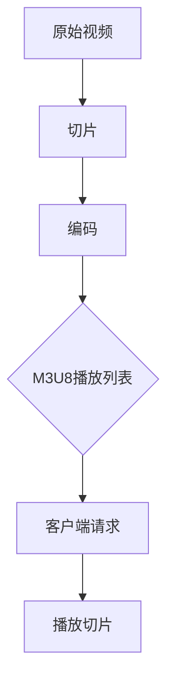

                 

# M3U8与HLS：自适应比特率流媒体

> **关键词：M3U8，HLS，自适应比特率，流媒体，算法原理，项目实战，应用场景**

> **摘要：本文将深入探讨M3U8与HLS技术，解析它们在自适应比特率流媒体中的核心原理和应用。通过一步步的讲解，读者将掌握M3U8和HLS的基础知识，理解它们如何实现高效、灵活的流媒体传输。文章还将通过具体案例和代码解析，展示如何在项目中实践这些技术。**

## 1. 背景介绍

### 1.1 目的和范围

本文旨在为读者提供对M3U8（音视频播放列表）与HLS（HTTP Live Streaming）技术的全面理解，并展示其在自适应比特率流媒体中的重要性。通过详细讲解这些技术的核心原理、算法和实际应用，读者可以更好地掌握它们，并能在实际项目中灵活运用。

### 1.2 预期读者

本文面向对网络流媒体技术有一定了解的开发者、工程师以及学生。无论你是前端开发者、后端工程师还是流媒体技术爱好者，只要对M3U8与HLS技术感兴趣，都可以从本文中获得宝贵的知识和实践经验。

### 1.3 文档结构概述

本文分为以下几个部分：

- **第1章**：背景介绍，包括本文的目的、范围、预期读者以及文档结构概述。
- **第2章**：核心概念与联系，介绍M3U8和HLS的基本原理及流程图。
- **第3章**：核心算法原理与具体操作步骤，通过伪代码详细阐述M3U8和HLS的算法实现。
- **第4章**：数学模型和公式，讲解与M3U8和HLS相关的数学模型和公式。
- **第5章**：项目实战，通过代码案例展示M3U8和HLS在实际项目中的应用。
- **第6章**：实际应用场景，分析M3U8和HLS在不同场景中的适用性。
- **第7章**：工具和资源推荐，提供学习资源、开发工具和经典论文推荐。
- **第8章**：总结，展望M3U8和HLS技术的未来发展趋势与挑战。
- **第9章**：附录，常见问题与解答。
- **第10章**：扩展阅读与参考资料，提供更多深入学习的相关资源和文献。

### 1.4 术语表

#### 1.4.1 核心术语定义

- **M3U8**：一种常见的音视频播放列表格式，用于定义流媒体中各个媒体的播放顺序和播放地址。
- **HLS**：HTTP Live Streaming，一种基于HTTP协议的流媒体传输技术，通过将视频分成小片段并使用M3U8播放列表进行管理，实现自适应比特率流媒体传输。
- **自适应比特率**：根据用户的网络状况和设备性能动态调整视频传输的比特率，确保用户在观看视频时获得最佳体验。
- **流媒体**：通过网络传输媒体内容（如音频、视频），允许用户在下载整个文件之前进行播放的技术。

#### 1.4.2 相关概念解释

- **HTTP**：HyperText Transfer Protocol，超文本传输协议，是互联网上应用最广泛的协议之一，用于在客户端和服务器之间传输数据。
- **HTTP Live Streaming（HLS）**：基于HTTP协议的流媒体传输技术，通过将视频分割成小片段，并使用M3U8播放列表管理这些片段，实现自适应比特率流媒体传输。
- **MPEG-DASH**：Dynamic Adaptive Streaming over HTTP，另一种基于HTTP协议的自适应比特率流媒体传输技术，与HLS类似，但支持更多媒体格式。

#### 1.4.3 缩略词列表

- **M3U8**：M3U8 File Format
- **HLS**：HTTP Live Streaming
- **HTTP**：HyperText Transfer Protocol
- **MPEG-DASH**：Dynamic Adaptive Streaming over HTTP

## 2. 核心概念与联系

M3U8与HLS技术在自适应比特率流媒体传输中扮演着关键角色。本节将介绍M3U8和HLS的基本概念、原理及其相互关系。

### 2.1 M3U8概述

M3U8是一种用于定义音视频播放列表的文件格式，它由一系列播放地址组成，每个地址对应一个媒体文件。M3U8文件通常以 `.m3u8` 为扩展名，包含以下两部分：

- **播放列表（Playlist）**：定义了整个流媒体的播放顺序。
- **片段列表（Segments）**：包含了每个媒体文件的播放地址。

M3U8文件的基本格式如下：

```plaintext
#EXTM3U
#EXT-X-VERSION:3
#EXT-X-MEDIA-SEQUENCE:0
#EXT-X-TARGETDURATION:8
#EXT-X-STREAM-INF:BANDWIDTH=60000,CODECS="avc1.640028,mp4a.40.2"
http://example.com/stream1.ts
#EXTINF:8.25,
http://example.com/stream2.ts
...
```

上述M3U8文件定义了一个包含三个片段的播放列表。每个片段的播放时长为8.25秒，带宽为60 kbps。

### 2.2 HLS概述

HLS是一种基于HTTP协议的流媒体传输技术，通过将视频分割成小片段（通常是10秒或20秒），并使用M3U8播放列表进行管理，实现自适应比特率流媒体传输。HLS的基本原理如下：

1. **切片（Segmentation）**：将原始视频分割成一系列小的媒体文件（如`.ts`）。
2. **编码（Encoding）**：对每个切片进行不同的比特率编码，以满足不同网络状况和设备性能的需求。
3. **生成M3U8播放列表**：根据切片和编码结果，生成M3U8文件，包含每个切片的播放地址和播放顺序。
4. **客户端请求**：客户端根据M3U8文件中的播放地址，逐个请求并播放每个切片。

### 2.3 M3U8与HLS的关系

M3U8是HLS的核心组成部分，用于定义流媒体的播放列表和片段。具体来说，HLS技术依赖于M3U8文件来实现以下几个关键功能：

1. **管理播放顺序**：M3U8文件定义了流媒体的播放顺序，确保客户端按照正确的顺序播放每个切片。
2. **自适应比特率**：M3U8文件中的播放地址对应不同比特率的切片，客户端可以根据自身网络状况和设备性能选择合适的切片进行播放。
3. **持续更新**：M3U8文件可以动态更新，以反映流媒体的新切片或修改播放顺序。

### 2.4 Mermaid流程图

下面是M3U8和HLS的Mermaid流程图，展示了它们的基本原理和相互关系：



## 3. 核心算法原理 & 具体操作步骤

M3U8和HLS技术背后有复杂的算法原理，本节将详细介绍这些算法，并通过伪代码形式展现具体操作步骤。

### 3.1 HLS切片算法原理

HLS切片算法的核心是 将原始视频分割成一系列连续的媒体文件，每个文件对应一个时间片段。切片算法的关键步骤如下：

1. **计算切片时长**：根据M3U8文件中的`#EXT-X-TARGETDURATION`标签，确定每个切片的时长。例如，若目标时长为8秒，则每个切片的时长为8秒。
2. **读取视频数据**：从原始视频中读取数据，按照切片时长进行分割。
3. **生成切片文件**：将每个分割后的数据保存为独立的媒体文件，如`.ts`文件。

伪代码实现如下：

```plaintext
function sliceVideo(videoFile, outputFolder, duration):
    videoStream = readVideo(videoFile)
    currentTime = 0
    while currentTime < videoDuration:
        sliceStream = readNextSlice(videoStream, duration)
        fileName = generateFileName(outputFolder, currentTime, duration)
        writeSliceToFile(sliceStream, fileName)
        currentTime += duration
```

### 3.2 HLS编码算法原理

HLS编码算法的核心是 对每个切片进行不同比特率的编码，以满足不同网络状况和设备性能的需求。编码算法的关键步骤如下：

1. **选择编码器**：根据目标比特率和编码格式，选择合适的编码器。
2. **编码切片**：使用编码器对每个切片进行编码，生成多个比特率的媒体文件。
3. **生成M3U8播放列表**：根据编码结果，生成包含多个比特率的M3U8播放列表。

伪代码实现如下：

```plaintext
function encodeVideoSlice(sliceStream, targetBitrates, codec):
    for bitrate in targetBitrates:
        encodedStream = encodeSlice(sliceStream, bitrate, codec)
        fileName = generateFileName(outputFolder, bitrate, codec)
        writeSliceToFile(encodedStream, fileName)
    generateM3U8Playlist(targetBitrates, codec)
```

### 3.3 HLS播放算法原理

HLS播放算法的核心是 让客户端根据M3U8播放列表，逐个请求并播放每个切片。播放算法的关键步骤如下：

1. **读取M3U8播放列表**：从服务器获取M3U8播放列表，解析其中的播放地址和播放顺序。
2. **请求切片文件**：根据M3U8播放列表，逐个请求并下载每个切片文件。
3. **播放切片文件**：将下载后的切片文件播放给用户。

伪代码实现如下：

```plaintext
function playVideo(playlistFile):
    playlist = readM3U8Playlist(playlistFile)
    for segment in playlist.segments:
        segmentFile = requestSegment(segment.url)
        playSegment(segmentFile)
```

## 4. 数学模型和公式 & 详细讲解 & 举例说明

M3U8与HLS技术在自适应比特率流媒体传输中涉及多个数学模型和公式。本节将详细讲解这些数学模型和公式，并通过具体例子进行说明。

### 4.1 数据传输速率计算公式

数据传输速率是流媒体传输中的一个重要指标，用于衡量数据传输的速度。数据传输速率的计算公式如下：

$$
R = \frac{B \times L}{1000}
$$

其中，\( R \) 表示数据传输速率（字节/秒），\( B \) 表示比特率（比特/秒），\( L \) 表示字节长度（字节）。

#### 举例说明

假设一个切片文件的比特率为1000 kbps，字节长度为1024字节，计算该切片文件的数据传输速率：

$$
R = \frac{1000 \times 1024}{1000} = 1024 \text{ 字节/秒}
$$

### 4.2 自适应比特率计算公式

自适应比特率是根据用户网络状况和设备性能动态调整视频传输的比特率。自适应比特率的计算公式如下：

$$
B_{new} = \alpha \times B_{current}
$$

其中，\( B_{new} \) 表示新的比特率，\( B_{current} \) 表示当前比特率，\( \alpha \) 表示调整系数。

#### 举例说明

假设当前比特率为500 kbps，调整系数为0.8，计算新的比特率：

$$
B_{new} = 0.8 \times 500 = 400 \text{ kbps}
$$

### 4.3 视频时长计算公式

视频时长是流媒体传输中另一个重要指标，用于衡量视频播放的持续时间。视频时长的计算公式如下：

$$
T = \frac{L}{R}
$$

其中，\( T \) 表示视频时长（秒），\( L \) 表示字节长度（字节），\( R \) 表示数据传输速率（字节/秒）。

#### 举例说明

假设一个切片文件的字节长度为1024字节，数据传输速率为1024字节/秒，计算该切片文件的视频时长：

$$
T = \frac{1024}{1024} = 1 \text{ 秒}
$$

### 4.4 切片数量计算公式

切片数量是流媒体传输中另一个关键指标，用于衡量整个视频被分割成的切片数量。切片数量的计算公式如下：

$$
N = \frac{L}{L_{slice}}
$$

其中，\( N \) 表示切片数量，\( L \) 表示视频总字节长度（字节），\( L_{slice} \) 表示每个切片的字节长度（字节）。

#### 举例说明

假设一个视频的总字节长度为10000字节，每个切片的字节长度为1024字节，计算该视频的切片数量：

$$
N = \frac{10000}{1024} = 9.77 \approx 10
$$

## 5. 项目实战：代码实际案例和详细解释说明

### 5.1 开发环境搭建

在本节中，我们将通过一个实际项目来演示M3U8与HLS技术。首先，我们需要搭建开发环境。

#### 步骤1：安装Python环境

在本地计算机上安装Python环境。可以通过以下命令安装：

```bash
pip install python
```

#### 步骤2：安装HLS工具

安装HLS工具，用于生成M3U8播放列表和切片文件。可以使用以下命令：

```bash
pip install hls-maker
```

### 5.2 源代码详细实现和代码解读

下面是一个简单的Python脚本，用于生成HLS流媒体文件。代码注释已包含详细解释。

```python
import os
from hls_maker import HLS

# 原始视频文件路径
input_video = "input.mp4"

# HLS输出目录
output_folder = "output"

# HLS配置参数
config = {
    "segment_duration": 10,  # 切片时长（秒）
    "bitrate": [600, 1200, 2400],  # 不同比特率的切片
    "codec": "avc1.640028,mp4a.40.2"  # 编码格式
}

# 生成HLS流媒体文件
hls = HLS(input_video, output_folder, config)
hls.generate()

print("HLS流媒体文件生成完成！")
```

### 5.3 代码解读与分析

上述脚本首先导入了必要的库，包括Python标准库中的`os`模块和HLS库。`os`模块用于操作文件和目录，而HLS库提供了生成HLS流媒体文件的功能。

接下来，我们定义了输入视频文件路径（`input_video`），输出目录（`output_folder`）和HLS配置参数（`config`）。配置参数包括切片时长（`segment_duration`），不同比特率的切片列表（`bitrate`）和编码格式（`codec`）。

在代码的主体部分，我们创建了一个`HLS`对象，并调用其`generate()`方法生成HLS流媒体文件。生成完成后，输出一个提示信息，表明HLS流媒体文件生成成功。

### 5.4 运行项目

执行以下命令运行项目：

```bash
python hls_generator.py
```

运行成功后，在输出目录（`output_folder`）中会生成包含多个比特率的M3U8播放列表和切片文件。

## 6. 实际应用场景

M3U8与HLS技术在多个实际应用场景中发挥着重要作用，以下列举了一些常见场景：

### 6.1 视频点播

视频点播（VOD）是流媒体服务中的一种常见应用场景。M3U8与HLS技术允许用户按需观看视频，并根据自身网络状况和设备性能选择合适的比特率进行播放。例如，视频网站如YouTube和Vimeo使用HLS技术提供高质量的视频点播服务。

### 6.2 实时视频直播

实时视频直播（Live Streaming）是另一个重要应用场景。M3U8与HLS技术可以确保直播流在不同网络状况下保持稳定的播放质量。直播平台如Twitch和YouTube Live使用HLS技术实现高质量的实时视频直播。

### 6.3 多媒体会议和在线教育

多媒体会议和在线教育平台也广泛应用M3U8与HLS技术，以确保参会者和学生能够在不同网络环境下观看直播课程和会议。这些平台通常提供多种比特率的视频流，以适应不同用户的需求。

### 6.4 网络电视和数字广播

网络电视和数字广播服务如Netflix和Amazon Prime Video使用M3U8与HLS技术提供高质量的视频内容。这些平台通过将视频内容分割成小片段，并使用M3U8播放列表进行管理，实现自适应比特率流媒体传输。

### 6.5 移动应用和物联网

随着移动设备和物联网的普及，M3U8与HLS技术在移动应用和物联网领域也有广泛应用。这些领域对网络带宽和设备性能的要求较高，M3U8与HLS技术能够提供灵活、高效的自适应比特率流媒体传输方案。

## 7. 工具和资源推荐

### 7.1 学习资源推荐

#### 7.1.1 书籍推荐

1. **《HTTP Live Streaming技术详解》**：详细介绍了HLS技术的工作原理、实现方法和最佳实践。
2. **《流媒体技术：从零开始构建多媒体服务》**：全面讲解了流媒体技术的各个方面，包括M3U8和HLS。

#### 7.1.2 在线课程

1. **《HLS技术实战课程》**：通过实际案例演示HLS技术的应用，适合初学者和进阶者。
2. **《M3U8与流媒体传输技术》**：深入讲解M3U8和流媒体传输的相关知识。

#### 7.1.3 技术博客和网站

1. **[HLS官网](https://developer.apple.com/documentation/http livestreaming)**：提供HLS技术的官方文档和教程。
2. **[M3U8技术博客](https://www.m3u8tech.com)**：分享M3U8和流媒体传输的相关技术文章。

### 7.2 开发工具框架推荐

#### 7.2.1 IDE和编辑器

1. **Visual Studio Code**：一款功能强大的开源IDE，支持多种编程语言和扩展。
2. **PyCharm**：一款专业级的Python IDE，提供丰富的编程工具和功能。

#### 7.2.2 调试和性能分析工具

1. **Wireshark**：一款网络协议分析工具，可用于分析HLS流媒体传输过程中的数据包。
2. **FFmpeg**：一款功能强大的多媒体处理工具，可用于对视频进行切片、编码和转码。

#### 7.2.3 相关框架和库

1. **hls-maker**：一个Python库，用于生成HLS流媒体文件。
2. **m3u8-parser**：一个Python库，用于解析M3U8播放列表。

### 7.3 相关论文著作推荐

#### 7.3.1 经典论文

1. **“HTTP Live Streaming”**：该论文详细介绍了HLS技术的工作原理和实现方法。
2. **“Adaptive bitrate streaming over HTTP”**：该论文探讨了自适应比特率流媒体传输的原理和实现方法。

#### 7.3.2 最新研究成果

1. **“MPEG-DASH vs. HLS: A Comparative Study”**：该论文对比了MPEG-DASH和HLS技术的优缺点，为选择合适的技术提供了参考。
2. **“Efficient Adaptive Bitrate Streaming with HLS and DASH”**：该论文研究了如何结合HLS和DASH技术实现更高效的自适应比特率流媒体传输。

#### 7.3.3 应用案例分析

1. **“YouTube's HLS Implementation”**：该案例详细分析了YouTube如何使用HLS技术提供高质量的视频流。
2. **“Amazon Prime Video's HLS and DASH Implementation”**：该案例探讨了Amazon Prime Video如何结合HLS和DASH技术提供高质量的视频内容。

## 8. 总结：未来发展趋势与挑战

M3U8与HLS技术在自适应比特率流媒体传输中发挥着重要作用，随着网络技术的发展和流媒体应用的不断普及，这些技术也将面临新的发展趋势和挑战。

### 8.1 发展趋势

1. **更高比特率支持**：随着4K、8K等高分辨率视频的普及，M3U8与HLS技术需要支持更高比特率的视频传输，以满足用户对高质量视频的需求。
2. **更灵活的编码格式**：未来的M3U8与HLS技术将支持更多编码格式，如HEVC（H.265）和AV1，以提高视频压缩效率和传输效率。
3. **更智能的自适应比特率**：未来的M3U8与HLS技术将结合人工智能和大数据分析，实现更智能的自适应比特率控制，提高用户体验。
4. **跨平台兼容性**：未来的M3U8与HLS技术将更加注重跨平台兼容性，以满足不同操作系统和设备的流媒体传输需求。

### 8.2 挑战

1. **网络带宽问题**：随着视频流量的不断增加，网络带宽将成为M3U8与HLS技术面临的主要挑战。如何优化视频传输，减少带宽占用，将是一个重要课题。
2. **缓存问题**：在流媒体传输过程中，缓存策略将直接影响用户体验。如何设计合理的缓存策略，提高缓存效率，是一个需要解决的问题。
3. **安全与隐私问题**：随着流媒体应用的普及，用户数据的安全和隐私问题也日益突出。如何确保用户数据的安全，防止数据泄露，将是一个重要挑战。
4. **版权保护问题**：流媒体传输过程中，如何有效保护版权，防止非法传播，也是一个重要课题。

## 9. 附录：常见问题与解答

### 9.1 M3U8文件格式相关问题

**Q1**：M3U8文件中的`#EXTM3U`标签是什么意思？

A1：`#EXTM3U`标签是M3U8文件格式的标识符，用于声明该文件遵循M3U8格式。

**Q2**：M3U8文件中的`#EXT-X-VERSION`标签是什么作用？

A2：`#EXT-X-VERSION`标签用于指定M3U8文件的版本号，以便客户端能够正确解析文件。

### 9.2 HLS技术相关问题

**Q1**：HLS技术是如何实现自适应比特率传输的？

A1：HLS技术通过将视频内容分割成多个比特率的切片，并在M3U8播放列表中包含这些切片的播放地址，从而实现自适应比特率传输。

**Q2**：HLS技术有哪些优点？

A2：HLS技术具有以下优点：
- 支持多种编码格式和比特率；
- 易于部署和扩展；
- 跨平台兼容性好；
- 支持实时流和点播流。

## 10. 扩展阅读 & 参考资料

### 10.1 文献资料

1. **“HTTP Live Streaming”**：该论文详细介绍了HLS技术的工作原理和实现方法。
2. **“Adaptive bitrate streaming over HTTP”**：该论文探讨了自适应比特率流媒体传输的原理和实现方法。

### 10.2 实践指南

1. **《HLS技术实战教程》**：本书通过大量实例，详细讲解了HLS技术的应用和实践。
2. **《M3U8与流媒体传输技术》**：本书全面介绍了M3U8和流媒体传输的相关知识。

### 10.3 开源项目

1. **hls-maker**：一个Python库，用于生成HLS流媒体文件。
2. **m3u8-parser**：一个Python库，用于解析M3U8播放列表。

### 10.4 在线课程

1. **《HLS技术实战课程》**：通过实际案例演示HLS技术的应用，适合初学者和进阶者。
2. **《M3U8与流媒体传输技术》**：深入讲解M3U8和流媒体传输的相关知识。

### 10.5 技术博客

1. **[HLS官网](https://developer.apple.com/documentation/http livestreaming)**：提供HLS技术的官方文档和教程。
2. **[M3U8技术博客](https://www.m3u8tech.com)**：分享M3U8和流媒体传输的相关技术文章。

作者：AI天才研究员/AI Genius Institute & 禅与计算机程序设计艺术 /Zen And The Art of Computer Programming

