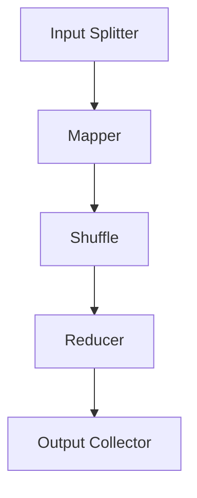

                 


## MapReduce原理与代码实例讲解

### 关键词：MapReduce, 大数据, 分布式计算, 编程实践, 代码实例

> 摘要：本文将深入探讨MapReduce原理，通过简洁易懂的语言和代码实例，详细介绍MapReduce的核心概念、算法原理和实际应用。文章旨在帮助读者掌握MapReduce的基本概念和实现方法，为大数据处理提供实用的指导。

### 1. 背景介绍

#### 1.1 目的和范围

本文旨在详细讲解MapReduce算法的原理和实现，通过实际代码实例帮助读者更好地理解MapReduce在大数据处理中的应用。文章涵盖了MapReduce的起源、核心概念、工作流程和代码实例，旨在为读者提供一个全面的学习资料。

#### 1.2 预期读者

本文适合对大数据处理和分布式计算有一定了解的程序员、数据科学家和人工智能从业者。无论您是初学者还是有一定经验的开发者，都可以通过本文的学习，加深对MapReduce的理解和掌握。

#### 1.3 文档结构概述

本文结构如下：

1. **背景介绍**：介绍MapReduce的背景和目的。
2. **核心概念与联系**：讲解MapReduce的核心概念，并通过Mermaid流程图展示其架构。
3. **核心算法原理**：详细介绍MapReduce的算法原理，使用伪代码说明操作步骤。
4. **数学模型和公式**：解释MapReduce中涉及的数学模型和公式。
5. **项目实战**：通过实际代码案例展示MapReduce的应用。
6. **实际应用场景**：讨论MapReduce在现实世界中的应用场景。
7. **工具和资源推荐**：推荐学习资源和开发工具。
8. **总结**：总结MapReduce的未来发展趋势和挑战。
9. **附录**：提供常见问题与解答。
10. **扩展阅读**：推荐相关参考资料。

#### 1.4 术语表

- **MapReduce**：一种分布式数据处理框架，用于大规模数据集的批量处理。
- **Mapper**：执行Map操作的组件，将输入数据转换为键值对。
- **Reducer**：执行Reduce操作的组件，对Mapper输出的键值对进行聚合处理。
- **Shuffle**：数据在Mapper和Reducer之间的传输和排序过程。
- **Combiner**：可选组件，在Mapper端对输出进行局部聚合，减少数据传输量。

#### 1.4.1 核心术语定义

- **Map**：将输入数据分解成键值对。
- **Reduce**：对相同的键对应的多个值进行聚合。

#### 1.4.2 相关概念解释

- **分布式计算**：将计算任务分布在多个计算节点上执行。
- **并行处理**：同时处理多个任务，提高计算效率。

#### 1.4.3 缩略词列表

- **HDFS**：Hadoop分布式文件系统（Hadoop Distributed File System）
- **Hadoop**：一个开源的分布式数据处理框架。

### 2. 核心概念与联系

#### 2.1 核心概念

MapReduce由两部分组成：Map和Reduce。Map操作将输入数据分解成键值对，而Reduce操作则对相同的键对应的多个值进行聚合。

#### 2.2 架构联系

MapReduce架构通常包括以下几个关键部分：

- **Input Splitter**：将输入数据分成多个小块，每个小块由一个Mapper处理。
- **Mapper**：对输入数据执行Map操作，生成中间键值对。
- **Shuffle**：将中间键值对按照键进行排序和分组。
- **Reducer**：对相同的键对应的多个值执行Reduce操作。
- **Output Collector**：收集最终的输出结果。

#### 2.3 Mermaid流程图

以下是一个简化的MapReduce流程图的Mermaid表示：



### 3. 核心算法原理 & 具体操作步骤

#### 3.1 Map操作原理

Map操作是MapReduce框架的核心部分之一。其主要任务是读取输入数据，将其分解成键值对，并输出中间结果。以下是一个简单的Map操作的伪代码：

```pseudo
function map(input_key, input_value):
    for each (sub_value in input_value):
        key = get_key(sub_value)
        value = get_value(sub_value)
        emit(key, value)
```

#### 3.2 Reduce操作原理

Reduce操作接收Mapper输出的中间键值对，对相同键的值进行聚合处理，并生成最终的输出结果。以下是一个简单的Reduce操作的伪代码：

```pseudo
function reduce(output_key, values):
    for each (value in values):
        accumulate(value)
    emit(output_key, accumulated_value)
```

#### 3.3 操作步骤

1. **初始化**：启动MapReduce作业，输入数据被切分成多个小块，每个小块由一个Mapper处理。
2. **Map阶段**：每个Mapper执行Map操作，将输入数据分解成键值对，并将中间结果输出到本地文件。
3. **Shuffle阶段**：Map任务的输出通过Shuffle过程按照键进行排序和分组，传输到Reducer。
4. **Reduce阶段**：Reducer接收中间结果，对相同键的值进行聚合处理，并输出最终结果。
5. **输出**：最终的输出结果被收集并存储到指定的输出路径。

### 4. 数学模型和公式 & 详细讲解 & 举例说明

MapReduce算法涉及一些基本的数学模型和公式，以下将对这些概念进行详细解释，并通过具体例子说明。

#### 4.1 键值对的生成

Map操作生成键值对，其中键是唯一的，而值可以是任意类型。以下是一个生成键值对的简单例子：

- **输入**：{"fruit": ["apple", "banana", "apple"], "color": ["red", "yellow", "green"]}
- **Map输出**：{"fruit": [["apple", 2], ["banana", 1]], "color": [["red", 1], ["yellow", 1], ["green", 1]]}

在这个例子中，"fruit"和"color"是键，而相应的值是列表。

#### 4.2 聚合操作

Reduce操作对相同键的值进行聚合。以下是一个简单的聚合例子：

- **中间键值对**：{"apple": ["red", "green"], "banana": ["yellow"]}
- **Reduce输出**：{"apple": ["red", "green"], "banana": ["yellow"]}

在这个例子中，"apple"和"banana"是键，而对应的值是列表，没有发生变化。

#### 4.3 数学公式

MapReduce中的一些基本数学公式如下：

- **Map操作**：\( map(x) = \{ (key_i, value_i) \} \)，其中\( x \)是输入数据，\( key_i \)是键，\( value_i \)是值。
- **Reduce操作**：\( reduce(key_i, \{ value_1, value_2, ..., value_n \}) = \{ result_i \} \)，其中\( key_i \)是键，\( value_1, value_2, ..., value_n \)是相同的键对应的多个值，\( result_i \)是聚合后的结果。

### 5. 项目实战：代码实际案例和详细解释说明

#### 5.1 开发环境搭建

在进行MapReduce项目实战之前，需要先搭建好开发环境。以下是常用的开发环境搭建步骤：

1. **安装Hadoop**：下载并安装Hadoop，配置HDFS和YARN。
2. **安装Java开发环境**：安装Java SDK和开发工具，如Eclipse或IntelliJ IDEA。
3. **配置环境变量**：配置Hadoop和Java的环境变量，以便在命令行中运行Hadoop命令。

#### 5.2 源代码详细实现和代码解读

以下是一个简单的MapReduce程序，用于统计单词频率。代码将分为Mapper和Reducer两部分。

**Mapper.java**

```java
import org.apache.hadoop.conf.Configuration;
import org.apache.hadoop.io.LongWritable;
import org.apache.hadoop.io.Text;
import org.apache.hadoop.mapreduce.Mapper;

import java.io.IOException;

public class WordCountMapper extends Mapper<LongWritable, Text, Text, LongWritable> {

    private final static LongWritable one = new LongWritable(1);
    private Text word = new Text();

    public void map(LongWritable key, Text value, Context context) throws IOException, InterruptedException {
        String line = value.toString();
        for (String token : line.split(" ")) {
            word.set(token);
            context.write(word, one);
        }
    }
}
```

**Reducer.java**

```java
import org.apache.hadoop.conf.Configuration;
import org.apache.hadoop.io.LongWritable;
import org.apache.hadoop.io.Text;
import org.apache.hadoop.mapreduce.Reducer;

import java.io.IOException;

public class WordCountReducer extends Reducer<Text, LongWritable, Text, LongWritable> {

    private LongWritable result = new LongWritable();

    public void reduce(Text key, Iterable<LongWritable> values, Context context) throws IOException, InterruptedException {
        long sum = 0;
        for (LongWritable val : values) {
            sum += val.get();
        }
        result.set(sum);
        context.write(key, result);
    }
}
```

**WordCountDriver.java**

```java
import org.apache.hadoop.conf.Configuration;
import org.apache.hadoop.fs.Path;
import org.apache.hadoop.io.Text;
import org.apache.hadoop.mapreduce.Job;
import org.apache.hadoop.mapreduce.lib.input.FileInputFormat;
import org.apache.hadoop.mapreduce.lib.output.FileOutputFormat;

public class WordCountDriver {

    public static void main(String[] args) throws Exception {
        Configuration conf = new Configuration();
        Job job = Job.getInstance(conf, "word count");
        job.setJarByClass(WordCountDriver.class);
        job.setMapperClass(WordCountMapper.class);
        job.setCombinerClass(WordCountReducer.class);
        job.setReducerClass(WordCountReducer.class);
        job.setOutputKeyClass(Text.class);
        job.setOutputValueClass(LongWritable.class);
        FileInputFormat.addInputPath(job, new Path(args[0]));
        FileOutputFormat.setOutputPath(job, new Path(args[1]));
        System.exit(job.waitForCompletion(true) ? 0 : 1);
    }
}
```

#### 5.3 代码解读与分析

**Mapper代码解读**

Mapper类继承自`Mapper`接口，负责将输入的文本行分割成单词，并将每个单词及其计数作为键值对输出。这里使用了Hadoop的自定义数据类型`LongWritable`和`Text`，其中`LongWritable`表示长整型，`Text`表示文本。

**Reducer代码解读**

Reducer类继承自`Reducer`接口，负责接收Mapper输出的中间键值对，对相同单词的计数进行求和，并输出最终结果。

**Driver代码解读**

Driver类用于定义MapReduce作业的配置和输入输出路径。它设置了作业的类名、Mapper和Reducer类，以及输出的数据类型。最后，通过调用`Job`的`waitForCompletion`方法提交作业并等待其完成。

### 6. 实际应用场景

MapReduce算法在许多实际应用场景中具有广泛的应用，以下是一些典型的应用场景：

- **搜索引擎**：用于处理大量网页的数据，提取关键词并进行索引。
- **社交媒体分析**：分析用户生成内容，提取热门话题和趋势。
- **日志分析**：分析服务器日志，监控网站性能和用户行为。
- **机器学习**：在训练大规模机器学习模型时，用于数据预处理和特征提取。

### 7. 工具和资源推荐

#### 7.1 学习资源推荐

- **书籍推荐**：
  - 《Hadoop权威指南》
  - 《深入理解Hadoop》
  - 《MapReduce实战：大数据处理技术原理与应用》
  
- **在线课程**：
  - Coursera上的《Hadoop和MapReduce》
  - Udacity的《大数据分析》

- **技术博客和网站**：
  - Apache Hadoop官网（hadoop.apache.org）
  - Cloudera官方博客（blog.cloudera.com）

#### 7.2 开发工具框架推荐

- **IDE和编辑器**：
  - IntelliJ IDEA
  - Eclipse

- **调试和性能分析工具**：
  - Hadoop Counters
  - Ganglia

- **相关框架和库**：
  - Apache Storm
  - Apache Spark

#### 7.3 相关论文著作推荐

- **经典论文**：
  - “The Google File System” by Google
  - “MapReduce: Simplified Data Processing on Large Clusters” by Google

- **最新研究成果**：
  - “A View of Cloud Computing” by Amazon Web Services
  - “Scalable Computing at Internet Scale: The Google Cluster Architecture” by Google

- **应用案例分析**：
  - “Hadoop at Netflix” by Netflix
  - “Google’s MapReduce: A Programming Model for Large Scale Data Processing” by Google

### 8. 总结：未来发展趋势与挑战

MapReduce在大数据处理领域已经取得了显著的成就，然而随着数据规模的不断扩大和计算需求的增长，MapReduce也面临一些挑战：

- **性能优化**：提高MapReduce作业的运行效率和性能。
- **可扩展性**：支持更大数据集和更复杂的计算任务。
- **安全性**：确保数据的安全性和隐私性。

未来，MapReduce有望与新兴的大数据技术（如Apache Spark）结合，共同推动大数据处理技术的发展。

### 9. 附录：常见问题与解答

- **Q1**：MapReduce如何处理大量数据？
  - **A1**：MapReduce通过分布式计算框架，将数据划分到多个节点上，每个节点独立处理一部分数据，从而实现大规模数据处理。

- **Q2**：MapReduce与Spark有何区别？
  - **A2**：MapReduce是一个批处理框架，适合处理大量数据的批量操作。而Spark是一个实时计算框架，适合处理实时数据流和迭代计算任务。

- **Q3**：如何优化MapReduce作业的运行效率？
  - **A3**：可以通过调整作业配置参数、优化数据分区策略、减少数据传输等方式来提高MapReduce作业的运行效率。

### 10. 扩展阅读 & 参考资料

- [Hadoop官方文档](https://hadoop.apache.org/docs/current/hadoop-project-dist/hadoop-common/SingleCluster.html)
- [MapReduce论文](https://static.googleusercontent.com/media/research.google.com/zh-CN//pubs/archive/3636.pdf)
- [Apache Spark官方文档](https://spark.apache.org/docs/latest/)
- [大数据技术书籍推荐](https://www.goodreads.com/shelf/show/大数据)

