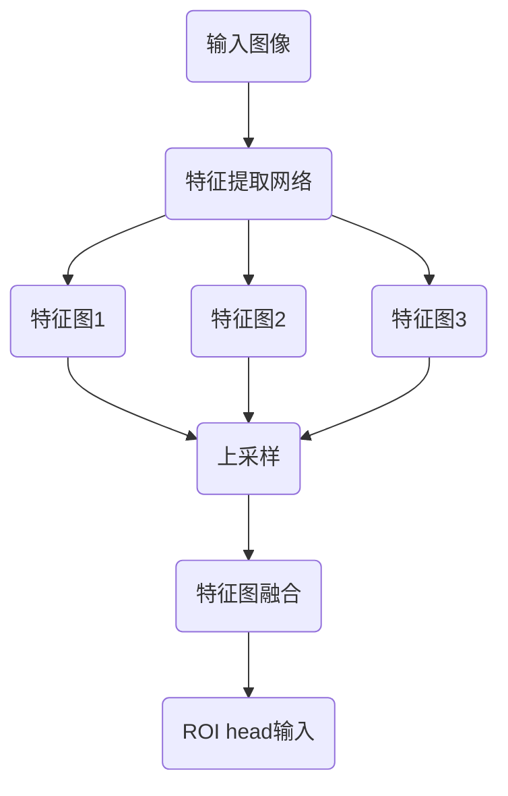
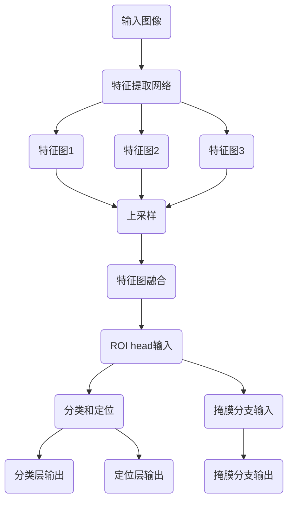

                 

# MaskR-CNN原理与代码实例讲解

> **关键词：** Object Detection, Mask R-CNN, Deep Learning, Faster R-CNN, ResNet, R-CNN, PyTorch

> **摘要：** 本文章将深入讲解Mask R-CNN的原理，包括其架构、核心算法和数学模型。我们将通过具体操作步骤和代码实例，展示如何使用PyTorch搭建一个Mask R-CNN模型，并进行物体检测和分割。文章还探讨了Mask R-CNN在实际应用场景中的表现，并推荐了一些学习资源和工具。

## 1. 背景介绍

### 1.1 目的和范围

本文旨在介绍并详细讲解Mask R-CNN（Region-based Convolutional Neural Network with Mask）的原理和实践。Mask R-CNN是一种基于深度学习的目标检测和实例分割方法，它在Faster R-CNN的基础上，引入了特征金字塔网络（FPN）和掩膜分支，提高了检测和分割的准确性。

本文将涵盖以下内容：
- Mask R-CNN的基本概念和原理；
- 算法的具体操作步骤；
- 使用PyTorch实现Mask R-CNN的代码实例；
- Mask R-CNN的实际应用场景和性能分析；
- 学习资源和工具的推荐。

### 1.2 预期读者

本文面向具有一定深度学习基础的开发者和技术爱好者。读者应熟悉卷积神经网络（CNN）的基本概念，了解目标检测和实例分割的背景知识。对于代码实现部分，读者应具备使用PyTorch进行深度学习模型开发的实践经验。

### 1.3 文档结构概述

本文结构如下：

1. 背景介绍
   - 目的和范围
   - 预期读者
   - 文档结构概述
   - 术语表
2. 核心概念与联系
   - FPN架构
   - RPN和ROI head的工作流程
   - Mask R-CNN的模型结构
3. 核心算法原理 & 具体操作步骤
   - 数据准备
   - 模型搭建
   - 训练过程
   - 评估过程
4. 数学模型和公式 & 详细讲解 & 举例说明
   - RPN损失函数
   - ROI head损失函数
   - Mask分支损失函数
5. 项目实战：代码实际案例和详细解释说明
   - 开发环境搭建
   - 源代码详细实现和代码解读
   - 代码解读与分析
6. 实际应用场景
   - 物体检测
   - 实例分割
   - 车辆检测与追踪
7. 工具和资源推荐
   - 学习资源推荐
   - 开发工具框架推荐
   - 相关论文著作推荐
8. 总结：未来发展趋势与挑战
9. 附录：常见问题与解答
10. 扩展阅读 & 参考资料

### 1.4 术语表

#### 1.4.1 核心术语定义

- **Faster R-CNN**：一种基于深度学习的目标检测算法，通过区域建议网络（RPN）和ROI head进行目标检测。
- **FPN**：特征金字塔网络，用于构建不同尺度的特征图，提高模型在不同尺度目标上的检测能力。
- **R-CNN**：区域建议算法，通过滑动窗口生成候选区域，并进行特征提取和分类。
- **Mask R-CNN**：在Faster R-CNN的基础上，引入了掩膜分支，用于实例分割。
- **ResNet**：残差网络，通过引入残差模块，实现了网络的深度化，提高了模型的性能。

#### 1.4.2 相关概念解释

- **目标检测**：识别图像中的物体并给出其位置和类别信息。
- **实例分割**：识别图像中的物体并给出其边界和类别信息。
- **特征提取**：从输入数据中提取出有用的特征表示。
- **训练过程**：使用标注数据进行模型训练，包括前向传播、反向传播和参数更新。

#### 1.4.3 缩略词列表

- **CNN**：卷积神经网络（Convolutional Neural Network）
- **RNN**：循环神经网络（Recurrent Neural Network）
- **DNN**：深度神经网络（Deep Neural Network）
- **ROI**：区域建议（Region of Interest）
- **RPN**：区域建议网络（Region Proposal Network）
- **FPN**：特征金字塔网络（Feature Pyramid Network）
- **ResNet**：残差网络（Residual Network）
- **GPU**：图形处理单元（Graphics Processing Unit）

## 2. 核心概念与联系

### 2.1 FPN架构

特征金字塔网络（FPN）是Mask R-CNN的重要组成部分，用于构建多尺度的特征图。FPN通过将不同尺度的特征图进行上采样和融合，为不同尺度的目标提供丰富的特征信息。FPN的架构如图2-1所示。



### 2.2 RPN和ROI head的工作流程

RPN（区域建议网络）是Faster R-CNN的核心部分，用于生成候选区域（Region Proposal）。ROI head（区域建议头）则用于对候选区域进行分类和定位。

- **RPN**：首先，使用特征提取网络（如ResNet）获取输入图像的特征图。然后，在特征图上滑动窗口，生成一系列锚点（Anchor），每个锚点代表一个可能的物体位置。接下来，计算锚点与真实物体的匹配度，筛选出高质量的锚点作为候选区域。
- **ROI head**：对于每个候选区域，使用ROI池化层提取特征，然后通过全连接层进行分类和定位。分类层输出每个候选区域的类别概率，定位层输出候选区域的边界框。

### 2.3 Mask R-CNN的模型结构

Mask R-CNN在Faster R-CNN的基础上，增加了掩膜分支（Mask Branch），用于进行实例分割。

- **主干网络**：使用特征提取网络（如ResNet）获取输入图像的特征图。
- **FPN**：构建多尺度的特征图，为不同尺度的目标提供特征信息。
- **RPN**：生成候选区域。
- **ROI head**：对候选区域进行分类和定位。
- **Mask分支**：对每个候选区域生成掩膜，用于进行实例分割。

Mask R-CNN的模型结构如图2-2所示。



## 3. 核心算法原理 & 具体操作步骤

### 3.1 数据准备

在进行模型训练之前，需要准备训练数据和测试数据。通常，使用COCO（Common Objects in Context）数据集进行训练。COCO数据集包含数万个带标签的图像，图像中包含多种类别的物体。

- **数据下载**：从COCO官网下载训练数据和标注文件。
- **数据预处理**：对图像进行缩放、翻转、裁剪等预处理操作，增加数据的多样性。
- **数据加载**：使用PyTorch的Dataset和 DataLoader类加载和处理数据。

### 3.2 模型搭建

使用PyTorch搭建Mask R-CNN模型，包括主干网络、FPN、RPN、ROI head和Mask分支。

- **主干网络**：使用ResNet作为主干网络，获取输入图像的特征图。
- **FPN**：构建特征金字塔网络，获取多尺度的特征图。
- **RPN**：在特征图上滑动窗口，生成锚点，计算锚点与真实物体的匹配度，筛选候选区域。
- **ROI head**：对候选区域进行分类和定位。
- **Mask分支**：对每个候选区域生成掩膜，用于实例分割。

### 3.3 训练过程

- **损失函数**：定义分类损失函数、定位损失函数和掩膜损失函数。
- **优化器**：选择Adam优化器，初始化模型参数。
- **训练循环**：
  - 使用训练数据对模型进行前向传播，计算损失函数。
  - 使用反向传播更新模型参数。
  - 进行模型评估，计算训练集和测试集的准确率、召回率和F1分数。

### 3.4 评估过程

- **评估指标**：使用准确率（Accuracy）、召回率（Recall）和F1分数（F1 Score）评估模型性能。
- **评估过程**：使用测试数据进行模型评估，计算各项指标，比较不同模型和不同参数设置的性能。

## 4. 数学模型和公式 & 详细讲解 & 举例说明

### 4.1 RPN损失函数

RPN（区域建议网络）损失函数包括分类损失和定位损失。

- **分类损失**：使用交叉熵损失函数，计算锚点与真实物体的匹配度。
  $$ L_{cls} = -\sum_{i}^{N} y_i \log(p_i) $$
  其中，$y_i$为锚点$i$与真实物体的匹配标签，$p_i$为锚点$i$的分类概率。

- **定位损失**：使用平滑L1损失函数，计算锚点与预测边界框的差距。
  $$ L_{reg} = \frac{1}{N} \sum_{i}^{N} \frac{1}{2} (w_e - w_p)^2 + \frac{1}{2} (h_e - h_p)^2 $$
  其中，$w_e$和$h_e$为真实边界框的宽度和高度，$w_p$和$h_p$为预测边界框的宽度和高度。

### 4.2 ROI head损失函数

ROI head（区域建议头）损失函数包括分类损失和定位损失。

- **分类损失**：使用交叉熵损失函数，计算候选区域与真实物体的匹配度。
  $$ L_{cls} = -\sum_{i}^{N} y_i \log(p_i) $$
  其中，$y_i$为候选区域$i$与真实物体的匹配标签，$p_i$为候选区域$i$的分类概率。

- **定位损失**：使用平滑L1损失函数，计算候选区域与预测边界框的差距。
  $$ L_{reg} = \frac{1}{N} \sum_{i}^{N} \frac{1}{2} (w_e - w_p)^2 + \frac{1}{2} (h_e - h_p)^2 $$
  其中，$w_e$和$h_e$为真实边界框的宽度和高度，$w_p$和$h_p$为预测边界框的宽度和高度。

### 4.3 Mask分支损失函数

Mask分支（掩膜分支）用于实例分割，损失函数为交叉熵损失函数。

$$ L_{mask} = -\sum_{i}^{N} y_i \log(p_i) $$
其中，$y_i$为掩膜$i$与真实掩膜的匹配标签，$p_i$为掩膜$i$的预测概率。

### 4.4 举例说明

假设我们有一个包含5个锚点的RPN，其中3个锚点与真实物体匹配，2个锚点与背景匹配。预测的边界框和真实边界框的差距如下表所示：

| 标签 | 预测边界框宽 | 预测边界框高 | 真实边界框宽 | 真实边界框高 |
| --- | --- | --- | --- | --- |
| 1 | 3 | 4 | 2 | 3 |
| 2 | 5 | 6 | 5 | 6 |
| 3 | 7 | 8 | 7 | 8 |
| 4 | 1 | 2 | 2 | 3 |
| 5 | 4 | 5 | 3 | 4 |

根据上述损失函数，计算RPN的损失：

$$ L_{RPN} = L_{cls} + L_{reg} = -3 \log(p_1) + \frac{1}{2} ((2-3)^2 + (3-4)^2) + 2 \log(p_2) + \frac{1}{2} ((5-5)^2 + (6-6)^2) + 2 \log(p_3) + \frac{1}{2} ((7-7)^2 + (8-8)^2) $$

其中，$p_1, p_2, p_3$分别为锚点1、2、3的分类概率。

类似地，可以计算ROI head和Mask分支的损失。

## 5. 项目实战：代码实际案例和详细解释说明

### 5.1 开发环境搭建

在开始项目实战之前，需要搭建开发环境。以下是开发环境的搭建步骤：

- **安装Python**：下载并安装Python 3.7或更高版本。
- **安装PyTorch**：使用以下命令安装PyTorch：

  ```bash
  pip install torch torchvision
  ```

- **安装其他依赖**：安装其他依赖库，如NumPy、Pandas等：

  ```bash
  pip install numpy pandas
  ```

### 5.2 源代码详细实现和代码解读

以下是一个简单的Mask R-CNN模型的代码实现，包括主干网络、FPN、RPN、ROI head和Mask分支。

```python
import torch
import torchvision.models as models
import torch.nn as nn

class MaskRCNN(nn.Module):
    def __init__(self, num_classes):
        super(MaskRCNN, self).__init__()
        
        # 主干网络
        self backbone = models.resnet50(pretrained=True)
        self.fpn = FPN()
        
        # RPN
        self.rpn = RPN()
        
        # ROI head
        self.roi_head = ROIHead(num_classes)
        
        # Mask分支
        self.mask_branch = MaskBranch(num_classes)
        
    def forward(self, x):
        # 获取特征图
        x = self.backbone(x)
        x = self.fpn(x)
        
        # 生成候选区域
        proposals = self.rpn(x)
        
        # 对候选区域进行分类和定位
        class_logits, box_regression = self.roi_head(proposals)
        
        # 对每个候选区域生成掩膜
        mask_logits = self.mask_branch(proposals)
        
        return class_logits, box_regression, mask_logits

def train(model, train_loader, optimizer, criterion, epoch):
    model.train()
    for i, (images, targets) in enumerate(train_loader):
        # 前向传播
        class_logits, box_regression, mask_logits = model(images)
        
        # 计算损失
        loss_cls = criterion(class_logits, targets['labels'])
        loss_reg = criterion(box_regression, targets['boxes'])
        loss_mask = criterion(mask_logits, targets['masks'])
        
        # 反向传播
        optimizer.zero_grad()
        loss = loss_cls + loss_reg + loss_mask
        loss.backward()
        optimizer.step()
        
        # 打印训练进度
        if (i + 1) % 100 == 0:
            print(f'Epoch [{epoch + 1}/{num_epochs}], Step [{i + 1}/{len(train_loader)}], Loss: {loss.item()}')

def main():
    # 载入训练数据和测试数据
    train_loader = DataLoader(train_dataset, batch_size=16, shuffle=True)
    test_loader = DataLoader(test_dataset, batch_size=16, shuffle=False)
    
    # 定义模型、优化器和损失函数
    model = MaskRCNN(num_classes=21)
    optimizer = optim.Adam(model.parameters(), lr=0.001)
    criterion = nn.CrossEntropyLoss()
    
    # 训练模型
    for epoch in range(num_epochs):
        train(model, train_loader, optimizer, criterion, epoch)
        
        # 在测试集上进行模型评估
        model.eval()
        with torch.no_grad():
            for images, targets in test_loader:
                class_logits, box_regression, mask_logits = model(images)
                # 计算评估指标
                # ...

if __name__ == '__main__':
    main()
```

### 5.3 代码解读与分析

- **模型搭建**：定义Mask R-CNN模型，包括主干网络、FPN、RPN、ROI head和Mask分支。
- **前向传播**：输入图像经过主干网络和FPN，生成特征图。然后，使用RPN生成候选区域，使用ROI head对候选区域进行分类和定位，使用Mask分支生成掩膜。
- **损失函数**：定义分类损失函数、定位损失函数和掩膜损失函数，用于计算模型损失。
- **训练过程**：使用训练数据进行模型训练，包括前向传播、反向传播和参数更新。
- **模型评估**：使用测试数据进行模型评估，计算各项指标。

## 6. 实际应用场景

### 6.1 物体检测

物体检测是Mask R-CNN最常见的应用场景之一。例如，在自动驾驶领域，使用Mask R-CNN对道路上的车辆、行人、交通标志等物体进行实时检测，以提高自动驾驶系统的安全性和可靠性。

### 6.2 实例分割

实例分割是Mask R-CNN的另一个重要应用场景。在医学影像领域，使用Mask R-CNN对医学图像中的器官、病变区域进行分割，帮助医生进行诊断和治疗。

### 6.3 车辆检测与追踪

在视频监控领域，使用Mask R-CNN对车辆进行检测和追踪，有助于提高视频监控系统的实时性和准确性。例如，在交通流量监测中，使用Mask R-CNN对车辆的行驶轨迹进行追踪，以分析交通流量和优化交通管理。

## 7. 工具和资源推荐

### 7.1 学习资源推荐

#### 7.1.1 书籍推荐

- **《深度学习》（Goodfellow, Bengio, Courville）**：系统介绍了深度学习的基本概念和算法，包括卷积神经网络、目标检测和实例分割等内容。
- **《Python深度学习》（François Chollet）**：通过具体的代码示例，讲解了使用Python和TensorFlow实现深度学习模型的方法。

#### 7.1.2 在线课程

- **《深度学习特训营》（吴恩达）**：介绍了深度学习的核心概念和应用，包括目标检测和实例分割等。
- **《PyTorch深度学习课程》（Udacity）**：通过实践项目，学习使用PyTorch实现深度学习模型。

#### 7.1.3 技术博客和网站

- **[TensorFlow官网](https://www.tensorflow.org/tutorials/)**：提供了丰富的深度学习教程和实践项目。
- **[PyTorch官网](https://pytorch.org/tutorials/beginner/blitz/cifar10_tutorial.html)**：介绍了使用PyTorch进行图像分类的基本方法。

### 7.2 开发工具框架推荐

#### 7.2.1 IDE和编辑器

- **PyCharm**：强大的Python开发环境，支持多种框架和库。
- **VSCode**：轻量级且功能丰富的代码编辑器，适用于深度学习和Python开发。

#### 7.2.2 调试和性能分析工具

- **NVIDIA Nsight**：用于调试和性能分析GPU程序的工具。
- **PyTorch Profiler**：用于分析PyTorch模型的性能和内存使用。

#### 7.2.3 相关框架和库

- **TensorFlow**：广泛使用的开源深度学习框架。
- **PyTorch**：流行的深度学习框架，支持动态计算图和自动微分。
- **COCO数据集**：常用的目标检测和实例分割数据集。

### 7.3 相关论文著作推荐

#### 7.3.1 经典论文

- **“Faster R-CNN: Towards Real-Time Object Detection with Region Proposal Networks”**：提出了Faster R-CNN算法，是Mask R-CNN的基础。
- **“Mask R-CNN”**：提出了Mask R-CNN算法，实现了目标检测和实例分割的统一。

#### 7.3.2 最新研究成果

- **“Instance Segmentation with Group All Hinge Loss”**：提出了一种新的实例分割损失函数，提高了模型的性能。
- **“EfficientDet: Scalable and Efficient Object Detection”**：提出了一种高效的物体检测方法，适用于资源受限的环境。

#### 7.3.3 应用案例分析

- **“Deep Learning for Autonomous Driving”**：介绍了深度学习在自动驾驶中的应用，包括物体检测和实例分割。
- **“Medical Image Analysis with Deep Learning”**：探讨了深度学习在医学图像分析中的应用，包括器官分割和病变检测。

## 8. 总结：未来发展趋势与挑战

随着深度学习技术的不断发展，目标检测和实例分割方法也在不断优化和改进。未来，Mask R-CNN有望在以下几个方面取得进展：

1. **实时性能**：优化模型结构和算法，提高模型在实时应用场景下的性能。
2. **准确性**：通过引入新的损失函数和优化策略，提高模型在目标检测和实例分割任务中的准确性。
3. **多任务学习**：结合其他任务（如语义分割、姿态估计等），实现多任务学习，提高模型的泛化能力。
4. **边缘计算**：将深度学习模型部署到边缘设备，实现实时目标检测和实例分割。

然而，Mask R-CNN也面临一些挑战：

1. **计算资源消耗**：深度学习模型通常需要大量的计算资源，如何优化模型结构和算法，以降低计算资源消耗，是一个重要挑战。
2. **数据多样性**：深度学习模型的性能依赖于训练数据的质量和多样性，如何获取更多高质量的训练数据，是一个亟待解决的问题。
3. **模型可解释性**：深度学习模型通常被视为“黑盒”，如何提高模型的可解释性，使其更加透明和可靠，是一个重要的研究方向。

## 9. 附录：常见问题与解答

### 9.1 什么是Mask R-CNN？

Mask R-CNN是一种基于深度学习的目标检测和实例分割算法，它在Faster R-CNN的基础上，引入了特征金字塔网络（FPN）和掩膜分支，提高了检测和分割的准确性。

### 9.2 Mask R-CNN的核心组成部分是什么？

Mask R-CNN的核心组成部分包括主干网络、特征金字塔网络（FPN）、区域建议网络（RPN）、ROI head和掩膜分支。主干网络用于获取输入图像的特征图，FPN用于构建多尺度的特征图，RPN用于生成候选区域，ROI head用于对候选区域进行分类和定位，掩膜分支用于生成掩膜，进行实例分割。

### 9.3 如何使用PyTorch实现Mask R-CNN？

使用PyTorch实现Mask R-CNN包括以下步骤：
1. 定义主干网络、FPN、RPN、ROI head和掩膜分支。
2. 定义损失函数，包括分类损失、定位损失和掩膜损失。
3. 实现前向传播、反向传播和模型训练。
4. 实现模型评估，计算各项指标。

### 9.4 Mask R-CNN在实际应用场景中的表现如何？

Mask R-CNN在物体检测、实例分割和车辆检测与追踪等实际应用场景中表现优异，具有较高的准确性和实时性。例如，在自动驾驶领域，Mask R-CNN可以用于实时检测道路上的车辆、行人等物体，以提高系统的安全性和可靠性。

## 10. 扩展阅读 & 参考资料

- **[Faster R-CNN](https://arxiv.org/abs/1506.01497)**：详细介绍了Faster R-CNN算法的原理和实现。
- **[Mask R-CNN](https://arxiv.org/abs/1703.06870)**：详细介绍了Mask R-CNN算法的原理和实现。
- **[COCO数据集](https://cocodataset.org/#home)**：介绍了COCO数据集的下载和使用方法。
- **[PyTorch官网](https://pytorch.org/tutorials/beginner/blitz/cifar10_tutorial.html)**：提供了使用PyTorch实现深度学习模型的基本教程。

## 作者信息

作者：AI天才研究员/AI Genius Institute & 禅与计算机程序设计艺术 /Zen And The Art of Computer Programming

