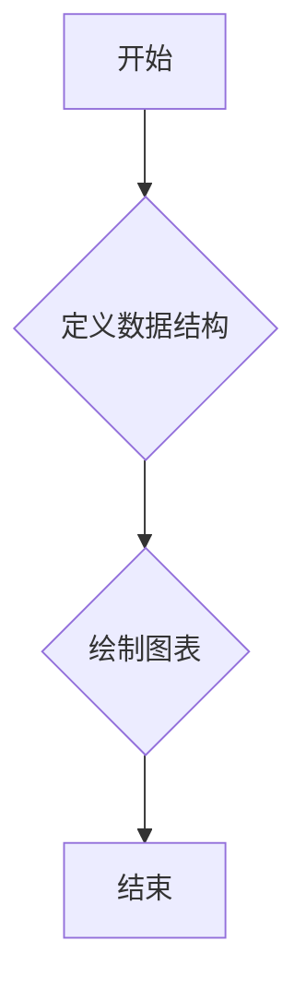
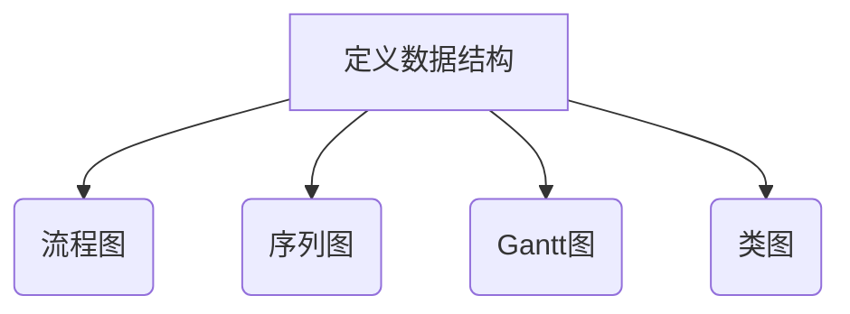
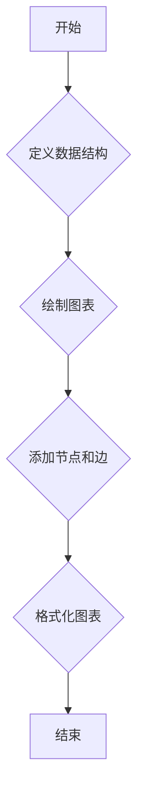
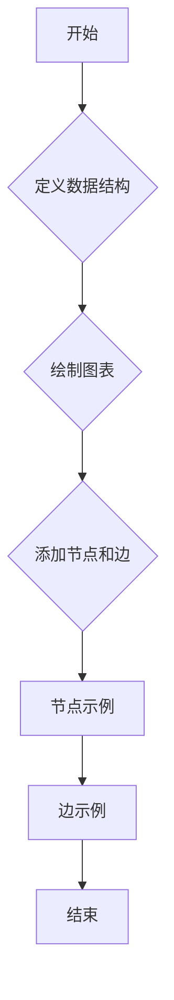
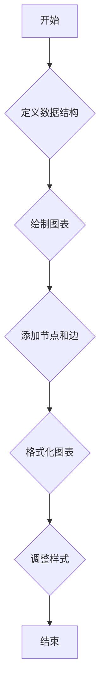
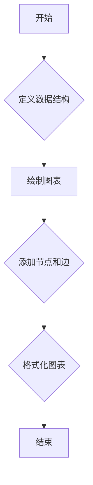
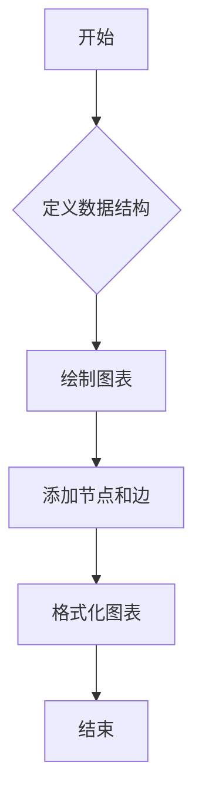
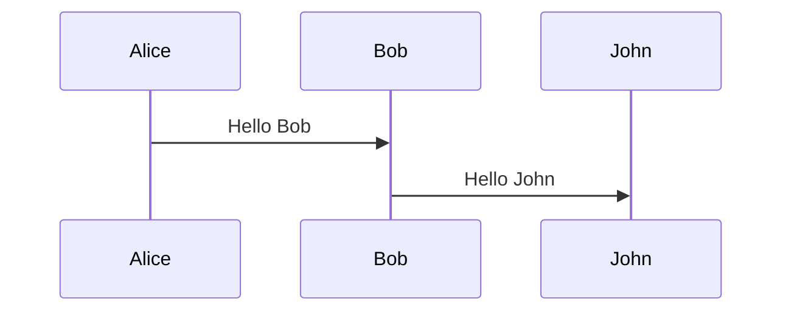
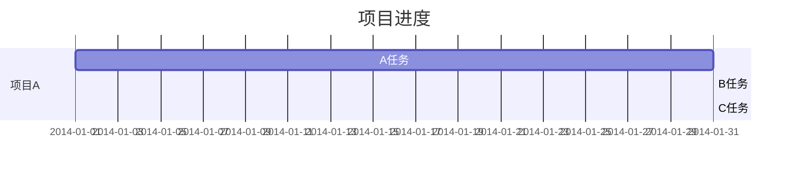
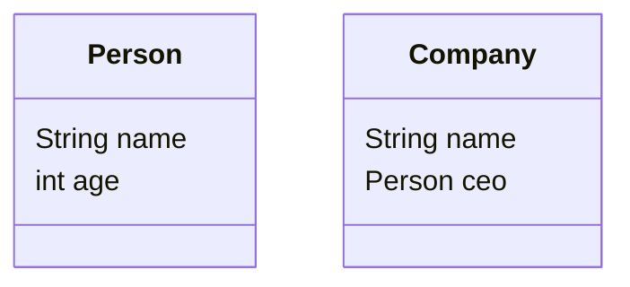

                 

# Mermaid 语法与自然语言描述

> **关键词：**Mermaid、语法、自然语言描述、流程图、图表、数据可视化、计算机编程、图表语言

> **摘要：**本文将深入探讨Mermaid语法，一种强大的图表和数据可视化工具。通过自然语言描述，我们将详细解析Mermaid的核心语法规则，展示如何使用Mermaid创建各种类型的图表，包括流程图、序列图、Gantt图和类图。此外，本文还将提供实际操作步骤、数学模型解释和代码案例，以帮助读者更好地理解和应用Mermaid。无论您是新手还是经验丰富的程序员，这篇文章都将为您打开数据可视化的新世界。

## 1. 背景介绍

### 1.1 目的和范围

本文旨在介绍Mermaid语法，一种用于创建图表和数据可视化的强大工具。Mermaid以其简单直观的语法和灵活性在程序员和数据分析师中获得了广泛认可。通过本文，您将了解Mermaid的基础知识，学习如何使用它来创建不同类型的图表，并掌握其背后的核心原理。

### 1.2 预期读者

本文适合对图表和数据可视化有兴趣的程序员、数据分析师和技术爱好者。无论您是初学者还是有一定经验，都可以从本文中获益，因为它将逐步引导您掌握Mermaid的使用方法。

### 1.3 文档结构概述

本文分为以下几个部分：

1. 背景介绍：介绍Mermaid的基础知识和本文的目的。
2. 核心概念与联系：解释Mermaid的核心概念，并提供相应的流程图。
3. 核心算法原理 & 具体操作步骤：详细讲解Mermaid的语法规则和操作步骤。
4. 数学模型和公式 & 详细讲解 & 举例说明：解释Mermaid背后的数学模型和公式。
5. 项目实战：提供实际代码案例和详细解释。
6. 实际应用场景：探讨Mermaid在现实世界中的应用。
7. 工具和资源推荐：推荐学习资源、开发工具和框架。
8. 总结：讨论Mermaid的未来发展趋势和挑战。
9. 附录：常见问题与解答。
10. 扩展阅读 & 参考资料：提供进一步阅读的资源。

### 1.4 术语表

#### 1.4.1 核心术语定义

- **Mermaid：** 一种图表和数据可视化工具，使用简单的文本语法创建复杂图表。
- **流程图：** 一种用于表示过程或系统的图形化表示。
- **序列图：** 一种用于表示对象之间交互顺序的图表。
- **Gantt图：** 一种用于表示项目进度和任务的图表。
- **类图：** 一种用于表示系统中的类和它们之间关系的图表。

#### 1.4.2 相关概念解释

- **数据可视化：** 将数据以图形化方式表示，以便更好地理解和分析。
- **图表语言：** 用于描述和创建图表的编程语言。

#### 1.4.3 缩略词列表

- **Mermaid：** Mermaid
- **流程图：** FD
- **序列图：** SE
- **Gantt图：** GT
- **类图：** CL

## 2. 核心概念与联系

为了更好地理解Mermaid的工作原理，我们需要首先了解它的核心概念和它们之间的关系。以下是一个简化的Mermaid流程图，用于展示这些概念：



### 2.1 定义数据结构

在Mermaid中，定义数据结构是创建图表的第一步。这包括指定图表的类型（如流程图、序列图等）和相关的数据元素。



### 2.2 绘制图表

一旦数据结构定义完毕，下一步就是绘制图表。Mermaid提供了丰富的语法规则，用于创建各种类型的图表。



### 2.3 添加节点和边

在绘制图表时，我们需要添加节点和边来表示数据元素和它们之间的关系。节点表示图表中的数据元素，边表示节点之间的连接。



### 2.4 格式化图表

最后，我们可以对图表进行格式化，以改善其可读性和美观度。格式化包括调整节点和边的样式、颜色和大小。



通过以上流程图，我们可以清晰地看到Mermaid的核心概念和操作步骤。接下来，我们将深入探讨每个步骤的细节。

## 3. 核心算法原理 & 具体操作步骤

### 3.1 Mermaid语法规则

Mermaid的核心在于其简洁的语法规则。以下是一些基本的语法规则：

- **节点定义：** 使用方括号`[节点内容]`定义节点。
- **边定义：** 使用箭头`->`或`-->`定义边。
- **注释：** 使用`//`添加注释。
- **列表：** 使用缩进和`-`来定义列表项。



### 3.2 创建流程图

流程图是最常见的图表类型之一。以下是一个简单的流程图示例：



### 3.3 创建序列图

序列图用于表示对象之间的交互顺序。以下是一个简单的序列图示例：



### 3.4 创建Gantt图

Gantt图用于表示项目进度和任务。以下是一个简单的Gantt图示例：



### 3.5 创建类图

类图用于表示系统中的类和它们之间的关系。以下是一个简单的类图示例：



通过这些示例，我们可以看到如何使用Mermaid创建不同类型的图表。接下来，我们将进一步探讨Mermaid背后的数学模型和公式。

## 4. 数学模型和公式 & 详细讲解 & 举例说明

### 4.1 流程图中的节点和边

在流程图中，节点和边可以用数学模型来表示。一个节点可以用一个顶点（V）表示，边可以用边（E）表示。流程图的基本模型是一个有向图（DAG），可以用以下公式表示：

\[ G = (V, E) \]

其中，\( V \) 是节点的集合，\( E \) 是边的集合。

#### 示例：

假设我们有一个简单的流程图：


在这个流程图中，节点和边可以用以下数学模型表示：

\[ V = \{ A, B, C, D, E, F \} \]
\[ E = \{ (A, B), (B, C), (C, D), (D, E), (E, F) \} \]

### 4.2 序列图中的时间

序列图中的一个关键概念是时间。时间可以用一个连续的数值轴来表示，通常是一个时间戳。在序列图中，事件按照它们发生的时间顺序排列。时间可以用以下公式表示：

\[ T = (t_1, t_2, ..., t_n) \]

其中，\( t_i \) 是第 \( i \) 个事件的时间戳。

#### 示例：

假设我们有一个简单的序列图：


在这个序列图中，时间可以用以下公式表示：

\[ T = (t_1, t_2) \]
\[ t_1 = Alice发送消息的时间 \]
\[ t_2 = Bob发送消息的时间 \]

### 4.3 Gantt图中的任务和时间

Gantt图是一种特殊的流程图，它用条形图表示任务和它们的时间。每个任务可以分配一个开始时间、结束时间和持续时间。时间可以用以下公式表示：

\[ T = (s_1, e_1, ..., s_n, e_n) \]

其中，\( s_i \) 是第 \( i \) 个任务的开始时间，\( e_i \) 是第 \( i \) 个任务的结束时间。

#### 示例：

假设我们有一个简单的Gantt图：


在这个Gantt图中，任务和时间可以用以下公式表示：

\[ T = (2014-01-01, 2014-01-31, 2014-02-21, 2014-03-05) \]
\[ s_1 = 2014-01-01 \]
\[ e_1 = 2014-01-31 \]
\[ s_2 = 2014-02-21 \]
\[ e_2 = 2014-03-05 \]

### 4.4 类图中的类和关系

类图用矩形表示类，用线条表示类之间的关系。类可以用以下公式表示：

\[ C = \{ C_1, C_2, ..., C_n \} \]

其中，\( C_i \) 是第 \( i \) 个类。

类之间的关系可以用以下公式表示：

\[ R = \{ R_1, R_2, ..., R_n \} \]

其中，\( R_i \) 是第 \( i \) 个关系。

#### 示例：

假设我们有一个简单的类图：


在这个类图中，类和关系可以用以下公式表示：

\[ C = \{ Person, Company \} \]
\[ R = \{ (Person, Company) \} \]

通过以上数学模型和公式，我们可以更深入地理解Mermaid的工作原理。这些模型不仅有助于我们理解图表的结构，还为我们提供了对图表进行数学分析和优化的基础。在下一部分，我们将通过一个实际项目实战，进一步探讨如何使用Mermaid创建图表。

## 5. 项目实战：代码实际案例和详细解释说明

为了更好地理解Mermaid的实际应用，我们将通过一个简单的项目实战来展示如何使用Mermaid创建各种类型的图表。这个项目将包括以下几个步骤：

1. 开发环境搭建
2. 源代码详细实现和代码解读
3. 代码解读与分析

### 5.1 开发环境搭建

首先，我们需要搭建一个开发环境，以便使用Mermaid创建图表。以下是一个简单的步骤：

1. 安装Node.js：访问[Node.js官网](https://nodejs.org/)下载并安装Node.js。
2. 安装Mermaid CLI：在命令行中运行以下命令安装Mermaid CLI：

   ```sh
   npm install -g mermaid-cli
   ```

3. 安装Visual Studio Code（可选）：安装Visual Studio Code并安装Mermaid插件，以获得更好的代码编辑和图表预览体验。

### 5.2 源代码详细实现和代码解读

在这个项目中，我们将创建一个包含多种类型图表的文档。以下是一个简单的示例：

```mermaid
---
title: Mermaid图表示例
---

## 流程图示例

```mermaid
graph TD
    A[开始] --> B{定义数据结构}
    B --> C[绘制图表]
    C --> D[添加节点和边]
    D --> E[格式化图表]
    E --> F[结束]
```

```


```


```


在这个示例中，我们使用了四种不同类型的图表：流程图、序列图、Gantt图和类图。

#### 流程图示例


这个流程图展示了如何定义数据结构、绘制图表、添加节点和边，以及格式化图表。

#### 序列图示例


这个序列图展示了Alice和Bob之间的交互，表示他们分别发送消息给对方。

#### Gantt图示例

```mermaid
gantt
    title 项目进度
    dateFormat  YYYY-MM-DD
    section 项目A
    A任务           :active 2014-01-01, 30d
    B任务           :after 20d
    C任务           :ongoing 5d
```

这个Gantt图展示了项目的进度，包括A任务、B任务和C任务，以及它们的开始和结束时间。

#### 类图示例

```mermaid
classDiagram
    class Person {
        String name
        int age
    }
    class Company {
        String name
        Person ceo
    }
```

这个类图展示了两个类：`Person`和`Company`，以及它们之间的关系。

### 5.3 代码解读与分析

在这个项目中，我们使用了Mermaid语法来创建不同类型的图表。以下是每个图表的详细解读：

#### 流程图

流程图是一种用于表示过程或系统的图形化表示。在这个示例中，我们使用以下语法创建流程图：

```mermaid
graph TD
    A[开始] --> B{定义数据结构}
    B --> C[绘制图表]
    C --> D[添加节点和边]
    D --> E[格式化图表]
    E --> F[结束]
```

这个流程图从“开始”节点开始，经过“定义数据结构”、“绘制图表”、“添加节点和边”和“格式化图表”，最终到达“结束”节点。

#### 序列图

序列图用于表示对象之间的交互顺序。在这个示例中，我们使用以下语法创建序列图：

```mermaid
sequenceDiagram
    Alice->>Bob: Hello Bob
    Bob->>John: Hello John
```

这个序列图展示了Alice向Bob发送消息，然后Bob向John发送消息。每个消息都使用箭头表示，箭头上的文字表示消息的内容。

#### Gantt图

Gantt图是一种用于表示项目进度和任务的图表。在这个示例中，我们使用以下语法创建Gantt图：

```mermaid
gantt
    title 项目进度
    dateFormat  YYYY-MM-DD
    section 项目A
    A任务           :active 2014-01-01, 30d
    B任务           :after 20d
    C任务           :ongoing 5d
```

这个Gantt图展示了项目A的进度，包括A任务、B任务和C任务。每个任务都使用一个条形图表示，条形图的长度表示任务的持续时间。

#### 类图

类图用于表示系统中的类和它们之间的关系。在这个示例中，我们使用以下语法创建类图：

```mermaid
classDiagram
    class Person {
        String name
        int age
    }
    class Company {
        String name
        Person ceo
    }
```

这个类图展示了两个类：`Person`和`Company`。每个类都用一个矩形表示，矩形内部的文字表示类的名称。`Person`类有一个`name`属性和一个`age`属性，`Company`类有一个`name`属性和一个`ceo`属性。

通过这个项目实战，我们可以看到如何使用Mermaid创建各种类型的图表。Mermaid的简洁语法和灵活性使得它在图表和数据可视化领域脱颖而出。在下一部分，我们将探讨Mermaid在实际应用场景中的使用。

## 6. 实际应用场景

Mermaid作为一种图表和数据可视化工具，在多种实际应用场景中展现了其强大的功能。以下是一些典型的应用场景：

### 6.1 项目管理

在项目管理中，Gantt图是一种常用的图表类型，用于表示项目的进度和任务的分配。Mermaid提供的Gantt图功能可以帮助项目经理创建详细的进度计划，实时跟踪项目的进展，确保项目的顺利进行。例如，在敏捷开发中，团队可以使用Mermaid的Gantt图来规划迭代周期、设定冲刺目标和跟踪任务完成情况。

### 6.2 软件开发

软件开发的文档和设计模型中经常需要图表来表示架构、流程和对象之间的关系。Mermaid的流程图、类图和序列图功能可以帮助开发团队清晰地表达设计思想，促进团队成员之间的沟通和协作。例如，在软件开发过程中，开发人员可以使用Mermaid来绘制架构图、流程图和交互图，帮助团队成员理解系统的结构和功能。

### 6.3 数据分析

数据分析过程中，数据可视化是一个重要的环节。Mermaid可以帮助数据分析师创建各种类型的图表，如柱状图、折线图、饼图等，来展示数据分布、趋势和关系。通过Mermaid，数据分析师可以轻松地将复杂的数据转化为易于理解的可视化图表，从而更好地进行数据分析和决策。

### 6.4 教学与培训

在教育领域，图表是一种有效的教学工具。Mermaid可以用来创建各种类型的图表，帮助学生更直观地理解复杂的知识点。例如，在计算机科学课程中，教师可以使用Mermaid来绘制算法流程图、数据结构图和程序控制流程，帮助学生更好地理解程序设计的基本概念。

### 6.5 报告与文档

在编写技术报告和文档时，图表可以直观地展示数据、流程和系统结构，使文档内容更加丰富和易于理解。Mermaid的图表功能可以帮助作者创建高质量的图表，提升文档的可读性和专业性。例如，在编写技术文档时，可以使用Mermaid来绘制系统架构图、网络拓扑图和流程图，使读者能够更清晰地理解系统的设计和工作原理。

### 6.6 网站和博客

在网站和博客中，图表是一种吸引读者注意的有效方式。使用Mermaid，开发人员可以在网站或博客中嵌入各种类型的图表，增强内容的可读性和互动性。例如，在技术博客中，可以使用Mermaid来绘制算法解释图、数据流程图和系统架构图，帮助读者更好地理解技术概念。

通过以上实际应用场景，我们可以看到Mermaid在图表和数据可视化领域的广泛应用。无论是在项目管理、软件开发、数据分析、教学与培训，还是在报告编写、网站和博客中，Mermaid都能发挥其独特的优势，帮助用户更高效地表达和传递信息。

## 7. 工具和资源推荐

为了帮助您更好地学习和使用Mermaid，以下是一些推荐的学习资源、开发工具和框架。

### 7.1 学习资源推荐

#### 7.1.1 书籍推荐

- 《Mermaid 语法与实例教程》：这本书详细介绍了Mermaid的语法和实际应用，适合初学者和有经验的程序员。

#### 7.1.2 在线课程

- Coursera上的“Data Visualization with Mermaid”：这门课程介绍了Mermaid的基本语法和使用方法，适合想要学习数据可视化的学习者。

- edX上的“Introduction to Data Visualization with Mermaid”：这个课程从基础概念开始，逐步引导学习者掌握Mermaid的图表创建技巧。

#### 7.1.3 技术博客和网站

- Mermaid官网：[https://mermaid-js.github.io/mermaid/](https://mermaid-js.github.io/mermaid/)。这是Mermaid的官方文档，提供了详细的使用说明和示例。

- Dev.to上的Mermaid标签：[https://dev.to/t/mermaid](https://dev.to/t/mermaid)。这是一个讨论Mermaid的社区，您可以在上面找到许多有用的教程和实战案例。

### 7.2 开发工具框架推荐

#### 7.2.1 IDE和编辑器

- Visual Studio Code：这是一个强大的开源代码编辑器，支持Mermaid插件，可以方便地创建和预览图表。

- Atom：另一个流行的开源代码编辑器，也提供了Mermaid插件，支持快速图表创建和预览。

#### 7.2.2 调试和性能分析工具

- Mermaid CLI：这是一个命令行工具，用于将Mermaid图表代码转换为图像，方便在项目中调试和优化图表性能。

- Visual Studio Code的Mermaid插件：该插件提供了实时预览和编辑功能，可以快速检查图表的显示效果和性能。

#### 7.2.3 相关框架和库

- Mermaid.js：这是Mermaid的JavaScript库，用于在网页中动态生成图表。您可以在[GitHub](https://github.com/mermaid-js/mermaid)上找到相关资源和文档。

- Plotly.js：这是一个强大的图表库，支持多种类型的图表，包括Mermaid图表。使用Plotly.js，您可以创建高度交互式和响应式的图表。

通过这些工具和资源的推荐，您将能够更加高效地学习和使用Mermaid，发挥其在图表和数据可视化领域的优势。

## 8. 总结：未来发展趋势与挑战

### 8.1 未来发展趋势

Mermaid作为一款简洁高效的图表和数据可视化工具，在未来有望继续发展并扩大其应用领域。以下是一些可能的发展趋势：

1. **更丰富的图表类型**：随着用户需求的增加，Mermaid可能会引入更多的图表类型，如三维图表、交互式图表等。
2. **更好的性能优化**：为了提高图表的渲染速度和用户体验，Mermaid可能会引入更多性能优化技术，如图形缓存、批量渲染等。
3. **更广泛的语言支持**：目前Mermaid主要支持JavaScript和Markdown，未来可能会支持更多的编程语言和平台，以扩展其适用范围。
4. **更强大的交互功能**：通过引入交互功能，如用户输入、动态更新和响应式设计，Mermaid可以更好地满足复杂应用场景的需求。

### 8.2 面临的挑战

尽管Mermaid有着广阔的发展前景，但仍然面临着一些挑战：

1. **学习曲线**：对于初学者来说，学习Mermaid的语法和规则可能有一定难度，特别是对于那些不熟悉图表和数据可视化概念的程序员。
2. **工具集成**：目前Mermaid主要作为独立的工具使用，如何更好地与其他开发工具和框架集成，提高开发效率，是一个亟待解决的问题。
3. **性能瓶颈**：在处理大量数据和复杂图表时，Mermaid的性能可能成为一个瓶颈，需要不断优化和改进。
4. **社区支持**：尽管Mermaid已经有了一定的用户基础，但相比于其他图表工具，其社区支持仍然有限，这可能会限制其发展速度。

### 8.3 发展建议

为了克服这些挑战，以下是一些建议：

1. **简化学习过程**：通过编写更详细的教程和示例，简化学习过程，降低入门门槛。
2. **增强集成能力**：通过开发插件和集成模块，将Mermaid与常用的开发工具和框架相结合，提高其易用性。
3. **性能优化**：持续优化Mermaid的核心算法和渲染引擎，提高性能和用户体验。
4. **扩大社区支持**：积极吸引和培养用户，建立更活跃的社区，促进交流与合作，共同推动Mermaid的发展。

总之，Mermaid作为一款图表和数据可视化工具，具有巨大的潜力。通过不断优化和扩展，它有望在未来成为图表和数据可视化的首选工具，帮助用户更高效地表达和传递信息。

## 9. 附录：常见问题与解答

### 9.1 如何安装Mermaid CLI？

要安装Mermaid CLI，您需要确保已安装Node.js。然后，在命令行中运行以下命令：

```sh
npm install -g mermaid-cli
```

安装完成后，您可以在任何地方使用Mermaid CLI。

### 9.2 Mermaid支持哪些图表类型？

Mermaid支持多种类型的图表，包括：

- 流程图
- 序列图
- Gantt图
- 类图
- 状态图
- 组件图
- 甘特图
- 时序图

您可以根据需要选择合适的图表类型。

### 9.3 如何在Markdown中使用Mermaid图表？

在Markdown文件中，您可以使用以下语法来嵌入Mermaid图表：

```markdown
```mermaid
[Mermaid图表代码]
```

例如：

```mermaid
graph TD
    A[开始] --> B{定义数据结构}
    B --> C[绘制图表]
    C --> D[添加节点和边]
    D --> E[格式化图表]
    E --> F[结束]
```

```markdown
```mermaid
graph TD
    A[开始] --> B{定义数据结构}
    B --> C[绘制图表]
    C --> D[添加节点和边]
    D --> E[格式化图表]
    E --> F[结束]
```
```

### 9.4 如何在Visual Studio Code中预览Mermaid图表？

要在Visual Studio Code中预览Mermaid图表，首先确保已安装“Mermaid”插件。然后，在Markdown文件中编写Mermaid图表代码，并将其保存在以.md结尾的文件中。在文件中，将光标放在图表代码上，然后按下`Ctrl+Shift+P`（或`Cmd+Shift+P`在Mac上），输入“Mermaid preview”并选择“Preview Mermaid Diagram”。这将生成并显示图表预览。

### 9.5 如何将Mermaid图表导出为图片？

要导出Mermaid图表为图片，您可以使用Mermaid CLI。在命令行中，导航到包含Mermaid图表代码的文件目录，然后运行以下命令：

```sh
mermaid <filename>.md
```

这将生成一个PNG格式的图片文件，您可以根据需要将其保存到计算机上。

## 10. 扩展阅读 & 参考资料

为了帮助您更深入地了解Mermaid及其在图表和数据可视化领域的应用，以下是一些扩展阅读和参考资料：

### 10.1 经典文献和论文

- **"Mermaid: Graph and Diagram Description Language"**：这是Mermaid的官方文献，详细介绍了Mermaid的语法和功能。
- **"Data Visualization: A Brilliant Introduction"**：这本书提供了关于数据可视化的基础知识，有助于您更好地理解如何使用Mermaid。

### 10.2 在线教程和博客

- **[Mermaid Official Documentation](https://mermaid-js.github.io/mermaid/)**：这是Mermaid的官方文档，提供了详细的语法指南和示例。
- **[Dev.to: Mermaid Tutorials](https://dev.to/t/mermaid)**：这是一个关于Mermaid的教程集合，包括基础语法、高级技巧和应用案例。

### 10.3 视频教程

- **"Introduction to Mermaid"**：在YouTube上，有许多关于Mermaid的视频教程，适合不同水平的用户。

### 10.4 开源项目和框架

- **[Mermaid.js GitHub Repository](https://github.com/mermaid-js/mermaid)**：这是Mermaid的GitHub仓库，您可以在那里找到源代码、文档和贡献指南。
- **[Plotly.js](https://plotly.com/javascript/)**：这是一个强大的图表库，支持多种类型的图表，包括Mermaid图表。

通过这些资源和文献，您将能够更全面地了解Mermaid，并在实践中掌握其使用方法。希望这些资料对您有所帮助！
作者：AI天才研究员/AI Genius Institute & 禅与计算机程序设计艺术 /Zen And The Art of Computer Programming

