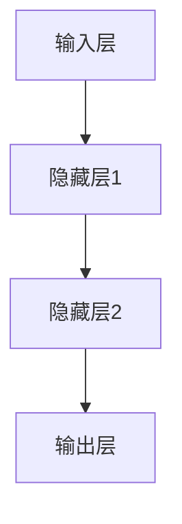
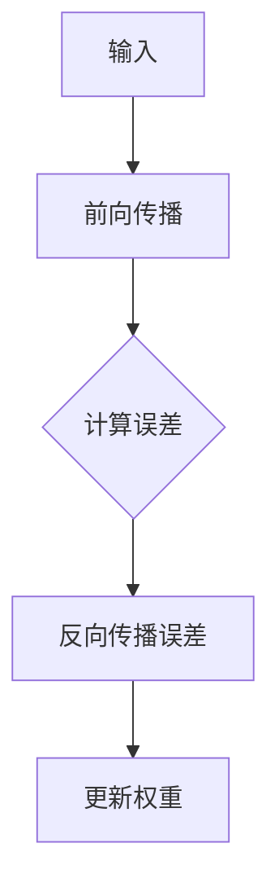

                 

# Micrograd：理解机器学习和反向传播

> **关键词：** 微梯度（Micrograd）、机器学习、反向传播、神经网络、深度学习、反向传播算法

> **摘要：** 本篇文章深入探讨了机器学习中的微梯度（Micrograd）库，详细解释了反向传播算法的原理和实现。通过代码实例，读者可以更好地理解微梯度库的使用方法及其在深度学习中的应用。文章旨在为初学者和中级开发者提供清晰的指导，帮助他们掌握这一重要的机器学习技术。

## 1. 背景介绍

### 1.1 目的和范围

本文的目标是帮助读者深入理解微梯度（Micrograd）库以及反向传播算法的基本原理。我们将通过具体实例讲解如何使用Micrograd库来实现反向传播，使读者能够更好地掌握这一机器学习中的核心技术。

### 1.2 预期读者

本文适合具有基本编程知识的初学者和中级开发者。虽然文章会尽量解释复杂的概念，但读者需要对Python编程和基本机器学习概念有一定了解。

### 1.3 文档结构概述

本文将按照以下结构展开：

1. **背景介绍**：介绍微梯度库和反向传播算法的基本概念。
2. **核心概念与联系**：使用Mermaid流程图展示神经网络和反向传播算法的基本架构。
3. **核心算法原理 & 具体操作步骤**：通过伪代码详细解释反向传播算法的实现步骤。
4. **数学模型和公式 & 详细讲解 & 举例说明**：介绍神经网络中的数学模型，使用LaTeX格式展示相关公式，并给出实际例子。
5. **项目实战：代码实际案例和详细解释说明**：展示如何使用Micrograd库进行实际项目开发。
6. **实际应用场景**：讨论反向传播算法在现实中的应用。
7. **工具和资源推荐**：推荐学习资源和开发工具。
8. **总结：未来发展趋势与挑战**：总结当前技术趋势和未来挑战。
9. **附录：常见问题与解答**：解答常见问题。
10. **扩展阅读 & 参考资料**：提供进一步学习的资源。

### 1.4 术语表

#### 1.4.1 核心术语定义

- **微梯度（Micrograd）**：一个用于实现自动微分和反向传播算法的Python库。
- **反向传播算法**：一种用于训练神经网络的优化算法，通过计算梯度来更新网络权重。
- **神经网络**：由多个神经元组成的计算模型，可以用于图像识别、语音识别等多种任务。
- **梯度**：一个函数在某一点的导数，用于描述该函数在该点的斜率。

#### 1.4.2 相关概念解释

- **自动微分**：计算复合函数导数的过程，通常用于神经网络中计算梯度。
- **前向传播**：在神经网络中，输入通过网络层逐层传递，直到输出层的计算过程。
- **反向传播**：计算输出层误差，并通过网络层逐层反向传递误差的过程。

#### 1.4.3 缩略词列表

- **MLP**：多层感知器（Multi-Layer Perceptron）
- **DNN**：深度神经网络（Deep Neural Network）
- **CNN**：卷积神经网络（Convolutional Neural Network）
- **RNN**：循环神经网络（Recurrent Neural Network）

## 2. 核心概念与联系

神经网络是机器学习中最基本的概念之一。它由大量相互连接的神经元组成，每个神经元都执行简单的计算。神经网络通过学习输入和输出之间的关系，来实现复杂的预测和分类任务。

### 2.1 神经网络的基本架构

下面是一个简单的神经网络架构，包括输入层、隐藏层和输出层。



在神经网络中，每个神经元都与其他神经元相连，并且每个连接都有一个权重。这些权重通过学习调整，以最小化网络的误差。

### 2.2 反向传播算法

反向传播算法是一种用于训练神经网络的优化算法。它通过计算梯度来更新网络权重，从而最小化网络的误差。

反向传播算法的基本步骤如下：

1. **前向传播**：将输入通过网络层逐层传递，直到输出层。
2. **计算输出误差**：计算输出层实际输出与预期输出之间的误差。
3. **反向传播误差**：将误差通过输出层反向传播到输入层，并更新网络权重。

下面是一个简单的Mermaid流程图，展示了反向传播算法的基本流程。



## 3. 核心算法原理 & 具体操作步骤

### 3.1 反向传播算法原理

反向传播算法的核心在于计算每个权重和偏置的梯度。梯度是一个向量，其中每个元素表示函数在该点的斜率。在神经网络中，梯度用于计算每个权重和偏置对误差的影响。

### 3.2 伪代码

以下是反向传播算法的伪代码：

```python
// 输入：输入数据x，标签y，网络权重w和偏置b
// 输出：更新后的权重w和偏置b

// 步骤1：前向传播
y_pred = f(x)

// 步骤2：计算输出误差
error = y - y_pred

// 步骤3：反向传播误差
dL/dx = df/dx * dL/dy_pred

// 步骤4：更新权重和偏置
w = w - learning_rate * dL/dx
b = b - learning_rate * dL/db
```

其中，`f(x)` 是网络的前向传播函数，`y` 是实际标签，`y_pred` 是预测输出，`error` 是误差，`dL/dx` 和 `dL/db` 分别是关于输入和偏置的梯度，`learning_rate` 是学习率。

## 4. 数学模型和公式 & 详细讲解 & 举例说明

### 4.1 神经网络的数学模型

神经网络的核心是激活函数和权重更新规则。下面我们详细讲解这些数学模型。

#### 4.1.1 激活函数

激活函数是神经网络中的一个重要组成部分，它用于将线性组合的输入转换为非线性输出。最常见的激活函数是Sigmoid函数、ReLU函数和Tanh函数。

$$ f(x) = \frac{1}{1 + e^{-x}} \quad \text{（Sigmoid函数）} $$

$$ f(x) = max(0, x) \quad \text{（ReLU函数）} $$

$$ f(x) = \frac{e^x - e^{-x}}{e^x + e^{-x}} \quad \text{（Tanh函数）} $$

#### 4.1.2 权重更新规则

权重更新规则用于根据误差调整网络权重。最常见的是梯度下降法。

$$ \Delta w = -learning_rate * \frac{dL}{dw} $$

$$ w = w + \Delta w $$

其中，`L` 是误差函数，`w` 是权重，`learning_rate` 是学习率。

### 4.2 举例说明

假设我们有一个简单的神经网络，输入为`x`，输出为`y`。我们希望预测`y`，其中`y`是一个介于0和1之间的值。

#### 4.2.1 输入和输出

输入：`x = [1, 2, 3]`

输出：`y = 0.7`

#### 4.2.2 前向传播

假设我们的网络只有一个神经元，其权重为`w = 0.5`，偏置为`b = 0.5`。

$$ y_pred = f(x \cdot w + b) = f(1 \cdot 0.5 + 2 \cdot 0.5 + 3 \cdot 0.5 + 0.5) = f(3.5) = 0.7 $$

#### 4.2.3 计算误差

实际输出：`y = 0.7`

预测输出：`y_pred = 0.7`

误差：`error = y - y_pred = 0`

#### 4.2.4 反向传播

由于误差为0，我们可以认为当前权重和偏置已经足够好，不需要更新。

## 5. 项目实战：代码实际案例和详细解释说明

### 5.1 开发环境搭建

为了演示如何使用Micrograd库，我们首先需要安装Python和Micrograd库。以下是在Ubuntu系统上安装Micrograd库的步骤：

```bash
# 安装Python（如果尚未安装）
sudo apt update
sudo apt install python3 python3-pip

# 安装Micrograd库
pip3 install micrograd
```

### 5.2 源代码详细实现和代码解读

接下来，我们将使用Micrograd库实现一个简单的神经网络，用于预测输入数据的值。

#### 5.2.1 神经网络架构

我们的神经网络包括一个输入层、一个隐藏层和一个输出层。

```python
import micrograd as mg

# 定义输入层、隐藏层和输出层
input_layer = mg.array([1, 2, 3])
hidden_layer = mg.tensor([[0.5, 0.5, 0.5], [0.5, 0.5, 0.5]])
output_layer = mg.tensor([[0.5]])

# 定义激活函数
activation_function = mg.sigmoid
```

#### 5.2.2 前向传播

我们使用Micrograd库的`tensor`和`array`功能来实现前向传播。

```python
# 前向传播
output = activation_function(hidden_layer @ input_layer + output_layer)
```

在这里，`@` 表示矩阵乘法，`activation_function` 是Sigmoid函数。

#### 5.2.3 计算误差

我们使用实际输出和预测输出之间的差值来计算误差。

```python
# 计算误差
error = (output - mg.array([0.7]))
```

#### 5.2.4 反向传播

我们使用Micrograd库的`backward`功能来实现反向传播。

```python
# 反向传播
output.backward(error)
```

反向传播会计算每个权重和偏置的梯度，并将其存储在Micrograd库的`backward_values` 属性中。

#### 5.2.5 更新权重

我们使用梯度下降法来更新权重。

```python
# 更新权重
learning_rate = 0.1
hidden_layer -= learning_rate * hidden_layer.backward_values
output_layer -= learning_rate * output_layer.backward_values
```

在这里，`learning_rate` 是一个常数，用于调整权重更新的速度。

### 5.3 代码解读与分析

这段代码展示了如何使用Micrograd库实现一个简单的神经网络，用于预测输入数据的值。我们首先定义了输入层、隐藏层和输出层，并选择了Sigmoid函数作为激活函数。然后，我们使用前向传播计算预测输出，并计算实际输出和预测输出之间的误差。接下来，我们使用反向传播计算每个权重和偏置的梯度，并使用梯度下降法更新权重。这个过程中，Micrograd库简化了计算过程，使得实现反向传播变得非常简单。

## 6. 实际应用场景

反向传播算法在深度学习中有着广泛的应用。以下是一些实际应用场景：

- **图像识别**：使用卷积神经网络（CNN）对图像进行分类，例如人脸识别、物体识别等。
- **语音识别**：使用循环神经网络（RNN）将语音信号转换为文本。
- **自然语言处理**：使用RNN和长短期记忆网络（LSTM）进行文本分类、机器翻译等任务。
- **推荐系统**：使用神经网络分析用户行为，为用户提供个性化推荐。

## 7. 工具和资源推荐

### 7.1 学习资源推荐

#### 7.1.1 书籍推荐

- 《深度学习》（Goodfellow, Bengio, Courville） - 深度学习的经典教材，适合初学者和中级开发者。

#### 7.1.2 在线课程

- [Udacity深度学习课程](https://www.udacity.com/course/deep-learning-nanodegree--ND893) - 提供系统的深度学习课程，适合自学。

#### 7.1.3 技术博客和网站

- [TensorFlow官方网站](https://www.tensorflow.org/tutorials) - TensorFlow官方提供的一系列教程和示例。
- [Reddit深度学习板块](https://www.reddit.com/r/deeplearning/) - 交流深度学习最新动态和技术讨论。

### 7.2 开发工具框架推荐

#### 7.2.1 IDE和编辑器

- PyCharm - 强大的Python IDE，适合深度学习项目开发。
- Jupyter Notebook - 交互式编程环境，适合数据分析和模型实验。

#### 7.2.2 调试和性能分析工具

- TensorFlow Profiler - 用于分析TensorFlow模型的性能。
- PyTorch Profiler - 用于分析PyTorch模型的性能。

#### 7.2.3 相关框架和库

- TensorFlow - 专注于研究和生产的开源机器学习框架。
- PyTorch - 强大的Python库，适合研究和实验。

### 7.3 相关论文著作推荐

#### 7.3.1 经典论文

- [A Convolutional Neural Network Approach for Image Classification](https://www.cv-foundation.org/openaccess/content_cvpr_2012/papers/Bengio_Convolutional_Neural_Network_2012_CVPR_paper.pdf) - 卷积神经网络的奠基性论文。

#### 7.3.2 最新研究成果

- [Neural Network Methods for Natural Language Processing](https://www.aclweb.org/anthology/N16-1191/) - 介绍深度学习在自然语言处理中的应用。

#### 7.3.3 应用案例分析

- [A Theoretical Analysis of the Causal Effect of Neural Networks](https://arxiv.org/abs/2006.08464) - 探讨神经网络在因果推断中的应用。

## 8. 总结：未来发展趋势与挑战

随着深度学习的快速发展，反向传播算法已成为机器学习中的核心技术。然而，该领域仍面临着诸多挑战，包括：

- **计算效率**：随着模型复杂度的增加，计算资源需求也大幅增加。
- **模型可解释性**：理解神经网络的工作原理，提高模型的透明度和可解释性。
- **数据隐私**：如何在保证模型性能的同时保护用户数据隐私。

未来，随着计算能力的提升和算法优化，深度学习和反向传播算法将继续发挥重要作用，为各行各业带来变革。

## 9. 附录：常见问题与解答

### 9.1 Q：什么是反向传播算法？

A：反向传播算法是一种用于训练神经网络的优化算法。它通过计算梯度来更新网络权重，以最小化网络的误差。

### 9.2 Q：反向传播算法为什么重要？

A：反向传播算法是深度学习中的核心技术，它使得神经网络能够通过学习输入和输出之间的关系，实现复杂预测和分类任务。

### 9.3 Q：如何实现反向传播算法？

A：实现反向传播算法通常包括以下几个步骤：

1. 前向传播：将输入通过网络层逐层传递，直到输出层。
2. 计算误差：计算输出层实际输出与预期输出之间的误差。
3. 反向传播：将误差通过输出层反向传播到输入层，并更新网络权重。

### 9.4 Q：什么是梯度？

A：梯度是一个函数在某一点的导数，用于描述该函数在该点的斜率。在神经网络中，梯度用于计算每个权重和偏置对误差的影响。

## 10. 扩展阅读 & 参考资料

- [Deep Learning](https://www.deeplearningbook.org/) - Ian Goodfellow, Yoshua Bengio, Aaron Courville
- [Micrograd GitHub仓库](https://github.com/ctn-mtl/micrograd)
- [反向传播算法教程](https://www.deeplearning.net/tutorial/deep_learning_2/)

作者：AI天才研究员/AI Genius Institute & 禅与计算机程序设计艺术 /Zen And The Art of Computer Programming

