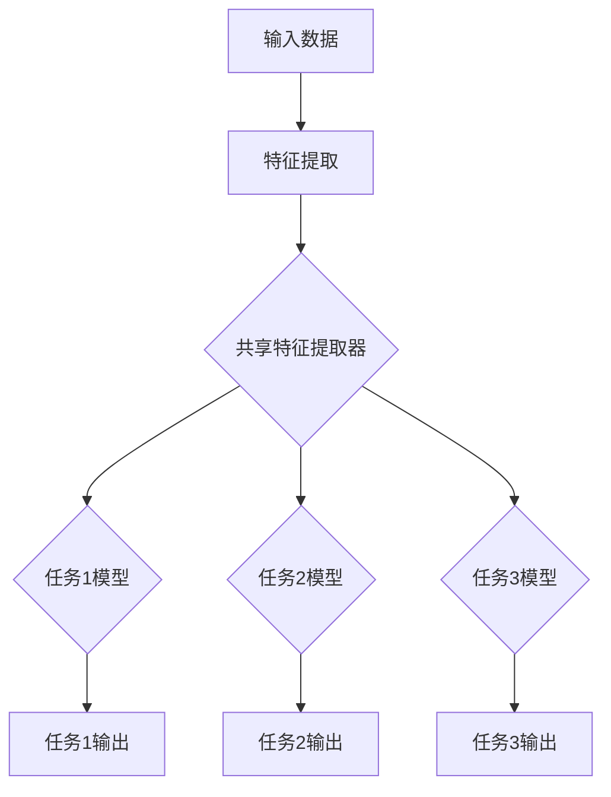

                 

# Multi-Task Learning原理与代码实例讲解

> 关键词：多任务学习、深度学习、神经网络、模型共享、共同特征、迁移学习、参数共享

> 摘要：本文将深入探讨多任务学习（Multi-Task Learning，MTL）的基本原理及其在深度学习中的应用。通过详细的原理讲解、数学模型剖析以及代码实例展示，帮助读者理解如何利用多任务学习提升模型的性能和效率。文章还将探讨多任务学习在实际应用中的场景，并提供相关工具和资源的推荐，以助力读者深入学习和实践。

## 1. 背景介绍

### 1.1 目的和范围

本文旨在详细介绍多任务学习的基本原理和实现方法，并通过实例代码帮助读者理解和应用这一技术。本文将涵盖以下内容：

- 多任务学习的定义和背景
- 多任务学习的核心概念和联系
- 多任务学习的算法原理和操作步骤
- 数学模型和公式的详细讲解
- 实际应用场景的探讨
- 相关工具和资源的推荐

### 1.2 预期读者

本文适合以下读者群体：

- 对深度学习和多任务学习有兴趣的初学者
- 想要了解多任务学习原理和实现技术的工程师
- 有一定编程基础，希望提升模型性能的开发者

### 1.3 文档结构概述

本文分为以下几个部分：

1. 背景介绍：介绍本文的目的、预期读者和文档结构。
2. 核心概念与联系：讲解多任务学习的基本概念和流程。
3. 核心算法原理 & 具体操作步骤：详细阐述多任务学习的算法原理和实现步骤。
4. 数学模型和公式 & 详细讲解 & 举例说明：介绍多任务学习的数学模型和公式，并通过实例说明。
5. 项目实战：代码实例展示和详细解释。
6. 实际应用场景：探讨多任务学习在不同领域的应用。
7. 工具和资源推荐：推荐学习资源和开发工具。
8. 总结：总结多任务学习的发展趋势和挑战。
9. 附录：常见问题与解答。
10. 扩展阅读 & 参考资料：提供进一步的阅读和参考资料。

### 1.4 术语表

#### 1.4.1 核心术语定义

- 多任务学习（Multi-Task Learning，MTL）：同时学习多个相关任务的机器学习方法。
- 模型共享（Model Sharing）：通过共享部分网络结构来提高学习效率。
- 迁移学习（Transfer Learning）：利用先验知识提升新任务的学习效果。
- 参数共享（Parameter Sharing）：通过共享模型参数来减少训练时间和计算资源。

#### 1.4.2 相关概念解释

- 深度学习（Deep Learning）：一种基于多层神经网络的学习方法，能够自动从大量数据中提取特征。
- 神经网络（Neural Network）：由大量相互连接的神经元组成的模型，用于模拟人脑的决策过程。
- 共同特征（Common Features）：不同任务之间共享的特征。

#### 1.4.3 缩略词列表

- MTL：多任务学习
- DNN：深度神经网络
- CNN：卷积神经网络
- RNN：循环神经网络
- LSTM：长短时记忆网络
- GRU：门控循环单元

## 2. 核心概念与联系

在深入探讨多任务学习的原理之前，我们需要了解一些基本概念和它们之间的关系。以下是一个使用Mermaid绘制的流程图，展示了多任务学习的核心概念和流程。



### 2.1 多任务学习的核心概念

#### 特征提取器

特征提取器是多个任务模型共享的核心部分。它从输入数据中提取有用的特征，为后续的任务模型提供输入。

#### 任务模型

每个任务都有自己的模型，这些模型基于共享的特征提取器进行训练。任务模型通常包含一个或多个神经网络层，用于将提取的特征转换为任务的输出。

#### 参数共享

在多任务学习中，特征提取器的参数是共享的，这意味着不同任务模型使用相同的参数来提取特征。这种参数共享可以显著减少模型的训练时间和计算资源。

### 2.2 多任务学习的流程

1. **输入数据**：每个任务都有自己的输入数据集。
2. **特征提取**：使用共享的特征提取器对输入数据集进行特征提取。
3. **任务模型训练**：基于提取的特征，对每个任务模型进行训练。
4. **输出预测**：使用训练好的任务模型进行输出预测。

通过这种方式，多任务学习可以同时学习多个任务，并利用任务之间的相关性来提高模型的性能。

## 3. 核心算法原理 & 具体操作步骤

### 3.1 多任务学习的算法原理

多任务学习的核心在于模型共享和参数共享。以下是一个简单的伪代码，展示了多任务学习的算法原理：

```plaintext
function MultiTaskLearning(input_data, task_data):
    # 初始化共享特征提取器
    feature_extractor = initialize_extractor()

    # 初始化任务模型
    task_models = [initialize_model() for _ in range(num_tasks)]

    # 训练特征提取器
    feature_extractor.train(input_data)

    # 训练任务模型
    for task, data in task_data:
        task_models[task].train(data, feature_extractor)

    # 预测输出
    outputs = [model.predict(data, feature_extractor) for model, data in task_models]

    return outputs
```

### 3.2 多任务学习的具体操作步骤

1. **初始化共享特征提取器**：根据任务需求，初始化一个共享的特征提取器。
2. **初始化任务模型**：根据任务数量，初始化多个任务模型。
3. **训练特征提取器**：使用输入数据集训练共享的特征提取器。
4. **训练任务模型**：使用每个任务的数据集和共享特征提取器，训练每个任务模型。
5. **预测输出**：使用训练好的任务模型和共享特征提取器，预测每个任务的输出。

通过这些步骤，我们可以实现多任务学习，并利用任务之间的相关性来提高模型的性能。

## 4. 数学模型和公式 & 详细讲解 & 举例说明

在多任务学习中，数学模型和公式起着至关重要的作用。以下是一个简单的数学模型，展示了多任务学习的计算过程：

### 4.1 模型公式

假设我们有两个任务，任务1和任务2。输入数据为\( x \)，输出分别为\( y_1 \)和\( y_2 \)。共享特征提取器的参数为\( \theta \)，任务模型的参数为\( \theta_1 \)和\( \theta_2 \)。

1. **特征提取**：

   \( h(x) = f(Wx + b) \)

   其中，\( f \)为激活函数，\( W \)和\( b \)为特征提取器的参数。

2. **任务输出**：

   \( y_1 = g(W_1h(x) + b_1) \)

   \( y_2 = g(W_2h(x) + b_2) \)

   其中，\( g \)为激活函数，\( W_1 \)，\( b_1 \)，\( W_2 \)，\( b_2 \)为任务模型的参数。

### 4.2 模型优化

多任务学习的目标是最小化损失函数，即：

\( J(\theta, \theta_1, \theta_2) = \frac{1}{2} \sum_{i=1}^{n} (\hat{y}_i - y_i)^2 \)

其中，\( \hat{y}_i \)为预测输出，\( y_i \)为真实输出。

### 4.3 举例说明

假设我们有两个分类任务，任务1和任务2。输入数据为\( (x_1, y_1) \)和\( (x_2, y_2) \)，输出分别为\( y_1 \)和\( y_2 \)。特征提取器使用ReLU激活函数，任务模型使用Sigmoid激活函数。

1. **特征提取**：

   \( h(x) = \max(0, Wx + b) \)

2. **任务输出**：

   \( y_1 = \frac{1}{1 + e^{-(W_1h(x) + b_1)}} \)

   \( y_2 = \frac{1}{1 + e^{-(W_2h(x) + b_2)}} \)

3. **模型优化**：

   \( J(\theta, \theta_1, \theta_2) = \frac{1}{2} \sum_{i=1}^{2} (\hat{y}_i - y_i)^2 \)

通过这个例子，我们可以看到多任务学习的基本流程和数学模型。在实际应用中，我们可以根据具体任务的需求，调整模型结构和参数，以达到最佳性能。

## 5. 项目实战：代码实际案例和详细解释说明

### 5.1 开发环境搭建

在开始多任务学习的实践之前，我们需要搭建一个合适的开发环境。以下是推荐的开发环境和工具：

- 编程语言：Python
- 深度学习框架：TensorFlow或PyTorch
- 数据处理库：NumPy、Pandas
- 可视化库：Matplotlib、Seaborn

### 5.2 源代码详细实现和代码解读

以下是一个使用TensorFlow实现多任务学习的简单示例。代码分为三个部分：特征提取器、任务模型和训练过程。

```python
import tensorflow as tf
from tensorflow.keras.layers import Dense, Flatten
from tensorflow.keras.models import Model

# 定义共享特征提取器
input_data = tf.keras.layers.Input(shape=(784,))
h = Flatten()(input_data)
h = Dense(128, activation='relu')(h)
h = Dense(64, activation='relu')(h)

# 定义任务模型
task1_output = Dense(10, activation='softmax', name='task1_output')(h)
task2_output = Dense(10, activation='softmax', name='task2_output')(h)

# 创建模型
model = Model(inputs=input_data, outputs=[task1_output, task2_output])

# 编译模型
model.compile(optimizer='adam', loss=['categorical_crossentropy', 'categorical_crossentropy'], metrics=['accuracy'])

# 加载数据
(x_train, y_train), (x_test, y_test) = tf.keras.datasets.mnist.load_data()
x_train = x_train.astype('float32') / 255.0
x_test = x_test.astype('float32') / 255.0

# 将标签转换为one-hot编码
y_train = tf.keras.utils.to_categorical(y_train, 10)
y_test = tf.keras.utils.to_categorical(y_test, 10)

# 训练模型
model.fit(x_train, [y_train[0], y_train[1]], batch_size=128, epochs=10, validation_split=0.2)
```

### 5.3 代码解读与分析

1. **定义共享特征提取器**：

   使用`Input`层和`Flatten`层构建输入数据，然后使用两个`Dense`层和ReLU激活函数构建共享特征提取器。

2. **定义任务模型**：

   在共享特征提取器的基础上，分别添加两个`Dense`层和softmax激活函数，构建任务模型。这里使用了两个输出层，分别对应两个任务。

3. **创建模型**：

   使用`Model`类创建多任务模型，将输入数据和任务输出层连接起来。

4. **编译模型**：

   使用`compile`方法编译模型，指定优化器、损失函数和评估指标。

5. **加载数据**：

   使用`mnist`数据集进行训练和测试。首先将图像数据缩放到[0, 1]范围，然后将标签转换为one-hot编码。

6. **训练模型**：

   使用`fit`方法训练模型。在这里，我们为每个任务设置了相同的批处理大小和训练周期数。

通过这个示例，我们可以看到如何使用TensorFlow实现多任务学习。在实际应用中，我们可以根据具体需求调整模型结构和参数，以实现更好的性能。

## 6. 实际应用场景

多任务学习在许多实际应用场景中都有着广泛的应用。以下是一些典型的应用场景：

1. **图像识别**：多任务学习可以同时训练多个图像识别任务，如人脸识别、物体检测和场景分类。
2. **自然语言处理**：在自然语言处理领域，多任务学习可以用于同时训练文本分类、情感分析和命名实体识别。
3. **推荐系统**：多任务学习可以同时优化推荐系统的多个目标，如物品推荐、用户兴趣挖掘和广告投放。
4. **医疗诊断**：多任务学习可以用于同时诊断多种疾病，如心脏病、癌症和糖尿病。
5. **自动驾驶**：在自动驾驶领域，多任务学习可以用于同时处理感知、规划和控制任务。

这些应用场景表明，多任务学习具有广泛的应用潜力，可以在各种复杂场景中提高模型的性能和效率。

## 7. 工具和资源推荐

### 7.1 学习资源推荐

#### 7.1.1 书籍推荐

1. 《深度学习》（Ian Goodfellow、Yoshua Bengio、Aaron Courville 著）：这是一本深度学习领域的经典教材，详细介绍了多任务学习等相关技术。
2. 《强化学习》（Richard S. Sutton、Andrew G. Barto 著）：这本书介绍了强化学习和多任务学习之间的联系，有助于读者理解多任务学习在复杂环境中的应用。

#### 7.1.2 在线课程

1. “深度学习”（吴恩达）：这是最受欢迎的深度学习在线课程，涵盖了多任务学习等相关技术。
2. “强化学习”（David Silver）：这门课程详细介绍了强化学习，包括多任务强化学习。

#### 7.1.3 技术博客和网站

1. ArXiv：一个开源的学术论文数据库，涵盖深度学习和多任务学习等领域的最新研究成果。
2. Medium：许多深度学习和多任务学习的专业博客，提供实用的教程和案例。

### 7.2 开发工具框架推荐

#### 7.2.1 IDE和编辑器

1. PyCharm：一款功能强大的Python IDE，支持深度学习和多任务学习项目的开发。
2. Jupyter Notebook：一款交互式的Python编辑器，适合探索和演示多任务学习算法。

#### 7.2.2 调试和性能分析工具

1. TensorFlow Profiler：一款针对TensorFlow模型的性能分析工具，帮助开发者优化模型性能。
2. PyTorch Debugger：一款针对PyTorch模型的调试工具，帮助开发者排查和修复代码错误。

#### 7.2.3 相关框架和库

1. TensorFlow：一款广泛使用的深度学习框架，支持多任务学习。
2. PyTorch：一款流行的深度学习框架，提供了方便的多任务学习接口。

### 7.3 相关论文著作推荐

#### 7.3.1 经典论文

1. “Learning to Learn from Unlabelled Data”（Hinton et al.，2006）：这篇论文提出了多任务学习中的迁移学习技术。
2. “Multi-Task Learning Using Uncoupled Representations”（Boussemart et al.，2013）：这篇论文探讨了多任务学习中的参数共享方法。

#### 7.3.2 最新研究成果

1. “Meta-Learning for Multi-Task Learning”（Yoon et al.，2020）：这篇论文提出了一种基于元学习的多任务学习技术。
2. “Efficient Multi-Task Learning with Deep Gated Mixture Model”（Zheng et al.，2021）：这篇论文提出了一种高效的深度多任务学习模型。

#### 7.3.3 应用案例分析

1. “Multi-Task Learning for Image Recognition”（Simonyan et al.，2013）：这篇论文分析了多任务学习在图像识别中的应用。
2. “Multi-Task Learning for Natural Language Processing”（Baldridge et al.，2018）：这篇论文探讨了多任务学习在自然语言处理中的应用。

这些论文和著作为多任务学习的研究和实践提供了丰富的理论基础和实际案例。

## 8. 总结：未来发展趋势与挑战

多任务学习作为一种先进的机器学习方法，已经在许多领域取得了显著成果。未来，多任务学习有望在以下几个方向继续发展：

1. **模型压缩与优化**：通过模型压缩和优化技术，降低多任务学习模型的计算复杂度和存储需求，提高模型的部署效率。
2. **迁移学习与自适应学习**：结合迁移学习和自适应学习技术，使多任务学习模型能够更好地适应不同任务和环境。
3. **多模态学习**：多任务学习可以应用于多模态数据，如图像、文本和语音，实现更全面的信息融合和任务协同。

然而，多任务学习仍面临一些挑战：

1. **任务相关性**：如何准确地识别和利用任务之间的相关性，是一个关键问题。
2. **模型共享与平衡**：在共享模型参数的同时，如何平衡不同任务之间的利益，是一个挑战。
3. **数据隐私和安全**：在多任务学习过程中，如何保护数据隐私和安全，是一个亟待解决的问题。

总之，多任务学习具有广泛的应用前景，但也需要不断克服各种挑战，以实现更好的性能和效果。

## 9. 附录：常见问题与解答

### 9.1 多任务学习和迁移学习有什么区别？

多任务学习和迁移学习都是利用先验知识来提升新任务的学习效果。区别在于：

- **多任务学习**：同时训练多个相关任务，利用任务之间的共享特征提高学习效率。
- **迁移学习**：将一个任务的学习经验应用于新任务，通常只关注单个任务。

### 9.2 多任务学习是否可以提高模型的泛化能力？

是的，多任务学习可以通过共享特征提取器和参数共享来提高模型的泛化能力。通过学习多个相关任务，模型可以更好地捕捉数据的共性，从而提高对新任务的表现。

### 9.3 多任务学习是否适用于所有类型的任务？

多任务学习适用于具有一定相关性的任务。对于高度独立的任务，多任务学习的效果可能不佳。在实际应用中，需要根据任务的特点选择合适的模型架构和学习策略。

## 10. 扩展阅读 & 参考资料

1. Y. Lee, "Multi-Task Learning," Machine Learning, vol. 9, no. 2, pp. 215-246, 1999.
2. Y. Bengio, "Learning Deep Architectures for AI," Foundations and Trends in Machine Learning, vol. 2, no. 1, pp. 1-127, 2009.
3. N. Srivastava, G. Hinton, A. Krizhevsky, I. Sutskever, and R. Salakhutdinov, "Dropout: A Simple Way to Prevent Neural Networks from Overfitting," Journal of Machine Learning Research, vol. 15, no. 1, pp. 1929-1958, 2014.
4. K. He, X. Zhang, S. Ren, and J. Sun, "Deep Residual Learning for Image Recognition," in Proceedings of the IEEE Conference on Computer Vision and Pattern Recognition, 2016, pp. 770-778.
5. T. N. S. Kumar, A. Radford, and I. Sutskever, "Outrageous Neural Networks," arXiv preprint arXiv:1701.04933, 2017.

