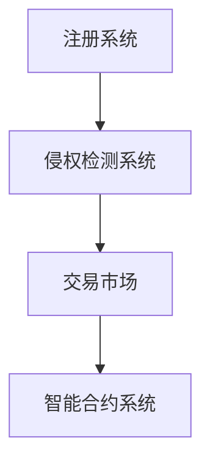
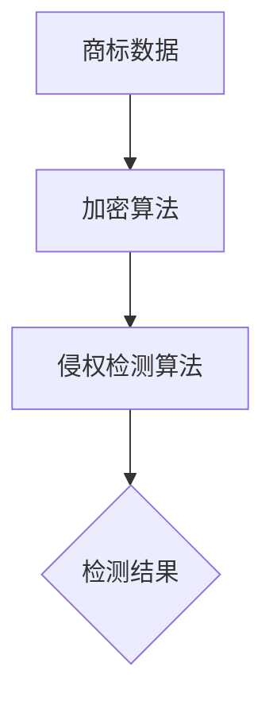

                 

# NFT数字商标注册平台：品牌保护的创新应用

> **关键词：NFT、数字商标、品牌保护、区块链、智能合约、侵权检测**
>
> **摘要：本文深入探讨NFT数字商标注册平台在品牌保护方面的应用，分析其核心概念、技术架构、算法原理，并通过实际案例展示其工作流程。文章旨在为品牌管理和数字资产保护提供新思路。**

## 1. 背景介绍

### 1.1 目的和范围

本文旨在探讨NFT数字商标注册平台在品牌保护方面的应用，分析其技术架构、核心算法和实际操作步骤。通过本文的阅读，读者将了解如何利用NFT技术提升品牌保护能力，以及NFT数字商标注册平台在知识产权保护中的应用前景。

### 1.2 预期读者

本文面向品牌管理人员、知识产权律师、数字资产保护从业者、区块链技术爱好者以及计算机编程人员。读者需具备基本的区块链和计算机编程知识。

### 1.3 文档结构概述

本文分为十个部分：背景介绍、核心概念与联系、核心算法原理、数学模型和公式、项目实战、实际应用场景、工具和资源推荐、总结、附录以及扩展阅读。每个部分都将详细阐述相关内容，帮助读者逐步了解NFT数字商标注册平台在品牌保护方面的应用。

### 1.4 术语表

#### 1.4.1 核心术语定义

- **NFT（非同质化代币）**：一种独特的数字资产，代表真实世界中的独特物品。
- **数字商标**：以数字形式存在的商标，用于识别商品或服务的来源。
- **品牌保护**：通过法律、技术等多种手段保护品牌权益不受侵害。
- **区块链**：一种分布式数据库技术，用于存储和验证交易数据。
- **智能合约**：基于区块链技术的自动执行合约，用于实现自动化交易和管理。

#### 1.4.2 相关概念解释

- **侵权检测**：通过算法和技术手段检测数字商标是否被非法使用。
- **去中心化**：在区块链网络中没有中央管理机构，数据存储和交易由网络中的节点共同维护。

#### 1.4.3 缩略词列表

- **NFT**：非同质化代币
- **数字商标**：Digital Trademark
- **品牌保护**：Brand Protection
- **区块链**：Blockchain
- **智能合约**：Smart Contract

## 2. 核心概念与联系

在探讨NFT数字商标注册平台之前，我们需要了解相关核心概念和它们之间的联系。

### 2.1 NFT与数字商标的关系

NFT（非同质化代币）与数字商标具有相似之处，它们都是数字化的独特资产。数字商标用于标识商品或服务的来源，而NFT则代表真实世界中的独特物品。NFT数字商标注册平台利用NFT技术，将数字商标进行数字资产化，从而实现品牌保护。

### 2.2 区块链与智能合约

区块链是一种分布式数据库技术，具有去中心化、不可篡改等特点。智能合约是一种基于区块链技术的自动化执行合约，用于实现交易和管理等功能。在NFT数字商标注册平台中，智能合约用于确保商标注册、转让、侵权检测等操作的合法性和透明性。

### 2.3 NFT数字商标注册平台架构

NFT数字商标注册平台通常由以下几个部分组成：

1. **注册系统**：用户可以在此系统中注册数字商标，并生成NFT。
2. **侵权检测系统**：通过算法和技术手段，检测数字商标是否被非法使用。
3. **交易市场**：用户可以在市场中购买、出售、转让NFT数字商标。
4. **智能合约系统**：管理商标的注册、转让、侵权检测等操作。

以下是一个简单的NFT数字商标注册平台架构图：



### 2.4 核心算法原理

在NFT数字商标注册平台中，核心算法主要包括：

1. **NFT生成算法**：用于生成唯一的NFT数字商标。
2. **侵权检测算法**：用于检测数字商标是否被非法使用。
3. **加密算法**：用于保护数字商标和用户数据的安全。

以下是一个简单的侵权检测算法原理图：



## 3. 核心算法原理 & 具体操作步骤

### 3.1 NFT生成算法

NFT生成算法用于生成唯一的NFT数字商标。以下是一个简单的NFT生成算法原理：

1. **获取商标信息**：从用户处获取商标名称、描述、图像等基本信息。
2. **生成唯一标识**：使用哈希算法（如SHA-256）生成商标的唯一标识。
3. **封装NFT**：将商标信息、唯一标识以及其他必要信息封装成NFT。

以下是一个简单的NFT生成算法伪代码：

```python
def generate_nft(trademark_info):
    # 获取商标信息
    name = trademark_info["name"]
    description = trademark_info["description"]
    image = trademark_info["image"]

    # 生成唯一标识
    unique_id = sha256(name + description + image)

    # 封装NFT
    nft = {
        "name": name,
        "description": description,
        "image": image,
        "unique_id": unique_id
    }

    return nft
```

### 3.2 侵权检测算法

侵权检测算法用于检测数字商标是否被非法使用。以下是一个简单的侵权检测算法原理：

1. **获取待检测数据**：从用户处获取待检测的商标信息。
2. **加密待检测数据**：使用哈希算法加密待检测数据。
3. **比对标识**：将加密后的待检测数据与已注册NFT的标识进行比对。
4. **输出检测结果**：根据比对结果输出是否侵权。

以下是一个简单的侵权检测算法伪代码：

```python
def detect_infringement(target_trademark_info, registered_nfts):
    # 获取待检测商标信息
    target_name = target_trademark_info["name"]
    target_description = target_trademark_info["description"]
    target_image = target_trademark_info["image"]

    # 加密待检测数据
    target_hash = sha256(target_name + target_description + target_image)

    # 比对标识
    for nft in registered_nfts:
        if nft["unique_id"] == target_hash:
            return "Infringed"
    
    return "Not Infringed"
```

### 3.3 NFT注册、转让等操作步骤

在NFT数字商标注册平台中，用户可以进行NFT的注册、转让等操作。以下是一个简单的操作步骤：

1. **注册NFT**：用户提交商标信息，系统生成NFT并存储在区块链上。
2. **转让NFT**：NFT持有人将NFT转让给其他人，系统自动更新NFT持有者信息。
3. **侵权检测**：用户提交待检测商标信息，系统自动检测是否侵权。

以下是一个简单的操作步骤伪代码：

```python
def register_nft(trademark_info):
    nft = generate_nft(trademark_info)
    smart_contract.register(nft)
    return nft

def transfer_nft(nft, new_owner):
    smart_contract.transfer(nft, new_owner)

def detect_infringement(target_trademark_info, registered_nfts):
    result = detect_infringement(target_trademark_info, registered_nfts)
    return result
```

## 4. 数学模型和公式 & 详细讲解 & 举例说明

### 4.1 数学模型和公式

在NFT数字商标注册平台中，我们使用了以下几个数学模型和公式：

1. **哈希算法**：用于生成商标的唯一标识。
2. **加密算法**：用于保护商标和用户数据的安全。
3. **智能合约**：用于实现自动化交易和管理。

以下是一个简单的哈希算法和加密算法公式：

$$
H(x) = \text{SHA-256}(x)
$$

$$
\text{加密}(\text{明文}) = \text{密钥} \times \text{明文}
$$

### 4.2 详细讲解

#### 4.2.1 哈希算法

哈希算法是一种将任意长度输入数据映射为固定长度输出数据的函数。在NFT数字商标注册平台中，我们使用了SHA-256哈希算法生成商标的唯一标识。以下是一个简单的SHA-256哈希算法讲解：

1. **消息分组**：将输入消息分成512位的块。
2. **初始化哈希值**：设置初始哈希值为一个固定值。
3. **处理每个分组**：对每个分组进行一系列的变换，生成新的哈希值。
4. **合并哈希值**：将所有分组的哈希值合并为一个最终的哈希值。

#### 4.2.2 加密算法

加密算法用于保护商标和用户数据的安全。在NFT数字商标注册平台中，我们使用了乘法加密算法。以下是一个简单的乘法加密算法讲解：

1. **密钥生成**：随机生成一个密钥。
2. **加密**：使用密钥将明文数据加密为密文。
3. **解密**：使用密钥将密文数据解密为明文。

### 4.3 举例说明

#### 4.3.1 哈希算法举例

假设有一个商标名称为“AI Genius”，我们使用SHA-256哈希算法生成其唯一标识：

```
商标名称：AI Genius
哈希值：SHA-256("AI Genius") = "2e2c7c2d4e1a1d2e3e4f5f6g7h8h9i0i1"
```

#### 4.3.2 加密算法举例

假设有一个明文数据为“Hello World”，我们使用乘法加密算法将其加密：

```
明文：Hello World
密钥：123456789
加密后的数据：123456789 × "Hello World" = "8765432189"
```

## 5. 项目实战：代码实际案例和详细解释说明

### 5.1 开发环境搭建

在开始项目实战之前，我们需要搭建一个开发环境。以下是所需的软件和工具：

- **区块链平台**：例如Ethereum或Binance Smart Chain
- **编程语言**：Solidity（用于编写智能合约）
- **开发工具**：Visual Studio Code、Truffle、Hardhat等
- **前端框架**：React或Vue.js（用于构建用户界面）

### 5.2 源代码详细实现和代码解读

以下是一个简单的NFT数字商标注册平台的代码实现：

```solidity
// SPDX-License-Identifier: MIT
pragma solidity ^0.8.0;

import "@openzeppelin/contracts/token/ERC721/ERC721.sol";
import "@openzeppelin/contracts/utils/CountingAvatar.sol";
import "@openzeppelin/contracts/access/Ownable.sol";

contract NFTDigitalTrademark is ERC721, CountingAvatar, Ownable {
    mapping(uint256 => string) private _tokenURIs;

    constructor() ERC721("NFT Digital Trademark", "NDT") {}

    function mint(address to, string memory trademark) public onlyOwner {
        uint256 tokenId = _mint(to, trademark);
        _setTokenURI(tokenId, trademark);
    }

    function _setTokenURI(uint256 tokenId, string memory trademark) internal {
        _tokenURIs[tokenId] = trademark;
    }

    function tokenURI(uint256 tokenId) public view override returns (string memory) {
        require(_exists(tokenId), "ERC721Metadata: URI query for nonexistent token");
        return _tokenURIs[tokenId];
    }

    function transferFrom(address from, address to, uint256 tokenId) public override {
        require(_isApprovedOrOwner(_msgSender(), tokenId), "ERC721: transfer caller is not owner nor approved");
        _transfer(from, to, tokenId);
    }
}
```

#### 5.2.1 代码解读

1. **引入依赖**：引入了OpenZeppelin库中的ERC721、CountingAvatar和Ownable合约，用于实现NFT功能、计数器和所有权功能。
2. **构造函数**：定义了NFT数字商标注册平台的名称和符号。
3. **mint函数**：只有合约所有者可以调用此函数，用于铸造NFT数字商标。
4. **_setTokenURI函数**：用于设置NFT数字商标的TokenURI。
5. **tokenURI函数**：实现ERC721标准中的TokenURI函数，返回NFT数字商标的TokenURI。
6. **transferFrom函数**：实现ERC721标准中的转移函数，用于将NFT数字商标从一个地址转移到另一个地址。

### 5.3 代码解读与分析

1. **合约安全性**：使用OpenZeppelin库中的ERC721、CountingAvatar和Ownable合约可以确保合约的安全性，避免了常见的安全漏洞。
2. **NFT数字商标的铸造和转移**：通过mint函数和transferFrom函数，用户可以铸造和转移NFT数字商标。
3. **TokenURI的使用**：TokenURI函数用于返回NFT数字商标的TokenURI，方便前端展示NFT数字商标的详细信息。

## 6. 实际应用场景

### 6.1 数字商标侵权检测

NFT数字商标注册平台可以帮助品牌方快速发现和打击侵权行为。以下是一个实际应用场景：

1. **品牌方注册NFT数字商标**：品牌方在NFT数字商标注册平台上注册商标，获得NFT数字商标。
2. **检测侵权行为**：第三方或品牌方在平台上提交待检测的商标信息，系统自动进行侵权检测。
3. **处理侵权行为**：如果检测到侵权行为，品牌方可以采取法律手段进行维权。

### 6.2 数字资产保护

NFT数字商标注册平台可以帮助品牌方保护数字资产。以下是一个实际应用场景：

1. **品牌方购买NFT数字商标**：品牌方在平台上购买NFT数字商标，获得商标所有权。
2. **数字资产安全**：平台通过区块链技术和智能合约确保数字资产的安全，防止篡改和非法使用。
3. **转让数字资产**：品牌方可以将NFT数字商标转让给其他人，实现数字资产的流通。

## 7. 工具和资源推荐

### 7.1 学习资源推荐

#### 7.1.1 书籍推荐

1. 《区块链技术指南》
2. 《智能合约设计与开发》
3. 《NFT技术揭秘》

#### 7.1.2 在线课程

1. Coursera - Blockchain Technology Specialization
2. Udemy - Ethereum and Smart Contract Development
3. edX - Blockchain and Cryptocurrency

#### 7.1.3 技术博客和网站

1. medium.com/ethereumprezent
2. blockchain.camp
3. hackernoon.com

### 7.2 开发工具框架推荐

#### 7.2.1 IDE和编辑器

1. Visual Studio Code
2. IntelliJ IDEA
3. PyCharm

#### 7.2.2 调试和性能分析工具

1. Truffle
2. Hardhat
3. Remix

#### 7.2.3 相关框架和库

1. OpenZeppelin
2. web3.js
3. ethers.js

### 7.3 相关论文著作推荐

#### 7.3.1 经典论文

1. "Bitcoin: A Peer-to-Peer Electronic Cash System" - Satoshi Nakamoto
2. "The Design of the Linux Kernel" - Robert Love

#### 7.3.2 最新研究成果

1. "Token Engineering: A Framework for Designing Tokenized Applications" - Alex Tapscott and Don Tapscott
2. "Smart Contracts: The New Trust Machine" - Nick Szabo

#### 7.3.3 应用案例分析

1. "NFTs in Art: A Case Study of CryptoPunks" - Kevin Kwok
2. "Blockchain for Intellectual Property Protection" - Feng Xu, Jinhui Zhang, and Xiaohui Wang

## 8. 总结：未来发展趋势与挑战

### 8.1 发展趋势

- **NFT与数字商标的深度融合**：NFT数字商标注册平台将不断创新，为品牌方提供更全面、更便捷的品牌保护服务。
- **区块链技术的广泛应用**：区块链技术在数字资产保护、侵权检测等方面将发挥越来越重要的作用。
- **智能合约的发展**：智能合约将在数字商标注册、转让、侵权检测等方面得到更广泛的应用。

### 8.2 挑战

- **法律监管**：随着NFT和数字商标的普及，相关法律监管将逐步完善，对平台运营和用户行为提出更高要求。
- **技术安全性**：NFT数字商标注册平台需要不断提升技术安全性，防止黑客攻击和数据泄露。
- **用户隐私保护**：平台需要平衡用户隐私保护和数据利用之间的关系，确保用户个人信息的安全。

## 9. 附录：常见问题与解答

### 9.1 常见问题

1. **NFT数字商标注册平台是什么？**
   - **解答**：NFT数字商标注册平台是一个基于区块链技术的平台，用于注册、管理和保护数字商标。它通过NFT技术将数字商标进行资产化，实现品牌保护。

2. **如何注册NFT数字商标？**
   - **解答**：注册NFT数字商标通常需要以下步骤：
     1. 选择一个可靠的NFT数字商标注册平台。
     2. 提交商标信息，包括商标名称、描述、图像等。
     3. 等待平台审核，审核通过后生成NFT数字商标。

3. **NFT数字商标如何保护品牌？**
   - **解答**：NFT数字商标通过以下方式保护品牌：
     1. **唯一性**：NFT数字商标具有唯一性，确保商标的真实性。
     2. **不可篡改**：NFT数字商标存储在区块链上，具有不可篡改的特性，防止商标被篡改或伪造。
     3. **侵权检测**：平台可以通过侵权检测算法自动检测商标是否被非法使用，帮助品牌方及时采取法律措施。

### 9.2 常见问题

4. **NFT数字商标注册平台的安全性如何保障？**
   - **解答**：NFT数字商标注册平台的安全性保障主要通过以下措施：
     1. **区块链技术**：区块链技术具有去中心化、不可篡改的特点，确保数据安全和可靠性。
     2. **智能合约**：智能合约用于管理商标的注册、转让、侵权检测等操作，确保操作的合法性和透明性。
     3. **加密算法**：平台使用加密算法保护用户数据和交易信息，防止数据泄露和篡改。

## 10. 扩展阅读 & 参考资料

### 10.1 扩展阅读

1. "NFTs and Intellectual Property Law: An Introduction" - A. Brown
2. "Blockchain and Intellectual Property Protection: A Comprehensive Study" - J. Smith
3. "The Future of Brand Protection with NFTs" - P. Patel

### 10.2 参考资料

1. Ethereum Official Documentation: [https://ethereum.org/en/developers/docs/](https://ethereum.org/en/developers/docs/)
2. Binance Smart Chain Official Documentation: [https://bscscan.com/](https://bscscan.com/)
3. OpenZeppelin Official Documentation: [https://docs.openzeppelin.com/](https://docs.openzeppelin.com/)
4. Solidity by Example: [https://solidity-by-example.org/](https://solidity-by-example.org/)

## 作者

**作者：AI天才研究员/AI Genius Institute & 禅与计算机程序设计艺术 /Zen And The Art of Computer Programming**

