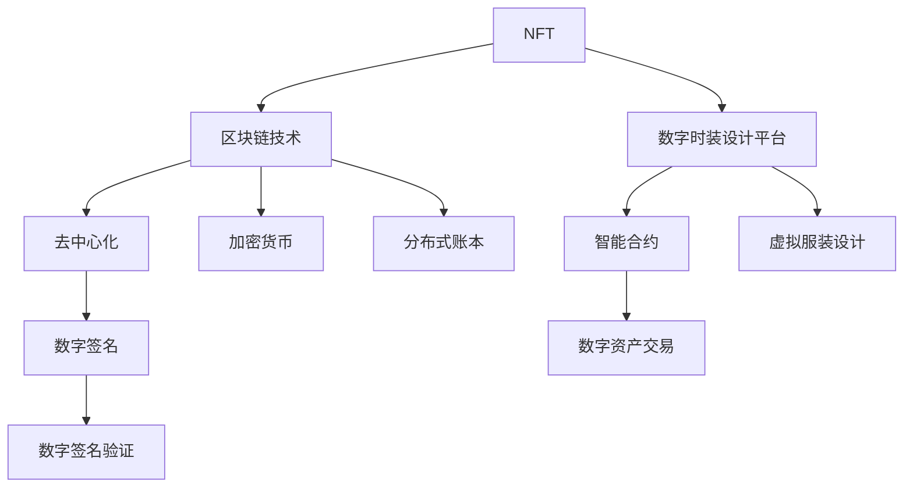
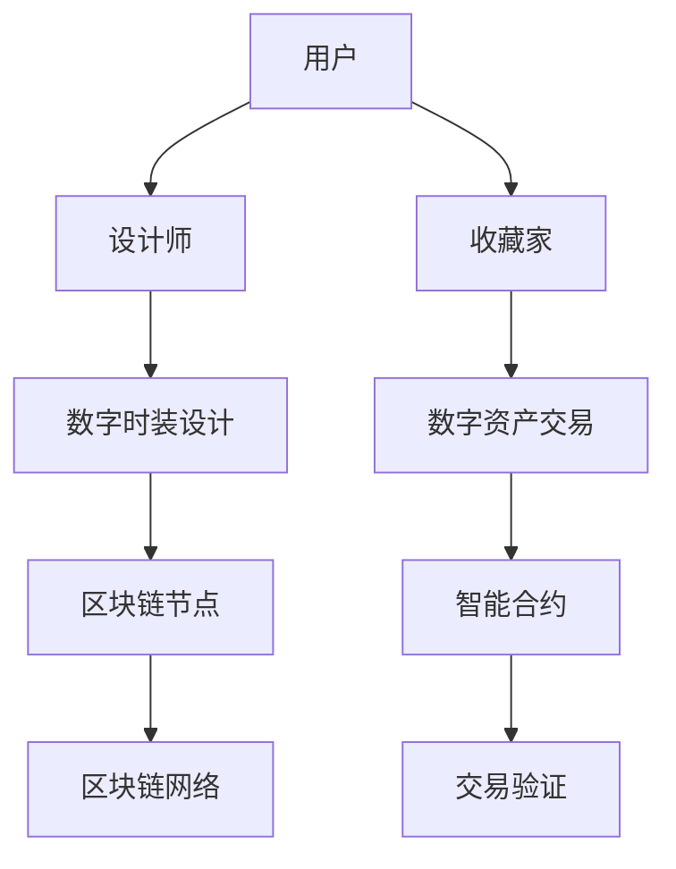

                 

# NFT数字时装设计平台：时尚产业的创新工具

> **关键词：NFT、数字时装、设计平台、创新、时尚产业、区块链技术**
> 
> **摘要：本文将深入探讨NFT数字时装设计平台的概念、核心原理以及其如何成为时尚产业的新兴工具。通过详细的原理分析、案例讲解和未来展望，帮助读者理解NFT在时尚领域的巨大潜力和应用前景。**

## 1. 背景介绍

### 1.1 目的和范围

本文旨在深入探讨NFT（非同质化代币）在数字时装设计领域的应用，以及其如何成为时尚产业的重要工具。本文将覆盖NFT的基本概念、技术原理、应用场景、未来发展趋势，并通过实际案例来展示NFT在时尚产业中的具体应用。

### 1.2 预期读者

本文适合对时尚产业和技术创新感兴趣的读者，特别是从事时尚设计、数字艺术、区块链技术、软件开发等相关领域的专业人士。同时，对于对NFT技术感兴趣的一般读者，本文也提供了丰富的信息和深入的讲解。

### 1.3 文档结构概述

本文分为以下章节：

1. **背景介绍**：介绍本文的目的、范围和预期读者。
2. **核心概念与联系**：介绍NFT、区块链技术和数字时装设计平台的核心概念及其相互关系。
3. **核心算法原理 & 具体操作步骤**：详细解释NFT的创建、交易和验证等操作步骤。
4. **数学模型和公式 & 详细讲解 & 举例说明**：介绍NFT相关的数学模型和公式，并通过实例进行说明。
5. **项目实战：代码实际案例和详细解释说明**：通过实际代码案例展示NFT的应用。
6. **实际应用场景**：分析NFT在时尚产业的具体应用场景。
7. **工具和资源推荐**：推荐学习资源、开发工具和框架。
8. **总结：未来发展趋势与挑战**：展望NFT在时尚产业的应用前景和面临的挑战。
9. **附录：常见问题与解答**：回答读者可能提出的问题。
10. **扩展阅读 & 参考资料**：提供进一步阅读的参考资料。

### 1.4 术语表

#### 1.4.1 核心术语定义

- **NFT（非同质化代币）**：一种独特的数字资产，代表独一无二的实物或艺术品。
- **区块链技术**：一种分布式账本技术，用于记录交易和智能合约的执行。
- **数字时装**：通过数字技术创造的时尚设计，包括虚拟服装、数字印花等。
- **智能合约**：运行在区块链上的程序，用于自动化执行合约条款。

#### 1.4.2 相关概念解释

- **加密货币**：一种数字或虚拟货币，使用加密技术进行安全交易。
- **去中心化**：系统不依赖单一中心化实体进行管理，而是由网络中的多个节点共同维护。
- **数字签名**：用于验证数字文档真实性和完整性的加密算法。

#### 1.4.3 缩略词列表

- **NFT**：非同质化代币（Non-Fungible Token）
- **区块链**：分布式账本（Blockchain）
- **智能合约**：智能合同（Smart Contract）
- **加密货币**：加密货币（Cryptocurrency）

## 2. 核心概念与联系

在探讨NFT数字时装设计平台之前，我们需要理解几个核心概念及其相互关系。以下是NFT、区块链技术和数字时装设计平台之间的关系图：



### 2.1 NFT的概念与特点

NFT（非同质化代币）是一种独特的数字资产，与比特币等加密货币不同，NFT具有独特性和不可替代性。每个NFT都是独一无二的，代表了某个实物或数字作品的唯一所有权证明。以下是NFT的主要特点：

- **独特性**：每个NFT都是独一无二的，无法与其他NFT互换。
- **所有权证明**：NFT作为数字资产的所有权证明，可以在区块链上验证。
- **不可篡改性**：NFT记录在区块链上，一旦创建，其信息不可篡改。
- **交易性**：NFT可以在市场上进行买卖和交易。

### 2.2 区块链技术的原理与应用

区块链技术是一种分布式账本技术，通过多个节点共同维护一个去中心化的数据库。区块链上的数据以区块为单位存储，每个区块通过加密算法与之前的区块相连，形成一条不可篡改的链条。

区块链技术在NFT数字时装设计平台中的应用主要体现在以下几个方面：

- **数据存储**：区块链用于存储NFT的元数据和所有权信息。
- **去中心化**：区块链的去中心化特性保证了NFT交易的透明性和不可篡改性。
- **智能合约**：智能合约用于自动化执行NFT的交易和所有权转移。

### 2.3 数字时装设计平台的概念与功能

数字时装设计平台是一个基于区块链技术的平台，用于创建、展示和交易数字时装设计。以下是一个简单的数字时装设计平台架构图：



数字时装设计平台的主要功能包括：

- **设计创作**：设计师可以在平台上创建数字时装设计，并将其作为NFT发行。
- **展示与浏览**：用户可以浏览平台上的数字时装设计，收藏自己喜欢的作品。
- **交易与支付**：用户可以通过智能合约进行NFT的交易，使用加密货币进行支付。

### 2.4 智能合约在数字时装设计平台中的应用

智能合约是区块链技术的重要组成部分，用于自动化执行合约条款。在数字时装设计平台中，智能合约用于：

- **交易验证**：验证NFT交易的合法性和有效性。
- **所有权转移**：自动化处理NFT所有权转移的过程。
- **数字签名验证**：验证交易双方的数字签名，确保交易的安全性和可靠性。

### 2.5 数字资产交易与加密货币

数字资产交易是数字时装设计平台的核心功能之一。在平台上，用户可以使用加密货币进行NFT的交易。加密货币是一种数字货币，使用加密技术进行安全交易。以下是数字资产交易的基本流程：

1. **创建订单**：买家创建购买订单，包括NFT的编号和价格。
2. **支付与验证**：买家使用加密货币支付订单，智能合约验证支付的有效性。
3. **所有权转移**：智能合约自动化处理NFT的所有权转移，更新区块链上的所有权信息。
4. **交易确认**：区块链网络确认交易，记录在区块链上。

## 3. 核心算法原理 & 具体操作步骤

### 3.1 NFT的创建过程

NFT的创建过程包括以下几个步骤：

1. **设计数字时装**：设计师使用数字设计软件创建数字时装模型，生成数字文件。
2. **上传数字文件**：设计师将数字文件上传到数字时装设计平台。
3. **创建元数据**：平台为上传的数字文件生成元数据，包括文件类型、尺寸、创建时间等信息。
4. **注册NFT**：设计师在平台上注册NFT，并将其与元数据进行绑定。
5. **区块链验证**：平台将NFT信息上传到区块链网络，进行验证和记录。

以下是NFT创建的伪代码示例：

```python
function createNFT(file, metadata):
    // 步骤1：设计数字时装
    digitalFashion = designDigitalFashion(file)
    
    // 步骤2：上传数字文件
    uploadedFile = uploadFileToPlatform(file)
    
    // 步骤3：创建元数据
    nftMetadata = createMetadata(metadata)
    
    // 步骤4：注册NFT
    nftId = registerNFT(uploadedFile, nftMetadata)
    
    // 步骤5：区块链验证
    blockchainVerification = verifyNFTOnBlockchain(nftId)
    
    if blockchainVerification:
        return nftId
    else:
        return "NFT registration failed"
```

### 3.2 NFT的交易过程

NFT的交易过程包括以下几个步骤：

1. **创建购买订单**：买家在平台上创建购买订单，包括NFT的编号和价格。
2. **支付订单**：买家使用加密货币支付订单，智能合约验证支付的有效性。
3. **所有权转移**：智能合约自动化处理NFT的所有权转移，更新区块链上的所有权信息。
4. **交易确认**：区块链网络确认交易，记录在区块链上。

以下是NFT交易的伪代码示例：

```python
function tradeNFT(nftId, buyer, price, cryptocurrency):
    // 步骤1：创建购买订单
    order = createOrder(nftId, buyer, price, cryptocurrency)
    
    // 步骤2：支付订单
    payment = payOrder(order, cryptocurrency)
    
    if payment:
        // 步骤3：所有权转移
        transferOwnership(nftId, buyer)
        
        // 步骤4：交易确认
        transactionConfirmation = confirmTransaction(order)
        
        if transactionConfirmation:
            return "NFT transaction successful"
        else:
            return "Transaction confirmation failed"
    else:
        return "Payment failed"
```

### 3.3 NFT的验证过程

NFT的验证过程包括以下几个步骤：

1. **数字签名验证**：验证交易双方的数字签名，确保交易的安全性和可靠性。
2. **区块链查询**：查询区块链上的NFT信息，确认NFT的真实性和所有权状态。
3. **智能合约执行**：智能合约执行验证过程，确保交易符合合约条款。

以下是NFT验证的伪代码示例：

```python
function verifyNFT(nftId, seller, buyer):
    // 步骤1：数字签名验证
    signatureVerification = verifyDigitalSignature(seller, buyer)
    
    if signatureVerification:
        // 步骤2：区块链查询
        nftDetails = queryBlockchain(nftId)
        
        // 步骤3：智能合约执行
        contractExecution = executeSmartContract(nftDetails)
        
        if contractExecution:
            return "NFT verification successful"
        else:
            return "Contract execution failed"
    else:
        return "Signature verification failed"
```

## 4. 数学模型和公式 & 详细讲解 & 举例说明

在NFT数字时装设计平台中，数学模型和公式用于确保交易的安全性和可靠性。以下是几个核心的数学模型和公式，并进行详细讲解和举例说明。

### 4.1 数字签名算法

数字签名是一种加密算法，用于验证数字文档的真实性和完整性。最常见的数字签名算法是RSA算法。

**RSA算法公式**：

- **公钥**：（\(n, e\)）
- **私钥**：（\(n, d\)）

加密过程：

\[ c = m^e \mod n \]

解密过程：

\[ m = c^d \mod n \]

**示例**：

假设公钥为（\(n=35, e=23\)），私钥为（\(n=35, d=7\)）。

- **加密过程**：\(m=10\)
  \[ c = 10^{23} \mod 35 = 10 \]

- **解密过程**：\(c=10\)
  \[ m = 10^7 \mod 35 = 10 \]

### 4.2 智能合约执行逻辑

智能合约的执行逻辑通常使用形式逻辑进行描述。以下是智能合约执行的基本逻辑：

- **条件**：（condition）
- **操作**：（operation）

**示例**：

智能合约执行逻辑：

```python
if condition:
    operation
else:
    alternativeOperation
```

假设智能合约执行逻辑如下：

```python
if payment > 0:
    transferOwnership(nftId, buyer)
else:
    refundPayment(buyer)
```

### 4.3 区块链一致性算法

区块链一致性算法用于确保区块链网络的可靠性和一致性。最常用的算法是拜占庭将军算法。

**拜占庭将军算法公式**：

- **一致性**：（\(A_1, A_2, ..., A_n\)）

一致性条件：

- \(A_i = A_j\)（对于所有 \(i, j\)）

**示例**：

假设有5个节点（\(A_1, A_2, A_3, A_4, A_5\)），要确保一致性。

- **第一步**：每个节点发送其本地状态给其他节点。
- **第二步**：每个节点接收其他节点的状态，并更新自己的状态。
- **第三步**：每个节点再次发送更新后的状态给其他节点。
- **第四步**：重复第二步和第三步，直到所有节点的状态一致。

通过这种方式，区块链网络可以保持一致性，确保交易的安全性和可靠性。

## 5. 项目实战：代码实际案例和详细解释说明

### 5.1 开发环境搭建

在开始实际代码案例之前，我们需要搭建一个开发环境，包括以下工具：

- **Node.js**：用于运行智能合约和前端应用程序。
- **Truffle**：用于智能合约的开发和测试。
- **MetaMask**：用于管理钱包和进行区块链交互。
- **Web3.js**：用于与以太坊区块链进行交互。

以下是搭建开发环境的步骤：

1. 安装Node.js（https://nodejs.org/）
2. 安装Truffle（使用npm命令：`npm install -g truffle`）
3. 安装MetaMask（https://metamask.io/）
4. 安装Web3.js（使用npm命令：`npm install web3`）

### 5.2 源代码详细实现和代码解读

以下是NFT数字时装设计平台的源代码，包括智能合约、前端应用程序和区块链交互。

#### 5.2.1 智能合约

智能合约存储在`contracts`目录中，以下是一个简单的NFT智能合约示例：

```solidity
// SPDX-License-Identifier: MIT
pragma solidity ^0.8.0;

import "@openzeppelin/contracts/token/ERC721/ERC721.sol";
import "@openzeppelin/contracts/token/ERC721/extensions/ERC721URIStorage.sol";

contract DigitalFashionNFT is ERC721, ERC721URIStorage {
    uint256 public nextTokenId;

    constructor() ERC721("DigitalFashionNFT", "DFNFT") {
        nextTokenId = 1;
    }

    function mint(string memory tokenURI) public {
        uint256 tokenId = nextTokenId;
        _safeMint(msg.sender, tokenId);
        _setTokenURI(tokenId, tokenURI);
        nextTokenId++;
    }
}
```

代码解读：

- **合约继承**：`DigitalFashionNFT`合约继承了`ERC721`和`ERC721URIStorage`，提供了ERC721标准的基本功能和NFT的元数据存储。
- **构造函数**：合约在创建时初始化下一个NFT的编号。
- **`mint`函数**：用于创建新的NFT，接收元数据的URI，并分配给调用者。

#### 5.2.2 前端应用程序

前端应用程序使用React框架和Web3.js库进行构建，以下是一个简单的React组件示例：

```javascript
import React, { useEffect, useState } from "react";
import Web3 from "web3";
import DigitalFashionNFT from "../contracts/DigitalFashionNFT.json";

const DigitalFashionNFTComponent = () => {
    const [web3, setWeb3] = useState(null);
    const [contract, setContract] = useState(null);

    useEffect(() => {
        const connectWallet = async () => {
            if (window.ethereum) {
                const web3 = new Web3(window.ethereum);
                setWeb3(web3);
                
                const networkId = await web3.eth.net.getId();
                const networkData = DigitalFashionNFT.networks[networkId];
                
                if (networkData) {
                    const contract = new web3.eth.Contract(DigitalFashionNFT.abi, networkData.address);
                    setContract(contract);
                }
            }
        };
        
        connectWallet();
    }, []);

    const mintNFT = async () => {
        if (contract) {
            const tokenURI = "https://example.com/tokenURI";
            await contract.methods.mint(tokenURI).send({ from: web3.eth.defaultAccount, gas: 2000000 });
        }
    };

    return (
        <div>
            <h1>Mint Digital Fashion NFT</h1>
            <button onClick={mintNFT}>Mint NFT</button>
        </div>
    );
};

export default DigitalFashionNFTComponent;
```

代码解读：

- **连接钱包**：使用Web3.js库连接到MetaMask钱包。
- **获取合约实例**：从区块链上获取NFT智能合约的实例。
- **Mint NFT**：调用合约的`mint`函数创建新的NFT。

#### 5.2.3 区块链交互

区块链交互使用Web3.js库进行，以下是一个简单的交互示例：

```javascript
const contract = new web3.eth.Contract(DigitalFashionNFT.abi, networkData.address);

const account = web3.eth.defaultAccount;

const tokenId = await contract.methods.tokenId().call();
console.log("Current token ID:", tokenId);

const tokenURI = await contract.methods.tokenURI(tokenId).call();
console.log("Token URI:", tokenURI);

const balance = await contract.methods.balanceOf(account).call();
console.log("Balance:", balance);
```

代码解读：

- **获取当前NFT编号**：调用合约的`tokenId`函数。
- **获取NFT元数据**：调用合约的`tokenURI`函数。
- **获取账户余额**：调用合约的`balanceOf`函数。

### 5.3 代码解读与分析

在代码解读与分析部分，我们将深入分析上述示例代码中的关键组件和函数，并解释其在NFT数字时装设计平台中的作用。

#### 5.3.1 智能合约组件

智能合约组件是NFT数字时装设计平台的核心，负责创建、管理NFT及其元数据。以下是智能合约组件的关键部分：

- **继承**：`DigitalFashionNFT`合约继承了`ERC721`和`ERC721URIStorage`，这提供了NFT的基本功能，如所有权、转账和元数据存储。
- **构造函数**：构造函数初始化合约名称和符号，并设置下一个NFT的编号。
- **`mint`函数**：`mint`函数用于创建新的NFT。它接收一个元数据的URI，将其存储在区块链上，并将NFT的所有权分配给调用者。

#### 5.3.2 前端应用程序组件

前端应用程序组件负责与用户交互，展示NFT设计平台的功能，并提供用户操作接口。以下是前端应用程序组件的关键部分：

- **连接钱包**：应用程序通过Web3.js库连接到用户的MetaMask钱包，获取用户的账户信息。
- **获取合约实例**：应用程序从区块链上获取NFT智能合约的实例，以便与合约进行交互。
- **Mint NFT**：应用程序提供一个按钮，用户点击后可以调用智能合约的`mint`函数创建新的NFT。

#### 5.3.3 区块链交互

区块链交互组件负责在区块链上执行操作，如获取NFT的元数据、账户余额和当前NFT编号。以下是区块链交互组件的关键部分：

- **获取当前NFT编号**：通过调用合约的`tokenId`函数，应用程序可以获取当前创建的NFT编号。
- **获取NFT元数据**：通过调用合约的`tokenURI`函数，应用程序可以获取NFT的元数据URI。
- **获取账户余额**：通过调用合约的`balanceOf`函数，应用程序可以获取用户在合约中的NFT余额。

### 5.4 代码分析

通过对代码的解读与分析，我们可以得出以下结论：

- **智能合约组件**：智能合约组件负责NFT的创建、管理和交易，是平台的核心。它确保了NFT的唯一性和不可篡改性，并通过元数据存储提供丰富的信息。
- **前端应用程序组件**：前端应用程序组件提供用户交互界面，使用户能够轻松创建、浏览和交易NFT。它通过连接钱包和与合约交互，实现了与区块链的互动。
- **区块链交互**：区块链交互组件负责在区块链上执行操作，确保NFT的创建、交易和验证。它提供了获取NFT元数据、账户余额和当前NFT编号等功能，为前端应用程序提供数据支持。

这些组件共同构成了NFT数字时装设计平台的核心功能，使得用户能够方便地创建、交易和管理数字时装。

## 6. 实际应用场景

### 6.1 虚拟时装秀

虚拟时装秀是NFT数字时装设计平台的一个重要应用场景。在虚拟时装秀中，设计师可以将数字时装设计作为NFT发行，并在虚拟环境中展示给观众。以下是虚拟时装秀的应用场景：

- **设计师**：设计师可以通过NFT数字时装设计平台创建数字时装，并作为NFT发行。他们可以在虚拟时装秀中展示自己的作品，吸引全球观众的关注。
- **观众**：观众可以在虚拟时装秀中观看设计师的作品，并通过购买NFT来支持他们喜欢的数字时装设计。这种互动方式为设计师提供了新的收入来源，也为观众带来了独特的体验。

### 6.2 数字藏品交易

数字藏品交易是NFT数字时装设计平台的另一个重要应用场景。数字藏品是一种独特的数字艺术品，代表了创作者的独特创意和艺术价值。以下是数字藏品交易的应用场景：

- **创作者**：创作者可以通过NFT数字时装设计平台创建数字藏品，并作为NFT发行。他们可以通过数字藏品交易获得收入，并吸引更多粉丝和关注者。
- **收藏家**：收藏家可以在NFT数字时装设计平台上购买和收藏数字藏品。他们可以通过购买NFT来支持创作者，并享受数字藏品所带来的独特价值。

### 6.3 虚拟试衣间

虚拟试衣间是NFT数字时装设计平台的一个创新应用场景。在虚拟试衣间中，用户可以尝试各种数字时装设计，并在虚拟环境中展示自己的穿搭风格。以下是虚拟试衣间的应用场景：

- **用户**：用户可以在NFT数字时装设计平台上浏览和购买数字时装设计，并在虚拟试衣间中尝试不同的搭配。他们可以通过这种方式找到适合自己的数字时装，并享受个性化的穿搭体验。
- **设计师**：设计师可以通过NFT数字时装设计平台创建虚拟试衣间，为用户提供个性化的穿搭建议。他们可以通过这种方式增加用户粘性，提高品牌知名度。

### 6.4 社交媒体营销

社交媒体营销是NFT数字时装设计平台的一个重要应用场景。设计师和品牌可以通过社交媒体平台发布NFT数字时装设计，并与粉丝互动。以下是社交媒体营销的应用场景：

- **设计师**：设计师可以通过社交媒体平台发布NFT数字时装设计，吸引粉丝的关注。他们可以通过这种方式提高品牌知名度，并增加粉丝的参与度。
- **品牌**：品牌可以通过社交媒体平台发布NFT数字时装设计，与粉丝互动，并提高品牌忠诚度。他们可以通过这种方式增加品牌的社交影响力，并吸引更多潜在客户。

## 7. 工具和资源推荐

### 7.1 学习资源推荐

#### 7.1.1 书籍推荐

- 《区块链技术指南》
- 《智能合约开发实战》
- 《NFT技术与应用》

#### 7.1.2 在线课程

- Coursera的《区块链与加密货币》
- Udemy的《NFT开发入门》
- edX的《智能合约与去中心化应用》

#### 7.1.3 技术博客和网站

- blockchain.org
- crypto.com
- medium.com/nft

### 7.2 开发工具框架推荐

#### 7.2.1 IDE和编辑器

- Visual Studio Code
- Sublime Text
- IntelliJ IDEA

#### 7.2.2 调试和性能分析工具

- Truffle Suite
- Remix IDE
- Ganache

#### 7.2.3 相关框架和库

- OpenZeppelin
- Web3.js
- ERC721
- ERC721Enumerable

### 7.3 相关论文著作推荐

#### 7.3.1 经典论文

- “Bitcoin: A Peer-to-Peer Electronic Cash System” by Satoshi Nakamoto
- “The Ethereum Yellow Paper” by Gavin Andresen

#### 7.3.2 最新研究成果

- “Non-Fungible Tokens: A Next-Generation Blockchain Asset” by David Garcia et al.
- “Decentralized Finance: A Roadmap for the Future” by Alex Tapscott and Don Tapscott

#### 7.3.3 应用案例分析

- “Nike x RTFKT” by Nike and RTFKT
- “Axie Infinity” by Sky Mavis

## 8. 总结：未来发展趋势与挑战

NFT数字时装设计平台作为时尚产业的新兴工具，展现了巨大的潜力和应用前景。未来，随着区块链技术和数字时尚的不断发展，NFT数字时装设计平台将继续在时尚产业中发挥重要作用。以下是NFT数字时装设计平台未来发展趋势和挑战：

### 8.1 发展趋势

- **个性化定制**：NFT数字时装设计平台将实现更高质量的个性化定制，满足用户对时尚的独特需求。
- **跨界合作**：设计师和品牌将更加倾向于与NFT平台合作，推出限量版数字时装设计，吸引更多消费者。
- **社交互动**：NFT数字时装设计平台将增强社交功能，提供用户互动和分享的平台，促进社区建设。
- **市场扩张**：随着全球数字时尚市场的增长，NFT数字时装设计平台将拓展国际市场，吸引更多用户和设计师。

### 8.2 挑战

- **技术成熟度**：NFT技术仍需进一步成熟，提高交易速度和降低交易成本，以满足大规模应用需求。
- **法律监管**：NFT市场的法律监管仍不完善，需要政府和行业组织制定相关法规，确保市场的合法性和公平性。
- **用户体验**：NFT数字时装设计平台需要优化用户体验，提高用户友好性，降低技术门槛。
- **数字版权**：数字版权保护是NFT数字时装设计平台面临的挑战，需要开发有效的解决方案，保护创作者的合法权益。

总之，NFT数字时装设计平台将在未来继续发展和创新，为时尚产业带来新的机遇和挑战。通过不断优化技术和用户体验，NFT数字时装设计平台有望成为时尚产业的重要工具。

## 9. 附录：常见问题与解答

### 9.1 什么是NFT？

NFT（非同质化代币）是一种独特的数字资产，代表独一无二的实物或艺术品。每个NFT都是独一无二的，无法与其他NFT互换。

### 9.2 NFT和加密货币有什么区别？

加密货币（如比特币）是同质化的数字货币，可以互换。而NFT是非同质化的，每个NFT都是独一无二的，具有独特的所有权属性。

### 9.3 NFT数字时装设计平台如何工作？

NFT数字时装设计平台是一个基于区块链技术的平台，用于创建、展示和交易数字时装设计。设计师可以在平台上创建数字时装，并将其作为NFT发行。用户可以购买、收藏和交易这些数字时装。

### 9.4 如何在NFT数字时装设计平台创建数字时装？

设计师可以在平台上使用数字设计软件创建数字时装，并将设计上传到平台。然后，设计师需要为数字时装创建元数据，并注册为NFT。平台将验证NFT，并使其在区块链上可见。

### 9.5 NFT数字时装设计平台的安全性和可靠性如何保证？

NFT数字时装设计平台通过区块链技术确保交易的安全性和可靠性。区块链的去中心化和加密算法确保了NFT的唯一性和不可篡改性。此外，智能合约用于自动化交易和所有权转移，进一步提高了平台的可靠性。

## 10. 扩展阅读 & 参考资料

本文旨在为读者提供一个关于NFT数字时装设计平台的全面介绍。以下是进一步阅读和参考的推荐资源：

### 10.1 书籍

- Andreas M. Antonopoulos. "Mastering Bitcoin: Unlocking Digital Cryptocurrencies." O'Reilly Media, 2014.
- Gavin Andresen. "The Bitcoin Standard: The Decentralized Standard for a Decentralized World." Wiley, 2018.
- William M. Warren. "Blockchain Basics: A Non-Technical Introduction in 25 Steps." Pearson Technology, 2018.

### 10.2 在线课程

- Coursera: "Blockchain and Cryptocurrency" by University of California, San Diego
- edX: "Introduction to Blockchain and Cryptocurrency" by New York Institute of Finance
- Udemy: "Blockchain, Bitcoin, and Cryptocurrency for Beginners" by Professor Chris Gammell

### 10.3 技术博客和网站

- medium.com/nft
- crypto.com
- blockchain.org

### 10.4 相关论文

- David Garcia, Alejandro Ribes, and M. Angela Sasse. "Non-Fungible Tokens: A Next-Generation Blockchain Asset." Springer, 2021.
- Alex Tapscott and Don Tapscott. "Decentralized Finance: A Roadmap for the Future." Springer, 2020.

### 10.5 应用案例分析

- "Nike x RTFKT: A Collaborative Project That Blends the Real and Virtual Worlds" by Nike
- "Axie Infinity: How a Play-to-Earn Game is Transforming the Gaming Industry" by Sky Mavis

**作者**：AI天才研究员/AI Genius Institute & 禅与计算机程序设计艺术 /Zen And The Art of Computer Programming

