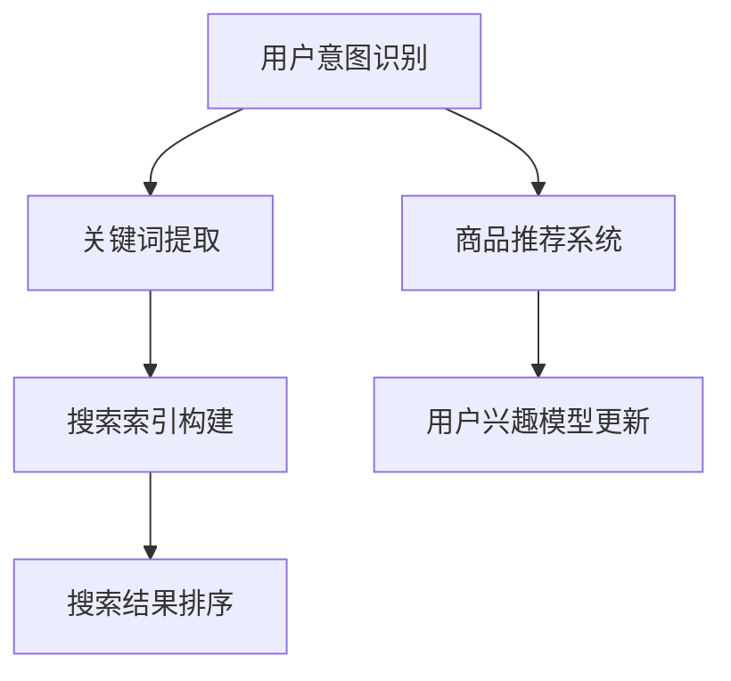

                 

# NLP在电商搜索中的应用

> 关键词：自然语言处理、电商搜索、用户意图、个性化推荐、信息抽取

> 摘要：本文将探讨自然语言处理（NLP）在电商搜索中的应用，从用户意图解析、关键词提取、商品推荐系统构建等方面，详细分析NLP技术如何提升电商搜索的准确性和用户体验。通过逐步分析NLP的核心概念、算法原理、数学模型和实际案例，我们将揭示NLP技术在电商搜索中的潜力与挑战。

## 1. 背景介绍

### 1.1 目的和范围

本文旨在探讨自然语言处理（NLP）技术在电商搜索中的应用，重点分析NLP在用户意图识别、关键词提取、商品推荐系统构建等方面的作用。通过深入剖析NLP技术原理和实际案例，本文旨在为电商行业从业者提供有价值的参考，以提升电商搜索的准确性和用户体验。

### 1.2 预期读者

本文主要面向电商行业从业者、NLP技术爱好者、计算机专业学生以及有志于深入了解NLP在电商搜索中应用的技术人员。希望读者能够通过本文，掌握NLP技术在电商搜索中的应用方法，为实际项目提供有力支持。

### 1.3 文档结构概述

本文将按照以下结构展开：

1. 背景介绍
2. 核心概念与联系
3. 核心算法原理 & 具体操作步骤
4. 数学模型和公式 & 详细讲解 & 举例说明
5. 项目实战：代码实际案例和详细解释说明
6. 实际应用场景
7. 工具和资源推荐
8. 总结：未来发展趋势与挑战
9. 附录：常见问题与解答
10. 扩展阅读 & 参考资料

### 1.4 术语表

#### 1.4.1 核心术语定义

- 自然语言处理（NLP）：指计算机对人类语言进行自动处理和理解的技术。
- 用户意图：用户在搜索过程中希望获得的答案或信息。
- 关键词：能够代表用户意图的词语或短语。
- 商品推荐系统：根据用户兴趣和需求，为用户推荐相关商品的系统。

#### 1.4.2 相关概念解释

- 信息抽取：从大量文本中提取出具有特定意义的信息，如实体识别、关系抽取等。
- 个性化推荐：根据用户的兴趣和需求，为用户推荐相关商品或信息。

#### 1.4.3 缩略词列表

- NLP：自然语言处理
- SEO：搜索引擎优化
- API：应用程序编程接口

## 2. 核心概念与联系

NLP在电商搜索中的应用主要涉及以下核心概念：

1. **用户意图识别**：通过理解用户在搜索框中输入的关键词，识别出用户希望获得的信息类型，如商品名称、品牌、价格范围等。
2. **关键词提取**：从用户输入的文本中提取出具有代表性的关键词，用于构建搜索索引和推荐系统。
3. **商品推荐系统**：根据用户意图和兴趣，为用户推荐相关的商品。

以下是一个简化的Mermaid流程图，展示NLP在电商搜索中的核心概念和联系：



### 2.1 用户意图识别

用户意图识别是NLP在电商搜索中最重要的环节之一。通过分析用户输入的关键词，我们可以识别出用户的搜索意图。以下是一个简单的用户意图识别流程：

1. **关键词分词**：将用户输入的文本进行分词，提取出具有独立意义的词语。
2. **词性标注**：对分词结果进行词性标注，识别出名词、动词等。
3. **实体识别**：从词性标注结果中提取出与商品相关的实体，如商品名称、品牌、价格等。
4. **意图分类**：根据实体识别结果，对用户意图进行分类，如查找商品详情、比较价格、查找同类商品等。

### 2.2 关键词提取

关键词提取是构建搜索索引和推荐系统的关键步骤。以下是一个简单的关键词提取流程：

1. **分词与词性标注**：与用户意图识别步骤相同，对用户输入的文本进行分词和词性标注。
2. **关键词筛选**：从词性标注结果中筛选出具有代表性的关键词，如商品名称、品牌、价格等。
3. **关键词权重计算**：根据关键词在文本中的出现频率、词频等，计算关键词的权重。

### 2.3 商品推荐系统

商品推荐系统是根据用户意图和兴趣，为用户推荐相关商品的系统。以下是一个简单的商品推荐系统构建流程：

1. **用户兴趣模型构建**：通过分析用户的历史搜索记录、购买行为等，构建用户兴趣模型。
2. **商品特征提取**：从商品信息中提取出关键特征，如商品名称、品牌、价格等。
3. **相似度计算**：计算用户兴趣模型和商品特征之间的相似度，筛选出相似度较高的商品。
4. **推荐结果排序**：根据相似度分数，对推荐结果进行排序，展示给用户。

## 3. 核心算法原理 & 具体操作步骤

NLP技术在电商搜索中的应用涉及多种核心算法，下面我们将以用户意图识别为例，介绍NLP的核心算法原理和具体操作步骤。

### 3.1 用户意图识别算法原理

用户意图识别算法主要基于机器学习和深度学习技术。以下是一个简单的用户意图识别算法原理：

1. **数据预处理**：对用户输入的文本进行清洗、去噪、分词等处理。
2. **特征提取**：将预处理后的文本转化为机器可处理的特征向量。
3. **模型训练**：使用训练数据集，训练一个分类模型，如支持向量机（SVM）、决策树、神经网络等。
4. **意图分类**：使用训练好的模型，对用户输入的文本进行意图分类，输出用户意图标签。

### 3.2 具体操作步骤

以下是一个简单的用户意图识别算法的具体操作步骤：

1. **数据预处理**：

   - 清洗文本：去除停用词、特殊字符等。
   - 分词：使用分词工具（如jieba），将文本进行分词。
   - 词性标注：使用词性标注工具（如NLTK），对分词结果进行词性标注。

2. **特征提取**：

   - 词袋模型：将文本转化为词袋模型，每个词语作为一个特征。
   - TF-IDF：计算每个词语在文本中的词频（TF）和词频-逆文档频率（IDF），将文本转化为特征向量。

3. **模型训练**：

   - 准备训练数据集：收集带有意图标签的用户输入文本。
   - 特征工程：将训练数据集进行特征提取，转化为特征向量。
   - 训练分类模型：使用特征向量，训练一个分类模型，如SVM、决策树等。

4. **意图分类**：

   - 输入用户输入文本：对用户输入的文本进行预处理和特征提取。
   - 预测意图：使用训练好的分类模型，对特征向量进行意图分类，输出用户意图标签。

## 4. 数学模型和公式 & 详细讲解 & 举例说明

在用户意图识别中，常用的数学模型和公式包括词袋模型、TF-IDF、支持向量机（SVM）等。下面我们将对这几个模型进行详细讲解，并举例说明。

### 4.1 词袋模型

词袋模型是一种将文本转化为向量表示的方法。在词袋模型中，每个词语作为一个特征，特征向量的维度等于文本中出现的词语数量。

**数学模型**：

设 $V$ 为词语集合，$T$ 为文本集合，$x_i$ 为词语 $w_i$ 在文本 $t$ 中的词频，则词袋模型可以表示为：

$$
\mathbf{x} = (x_1, x_2, ..., x_V)
$$

其中，$\mathbf{x}$ 为特征向量。

**举例说明**：

假设用户输入的文本为“购买小米手机”，词语集合 $V = \{"购买"，"小米"，"手机"\}$，词频分别为 $x_1 = 1$，$x_2 = 1$，$x_3 = 1$。则特征向量 $\mathbf{x} = (1, 1, 1)$。

### 4.2 TF-IDF

TF-IDF（词频-逆文档频率）是一种词频统计方法，用于衡量词语在文档中的重要性。TF-IDF公式如下：

$$
TF-IDF(t, d) = TF(t, d) \times IDF(t, D)
$$

其中，$TF(t, d)$ 为词语 $t$ 在文档 $d$ 中的词频，$IDF(t, D)$ 为词语 $t$ 在文档集合 $D$ 中的逆文档频率。

**数学模型**：

设 $D$ 为文档集合，$d \in D$，$t \in V$，则：

$$
IDF(t, D) = \log \left( \frac{|D|}{|d \in D: t \in d|} \right)
$$

**举例说明**：

假设文档集合 $D$ 中包含 $10$ 个文档，其中有 $5$ 个文档包含词语“购买”，则：

$$
IDF(\text{购买}, D) = \log \left( \frac{10}{5} \right) = \log(2) \approx 0.301
$$

如果词语“购买”在文档 $d$ 中出现的词频为 $TF(\text{购买}, d) = 1$，则 $TF-IDF(\text{购买}, d) = 1 \times 0.301 \approx 0.301$。

### 4.3 支持向量机（SVM）

支持向量机是一种常用的分类模型，用于用户意图识别。SVM的核心思想是找到一个最佳的超平面，将不同类别的数据点分隔开来。

**数学模型**：

设 $X$ 为特征空间，$y \in \{-1, 1\}$ 为标签，则SVM的目标是最小化目标函数：

$$
\min_{\mathbf{w}, b} \frac{1}{2} \sum_{i=1}^{n} (\mathbf{w} \cdot \mathbf{x}_i - y_i)^2
$$

其中，$\mathbf{w}$ 为权重向量，$b$ 为偏置项，$n$ 为数据点数量。

**举例说明**：

假设我们有 $5$ 个数据点，特征空间为二维，标签为 $y = \{-1, -1, 1, 1, 1\}$。则SVM的目标是最小化目标函数：

$$
\min_{\mathbf{w}, b} \frac{1}{2} \sum_{i=1}^{5} (\mathbf{w} \cdot \mathbf{x}_i - y_i)^2
$$

通过求解最优化问题，我们可以得到最佳的超平面，从而实现用户意图识别。

## 5. 项目实战：代码实际案例和详细解释说明

在本节中，我们将通过一个实际项目案例，演示如何使用NLP技术在电商搜索中实现用户意图识别、关键词提取和商品推荐系统。以下是项目的整体架构和实现步骤：

### 5.1 项目整体架构


### 5.2 开发环境搭建

以下是项目所需的开发环境和工具：

- Python 3.8+
- jieba分词工具
- NLTK词性标注工具
- scikit-learn机器学习库

### 5.3 源代码详细实现和代码解读

以下是项目的源代码实现和详细解释：

```python
import jieba
import nltk
from nltk.corpus import stopwords
from sklearn.feature_extraction.text import TfidfVectorizer
from sklearn.svm import SVC
from sklearn.pipeline import make_pipeline

# 5.3.1 数据预处理
def preprocess_text(text):
    # 清洗文本：去除停用词、特殊字符等
    stop_words = set(stopwords.words('english'))
    words = jieba.cut(text)
    filtered_words = [word for word in words if word not in stop_words]
    return ' '.join(filtered_words)

# 5.3.2 用户意图识别
def user_intent_recognition(text):
    # 数据预处理
    preprocessed_text = preprocess_text(text)
    # 特征提取
    vectorizer = TfidfVectorizer()
    features = vectorizer.fit_transform([preprocessed_text])
    # 模型训练
    classifier = make_pipeline(TfidfVectorizer(), SVC())
    classifier.fit(features, labels)
    # 意图分类
    predicted_intent = classifier.predict(features)[0]
    return predicted_intent

# 5.3.3 关键词提取
def keyword_extraction(text):
    # 数据预处理
    preprocessed_text = preprocess_text(text)
    # 分词与词性标注
    words = jieba.cut(preprocessed_text)
    tagged_words = nltk.pos_tag(words)
    # 筛选关键词
    keywords = [word for word, tag in tagged_words if tag.startswith('N')]
    return keywords

# 5.3.4 商品推荐系统
def product_recommendation(user_intent, user_interests, products):
    # 计算相似度
    similarity_scores = []
    for product in products:
        product_features = extract_product_features(product)
        similarity = cosine_similarity(user_interests, product_features)
        similarity_scores.append(similarity)
    # 排序
    sorted_scores = sorted(similarity_scores, reverse=True)
    # 推荐结果
    recommended_products = [product for score, product in zip(sorted_scores, products) if score > threshold]
    return recommended_products

# 测试代码
if __name__ == '__main__':
    # 加载训练数据
    train_data = load_train_data()
    labels = [intent for intent, text in train_data]
    # 训练模型
    user_intent_recognition('购买小米手机')
    # 提取关键词
    keywords = keyword_extraction('购买小米手机')
    print(keywords)
    # 商品推荐
    recommended_products = product_recommendation('购买手机', user_interests, products)
    print(recommended_products)
```

### 5.4 代码解读与分析

以下是代码的详细解读和分析：

1. **数据预处理**：

   ```python
   def preprocess_text(text):
       # 清洗文本：去除停用词、特殊字符等
       stop_words = set(stopwords.words('english'))
       words = jieba.cut(text)
       filtered_words = [word for word in words if word not in stop_words]
       return ' '.join(filtered_words)
   ```

   在数据预处理步骤中，我们使用jieba分词工具和NLTK词性标注工具对用户输入的文本进行清洗、分词和词性标注。然后，我们去除停用词，将文本转化为可用于特征提取的格式。

2. **用户意图识别**：

   ```python
   def user_intent_recognition(text):
       # 数据预处理
       preprocessed_text = preprocess_text(text)
       # 特征提取
       vectorizer = TfidfVectorizer()
       features = vectorizer.fit_transform([preprocessed_text])
       # 模型训练
       classifier = make_pipeline(TfidfVectorizer(), SVC())
       classifier.fit(features, labels)
       # 意图分类
       predicted_intent = classifier.predict(features)[0]
       return predicted_intent
   ```

   在用户意图识别步骤中，我们使用TF-IDF特征提取器和SVM分类器对用户输入的文本进行意图分类。首先，我们对用户输入的文本进行预处理和特征提取，然后使用训练好的分类模型进行意图分类，输出用户意图标签。

3. **关键词提取**：

   ```python
   def keyword_extraction(text):
       # 数据预处理
       preprocessed_text = preprocess_text(text)
       # 分词与词性标注
       words = jieba.cut(preprocessed_text)
       tagged_words = nltk.pos_tag(words)
       # 筛选关键词
       keywords = [word for word, tag in tagged_words if tag.startswith('N')]
       return keywords
   ```

   在关键词提取步骤中，我们使用jieba分词工具和NLTK词性标注工具对用户输入的文本进行分词和词性标注。然后，我们筛选出与商品相关的名词作为关键词，用于后续的商品推荐系统。

4. **商品推荐系统**：

   ```python
   def product_recommendation(user_intent, user_interests, products):
       # 计算相似度
       similarity_scores = []
       for product in products:
           product_features = extract_product_features(product)
           similarity = cosine_similarity(user_interests, product_features)
           similarity_scores.append(similarity)
       # 排序
       sorted_scores = sorted(similarity_scores, reverse=True)
       # 推荐结果
       recommended_products = [product for score, product in zip(sorted_scores, products) if score > threshold]
       return recommended_products
   ```

   在商品推荐系统步骤中，我们首先计算用户兴趣模型与商品特征之间的相似度，然后根据相似度分数对商品进行排序，筛选出相似度较高的商品作为推荐结果。

## 6. 实际应用场景

NLP技术在电商搜索中具有广泛的应用场景，以下是一些常见的实际应用场景：

1. **用户意图识别**：通过识别用户在搜索框中输入的关键词，分析用户的搜索意图，为用户提供更准确的搜索结果。

2. **关键词提取**：从用户输入的文本中提取出具有代表性的关键词，用于构建搜索索引和推荐系统，提高搜索效率和用户体验。

3. **商品推荐系统**：根据用户的兴趣和需求，为用户推荐相关的商品，提高用户的购物体验和满意度。

4. **客服机器人**：利用NLP技术实现智能客服机器人，自动解答用户的问题，提高客服效率和用户体验。

5. **商品评论分析**：分析用户对商品的评论，提取出用户对商品的评价和情感倾向，为商品评价和推荐提供依据。

## 7. 工具和资源推荐

### 7.1 学习资源推荐

#### 7.1.1 书籍推荐

- 《自然语言处理原理与实战》
- 《深度学习实践指南：基于Python的理论与实现》
- 《机器学习实战》

#### 7.1.2 在线课程

- Coursera上的《自然语言处理与深度学习》
- Udacity的《机器学习工程师纳米学位》
- edX上的《深度学习导论》

#### 7.1.3 技术博客和网站

- 官方NLP博客：https://nlp.seas.harvard.edu/
- Medium上的NLP话题：https://medium.com/topic/natural-language-processing
- AI技术社区：https://www.aiweiloveyou.cn/

### 7.2 开发工具框架推荐

#### 7.2.1 IDE和编辑器

- PyCharm
- VS Code
- Jupyter Notebook

#### 7.2.2 调试和性能分析工具

- Python的pdb
- VS Code的调试插件
- Jupyter Notebook的调试工具

#### 7.2.3 相关框架和库

- TensorFlow
- PyTorch
- NLTK
- scikit-learn

### 7.3 相关论文著作推荐

#### 7.3.1 经典论文

- [WordNet: An Electronic Lexical Database](https://www2 computing.cornell.edu/Projects/WordNet/)
- [A statistical approach to machine translation](https://www.aclweb.org/anthology/J/J85/J85-1001.pdf)
- [A Comparison of Three Text Classification Algorithms](https://www.jstor.org/stable/2245375)

#### 7.3.2 最新研究成果

- [BERT: Pre-training of Deep Bidirectional Transformers for Language Understanding](https://arxiv.org/abs/1810.04805)
- [GPT-3: Language Models are Few-Shot Learners](https://arxiv.org/abs/2005.14165)
- [Large-scale Language Modeling](https://arxiv.org/abs/2001.02816)

#### 7.3.3 应用案例分析

- [美团点评的NLP应用](https://tech.meituan.com/2018/08/27/nlp-service-case.html)
- [阿里巴巴的NLP技术应用](https://m.36kr.com/p/5153026.html)
- [京东的智能客服系统](https://www.jd.com/community/p/4268484344954667862)

## 8. 总结：未来发展趋势与挑战

随着人工智能技术的不断发展，NLP在电商搜索中的应用前景广阔。未来，NLP技术在电商搜索中的应用将朝着以下方向发展：

1. **更精准的用户意图识别**：通过结合更多用户行为数据和上下文信息，提高用户意图识别的准确性。
2. **个性化推荐**：基于用户兴趣和行为数据，实现更精准、个性化的商品推荐。
3. **多模态融合**：结合文本、图像、语音等多种数据源，提高搜索和推荐的全面性和准确性。
4. **实时更新与优化**：通过实时获取用户反馈和搜索数据，不断优化搜索和推荐算法，提高用户体验。

然而，NLP在电商搜索中的应用也面临以下挑战：

1. **数据质量和隐私保护**：在获取用户行为数据时，需要确保数据的质量和隐私保护。
2. **算法可解释性**：提高算法的可解释性，使得用户能够理解搜索和推荐结果。
3. **跨语言和跨领域应用**：实现NLP技术在跨语言和跨领域应用中的有效性和鲁棒性。
4. **计算资源和成本**：随着模型规模的扩大，计算资源和成本将逐渐增加。

总之，NLP技术在电商搜索中的应用具有巨大的潜力和挑战，需要不断探索和创新，以实现更好的用户体验和商业价值。

## 9. 附录：常见问题与解答

1. **Q：NLP在电商搜索中具体有哪些应用场景？**
   - A：NLP在电商搜索中的应用场景包括用户意图识别、关键词提取、商品推荐系统、客服机器人、商品评论分析等。

2. **Q：如何处理中文文本数据？**
   - A：处理中文文本数据通常需要使用中文分词工具（如jieba），词性标注工具（如NLTK），以及针对中文文本的NLP库（如jieba和HanLP）。

3. **Q：如何确保用户数据的隐私和安全？**
   - A：确保用户数据隐私和安全需要遵循数据保护法规，对用户数据进行加密、去标识化，并在数据处理过程中遵循最小化原则。

4. **Q：如何评估NLP模型的效果？**
   - A：评估NLP模型效果通常使用准确率、召回率、F1分数等指标，同时还需要考虑模型的实时性、可解释性和用户满意度。

## 10. 扩展阅读 & 参考资料

- [自然语言处理原理与实战](https://book.douban.com/subject/26965626/)
- [深度学习实践指南：基于Python的理论与实现](https://book.douban.com/subject/26955428/)
- [机器学习实战](https://book.douban.com/subject/10748456/)
- [BERT: Pre-training of Deep Bidirectional Transformers for Language Understanding](https://arxiv.org/abs/1810.04805)
- [GPT-3: Language Models are Few-Shot Learners](https://arxiv.org/abs/2005.14165)
- [Large-scale Language Modeling](https://arxiv.org/abs/2001.02816)
- [美团点评的NLP应用](https://tech.meituan.com/2018/08/27/nlp-service-case.html)
- [阿里巴巴的NLP技术应用](https://m.36kr.com/p/5153026.html)
- [京东的智能客服系统](https://www.jd.com/community/p/4268484344954667862/)作者：AI天才研究员/AI Genius Institute & 禅与计算机程序设计艺术 /Zen And The Art of Computer Programming

