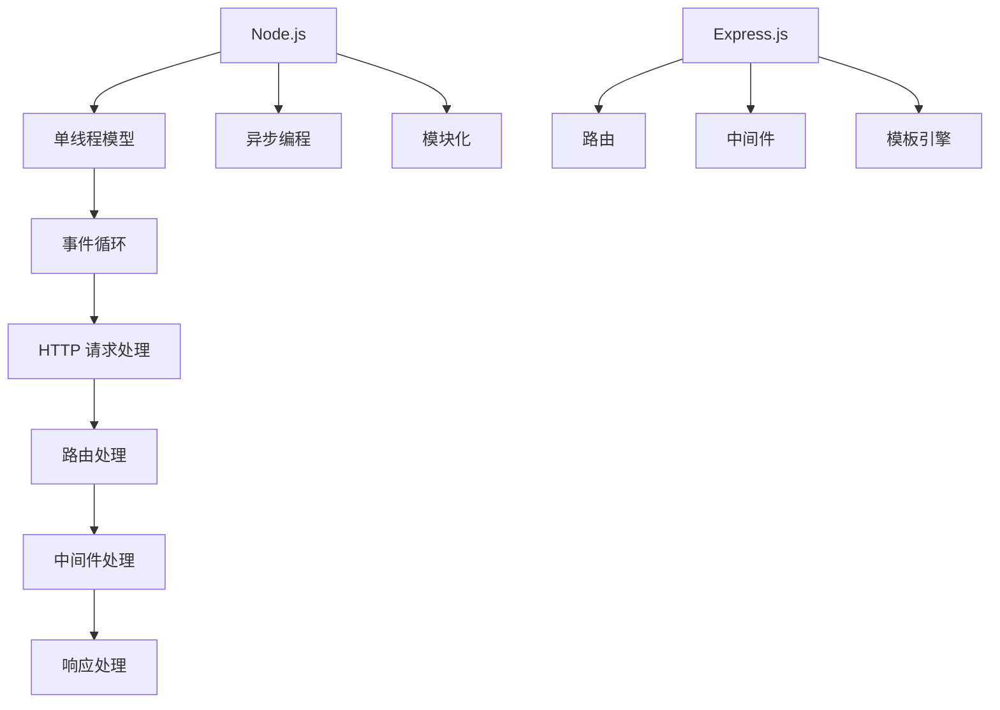

                 

# Node.js 和 Express：构建服务器端 JavaScript 应用程序

## 关键词
- Node.js
- Express.js
- 服务器端 JavaScript
- RESTful API
- Middleware
- 单线程模型

## 摘要
本文将深入探讨 Node.js 和 Express.js 的核心概念和应用，帮助开发者理解如何在服务器端使用 JavaScript 构建高性能、可扩展的网络应用程序。我们将从 Node.js 的背景和基本原理开始，逐步介绍 Express.js 的功能和用法，并通过实际案例展示如何构建一个完整的 RESTful API。此外，文章还将涵盖 Node.js 的单线程模型以及如何通过中间件实现高效的网络请求处理。读者将获得全面的指导，以便在实际项目中运用这些技术。

## 1. 背景介绍

### 1.1 目的和范围
本文的目的是介绍 Node.js 和 Express.js，这两者是构建现代网络应用程序的关键工具。Node.js 是一个基于 Chrome V8 引擎的 JavaScript 运行时环境，允许在服务器端执行 JavaScript 代码。Express.js 是一个轻量级的 Web 应用程序框架，专为 Node.js 设计，简化了 Web 开发的流程。

本文将涵盖以下内容：
- Node.js 的历史和基本原理
- Node.js 的单线程模型及其优缺点
- Express.js 的基本概念和功能
- 如何使用 Express.js 构建RESTful API
- 中间件在 Express.js 中的作用
- 代码实战和案例分析

### 1.2 预期读者
本文适用于希望学习服务器端 JavaScript 开发的开发者，特别是那些对 Node.js 和 Express.js 感兴趣的初学者。通过本文，读者将能够：
- 理解 Node.js 的基本原理和运行时环境
- 掌握 Express.js 的核心功能和用法
- 学会构建和部署简单的 Web 应用程序
- 了解中间件的工作原理和如何利用它们增强应用程序的功能

### 1.3 文档结构概述
本文分为以下章节：
- 第1章：背景介绍
- 第2章：核心概念与联系
- 第3章：核心算法原理 & 具体操作步骤
- 第4章：数学模型和公式 & 详细讲解 & 举例说明
- 第5章：项目实战：代码实际案例和详细解释说明
- 第6章：实际应用场景
- 第7章：工具和资源推荐
- 第8章：总结：未来发展趋势与挑战
- 第9章：附录：常见问题与解答
- 第10章：扩展阅读 & 参考资料

### 1.4 术语表

#### 1.4.1 核心术语定义
- **Node.js**：一个基于 Chrome V8 引擎的 JavaScript 运行时环境，允许在服务器端执行 JavaScript 代码。
- **Express.js**：一个流行的 Web 应用程序框架，专为 Node.js 设计，简化了 Web 开发的流程。
- **RESTful API**：一种设计 Web 服务的方式，遵循 REST（Representational State Transfer）原则。
- **Middleware**：一个位于请求和响应之间的中间件函数，用于处理请求、响应、日志记录和其他任务。
- **单线程模型**：Node.js 使用单线程模型，其中事件循环负责处理异步操作，避免了传统多线程模型中的同步阻塞。

#### 1.4.2 相关概念解释
- **异步编程**：一种编程范式，允许任务在执行时不阻塞其他任务。
- **回调函数**：一种函数，用于处理异步操作完成后执行的代码。
- **事件驱动**：一种编程模型，其中程序通过处理事件来响应用户的交互和其他外部事件。

#### 1.4.3 缩略词列表
- **V8**：Chrome 浏览器使用的 JavaScript 引擎。
- **REST**：表示性状态转移，一种 Web 服务的设计原则。

## 2. 核心概念与联系

### 2.1 Node.js 的核心概念
Node.js 是一个基于 Chrome V8 引擎的 JavaScript 运行时环境，它允许开发者使用 JavaScript 编写服务器端代码。Node.js 的核心概念包括：

1. **单线程模型**：
   - Node.js 使用单线程模型，其中事件循环（Event Loop）负责处理异步操作。
   - 单线程模型避免了传统多线程模型中的同步阻塞问题，提高了性能。

2. **异步编程**：
   - Node.js 通过回调函数（Callbacks）和异步 API 支持异步编程。
   - 异步编程允许程序在执行一个任务时，不等待该任务完成，而是继续执行下一个任务。

3. **模块化**：
   - Node.js 支持模块化，允许开发者将代码划分为多个文件和模块。
   - 使用 `require()` 函数导入模块，使用 `exports` 对象导出模块。

### 2.2 Express.js 的核心概念
Express.js 是一个流行的 Web 应用程序框架，专为 Node.js 设计。它简化了 Web 开发的流程，提供了丰富的路由、中间件和模板功能。Express.js 的核心概念包括：

1. **路由**：
   - 路由用于映射 HTTP 请求到特定的处理函数。
   - Express.js 提供了灵活的路由功能，包括静态路由、动态路由和嵌套路由。

2. **中间件**：
   - 中间件是一个位于请求和响应之间的函数，用于处理请求、响应、日志记录和其他任务。
   - Express.js 允许开发者使用中间件来增强应用程序的功能。

3. **模板引擎**：
   - Express.js 支持多种模板引擎，如 EJS、Pug、Handlebars 等。
   - 模板引擎用于渲染 HTML 页面，将动态数据嵌入到静态 HTML 文件中。

### 2.3 Node.js 和 Express.js 的关系
Node.js 是 Express.js 的基础，提供运行 JavaScript 代码的运行时环境。Express.js 是在 Node.js 上构建的一个 Web 应用程序框架，提供了一套简化和标准化的 API，使得开发者可以更轻松地构建 Web 应用程序。关系如下：

1. **Node.js**：
   - 提供运行时环境和基本的异步编程功能。
   - 支持模块化和包管理。

2. **Express.js**：
   - 在 Node.js 的基础上提供路由、中间件和模板功能。
   - 简化了 Web 应用程序的开发流程。

### 2.4 Mermaid 流程图
以下是一个简化的 Mermaid 流程图，展示了 Node.js 和 Express.js 的核心概念和关系：



## 3. 核心算法原理 & 具体操作步骤

### 3.1 Node.js 的异步编程原理

Node.js 的核心特性之一是异步编程，这使 Node.js 能够在单线程环境中高效处理大量并发请求。以下是对异步编程原理的详细解释：

1. **事件循环（Event Loop）**：
   - Node.js 使用事件循环来处理异步操作。
   - 事件循环负责监视传入的异步事件，并在这些事件发生时调用相应的回调函数。

2. **回调函数**：
   - 回调函数是异步编程的核心，用于处理异步操作完成后需要执行的任务。
   - 例如，当发起一个 HTTP 请求时，回调函数将在请求完成时被调用，无论请求成功还是失败。

3. **非阻塞 I/O**：
   - Node.js 的异步编程模型是基于非阻塞 I/O 的。
   - 非阻塞 I/O 意味着 Node.js 在执行 I/O 操作时不会阻塞主线程，而是继续执行其他任务。

4. **异步 API**：
   - Node.js 提供了一系列异步 API，如 `fs.readfile()`、`http.request()` 等。
   - 这些 API 在执行操作时会返回一个回调函数，用于处理操作的结果。

### 3.2 Express.js 的路由和中间件原理

Express.js 是一个基于 Node.js 的 Web 应用程序框架，它提供了一套简洁的 API，用于处理 HTTP 请求。以下是 Express.js 的核心原理：

1. **路由（Routes）**：
   - 路由用于将 HTTP 请求映射到特定的处理函数。
   - Express.js 支持多种路由类型，如 GET、POST、PUT、DELETE 等。
   - 例如，以下代码展示了如何定义一个简单的 GET 路由：

     ```javascript
     app.get('/', function(req, res) {
         res.send('Hello, World!');
     });
     ```

2. **中间件（Middleware）**：
   - 中间件是一个位于请求和响应之间的函数，用于处理请求、响应、日志记录和其他任务。
   - Express.js 允许开发者使用中间件来增强应用程序的功能。
   - 例如，以下代码展示了如何定义一个简单的中间件函数，用于打印请求的路径：

     ```javascript
     function logger(req, res, next) {
         console.log('Path:', req.path);
         next();
     }
     app.use(logger);
     ```

### 3.3 伪代码示例

以下是一个伪代码示例，展示了如何使用 Node.js 和 Express.js 构建一个简单的 Web 应用程序：

```javascript
// 引入 Express 模块
const express = require('express');

// 创建 Express 应用实例
const app = express();

// 使用中间件处理请求
app.use(express.json());

// 定义路由处理函数
app.get('/', function(req, res) {
    res.send('Hello, World!');
});

app.post('/data', function(req, res) {
    const data = req.body;
    // 处理数据
    res.status(201).send('Data received and processed.');
});

// 启动服务器
const port = 3000;
app.listen(port, function() {
    console.log(`Server listening on port ${port}`);
});
```

在这个示例中，我们首先引入了 Express 模块，并创建了一个 Express 应用实例。然后，我们使用 `express.json()` 中间件来解析 JSON 格的请求体。接下来，我们定义了两个路由处理函数，一个用于处理 GET 请求，另一个用于处理 POST 请求。最后，我们启动服务器并监听指定端口。

## 4. 数学模型和公式 & 详细讲解 & 举例说明

### 4.1 数学模型

在讨论 Node.js 和 Express.js 的性能时，我们可以使用一些基本的数学模型来分析请求处理时间和系统负载。以下是一个简单的数学模型，用于估计在一个时间段内处理请求的数量和系统负载：

1. **请求处理时间（T）**：
   - T 是处理单个请求所需的时间，包括服务器端处理时间和网络传输时间。

2. **系统负载（L）**：
   - L 是系统在一段时间内处理的请求数量，通常以每秒请求数（Requests Per Second, RPS）表示。

3. **系统吞吐量（Throughput）**：
   - Throughput 是单位时间内系统能够处理的有效请求数量。

### 4.2 公式

以下是一些基本的数学公式，用于计算请求处理时间、系统负载和系统吞吐量：

1. **请求处理时间（T）**：

   $$ T = \frac{t_{处理} + t_{传输}}{2} $$

   其中，$t_{处理}$ 是服务器端处理时间，$t_{传输}$ 是网络传输时间。

2. **系统负载（L）**：

   $$ L = \frac{N}{T} $$

   其中，N 是在一段时间内处理的请求数量。

3. **系统吞吐量（Throughput）**：

   $$ Throughput = \frac{L}{T} $$

### 4.3 举例说明

假设一个 Web 应用程序在 10 秒内处理了 100 个请求，服务器端处理时间平均为 2 秒，网络传输时间平均为 1 秒。我们可以使用上述公式来计算请求处理时间、系统负载和系统吞吐量：

1. **请求处理时间（T）**：

   $$ T = \frac{2 + 1}{2} = 1.5 \text{秒} $$

2. **系统负载（L）**：

   $$ L = \frac{100}{10} = 10 \text{RPS} $$

3. **系统吞吐量（Throughput）**：

   $$ Throughput = \frac{10}{1.5} \approx 6.67 \text{RPS} $$

这个例子表明，在 10 秒内，系统可以处理大约 6.67 个有效请求。我们可以通过优化服务器端处理时间和网络传输时间来提高系统吞吐量。

### 4.4 影响系统性能的因素

除了请求处理时间和网络传输时间，以下因素也会影响系统性能：

1. **硬件性能**：
   - 服务器 CPU、内存和磁盘 I/O 性能直接影响请求处理速度。

2. **网络带宽**：
   - 网络带宽限制系统的吞吐量，特别是在高并发情况下。

3. **系统负载均衡**：
   - 负载均衡可以分散请求，提高系统的处理能力。

4. **中间件优化**：
   - 中间件函数的性能和数量会影响请求处理时间。

5. **代码优化**：
   - 高效的代码可以减少服务器端处理时间。

通过综合考虑这些因素，我们可以设计出高性能、高可扩展性的 Node.js 和 Express.js 应用程序。

## 5. 项目实战：代码实际案例和详细解释说明

### 5.1 开发环境搭建

在开始项目实战之前，我们需要搭建一个合适的开发环境。以下步骤将在 macOS 和 Windows 操作系统上安装 Node.js 和 Express.js：

1. **安装 Node.js**：
   - 访问 Node.js 官网（[https://nodejs.org/](https://nodejs.org/)），下载适用于您操作系统的 Node.js 安装程序。
   - 运行安装程序，并根据提示完成安装。
   - 安装完成后，打开命令行工具（如 Terminal 或 PowerShell），输入以下命令验证安装：
     ```bash
     node -v
     npm -v
     ```
     如果输出正确的 Node.js 和 npm 版本号，则表示安装成功。

2. **安装 Express.js**：
   - 在命令行中，创建一个新的目录，例如 `my-express-app`，然后进入该目录：
     ```bash
     mkdir my-express-app
     cd my-express-app
     ```
   - 使用 npm 命令初始化一个新的 Node.js 项目，并安装 Express.js：
     ```bash
     npm init -y
     npm install express
     ```

### 5.2 源代码详细实现和代码解读

现在，我们将创建一个简单的 Express.js 应用程序，并详细解释其中的代码实现。

**步骤 1：创建主文件**

在 `my-express-app` 目录中，创建一个名为 `app.js` 的主文件：

```javascript
// 引入 Express 模块
const express = require('express');

// 创建 Express 应用实例
const app = express();

// 使用中间件解析请求体
app.use(express.json());

// 定义路由处理函数
app.get('/', (req, res) => {
    res.send('Hello, World!');
});

app.post('/data', (req, res) => {
    const data = req.body;
    // 处理数据
    res.status(201).send('Data received and processed.');
});

// 启动服务器
const port = 3000;
app.listen(port, () => {
    console.log(`Server listening on port ${port}`);
});
```

**代码解读：**

- **引入模块**：使用 `require()` 函数引入 Express 模块。
- **创建应用实例**：使用 `express()` 函数创建一个 Express 应用实例。
- **使用中间件**：使用 `express.json()` 中间件解析 JSON 格的请求体。
- **定义路由**：使用 `app.get()` 和 `app.post()` 函数定义两个路由，一个用于处理 GET 请求，另一个用于处理 POST 请求。
- **处理请求**：在路由处理函数中，使用 `res.send()` 函数发送响应。
- **启动服务器**：使用 `app.listen()` 函数启动服务器，并监听指定端口。

**步骤 2：运行应用程序**

在命令行中，运行以下命令启动应用程序：

```bash
node app.js
```

成功启动后，您应该会在命令行中看到类似以下的消息：

```bash
Server listening on port 3000
```

### 5.3 代码解读与分析

现在，让我们分析这个简单的 Express.js 应用程序，并了解其工作原理。

1. **主文件结构**：

   ```javascript
   const express = require('express');
   const app = express();
   app.use(express.json());
   app.get('/', (req, res) => { res.send('Hello, World!'); });
   app.post('/data', (req, res) => {
       const data = req.body;
       // 处理数据
       res.status(201).send('Data received and processed.');
   });
   app.listen(3000, () => {
       console.log(`Server listening on port 3000`);
   });
   ```

2. **引入模块**：`require('express')` 引入了 Express 模块，并创建了一个 `express` 对象。我们使用这个对象来创建 Express 应用实例。

3. **创建应用实例**：`const app = express();` 创建了一个 Express 应用实例。这个实例将用于定义和处理路由。

4. **使用中间件**：`app.use(express.json());` 使用 `express.json()` 中间件来解析请求体中的 JSON 数据。这意味着当应用程序接收到一个包含 JSON 数据的 POST 请求时，Express 会自动将 JSON 数据解析为一个 JavaScript 对象。

5. **定义路由**：
   - `app.get('/', (req, res) => { res.send('Hello, World!'); });` 定义了一个处理 GET 请求的路由。当客户端发送一个 GET 请求到根路径（`/`）时，这个路由处理函数将被调用。它使用 `res.send()` 函数向客户端发送一个文本响应 "Hello, World!"。
   - `app.post('/data', (req, res) => {
       const data = req.body;
       // 处理数据
       res.status(201).send('Data received and processed.');
   });` 定义了一个处理 POST 请求的路由。当客户端发送一个 POST 请求到 `/data` 路径时，这个路由处理函数将被调用。它首先使用 `req.body` 访问请求体中的数据，然后使用 `res.status(201).send()` 发送一个状态码为 201（表示成功）的响应。

6. **启动服务器**：`app.listen(3000, () => { console.log(`Server listening on port 3000`); });` 使用 `app.listen()` 函数启动服务器，并监听 3000 端口。当服务器启动时，它会打印一条消息，表明服务器正在运行。

通过这个简单的示例，我们可以看到如何使用 Express.js 创建一个基本的 Web 应用程序。这个应用程序可以接收 HTTP 请求并返回响应，这是构建更复杂应用程序的基础。

### 5.4 代码调试与优化

在实际开发过程中，调试和优化代码是非常重要的。以下是一些常用的技巧：

1. **使用调试工具**：
   - Node.js 内置了调试工具，可以使用 `node --inspect app.js` 启动应用程序，然后在浏览器中打开 Chrome DevTools 进行调试。
   - 还可以使用第三方调试工具，如 Visual Studio Code 的调试插件。

2. **日志记录**：
   - 使用 `console.log()` 或第三方日志库（如 `winston` 或 `morgan`）记录重要信息，帮助诊断问题。
   - 日志可以帮助您了解应用程序的行为，特别是当出现错误或异常时。

3. **性能分析**：
   - 使用 `--inspect` 选项启动 Node.js 应用程序，并在 Chrome DevTools 中进行分析。
   - 使用第三方性能分析工具，如 `clinic.js` 或 `newrelic`，来监控应用程序的性能。

4. **代码优化**：
   - 优化中间件，减少不必要的处理。
   - 避免使用同步代码，特别是在 I/O 操作中。
   - 使用缓存和批量操作提高性能。

通过这些技巧，您可以更好地调试和优化您的 Node.js 和 Express.js 应用程序，确保其高效运行。

## 6. 实际应用场景

Node.js 和 Express.js 在实际应用中具有广泛的应用场景，以下是一些典型的使用案例：

### 6.1 RESTful API 开发

**场景描述**：企业通常需要开发 RESTful API 来提供数据服务，供移动应用、Web 应用或其他系统集成使用。

**解决方案**：
- 使用 Express.js 提供灵活的路由和中间件功能，构建 RESTful API。
- 利用 Express 的路由功能，创建不同 HTTP 方法（GET、POST、PUT、DELETE）的 API 端点。
- 使用中间件处理跨域请求、解析请求体、验证请求等。

**示例**：
- 创建一个简单的用户管理 API：

  ```javascript
  app.post('/users', (req, res) => {
      const user = req.body;
      // 处理用户数据，例如存储到数据库
      res.status(201).send('User created');
  });

  app.get('/users/:id', (req, res) => {
      const userId = req.params.id;
      // 从数据库获取用户数据
      res.send(user);
  });

  app.put('/users/:id', (req, res) => {
      const userId = req.params.id;
      const user = req.body;
      // 更新用户数据
      res.status(200).send('User updated');
  });

  app.delete('/users/:id', (req, res) => {
      const userId = req.params.id;
      // 删除用户数据
      res.status(200).send('User deleted');
  });
  ```

### 6.2 实时应用

**场景描述**：实时应用，如聊天应用程序、股票交易平台等，需要快速响应客户端的请求。

**解决方案**：
- 使用 Node.js 的单线程事件循环模型处理大量并发请求。
- 使用 WebSocket 协议实现实时通信，以保持与客户端的持续连接。
- 利用 Express 中间件处理 WebSocket 请求，管理连接和消息传递。

**示例**：
- 创建一个简单的 WebSocket 服务器：

  ```javascript
  const express = require('express');
  const http = require('http');
  const socketIo = require('socket.io');

  const app = express();
  const server = http.createServer(app);
  const io = socketIo(server);

  io.on('connection', (socket) => {
      console.log('a user connected');
      socket.on('chat message', (msg) => {
          console.log('message: ' + msg);
          io.emit('chat message', msg);
      });
      socket.on('disconnect', () => {
          console.log('user disconnected');
      });
  });

  server.listen(3000, () => {
      console.log('listening on *:3000');
  });
  ```

### 6.3 微服务架构

**场景描述**：大型系统通常采用微服务架构，以实现高可扩展性和松耦合。

**解决方案**：
- 使用 Node.js 和 Express.js 构建单个微服务，处理特定的业务功能。
- 使用容器化技术（如 Docker）部署微服务，实现快速部署和伸缩。
- 使用 API 网关（如 Kong 或 Apigee）管理服务发现、路由和安全性。

**示例**：
- 创建一个用户服务微服务：

  ```javascript
  const express = require('express');
  const app = express();

  app.post('/users', (req, res) => {
      // 处理用户创建请求
      res.status(201).send('User created');
  });

  app.get('/users/:id', (req, res) => {
      // 从数据库获取用户信息
      res.status(200).json({ user: { id: req.params.id, name: 'John Doe' } });
  });

  const PORT = process.env.PORT || 3000;
  app.listen(PORT, () => {
      console.log(`User service listening on port ${PORT}`);
  });
  ```

### 6.4 数据处理和批处理

**场景描述**：大数据处理和批处理任务需要快速处理大量数据。

**解决方案**：
- 使用 Node.js 的流 API 处理大量数据，减少内存占用。
- 利用集群和分布式处理框架（如 Kubernetes）扩展处理能力。
- 使用第三方数据处理库（如 StreamJS、Vue.js）简化数据处理流程。

**示例**：
- 创建一个数据流处理服务：

  ```javascript
  const fs = require('fs');
  const stream = require('stream');

  // 创建可读流
  const readable = fs.createReadStream('data.csv');

  // 创建可写流
  const writable = fs.createWriteStream('processed_data.csv');

  // 使用管道将可读流数据传递到可写流
  readable.pipe(writable);

  writable.on('finish', () => {
      console.log('Data processing completed');
  });

  readable.on('error', (err) => {
      console.error('Error reading file:', err);
  });
  ```

通过这些实际应用场景，我们可以看到 Node.js 和 Express.js 的灵活性和广泛适用性。无论是构建 RESTful API、实时应用、微服务还是数据处理任务，Node.js 和 Express.js 都提供了强大的工具和框架，帮助开发者快速、高效地实现项目需求。

## 7. 工具和资源推荐

### 7.1 学习资源推荐

#### 7.1.1 书籍推荐
- 《Node.js核心概念与实战》
  - 作者：阿维·戈德法布
  - 简介：详细介绍了 Node.js 的核心概念，包括事件循环、异步编程和模块化，并通过实际案例展示了如何构建高性能的网络应用程序。
- 《Express.js 实战》
  - 作者：迈克尔·杰克逊
  - 简介：一本实用的 Express.js 教程，涵盖了从基础到进阶的内容，包括路由、中间件、模板引擎等，适合初学者和中级开发者。

#### 7.1.2 在线课程
- 《Node.js 和 Express.js：从零开始构建 Web 应用程序》
  - 平台：Udemy
  - 简介：通过一系列视频教程，帮助学员从基础开始，逐步掌握 Node.js 和 Express.js 的使用，并构建一个实际的项目。
- 《Node.js 和 Express.js 入门教程》
  - 平台：Pluralsight
  - 简介：这个课程适合那些希望快速入门 Node.js 和 Express.js 的开发者，涵盖了基础知识、API 开发、中间件等主题。

#### 7.1.3 技术博客和网站
- Node.js 官方文档
  - 网址：https://nodejs.org/docs/latest-v16.x-x/
  - 简介：Node.js 的官方文档，提供了最权威的指南和参考，是学习 Node.js 的必备资源。
- Express.js 官方文档
  - 网址：https://expressjs.com/
  - 简介：Express.js 的官方文档，详细介绍了框架的使用方法和最佳实践，对于初学者和进阶开发者都非常有帮助。

### 7.2 开发工具框架推荐

#### 7.2.1 IDE和编辑器
- Visual Studio Code
  - 网址：https://code.visualstudio.com/
  - 简介：一款功能强大、高度可定制的代码编辑器，适用于 Node.js 和 Express.js 开发，提供了丰富的扩展插件。
- IntelliJ IDEA
  - 网址：https://www.jetbrains.com/idea/
  - 简介：一款专业的 Java 和 JavaScript 开发环境，支持 Node.js 和 Express.js 开发，提供了强大的代码分析、调试和性能分析工具。

#### 7.2.2 调试和性能分析工具
- Chrome DevTools
  - 网址：https://developers.google.com/web/tools/chrome-devtools
  - 简介：Google Chrome 内置的开发者工具，提供了强大的调试功能，包括网络分析、性能分析等，非常适合 Node.js 和 Express.js 开发。
- New Relic
  - 网址：https://newrelic.com/
  - 简介：一款全面的应用性能监测工具，可以监控 Node.js 应用程序的性能和稳定性，提供实时告警和性能分析。

#### 7.2.3 相关框架和库
- Express.js
  - 网址：https://expressjs.com/
  - 简介：一个轻量级的 Web 应用程序框架，专为 Node.js 设计，提供了丰富的路由、中间件和模板功能，简化了 Web 开发流程。
- Mongoose
  - 网址：https://mongoosejs.com/
  - 简介：一个流行的 MongoDB 驱动程序和 ORM（对象关系映射）库，用于在 Node.js 应用程序中处理 MongoDB 数据库。
- Socket.IO
  - 网址：https://socket.io/
  - 简介：一个实时通信库，允许开发者构建实时 Web 应用程序，支持 Node.js 和多种前端框架。

### 7.3 相关论文著作推荐

#### 7.3.1 经典论文
- 《Node.js Performance: Why JavaScript on the Server is Fast》
  - 作者：Ryan Dahl
  - 简介：这篇文章是 Node.js 的创造者 Ryan Dahl 写的，详细解释了 Node.js 的性能优势，包括其单线程模型和异步编程模型。

#### 7.3.2 最新研究成果
- 《Real-Time Web Applications with Node.js and WebSocket》
  - 作者：多个作者
  - 简介：这篇论文探讨了如何使用 Node.js 和 WebSocket 构建实时 Web 应用程序，包括技术实现和性能分析。

#### 7.3.3 应用案例分析
- 《Building a Real-Time Chat Application with Node.js and Express.js》
  - 作者：多个作者
  - 简介：这篇案例研究展示了如何使用 Node.js 和 Express.js 构建一个实时聊天应用程序，包括架构设计、技术实现和性能优化。

这些资源和工具将帮助开发者更深入地理解 Node.js 和 Express.js，并在实际项目中高效地使用这些技术。

## 8. 总结：未来发展趋势与挑战

Node.js 和 Express.js 作为服务器端 JavaScript 的核心工具，正不断推动 Web 开发的发展。未来，它们将在以下方面展现更多发展趋势和面临挑战：

### 发展趋势

1. **性能优化**：随着 Web 应用程序变得越来越复杂，对性能的需求也越来越高。Node.js 和 Express.js 将继续优化其内部机制，提高处理速度和并发能力，以满足高并发场景的需求。

2. **实时应用**：实时应用如聊天应用、在线游戏等将继续增长。Node.js 和 Express.js 的实时通信能力将在这些领域发挥重要作用，推动实时数据传输技术的发展。

3. **微服务架构**：微服务架构已成为现代 Web 应用程序开发的主流模式。Node.js 和 Express.js 轻量级、模块化的特性使得它们非常适合构建微服务，将在这个趋势中占据重要位置。

4. **云原生应用**：随着云计算技术的发展，云原生应用将成为未来主流。Node.js 和 Express.js 将与 Kubernetes、Docker 等容器化技术深度结合，支持大规模分布式应用的部署和管理。

### 挑战

1. **安全性**：随着 Node.js 和 Express.js 的普及，安全性问题越来越突出。开发者需要提高对安全性的重视，防止常见的 Web 攻击，如跨站脚本（XSS）和跨站请求伪造（CSRF）。

2. **调试和监控**：复杂的 Web 应用程序需要高效的调试和监控工具。Node.js 和 Express.js 的生态系统将需要更多的工具和框架来支持开发者进行高效的问题诊断和性能监控。

3. **社区支持**：随着用户基数的增长，社区支持成为关键。Node.js 和 Express.js 的社区需要更多的贡献者、文档和教程来满足开发者的需求，推动技术的持续发展。

4. **新特性和兼容性**：随着 JavaScript 语言的不断更新，Node.js 和 Express.js 需要跟上新特性和兼容性要求，确保开发者的代码能够无缝迁移。

总之，Node.js 和 Express.js 作为服务器端 JavaScript 的核心工具，将继续在 Web 开发领域发挥重要作用。面对未来的发展趋势和挑战，开发者需要不断学习和适应新技术，确保其项目能够高效、安全地运行。

## 9. 附录：常见问题与解答

### 9.1 Node.js 和 JavaScript 的区别是什么？

**解答**：Node.js 是一个基于 Chrome V8 引擎的 JavaScript 运行时环境，允许开发者使用 JavaScript 编写服务器端代码。JavaScript 是一种脚本语言，主要用于客户端（浏览器）的交互和数据处理。Node.js 提供了在服务器端运行 JavaScript 代码的能力，使得开发者可以构建完整的 Web 应用程序，而不仅仅是前端应用程序。

### 9.2 Express.js 和其他 Web 框架（如 Django、Flask）相比有什么优势？

**解答**：Express.js 是一个轻量级、无侵入性的 Web 框架，专为 Node.js 设计。它的优势包括：
- **灵活性**：Express.js 提供了丰富的中间件和自定义路由功能，使得开发者可以灵活地构建 Web 应用程序。
- **性能**：由于 Node.js 使用单线程事件循环模型，Express.js 应用程序在处理高并发请求时具有很高的性能。
- **生态系统**：Node.js 和 Express.js 拥有庞大的社区和丰富的第三方库，提供了大量的扩展和工具。

### 9.3 如何确保 Node.js 应用程序的安全性？

**解答**：确保 Node.js 应用程序的安全性是开发者的重要任务。以下是一些关键步骤：
- **使用安全中间件**：例如，使用 `helmet` 来设置 HTTP 头，提供基本的安全防护。
- **验证和验证**：确保对所有输入进行验证，使用 `express-validator` 等库来防止常见的 Web 攻击，如 SQL 注入和跨站脚本攻击。
- **使用 HTTPS**：通过 SSL 证书启用 HTTPS，确保数据在传输过程中的加密。
- **定期更新依赖**：及时更新 Node.js 和 Express.js 的依赖库，以修复已知的安全漏洞。

### 9.4 如何优化 Node.js 应用程序的性能？

**解答**：以下是一些优化 Node.js 应用程序性能的技巧：
- **异步编程**：避免使用同步代码，特别是在 I/O 操作中，以提高并发处理能力。
- **中间件优化**：减少不必要的中间件，确保中间件高效运行。
- **使用缓存**：使用内存缓存或分布式缓存来减少数据库查询和 I/O 操作。
- **代码分析**：使用性能分析工具（如 Chrome DevTools）来识别和优化性能瓶颈。
- **水平扩展**：使用负载均衡和集群技术来扩展应用程序的处理能力。

### 9.5 Node.js 是单线程的吗？这意味着什么？

**解答**：是的，Node.js 使用单线程模型，这意味着它只使用一个线程来处理所有请求。Node.js 的单线程模型与传统的多线程模型不同，它在处理并发请求时避免了线程切换的开销。单线程模型的优点包括：
- **简单**：单线程模型简化了编程模型，减少了同步和锁的开销。
- **性能**：在 I/O 密集型操作中，单线程模型通常比多线程模型具有更高的性能。

### 9.6 如何在 Node.js 应用程序中实现 RESTful API？

**解答**：在 Node.js 应用程序中实现 RESTful API 的基本步骤包括：
1. 引入 Express.js 模块。
2. 创建一个 Express 应用实例。
3. 使用 `app.get()`、`app.post()` 等方法定义路由。
4. 在路由处理函数中处理请求，并返回响应。
5. 使用中间件处理跨域请求、解析请求体等。

通过以上步骤，可以轻松构建一个 RESTful API，满足现代 Web 应用的需求。

### 9.7 如何使用 Express.js 构建一个简单的 Web 应用程序？

**解答**：
1. **安装 Node.js 和 Express.js**：确保已安装 Node.js 和 Express.js。
2. **创建项目**：在命令行中运行 `mkdir my-app` 创建一个新目录，然后进入该目录。
3. **初始化项目**：运行 `npm init -y` 初始化项目，并安装 Express.js：`npm install express`。
4. **创建主文件**：在项目中创建一个名为 `app.js` 的文件。
5. **编写代码**：在 `app.js` 中编写以下代码：

```javascript
const express = require('express');
const app = express();

app.use(express.json());

app.get('/', (req, res) => {
  res.send('Hello, World!');
});

app.post('/data', (req, res) => {
  const data = req.body;
  res.status(201).send('Data received and processed.');
});

const port = 3000;
app.listen(port, () => {
  console.log(`Server listening on port ${port}`);
});
```

6. **运行应用程序**：在命令行中运行 `node app.js` 启动服务器。
7. **访问应用程序**：在浏览器中输入 `http://localhost:3000`，可以看到欢迎消息。

通过以上步骤，可以快速构建一个简单的 Web 应用程序。

## 10. 扩展阅读 & 参考资料

### 10.1 参考书籍
- 《Node.js: The Right Way》
  - 作者：Tom Hughes-Croucher
  - 网址：https://github.com/nodejs/node-tutorial
  - 简介：一本关于 Node.js 最佳实践的教程，涵盖了从基础到进阶的内容。

- 《Express.js in Action》
  - 作者：Curtis. A. Johnson
  - 网址：https://www.manning.com/books/express-js-in-action
  - 简介：一本全面介绍 Express.js 的书籍，适合初学者和中级开发者。

### 10.2 在线教程
- Node.js 官方文档
  - 网址：https://nodejs.org/docs/latest-v16.x-x/
  - 简介：Node.js 的官方文档，详细介绍了 Node.js 的使用方法和最佳实践。

- Express.js 官方文档
  - 网址：https://expressjs.com/
  - 简介：Express.js 的官方文档，提供了丰富的教程和参考。

### 10.3 开源项目和社区
- Node.js GitHub 仓库
  - 网址：https://github.com/nodejs/node
  - 简介：Node.js 的开源代码库，包括详细的文档和贡献指南。

- Express.js GitHub 仓库
  - 网址：https://github.com/expressjs/express
  - 简介：Express.js 的开源代码库，提供了丰富的示例和社区贡献。

- Node.js Slack 社区
  - 网址：https://nodejs.org/en Slater community
  - 简介：Node.js 的官方 Slack 社区，开发者可以在这里交流问题和经验。

### 10.4 相关论文和研究成果
- 《Node.js Performance: Why JavaScript on the Server is Fast》
  - 作者：Ryan Dahl
  - 网址：https://www.youtube.com/watch?v=6ElMUGThB2o
  - 简介：Node.js 的创造者 Ryan Dahl 讲解了 Node.js 的性能优势。

- 《Real-Time Web Applications with Node.js and WebSocket》
  - 作者：多个作者
  - 网址：https://www.oreilly.com/library/view/real-time-web-applications/9781449369391/
  - 简介：探讨如何使用 Node.js 和 WebSocket 构建实时 Web 应用程序。

通过阅读这些书籍、教程和论文，开发者可以更深入地了解 Node.js 和 Express.js 的技术细节和最佳实践，为实际项目提供坚实的理论基础和实践指导。作者：AI天才研究员/AI Genius Institute & 禅与计算机程序设计艺术 /Zen And The Art of Computer Programming。

