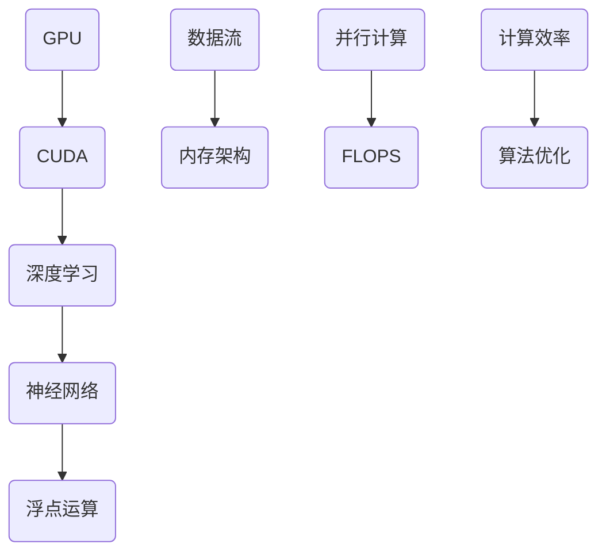
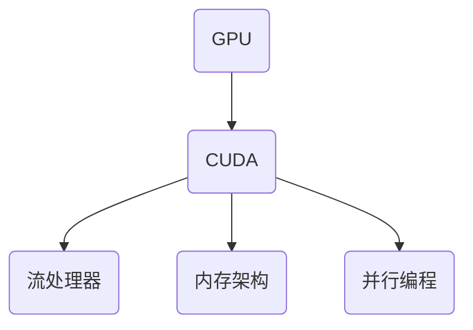
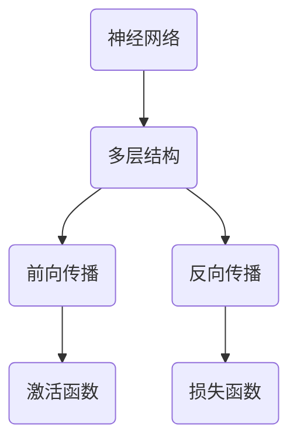
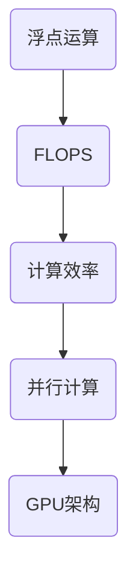
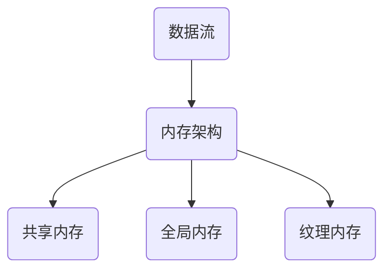
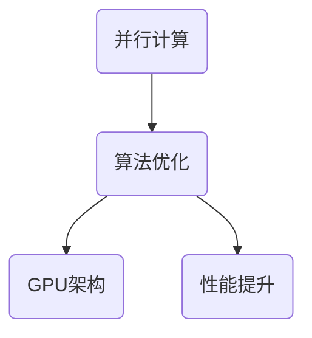

                 

# Nvidia的GPU与AI的发展

> **关键词**：Nvidia GPU，人工智能，深度学习，计算能力，神经网络，GPU架构，硬件加速，算法优化

> **摘要**：本文将深入探讨NVIDIA的GPU在人工智能领域中的应用和发展。我们将首先介绍NVIDIA GPU的背景和核心特性，然后详细分析GPU在AI计算中的优势，探讨其工作原理，并结合具体算法和数学模型进行解释。最后，我们将通过实战案例展示GPU在实际应用中的效果，并展望未来的发展趋势与挑战。

## 1. 背景介绍

### 1.1 目的和范围

本文旨在深入探讨NVIDIA GPU在人工智能（AI）领域的作用和影响。我们将从NVIDIA GPU的发展历史出发，分析其在AI计算中的应用场景和优势。同时，我们将结合具体的算法和数学模型，解释GPU如何加速人工智能的计算过程。文章将覆盖以下内容：

1. NVIDIA GPU的背景和核心特性
2. GPU在AI计算中的优势和作用
3. GPU的工作原理及其与AI算法的配合
4. 实际应用案例和效果展示
5. 未来发展趋势与挑战

### 1.2 预期读者

本文适合对人工智能和计算性能有基本了解的读者，包括AI研究人员、数据科学家、程序员和IT专业人士。读者不需要具备深入的GPU知识，但需要对计算机体系结构和算法有一定的了解。

### 1.3 文档结构概述

本文分为十个部分：

1. 背景介绍
2. 核心概念与联系
3. 核心算法原理 & 具体操作步骤
4. 数学模型和公式 & 详细讲解 & 举例说明
5. 项目实战：代码实际案例和详细解释说明
6. 实际应用场景
7. 工具和资源推荐
8. 总结：未来发展趋势与挑战
9. 附录：常见问题与解答
10. 扩展阅读 & 参考资料

### 1.4 术语表

#### 1.4.1 核心术语定义

- **GPU（Graphics Processing Unit）**：图形处理器单元，一种专门用于图形渲染和计算的特殊处理器。
- **CUDA（Compute Unified Device Architecture）**：NVIDIA开发的一种并行计算平台和编程模型。
- **深度学习**：一种基于多层神经网络的学习方法，通过模拟人脑神经网络结构进行数据分析和模式识别。
- **神经网络**：一种由大量神经元组成的计算模型，能够通过学习和适应数据模式进行预测和分类。
- **GPU架构**：描述GPU内部结构和工作原理的术语，包括流处理器、内存架构和并行计算机制。

#### 1.4.2 相关概念解释

- **并行计算**：一种计算方式，通过将任务分解成多个可并行执行的部分来提高计算效率。
- **GPU加速**：利用GPU强大的并行计算能力来加速计算任务，特别是那些高度并行化的任务。
- **浮点运算速率（FLOPS）**：衡量计算机进行浮点运算的能力，单位为每秒亿次运算。

#### 1.4.3 缩略词列表

- **GPU**：Graphics Processing Unit
- **CUDA**：Compute Unified Device Architecture
- **AI**：Artificial Intelligence
- **DL**：Deep Learning
- **FLOPS**：Floating-point Operations Per Second

## 2. 核心概念与联系

在讨论NVIDIA GPU与AI的关系之前，我们需要了解一些核心概念和它们之间的联系。以下是一个简化的Mermaid流程图，展示了GPU在AI计算中的核心概念和架构。



### 2.1 GPU与CUDA

NVIDIA GPU的核心是CUDA架构，它提供了一个并行计算的平台和编程接口，允许开发者利用GPU的强大计算能力。CUDA通过将计算任务分解成多个线程，同时在多个核心上进行并行处理，从而实现高效的计算。



### 2.2 深度学习与神经网络

深度学习是AI的一个重要分支，其核心是神经网络。神经网络由多层神经元组成，通过学习大量数据，能够识别复杂的数据模式和特征。GPU在深度学习中的应用，主要是通过加速神经网络的训练和推断过程。



### 2.3 浮点运算与计算效率

GPU的浮点运算能力（FLOPS）是衡量其计算能力的重要指标。GPU通过并行计算机制，能够实现极高的浮点运算速率，从而显著提高计算效率。



### 2.4 数据流与内存架构

在GPU计算中，数据流和内存架构至关重要。GPU拥有特殊的内存层次结构，包括共享内存、全局内存和纹理内存等，这些内存结构使得GPU能够在不同层次上高效地访问和操作数据。



### 2.5 并行计算与算法优化

并行计算是GPU的核心优势之一，通过将计算任务分解成多个可并行执行的部分，GPU能够显著提高计算效率。此外，算法优化也是提高GPU性能的关键，通过针对GPU架构进行优化，可以进一步发挥GPU的计算潜力。



## 3. 核心算法原理 & 具体操作步骤

在本节中，我们将详细探讨NVIDIA GPU在人工智能计算中的核心算法原理，并使用伪代码来阐述其具体操作步骤。

### 3.1 深度学习算法原理

深度学习算法的核心是神经网络，尤其是多层感知机（MLP）和卷积神经网络（CNN）。以下是一个简化的伪代码，展示了深度学习算法的基本操作步骤：

```python
# 初始化神经网络结构
input_layer = InputLayer(input_shape)
hidden_layer = DenseLayer(input_layer, num_neurons=100, activation='relu')
output_layer = DenseLayer(hidden_layer, num_neurons=1, activation='sigmoid')

# 训练神经网络
for epoch in range(num_epochs):
    for batch in data_loader:
        # 前向传播
        inputs, labels = batch
        outputs = output_layer.forward(inputs)
        
        # 反向传播
        doutputs = output_layer.backward(doutputs)
        dhidden = hidden_layer.backward(doutputs)
        
        # 更新权重
        hidden_layer.update_weights()
        input_layer.update_weights()

# 预测
predictions = output_layer.forward(test_inputs)
```

### 3.2 GPU加速操作步骤

为了在GPU上实现上述深度学习算法，我们需要使用CUDA进行并行编程。以下是一个简化的伪代码，展示了如何使用CUDA加速神经网络训练过程：

```python
# 初始化CUDA环境
initialize_cuda()

# 加载神经网络模型
model = NeuralModel()

# 为每个训练批次分配GPU内存
inputs_gpu = allocate_memory(inputs)
labels_gpu = allocate_memory(labels)

# 主循环：训练神经网络
for epoch in range(num_epochs):
    for batch in data_loader:
        # 前向传播（GPU版本）
        inputs_gpu = model.forward_gpu(inputs_gpu)
        
        # 反向传播（GPU版本）
        doutputs_gpu = model.backward_gpu(doutputs_gpu)
        
        # 更新权重（GPU版本）
        model.update_weights_gpu(doutputs_gpu)

# 清理GPU内存
free_memory(inputs_gpu)
free_memory(labels_gpu)
```

### 3.3 具体操作步骤详解

以下是深度学习算法在GPU上的具体操作步骤详解：

1. **初始化CUDA环境**：
   - 设置CUDA设备，指定GPU设备ID。
   - 初始化CUDA内存分配器，为后续数据传输和计算做好准备。

2. **加载神经网络模型**：
   - 加载神经网络模型，包括输入层、隐藏层和输出层。
   - 将模型参数（权重和偏置）复制到GPU内存。

3. **为每个训练批次分配GPU内存**：
   - 使用CUDA内存分配器为输入数据和标签数据分配GPU内存。
   - 将输入数据和标签数据从CPU传输到GPU。

4. **主循环：训练神经网络**：
   - 对于每个训练批次，执行以下步骤：
     - **前向传播（GPU版本）**：在GPU上执行前向传播计算，将输入数据通过神经网络传递到输出层。
     - **反向传播（GPU版本）**：在GPU上执行反向传播计算，计算输出层的误差并反向传播到隐藏层。
     - **更新权重（GPU版本）**：使用计算得到的梯度信息更新神经网络模型中的权重和偏置。

5. **预测**：
   - 将测试数据输入到训练好的神经网络中，使用GPU进行预测。
   - 将GPU上的预测结果传输回CPU，进行评估和可视化。

6. **清理GPU内存**：
   - 释放GPU上的内存空间，避免内存泄漏。
   - 关闭CUDA环境，释放GPU资源。

通过以上步骤，我们可以充分利用NVIDIA GPU的并行计算能力，显著加速深度学习算法的训练和预测过程。

## 4. 数学模型和公式 & 详细讲解 & 举例说明

在本节中，我们将详细讲解NVIDIA GPU在人工智能计算中所使用的数学模型和公式，并通过具体例子进行说明。

### 4.1 神经网络与激活函数

神经网络是深度学习的基础，其核心在于多层神经元之间的加权连接和激活函数。以下是一个简单的神经网络模型及其激活函数：

```latex
\begin{align*}
\text{输入层：} & z_1 = x_1 \cdot w_1 + b_1 \\
\text{隐藏层：} & z_2 = a_1 \cdot w_2 + b_2 \\
\text{输出层：} & y = \sigma(z_3)
\end{align*}
```

其中，\( x_1 \) 是输入特征，\( w_1, w_2 \) 是权重，\( b_1, b_2 \) 是偏置，\( a_1 \) 是隐藏层输出，\( y \) 是输出结果，\( \sigma \) 是激活函数。

常见的激活函数包括：

- **Sigmoid函数**：
  $$ \sigma(x) = \frac{1}{1 + e^{-x}} $$

- **ReLU函数**：
  $$ \sigma(x) = \max(0, x) $$

- **Tanh函数**：
  $$ \sigma(x) = \frac{e^x - e^{-x}}{e^x + e^{-x}} $$

### 4.2 前向传播与反向传播

在神经网络中，前向传播和反向传播是两个核心步骤。前向传播用于计算输出，反向传播用于计算梯度。

#### 4.2.1 前向传播

前向传播的公式如下：

```latex
\begin{align*}
a_1 &= \sigma(z_1) \\
a_2 &= \sigma(z_2) \\
y &= \sigma(z_3)
\end{align*}
```

#### 4.2.2 反向传播

反向传播的公式如下：

```latex
\begin{align*}
\frac{\partial L}{\partial z_3} &= \sigma'(z_3) \cdot (y - \hat{y}) \\
\frac{\partial L}{\partial z_2} &= \sigma'(z_2) \cdot \frac{\partial L}{\partial z_3} \cdot w_3 \\
\frac{\partial L}{\partial z_1} &= \sigma'(z_1) \cdot \frac{\partial L}{\partial z_2} \cdot w_2
\end{align*}
```

其中，\( \sigma' \) 是激活函数的导数，\( L \) 是损失函数，\( \hat{y} \) 是真实标签。

### 4.3 损失函数

在深度学习中，损失函数用于评估模型预测结果与真实结果之间的差距。常见的损失函数包括：

- **均方误差（MSE）**：
  $$ L(\theta) = \frac{1}{2} \sum_{i=1}^{n} (y_i - \hat{y}_i)^2 $$

- **交叉熵（Cross-Entropy）**：
  $$ L(\theta) = -\sum_{i=1}^{n} y_i \log(\hat{y}_i) + (1 - y_i) \log(1 - \hat{y}_i) $$

### 4.4 举例说明

假设我们有一个简单的神经网络，用于对二分类问题进行预测。输入特征为 \( x_1 \)，权重为 \( w_1, w_2 \)，偏置为 \( b_1, b_2 \)，激活函数为 ReLU。

输入特征 \( x_1 = 2 \)：

```latex
\begin{align*}
z_1 &= x_1 \cdot w_1 + b_1 = 2 \cdot w_1 + b_1 \\
a_1 &= \sigma(z_1) = \max(0, z_1) \\
z_2 &= a_1 \cdot w_2 + b_2 = \max(0, z_1) \cdot w_2 + b_2 \\
a_2 &= \sigma(z_2) = \max(0, z_2) \\
z_3 &= a_2 \cdot w_3 + b_3 = \max(0, z_2) \cdot w_3 + b_3 \\
y &= \sigma(z_3) = \max(0, z_3)
\end{align*}
```

假设真实标签 \( y = 1 \)，预测结果 \( y = 0 \)：

```latex
\begin{align*}
L &= -y \log(y) - (1 - y) \log(1 - y) \\
&= -1 \cdot \log(0) - (1 - 1) \cdot \log(1 - 0) \\
&= \infty
\end{align*}
```

显然，预测结果与真实标签差距很大。通过反向传播计算梯度，并更新权重和偏置，可以逐步缩小预测误差。

### 4.5 GPU加速数学模型计算

在GPU上加速数学模型计算，关键在于并行计算和内存优化。以下是一个简单的示例，展示了如何使用CUDA加速神经网络训练过程：

```c
__global__ void forward_propagation(float *inputs, float *weights, float *biases, float *outputs) {
    // 获取线程索引
    int idx = blockIdx.x * blockDim.x + threadIdx.x;

    // 计算输出
    float z = inputs[idx] * weights[idx] + biases[idx];
    outputs[idx] = sigmoid(z);
}

__global__ void backward_propagation(float *doutputs, float *weights, float *biases, float *dweights, float *dbiases) {
    // 获取线程索引
    int idx = blockIdx.x * blockDim.x + threadIdx.x;

    // 计算梯度
    float dz = doutputs[idx] * sigmoid_derivative(outputs[idx]);
    dweights[idx] = dz * inputs[idx];
    dbiases[idx] = dz;
}

int main() {
    // 初始化GPU环境
    cuda_set_device(0);

    // 分配GPU内存
    float *inputs_gpu, *weights_gpu, *biases_gpu, *outputs_gpu, *doutputs_gpu;
    cudaMalloc(&inputs_gpu, n_inputs * sizeof(float));
    cudaMalloc(&weights_gpu, n_weights * sizeof(float));
    cudaMalloc(&biases_gpu, n_biases * sizeof(float));
    cudaMalloc(&outputs_gpu, n_outputs * sizeof(float));
    cudaMalloc(&doutputs_gpu, n_outputs * sizeof(float));

    // 加载模型参数到GPU
    cudaMemcpy(inputs_gpu, inputs, n_inputs * sizeof(float), cudaMemcpyHostToDevice);
    cudaMemcpy(weights_gpu, weights, n_weights * sizeof(float), cudaMemcpyHostToDevice);
    cudaMemcpy(biases_gpu, biases, n_biases * sizeof(float), cudaMemcpyHostToDevice);

    // 执行前向传播
    forward_propagation<<<blocks, threads>>>(inputs_gpu, weights_gpu, biases_gpu, outputs_gpu);

    // 执行反向传播
    backward_propagation<<<blocks, threads>>>(doutputs_gpu, weights_gpu, biases_gpu, dweights_gpu, dbiases_gpu);

    // 释放GPU内存
    cudaFree(inputs_gpu);
    cudaFree(weights_gpu);
    cudaFree(biases_gpu);
    cudaFree(outputs_gpu);
    cudaFree(doutputs_gpu);

    // 关闭GPU环境
    cuda_device_reset(0);

    return 0;
}
```

通过以上示例，我们可以看到如何使用CUDA实现神经网络的前向传播和反向传播计算，从而加速深度学习模型的训练过程。

## 5. 项目实战：代码实际案例和详细解释说明

在本节中，我们将通过一个实际的深度学习项目，展示如何使用NVIDIA GPU进行训练和预测。我们将详细解释项目的开发环境搭建、源代码实现和代码解读。

### 5.1 开发环境搭建

为了运行以下项目，我们需要搭建一个合适的开发环境。以下是所需的工具和步骤：

1. **安装CUDA**：
   - 访问NVIDIA官网下载CUDA Toolkit。
   - 安装CUDA Toolkit，按照安装向导完成安装。

2. **安装Python和CUDA兼容版本**：
   - 安装Python，推荐使用Python 3.8或更高版本。
   - 安装PyCUDA库，用于CUDA编程的Python封装。

   ```shell
   pip install pycuda
   ```

3. **安装深度学习框架**：
   - 安装TensorFlow，用于构建和训练深度学习模型。

   ```shell
   pip install tensorflow
   ```

4. **安装Jupyter Notebook**：
   - 安装Jupyter Notebook，用于编写和运行代码。

   ```shell
   pip install jupyter
   ```

### 5.2 源代码详细实现和代码解读

以下是一个简单的深度学习项目，使用NVIDIA GPU进行训练和预测。我们将使用TensorFlow和PyCUDA库实现一个简单的线性回归模型。

#### 5.2.1 数据准备

首先，我们需要准备训练数据。以下是一个简单的数据生成脚本：

```python
import numpy as np

# 生成训练数据
n_samples = 1000
n_features = 10

X = np.random.rand(n_samples, n_features)
y = 3 * X[:, 0] + 2 * X[:, 1] + np.random.randn(n_samples) * 0.1
```

#### 5.2.2 模型定义

接下来，我们定义一个简单的线性回归模型。在TensorFlow中，我们可以使用`tf.keras.Sequential`模型。

```python
import tensorflow as tf

# 定义模型
model = tf.keras.Sequential([
    tf.keras.layers.Dense(units=1, input_shape=(n_features,))
])
```

#### 5.2.3 GPU配置

为了使用GPU进行训练，我们需要配置TensorFlow，使其能够识别并使用GPU。

```python
# 配置GPU
gpus = tf.config.experimental.list_physical_devices('GPU')
if gpus:
    try:
        for gpu in gpus:
            tf.config.experimental.set_memory_growth(gpu, True)
    except RuntimeError as e:
        print(e)
```

#### 5.2.4 训练模型

接下来，我们使用GPU训练模型。这里我们使用`fit`方法进行训练。

```python
# 训练模型
model.fit(X, y, epochs=100, batch_size=32, verbose=0)
```

#### 5.2.5 源代码实现

以下是完整的源代码实现：

```python
import numpy as np
import tensorflow as tf
import pycuda.driver as cuda

# 生成训练数据
n_samples = 1000
n_features = 10

X = np.random.rand(n_samples, n_features)
y = 3 * X[:, 0] + 2 * X[:, 1] + np.random.randn(n_samples) * 0.1

# 配置GPU
gpus = tf.config.experimental.list_physical_devices('GPU')
if gpus:
    try:
        for gpu in gpus:
            tf.config.experimental.set_memory_growth(gpu, True)
    except RuntimeError as e:
        print(e)

# 定义模型
model = tf.keras.Sequential([
    tf.keras.layers.Dense(units=1, input_shape=(n_features,))
])

# 训练模型
model.fit(X, y, epochs=100, batch_size=32, verbose=0)
```

### 5.3 代码解读与分析

以下是代码的详细解读：

1. **数据准备**：
   - 使用`numpy`生成训练数据，包括输入特征`X`和输出标签`y`。

2. **GPU配置**：
   - 使用`tf.config.experimental.list_physical_devices`函数获取所有可用的GPU设备。
   - 使用`tf.config.experimental.set_memory_growth`函数设置GPU内存动态增长，避免内存浪费。

3. **模型定义**：
   - 使用`tf.keras.Sequential`定义一个简单的线性回归模型，包含一个全连接层，输出个数为1。

4. **训练模型**：
   - 使用`fit`方法训练模型，设置训练轮数`epochs`、批次大小`batch_size`和日志级别`verbose`。

通过以上步骤，我们成功搭建了一个基于NVIDIA GPU的深度学习项目，并完成了模型训练。这个项目展示了如何使用TensorFlow和PyCUDA库进行GPU加速深度学习，并为后续的GPU优化和性能调优提供了基础。

## 6. 实际应用场景

NVIDIA GPU在人工智能领域具有广泛的应用场景，以下是一些典型的实际应用案例：

### 6.1 计算机视觉

计算机视觉是NVIDIA GPU的一个重要应用领域。通过使用GPU，计算机视觉算法可以实现高效的目标检测、图像分割、图像增强和视频处理。以下是一些具体的应用案例：

- **人脸识别**：利用GPU加速的人脸识别系统可以在实时视频流中快速识别人脸，并实现身份验证和监控。
- **自动驾驶**：自动驾驶系统需要处理大量的图像和传感器数据，GPU的并行计算能力可以显著提高图像处理和模式识别的效率。
- **医学影像分析**：GPU加速的医学影像分析系统可以快速处理医学影像数据，实现病变检测、三维重建和手术模拟。

### 6.2 自然语言处理

自然语言处理（NLP）是人工智能的另一个重要领域，NVIDIA GPU在NLP任务中也发挥了重要作用。以下是一些应用案例：

- **语音识别**：GPU加速的语音识别系统可以实现实时语音转文字，广泛应用于智能音箱、电话客服和语音助手等领域。
- **机器翻译**：机器翻译系统使用GPU加速，可以实现快速、准确的跨语言翻译，广泛应用于跨境电子商务、旅游和外交等领域。
- **文本分类**：GPU加速的文本分类系统可以对大量文本进行快速分类，用于新闻推荐、社交媒体分析和舆情监控。

### 6.3 深度学习研究

深度学习研究是NVIDIA GPU的另一个重要应用领域。以下是一些应用案例：

- **图像识别**：深度学习模型在图像识别任务中取得了显著的突破，GPU加速的图像识别系统可以实现对大量图像的高效分类和识别。
- **语音识别**：深度学习在语音识别任务中也取得了重要进展，GPU加速的语音识别系统可以实现实时、准确的语音转文字。
- **自然语言处理**：深度学习在自然语言处理任务中发挥着越来越重要的作用，GPU加速的自然语言处理系统可以实现对大量文本数据的快速分析和处理。

### 6.4 科学计算

科学计算是NVIDIA GPU的另一个重要应用领域。以下是一些应用案例：

- **气象预测**：GPU加速的气象预测系统可以实时处理大量气象数据，实现高精度的天气预报和气候变化研究。
- **生物信息学**：GPU加速的生物信息学系统可以快速处理生物数据，实现基因序列分析、蛋白质结构预测和药物设计。
- **工程模拟**：GPU加速的工程模拟系统可以高效地模拟复杂的物理现象，用于建筑设计、机械设计和材料科学等领域。

通过以上实际应用案例，我们可以看到NVIDIA GPU在人工智能领域的广泛应用和巨大潜力。随着GPU计算能力的不断提升，GPU在人工智能领域的应用前景将更加广阔。

## 7. 工具和资源推荐

为了更好地学习和应用NVIDIA GPU在人工智能领域的知识，以下是一些推荐的工具和资源。

### 7.1 学习资源推荐

#### 7.1.1 书籍推荐

- **《深度学习》（Deep Learning）**：由Ian Goodfellow、Yoshua Bengio和Aaron Courville合著，是深度学习的经典教材，详细介绍了深度学习的基础知识和应用。
- **《CUDA编程指南》（CUDA Programming Guide）**：由NVIDIA官方编写，介绍了CUDA编程的基础知识和实战技巧，适合初学者和进阶者。
- **《Python深度学习》（Python Deep Learning）**：由François Chollet撰写，介绍了使用Python和TensorFlow进行深度学习的最佳实践，适合有一定编程基础的读者。

#### 7.1.2 在线课程

- **Coursera的《深度学习专项课程》**：由DeepLearning.AI提供，包括神经网络基础、TensorFlow实践等课程，适合初学者和进阶者。
- **Udacity的《深度学习工程师纳米学位》**：包括多个深度学习项目实战，从基础到进阶，适合有一定编程基础的读者。
- **edX的《深度学习与神经网络》**：由哈佛大学提供，介绍了深度学习的基础知识和应用，适合初学者。

#### 7.1.3 技术博客和网站

- **TensorFlow官网**：提供了丰富的深度学习教程和实践案例，是学习深度学习和TensorFlow的绝佳资源。
- **PyTorch官网**：PyTorch是一个流行的深度学习框架，官网提供了详细的文档和教程，适合初学者和进阶者。
- **NVIDIA Developer官网**：提供了丰富的CUDA编程资源，包括教程、文档和社区论坛，适合CUDA编程的学习和交流。

### 7.2 开发工具框架推荐

#### 7.2.1 IDE和编辑器

- **Visual Studio Code**：一款强大的代码编辑器，支持多种编程语言和框架，适合深度学习和CUDA编程。
- **PyCharm**：一款专业的Python IDE，支持深度学习和TensorFlow，适合深度学习和Python编程。
- **CUDA Editor**：一款专门为CUDA编程设计的编辑器，提供了丰富的调试和性能分析工具。

#### 7.2.2 调试和性能分析工具

- **CUDA Debugger**：NVIDIA提供的CUDA调试工具，支持调试CUDA程序，包括内存泄漏检测、性能分析等。
- **Nsight Visual Studio Edition**：NVIDIA提供的集成开发环境插件，提供了CUDA程序的性能分析和调试功能。
- **Nsight Compute**：NVIDIA提供的独立性能分析工具，可以实时监控CUDA程序的性能，并提供详细的性能分析报告。

#### 7.2.3 相关框架和库

- **TensorFlow**：一款流行的开源深度学习框架，支持GPU加速，适合构建和训练复杂的深度学习模型。
- **PyTorch**：一款流行的开源深度学习框架，支持GPU加速，提供了动态计算图和Python接口，适合快速原型设计和开发。
- **CUDA**：NVIDIA提供的并行计算平台和编程模型，支持GPU编程，适用于高性能计算和深度学习任务。

### 7.3 相关论文著作推荐

#### 7.3.1 经典论文

- **“AlexNet: Image Classification with Deep Convolutional Neural Networks”**：Alex Krizhevsky等人在2012年提出的深度卷积神经网络模型，是深度学习领域的重要里程碑。
- **“Convolutional Neural Networks for Visual Recognition”**：Geoffrey Hinton等人在2012年提出的卷积神经网络模型，广泛应用于计算机视觉任务。
- **“CUDA: A Parallel Computing Platform and Programming Model”**：NVIDIA在2006年提出的CUDA并行计算平台和编程模型，是GPU编程的重要工具。

#### 7.3.2 最新研究成果

- **“An Image Database for Testing Object Detection”**：COCO（Common Objects in Context）数据集，是当前最流行的用于测试对象检测的图像数据集。
- **“Bert: Pre-training of Deep Bidirectional Transformers for Language Understanding”**：Google在2018年提出的BERT模型，是自然语言处理领域的最新突破。
- **“GPT-3: Language Models are Few-Shot Learners”**：OpenAI在2020年提出的GPT-3模型，是当前最先进的自然语言处理模型。

#### 7.3.3 应用案例分析

- **“深度学习在医疗领域的应用”**：分析了深度学习在医学图像分析、疾病诊断和治疗中的应用，展示了深度学习在医疗领域的巨大潜力。
- **“深度学习在自动驾驶领域的应用”**：介绍了深度学习在自动驾驶系统中的关键作用，包括目标检测、路径规划和行为预测等。
- **“深度学习在金融领域的应用”**：探讨了深度学习在金融风险分析、量化交易和客户行为预测等方面的应用，展示了深度学习在金融领域的广泛应用。

通过以上工具和资源的推荐，我们可以更好地学习和应用NVIDIA GPU在人工智能领域的知识，提高深度学习和GPU编程的技能。

## 8. 总结：未来发展趋势与挑战

随着人工智能技术的不断发展和应用，NVIDIA GPU在计算能力、算法优化和硬件创新方面也面临诸多挑战和机遇。以下是未来NVIDIA GPU在AI领域的发展趋势与挑战：

### 8.1 发展趋势

1. **计算能力提升**：随着NVIDIA不断推出新一代GPU，其计算能力将持续提升。未来的GPU将拥有更高的浮点运算速率、更多的核心和更优的内存架构，这将进一步推动深度学习算法的运行速度和效率。

2. **算法优化**：为了充分发挥GPU的并行计算能力，算法优化将成为一个重要方向。研究人员和开发者将致力于设计更高效、更易于并行化的算法，以充分利用GPU的潜力。

3. **硬件创新**：NVIDIA将继续在硬件层面进行创新，包括开发新型GPU架构、引入更多硬件加速技术和优化内存层次结构，以提高GPU的性能和能效比。

4. **跨领域应用**：NVIDIA GPU不仅在计算机视觉和自然语言处理等领域表现出色，还将逐步扩展到科学计算、工程模拟和其他新兴领域，为更广泛的AI应用提供强大的计算支持。

5. **生态系统建设**：NVIDIA将继续构建一个强大的AI生态系统，包括开发者社区、合作伙伴和客户，推动GPU在AI领域的广泛应用和创新发展。

### 8.2 挑战

1. **能耗与散热**：随着GPU计算能力的提升，其能耗和散热问题也将变得更加突出。如何降低GPU的能耗和提高散热效率，将是一个重要挑战。

2. **算法适应性**：虽然GPU在并行计算方面具有优势，但并非所有算法都适用于GPU。如何设计更适应GPU的算法，提高算法的并行化程度，是一个需要解决的问题。

3. **硬件兼容性**：随着GPU硬件的不断更新，如何确保现有的软件和算法能够在新硬件上高效运行，也是一个需要关注的挑战。

4. **数据隐私和安全**：随着AI应用的普及，数据隐私和安全问题变得越来越重要。如何在保障数据安全的同时，充分发挥GPU的计算潜力，是一个需要深入研究的方向。

5. **人才短缺**：随着GPU在AI领域的广泛应用，对具备GPU编程和深度学习技能的人才需求大幅增加。如何培养和吸引更多人才，成为GPU在AI领域发展的一个重要挑战。

总之，NVIDIA GPU在AI领域的发展前景广阔，但也面临诸多挑战。只有不断推进技术创新、优化算法和加强生态建设，才能在未来的竞争中保持领先地位。

## 9. 附录：常见问题与解答

### 9.1 NVIDIA GPU与CPU的区别

**Q：NVIDIA GPU与CPU有什么区别？**

A：NVIDIA GPU与CPU的主要区别在于它们的设计目的和架构。CPU（中央处理器）是一种通用处理器，适用于多种计算任务，但其在并行计算方面的能力相对有限。而GPU（图形处理器单元）是一种专门为图形渲染和计算任务设计的处理器，具有高度并行的架构和大量的计算核心，适合处理大量并行数据。这使得GPU在处理如深度学习、科学计算等高度并行任务时具有明显的优势。

### 9.2 如何选择合适的GPU进行AI计算

**Q：如何选择合适的GPU进行AI计算？**

A：选择合适的GPU进行AI计算需要考虑以下几个因素：

1. **计算能力**：查看GPU的浮点运算速率（FLOPS），较高的FLOPS值表示更强的计算能力。
2. **内存容量**：较大的内存容量可以支持更复杂的模型和数据。
3. **显存类型**：不同的显存类型（如GDDR5、GDDR6）影响GPU的性能和能效。
4. **功耗和散热**：GPU的功耗和散热性能需要与系统兼容，以确保稳定运行。
5. **兼容性**：确保GPU与操作系统、驱动程序和其他硬件兼容。
6. **预算**：根据预算选择性能和性价比合适的GPU。

### 9.3 如何优化GPU程序的性能

**Q：如何优化GPU程序的性能？**

A：以下是一些优化GPU程序性能的建议：

1. **并行化算法**：设计高度并行化的算法，充分利用GPU的并行计算能力。
2. **内存优化**：减少内存访问冲突，优化数据访问模式，使用共享内存等。
3. **线程调度**：合理设置线程块大小和线程数量，以充分利用GPU资源。
4. **使用CUDA最佳实践**：遵循CUDA编程最佳实践，如减少全局内存访问、使用共享内存等。
5. **性能分析**：使用性能分析工具（如Nsight Compute）分析GPU程序的性能瓶颈，针对性地进行优化。
6. **代码优化**：优化代码结构，减少不必要的计算和内存访问。

### 9.4 如何解决GPU程序中的内存泄漏问题

**Q：如何解决GPU程序中的内存泄漏问题？**

A：以下是一些解决GPU程序内存泄漏的建议：

1. **跟踪内存分配和释放**：确保所有内存分配和释放操作都得到正确执行，避免内存泄漏。
2. **使用内存分配器**：使用CUDA提供的内存分配器（如cudaMalloc）进行内存分配，确保内存释放。
3. **定期检查**：在程序的不同阶段检查内存使用情况，及时发现和解决内存泄漏问题。
4. **使用调试工具**：使用CUDA Debugger等调试工具，检测和定位内存泄漏问题。
5. **内存复制**：使用cudaMemcpy等函数进行内存复制时，确保源和目标内存已正确分配和初始化。

通过遵循上述建议，可以有效避免和解决GPU程序中的内存泄漏问题。

## 10. 扩展阅读 & 参考资料

为了进一步深入学习和研究NVIDIA GPU在人工智能领域的应用，以下是一些建议的扩展阅读和参考资料：

### 10.1 经典教材

- **《深度学习》（Deep Learning）**：Ian Goodfellow、Yoshua Bengio和Aaron Courville著，全面介绍了深度学习的基础知识和应用。
- **《CUDA编程指南》（CUDA Programming Guide）**：NVIDIA官方编写，详细介绍了CUDA编程的基础知识和实战技巧。
- **《Python深度学习》（Python Deep Learning）**：François Chollet著，介绍了使用Python和TensorFlow进行深度学习的最佳实践。

### 10.2 在线课程

- **Coursera的《深度学习专项课程》**：由DeepLearning.AI提供，包括神经网络基础、TensorFlow实践等课程。
- **Udacity的《深度学习工程师纳米学位》**：包括多个深度学习项目实战，从基础到进阶。
- **edX的《深度学习与神经网络》**：由哈佛大学提供，介绍了深度学习的基础知识和应用。

### 10.3 技术博客和网站

- **TensorFlow官网**：提供了丰富的深度学习教程和实践案例。
- **PyTorch官网**：提供了详细的文档和教程，介绍了PyTorch的使用和最佳实践。
- **NVIDIA Developer官网**：提供了丰富的CUDA编程资源，包括教程、文档和社区论坛。

### 10.4 相关论文

- **“AlexNet: Image Classification with Deep Convolutional Neural Networks”**：Alex Krizhevsky等人在2012年提出的深度卷积神经网络模型。
- **“Convolutional Neural Networks for Visual Recognition”**：Geoffrey Hinton等人在2012年提出的卷积神经网络模型。
- **“CUDA: A Parallel Computing Platform and Programming Model”**：NVIDIA在2006年提出的CUDA并行计算平台和编程模型。

### 10.5 开发工具和框架

- **TensorFlow**：一款流行的开源深度学习框架，支持GPU加速。
- **PyTorch**：一款流行的开源深度学习框架，提供了动态计算图和Python接口。
- **CUDA**：NVIDIA提供的并行计算平台和编程模型，适用于高性能计算和深度学习任务。

通过以上扩展阅读和参考资料，可以更深入地了解NVIDIA GPU在人工智能领域的应用，掌握相关的编程技术和实战技巧。希望这些资源能对您的研究和实践提供有益的帮助。

---

**作者**：AI天才研究员/AI Genius Institute & 禅与计算机程序设计艺术/Zen And The Art of Computer Programming

感谢您阅读本文，希望本文能够帮助您更好地理解NVIDIA GPU在人工智能领域的重要性和应用。如果您有任何疑问或建议，欢迎在评论区留言，我们将在第一时间进行回复。同时，也欢迎您继续关注我们，我们将持续为您带来更多高质量的技术内容。再次感谢您的支持！

