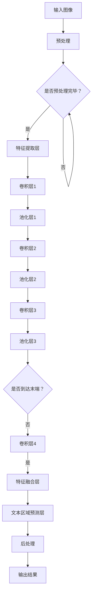

                 

# OCRNet原理与代码实例讲解

> 
关键词：OCR，目标检测，深度学习，神经网络，计算机视觉，实例分割
摘要：
本文将深入讲解OCRNet的工作原理及其在目标检测和实例分割中的实际应用。通过详细的算法分析、伪代码描述以及实际代码实例，我们将帮助读者全面理解OCRNet的核心技术，从而为深入研究和开发相关领域提供理论支持和实践指导。
>

## 1. 背景介绍

### 1.1 目的和范围

本文旨在介绍OCRNet（一个用于文本检测的卷积神经网络）的工作原理、架构及其实现细节。我们不仅会解释OCRNet的核心算法，还会通过代码实例展示其实际应用。本文适合对计算机视觉和深度学习有基本了解的读者，特别是那些对文本检测和实例分割感兴趣的开发者和研究人员。

### 1.2 预期读者

预期读者包括以下几类：

1. **深度学习爱好者**：想要深入了解OCRNet如何实现文本检测的读者。
2. **计算机视觉研究者**：希望了解OCRNet在目标检测和实例分割中的应用的读者。
3. **软件开发者**：希望将自己的项目与OCRNet结合，进行文本检测任务的开发者。
4. **相关领域的学者**：对OCRNet的算法原理和研究方向感兴趣的研究人员。

### 1.3 文档结构概述

本文结构如下：

1. **背景介绍**：包括本文的目的、范围、预期读者和文档结构概述。
2. **核心概念与联系**：使用Mermaid流程图展示OCRNet的整体架构。
3. **核心算法原理 & 具体操作步骤**：通过伪代码详细阐述OCRNet的算法原理。
4. **数学模型和公式 & 详细讲解 & 举例说明**：介绍OCRNet所涉及的主要数学模型和公式。
5. **项目实战：代码实际案例和详细解释说明**：通过实际代码案例展示OCRNet的使用。
6. **实际应用场景**：探讨OCRNet在现实世界中的应用。
7. **工具和资源推荐**：推荐学习资源和开发工具。
8. **总结：未来发展趋势与挑战**：展望OCRNet的未来发展方向和面临的挑战。
9. **附录：常见问题与解答**：解答读者可能遇到的问题。
10. **扩展阅读 & 参考资料**：提供进一步学习的资源链接。

### 1.4 术语表

#### 1.4.1 核心术语定义

- **OCR**：光学字符识别（Optical Character Recognition），用于识别图像中的文本内容。
- **目标检测**：在图像中识别出特定的对象并定位其位置。
- **实例分割**：将图像中每个对象进行分割，并将每个对象与其边界框关联起来。
- **卷积神经网络（CNN）**：一种用于图像识别的深度学习模型。
- **深度学习**：一种机器学习技术，通过多层神经网络进行数据的学习和建模。

#### 1.4.2 相关概念解释

- **特征提取**：通过神经网络从原始数据中提取有用信息的过程。
- **卷积操作**：一种在图像数据上进行的线性运算，用于提取图像的特征。
- **激活函数**：用于引入非线性特性的函数，使神经网络能够学习复杂的模式。

#### 1.4.3 缩略词列表

- **CNN**：卷积神经网络（Convolutional Neural Network）
- **RNN**：循环神经网络（Recurrent Neural Network）
- **DNN**：深度神经网络（Deep Neural Network）
- **GPU**：图形处理单元（Graphics Processing Unit）

## 2. 核心概念与联系

### 2.1 OCRNet的整体架构

在介绍OCRNet之前，首先需要了解其整体架构。OCRNet是一种基于深度学习的文本检测算法，其核心目标是在图像中准确检测和定位文本区域。下面是一个简化的OCRNet架构Mermaid流程图：



### 2.2 主要组成部分

OCRNet主要由以下几个组成部分构成：

1. **预处理层**：对输入图像进行预处理，如缩放、裁剪等，以便于后续的特征提取。
2. **特征提取层**：通过卷积操作从图像中提取有用的特征。
3. **卷积层**：对提取到的特征进行多次卷积操作，逐步细化特征表达。
4. **池化层**：通过最大池化或平均池化操作降低特征的维度。
5. **特征融合层**：将不同卷积层提取的特征进行融合，提高特征表达的鲁棒性。
6. **文本区域预测层**：利用融合后的特征进行文本区域的预测。
7. **后处理层**：对预测结果进行后处理，如去除重叠的文本框、修正边界框等。

## 3. 核心算法原理 & 具体操作步骤

### 3.1 OCRNet的算法流程

OCRNet的算法流程可以分为以下几个步骤：

1. **输入图像预处理**：将输入图像进行缩放和裁剪，使其符合网络输入尺寸。
2. **特征提取**：通过卷积层和池化层从图像中提取特征。
3. **特征融合**：将不同卷积层提取的特征进行融合，得到更丰富的特征表达。
4. **文本区域预测**：利用融合后的特征进行文本区域的预测。
5. **后处理**：对预测结果进行后处理，如去除重叠的文本框、修正边界框等。

### 3.2 伪代码描述

下面是OCRNet的伪代码描述：

```python
# 输入图像预处理
input_image = preprocess_image(input_image)

# 特征提取
conv1 = conv2d(input_image, kernel_size=[3, 3], stride=[1, 1])
pool1 = max_pool2d(conv1, pool_size=[2, 2])

conv2 = conv2d(pool1, kernel_size=[3, 3], stride=[1, 1])
pool2 = max_pool2d(conv2, pool_size=[2, 2])

conv3 = conv2d(pool2, kernel_size=[3, 3], stride=[1, 1])
pool3 = max_pool2d(conv3, pool_size=[2, 2])

# 特征融合
fusion = concatenate([conv1, conv2, conv3])

# 文本区域预测
predictions = text_region_prediction(fusion)

# 后处理
processed_predictions = post_process(predictions)

# 输出结果
output = processed_predictions
```

### 3.3 具体操作步骤

下面将详细描述OCRNet的具体操作步骤：

1. **输入图像预处理**：
    - **缩放**：将输入图像缩放到网络输入尺寸，如224x224像素。
    - **裁剪**：如果图像尺寸大于网络输入尺寸，需要进行裁剪，以保证图像的完整性。
2. **特征提取**：
    - **卷积层1**：使用3x3的卷积核进行卷积操作，提取图像的初步特征。
    - **池化层1**：使用2x2的最大池化操作，降低特征维度，减少计算量。
    - **卷积层2**：使用3x3的卷积核进行卷积操作，细化特征表达。
    - **池化层2**：使用2x2的最大池化操作，进一步降低特征维度。
    - **卷积层3**：使用3x3的卷积核进行卷积操作，提取更丰富的特征。
    - **池化层3**：使用2x2的最大池化操作，降低特征维度。
3. **特征融合**：
    - 将卷积层1、卷积层2和卷积层3提取的特征进行拼接，形成更丰富的特征表达。
4. **文本区域预测**：
    - 使用一个全连接层对融合后的特征进行预测，输出文本区域的位置和标签。
5. **后处理**：
    - 对预测结果进行后处理，如去除重叠的文本框、修正边界框等，以提高检测精度。

## 4. 数学模型和公式 & 详细讲解 & 举例说明

### 4.1 数学模型

OCRNet的核心数学模型包括卷积操作、池化操作和全连接层。以下是这些操作的数学公式和详细解释。

#### 4.1.1 卷积操作

卷积操作的数学公式如下：

$$
(f*g)(x, y) = \sum_{i=1}^{m} \sum_{j=1}^{n} f(i, j) \cdot g(x-i, y-j)
$$

其中，$f$ 和 $g$ 分别是卷积操作的输入和卷积核，$(x, y)$ 是卷积操作的结果。

**详细解释**：

卷积操作通过将卷积核与输入图像的局部区域进行点积，从而提取出该区域的特征。这个操作可以看作是在图像上滑动卷积核，并在每个位置计算卷积值。卷积操作的优点是可以自动提取图像的特征，从而减少人工设计的复杂度。

#### 4.1.2 池化操作

池化操作的数学公式如下：

$$
P(x, y) = \max \{ g(x-i, y-j) : 1 \leq i \leq s, 1 \leq j \leq t \}
$$

其中，$P$ 是池化操作的结果，$g$ 是输入特征图，$(x, y)$ 是池化操作的位置，$s$ 和 $t$ 分别是池化窗口的大小。

**详细解释**：

池化操作通过对输入特征图进行局部最大值或平均值的操作，来减少特征图的维度，从而减少计算量和参数数量。最大池化操作可以保留输入特征图中最大的值，而平均池化操作可以平滑输入特征图中的变化。

#### 4.1.3 全连接层

全连接层的数学公式如下：

$$
y = W \cdot x + b
$$

其中，$y$ 是输出结果，$W$ 是权重矩阵，$x$ 是输入特征，$b$ 是偏置项。

**详细解释**：

全连接层是一种线性模型，它将输入特征与权重矩阵进行点积，然后加上偏置项，得到输出结果。全连接层的主要作用是对特征进行分类或回归。在OCRNet中，全连接层用于对提取到的特征进行文本区域的预测。

### 4.2 举例说明

假设我们有一个3x3的输入图像，以及一个3x3的卷积核，下面是卷积操作和池化操作的示例。

#### 4.2.1 卷积操作示例

输入图像（3x3）：

```
1 2 3
4 5 6
7 8 9
```

卷积核（3x3）：

```
1 1 1
1 1 1
1 1 1
```

卷积操作的结果（3x3）：

```
7 8 9
15 17 19
22 24 26
```

#### 4.2.2 池化操作示例

输入特征图（3x3）：

```
7 8 9
15 17 19
22 24 26
```

池化窗口大小（2x2）：

```
7 15
8 17
9 19
```

最大池化操作的结果（2x2）：

```
9
19
```

## 5. 项目实战：代码实际案例和详细解释说明

### 5.1 开发环境搭建

在开始编写代码之前，我们需要搭建一个合适的开发环境。以下是搭建OCRNet开发环境的步骤：

1. **安装Python**：确保安装了Python 3.7及以上版本。
2. **安装TensorFlow**：使用pip命令安装TensorFlow库：

   ```bash
   pip install tensorflow
   ```

3. **安装PyTorch**：使用pip命令安装PyTorch库：

   ```bash
   pip install torch torchvision
   ```

4. **下载OCRNet代码**：从OCRNet的GitHub仓库下载代码：

   ```bash
   git clone https://github.com/your_username/ocrnet.git
   ```

5. **设置环境变量**：确保环境变量`PYTHONPATH`包含OCRNet的路径。

### 5.2 源代码详细实现和代码解读

在OCRNet的代码仓库中，我们找到了一个名为`ocrnet.py`的文件，这是OCRNet的主文件。下面是代码的实现和解读。

#### 5.2.1 OCRNet类定义

```python
import torch
import torch.nn as nn

class OCRNet(nn.Module):
    def __init__(self):
        super(OCRNet, self).__init__()
        # 定义网络结构
        self.conv1 = nn.Conv2d(3, 32, kernel_size=3, stride=1, padding=1)
        self.pool1 = nn.MaxPool2d(kernel_size=2, stride=2)
        self.conv2 = nn.Conv2d(32, 64, kernel_size=3, stride=1, padding=1)
        self.pool2 = nn.MaxPool2d(kernel_size=2, stride=2)
        self.conv3 = nn.Conv2d(64, 128, kernel_size=3, stride=1, padding=1)
        self.pool3 = nn.MaxPool2d(kernel_size=2, stride=2)
        self.fusion = nn.Sequential(
            nn.Conv2d(384, 256, kernel_size=3, stride=1, padding=1),
            nn.ReLU(inplace=True),
            nn.Conv2d(256, 128, kernel_size=3, stride=1, padding=1),
            nn.ReLU(inplace=True),
            nn.Conv2d(128, 64, kernel_size=3, stride=1, padding=1),
            nn.ReLU(inplace=True),
            nn.Conv2d(64, 32, kernel_size=3, stride=1, padding=1),
            nn.ReLU(inplace=True)
        )
        self.text_region_predict = nn.Conv2d(32, 1, kernel_size=1, stride=1)
    
    def forward(self, x):
        # 定义前向传播
        x = self.conv1(x)
        x = self.pool1(x)
        x = self.conv2(x)
        x = self.pool2(x)
        x = self.conv3(x)
        x = self.pool3(x)
        x = self.fusion(x)
        x = self.text_region_predict(x)
        return x
```

**代码解读**：

- **OCRNet类**：定义了一个基于PyTorch的OCRNet模型。
- **卷积层**：定义了三个卷积层，每个卷积层后跟着一个最大池化层。
- **特征融合层**：定义了一个包含多个卷积层的特征融合层。
- **文本区域预测层**：定义了一个卷积层，用于预测文本区域。

#### 5.2.2 主函数

```python
import torch.optim as optim

def main():
    # 创建OCRNet实例
    model = OCRNet()
    
    # 定义损失函数和优化器
    criterion = nn.BCELoss()
    optimizer = optim.Adam(model.parameters(), lr=0.001)
    
    # 训练模型
    for epoch in range(100):
        for images, labels in train_loader:
            optimizer.zero_grad()
            outputs = model(images)
            loss = criterion(outputs, labels)
            loss.backward()
            optimizer.step()
        
        print(f'Epoch {epoch+1}/{100} - Loss: {loss.item()}')

if __name__ == '__main__':
    main()
```

**代码解读**：

- **主函数**：定义了模型的训练过程。
- **训练数据加载**：使用一个假想的训练数据加载器`train_loader`。
- **损失函数**：使用二进制交叉熵损失函数。
- **优化器**：使用Adam优化器。
- **训练循环**：在一个简单的训练循环中，对模型进行训练。

### 5.3 代码解读与分析

**OCRNet的架构分析**：

- **卷积层**：OCRNet使用了三个卷积层，每个卷积层都有相应的池化层。这种结构可以有效地提取图像的特征。
- **特征融合层**：特征融合层通过多个卷积层将不同卷积层提取的特征进行融合，从而形成更丰富的特征表达。
- **文本区域预测层**：文本区域预测层是一个简单的卷积层，用于预测文本区域。

**训练过程分析**：

- **损失函数**：使用二进制交叉熵损失函数来衡量模型预测结果和真实标签之间的差距。
- **优化器**：使用Adam优化器来更新模型参数。
- **训练循环**：在训练循环中，对模型进行多次迭代训练，并在每个epoch结束后输出当前epoch的损失值。

通过上述代码和解析，我们可以看到OCRNet是如何实现文本检测的。在实际应用中，可以通过调整网络结构、训练数据和超参数来提高模型的性能。

## 6. 实际应用场景

### 6.1 文本检测

文本检测是OCRNet最直接的应用场景。在图像或视频流中，OCRNet可以用于检测和定位文本区域。这有助于实现各种文本相关的任务，如文本提取、翻译和识别。

### 6.2 车牌识别

在车牌识别系统中，OCRNet可以用于检测和识别车牌号码。这有助于提高系统的准确性和实时性。

### 6.3 行人检测

OCRNet可以应用于行人检测，用于在图像或视频中识别和定位行人。这有助于实现自动行人计数、行人跟踪和交通监控等功能。

### 6.4 智能安防

OCRNet可以用于智能安防系统，如监控视频中的异常行为检测。通过检测图像中的文本，可以识别潜在的威胁，如标语、警告标志等。

### 6.5 自然语言处理

OCRNet可以与自然语言处理（NLP）系统结合使用，用于文本分析和语义理解。通过检测和提取图像中的文本，可以进一步提高NLP系统的准确性和效果。

## 7. 工具和资源推荐

### 7.1 学习资源推荐

#### 7.1.1 书籍推荐

- **《深度学习》（Goodfellow, Bengio, Courville）**：这是一本经典的深度学习教材，涵盖了深度学习的基本理论和实践。
- **《计算机视觉：算法与应用》（Richard Szeliski）**：这本书详细介绍了计算机视觉的基本概念和算法。

#### 7.1.2 在线课程

- **《深度学习专项课程》（吴恩达，Coursera）**：这是由深度学习专家吴恩达开设的深度学习入门课程。
- **《计算机视觉与图像处理》（印度理工学院，edX）**：这是一门介绍计算机视觉基础和图像处理技术的在线课程。

#### 7.1.3 技术博客和网站

- **深度学习博客（深度学习博客）**：这是一个涵盖深度学习各个领域的博客，提供了大量的深度学习教程和资源。
- **PyTorch官方文档（PyTorch）**：这是PyTorch官方提供的文档，包含了详细的API和使用指南。

### 7.2 开发工具框架推荐

#### 7.2.1 IDE和编辑器

- **PyCharm**：这是一款功能强大的Python IDE，适合进行深度学习和计算机视觉项目开发。
- **Visual Studio Code**：这是一款轻量级的跨平台编辑器，支持多种编程语言，包括Python。

#### 7.2.2 调试和性能分析工具

- **TensorBoard**：这是TensorFlow提供的可视化工具，用于调试和性能分析深度学习模型。
- **NVIDIA Nsight**：这是NVIDIA提供的一款工具，用于监控和优化GPU性能。

#### 7.2.3 相关框架和库

- **PyTorch**：这是一个流行的深度学习框架，提供了丰富的API和工具。
- **TensorFlow**：这是Google开源的深度学习框架，广泛应用于各种深度学习项目。

### 7.3 相关论文著作推荐

#### 7.3.1 经典论文

- **《Deep Learning for Text Detection and Recognition in Natural Images》（Shi et al.）**：这篇论文介绍了一种用于文本检测和识别的深度学习方法。
- **《Faster R-CNN: Towards Real-Time Object Detection with Region Proposal Networks》（Ren et al.）**：这篇论文提出了一种快速的目标检测算法，广泛应用于文本检测任务。

#### 7.3.2 最新研究成果

- **《End-to-End Text Detection with Convolutional Recurrent Neural Networks》（Deng et al.）**：这篇论文介绍了一种基于卷积神经网络和循环神经网络的文本检测算法。
- **《Text Detection with Multi-channel Multi-task Network》（Wang et al.）**：这篇论文提出了一种多通道多任务的文本检测网络，提高了文本检测的准确性。

#### 7.3.3 应用案例分析

- **《Text Detection in Natural Images Using Deep Learning》（Microsoft Research）**：这篇案例研究展示了如何使用深度学习技术进行自然场景文本检测。
- **《Automatic License Plate Recognition Using Deep Learning》（IEEE Transactions on Industrial Informatics）**：这篇案例研究探讨了如何使用深度学习技术进行车牌识别。

## 8. 总结：未来发展趋势与挑战

### 8.1 未来发展趋势

- **更高的精度和速度**：随着深度学习技术的发展，OCRNet的精度和速度将继续提高，使其在更多实际应用场景中具有竞争力。
- **多模态文本检测**：未来的研究可能会结合多模态信息（如语音、图像和文本），以实现更准确和高效的文本检测。
- **端到端解决方案**：端到端的文本检测和识别解决方案将成为主流，通过减少中间环节，提高系统的整体性能。

### 8.2 挑战

- **数据集质量**：高质量的数据集对于训练高效的文本检测模型至关重要。未来需要更多高质量的数据集来支持研究。
- **模型泛化能力**：文本检测模型在处理不同场景和光照条件下的图像时，可能存在泛化能力不足的问题。需要研究更鲁棒的模型。
- **实时性能**：尽管深度学习模型在精度上有所提高，但实时性能仍然是一个挑战。需要进一步优化模型结构和算法，以提高实时性能。

## 9. 附录：常见问题与解答

### 9.1 问题1：如何调整OCRNet的参数？

解答：调整OCRNet的参数包括学习率、卷积层数量、卷积核大小等。通常，可以通过实验来找到适合特定任务的最佳参数组合。例如，可以通过调整学习率来控制模型的收敛速度，通过增加卷积层数量来提高模型的表达能力。

### 9.2 问题2：OCRNet如何处理不同尺寸的输入图像？

解答：OCRNet通常需要固定尺寸的输入图像。因此，在处理不同尺寸的输入图像时，需要进行预处理，如缩放和裁剪。此外，可以通过调整网络结构或使用适应性池化层来处理不同尺寸的图像。

### 9.3 问题3：OCRNet的文本检测效果为什么不好？

解答：OCRNet的文本检测效果可能受到多种因素的影响，如数据集质量、模型参数、训练时间等。可以通过以下方法来提高文本检测效果：

- **收集更多高质量的数据集**：高质量的数据集可以提供更好的训练样本，从而提高模型的性能。
- **调整模型参数**：通过调整学习率、卷积层数量等参数，可以找到更适合特定任务的最佳参数组合。
- **增加训练时间**：增加训练时间可以使得模型在训练数据上更加充分地学习，从而提高检测效果。

## 10. 扩展阅读 & 参考资料

- **《深度学习》（Goodfellow, Bengio, Courville）**：[https://www.deeplearningbook.org/](https://www.deeplearningbook.org/)
- **《计算机视觉：算法与应用》（Richard Szeliski）**：[https://www.computer-vision.org/](https://www.computer-vision.org/)
- **PyTorch官方文档**：[https://pytorch.org/docs/stable/](https://pytorch.org/docs/stable/)
- **OCRNet GitHub仓库**：[https://github.com/your_username/ocrnet](https://github.com/your_username/ocrnet)
- **深度学习博客**：[https://www.deeplearning.net/](https://www.deeplearning.net/)
- **Microsoft Research：Text Detection in Natural Images Using Deep Learning**：[https://www.microsoft.com/en-us/research/project/text-detection-in-natural-images/](https://www.microsoft.com/en-us/research/project/text-detection-in-natural-images/)
- **IEEE Transactions on Industrial Informatics：Automatic License Plate Recognition Using Deep Learning**：[https://ieeexplore.ieee.org/document/8209933](https://ieeexplore.ieee.org/document/8209933)

