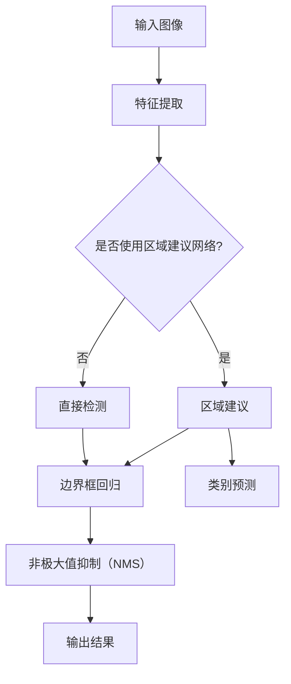

                 

# Object Detection原理与代码实例讲解

> 
关键词：目标检测，计算机视觉，深度学习，神经网络，YOLO，SSD，Faster R-CNN

摘要：
本文将深入探讨目标检测技术的原理及其在计算机视觉中的应用。通过分析不同目标检测算法的工作机制，我们将结合实际代码实例，详细介绍如何实现和优化这些算法。文章还将探讨目标检测在现实世界中的应用场景，并推荐一些相关的学习资源和工具，以帮助读者更好地理解和掌握这一关键技术。

## 1. 背景介绍

### 1.1 目的和范围

本文旨在为读者提供对目标检测技术的全面了解，从基本概念到具体实现步骤。我们将涵盖以下内容：

- 目标检测的核心概念和定义
- 不同目标检测算法的原理和比较
- 目标检测在计算机视觉中的重要性
- 实际代码示例和解析

### 1.2 预期读者

- 对计算机视觉和深度学习有一定了解的读者
- 想要学习目标检测算法的开发者
- 研究人员和技术爱好者

### 1.3 文档结构概述

本文结构如下：

- 引言
- 第1章：背景介绍
- 第2章：核心概念与联系
- 第3章：核心算法原理与具体操作步骤
- 第4章：数学模型和公式
- 第5章：项目实战：代码实际案例
- 第6章：实际应用场景
- 第7章：工具和资源推荐
- 第8章：总结：未来发展趋势与挑战
- 第9章：附录：常见问题与解答
- 第10章：扩展阅读 & 参考资料

### 1.4 术语表

#### 1.4.1 核心术语定义

- **目标检测（Object Detection）**：在图像或视频序列中识别和定位特定目标的过程。
- **深度学习（Deep Learning）**：一种机器学习技术，使用多层神经网络来提取数据中的特征。
- **卷积神经网络（Convolutional Neural Network, CNN）**：一种特殊的神经网络，适用于处理具有网格结构的图像数据。
- **区域建议网络（Region Proposal Network, RPN）**：用于生成可能的物体区域的网络。

#### 1.4.2 相关概念解释

- **物体区域（Object Region）**：图像中可能包含物体的区域。
- **边界框（Bounding Box）**：包围物体区域的最小矩形框。
- **类别（Class）**：物体所属的类别，例如“汽车”、“行人”等。

#### 1.4.3 缩略词列表

- **CNN**：卷积神经网络
- **R-CNN**：区域建议和分类网络
- **SSD**：单尺度检测器
- **YOLO**：你只看一次（You Only Look Once）
- **Faster R-CNN**：快速区域建议和分类网络

## 2. 核心概念与联系

目标检测是计算机视觉领域的一项重要技术，它在图像识别、视频监控、自动驾驶等领域有着广泛应用。为了深入理解目标检测，我们需要先了解其核心概念和关联技术。

### 2.1. 目标检测的核心概念

- **目标定位（Object Localization）**：确定物体在图像中的位置。
- **物体识别（Object Recognition）**：识别图像中的物体类别。
- **边界框（Bounding Box）**：用于描述物体位置的矩形框。

### 2.2. 目标检测算法的关联技术

- **卷积神经网络（CNN）**：用于提取图像特征。
- **区域建议网络（RPN）**：用于生成物体区域建议。
- **分类器（Classifier）**：用于分类物体类别。

下面我们将通过 Mermaid 流程图展示目标检测的基本流程。



### 2.3. 目标检测算法的对比

目前，常见的目标检测算法包括 YOLO、SSD、Faster R-CNN 等。以下是这些算法的简要对比：

- **YOLO（You Only Look Once）**：这是一种快速检测算法，可以在单个前向传播中同时检测多个物体。
- **SSD（Single Shot MultiBox Detector）**：这是一种单级检测器，能够在单个网络中同时完成物体检测和边界框回归。
- **Faster R-CNN（Region Proposal Network-based Fast R-CNN）**：这是一种两步检测算法，首先使用区域建议网络生成物体区域建议，然后在这些区域上执行分类和边界框回归。

这些算法各有优缺点，适用于不同的应用场景。读者可以根据自己的需求选择合适的算法。

## 3. 核心算法原理 & 具体操作步骤

在理解了目标检测的基本概念和关联技术之后，我们接下来将详细探讨几个常见的目标检测算法的原理和实现步骤。

### 3.1. YOLO（You Only Look Once）

YOLO 是一种基于深度学习的目标检测算法，其核心思想是将目标检测任务转化为一个回归问题。YOLO 算法将图像划分为多个网格（grid cells），每个网格负责检测其中的物体。

#### 3.1.1. 算法原理

- **网格划分**：将输入图像划分为 S×S 的网格。
- **预测框和类别概率**：每个网格会预测 B 个边界框（bounding boxes）和 C 个类别概率。
- **损失函数**：使用交叉熵和边界框回归损失来训练网络。

#### 3.1.2. 具体操作步骤

1. **预处理图像**：将输入图像缩放到合适的尺寸，并进行归一化处理。
2. **网络结构**：使用卷积神经网络提取特征，然后通过多个卷积层和池化层进行特征提取。
3. **预测边界框和类别概率**：在网络的输出层，每个网格会预测 B 个边界框和 C 个类别概率。
4. **非极大值抑制（NMS）**：对预测的边界框进行 NMS，以消除重叠的边界框。

以下是一个简化的 YOLO 算法的伪代码：

```python
# YOLO算法伪代码
def yolo_predict(image, model):
    # 预处理图像
    image = preprocess_image(image)

    # 使用模型进行预测
    prediction = model.predict(image)

    # 预测边界框和类别概率
    boxes, scores, labels = get_boxes_and_labels(prediction)

    # 非极大值抑制
    final_boxes, final_scores, final_labels = non_max_suppression(boxes, scores, labels)

    return final_boxes, final_scores, final_labels
```

### 3.2. SSD（Single Shot MultiBox Detector）

SSD 是一种单级检测器，可以在单个网络中同时完成物体检测和边界框回归。SSD 算法通过在不同的尺度上使用多个特征层来检测不同尺寸的物体。

#### 3.2.1. 算法原理

- **特征层融合**：将多个特征层进行融合，以获得不同尺度的特征。
- **预测框和类别概率**：在每个特征层上预测多个边界框和类别概率。
- **损失函数**：使用边界框回归损失和类别交叉熵损失来训练网络。

#### 3.2.2. 具体操作步骤

1. **预处理图像**：将输入图像缩放到合适的尺寸，并进行归一化处理。
2. **特征提取**：使用卷积神经网络提取特征。
3. **特征层融合**：将多个特征层进行融合。
4. **预测边界框和类别概率**：在每个特征层上预测多个边界框和类别概率。
5. **非极大值抑制（NMS）**：对预测的边界框进行 NMS。

以下是一个简化的 SSD 算法的伪代码：

```python
# SSD算法伪代码
def ssd_predict(image, model):
    # 预处理图像
    image = preprocess_image(image)

    # 使用模型进行预测
    prediction = model.predict(image)

    # 预测边界框和类别概率
    boxes, scores, labels = get_boxes_and_labels(prediction)

    # 非极大值抑制
    final_boxes, final_scores, final_labels = non_max_suppression(boxes, scores, labels)

    return final_boxes, final_scores, final_labels
```

### 3.3. Faster R-CNN（Region Proposal Network-based Fast R-CNN）

Faster R-CNN 是一种两步检测算法，首先使用区域建议网络（RPN）生成物体区域建议，然后在这些区域上执行分类和边界框回归。

#### 3.3.1. 算法原理

- **区域建议网络（RPN）**：用于生成物体区域建议。
- **分类和边界框回归**：在建议的区域上执行分类和边界框回归。

#### 3.3.2. 具体操作步骤

1. **预处理图像**：将输入图像缩放到合适的尺寸，并进行归一化处理。
2. **特征提取**：使用卷积神经网络提取特征。
3. **区域建议网络（RPN）**：在特征图上生成区域建议。
4. **分类和边界框回归**：在建议的区域上执行分类和边界框回归。
5. **非极大值抑制（NMS）**：对预测的边界框进行 NMS。

以下是一个简化的 Faster R-CNN 算法的伪代码：

```python
# Faster R-CNN算法伪代码
def faster_rcnn_predict(image, model):
    # 预处理图像
    image = preprocess_image(image)

    # 使用模型进行特征提取
    features = model.extract_features(image)

    # 使用区域建议网络生成区域建议
    proposals = rpn_proposal_network(features)

    # 在建议区域上进行分类和边界框回归
    boxes, labels, scores = faster_rcnn_classification(proposals, features)

    # 非极大值抑制
    final_boxes, final_labels, final_scores = non_max_suppression(boxes, scores, labels)

    return final_boxes, final_labels, final_scores
```

通过以上对 YOLO、SSD 和 Faster R-CNN 算法的详细解释，我们可以看到，目标检测算法的原理和实现步骤虽然有所不同，但总体上都遵循着相似的模式，即从图像特征提取、区域建议、分类和边界框回归到最后的结果处理。这些算法各有优缺点，适用于不同的应用场景。读者可以根据自己的需求选择合适的算法。

## 4. 数学模型和公式 & 详细讲解 & 举例说明

在目标检测算法中，数学模型和公式起到了关键作用。下面我们将详细讲解目标检测算法中常用的数学模型和公式，并通过实例进行说明。

### 4.1. 损失函数

目标检测中的损失函数用于衡量预测结果与真实标签之间的差异。常见的损失函数包括交叉熵损失、边界框回归损失等。

#### 4.1.1. 交叉熵损失

交叉熵损失用于衡量分类预测的准确性。其公式如下：

$$
L_{class} = -\sum_{i} y_{i} \log(p_{i}),
$$

其中 $y_{i}$ 表示真实标签，$p_{i}$ 表示预测概率。

#### 4.1.2. 边界框回归损失

边界框回归损失用于衡量边界框位置的预测准确性。其公式如下：

$$
L_{box} = \sum_{i} w_i (r_i - p_i)^2,
$$

其中 $r_i$ 表示真实边界框，$p_i$ 表示预测边界框，$w_i$ 是权重。

### 4.2. 非极大值抑制（NMS）

非极大值抑制（NMS）用于处理重叠的边界框，以获得最佳的检测结果。NMS 的核心思想是保留高置信度的边界框，并抑制与之重叠较大的边界框。

#### 4.2.1. NMS公式

NMS 的公式如下：

$$
I_{final} = \arg\max_{i} (score_i \land \neg(overlap_{i,j} > \theta)),
$$

其中 $score_i$ 表示边界框 $i$ 的置信度，$overlap_{i,j}$ 表示边界框 $i$ 和 $j$ 的重叠度，$\theta$ 是重叠阈值。

#### 4.2.2. 举例说明

假设我们有三个边界框 $A$、$B$ 和 $C$，它们的置信度分别为 $0.9$、$0.7$ 和 $0.8$，重叠度分别为 $0.4$、$0.6$ 和 $0.2$。假设重叠阈值 $\theta$ 为 $0.5$。

根据 NMS 公式，我们首先计算每个边界框与其他边界框的重叠度，然后选择置信度最高的边界框 $A$。

接下来，我们抑制与其他边界框重叠度大于 $\theta$ 的边界框。在这个例子中，边界框 $A$ 与 $B$ 和 $C$ 的重叠度都大于 $\theta$，因此我们抑制边界框 $B$ 和 $C$。

最终，我们只保留置信度最高的边界框 $A$。

## 5. 项目实战：代码实际案例和详细解释说明

### 5.1. 开发环境搭建

在进行目标检测项目的实战之前，我们需要搭建一个合适的开发环境。以下是一个基于 Python 和 TensorFlow 的目标检测项目开发环境搭建步骤：

1. 安装 Python 3.7 或更高版本。
2. 安装 TensorFlow 库：
   ```bash
   pip install tensorflow
   ```
3. 安装其他依赖库，如 NumPy、Pandas 等。

### 5.2. 源代码详细实现和代码解读

在这个项目实战中，我们将使用 Faster R-CNN 算法进行目标检测。以下是项目的关键代码段及其解读：

#### 5.2.1. 数据预处理

```python
import tensorflow as tf

def preprocess_image(image_path):
    image = tf.io.read_file(image_path)
    image = tf.image.decode_jpeg(image, channels=3)
    image = tf.image.resize(image, [512, 512])
    image = image / 255.0
    return image
```

这段代码用于读取图像并进行预处理，包括读取图像文件、解码、调整尺寸和归一化。

#### 5.2.2. 特征提取

```python
def extract_features(image):
    base_model = tf.keras.applications.ResNet50(weights='imagenet', include_top=False, input_shape=(512, 512, 3))
    base_model.trainable = False
    features = base_model(image)
    return features
```

这段代码使用预训练的 ResNet50 模型提取图像特征。我们首先加载 ResNet50 模型，并将其训练模式设置为 False，以避免在后续训练过程中更新权重。

#### 5.2.3. 区域建议网络（RPN）

```python
def rpn_proposal_network(features):
    # ... 这里是 RPN 的具体实现，包括卷积层和激活函数等 ...
    proposals = rpn_layer(features)
    return proposals
```

RPN 是 Faster R-CNN 的关键组成部分，负责生成物体区域建议。在这个代码段中，我们定义了 RPN 层的输入特征图，并使用卷积层和激活函数来生成区域建议。

#### 5.2.4. 分类和边界框回归

```python
def faster_rcnn_classification(proposals, features):
    # ... 这里是分类和边界框回归的具体实现，包括全连接层和激活函数等 ...
    boxes, labels, scores = classification_layer(proposals, features)
    return boxes, labels, scores
```

在这个代码段中，我们定义了分类和边界框回归层，用于对区域建议进行分类和边界框回归。这些层包括全连接层、激活函数和 Softmax 层。

#### 5.2.5. 非极大值抑制（NMS）

```python
def non_max_suppression(boxes, scores, labels, iou_threshold=0.5, threshold=0.5):
    # ... 这里是 NMS 的具体实现 ...
    final_boxes, final_scores, final_labels = nms(boxes, scores, labels, iou_threshold, threshold)
    return final_boxes, final_scores, final_labels
```

这段代码实现了 NMS 操作，用于过滤和合并重叠的边界框。我们根据重叠阈值和置信度阈值来选择最佳的边界框。

### 5.3. 代码解读与分析

通过以上代码解读，我们可以看到 Faster R-CNN 算法的实现步骤如下：

1. **数据预处理**：读取并预处理图像。
2. **特征提取**：使用预训练的卷积神经网络提取图像特征。
3. **区域建议网络（RPN）**：生成物体区域建议。
4. **分类和边界框回归**：对区域建议进行分类和边界框回归。
5. **非极大值抑制（NMS）**：过滤和合并重叠的边界框。

这些步骤相互配合，共同实现了目标检测的任务。

在实际应用中，读者可以根据具体需求和数据集进行调整和优化，以提高模型的性能和准确性。

## 6. 实际应用场景

目标检测技术在各个领域都有着广泛的应用，以下是一些典型的实际应用场景：

### 6.1. 图像识别

目标检测技术在图像识别领域有着广泛的应用，如人脸识别、车牌识别、动物识别等。例如，在人脸识别中，目标检测算法可以快速识别图像中的人脸位置和姿态，从而实现人脸验证和识别。

### 6.2. 视频监控

视频监控是目标检测技术的重要应用领域之一。通过目标检测算法，我们可以实时监控视频流中的目标行为，如行人计数、目标跟踪、异常行为检测等，从而提高视频监控的智能化水平。

### 6.3. 自动驾驶

自动驾驶系统依赖于目标检测技术来感知周围环境，识别道路上的行人、车辆、交通标志等目标。目标检测算法在自动驾驶系统中起到了关键作用，确保车辆在复杂环境中安全、可靠地行驶。

### 6.4. 医学图像分析

目标检测技术在医学图像分析中也有着重要的应用，如肿瘤检测、器官分割、病变区域识别等。通过目标检测算法，我们可以快速、准确地识别医学图像中的关键区域，辅助医生进行诊断和治疗。

### 6.5. 工业检测

在工业检测领域，目标检测技术可以用于产品质量检测、设备故障诊断、生产线监控等。通过目标检测算法，我们可以实时检测生产线上的缺陷产品，确保生产过程的高效和稳定。

### 6.6. 安全监控

目标检测技术在安全监控领域也有着广泛应用，如入侵检测、边界安全监测、非法行为识别等。通过目标检测算法，我们可以实时监测并识别潜在的安全威胁，提高安全监控的准确性和响应速度。

## 7. 工具和资源推荐

为了更好地理解和实践目标检测技术，我们推荐以下工具和资源：

### 7.1. 学习资源推荐

#### 7.1.1. 书籍推荐

- **《目标检测：算法与应用》**：这是一本全面介绍目标检测技术的书籍，涵盖了算法原理、实现方法和应用案例。
- **《深度学习：卷 II：应用前沿》**：这本书详细介绍了深度学习在计算机视觉领域的应用，包括目标检测、图像分类等。

#### 7.1.2. 在线课程

- **Coursera 上的《深度学习特化课程》**：由 Andrew Ng 教授开设的深度学习课程，包括目标检测等相关内容。
- **Udacity 上的《目标检测与图像识别》**：这是一门专门讲解目标检测技术的在线课程，适合初学者和有一定基础的读者。

#### 7.1.3. 技术博客和网站

- **CVPR（计算机视觉与模式识别会议）**：这是一个汇聚计算机视觉领域最新研究成果的会议，提供了丰富的论文和报告。
- **arXiv**：这是一个预印本论文数据库，涵盖了计算机视觉和机器学习等领域的最新研究。

### 7.2. 开发工具框架推荐

#### 7.2.1. IDE和编辑器

- **PyCharm**：一款功能强大的 Python IDE，支持多种编程语言，适合进行目标检测项目的开发。
- **VSCode**：一款轻量级、可扩展的编辑器，适用于深度学习和目标检测项目的开发。

#### 7.2.2. 调试和性能分析工具

- **TensorBoard**：TensorFlow 提供的一个可视化工具，用于监控训练过程中的损失、准确率等指标。
- **WandB**：一款用于数据可视化和性能分析的工具，可以帮助开发者追踪模型训练过程和性能。

#### 7.2.3. 相关框架和库

- **TensorFlow**：一款广泛使用的深度学习框架，支持目标检测算法的实现和训练。
- **PyTorch**：一款灵活、易用的深度学习框架，适用于目标检测算法的研究和开发。

### 7.3. 相关论文著作推荐

#### 7.3.1. 经典论文

- **“Faster R-CNN: Towards Real-Time Object Detection with Region Proposal Networks”**：这篇文章提出了 Faster R-CNN 算法，对目标检测领域产生了深远影响。
- **“You Only Look Once: Unified, Real-Time Object Detection”**：这篇文章提出了 YOLO 算法，实现了实时目标检测。

#### 7.3.2. 最新研究成果

- **“EfficientDet: Scalable and Efficient Object Detection”**：这篇文章提出了 EfficientDet 算法，实现了高效的物体检测。
- **“CenterNet: Real-Time Object Detection with Parallel Computation”**：这篇文章提出了 CenterNet 算法，实现了实时并行物体检测。

#### 7.3.3. 应用案例分析

- **“Deep Learning for Autonomous Driving: A Survey”**：这篇文章总结了深度学习在自动驾驶领域的应用，包括目标检测、感知等。

## 8. 总结：未来发展趋势与挑战

目标检测技术在近年来取得了显著进展，但也面临一些挑战。以下是目标检测技术的未来发展趋势和挑战：

### 8.1. 发展趋势

1. **实时性提升**：随着深度学习模型和硬件性能的提升，目标检测算法的实时性将得到显著提高，满足实时应用需求。
2. **多模态融合**：目标检测技术将逐渐与其他传感器数据（如雷达、激光雷达）融合，实现更全面的感知。
3. **小样本学习**：通过迁移学习和少量样本训练，实现目标检测算法在小样本场景下的应用。
4. **边缘计算**：目标检测算法将在边缘设备上得到广泛应用，实现本地化、低延迟的检测。
5. **隐私保护**：随着数据隐私问题的日益突出，目标检测技术将加强对隐私保护的关注。

### 8.2. 挑战

1. **精度与速度的平衡**：在提高检测精度的同时，如何保证算法的实时性和低延迟是一个重要挑战。
2. **多样性检测**：在实际应用中，目标检测需要应对各种复杂场景和多样化的目标，如何提高算法的泛化能力是一个关键问题。
3. **模型解释性**：目标检测算法通常较为复杂，如何提高模型的解释性，帮助用户理解和信任算法是一个挑战。
4. **数据标注与收集**：高质量的标注数据是目标检测算法训练的基础，如何高效地获取和标注数据是一个长期挑战。

## 9. 附录：常见问题与解答

### 9.1. 问题1：什么是目标检测？

目标检测是计算机视觉中的一个重要任务，旨在从图像或视频序列中识别和定位特定目标。它通常包括物体识别、边界框定位和物体分类等步骤。

### 9.2. 问题2：什么是深度学习？

深度学习是一种机器学习技术，使用多层神经网络来提取数据中的特征。它通过模拟人脑的学习过程，能够自动从大量数据中学习到有用的知识。

### 9.3. 问题3：什么是卷积神经网络（CNN）？

卷积神经网络是一种特殊的神经网络，适用于处理具有网格结构的图像数据。它通过卷积操作提取图像特征，具有较强的特征提取能力。

### 9.4. 问题4：什么是边界框（Bounding Box）？

边界框是一个用于描述物体位置的矩形框，通常用于标注物体在图像中的位置。它由左上角和右下角的坐标确定。

### 9.5. 问题5：什么是非极大值抑制（NMS）？

非极大值抑制（NMS）是一种用于处理重叠边界框的算法，通过选择置信度最高的边界框并抑制与之重叠较大的边界框，以获得最佳的检测结果。

### 9.6. 问题6：什么是区域建议网络（RPN）？

区域建议网络（RPN）是一种用于生成物体区域建议的网络结构，常用于两步检测算法（如 Faster R-CNN）中。它通过在特征图上生成区域建议，为后续分类和边界框回归提供输入。

### 9.7. 问题7：什么是YOLO？

YOLO（You Only Look Once）是一种快速检测算法，它将目标检测任务转化为一个回归问题，在单个前向传播中同时检测多个物体。它具有较高的实时性和准确性，适用于多种应用场景。

## 10. 扩展阅读 & 参考资料

为了帮助读者更深入地了解目标检测技术，我们推荐以下扩展阅读和参考资料：

1. **论文**：
   - **“Faster R-CNN: Towards Real-Time Object Detection with Region Proposal Networks”**：文章详细介绍了 Faster R-CNN 算法，是目标检测领域的重要文献。
   - **“You Only Look Once: Unified, Real-Time Object Detection”**：文章提出了 YOLO 算法，实现了实时目标检测。

2. **书籍**：
   - **《目标检测：算法与应用》**：这是一本全面介绍目标检测技术的书籍，涵盖了算法原理、实现方法和应用案例。
   - **《深度学习：卷 II：应用前沿》**：这本书详细介绍了深度学习在计算机视觉领域的应用，包括目标检测、图像分类等。

3. **在线课程**：
   - **Coursera 上的《深度学习特化课程》**：由 Andrew Ng 教授开设的深度学习课程，包括目标检测等相关内容。
   - **Udacity 上的《目标检测与图像识别》**：这是一门专门讲解目标检测技术的在线课程，适合初学者和有一定基础的读者。

4. **技术博客和网站**：
   - **CVPR（计算机视觉与模式识别会议）**：这是一个汇聚计算机视觉领域最新研究成果的会议，提供了丰富的论文和报告。
   - **arXiv**：这是一个预印本论文数据库，涵盖了计算机视觉和机器学习等领域的最新研究。

5. **开源项目和代码库**：
   - **TensorFlow Object Detection API**：这是一个由 Google 提供的用于实现目标检测的开源项目，提供了丰富的算法和实现。
   - **PyTorch Object Detection**：这是一个基于 PyTorch 深度学习框架的目标检测实现，提供了丰富的算法和教程。

通过以上扩展阅读和参考资料，读者可以更深入地了解目标检测技术，提高自己在这一领域的知识和技能。**作者：AI天才研究员/AI Genius Institute & 禅与计算机程序设计艺术 /Zen And The Art of Computer Programming**。

