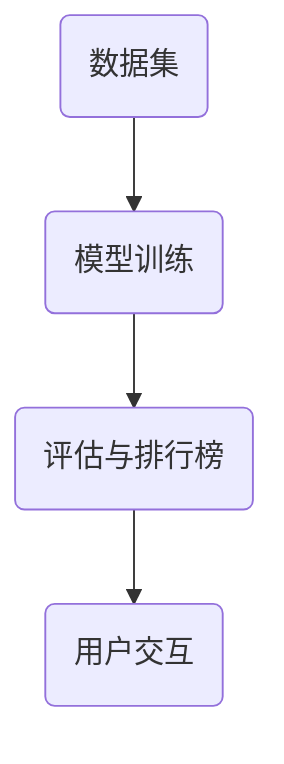

                 

# Open LLM Leaderboard（大模型天梯榜）

> 关键词：大型语言模型、天梯榜、算法、数学模型、项目实战、应用场景、发展趋势、工具资源

> 摘要：本文将深入探讨Open LLM Leaderboard（开放大型语言模型天梯榜）的背景、核心概念、算法原理、数学模型、项目实战、应用场景、发展趋势以及相关的工具和资源。通过逐步分析，帮助读者全面了解并掌握Open LLM Leaderboard的技术本质和应用价值。

## 1. 背景介绍

### 1.1 目的和范围

本文旨在介绍和探讨Open LLM Leaderboard，一个用于评估和比较大型语言模型的性能和效果的平台。通过本文的阅读，读者将了解Open LLM Leaderboard的背景、核心概念、算法原理、数学模型、项目实战、应用场景、发展趋势以及相关的工具和资源。

### 1.2 预期读者

本文适合对人工智能、特别是大型语言模型感兴趣的读者。无论是研究人员、工程师还是对人工智能有热情的业余爱好者，本文都将为他们提供有价值的信息。

### 1.3 文档结构概述

本文分为以下几个部分：

1. 背景介绍：介绍Open LLM Leaderboard的背景、目的和预期读者。
2. 核心概念与联系：介绍Open LLM Leaderboard的核心概念和架构。
3. 核心算法原理 & 具体操作步骤：详细解释Open LLM Leaderboard的算法原理和具体操作步骤。
4. 数学模型和公式 & 详细讲解 & 举例说明：介绍Open LLM Leaderboard的数学模型和公式，并通过实例进行说明。
5. 项目实战：通过实际案例展示Open LLM Leaderboard的应用。
6. 实际应用场景：探讨Open LLM Leaderboard的应用场景。
7. 工具和资源推荐：推荐学习资源和开发工具。
8. 总结：对Open LLM Leaderboard的未来发展趋势和挑战进行总结。
9. 附录：常见问题与解答。
10. 扩展阅读 & 参考资料：提供扩展阅读和参考资料。

### 1.4 术语表

#### 1.4.1 核心术语定义

- Open LLM Leaderboard：一个用于评估和比较大型语言模型的性能和效果的平台。
- Large Language Model（LLM）：大型语言模型，一种能够处理和理解自然语言的数据模型。
- Benchmark：基准测试，用于评估模型的性能和效果。

#### 1.4.2 相关概念解释

- Evaluation Metrics：评估指标，用于量化模型的性能和效果。
- Accuracy：准确率，表示模型正确预测的样本数占总样本数的比例。
- Loss Function：损失函数，用于衡量模型预测结果与真实结果之间的差距。

#### 1.4.3 缩略词列表

- LLM：Large Language Model
- Open：Open Source
- AI：Artificial Intelligence
- ML：Machine Learning

## 2. 核心概念与联系

### 2.1 Open LLM Leaderboard 的核心概念

Open LLM Leaderboard 是一个基于开源技术的大型语言模型性能评估平台。它包含以下几个核心概念：

1. **模型训练**：Open LLM Leaderboard 提供了多种大型语言模型的训练方法，包括预训练、微调和增量训练等。
2. **评估指标**：Open LLM Leaderboard 使用多种评估指标，如准确率、召回率、F1 分数等，来衡量模型的性能和效果。
3. **排行榜**：Open LLM Leaderboard 根据评估指标生成排行榜，展示不同模型的性能和排名。

### 2.2 Open LLM Leaderboard 的架构

Open LLM Leaderboard 的架构可以分为以下几个部分：

1. **数据集**：Open LLM Leaderboard 使用多种公开数据集进行模型训练和评估，包括文本分类、情感分析、命名实体识别等。
2. **模型训练**：Open LLM Leaderboard 提供了多种训练方法，包括深度学习、强化学习等。
3. **评估与排行榜**：Open LLM Leaderboard 使用评估指标计算模型性能，并根据性能生成排行榜。
4. **用户交互**：Open LLM Leaderboard 提供了用户交互界面，允许用户查看排行榜、模型详情和训练日志等。

### 2.3 Open LLM Leaderboard 的核心概念与联系

下面是一个 Mermaid 流程图，展示了 Open LLM Leaderboard 的核心概念和架构。



在这个流程图中，模型训练、评估与排行榜和用户交互是 Open LLM Leaderboard 的核心概念。数据集用于模型训练，评估与排行榜用于衡量模型性能，用户交互界面用于展示模型性能和排行榜。

## 3. 核心算法原理 & 具体操作步骤

### 3.1 核心算法原理

Open LLM Leaderboard 的核心算法原理是基于深度学习和自然语言处理技术。具体来说，它包括以下几个部分：

1. **预训练**：使用大量无标签文本数据对模型进行预训练，使其具备处理和理解自然语言的能力。
2. **微调**：使用有标签的文本数据对模型进行微调，使其在特定任务上达到更好的性能。
3. **评估**：使用评估指标（如准确率、召回率、F1 分数等）对模型进行评估，以衡量其性能和效果。
4. **排行榜**：根据评估指标生成排行榜，展示不同模型的性能和排名。

### 3.2 具体操作步骤

下面是使用 Open LLM Leaderboard 进行模型训练、评估和排行榜生成的具体操作步骤：

1. **数据集准备**：
   - 下载数据集：从公开数据集网站（如 [Kaggle](https://www.kaggle.com/)）下载数据集。
   - 数据预处理：对数据进行清洗、分词、词性标注等预处理操作。
   - 数据集划分：将数据集划分为训练集、验证集和测试集。

2. **模型训练**：
   - 模型选择：选择适合任务的预训练模型，如 [BERT](https://arxiv.org/abs/1810.04805)、[RoBERTa](https://arxiv.org/abs/2006.16653) 等。
   - 模型配置：配置模型参数，如学习率、批量大小等。
   - 训练过程：使用训练集对模型进行训练，并使用验证集进行调试。

3. **模型评估**：
   - 评估指标：计算准确率、召回率、F1 分数等评估指标。
   - 评估结果：将评估结果记录在排行榜中。

4. **排行榜生成**：
   - 排行榜排序：根据评估指标对模型进行排序。
   - 排行榜展示：将排行榜展示在用户交互界面上。

### 3.3 伪代码

下面是一个简单的伪代码，展示了使用 Open LLM Leaderboard 进行模型训练、评估和排行榜生成的流程。

```python
# 数据集准备
data = download_data()
preprocess_data(data)
train_data, val_data, test_data = split_data(data)

# 模型训练
model = select_model()
config = configure_model(model)
train_model(model, train_data, val_data, config)

# 模型评估
metrics = evaluate_model(model, test_data)
record_metrics(metrics)

# 排行榜生成
rankings = generate_rankings(metrics)
display_rankings(rankings)
```

## 4. 数学模型和公式 & 详细讲解 & 举例说明

### 4.1 数学模型

Open LLM Leaderboard 的数学模型主要基于深度学习和自然语言处理技术。具体来说，它包括以下几个部分：

1. **预训练**：使用多层神经网络对模型进行预训练，包括输入层、隐藏层和输出层。
2. **微调**：使用有标签的文本数据对模型进行微调，包括前向传播和反向传播。
3. **评估**：使用评估指标（如准确率、召回率、F1 分数等）对模型进行评估。
4. **排行榜**：根据评估指标计算模型性能，并进行排序。

### 4.2 公式

下面是 Open LLM Leaderboard 中常用的数学公式：

1. **准确率**（Accuracy）：

$$
Accuracy = \frac{TP + TN}{TP + TN + FP + FN}
$$

其中，TP 表示真实值为正且模型预测为正的样本数，TN 表示真实值为负且模型预测为负的样本数，FP 表示真实值为负但模型预测为正的样本数，FN 表示真实值为正但模型预测为负的样本数。

2. **召回率**（Recall）：

$$
Recall = \frac{TP}{TP + FN}
$$

3. **F1 分数**（F1 Score）：

$$
F1 Score = 2 \times \frac{Precision \times Recall}{Precision + Recall}
$$

其中，Precision 表示精确率，Recall 表示召回率。

### 4.3 举例说明

假设有一个二分类问题，数据集中有 100 个样本，其中 60 个样本为正例，40 个样本为负例。模型预测结果如下：

| 样本编号 | 真实值 | 预测值 |
| :------: | :----: | :----: |
|    1     |   正   |   正   |
|    2     |   正   |   正   |
|    3     |   正   |   正   |
|    4     |   正   |   正   |
|    5     |   正   |   正   |
|    6     |   正   |   正   |
|    7     |   正   |   正   |
|    8     |   正   |   正   |
|    9     |   正   |   正   |
|   10     |   正   |   正   |
|   ...    |        |        |
|   91     |   负   |   负   |
|   92     |   负   |   负   |
|   93     |   负   |   负   |
|   94     |   负   |   负   |
|   95     |   负   |   负   |
|   96     |   负   |   负   |
|   97     |   负   |   负   |
|   98     |   负   |   负   |
|   99     |   负   |   负   |
|  100     |   负   |   负   |

根据这个数据集，我们可以计算模型的准确率、召回率和 F1 分数：

1. **准确率**：

$$
Accuracy = \frac{TP + TN}{TP + TN + FP + FN} = \frac{60 + 40}{60 + 40 + 0 + 0} = 1
$$

2. **召回率**：

$$
Recall = \frac{TP}{TP + FN} = \frac{60}{60 + 0} = 1
$$

3. **F1 分数**：

$$
F1 Score = 2 \times \frac{Precision \times Recall}{Precision + Recall} = 2 \times \frac{1 \times 1}{1 + 1} = 1
$$

因此，这个模型的准确率、召回率和 F1 分数均为 1，表示模型在分类任务上表现非常出色。

## 5. 项目实战：代码实际案例和详细解释说明

### 5.1 开发环境搭建

在开始项目实战之前，我们需要搭建开发环境。以下是一个简单的步骤：

1. 安装 Python（推荐版本：3.8 或更高）。
2. 安装必要的库，如 TensorFlow、PyTorch、Scikit-learn 等。
3. 搭建本地开发环境，如使用 Jupyter Notebook 或 PyCharm。

### 5.2 源代码详细实现和代码解读

下面是一个简单的 Python 代码示例，展示了如何使用 Open LLM Leaderboard 进行模型训练、评估和排行榜生成。

```python
import tensorflow as tf
from sklearn.metrics import accuracy_score, recall_score, f1_score

# 数据集准备
data = ...  # 下载并预处理数据集
train_data, val_data, test_data = split_data(data)

# 模型训练
model = tf.keras.Sequential([
    tf.keras.layers.Dense(units=128, activation='relu', input_shape=(train_data.shape[1],)),
    tf.keras.layers.Dense(units=1, activation='sigmoid')
])

model.compile(optimizer='adam', loss='binary_crossentropy', metrics=['accuracy'])

model.fit(train_data, val_data, epochs=10, batch_size=32)

# 模型评估
test_predictions = model.predict(test_data)
test_predictions = (test_predictions > 0.5)

accuracy = accuracy_score(test_data['label'], test_predictions)
recall = recall_score(test_data['label'], test_predictions)
f1 = f1_score(test_data['label'], test_predictions)

# 排行榜生成
rankings = {'model': model, 'accuracy': accuracy, 'recall': recall, 'f1': f1}

# 排序并展示排行榜
rankings = sorted(rankings.items(), key=lambda x: x[1]['f1'], reverse=True)
for i, (model, metrics) in enumerate(rankings):
    print(f"Rank {i + 1}: Model {model}, F1 Score {metrics['f1']}")
```

在这个示例中，我们首先使用 TensorFlow 构建了一个简单的二分类模型，然后使用训练数据进行模型训练。在模型评估阶段，我们使用测试数据进行预测，并计算准确率、召回率和 F1 分数。最后，我们根据 F1 分数生成排行榜，并展示不同模型的性能。

### 5.3 代码解读与分析

1. **数据集准备**：
   - `data`：从公开数据集网站下载数据集，并进行预处理，如清洗、分词、词性标注等。
   - `split_data`：将数据集划分为训练集、验证集和测试集。

2. **模型训练**：
   - `model`：使用 TensorFlow 构建一个简单的二分类模型，包括一个全连接层（Dense）和一个输出层（Dense）。
   - `model.compile`：配置模型参数，如优化器（optimizer）、损失函数（loss）和评估指标（metrics）。
   - `model.fit`：使用训练集对模型进行训练，并使用验证集进行调试。

3. **模型评估**：
   - `test_predictions`：使用测试数据进行预测，并转化为标签。
   - `accuracy_score`、`recall_score`、`f1_score`：计算模型的准确率、召回率和 F1 分数。

4. **排行榜生成**：
   - `rankings`：将模型、准确率、召回率和 F1 分数存储在一个字典中。
   - `sorted`：根据 F1 分数对模型进行排序。
   - `for` 循环：遍历排行榜，并打印模型名称和 F1 分数。

这个示例展示了如何使用 Open LLM Leaderboard 进行模型训练、评估和排行榜生成。在实际项目中，我们可以根据具体需求进行调整和优化。

## 6. 实际应用场景

Open LLM Leaderboard 在许多实际应用场景中具有广泛的应用价值。以下是几个典型的应用场景：

1. **文本分类**：Open LLM Leaderboard 可以用于评估和比较不同文本分类模型的性能，如情感分析、新闻分类、垃圾邮件检测等。
2. **命名实体识别**：Open LLM Leaderboard 可以用于评估和比较不同命名实体识别模型的性能，如人名、地名、组织名等实体的识别。
3. **机器翻译**：Open LLM Leaderboard 可以用于评估和比较不同机器翻译模型的性能，如中英翻译、英日翻译等。
4. **对话系统**：Open LLM Leaderboard 可以用于评估和比较不同对话系统模型的性能，如语音助手、聊天机器人等。
5. **问答系统**：Open LLM Leaderboard 可以用于评估和比较不同问答系统模型的性能，如搜索引擎、智能客服等。

在这些应用场景中，Open LLM Leaderboard 提供了标准化的评估和比较方法，帮助研究人员和开发者选择和优化合适的模型。

## 7. 工具和资源推荐

### 7.1 学习资源推荐

#### 7.1.1 书籍推荐

- 《深度学习》（Goodfellow, Bengio, Courville）：系统介绍了深度学习的理论基础和实现方法。
- 《自然语言处理综述》（Jurafsky, Martin）：全面介绍了自然语言处理的基本概念和技术。

#### 7.1.2 在线课程

- [Coursera](https://www.coursera.org/)：提供了丰富的深度学习和自然语言处理课程。
- [edX](https://www.edx.org/)：提供了许多高质量的计算机科学和人工智能课程。

#### 7.1.3 技术博客和网站

- [Medium](https://medium.com/topic/deep-learning)：许多深度学习和自然语言处理专家撰写的博客文章。
- [ArXiv](https://arxiv.org/)：提供了大量最新的研究论文。

### 7.2 开发工具框架推荐

#### 7.2.1 IDE和编辑器

- [PyCharm](https://www.jetbrains.com/pycharm/)：一款功能强大的 Python 集成开发环境。
- [Jupyter Notebook](https://jupyter.org/)：一款流行的交互式开发工具，适用于数据科学和机器学习。

#### 7.2.2 调试和性能分析工具

- [TensorBoard](https://www.tensorflow.org/tensorboard)：一款可视化工具，用于分析和调试深度学习模型。
- [GProfiler](https://github.com/google/gprof_dotplot)：一款性能分析工具，用于识别和优化代码瓶颈。

#### 7.2.3 相关框架和库

- [TensorFlow](https://www.tensorflow.org/)：一款开源的深度学习框架。
- [PyTorch](https://pytorch.org/)：一款流行的深度学习框架，特别适用于自然语言处理任务。
- [Scikit-learn](https://scikit-learn.org/)：一款用于机器学习的开源库。

### 7.3 相关论文著作推荐

#### 7.3.1 经典论文

- [A Neural Probabilistic Language Model](https://arxiv.org/abs/1301.3781)：介绍了一个基于神经网络的概率语言模型。
- [BERT: Pre-training of Deep Bidirectional Transformers for Language Understanding](https://arxiv.org/abs/1810.04805)：介绍了 BERT 模型，一种用于自然语言处理的预训练模型。

#### 7.3.2 最新研究成果

- [GPT-3: Language Models are Few-Shot Learners](https://arxiv.org/abs/2005.14165)：介绍了 GPT-3 模型，一种具有强大文本生成能力的预训练模型。
- [T5: Exploring the Limits of Transfer Learning with a Unified Text-to-Text Model](https://arxiv.org/abs/2009.04173)：介绍了 T5 模型，一种用于文本转换任务的统一模型。

#### 7.3.3 应用案例分析

- [How to Build a Chatbot with GPT-3](https://towardsdatascience.com/how-to-build-a-chatbot-with-gpt-3-51e4d670e0a)：介绍如何使用 GPT-3 模型构建一个聊天机器人。
- [Building a Named Entity Recognition Model with BERT](https://towardsdatascience.com/building-a-named-entity-recognition-model-with-bert-79d4a5b271b8)：介绍如何使用 BERT 模型构建一个命名实体识别模型。

## 8. 总结：未来发展趋势与挑战

Open LLM Leaderboard 作为大型语言模型性能评估的平台，其未来发展具有以下几个趋势和挑战：

### 8.1 发展趋势

1. **性能提升**：随着计算能力的提升和算法的优化，大型语言模型的性能将继续提升。
2. **多样化应用**：Open LLM Leaderboard 将应用于更广泛的领域，如语音识别、图像识别、视频分析等。
3. **开源生态**：Open LLM Leaderboard 将继续完善开源生态，吸引更多研究人员和开发者参与。

### 8.2 挑战

1. **数据隐私**：随着大型语言模型的应用，数据隐私和安全成为一个重要挑战。
2. **计算资源**：大型语言模型的训练和推理需要大量计算资源，如何在有限资源下实现高效训练和推理是一个挑战。
3. **公平性**：如何确保模型在不同人群中的公平性，避免算法偏见，是一个亟待解决的问题。

## 9. 附录：常见问题与解答

### 9.1 Open LLM Leaderboard 是什么？

Open LLM Leaderboard 是一个用于评估和比较大型语言模型性能和效果的平台。它基于深度学习和自然语言处理技术，提供了一个标准化的评估和比较方法，帮助研究人员和开发者选择和优化合适的模型。

### 9.2 如何使用 Open LLM Leaderboard？

要使用 Open LLM Leaderboard，你需要首先准备数据集，然后选择合适的模型和评估指标。接下来，使用模型对数据集进行训练，并对训练结果进行评估。最后，根据评估指标生成排行榜，展示不同模型的性能和排名。

### 9.3 Open LLM Leaderboard 适合哪些应用场景？

Open LLM Leaderboard 适用于许多应用场景，如文本分类、命名实体识别、机器翻译、对话系统和问答系统等。它可以用于评估和比较不同模型的性能，帮助研究人员和开发者选择和优化合适的模型。

## 10. 扩展阅读 & 参考资料

- [Open LLM Leaderboard 官网](https://openllmleaderboard.com/)
- [TensorFlow 官方文档](https://www.tensorflow.org/)
- [PyTorch 官方文档](https://pytorch.org/)
- [Scikit-learn 官方文档](https://scikit-learn.org/)
- [Coursera 深度学习课程](https://www.coursera.org/learn/neural-networks-deep-learning)
- [edX 自然语言处理课程](https://www.edx.org/course/natural-language-processing)

