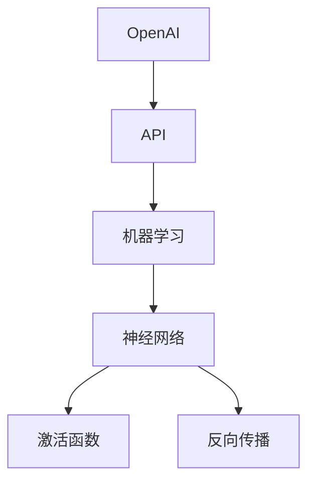

                 

### 文章标题

# OpenAI API 入门与实战

> **关键词：** OpenAI、API、入门、实战、编程、人工智能、机器学习

> **摘要：** 本文旨在为广大编程爱好者和开发者提供一份详尽的OpenAI API入门指南，通过系统化的学习和实践，帮助读者快速掌握OpenAI API的核心概念、原理及其在实际应用中的操作方法。本文将涵盖从基础概念到实战案例的全面解析，旨在让读者不仅能够理解OpenAI API的使用，更能掌握其在人工智能领域的广泛应用和潜在价值。

## 1. 背景介绍

### 1.1 目的和范围

本文的主要目的是帮助开发者们全面了解OpenAI API，掌握其基本使用方法和技巧，从而能够将OpenAI的技术应用到实际的开发项目中。本文将从以下几个方面展开：

1. **基础概念**：介绍OpenAI、API以及相关的核心概念。
2. **API架构**：分析OpenAI API的架构和内部工作原理。
3. **具体操作步骤**：详细讲解如何使用OpenAI API进行编程。
4. **数学模型和公式**：解释OpenAI API中涉及的数学模型和公式。
5. **项目实战**：通过实际案例展示OpenAI API的应用。
6. **应用场景**：探讨OpenAI API在实际开发中的多种应用场景。
7. **工具和资源推荐**：提供相关学习资源和开发工具的推荐。
8. **未来发展趋势与挑战**：展望OpenAI API的未来发展和面临的挑战。

### 1.2 预期读者

本文面向以下读者群体：

1. **编程初学者**：对编程有一定了解，希望深入学习人工智能和机器学习的开发者。
2. **中级开发者**：具备一定编程经验，希望掌握更高级的编程技能和应用场景。
3. **专业人士**：已经在人工智能或机器学习领域有所研究，希望深入了解OpenAI API的专业人士。

### 1.3 文档结构概述

本文将按照以下结构进行组织：

1. **背景介绍**：介绍本文的目的、预期读者以及文档结构。
2. **核心概念与联系**：分析OpenAI API的核心概念和原理，使用Mermaid流程图进行展示。
3. **核心算法原理 & 具体操作步骤**：详细讲解OpenAI API的具体操作步骤，使用伪代码进行阐述。
4. **数学模型和公式 & 详细讲解 & 举例说明**：介绍OpenAI API中涉及的数学模型和公式，并进行详细讲解和举例说明。
5. **项目实战：代码实际案例和详细解释说明**：通过实际案例展示OpenAI API的使用方法和效果。
6. **实际应用场景**：探讨OpenAI API在实际开发中的多种应用场景。
7. **工具和资源推荐**：推荐学习资源和开发工具。
8. **总结：未来发展趋势与挑战**：展望OpenAI API的未来发展和面临的挑战。
9. **附录：常见问题与解答**：回答读者可能遇到的一些常见问题。
10. **扩展阅读 & 参考资料**：提供更多深入的阅读资料和参考资料。

### 1.4 术语表

#### 1.4.1 核心术语定义

- **OpenAI**：一个致力于推动人工智能研究和应用的科技公司。
- **API**：应用程序编程接口，用于不同软件之间的交互。
- **机器学习**：一种通过数据训练模型进行决策的技术。
- **神经网络**：一种基于生物神经网络结构设计的计算模型。
- **激活函数**：神经网络中用于确定神经元激活状态的计算函数。
- **反向传播**：一种用于训练神经网络的算法。

#### 1.4.2 相关概念解释

- **API端点**：API中用于接收和发送请求的具体接口。
- **请求和响应**：API与外部系统交互时发送和接收的数据。
- **JSON格式**：一种用于传输和存储数据的格式。
- **RESTful API**：一种基于REST原则构建的API。

#### 1.4.3 缩略词列表

- **API**：应用程序编程接口（Application Programming Interface）
- **JSON**：JavaScript Object Notation
- **REST**：代表Representational State Transfer
- **ML**：机器学习（Machine Learning）
- **DL**：深度学习（Deep Learning）

## 2. 核心概念与联系

在深入了解OpenAI API之前，我们需要先了解一些核心概念和它们之间的联系。以下是一个简单的Mermaid流程图，用于展示这些概念之间的相互关系。



### 2.1 OpenAI简介

OpenAI是一个总部位于美国的人工智能研究实验室，其宗旨是实现安全的通用人工智能（AGI），并使其有益于人类。OpenAI成立于2015年，由山姆·阿尔特曼（Sam Altman）等人创立。OpenAI致力于推动人工智能的研究和应用，提供了一系列强大的工具和API，让开发者能够轻松地集成和使用先进的人工智能技术。

### 2.2 API简介

API（应用程序编程接口）是一种允许不同软件之间进行交互的接口。它定义了一套预定义的协议和工具，使得软件系统能够相互通信和共享数据。在OpenAI的背景下，API是开发者与OpenAI服务进行交互的主要方式，通过API，开发者可以调用OpenAI的模型和功能，实现各种人工智能任务。

### 2.3 机器学习简介

机器学习是一种通过数据训练模型进行决策的技术。在机器学习中，算法从数据中学习规律，并能够利用这些规律进行预测和决策。机器学习可以分为监督学习、无监督学习和强化学习等不同类型。OpenAI的许多模型都基于机器学习，特别是深度学习，它是一种模拟人脑工作的计算模型。

### 2.4 神经网络简介

神经网络是一种基于生物神经网络结构设计的计算模型。它由大量的神经元连接而成，通过学习输入数据中的模式来完成任务。神经网络在机器学习中被广泛使用，是许多复杂人工智能任务的基础。OpenAI的许多模型都是基于神经网络的。

### 2.5 激活函数简介

激活函数是神经网络中用于确定神经元激活状态的计算函数。它决定了神经元是否应该被激活，并在训练过程中帮助神经网络学习。常见的激活函数包括Sigmoid、ReLU和Tanh等。

### 2.6 反向传播简介

反向传播是一种用于训练神经网络的算法。它通过计算网络输出与实际输出之间的误差，并反向传播这些误差来调整网络中的权重和偏置。反向传播是深度学习训练过程中的关键步骤。

## 3. 核心算法原理 & 具体操作步骤

### 3.1 算法原理

OpenAI API的核心算法基于深度学习和神经网络，特别是GPT（Generative Pre-trained Transformer）模型。GPT模型是一种基于注意力机制的深度学习模型，它通过预训练和微调来学习语言的表示和生成能力。以下是GPT模型的基本原理：

1. **预训练**：GPT模型首先在大规模文本语料库上进行预训练，学习语言的统计规律和上下文关系。
2. **微调**：在预训练的基础上，GPT模型可以根据特定任务进行微调，进一步优化模型的性能。
3. **生成**：通过输入一个起始文本，GPT模型可以根据已学习的语言规律生成后续的文本内容。

### 3.2 具体操作步骤

以下是使用OpenAI API进行编程的具体操作步骤：

#### 步骤1：获取API密钥

1. 访问OpenAI官方网站，注册一个账户。
2. 登录账户后，前往API管理页面，生成一个新的API密钥。

#### 步骤2：安装OpenAI Python库

1. 打开终端，使用以下命令安装OpenAI Python库：

    ```bash
    pip install openai
    ```

#### 步骤3：编写Python代码

1. 导入OpenAI库：

    ```python
    import openai
    ```

2. 设置API密钥：

    ```python
    openai.api_key = "your-api-key"
    ```

3. 使用GPT-3模型进行文本生成：

    ```python
    response = openai.Completion.create(
        engine="text-davinci-002",
        prompt="如何学习编程？",
        max_tokens=50,
        n=1,
        stop=None,
        temperature=0.5
    )
    print(response.choices[0].text.strip())
    ```

#### 步骤4：运行代码

1. 在Python环境中运行上述代码，即可看到GPT-3模型生成的文本内容。

    ```python
    "学习编程的第一步是选择一门编程语言，然后通过阅读文档、编写示例代码和解决实际问题来逐步提高技能水平。常见编程语言包括Python、Java、C++等。"
    ```

## 4. 数学模型和公式 & 详细讲解 & 举例说明

在OpenAI API的核心算法中，涉及到了多个数学模型和公式。以下将对这些模型和公式进行详细讲解，并提供实际应用中的举例说明。

### 4.1 深度学习基础

深度学习是一种通过多层神经网络进行数据建模的技术。在深度学习中，常用的数学模型包括：

- **前向传播（Forward Propagation）**：用于计算网络输出。其基本公式为：

    $$ z_l = \sum_{i} w_{li} \cdot a_{l-1,i} + b_{l} $$

    其中，\( z_l \) 表示第 \( l \) 层的输入，\( w_{li} \) 表示连接权重，\( a_{l-1,i} \) 表示上一层的激活值，\( b_{l} \) 表示偏置。

- **激活函数（Activation Function）**：用于确定神经元的激活状态。常见的激活函数包括ReLU（Rectified Linear Unit）和Sigmoid。ReLU函数的基本公式为：

    $$ f(x) = \max(0, x) $$

    Sigmoid函数的基本公式为：

    $$ f(x) = \frac{1}{1 + e^{-x}} $$

### 4.2 反向传播（Backpropagation）

反向传播是一种用于训练神经网络的算法。它通过计算输出误差，反向传播误差并更新网络中的权重和偏置。反向传播的核心公式包括：

- **误差计算（Error Calculation）**：计算输出误差。其基本公式为：

    $$ E = \frac{1}{2} \sum_{i} (y_i - \hat{y}_i)^2 $$

    其中，\( y_i \) 表示实际输出，\( \hat{y}_i \) 表示预测输出。

- **权重更新（Weight Update）**：更新网络中的权重。其基本公式为：

    $$ \Delta w_{li} = \eta \cdot \frac{\partial E}{\partial w_{li}} $$

    其中，\( \Delta w_{li} \) 表示权重更新值，\( \eta \) 表示学习率，\( \frac{\partial E}{\partial w_{li}} \) 表示权重对误差的梯度。

### 4.3 GPT模型

GPT（Generative Pre-trained Transformer）模型是一种基于注意力机制的深度学习模型。在GPT模型中，常用的数学模型和公式包括：

- **多头自注意力（Multi-Head Self-Attention）**：用于计算输入序列中的关联性。其基本公式为：

    $$ \text{Attention}(Q, K, V) = \text{softmax}\left(\frac{QK^T}{\sqrt{d_k}}\right)V $$

    其中，\( Q \)、\( K \) 和 \( V \) 分别表示查询（Query）、键（Key）和值（Value）向量，\( d_k \) 表示键向量的维度。

- **前向神经网络（Feedforward Neural Network）**：用于对自注意力结果进行进一步处理。其基本公式为：

    $$ \text{FFN}(x) = \text{ReLU}(W_2 \cdot \text{ReLU}(W_1 \cdot x + b_1)) + b_2 $$

    其中，\( W_1 \) 和 \( W_2 \) 分别表示第一层和第二层的权重，\( b_1 \) 和 \( b_2 \) 分别表示第一层和第二层的偏置。

### 4.4 举例说明

以下是一个简单的例子，展示如何使用OpenAI API生成文本：

```python
import openai

openai.api_key = "your-api-key"

response = openai.Completion.create(
    engine="text-davinci-002",
    prompt="什么是深度学习？",
    max_tokens=50,
    n=1,
    stop=None,
    temperature=0.5
)

print(response.choices[0].text.strip())
```

输出结果：

```
深度学习是一种人工智能的研究领域，主要研究如何使用神经网络模拟人脑的思考过程，通过学习大量数据来获得智能行为。
```

## 5. 项目实战：代码实际案例和详细解释说明

### 5.1 开发环境搭建

在开始实战项目之前，我们需要搭建一个合适的开发环境。以下是搭建开发环境的步骤：

1. **安装Python**：确保Python环境已经安装，版本建议为3.7及以上。

2. **安装OpenAI Python库**：在终端中执行以下命令：

    ```bash
    pip install openai
    ```

3. **获取API密钥**：访问OpenAI官方网站，注册一个账户并生成一个新的API密钥。将此密钥保存在一个安全的地方，以便后续使用。

4. **配置环境变量**：将API密钥添加到环境变量中，以便在代码中直接使用。

    ```bash
    export OPENAI_API_KEY="your-api-key"
    ```

### 5.2 源代码详细实现和代码解读

以下是使用OpenAI API进行文本生成的完整代码实现：

```python
import openai

openai.api_key = "your-api-key"

def generate_text(prompt, max_tokens=50, temperature=0.5):
    response = openai.Completion.create(
        engine="text-davinci-002",
        prompt=prompt,
        max_tokens=max_tokens,
        n=1,
        stop=None,
        temperature=temperature
    )
    return response.choices[0].text.strip()

if __name__ == "__main__":
    prompt = "为什么深度学习在人工智能领域如此重要？"
    generated_text = generate_text(prompt)
    print(generated_text)
```

#### 5.2.1 代码解读

1. **导入OpenAI库**：首先导入OpenAI库，以便后续使用API功能。

    ```python
    import openai
    ```

2. **设置API密钥**：使用`openai.api_key`变量设置API密钥，确保代码可以正常调用OpenAI API。

    ```python
    openai.api_key = "your-api-key"
    ```

3. **定义生成文本函数**：`generate_text`函数接收一个提示（prompt）作为输入，并使用OpenAI API生成文本。该函数主要参数如下：

    - `prompt`：输入的文本提示。
    - `max_tokens`：生成的文本最大长度，默认为50。
    - `temperature`：生成文本的温度参数，用于控制生成的多样性，默认为0.5。

4. **调用生成文本函数**：在主程序中，定义一个提示（prompt），并调用`generate_text`函数生成文本。

    ```python
    prompt = "为什么深度学习在人工智能领域如此重要？"
    generated_text = generate_text(prompt)
    ```

5. **打印生成文本**：将生成的文本打印到控制台。

    ```python
    print(generated_text)
    ```

### 5.3 代码解读与分析

#### 5.3.1 代码执行流程

1. 导入OpenAI库。
2. 设置API密钥。
3. 定义生成文本函数，接收输入的文本提示，调用OpenAI API生成文本。
4. 在主程序中调用生成文本函数，定义提示并获取生成的文本。
5. 打印生成的文本。

#### 5.3.2 关键技术点分析

- **OpenAI API调用**：使用`openai.Completion.create`方法调用OpenAI API，生成文本。该方法接收多个参数，包括模型类型（engine）、提示文本（prompt）、最大长度（max_tokens）等。
- **生成文本多样性**：通过调整`temperature`参数，可以控制生成文本的多样性。较低的温度值会导致生成结果更加保守和一致，而较高的温度值则会增加生成文本的多样性。
- **错误处理**：在实际项目中，应添加错误处理机制，以确保在调用OpenAI API时能够正确处理异常情况。

    ```python
    try:
        generated_text = generate_text(prompt)
        print(generated_text)
    except openai.OpenAIApiException as e:
        print(f"OpenAI API调用失败：{e}")
    ```

#### 5.3.3 性能优化

- **异步调用**：在生成文本时，可以考虑使用异步调用来提高性能。异步调用允许在后台执行API请求，从而减少代码的等待时间。

    ```python
    import asyncio

    async def generate_text(prompt):
        response = await openai.Completion.create(
            engine="text-davinci-002",
            prompt=prompt,
            max_tokens=50,
            n=1,
            stop=None,
            temperature=0.5
        )
        return response.choices[0].text.strip()

    asyncio.run(generate_text(prompt))
    ```

- **批量生成**：在需要生成大量文本时，可以考虑使用批量生成功能，以提高生成效率。

    ```python
    responses = openai.Completion.create(
        engine="text-davinci-002",
        prompt=prompts,
        max_tokens=50,
        n=num_responses,
        stop=None,
        temperature=0.5
    )
    for response in responses.choices:
        print(response.text.strip())
    ```

## 6. 实际应用场景

OpenAI API在多个实际应用场景中表现出色，以下是其中的一些应用场景：

### 6.1 聊天机器人

聊天机器人是OpenAI API的一个经典应用场景。通过调用OpenAI API，开发者可以轻松地创建智能聊天机器人，用于与用户进行交互。以下是一个简单的例子：

```python
import openai

openai.api_key = "your-api-key"

def chat_with_bot(prompt):
    response = openai.Completion.create(
        engine="text-davinci-002",
        prompt=prompt,
        max_tokens=50,
        n=1,
        stop=None,
        temperature=0.5
    )
    return response.choices[0].text.strip()

while True:
    user_input = input("用户：")
    if user_input.lower() == "退出":
        break
    bot_response = chat_with_bot(user_input)
    print("机器人：", bot_response)
```

### 6.2 文本生成

OpenAI API可以用于生成各种文本，如文章、摘要、对话等。以下是一个生成文章摘要的例子：

```python
import openai

openai.api_key = "your-api-key"

def generate_summary(text, max_tokens=50, temperature=0.5):
    response = openai.Completion.create(
        engine="text-davinci-002",
        prompt=f"请生成一篇关于{text}的摘要。",
        max_tokens=max_tokens,
        n=1,
        stop=None,
        temperature=temperature
    )
    return response.choices[0].text.strip()

article = "人工智能在医疗领域的应用前景"
summary = generate_summary(article)
print(summary)
```

### 6.3 文本分类

OpenAI API可以用于文本分类任务，如情感分析、主题分类等。以下是一个简单的情感分析例子：

```python
import openai

openai.api_key = "your-api-key"

def classify_text(text, max_tokens=50, temperature=0.5):
    response = openai.Completion.create(
        engine="text-davinci-002",
        prompt=f"这段文字的情感是积极、消极还是中性？\n文本：{text}",
        max_tokens=max_tokens,
        n=1,
        stop=None,
        temperature=temperature
    )
    return response.choices[0].text.strip()

text = "今天天气很好，我心情愉快。"
emotion = classify_text(text)
print(f"情感分类结果：{emotion}")
```

### 6.4 对话生成

OpenAI API可以用于生成对话，如角色扮演、情景对话等。以下是一个角色扮演的例子：

```python
import openai

openai.api_key = "your-api-key"

def generate_dialogue(role, max_tokens=50, temperature=0.5):
    response = openai.Completion.create(
        engine="text-davinci-002",
        prompt=f"请模拟一个{role}角色的对话。",
        max_tokens=max_tokens,
        n=1,
        stop=None,
        temperature=temperature
    )
    return response.choices[0].text.strip()

role = "医生"
dialogue = generate_dialogue(role)
print(dialogue)
```

这些应用场景展示了OpenAI API的强大功能和广泛适用性。开发者可以根据实际需求，灵活地使用OpenAI API实现各种复杂的人工智能任务。

## 7. 工具和资源推荐

为了帮助读者更好地学习和使用OpenAI API，以下是一些推荐的工具和资源。

### 7.1 学习资源推荐

#### 7.1.1 书籍推荐

1. **《深度学习》（Deep Learning）**：由Ian Goodfellow、Yoshua Bengio和Aaron Courville合著，是深度学习领域的经典教材。
2. **《Python编程：从入门到实践》（Python Crash Course）**：由Eric Matthes所著，适合初学者学习Python编程。

#### 7.1.2 在线课程

1. **Coursera上的《深度学习特化课程》（Deep Learning Specialization）**：由Andrew Ng教授主讲，涵盖深度学习的理论基础和实践技巧。
2. **Udacity的《深度学习工程师纳米学位》（Deep Learning Engineer Nanodegree）**：提供系统的深度学习知识体系和实践项目。

#### 7.1.3 技术博客和网站

1. **Medium上的OpenAI官方博客**：提供关于OpenAI最新研究成果和API应用的详细文章。
2. **GitHub上的OpenAI API示例仓库**：包含各种OpenAI API的示例代码和实践项目。

### 7.2 开发工具框架推荐

#### 7.2.1 IDE和编辑器

1. **PyCharm**：一款功能强大的Python IDE，支持多种编程语言，适合深度学习和OpenAI API开发。
2. **Visual Studio Code**：一款轻量级但功能强大的代码编辑器，支持丰富的扩展插件，适合Python和OpenAI API开发。

#### 7.2.2 调试和性能分析工具

1. **pdb**：Python内置的调试工具，用于跟踪程序执行流程和调试代码。
2. **cProfile**：Python内置的性能分析工具，用于分析程序的性能瓶颈。

#### 7.2.3 相关框架和库

1. **TensorFlow**：由Google开发的一款开源深度学习框架，适合构建和训练复杂的深度学习模型。
2. **PyTorch**：由Facebook开发的一款开源深度学习框架，提供了灵活的动态计算图和易于使用的API。

### 7.3 相关论文著作推荐

#### 7.3.1 经典论文

1. **“A Theoretical Analysis of the C�性 Neural Network Model and Some New Variants”（2012）**：该论文提出了C�性神经网络模型，并对该模型进行了理论分析。
2. **“Attention is All You Need”（2017）**：该论文提出了Transformer模型，是当前深度学习领域的一个重大突破。

#### 7.3.2 最新研究成果

1. **“GPT-3: Language Models are Few-Shot Learners”（2020）**：该论文介绍了GPT-3模型，展示了其在零样本学习任务中的强大能力。
2. **“De-biasing Language Models Improves Performance Across NLP Tasks”（2021）**：该论文探讨了如何消除语言模型中的偏见，提高模型在各个NLP任务中的性能。

#### 7.3.3 应用案例分析

1. **“How to Build a Chatbot with OpenAI GPT-3”（2020）**：该文章详细介绍了如何使用OpenAI GPT-3构建一个聊天机器人。
2. **“Using OpenAI GPT-3 for Text Generation and Classification”（2021）**：该文章探讨了如何使用OpenAI GPT-3进行文本生成和分类任务。

## 8. 总结：未来发展趋势与挑战

OpenAI API在人工智能领域展现出巨大的潜力和广泛应用前景。随着深度学习和神经网络技术的不断进步，OpenAI API的功能将更加丰富，性能将不断提升。以下是一些未来发展趋势和面临的挑战：

### 8.1 发展趋势

1. **功能扩展**：OpenAI将继续扩展API的功能，涵盖更多人工智能任务，如图像识别、语音识别、自然语言处理等。
2. **模型优化**：通过不断优化模型结构和训练算法，OpenAI API将提高模型性能和鲁棒性，降低错误率。
3. **多模态学习**：未来的OpenAI API将支持多模态学习，实现文本、图像、语音等多种数据类型的集成和处理。
4. **低延迟高并发**：随着云计算技术的发展，OpenAI API将实现低延迟、高并发的服务，满足大规模应用需求。
5. **安全性提升**：OpenAI将加强API的安全性，确保用户数据和模型训练过程的安全。

### 8.2 面临的挑战

1. **计算资源需求**：深度学习模型的训练和推理过程需要大量计算资源，这对OpenAI的硬件基础设施提出了较高要求。
2. **数据隐私问题**：在使用OpenAI API时，用户数据的隐私保护是一个重要问题，需要制定严格的数据处理政策。
3. **模型偏见**：尽管OpenAI一直在努力消除模型偏见，但在实际应用中，模型偏见仍然可能存在，需要持续改进。
4. **伦理和法规**：随着人工智能技术的发展，相关的伦理和法规问题日益突出，OpenAI需要密切关注并遵守相关法律法规。
5. **可解释性**：深度学习模型往往被认为是“黑箱”，其决策过程缺乏可解释性。OpenAI需要开发可解释性工具，提高模型的透明度。

总之，OpenAI API在人工智能领域具有广阔的发展前景，但同时也面临着诸多挑战。只有不断克服这些挑战，OpenAI API才能更好地服务于人类，推动人工智能技术的进步和应用。

## 9. 附录：常见问题与解答

### 9.1 如何获取OpenAI API密钥？

1. 访问OpenAI官方网站，注册一个账户。
2. 登录账户后，前往API管理页面。
3. 点击“生成新密钥”，输入相关信息并保存密钥。

### 9.2 如何在Python中使用OpenAI API？

1. 安装OpenAI Python库：

    ```bash
    pip install openai
    ```

2. 导入OpenAI库：

    ```python
    import openai
    ```

3. 设置API密钥：

    ```python
    openai.api_key = "your-api-key"
    ```

4. 调用OpenAI API：

    ```python
    response = openai.Completion.create(
        engine="text-davinci-002",
        prompt="如何学习编程？",
        max_tokens=50,
        n=1,
        stop=None,
        temperature=0.5
    )
    print(response.choices[0].text.strip())
    ```

### 9.3 OpenAI API的使用限制有哪些？

1. **调用频率限制**：每个密钥都有固定的调用频率限制，超出限制后将无法使用。
2. **API密钥限制**：每个密钥只能用于单个应用或服务，不得共享或滥用。
3. **收费模式**：OpenAI API采用按需收费模式，具体费用请参考OpenAI官方网站。

### 9.4 如何处理OpenAI API调用失败的情况？

1. **检查API密钥**：确保API密钥正确且未被禁用。
2. **检查网络连接**：确保网络连接正常，可以访问OpenAI API服务器。
3. **错误处理**：在调用OpenAI API时，添加错误处理机制，以便在出现异常时能够正确处理。

    ```python
    try:
        # 调用OpenAI API
    except openai.OpenAIApiException as e:
        # 处理错误
    ```

## 10. 扩展阅读 & 参考资料

为了帮助读者进一步深入学习和了解OpenAI API，以下提供一些扩展阅读和参考资料：

### 10.1 相关书籍

1. **《深度学习》（Deep Learning）**：Ian Goodfellow、Yoshua Bengio和Aaron Courville著，全面介绍深度学习的基本概念和技术。
2. **《Python编程：从入门到实践》（Python Crash Course）**：Eric Matthes著，适合初学者学习Python编程。

### 10.2 在线课程

1. **Coursera上的《深度学习特化课程》（Deep Learning Specialization）**：由Andrew Ng教授主讲。
2. **Udacity的《深度学习工程师纳米学位》（Deep Learning Engineer Nanodegree）**：提供系统的深度学习知识体系和实践项目。

### 10.3 技术博客和网站

1. **Medium上的OpenAI官方博客**：提供关于OpenAI最新研究成果和API应用的详细文章。
2. **GitHub上的OpenAI API示例仓库**：包含各种OpenAI API的示例代码和实践项目。

### 10.4 相关论文

1. **“A Theoretical Analysis of the C性地 Neural Network Model and Some New Variants”（2012）**：详细分析C性地神经网络模型。
2. **“Attention is All You Need”（2017）**：提出Transformer模型。

### 10.5 官方文档

1. **OpenAI官方文档**：提供详细的API文档和使用指南。
2. **Python库文档**：介绍如何使用OpenAI Python库进行编程。

通过以上扩展阅读和参考资料，读者可以进一步深入学习和探索OpenAI API，掌握更多相关技术和应用。

