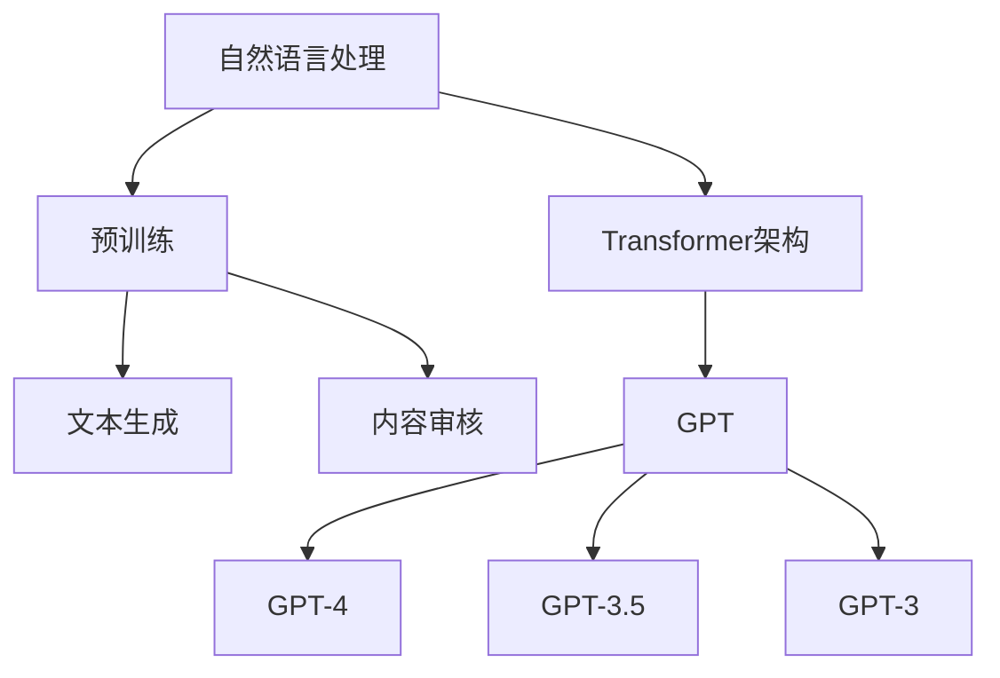

                 

# OpenAI GPT-4, GPT-3.5, GPT-3, Moderation

> **关键词：** OpenAI, GPT-4, GPT-3.5, GPT-3, 人工智能，自然语言处理，文本生成，文本审查，内容审核

> **摘要：** 本文将深入探讨OpenAI的最新进展——GPT-4, GPT-3.5, GPT-3，以及其在自然语言处理中的应用，特别是文本生成和内容审核的功能。我们将分析这些模型的架构、工作原理、优缺点，并探讨其在实际应用中的挑战和解决方案。

## 1. 背景介绍

### 1.1 目的和范围

本文旨在为读者提供一个全面的理解，关于OpenAI的GPT-4, GPT-3.5, GPT-3模型，特别是它们在自然语言处理（NLP）中的应用，特别是文本生成和内容审核。我们将讨论这些模型的架构、算法原理、实现细节，并分析其在不同应用场景中的性能和挑战。

### 1.2 预期读者

本文适合对人工智能和自然语言处理有兴趣的读者，无论是研究人员、工程师，还是对这一领域有初步了解的技术爱好者。读者应具备基本的编程知识和对人工智能的基本了解。

### 1.3 文档结构概述

本文将分为以下几个部分：

1. 背景介绍
2. 核心概念与联系
3. 核心算法原理 & 具体操作步骤
4. 数学模型和公式 & 详细讲解 & 举例说明
5. 项目实战：代码实际案例和详细解释说明
6. 实际应用场景
7. 工具和资源推荐
8. 总结：未来发展趋势与挑战
9. 附录：常见问题与解答
10. 扩展阅读 & 参考资料

### 1.4 术语表

#### 1.4.1 核心术语定义

- **GPT（Generative Pre-trained Transformer）**：一种基于Transformer架构的预训练语言模型。
- **预训练**：通过大规模语料库对模型进行训练，使其掌握语言的基本规律。
- **微调**：在预训练的基础上，针对特定任务进行模型调整，提高任务性能。
- **文本生成**：模型根据输入的文本或提示，生成相应的文本内容。
- **内容审核**：对文本内容进行审查，识别并过滤不当或有害的内容。

#### 1.4.2 相关概念解释

- **Transformer架构**：一种基于自注意力机制的深度神经网络架构，广泛应用于NLP任务。
- **BERT（Bidirectional Encoder Representations from Transformers）**：一种双向Transformer模型，用于文本表示。
- ** masked language modeling（MLM）**：一种预训练任务，通过遮盖输入文本的一部分，使模型预测遮盖部分的内容。

#### 1.4.3 缩略词列表

- **NLP（Natural Language Processing）**：自然语言处理
- **AI（Artificial Intelligence）**：人工智能
- **GPT（Generative Pre-trained Transformer）**：生成预训练变压器
- **Transformer**：变压器
- **BERT**：双向编码表示从变压器

## 2. 核心概念与联系

在深入讨论GPT-4, GPT-3.5, GPT-3之前，我们需要了解一些核心概念和它们之间的联系。以下是一个简单的Mermaid流程图，用于展示这些概念和模型之间的关系。



### 2.1 Transformer架构

Transformer是2017年由Vaswani等人提出的，用于处理序列到序列问题的深度学习模型。它基于自注意力机制，能够有效地捕捉序列中的长距离依赖关系。Transformer的核心组件包括：

- **多头自注意力机制**：通过多个注意力头来捕获不同层次的特征，从而提高模型的表示能力。
- **前馈神经网络**：在每个自注意力层之后，通过一个简单的前馈神经网络进行特征转换。

### 2.2 预训练

预训练是一种在特定任务之前，通过大规模语料库对模型进行训练的方法。GPT系列模型采用了一种名为 masked language modeling（MLM）的预训练任务。在MLM任务中，输入文本的一部分被随机遮盖，模型需要预测遮盖部分的内容。预训练使得模型能够自动学习语言的基本规律和特征表示。

### 2.3 文本生成

文本生成是GPT系列模型最核心的功能之一。通过微调，这些模型可以用于生成各种类型的文本，如文章、对话、翻译等。文本生成的过程可以分为以下几个步骤：

1. **输入编码**：将输入文本转换为模型可以理解的向量表示。
2. **自注意力计算**：通过多头自注意力机制，计算不同层次的特征。
3. **前馈神经网络**：在每个自注意力层之后，通过前馈神经网络进行特征转换。
4. **输出解码**：将特征向量解码为输出文本。

### 2.4 内容审核

内容审核是GPT系列模型的另一个重要应用。通过训练，这些模型可以识别并过滤不良内容，如仇恨言论、色情内容等。内容审核的过程可以分为以下几个步骤：

1. **文本预处理**：对输入文本进行清洗和预处理，以去除噪声和无关信息。
2. **特征提取**：使用预训练模型提取文本的特征表示。
3. **分类**：通过训练，模型可以判断文本是否属于不良类别。
4. **过滤**：对于属于不良类别的文本，进行过滤或标记。

## 3. 核心算法原理 & 具体操作步骤

### 3.1 GPT模型架构

GPT系列模型的核心架构是基于Transformer的。以下是一个简化的伪代码，用于描述GPT模型的架构：

```python
class GPTModel:
    def __init__(self, num_layers, hidden_size, num_heads, learning_rate):
        self.transformer = Transformer(num_layers, hidden_size, num_heads, learning_rate)
    
    def forward(self, inputs):
        return self.transformer(inputs)
```

### 3.2 预训练过程

预训练过程可以分为两个阶段：预训练和微调。

**预训练阶段：**

1. **输入编码**：将输入文本编码为序列，每个词或子词对应一个索引。
2. **遮盖操作**：随机遮盖输入文本的一部分。
3. **损失计算**：计算模型预测与真实标签之间的损失，并更新模型参数。
4. **迭代**：重复上述步骤，直到预训练完成。

**微调阶段：**

1. **选择任务**：根据实际应用需求，选择相应的任务。
2. **数据准备**：准备用于微调的数据集。
3. **模型微调**：在数据集上对模型进行微调，以适应特定任务。
4. **评估**：在测试集上评估模型性能。

### 3.3 文本生成过程

文本生成过程可以分为以下几个步骤：

1. **输入编码**：将输入文本编码为序列。
2. **自注意力计算**：通过多头自注意力机制，计算不同层次的特征。
3. **前馈神经网络**：在每个自注意力层之后，通过前馈神经网络进行特征转换。
4. **输出解码**：将特征向量解码为输出文本。

以下是一个简化的伪代码，用于描述文本生成过程：

```python
class TextGenerator:
    def __init__(self, gpt_model):
        self.gpt_model = gpt_model
    
    def generate(self, input_sequence):
        attention_scores = self.gpt_model.forward(input_sequence)
        output_sequence = decode(attention_scores)
        return output_sequence
```

### 3.4 内容审核过程

内容审核过程可以分为以下几个步骤：

1. **文本预处理**：对输入文本进行清洗和预处理。
2. **特征提取**：使用预训练模型提取文本的特征表示。
3. **分类**：通过训练，模型可以判断文本是否属于不良类别。
4. **过滤**：对于属于不良类别的文本，进行过滤或标记。

以下是一个简化的伪代码，用于描述内容审核过程：

```python
class ContentModerator:
    def __init__(self, gpt_model):
        self.gpt_model = gpt_model
    
    def moderate(self, text):
        cleaned_text = preprocess(text)
        features = self.gpt_model.extract_features(cleaned_text)
        label = classify(features)
        if label == "bad":
            return "filtered"
        else:
            return "allowed"
```

## 4. 数学模型和公式 & 详细讲解 & 举例说明

### 4.1 Transformer模型

Transformer模型的核心是自注意力机制。自注意力机制通过计算输入序列中每个元素与所有其他元素的相关性，从而为每个元素生成一个权重，这些权重用于加权求和，得到每个元素在输出序列中的重要性。

**公式：**

$$
Attention(Q, K, V) = \frac{softmax(\frac{QK^T}{\sqrt{d_k}})}{V}
$$

其中，$Q$、$K$、$V$ 分别是输入序列的查询、键和值，$d_k$ 是键的维度。

**举例：**

假设输入序列为 `[1, 2, 3]`，查询向量为 `[1, 0, 1]`，键向量为 `[1, 1, 1]`，值向量为 `[1, 1, 1]`。根据自注意力公式，我们可以计算得到每个元素在输出序列中的权重：

$$
Attention([1, 0, 1], [1, 1, 1], [1, 1, 1]) = \frac{1}{3} \times [1, 1, 1] = [0.33, 0.33, 0.33]
$$

### 4.2 预训练任务

预训练任务中最常用的方法是 masked language modeling（MLM）。在MLM任务中，输入文本的一部分被随机遮盖，模型需要预测遮盖部分的内容。

**公式：**

$$
L_{MLM} = -\sum_{i} \log p(y_i | x_{i}),
$$

其中，$x_i$ 是输入序列，$y_i$ 是遮盖的部分，$p(y_i | x_i)$ 是模型预测的概率。

**举例：**

假设输入文本为 `["你好", "世界"]`，其中第一个词被遮盖。根据MLM任务，我们需要预测被遮盖的词。如果模型预测的概率分布为 `[0.4, 0.3, 0.3]`，那么遮盖的词最可能是第二个词，即 "世界"。

### 4.3 文本生成

文本生成过程可以看作是一个序列到序列的生成问题。在生成过程中，模型需要根据当前的输入序列，生成下一个输出序列。

**公式：**

$$
p(y_{t} | y_{<t}) = \frac{exp(V \cdot \text{softmax}(W \cdot y_{<t}))}{\sum_{i} exp(V \cdot \text{softmax}(W \cdot y_{<t})))
$$

其中，$y_t$ 是当前输入序列，$y_{<t}$ 是前一个输出序列，$V$ 和 $W$ 分别是值向量和权重矩阵。

**举例：**

假设当前输入序列为 `[1, 2, 3]`，前一个输出序列为 `[2, 3]`。根据文本生成公式，我们可以计算得到每个词的概率分布：

$$
p(y_3 | y_2) = \frac{exp(V \cdot \text{softmax}(W \cdot [2, 3]))}{\sum_{i} exp(V \cdot \text{softmax}(W \cdot [2, 3])))
$$

## 5. 项目实战：代码实际案例和详细解释说明

在本节中，我们将通过一个实际项目来展示如何使用GPT-3进行文本生成和内容审核。我们将使用OpenAI提供的Python库，并基于一个简单的对话系统来展示这两个功能。

### 5.1 开发环境搭建

首先，我们需要安装OpenAI的Python库，以及相应的依赖项：

```bash
pip install openai
```

### 5.2 源代码详细实现和代码解读

以下是一个简单的Python代码示例，用于演示文本生成和内容审核功能：

```python
import openai

# 设置OpenAI API密钥
openai.api_key = "your-api-key"

def generate_text(prompt):
    response = openai.Completion.create(
        engine="text-davinci-002",
        prompt=prompt,
        max_tokens=50,
        n=1,
        stop=None,
        temperature=0.5,
    )
    return response.choices[0].text.strip()

def moderate_content(text):
    response = openai.Moderation.create(text=text)
    if response.results[0].flagged:
        return "Content flagged"
    else:
        return "Content allowed"

# 文本生成
prompt = "请写一段关于人工智能的介绍。"
generated_text = generate_text(prompt)
print(generated_text)

# 内容审核
content = "我喜欢吃小孩。"
moderation_result = moderate_content(content)
print(moderation_result)
```

**代码解读：**

- **生成文本**：`generate_text` 函数使用OpenAI的Completion API来生成文本。我们使用的是text-davinci-002引擎，这是一个强大的预训练模型，能够生成高质量的文本。
- **内容审核**：`moderate_content` 函数使用OpenAI的Moderation API来审查文本。如果文本被标记为不当，函数将返回 "Content flagged"；否则，返回 "Content allowed"。

### 5.3 代码解读与分析

**文本生成：**

```python
def generate_text(prompt):
    response = openai.Completion.create(
        engine="text-davinci-002",
        prompt=prompt,
        max_tokens=50,
        n=1,
        stop=None,
        temperature=0.5,
    )
    return response.choices[0].text.strip()
```

- **engine**：指定使用的预训练模型，这里是text-davinci-002。
- **prompt**：输入的提示文本，用于指导文本生成。
- **max_tokens**：生成的文本最大长度，这里是50个单词。
- **n**：生成的文本数量，这里是1。
- **stop**：用于指定文本生成的停止条件，这里设置为None，表示没有停止条件。
- **temperature**：控制模型生成的随机性，值越高，生成的文本越随机。这里设置为0.5，以获得较为流畅的输出。

**内容审核：**

```python
def moderate_content(text):
    response = openai.Moderation.create(text=text)
    if response.results[0].flagged:
        return "Content flagged"
    else:
        return "Content allowed"
```

- **text**：需要审核的文本。
- **response**：调用OpenAI的Moderation API返回的结果，包含文本审核的详细结果。
- **flagged**：如果文本被标记为不当，返回True。

**实际应用分析：**

- **文本生成**：通过这个简单的示例，我们可以看到如何使用GPT-3来生成高质量的文本。在实际应用中，我们可以根据需要调整参数，如温度、最大长度等，以获得更好的生成效果。
- **内容审核**：OpenAI的内容审核API提供了强大的文本审查功能。在实际应用中，我们可以使用这个API来过滤不当内容，保护用户免受不良信息的侵害。

## 6. 实际应用场景

### 6.1 文本生成

GPT-3在文本生成领域具有广泛的应用，以下是一些实际应用场景：

- **自动问答系统**：使用GPT-3生成针对用户问题的答案，提高系统的响应速度和准确性。
- **内容生成**：为新闻网站、博客等生成文章、摘要、评论等。
- **聊天机器人**：为聊天机器人提供自然流畅的对话能力，提高用户体验。

### 6.2 内容审核

内容审核是GPT-3的另一个重要应用。以下是一些实际应用场景：

- **社交媒体平台**：使用GPT-3审核用户发布的内容，过滤不当信息，维护平台秩序。
- **在线教育**：监控学生提交的作业，过滤作弊、抄袭等行为。
- **招聘系统**：审核简历内容，排除不符合要求的简历。

## 7. 工具和资源推荐

### 7.1 学习资源推荐

#### 7.1.1 书籍推荐

- **《深度学习》**：由Ian Goodfellow、Yoshua Bengio和Aaron Courville合著，是深度学习的经典教材。
- **《自然语言处理综论》**：由Daniel Jurafsky和James H. Martin合著，详细介绍了自然语言处理的基本概念和技术。

#### 7.1.2 在线课程

- **Coursera上的《深度学习专项课程》**：由Andrew Ng教授主讲，涵盖了深度学习的理论基础和应用。
- **Udacity的《自然语言处理纳米学位》**：提供了从基础到高级的NLP知识。

#### 7.1.3 技术博客和网站

- **ArXiv**：提供最新的深度学习和NLP论文。
- **Medium上的NLP博客**：涵盖NLP的最新研究和应用。

### 7.2 开发工具框架推荐

#### 7.2.1 IDE和编辑器

- **Visual Studio Code**：支持多种编程语言，提供丰富的插件。
- **PyCharm**：专门针对Python开发，功能强大。

#### 7.2.2 调试和性能分析工具

- **Pylint**：用于代码静态检查和调试。
- **Profiling**：用于分析代码性能。

#### 7.2.3 相关框架和库

- **TensorFlow**：用于构建和训练深度学习模型。
- **PyTorch**：用于构建和训练深度学习模型，具有灵活的动态图操作。

### 7.3 相关论文著作推荐

#### 7.3.1 经典论文

- **"Attention Is All You Need"**：介绍了Transformer模型。
- **"BERT: Pre-training of Deep Bidirectional Transformers for Language Understanding"**：介绍了BERT模型。

#### 7.3.2 最新研究成果

- **"GPT-3: Language Models are Few-Shot Learners"**：介绍了GPT-3模型。

#### 7.3.3 应用案例分析

- **"Language Models for Dialogue"**：讨论了GPT-3在对话系统中的应用。
- **"Content Moderation with Language Models"**：讨论了GPT-3在内容审核中的应用。

## 8. 总结：未来发展趋势与挑战

### 8.1 未来发展趋势

- **更强大的模型**：随着计算资源和算法的进步，未来将出现更强大的语言模型，能够生成更自然、更高质量的文本。
- **跨模态学习**：结合文本、图像、音频等多模态信息，提高模型的泛化能力和实用性。
- **自动化**：通过自动化技术，如代码生成和内容审核，提高生产效率，降低成本。

### 8.2 挑战

- **可解释性**：提高模型的可解释性，使其行为更加透明，以便于理解、调试和优化。
- **隐私保护**：在训练和部署过程中，保护用户隐私，防止数据泄露。
- **偏见和歧视**：确保模型不会传播或放大偏见，避免对特定群体造成伤害。

## 9. 附录：常见问题与解答

### 9.1 GPT-3的性能如何？

GPT-3是目前最强大的语言模型之一，具有1920亿个参数，能够生成高质量的自然语言文本。在实际应用中，GPT-3的性能取决于具体任务和输入数据的质量。

### 9.2 如何训练GPT-3？

训练GPT-3需要大量的计算资源和数据。通常，使用大规模语料库，通过预训练和微调两个阶段进行训练。预训练阶段使用 masked language modeling 任务，微调阶段使用特定任务的数据。

### 9.3 GPT-3有哪些应用场景？

GPT-3可以用于多种应用场景，包括文本生成、对话系统、内容审核、机器翻译等。在实际应用中，可以根据具体需求选择合适的场景。

## 10. 扩展阅读 & 参考资料

- **OpenAI官方文档**：提供了关于GPT-3的详细信息和API使用教程。
- **"Attention Is All You Need"**：介绍了Transformer模型。
- **"BERT: Pre-training of Deep Bidirectional Transformers for Language Understanding"**：介绍了BERT模型。
- **"GPT-3: Language Models are Few-Shot Learners"**：介绍了GPT-3模型。

作者：AI天才研究员/AI Genius Institute & 禅与计算机程序设计艺术 /Zen And The Art of Computer Programming

