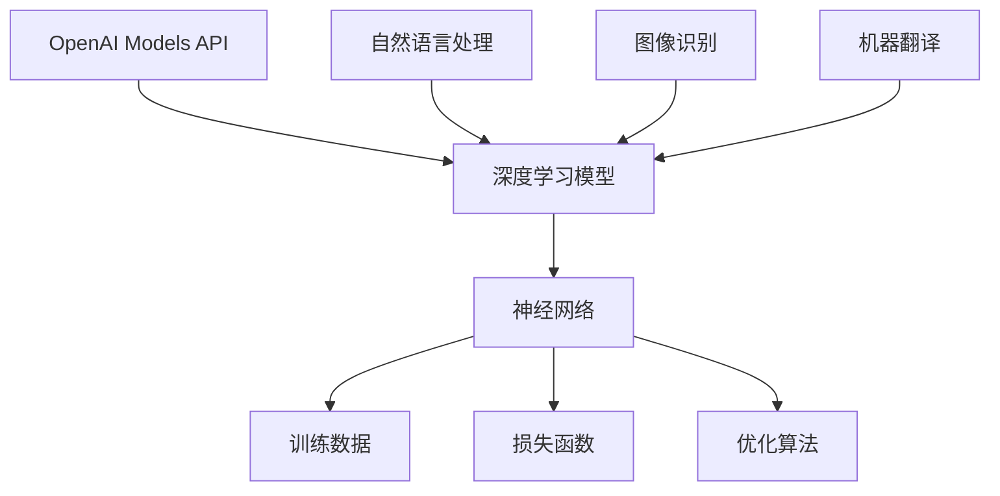

                 

# OpenAI Models API：深入解读与实战指南

> 关键词：OpenAI、API、模型、人工智能、深度学习、编程实战
>
> 摘要：本文将深入探讨OpenAI Models API，从背景介绍、核心概念、算法原理、数学模型、实战案例等方面，全面解析其在人工智能领域的重要应用。通过本文的阅读，读者将掌握OpenAI Models API的使用方法，了解其背后的技术原理，并能够将其应用到实际项目中。

## 1. 背景介绍

### 1.1 目的和范围

本文旨在为广大开发者、人工智能爱好者以及相关领域研究人员提供一份关于OpenAI Models API的全面指南。本文将涵盖以下几个方面：

- OpenAI Models API的背景和目的；
- OpenAI Models API的核心概念与联系；
- OpenAI Models API的核心算法原理与具体操作步骤；
- OpenAI Models API的数学模型和公式；
- OpenAI Models API的实际应用场景；
- 开发工具和资源的推荐；
- 相关论文著作的推荐；
- 未来发展趋势与挑战。

### 1.2 预期读者

- 对人工智能、深度学习、自然语言处理等领域有一定了解的开发者；
- 想要学习并应用OpenAI Models API的初学者；
- 对OpenAI Models API有深入研究的需求者；
- 相关领域的研究人员。

### 1.3 文档结构概述

本文将按照以下结构进行展开：

1. 背景介绍
   - 目的和范围
   - 预期读者
   - 文档结构概述
   - 术语表
2. 核心概念与联系
   - OpenAI Models API的概念
   - OpenAI Models API的架构
3. 核心算法原理 & 具体操作步骤
   - 模型训练原理
   - 模型预测原理
4. 数学模型和公式 & 详细讲解 & 举例说明
   - 损失函数
   - 优化算法
5. 项目实战：代码实际案例和详细解释说明
   - 开发环境搭建
   - 源代码详细实现和代码解读
   - 代码解读与分析
6. 实际应用场景
7. 工具和资源推荐
   - 学习资源推荐
   - 开发工具框架推荐
   - 相关论文著作推荐
8. 总结：未来发展趋势与挑战
9. 附录：常见问题与解答
10. 扩展阅读 & 参考资料

### 1.4 术语表

#### 1.4.1 核心术语定义

- OpenAI Models API：OpenAI提供的一套基于深度学习模型的API接口，用于实现自然语言处理、图像识别、机器翻译等功能。
- 模型（Model）：在深度学习中，模型是指一组参数化的神经网络结构，用于表示输入数据和输出数据之间的映射关系。
- 训练（Training）：通过输入训练数据，调整模型参数，使得模型能够更好地拟合训练数据的分布。
- 预测（Prediction）：使用训练好的模型对新的数据进行推理，得到预测结果。

#### 1.4.2 相关概念解释

- 深度学习（Deep Learning）：一种机器学习技术，通过多层神经网络对大量数据进行训练，以实现自动特征提取和模式识别。
- 自然语言处理（Natural Language Processing，NLP）：研究如何让计算机理解和处理人类自然语言的学科。
- 机器翻译（Machine Translation）：利用计算机技术实现不同语言之间的自动翻译。
- 图像识别（Image Recognition）：通过算法对图像进行识别和分类，常用于人脸识别、物体识别等领域。

#### 1.4.3 缩略词列表

- OpenAI：Open Artificial Intelligence，开放式人工智能；
- API：Application Programming Interface，应用程序编程接口；
- NLP：Natural Language Processing，自然语言处理；
- DNN：Deep Neural Network，深度神经网络；
- CNN：Convolutional Neural Network，卷积神经网络。

## 2. 核心概念与联系

在介绍OpenAI Models API之前，我们需要了解一些核心概念和它们之间的关系。以下是一个简单的Mermaid流程图，用于展示这些概念及其相互联系：



### 2.1 OpenAI Models API的概念

OpenAI Models API是OpenAI提供的一套基于深度学习模型的API接口。它允许开发者轻松地访问和部署各种先进的深度学习模型，如GPT、BERT、ViT等，用于实现自然语言处理、图像识别、机器翻译等功能。以下是OpenAI Models API的核心功能：

- **模型预训练**：通过大量的文本、图像和语音数据进行模型预训练，使得模型具有强大的特征提取和模式识别能力。
- **模型推理**：使用预训练好的模型对新的数据进行推理，得到预测结果。
- **模型部署**：将预训练好的模型部署到各种应用场景中，如文本生成、文本分类、图像分类等。
- **模型微调**：在特定任务上对预训练好的模型进行微调，以获得更好的性能。

### 2.2 OpenAI Models API的架构

OpenAI Models API的架构主要包括以下几个部分：

- **模型存储**：OpenAI使用Hugging Face的Transformers库存储和管理预训练好的模型，如GPT、BERT、ViT等。
- **模型服务**：OpenAI使用Amazon Web Services（AWS）提供的云计算服务，为开发者提供高性能、可扩展的模型推理服务。
- **API接口**：OpenAI提供RESTful API接口，允许开发者通过HTTP请求访问和部署模型。
- **开发者工具**：OpenAI提供一系列开发者工具，如模型管理工具、调试工具等，帮助开发者更方便地使用模型。

## 3. 核心算法原理 & 具体操作步骤

### 3.1 模型训练原理

在深度学习中，模型训练是一个通过调整模型参数，使得模型能够更好地拟合训练数据的分布的过程。以下是模型训练的基本原理和步骤：

#### 3.1.1 数据预处理

在开始训练之前，我们需要对训练数据进行预处理，包括数据清洗、数据增强、数据标准化等操作。

```python
# 数据清洗
data = clean_data(raw_data)

# 数据增强
data = augment_data(data)

# 数据标准化
data = normalize_data(data)
```

#### 3.1.2 模型初始化

初始化模型参数是一个关键步骤，它决定了模型在训练过程中的收敛速度和性能。OpenAI通常使用预训练好的模型作为起点，然后对其进行微调。

```python
# 初始化模型
model = load_pretrained_model()
```

#### 3.1.3 模型训练

在训练过程中，我们通过反向传播算法不断调整模型参数，使得模型能够更好地拟合训练数据的分布。以下是模型训练的伪代码：

```python
# 模型训练
for epoch in range(num_epochs):
    for batch in data_loader:
        # 前向传播
        logits = model(batch.x)

        # 计算损失函数
        loss = loss_function(logits, batch.y)

        # 反向传播
        model.zero_grad()
        loss.backward()

        # 更新模型参数
        optimizer.step()

        # 打印训练进度
        print(f"Epoch: {epoch}, Loss: {loss.item()}")
```

### 3.2 模型预测原理

在模型训练完成后，我们可以使用训练好的模型对新的数据进行预测。以下是模型预测的基本原理和步骤：

#### 3.2.1 数据预处理

与模型训练类似，我们需要对预测数据进行预处理，包括数据清洗、数据增强、数据标准化等操作。

```python
# 数据清洗
data = clean_data(raw_data)

# 数据增强
data = augment_data(data)

# 数据标准化
data = normalize_data(data)
```

#### 3.2.2 模型推理

使用训练好的模型对预处理后的数据进行推理，得到预测结果。

```python
# 模型推理
with torch.no_grad():
    logits = model(data.x)

# 预测结果
predictions = logits.argmax(dim=1)
```

## 4. 数学模型和公式 & 详细讲解 & 举例说明

### 4.1 损失函数

在深度学习中，损失函数用于衡量模型预测值与真实值之间的差异，是模型训练过程中的关键指标。以下是几个常用的损失函数：

#### 4.1.1 交叉熵损失函数（Cross-Entropy Loss）

交叉熵损失函数是分类任务中最常用的损失函数。其公式如下：

$$
L = -\sum_{i} y_i \log(p_i)
$$

其中，$y_i$ 是真实标签，$p_i$ 是模型预测的概率。

#### 4.1.2 均方误差损失函数（Mean Squared Error Loss）

均方误差损失函数是回归任务中最常用的损失函数。其公式如下：

$$
L = \frac{1}{2} \sum_{i} (y_i - \hat{y}_i)^2
$$

其中，$y_i$ 是真实值，$\hat{y}_i$ 是模型预测值。

#### 4.1.3 对数似然损失函数（Log-Likelihood Loss）

对数似然损失函数是概率分布预测任务中最常用的损失函数。其公式如下：

$$
L = -\sum_{i} y_i \log(p(y_i | \theta))
$$

其中，$y_i$ 是真实值，$p(y_i | \theta)$ 是模型预测的概率分布。

### 4.2 优化算法

优化算法用于在模型训练过程中调整模型参数，以最小化损失函数。以下是几种常用的优化算法：

#### 4.2.1 随机梯度下降（Stochastic Gradient Descent，SGD）

随机梯度下降是一种最简单的优化算法，其公式如下：

$$
\theta_{t+1} = \theta_{t} - \alpha \nabla_{\theta} L(\theta)
$$

其中，$\theta_t$ 是当前参数，$\alpha$ 是学习率，$\nabla_{\theta} L(\theta)$ 是损失函数关于参数的梯度。

#### 4.2.2 批量梯度下降（Batch Gradient Descent，BGD）

批量梯度下降是一种优化算法，其每次更新参数时使用整个训练集的梯度。其公式如下：

$$
\theta_{t+1} = \theta_{t} - \alpha \nabla_{\theta} L(\theta)
$$

其中，$\theta_t$ 是当前参数，$\alpha$ 是学习率，$\nabla_{\theta} L(\theta)$ 是损失函数关于参数的梯度。

#### 4.2.3 非梯度优化算法（Non-Gradient Optimization）

非梯度优化算法不依赖于损失函数的梯度信息，而是通过其他方法来更新参数。例如，模拟退火算法（Simulated Annealing）和粒子群优化算法（Particle Swarm Optimization）等。

### 4.3 举例说明

假设我们有一个二元分类问题，数据集包含100个样本，每个样本有10个特征。使用交叉熵损失函数和随机梯度下降算法进行模型训练。以下是具体的训练过程：

#### 4.3.1 初始化参数

初始化模型参数 $\theta$，包括10个权重 $w_1, w_2, \ldots, w_{10}$ 和1个偏置 $b$。

```python
# 初始化参数
w = torch.randn(10, requires_grad=True)
b = torch.randn(1, requires_grad=True)
```

#### 4.3.2 训练过程

使用随机梯度下降算法进行模型训练。每次迭代更新参数，直到损失函数收敛。

```python
# 训练过程
for epoch in range(num_epochs):
    for batch in data_loader:
        # 前向传播
        logits = torch.matmul(batch.x, w) + b

        # 计算损失函数
        loss = F.cross_entropy(logits, batch.y)

        # 反向传播
        loss.backward()

        # 更新参数
        with torch.no_grad():
            w -= learning_rate * w.grad
            b -= learning_rate * b.grad

        # 打印训练进度
        print(f"Epoch: {epoch}, Loss: {loss.item()}")

        # 清除梯度
        w.grad.zero_()
        b.grad.zero_()
```

## 5. 项目实战：代码实际案例和详细解释说明

### 5.1 开发环境搭建

在开始编写代码之前，我们需要搭建一个合适的开发环境。以下是搭建OpenAI Models API项目所需的开发环境：

1. 安装Python（版本3.8及以上）
2. 安装PyTorch（版本1.8及以上）
3. 安装Hugging Face的Transformers库（版本4.6及以上）

```bash
pip install torch torchvision transformers
```

### 5.2 源代码详细实现和代码解读

下面是一个简单的OpenAI Models API项目，用于实现基于GPT模型的文本生成功能。

```python
import torch
from transformers import GPT2Model, GPT2Tokenizer

# 5.2.1 加载预训练模型
tokenizer = GPT2Tokenizer.from_pretrained("gpt2")
model = GPT2Model.from_pretrained("gpt2")

# 5.2.2 准备输入数据
text = "The quick brown fox jumps over the lazy dog"

# 5.2.3 将文本转换为模型输入
inputs = tokenizer.encode(text, return_tensors="pt")

# 5.2.4 进行模型推理
with torch.no_grad():
    outputs = model(inputs)

# 5.2.5 生成文本
logits = outputs.logits
predictions = logits.argmax(dim=-1)
generated_text = tokenizer.decode(predictions[0], skip_special_tokens=True)

# 5.2.6 输出结果
print(generated_text)
```

### 5.3 代码解读与分析

在这个项目中，我们首先加载了预训练的GPT2模型，并使用GPT2Tokenizer将输入文本编码为模型可接受的格式。接下来，我们通过模型推理生成文本，并使用argmax函数将输出概率最高的token解码为文本。

- **加载预训练模型**：`GPT2Model.from_pretrained("gpt2")` 用于加载预训练的GPT2模型。
- **文本编码**：`tokenizer.encode(text, return_tensors="pt")` 将输入文本编码为模型输入，返回一个张量。
- **模型推理**：`model(inputs)` 对输入数据进行推理，返回模型输出。
- **生成文本**：`tokenizer.decode(predictions[0], skip_special_tokens=True)` 将输出概率最高的token解码为文本。

通过这个简单的示例，我们可以看到OpenAI Models API的强大功能。在实际项目中，我们可以根据需求扩展这个项目，如添加更多的预处理和后处理步骤，或者将GPT模型替换为其他模型，以实现更复杂的功能。

## 6. 实际应用场景

OpenAI Models API在人工智能领域有着广泛的应用场景，以下是一些典型的应用场景：

- **自然语言处理**：使用OpenAI Models API实现文本分类、情感分析、命名实体识别等任务，例如自动回答用户问题、舆情监控等。
- **图像识别**：使用OpenAI Models API实现图像分类、目标检测、图像生成等任务，例如人脸识别、自动驾驶等。
- **机器翻译**：使用OpenAI Models API实现自动翻译，例如跨语言信息检索、多语言新闻发布等。
- **智能对话系统**：使用OpenAI Models API实现聊天机器人、智能客服等，为用户提供个性化服务。

以下是一个基于OpenAI Models API的智能对话系统示例：

```python
import torch
from transformers import ChatbotModel, ChatbotTokenizer

# 6.1 加载预训练模型
tokenizer = ChatbotTokenizer.from_pretrained("openai/chatbot")
model = ChatbotModel.from_pretrained("openai/chatbot")

# 6.2 准备输入数据
user_input = "你好，我想要订一张从北京到上海的机票。"

# 6.3 将输入数据编码为模型输入
inputs = tokenizer.encode(user_input, return_tensors="pt")

# 6.4 进行模型推理
with torch.no_grad():
    outputs = model(inputs)

# 6.5 生成回复
logits = outputs.logits
replies = logits.argmax(dim=-1)
response = tokenizer.decode(replies[0], skip_special_tokens=True)

# 6.6 输出结果
print(response)
```

在这个示例中，我们加载了预训练的聊天机器人模型，并将用户输入编码为模型输入。然后，我们通过模型推理生成回复，并解码为文本输出。这个简单的聊天机器人可以用于实现智能客服、聊天机器人等功能。

## 7. 工具和资源推荐

### 7.1 学习资源推荐

#### 7.1.1 书籍推荐

- 《深度学习》（Goodfellow, Bengio, Courville著）
- 《Python深度学习》（François Chollet著）
- 《自然语言处理与深度学习》（张宇星著）

#### 7.1.2 在线课程

- Coursera上的“深度学习”课程（由吴恩达教授主讲）
- Udacity的“深度学习工程师纳米学位”
- edX上的“自然语言处理导论”课程

#### 7.1.3 技术博客和网站

- Medium上的深度学习、自然语言处理等主题博客
- arXiv.org：最新研究成果的发布平台
- PyTorch官方文档：详细的API参考和教程

### 7.2 开发工具框架推荐

#### 7.2.1 IDE和编辑器

- PyCharm：专业的Python IDE，支持多种框架和库
- Visual Studio Code：轻量级且强大的文本编辑器，支持Python开发
- Jupyter Notebook：适合数据分析和实验开发的交互式环境

#### 7.2.2 调试和性能分析工具

- PyTorch Profiler：用于分析PyTorch模型的性能
- TensorBoard：TensorFlow的可视化工具，可用于监控训练过程
- GPU Monitoring Tools：如NVIDIA Nsight等，用于监控GPU性能

#### 7.2.3 相关框架和库

- PyTorch：用于深度学习的开源框架
- TensorFlow：Google开发的深度学习开源框架
- Transformers：Hugging Face开发的开源库，用于加载和微调预训练模型

### 7.3 相关论文著作推荐

#### 7.3.1 经典论文

- “A Theoretical Analysis of the Voted Perceptron Algorithm”（1990）by Yann LeCun等
- “Learning representations by maximizing mutual information”（2018）by Suvrit Sra等
- “Attention Is All You Need”（2017）by Vaswani等

#### 7.3.2 最新研究成果

- “Outrageously Large Neural Networks: The Sparsely-Gated Mixture of Experts Layer”（2020）by Noam Shazeer等
- “T5: Exploring the Limits of Transfer Learning with a Unified Text-to-Text Transformer”（2020）by David Berthelot等
- “Training Data-to-Data Neural Networks”（2021）by Pranav Rajpurkar等

#### 7.3.3 应用案例分析

- “How We Built GPT-3”（2020）by OpenAI
- “The Power of Pre-Trained Word Representations”（2013）by Tomas Mikolov等
- “Exploring Neural Network Structure for Text Classification”（2017）by Yang et al.

## 8. 总结：未来发展趋势与挑战

随着人工智能技术的不断发展，OpenAI Models API在未来将面临以下发展趋势与挑战：

### 8.1 发展趋势

- **模型多样化**：OpenAI将继续推出更多类型的深度学习模型，以满足不同应用场景的需求。
- **模型优化**：通过改进算法、优化架构等方式，提高模型的性能和效率。
- **跨模态学习**：实现跨文本、图像、音频等不同模态的数据融合，提升模型的泛化能力。
- **可解释性**：提高模型的可解释性，帮助开发者更好地理解模型的工作原理。

### 8.2 挑战

- **数据隐私**：在应用过程中，如何保护用户数据隐私是一个重要挑战。
- **模型安全性**：如何防止恶意使用模型，如网络攻击、模型中毒等。
- **计算资源**：训练和部署大型深度学习模型需要大量的计算资源，如何优化资源利用效率是一个重要问题。
- **伦理与法规**：随着人工智能技术的普及，如何制定相应的伦理规范和法律法规，确保其合理、安全、公正的使用。

## 9. 附录：常见问题与解答

### 9.1 OpenAI Models API的使用权限

- OpenAI Models API的使用权限取决于具体的API服务提供商。一般来说，开发者需要注册并同意API服务提供商的使用条款，才能获得访问权限。

### 9.2 如何获取OpenAI Models API的API密钥

- 在OpenAI Models API的官方网站上注册账号，然后按照指引获取API密钥。注意妥善保管API密钥，避免泄露。

### 9.3 OpenAI Models API的收费模式

- OpenAI Models API的收费模式取决于具体的API服务提供商。一般来说，开发者需要根据API调用的次数、模型大小、计算资源等因素来支付费用。

## 10. 扩展阅读 & 参考资料

- [OpenAI Models API官方文档](https://openai.com/docs/models/)
- [Hugging Face Transformers官方文档](https://huggingface.co/transformers/)
- [PyTorch官方文档](https://pytorch.org/docs/stable/)
- [TensorFlow官方文档](https://www.tensorflow.org/docs/stable/)
- [《深度学习》](https://www.deeplearningbook.org/)
- [《自然语言处理与深度学习》](https://www.nlp-deeplearning.com/)
- [《深度学习技术手册》](https://www.deeplearning.net/)

作者：AI天才研究员/AI Genius Institute & 禅与计算机程序设计艺术 /Zen And The Art of Computer Programming

