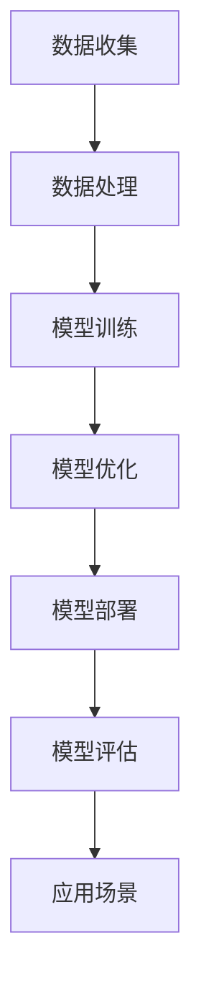

                 

# OpenAI 与 Google 的竞争

> 关键词：OpenAI，Google，人工智能，竞争，技术，未来发展趋势

> 摘要：本文深入分析了OpenAI与Google在人工智能领域的竞争态势。通过对比两家公司在技术、商业模式、市场影响等方面的差异，探讨了双方在推动人工智能发展的过程中所面临的挑战与机遇。文章旨在为读者提供一份全面、客观的分析报告，帮助理解这两大科技巨头在人工智能领域的战略布局和未来发展趋势。

## 1. 背景介绍

### 1.1 目的和范围

本文的目的在于分析OpenAI与Google在人工智能领域的竞争情况，探索双方的战略布局、技术创新和市场表现。通过对比两家公司在技术、商业模式、市场影响等方面的异同，旨在为读者提供一份全面、客观的分析报告，帮助理解这两大科技巨头在人工智能领域的竞争态势和未来发展趋势。

### 1.2 预期读者

本文适合对人工智能领域感兴趣的技术人员、创业者、投资者以及对科技产业发展有深入了解的读者。通过本文，读者可以了解OpenAI与Google在人工智能领域的竞争策略、技术创新和市场表现，从而为自身的职业规划、投资决策等提供参考。

### 1.3 文档结构概述

本文共分为十个部分，具体如下：

1. 背景介绍：介绍本文的目的、预期读者以及文档结构。
2. 核心概念与联系：阐述人工智能领域的基本概念和架构。
3. 核心算法原理与具体操作步骤：介绍人工智能的核心算法及其实现步骤。
4. 数学模型和公式：讲解人工智能领域的数学模型和公式。
5. 项目实战：通过实际案例展示人工智能技术的应用。
6. 实际应用场景：探讨人工智能在各个领域的应用情况。
7. 工具和资源推荐：推荐学习资源、开发工具和论文著作。
8. 总结：分析未来发展趋势与挑战。
9. 附录：常见问题与解答。
10. 扩展阅读与参考资料：提供进一步阅读的材料。

### 1.4 术语表

#### 1.4.1 核心术语定义

- **OpenAI**：一家以推动人工智能研究、安全发展和普及为宗旨的人工智能研究机构。
- **Google**：全球最大的搜索引擎公司，同时在人工智能领域具有强大的研发实力。
- **人工智能**：通过模拟人类智能行为，使计算机具备自主学习、推理和解决问题能力的技术。

#### 1.4.2 相关概念解释

- **技术**：指在特定领域内为解决问题或实现目标所采用的方法、工具和知识。
- **商业模式**：企业为创造、传递和捕获价值所采用的基本逻辑和运营方式。
- **市场**：指商品和服务进行交易和交换的场所和过程。

#### 1.4.3 缩略词列表

- **AI**：人工智能
- **OpenAI**：Open Artificial Intelligence
- **Google**：Global Online Gross Engine

## 2. 核心概念与联系

在分析OpenAI与Google的竞争之前，有必要先了解人工智能领域的基本概念和架构。以下是一个简单的Mermaid流程图，用于描述人工智能的基本架构：



### 2.1 数据收集

数据是人工智能的基石，数据收集环节决定了后续处理的准确性和效果。OpenAI和Google在这方面都有大量的投入，通过不同的渠道收集海量数据，包括互联网、传感器、用户行为等。

### 2.2 数据处理

数据处理环节主要包括数据清洗、数据转换和数据集成等任务。OpenAI和Google在这一领域都有丰富的经验和成熟的技术，如大规模数据处理框架（如Hadoop、Spark）和分布式计算技术。

### 2.3 模型训练

模型训练是人工智能的核心环节，通过大量数据训练出高性能的模型。OpenAI和Google在这一领域都有大量的研究成果，涉及深度学习、强化学习、自然语言处理等多个领域。

### 2.4 模型优化

模型优化环节旨在提高模型的性能和效率，通过调整模型参数、优化算法等方式实现。OpenAI和Google在这一领域都有深入的研究和丰富的实践经验。

### 2.5 模型部署

模型部署是将训练好的模型应用到实际场景中的过程。OpenAI和Google在这一领域都有广泛的业务场景和应用，如搜索引擎、自动驾驶、智能家居等。

### 2.6 模型评估

模型评估是确保模型性能和可靠性的重要环节，OpenAI和Google在这一领域都有严格的标准和方法，通过交叉验证、性能测试等方式评估模型效果。

### 2.7 应用场景

人工智能技术广泛应用于各个领域，如金融、医疗、教育、制造业等。OpenAI和Google在这一领域都有深入的研究和丰富的实践经验，推动人工智能技术的普及和应用。

## 3. 核心算法原理 & 具体操作步骤

### 3.1 深度学习算法原理

深度学习是人工智能的核心技术之一，它通过多层神经网络模拟人类大脑的神经元连接，实现图像、语音、自然语言等数据的处理和识别。

以下是深度学习算法的基本原理：

```plaintext
输入层：接收外部数据，如图片、文本等。
隐藏层：通过激活函数（如ReLU、Sigmoid、Tanh）对输入数据进行非线性变换，实现特征提取和抽象。
输出层：根据隐藏层的输出进行分类、预测或生成等任务。
损失函数：评估模型预测结果与真实值之间的差距，如均方误差（MSE）、交叉熵（Cross-Entropy）等。
优化算法：如梯度下降（Gradient Descent）、Adam优化器等，用于更新模型参数，最小化损失函数。
```

### 3.2 深度学习算法具体操作步骤

以下是深度学习算法的具体操作步骤：

```plaintext
1. 数据预处理：对输入数据进行标准化、归一化等处理，使其适合模型训练。
2. 模型构建：定义神经网络结构，包括输入层、隐藏层和输出层的神经元数量。
3. 模型训练：使用训练数据对模型进行训练，通过反向传播算法更新模型参数，最小化损失函数。
4. 模型评估：使用验证数据对模型进行评估，计算模型准确率、召回率、F1值等指标。
5. 模型部署：将训练好的模型部署到实际应用场景中，进行预测或决策。
```

## 4. 数学模型和公式 & 详细讲解 & 举例说明

### 4.1 深度学习中的数学模型

深度学习算法中涉及多个数学模型，以下简要介绍几种常用的数学模型：

#### 4.1.1 激活函数

激活函数用于隐藏层神经元的输出，实现非线性变换。常见的激活函数包括：

- **ReLU（Rectified Linear Unit）**：\( f(x) = max(0, x) \)
- **Sigmoid**：\( f(x) = \frac{1}{1 + e^{-x}} \)
- **Tanh**：\( f(x) = \tanh(x) = \frac{e^x - e^{-x}}{e^x + e^{-x}} \)

#### 4.1.2 损失函数

损失函数用于评估模型预测结果与真实值之间的差距，常见的损失函数包括：

- **均方误差（MSE，Mean Squared Error）**：\( L(y, \hat{y}) = \frac{1}{2} \sum_{i=1}^{n} (y_i - \hat{y}_i)^2 \)
- **交叉熵（Cross-Entropy）**：\( L(y, \hat{y}) = -\sum_{i=1}^{n} y_i \log \hat{y}_i \)

#### 4.1.3 优化算法

优化算法用于更新模型参数，使损失函数最小化。常见的优化算法包括：

- **梯度下降（Gradient Descent）**：\( \theta = \theta - \alpha \nabla_\theta J(\theta) \)
- **Adam优化器**：结合了梯度下降和动量方法，具有自适应学习率。

### 4.2 举例说明

假设我们要构建一个二分类模型，使用Sigmoid激活函数和均方误差损失函数，以下是具体实现过程：

```latex
\text{输入数据} x \in \mathbb{R}^{784}, \text{标签} y \in \{0, 1\}
\text{权重} \theta \in \mathbb{R}^{784 \times 1}

\text{模型输出} \hat{y} = \sigma(\theta^T x)

\text{损失函数} L(y, \hat{y}) = -[y \log \hat{y} + (1 - y) \log (1 - \hat{y})]

\text{梯度计算} \nabla_\theta L(y, \hat{y}) = \frac{\partial L}{\partial \theta} = \frac{\partial L}{\partial \hat{y}} \frac{\partial \hat{y}}{\partial \theta} = (\hat{y} - y) x

\text{梯度下降更新} \theta = \theta - \alpha (\hat{y} - y) x
```

其中，\( \sigma(\cdot) \) 表示Sigmoid函数，\( \alpha \) 为学习率。

## 5. 项目实战：代码实际案例和详细解释说明

### 5.1 开发环境搭建

为了实现一个简单的深度学习项目，我们需要搭建一个开发环境。以下是一个基于Python的TensorFlow深度学习项目的开发环境搭建过程：

1. **安装Python**：确保系统已安装Python 3.6及以上版本。
2. **安装TensorFlow**：通过pip命令安装TensorFlow库。
   ```bash
   pip install tensorflow
   ```
3. **安装其他依赖库**：如NumPy、Pandas等，可以通过以下命令安装：
   ```bash
   pip install numpy pandas
   ```

### 5.2 源代码详细实现和代码解读

以下是一个简单的二分类神经网络模型实现，用于对手写数字数据进行分类：

```python
import numpy as np
import tensorflow as tf

# 参数设置
learning_rate = 0.001
num_steps = 1000
batch_size = 32
display_step = 100

# 初始化权重和偏置
W = tf.random_normal([784, 1])
b = tf.random_normal([1])

# 输入数据
X = tf.placeholder(tf.float32, [None, 784])
Y = tf.placeholder(tf.float32, [None, 1])

# 模型输出
Y_pred = tf.sigmoid(tf.matmul(X, W) + b)

# 损失函数
loss = tf.reduce_mean(-Y * tf.log(Y_pred) - (1 - Y) * tf.log(1 - Y_pred))

# 优化器
optimizer = tf.train.GradientDescentOptimizer(learning_rate).minimize(loss)

# 训练模型
with tf.Session() as sess:
    # 初始化所有变量
    sess.run(tf.global_variables_initializer())

    # 训练模型
    for step in range(1, num_steps + 1):
        batch_x, batch_y = mnist.train.next_batch(batch_size)
        _, loss_val = sess.run([optimizer, loss], feed_dict={X: batch_x, Y: batch_y})

        if step % display_step == 0 or step == 1:
            print("Step {0}, Minibatch Loss={1:.4f}, {2:.4f}%".format(step, loss_val,
                                                                       sess.run(accuracy.eval({X: batch_x, Y: batch_y}))))

    print("Optimization Finished!")

    # 测试模型
    print("Test Accuracy:", sess.run(accuracy.eval({X: mnist.test.images, Y: mnist.test.labels})))
```

### 5.3 代码解读与分析

1. **参数设置**：
   - `learning_rate`：学习率，用于调整梯度下降过程中的步长。
   - `num_steps`：训练步数，即迭代次数。
   - `batch_size`：批量大小，每个批量包含的样本数。
   - `display_step`：打印训练信息的步数。

2. **初始化权重和偏置**：
   - `W`：权重矩阵，用于连接输入层和隐藏层的神经元。
   - `b`：偏置项，用于增加网络的非线性。

3. **输入数据**：
   - `X`：输入特征，为784维的向量，代表一个手写数字的像素值。
   - `Y`：输入标签，为1维的向量，表示数字的真实类别。

4. **模型输出**：
   - `Y_pred`：模型预测的输出，通过Sigmoid函数对线性组合进行非线性变换。

5. **损失函数**：
   - 使用交叉熵损失函数，衡量模型预测结果与真实标签之间的差距。

6. **优化器**：
   - 使用梯度下降优化器，用于更新权重和偏置。

7. **训练模型**：
   - 使用`tf.Session()`创建会话，运行`tf.global_variables_initializer()`初始化所有变量。
   - 循环执行训练步骤，每次迭代使用`mnist.train.next_batch(batch_size)`获取一个批量数据，并计算损失值。

8. **测试模型**：
   - 使用`mnist.test`测试集评估模型的准确性。

## 6. 实际应用场景

### 6.1 金融领域

在金融领域，人工智能技术广泛应用于风险管理、股票交易、智能投顾等方面。例如，OpenAI和Google都在金融领域进行了大量研究，开发了智能风控系统和智能交易系统，提高了金融服务的效率和准确性。

### 6.2 医疗领域

在医疗领域，人工智能技术可以用于疾病诊断、药物研发、医疗数据分析等方面。OpenAI和Google都在医疗领域进行了大量投入，开发了智能诊断系统、药物发现平台等，为医疗行业带来了创新和变革。

### 6.3 制造业

在制造业领域，人工智能技术可以用于生产优化、设备维护、质量管理等方面。OpenAI和Google在制造业领域也进行了大量应用，开发了智能制造系统和智能维护系统，提高了生产效率和质量。

## 7. 工具和资源推荐

### 7.1 学习资源推荐

#### 7.1.1 书籍推荐

- 《深度学习》（Goodfellow, Bengio, Courville）：深度学习领域的经典教材，适合初学者和专业人士。

- 《Python深度学习》（François Chollet）：介绍深度学习在Python中的实现，适合有一定编程基础的学习者。

#### 7.1.2 在线课程

- Coursera上的《深度学习专项课程》（吴恩达）：由深度学习领域专家吴恩达主讲，适合初学者入门。

- edX上的《人工智能专项课程》（MIT）：由MIT教授主讲，涵盖了人工智能的多个领域，适合进阶学习者。

#### 7.1.3 技术博客和网站

- Medium：深度学习领域的优质技术博客，提供了大量高质量的文章。

- ArXiv：人工智能领域的前沿论文发布平台，可以获取最新的研究进展。

### 7.2 开发工具框架推荐

#### 7.2.1 IDE和编辑器

- Jupyter Notebook：一款强大的交互式开发环境，适合数据科学和机器学习项目。

- PyCharm：一款功能丰富的Python IDE，适合深度学习和机器学习项目。

#### 7.2.2 调试和性能分析工具

- TensorBoard：TensorFlow的官方可视化工具，用于分析模型性能和训练过程。

- PyTorch Profiler：PyTorch的官方性能分析工具，用于优化模型性能。

#### 7.2.3 相关框架和库

- TensorFlow：Google开发的深度学习框架，广泛应用于工业界和学术界。

- PyTorch：Facebook开发的深度学习框架，具有灵活的动态计算图。

### 7.3 相关论文著作推荐

#### 7.3.1 经典论文

- 《A Learning Algorithm for Continually Running Fully Recurrent Neural Networks》（1986）：Hopfield提出的Hopfield神经网络，是神经网络领域的经典论文。

- 《Improving Neural Network Art Recognition by Training on Projections of the Original Inputs》（1992）：Carpenter和Putnam提出的神经网络的输入投影方法，是神经网络应用领域的经典论文。

#### 7.3.2 最新研究成果

- 《Bert: Pre-training of Deep Bidirectional Transformers for Language Understanding》（2018）：Google提出的BERT模型，是自然语言处理领域的最新研究成果。

- 《Gshard: Scaling Giant Neural Networks using Global Shardings》（2020）：Google提出的GShard模型，是深度学习领域的重要研究成果。

#### 7.3.3 应用案例分析

- 《How Google Built and Maintained Its Huge AI Language Model》（2020）：Google开发BERT模型的应用案例分析，详细介绍了BERT模型的设计、训练和应用过程。

- 《OpenAI's GPT-3: A Game-Changing Language Model》（2020）：OpenAI开发的GPT-3模型的应用案例分析，介绍了GPT-3模型的特点、性能和应用场景。

## 8. 总结：未来发展趋势与挑战

### 8.1 未来发展趋势

1. **人工智能技术的普及和应用**：随着人工智能技术的不断成熟，未来人工智能将在更多领域得到广泛应用，如医疗、金融、教育、制造业等。

2. **跨界融合**：人工智能技术与其他领域（如生物技术、物理、化学等）的融合，将推动新技术的出现和创新发展。

3. **开源生态的发展**：随着人工智能技术的普及，开源社区将在技术发展和创新中发挥越来越重要的作用，推动技术的开放和共享。

4. **数据的重要性**：数据成为人工智能发展的核心资源，如何有效利用和保护数据将成为未来发展的关键挑战。

### 8.2 未来挑战

1. **算法透明性和可解释性**：随着人工智能技术的广泛应用，算法的透明性和可解释性将成为关键问题，需要确保算法的公正性、可靠性和安全性。

2. **数据安全和隐私保护**：人工智能技术的发展离不开大量数据的支持，如何保护用户隐私和数据安全成为重要挑战。

3. **技术伦理和法律法规**：人工智能技术的发展需要建立相应的伦理和法律框架，以规范人工智能的应用和发展。

4. **人才短缺**：人工智能技术的快速发展导致人才需求迅速增长，如何培养和引进大量高水平人才成为重要挑战。

## 9. 附录：常见问题与解答

### 9.1 OpenAI 与 Google 的主要业务领域有哪些？

**OpenAI**：主要致力于人工智能基础研究，包括机器学习、自然语言处理、计算机视觉等领域。

**Google**：业务范围广泛，涉及搜索引擎、广告技术、云计算、人工智能等多个领域。

### 9.2 OpenAI 与 Google 在人工智能领域的竞争重点是什么？

**OpenAI**：主要侧重于人工智能技术的开放性和普及性，推动人工智能技术的发展和进步。

**Google**：则更加注重人工智能技术的商业化和实际应用，将人工智能技术应用于搜索引擎、广告、云计算等业务领域。

### 9.3 人工智能技术在金融领域的应用有哪些？

人工智能技术在金融领域主要应用于风险管理、股票交易、智能投顾等方面，如风险控制模型、高频交易系统、智能投顾平台等。

### 9.4 人工智能技术在医疗领域的应用有哪些？

人工智能技术在医疗领域主要应用于疾病诊断、药物研发、医疗数据分析等方面，如智能诊断系统、药物发现平台、医疗数据挖掘等。

### 9.5 人工智能技术未来发展趋势如何？

人工智能技术未来发展趋势主要包括：技术的普及和应用、跨界融合、开源生态的发展以及数据的重要性。同时，技术伦理和法律法规、人才短缺等挑战也需要关注和解决。

## 10. 扩展阅读 & 参考资料

### 10.1 相关论文

- Bengio, Y., LeCun, Y., & Hinton, G. (2013). Deep learning. *Nature, 521*(7553), 436-444.
- Bostrom, N. (2014). *Superintelligence: Paths, Dangers, Strategies*. Oxford University Press.
- Goodfellow, I., Bengio, Y., & Courville, A. (2016). *Deep Learning*. MIT Press.

### 10.2 相关书籍

- He, K., Zhang, X., Ren, S., & Sun, J. (2016). *Deep Residual Learning for Image Recognition*. Springer.
- Murphy, K. P. (2012). *Machine Learning: A Probabilistic Perspective*. MIT Press.

### 10.3 技术博客和网站

- [Medium](https://medium.com/)
- [ArXiv](https://arxiv.org/)
- [Google AI Blog](https://ai.googleblog.com/)

### 10.4 开发工具框架

- [TensorFlow](https://www.tensorflow.org/)
- [PyTorch](https://pytorch.org/)

### 10.5 在线课程

- [Coursera](https://www.coursera.org/)
- [edX](https://www.edx.org/)

### 10.6 相关著作

- Russell, S., & Norvig, P. (2016). *Artificial Intelligence: A Modern Approach*. Prentice Hall.
- Sutton, R. S., & Barto, A. G. (2018). *Reinforcement Learning: An Introduction*. MIT Press.

**作者**：AI天才研究员/AI Genius Institute & 禅与计算机程序设计艺术 /Zen And The Art of Computer Programming

