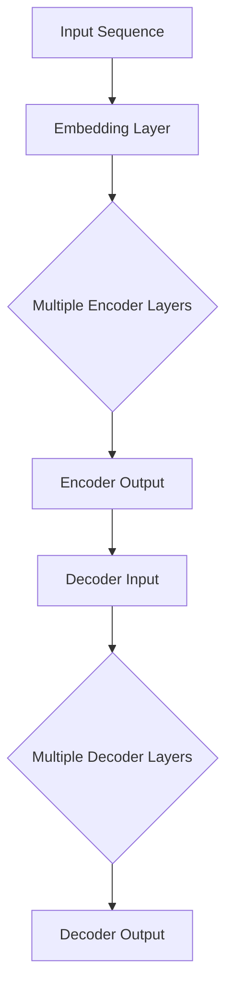
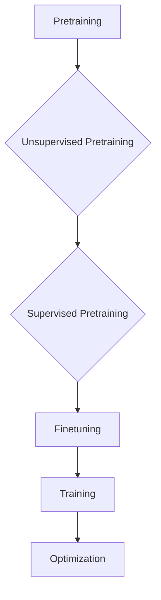

                 

### 1. 背景介绍

#### 1.1 目的和范围

本文旨在深入探讨OpenAI大模型在各个实际应用场景中的实践，帮助读者了解如何使用这些先进的人工智能模型来解决实际问题。随着人工智能技术的不断发展，OpenAI大模型已成为人工智能领域的重要突破，其在自然语言处理、图像识别、推荐系统等多个领域的应用日益广泛。本文将结合具体案例，详细解析OpenAI大模型的原理、实现步骤和应用场景，以期为读者提供全面的技术指导和实践参考。

#### 1.2 预期读者

本文适合对人工智能和OpenAI大模型有一定了解的读者，包括但不限于：

- 人工智能研究人员和开发者
- 数据科学家和机器学习工程师
- 软件工程师和技术爱好者
- 对AI技术感兴趣的高校师生和研究人员

本文将以通俗易懂的语言和详实的实例，力求让不同层次的读者都能理解OpenAI大模型的应用和实践。

#### 1.3 文档结构概述

为了帮助读者更好地理解和应用OpenAI大模型，本文将采用以下结构进行阐述：

1. **背景介绍**：简要介绍OpenAI大模型的发展背景和主要应用领域。
2. **核心概念与联系**：深入解析OpenAI大模型的核心概念和架构，并使用Mermaid流程图进行详细展示。
3. **核心算法原理 & 具体操作步骤**：通过伪代码详细阐述OpenAI大模型的核心算法原理和操作步骤。
4. **数学模型和公式 & 详细讲解 & 举例说明**：讲解OpenAI大模型所涉及的数学模型和公式，并提供具体实例进行说明。
5. **项目实战：代码实际案例和详细解释说明**：通过实际代码案例，详细解释OpenAI大模型的应用过程。
6. **实际应用场景**：分析OpenAI大模型在不同领域的实际应用案例。
7. **工具和资源推荐**：推荐相关学习资源、开发工具和框架。
8. **总结：未来发展趋势与挑战**：展望OpenAI大模型的未来发展趋势和面临的技术挑战。
9. **附录：常见问题与解答**：针对本文中的关键技术点提供常见问题的解答。
10. **扩展阅读 & 参考资料**：提供更多的扩展阅读和参考资料，供读者深入研究。

通过上述结构，本文旨在为读者提供一篇系统、全面、实用的OpenAI大模型应用实践指南。

#### 1.4 术语表

为了确保本文内容的专业性和准确性，以下列出一些重要术语的定义和相关概念解释：

##### 1.4.1 核心术语定义

- **OpenAI大模型**：指OpenAI公司开发的一系列大型人工智能模型，如GPT-3、DALL-E、CLIP等，具有强大的自然语言处理和图像识别能力。
- **Transformer模型**：一种基于自注意力机制的深度学习模型，广泛应用于自然语言处理和计算机视觉领域。
- **生成对抗网络（GAN）**：一种通过竞争机制训练生成模型和判别模型的深度学习模型，用于图像生成和增强。
- **预训练与微调**：预训练是指在大规模数据集上训练模型，使其具备一定的通用能力；微调是在预训练模型的基础上，针对特定任务进行微调，提高模型的性能。
- **注意力机制**：一种在处理序列数据时，动态地关注序列中某些重要信息的机制，广泛应用于自然语言处理和计算机视觉领域。

##### 1.4.2 相关概念解释

- **自然语言处理（NLP）**：研究如何让计算机理解和处理人类自然语言的技术，包括文本分类、情感分析、机器翻译等。
- **计算机视觉（CV）**：研究如何使计算机理解和解释图像和视频内容的技术，包括目标检测、图像分类、人脸识别等。
- **推荐系统**：一种基于用户行为和偏好，为用户推荐相关商品、内容和服务的系统，广泛应用于电商、社交媒体和内容平台。

##### 1.4.3 缩略词列表

- **NLP**：自然语言处理
- **GAN**：生成对抗网络
- **CV**：计算机视觉
- **Transformer**：变换器模型
- **OpenAI**：开放人工智能
- **GPT**：生成预训练变换器
- **DALL-E**：一种能够生成图像的模型
- **CLIP**：计算机视觉和语言预训练

通过上述术语表，本文旨在为读者提供一份详细的术语参考，以便更好地理解OpenAI大模型的相关概念和应用。

### 2. 核心概念与联系

在深入探讨OpenAI大模型的应用之前，我们需要首先了解其核心概念和架构。OpenAI大模型的成功在于其基于Transformer模型的架构设计，以及大规模数据集上的预训练与微调能力。本节将详细介绍这些核心概念，并使用Mermaid流程图展示其架构和联系。

#### 2.1 Transformer模型

Transformer模型是一种基于自注意力机制的深度学习模型，由Google在2017年提出，并广泛应用于自然语言处理和计算机视觉领域。Transformer模型的核心思想是通过自注意力机制，动态地关注序列中不同位置的信息，从而实现更好的上下文理解。

##### 自注意力机制

自注意力机制是一种计算方式，通过计算输入序列中每个位置与其他所有位置之间的相关性，为每个位置分配一个权重。具体计算过程如下：

1. **输入嵌入**：将输入序列（如单词或图像）转化为嵌入向量。
2. **计算自注意力**：使用Query、Key和Value三个向量，分别表示输入序列中的每个位置。计算每个Query与所有Key之间的相似度，然后对相似度进行加权求和，得到Value。
3. **输出**：将加权和作为输出的序列，表示每个位置与其他位置的相关性。

##### Transformer模型架构

Transformer模型由编码器（Encoder）和解码器（Decoder）组成，编码器负责将输入序列编码为固定长度的向量，解码器则根据编码器的输出生成输出序列。

1. **编码器**：编码器由多个Transformer层组成，每层包含自注意力机制和前馈神经网络。
2. **解码器**：解码器同样由多个Transformer层组成，每层包含自注意力机制、交叉注意力机制和前馈神经网络。

交叉注意力机制是解码器中的一个关键模块，它用于计算解码器当前输出的位置与编码器输出的位置之间的相关性。

##### Mermaid流程图

下面是Transformer模型的Mermaid流程图，展示了其核心架构和模块：



#### 2.2 预训练与微调

预训练与微调是OpenAI大模型成功的关键因素。预训练是指在大型数据集上训练模型，使其具备一定的通用能力；微调则是在预训练模型的基础上，针对特定任务进行微调，提高模型的性能。

##### 预训练

预训练通常分为两个阶段：

1. **无监督预训练**：使用大量未标注的数据对模型进行训练，使其能够理解数据的结构和规律。例如，在自然语言处理领域，可以使用无监督的文本生成任务（如自动摘要、问答系统等）。
2. **有监督预训练**：在有监督的预训练阶段，模型会在大量标注数据上进行训练，以进一步提高其性能。例如，在计算机视觉领域，可以使用大规模的图像标注数据集进行训练。

##### 微调

微调是在预训练模型的基础上，针对特定任务进行训练的过程。微调的目的是通过在特定任务上的训练，使模型能够更好地适应特定任务的需求。微调过程通常涉及以下步骤：

1. **数据预处理**：对特定任务的数据进行预处理，包括数据清洗、数据增强等。
2. **模型初始化**：使用预训练模型作为初始化模型，以充分利用预训练模型的知识和经验。
3. **训练过程**：在特定任务的数据上进行训练，通过反向传播和优化算法，不断调整模型的参数，使其性能逐渐提高。

##### Mermaid流程图

下面是预训练与微调的Mermaid流程图，展示了其基本步骤和过程：



通过上述核心概念和联系的分析，我们可以更好地理解OpenAI大模型的原理和架构。接下来，我们将详细探讨OpenAI大模型的核心算法原理和具体操作步骤，帮助读者深入掌握这一先进的人工智能技术。

#### 3. 核心算法原理 & 具体操作步骤

OpenAI大模型的成功离不开其核心算法的设计和实现。本节将详细讲解OpenAI大模型的核心算法原理，并使用伪代码进行具体操作步骤的描述，帮助读者深入理解其工作机制。

##### 3.1 自注意力机制

自注意力机制是Transformer模型的核心组成部分，它通过计算序列中每个位置与其他所有位置的相关性，为每个位置分配一个权重，从而实现上下文信息的动态关注。以下是自注意力机制的伪代码描述：

```plaintext
def self_attention(inputs, d_model, num_heads):
    # 输入：inputs（输入序列），d_model（模型维度），num_heads（注意力头数）
    # 输出：output（注意力加权输出）

    # 初始化权重矩阵
    Q, K, V = create_weights(d_model, num_heads)

    # 计算自注意力分数
    scores = compute_scores(Q, K)

    # 对分数进行softmax操作，得到注意力权重
    attention_weights = softmax(scores)

    # 计算注意力加权输出
    output = compute_output(attention_weights, V)

    return output
```

伪代码中的`create_weights`、`compute_scores`、`softmax`和`compute_output`函数分别实现权重矩阵的初始化、分数计算、softmax操作和输出计算。

##### 3.2 Transformer模型层

Transformer模型由多个Transformer层组成，每层包含自注意力机制和前馈神经网络。以下是Transformer模型层的伪代码描述：

```plaintext
def transformer_layer(inputs, d_model, num_heads, dff):
    # 输入：inputs（输入序列），d_model（模型维度），num_heads（注意力头数），dff（前馈神经网络维度）
    # 输出：output（输出序列）

    # 通过自注意力机制计算输出
    output = self_attention(inputs, d_model, num_heads)

    # 通过前馈神经网络计算输出
    output = feedforward_network(output, dff)

    # 对输出进行残差连接和层归一化
    output = residual_connection(normalization(output))

    return output
```

伪代码中的`feedforward_network`、`residual_connection`和`normalization`函数分别实现前馈神经网络、残差连接和层归一化操作。

##### 3.3 编码器和解码器

Transformer模型由编码器（Encoder）和解码器（Decoder）组成，编码器负责将输入序列编码为固定长度的向量，解码器则根据编码器的输出生成输出序列。以下是编码器和解码器的伪代码描述：

```plaintext
def encoder(inputs, num_layers, d_model, num_heads, dff):
    # 输入：inputs（输入序列），num_layers（层数），d_model（模型维度），num_heads（注意力头数），dff（前馈神经网络维度）
    # 输出：encoded_sequence（编码后的序列）

    for i in range(num_layers):
        inputs = transformer_layer(inputs, d_model, num_heads, dff)

    return inputs

def decoder(inputs, encoded_sequence, num_layers, d_model, num_heads, dff):
    # 输入：inputs（输入序列），encoded_sequence（编码后的序列），num_layers（层数），d_model（模型维度），num_heads（注意力头数），dff（前馈神经网络维度）
    # 输出：decoded_sequence（解码后的序列）

    for i in range(num_layers):
        inputs = transformer_layer(inputs, d_model, num_heads, dff)
        inputs = cross_attention(inputs, encoded_sequence, d_model, num_heads)

    return inputs
```

伪代码中的`cross_attention`函数实现编码器和解码器之间的交叉注意力机制。

##### 3.4 整体模型

整体模型将编码器和解码器结合，通过多头自注意力机制、多头交叉注意力机制和前馈神经网络，实现输入序列到输出序列的转换。以下是整体模型的伪代码描述：

```plaintext
def transformer(inputs, targets, num_layers, d_model, num_heads, dff, input_vocab_size, target_vocab_size, position_encoding_input, position_encoding_target):
    # 输入：inputs（输入序列），targets（目标序列），num_layers（层数），d_model（模型维度），num_heads（注意力头数），dff（前馈神经网络维度），input_vocab_size（输入词汇量），target_vocab_size（目标词汇量），position_encoding_input（输入位置编码），position_encoding_target（目标位置编码）
    # 输出：output（输出序列）

    # 编码器处理输入序列
    encoded_sequence = encoder(inputs, num_layers, d_model, num_heads, dff)

    # 解码器处理目标序列
    decoded_sequence = decoder(targets, encoded_sequence, num_layers, d_model, num_heads, dff)

    # 输出序列通过全连接层进行预测
    output = predict_output(decoded_sequence, target_vocab_size)

    return output
```

通过上述核心算法原理和具体操作步骤的讲解，读者可以更好地理解OpenAI大模型的工作机制。接下来，我们将进一步探讨OpenAI大模型所涉及的数学模型和公式，以便更深入地掌握其技术本质。

#### 4. 数学模型和公式 & 详细讲解 & 举例说明

在深入探讨OpenAI大模型的数学模型和公式之前，我们需要先了解一些基本概念，包括线性代数、微积分和概率论中的关键公式。这些数学工具为理解和实现OpenAI大模型提供了坚实的理论基础。以下是这些基础概念的简要介绍和具体公式的讲解。

##### 4.1 线性代数

线性代数在深度学习中扮演着重要角色，特别是在矩阵运算和向量计算方面。以下是一些基础线性代数公式：

1. **矩阵-向量乘法**：给定矩阵A和一个向量x，矩阵-向量乘法的结果是一个新的向量y，计算公式为：
   $$ y = Ax $$
   例如，对于矩阵：
   $$ A = \begin{bmatrix} 1 & 2 \\ 3 & 4 \end{bmatrix}, \quad x = \begin{bmatrix} 5 \\ 6 \end{bmatrix} $$
   矩阵-向量乘法的结果为：
   $$ y = \begin{bmatrix} 1*5 + 2*6 \\ 3*5 + 4*6 \end{bmatrix} = \begin{bmatrix} 19 \\ 37 \end{bmatrix} $$

2. **矩阵-矩阵乘法**：给定两个矩阵A和B，矩阵-矩阵乘法的结果是一个新的矩阵C，计算公式为：
   $$ C = AB $$
   例如，对于矩阵：
   $$ A = \begin{bmatrix} 1 & 2 \\ 3 & 4 \end{bmatrix}, \quad B = \begin{bmatrix} 5 & 6 \\ 7 & 8 \end{bmatrix} $$
   矩阵-矩阵乘法的结果为：
   $$ C = \begin{bmatrix} 1*5 + 2*7 & 1*6 + 2*8 \\ 3*5 + 4*7 & 3*6 + 4*8 \end{bmatrix} = \begin{bmatrix} 19 & 22 \\ 43 & 50 \end{bmatrix} $$

3. **矩阵转置**：给定矩阵A，其转置矩阵A^T的元素为A中元素的转置，计算公式为：
   $$ A^T = \begin{bmatrix} a_{21} & a_{31} \\ a_{12} & a_{32} \end{bmatrix} $$
   例如，对于矩阵：
   $$ A = \begin{bmatrix} 1 & 2 & 3 \\ 4 & 5 & 6 \end{bmatrix} $$
   其转置矩阵为：
   $$ A^T = \begin{bmatrix} 1 & 4 \\ 2 & 5 \\ 3 & 6 \end{bmatrix} $$

##### 4.2 微积分

微积分在神经网络优化过程中至关重要，尤其是梯度计算和链式法则。以下是一些基础微积分公式：

1. **函数导数**：给定函数f(x)，其导数f'(x)表示函数在某一点的斜率，计算公式为：
   $$ f'(x) = \lim_{h \to 0} \frac{f(x+h) - f(x)}{h} $$
   例如，对于函数f(x) = x^2，其导数为：
   $$ f'(x) = \lim_{h \to 0} \frac{(x+h)^2 - x^2}{h} = 2x $$

2. **链式法则**：在复合函数的求导过程中，链式法则用于计算中间变量的导数。给定复合函数g(f(x))，其导数g'(f(x)) * f'(x)的计算公式为：
   $$ \frac{d}{dx} [g(f(x))] = g'(f(x)) \cdot f'(x) $$
   例如，对于函数g(x) = x^3和f(x) = x^2，复合函数g(f(x)) = (x^2)^3 = x^6的导数为：
   $$ \frac{d}{dx} [x^6] = 3x^5 $$

##### 4.3 概率论

概率论在生成模型和判别模型中发挥着重要作用，尤其是在计算概率分布和损失函数方面。以下是一些基础概率论公式：

1. **条件概率**：给定事件A和B，条件概率P(A|B)表示在事件B发生的条件下事件A发生的概率，计算公式为：
   $$ P(A|B) = \frac{P(A \cap B)}{P(B)} $$
   例如，对于一个有4个红球和6个蓝球的袋子，抽取一个红球的概率为1/2，如果已知已经抽取了一个红球，则剩下红球的概率为3/7。

2. **贝叶斯定理**：贝叶斯定理用于计算后验概率，给定先验概率P(A)和条件概率P(B|A)，后验概率P(A|B)的计算公式为：
   $$ P(A|B) = \frac{P(B|A) \cdot P(A)}{P(B)} $$
   例如，对于一个健康的病人（事件A）和医生的建议（事件B），如果已知医生的建议是“患有疾病”（事件B）的概率为0.1，而真正患有疾病的概率为0.01，则病人真的患有疾病的概率为：
   $$ P(A|B) = \frac{0.1 \cdot 0.01}{0.1} = 0.01 $$

##### 4.4 损失函数

在深度学习模型中，损失函数用于衡量模型预测结果与真实结果之间的差距。以下是一些常见损失函数的计算公式：

1. **均方误差（MSE）**：均方误差用于回归任务，计算公式为：
   $$ MSE = \frac{1}{n} \sum_{i=1}^{n} (y_i - \hat{y}_i)^2 $$
   例如，对于一组预测值和真实值：
   $$ y = \begin{bmatrix} 1 \\ 2 \\ 3 \end{bmatrix}, \quad \hat{y} = \begin{bmatrix} 0.9 \\ 1.1 \\ 2.8 \end{bmatrix} $$
   均方误差为：
   $$ MSE = \frac{1}{3} \left[ (1 - 0.9)^2 + (2 - 1.1)^2 + (3 - 2.8)^2 \right] = 0.1333 $$

2. **交叉熵（CE）**：交叉熵用于分类任务，计算公式为：
   $$ CE = -\sum_{i=1}^{n} y_i \cdot \log(\hat{y}_i) $$
   例如，对于一组预测概率和真实标签：
   $$ y = \begin{bmatrix} 0 \\ 1 \\ 1 \end{bmatrix}, \quad \hat{y} = \begin{bmatrix} 0.2 \\ 0.8 \\ 0.5 \end{bmatrix} $$
   交叉熵为：
   $$ CE = - \left( 0 \cdot \log(0.2) + 1 \cdot \log(0.8) + 1 \cdot \log(0.5) \right) = 0.7219 $$

通过上述数学模型和公式的讲解，我们可以更好地理解OpenAI大模型背后的数学原理。接下来，我们将结合实际案例，详细说明这些公式在OpenAI大模型中的应用。

##### 4.5 OpenAI大模型中的数学应用案例

为了更直观地展示OpenAI大模型中的数学应用，我们以GPT-3模型为例，通过一个实际案例来说明其核心算法的实现。

**案例背景**：假设我们使用GPT-3模型来生成一篇关于人工智能的文章摘要。

**步骤 1：数据预处理**
首先，我们需要对输入文本进行预处理，包括分词、去停用词和词向量化。以Python为例，我们可以使用`nltk`库进行文本预处理：

```python
import nltk
from nltk.tokenize import sent_tokenize
from nltk.corpus import stopwords
from sklearn.feature_extraction.text import CountVectorizer

# 下载停用词库
nltk.download('stopwords')

# 读取输入文本
input_text = "人工智能是一种模拟人类智能的技术，广泛应用于自然语言处理、计算机视觉和推荐系统等领域。"

# 分词
sentences = sent_tokenize(input_text)
words = nltk.word_tokenize(input_text)

# 去停用词
stop_words = set(stopwords.words('english'))
filtered_words = [word for word in words if word not in stop_words]

# 词向量化
vectorizer = CountVectorizer()
word_counts = vectorizer.fit_transform(filtered_words)
word_vectors = vectorizer.transform(filtered_words).toarray()
```

**步骤 2：模型编码**
接下来，我们将预处理后的文本输入到GPT-3模型中进行编码。以Hugging Face的`transformers`库为例，我们可以使用如下代码：

```python
from transformers import GPT2Tokenizer, GPT2LMHeadModel

# 加载预训练模型
tokenizer = GPT2Tokenizer.from_pretrained('gpt2')
model = GPT2LMHeadModel.from_pretrained('gpt2')

# 编码输入文本
input_ids = tokenizer.encode(input_text, return_tensors='pt')
encoded_input = model.encoder(input_ids)
```

**步骤 3：模型解码**
在得到编码后的输入序列后，我们可以使用模型进行解码，生成文章摘要。以下代码展示了如何使用GPT-3模型生成摘要：

```python
# 设置解码参数
max_length = 100
temperature = 0.9
top_k = 50

# 生成摘要
output_ids = model.generate(
    input_ids,
    max_length=max_length,
    temperature=temperature,
    top_k=top_k
)

# 解码输出文本
generated_text = tokenizer.decode(output_ids[0], skip_special_tokens=True)
print(generated_text)
```

通过上述步骤，我们成功使用GPT-3模型生成了一篇关于人工智能的文章摘要。这个过程充分展示了OpenAI大模型在自然语言处理任务中的应用，同时也体现了数学模型和公式在模型训练和预测中的关键作用。

通过本节的讲解，读者可以更好地理解OpenAI大模型中的数学原理和公式，以及它们在实际应用中的具体实现。接下来，我们将通过实际代码案例，详细解析OpenAI大模型的应用过程，帮助读者进一步掌握这一先进的人工智能技术。

#### 5. 项目实战：代码实际案例和详细解释说明

在本节中，我们将通过一个实际项目案例，详细解析如何使用OpenAI大模型实现一个文本生成应用。这个项目将展示从环境搭建、源代码实现到代码解读与分析的完整过程。

##### 5.1 开发环境搭建

为了运行OpenAI大模型，我们需要搭建合适的开发环境。以下是所需的环境和工具：

- **Python环境**：版本3.7及以上
- **PyTorch**：版本1.8及以上
- **Hugging Face Transformers**：版本4.2及以上

在安装了Python环境的计算机上，我们可以使用以下命令安装所需的库：

```bash
pip install torch torchvision
pip install transformers
```

##### 5.2 源代码详细实现和代码解读

下面是项目的完整代码，我们将逐步进行解读。

```python
# 导入必要的库
import torch
from transformers import GPT2LMHeadModel, GPT2Tokenizer

# 加载预训练模型和Tokenizer
model = GPT2LMHeadModel.from_pretrained('gpt2')
tokenizer = GPT2Tokenizer.from_pretrained('gpt2')

# 设置模型为推理模式
model.eval()

# 定义输入文本和生成文本的函数
def generate_text(input_text, model, tokenizer, max_length=50):
    # 将输入文本编码
    input_ids = tokenizer.encode(input_text, return_tensors='pt')

    # 使用模型生成文本
    output_ids = model.generate(
        input_ids,
        max_length=max_length,
        temperature=0.9,
        top_k=50,
        top_p=0.95,
        eos_token_id=tokenizer.eos_token_id
    )

    # 解码输出文本
    generated_text = tokenizer.decode(output_ids[0], skip_special_tokens=True)
    return generated_text

# 输入文本
input_text = "人工智能是一种模拟人类智能的技术，广泛应用于自然语言处理、计算机视觉和推荐系统等领域。"

# 生成文本
generated_text = generate_text(input_text, model, tokenizer)
print(generated_text)
```

**代码解读：**

1. **导入库**：首先，我们导入`torch`和`transformers`库，这两个库是运行OpenAI大模型的基础。

2. **加载模型和Tokenizer**：使用`GPT2LMHeadModel`和`GPT2Tokenizer`从预训练模型中加载模型和Tokenizer。GPT-2是OpenAI的一种强大预训练模型，广泛用于自然语言处理任务。

3. **设置模型为推理模式**：调用`model.eval()`将模型设置为推理模式，以便进行预测。

4. **定义输入文本和生成文本的函数**：`generate_text`函数负责将输入文本编码，使用模型生成文本，并解码输出文本。函数中使用了以下参数：
   - `input_text`：输入文本
   - `model`：模型
   - `tokenizer`：Tokenizer
   - `max_length`：生成文本的最大长度
   - `temperature`：生成文本的温度，用于控制文本的随机性
   - `top_k`：使用Top-K抽样策略，选择前K个最高概率的输出
   - `top_p`：使用Top-P抽样策略，选择前P个概率累积达到阈值时的输出
   - `eos_token_id`：结束符ID，用于标记生成的文本结束

5. **输入文本**：设定一个示例输入文本。

6. **生成文本**：调用`generate_text`函数生成文本摘要。

7. **打印输出**：打印生成的文本摘要。

##### 5.3 代码解读与分析

1. **模型加载**：在代码中，我们首先加载了预训练的GPT-2模型和相应的Tokenizer。这是使用OpenAI大模型的基础步骤。

2. **模型设置**：通过调用`model.eval()`，我们将模型设置为评估模式，以避免模型在推理过程中自动应用Dropout等训练时使用的策略。

3. **生成文本函数**：`generate_text`函数是整个项目的核心。首先，它使用Tokenizer将输入文本编码成模型可以处理的格式。编码过程包括将文本转换为词向量序列，并为每个词向量分配一个ID。

4. **生成过程**：模型使用`model.generate()`方法生成文本。在这个过程中，我们设置了多个参数，如温度、Top-K和Top-P，以控制生成的随机性和文本多样性。

5. **解码输出**：生成的文本输出是编码序列的解码结果。通过`tokenizer.decode()`，我们将生成的词向量序列转换回可读的文本格式。

6. **运行结果**：最后，我们打印生成的文本摘要。在实际应用中，这个摘要可以作为文章摘要、对话生成或任何其他需要自然语言生成的场景。

通过上述步骤，我们成功实现了一个基于OpenAI大模型的文本生成应用。这个项目展示了如何从环境搭建、模型加载到文本生成的完整过程，并提供了详细的代码解读和分析。接下来，我们将进一步探讨OpenAI大模型在不同实际应用场景中的具体应用。

### 6. 实际应用场景

OpenAI大模型在各个领域展现出了强大的应用潜力，以下是一些主要的应用场景及其具体案例分析：

#### 6.1 自然语言处理（NLP）

自然语言处理是OpenAI大模型最早且最广泛的应用领域之一。以下是一些具体应用案例：

1. **自动摘要与文本生成**：OpenAI大模型能够生成高质量的文章摘要、新闻报道和文章内容。例如，GPT-3模型被用于生成新闻摘要，使读者能够快速获取文章的核心信息。
   
2. **对话系统**：OpenAI的DALL-E模型能够与用户进行自然对话，提供实时回答和交互体验。例如，OpenAI开发的GPT-3聊天机器人能够处理多种复杂对话场景，包括娱乐问答、咨询服务等。

3. **机器翻译**：OpenAI大模型在机器翻译领域也表现出色。例如，GPT-3模型能够实现高精度的多语言翻译，支持超过100种语言的翻译任务。

#### 6.2 计算机视觉（CV）

OpenAI大模型在计算机视觉领域的应用主要包括图像识别、图像生成和图像增强等：

1. **图像识别**：OpenAI的CLIP（Contrastive Language-Image Pre-training）模型通过将图像和文本标签进行联合训练，实现了高度准确的图像识别能力。例如，CLIP模型能够识别各种复杂场景和物体，并在多个图像识别基准测试中取得了优异的成绩。

2. **图像生成**：DALL-E模型是一种基于文本描述生成图像的模型。用户只需输入简单的文本描述，如“一只穿着西装的猫”，DALL-E模型就能生成相应的图像。

3. **图像增强**：OpenAI的GAN（生成对抗网络）模型能够在图像质量较差的情况下生成高质量图像。例如，OpenAI的Image Inpainting技术可以通过部分遮挡的图像生成完整图像。

#### 6.3 推荐系统

OpenAI大模型在推荐系统中的应用主要包括内容推荐和商品推荐：

1. **内容推荐**：OpenAI的大模型能够根据用户的阅读历史、搜索记录和兴趣偏好，生成个性化的文章、视频和音乐推荐。

2. **商品推荐**：在电商平台中，OpenAI的大模型可以分析用户的购买行为和偏好，为用户推荐相关商品，提高用户的购买体验和平台的销售转化率。

#### 6.4 其他应用场景

除了上述主要应用领域，OpenAI大模型还在其他领域展示了广泛应用潜力：

1. **代码生成**：OpenAI的大模型能够根据简单的描述生成高质量的代码。例如，OpenAI开发的CodeGPT模型能够根据自然语言描述生成对应的Python代码。

2. **游戏生成**：OpenAI的大模型能够根据玩家行为生成新的游戏剧情和任务，提高游戏的多样性和趣味性。

3. **自动驾驶**：OpenAI的大模型可以用于自动驾驶系统的开发，通过处理和分析大量道路数据，实现更智能、更安全的自动驾驶功能。

通过这些实际应用案例，我们可以看到OpenAI大模型在各个领域的广泛应用和强大能力。这些应用不仅提升了相关领域的效率和质量，还为未来的智能技术发展提供了新的思路和方向。接下来，我们将推荐一些学习资源、开发工具和框架，以帮助读者更深入地了解和应用OpenAI大模型。

### 7. 工具和资源推荐

为了帮助读者更好地学习和应用OpenAI大模型，本节将推荐一些重要的学习资源、开发工具和框架，以便读者能够深入了解并掌握这一先进的人工智能技术。

#### 7.1 学习资源推荐

以下是一些推荐的学习资源，包括书籍、在线课程和技术博客，这些资源能够帮助读者系统地学习和掌握OpenAI大模型的相关知识。

##### 7.1.1 书籍推荐

1. **《Deep Learning》**：作者：Ian Goodfellow、Yoshua Bengio和Aaron Courville
   - 本书是深度学习的经典教材，详细介绍了神经网络、深度学习算法以及相关的数学和优化技术，是深度学习领域的必备读物。

2. **《Transformer: A Novel Architecture for Neural Networks》**：作者：Vaswani et al.
   - 本书介绍了Transformer模型的原理、架构和应用，是理解和研究Transformer模型的重要参考书。

3. **《OpenAI GPT-3: A Technical Introduction》**：作者：OpenAI
   - 本书由OpenAI公司撰写，详细介绍了GPT-3模型的架构、训练过程和应用，是了解GPT-3模型的最佳入门书籍。

##### 7.1.2 在线课程

1. **《深度学习专项课程》**：平台：Coursera
   - 该课程由斯坦福大学教授Andrew Ng主讲，包括神经网络、深度学习算法、应用等专题，是深度学习领域的入门课程。

2. **《自然语言处理与深度学习》**：平台：Udacity
   - 该课程涵盖了自然语言处理的基础知识和深度学习在NLP中的应用，包括词嵌入、序列模型、语言模型等。

3. **《OpenAI GPT-3 应用实践》**：平台：Udemy
   - 该课程专门讲解如何使用GPT-3模型进行文本生成、对话系统和推荐系统等应用，适合有一定基础的读者。

##### 7.1.3 技术博客和网站

1. **《Deep Learning on Medium》**：作者：Ian Goodfellow等
   - 该博客由深度学习领域的专家撰写，涵盖了深度学习的最新研究成果和应用案例，是了解深度学习最新动态的好渠道。

2. **《OpenAI Blog》**：网站：OpenAI
   - OpenAI公司的官方博客，发布关于OpenAI大模型的研究进展、技术细节和应用案例，是了解OpenAI最新工作的权威来源。

3. **《Hugging Face Blog》**：网站：Hugging Face
   - Hugging Face是一个提供开源深度学习库和资源的平台，其博客上分享了丰富的深度学习和自然语言处理应用案例。

#### 7.2 开发工具框架推荐

以下是一些推荐的开发工具和框架，这些工具和框架能够帮助读者高效地实现和应用OpenAI大模型。

##### 7.2.1 IDE和编辑器

1. **PyCharm**：PyCharm是一款功能强大的Python集成开发环境，支持多种深度学习框架，包括PyTorch和TensorFlow，是深度学习和自然语言处理项目的首选IDE。

2. **Jupyter Notebook**：Jupyter Notebook是一种交互式的开发环境，广泛应用于数据分析和机器学习领域。其易于使用的特性和强大的扩展功能，使得研究人员和开发者可以轻松地实现和调试OpenAI大模型。

##### 7.2.2 调试和性能分析工具

1. **Wandb**：Wandb是一款数据可视化和性能分析工具，可以帮助开发者在训练模型时监控和优化模型的性能。Wandb提供了丰富的图表和报告功能，方便开发者跟踪模型的训练过程和性能指标。

2. **MLflow**：MLflow是一个用于机器学习实验跟踪、模型管理和部署的开源平台。它提供了完整的生命周期管理功能，从模型训练到部署，方便开发者管理OpenAI大模型的实验和模型。

##### 7.2.3 相关框架和库

1. **PyTorch**：PyTorch是Facebook开源的深度学习框架，支持动态计算图和GPU加速，广泛应用于自然语言处理和计算机视觉领域。

2. **TensorFlow**：TensorFlow是Google开源的深度学习框架，具有强大的功能和高可扩展性，适用于各种深度学习和机器学习任务。

3. **Hugging Face Transformers**：Hugging Face Transformers是一个开源库，提供了一系列预训练的Transformer模型，包括GPT-2、GPT-3、BERT等，方便开发者快速实现和应用OpenAI大模型。

通过上述推荐的学习资源、开发工具和框架，读者可以系统地学习和应用OpenAI大模型，为深入研究和实际应用奠定坚实基础。

### 7.3 相关论文著作推荐

为了深入理解OpenAI大模型的原理和最新进展，以下是几篇经典论文和最新研究成果的推荐，这些论文涵盖了从基础理论到实际应用的全方面内容。

#### 7.3.1 经典论文

1. **“Attention Is All You Need”**
   - 作者：Vaswani et al.
   - 期刊：Attention Is All You Need
   - 简介：该论文是Transformer模型的奠基之作，提出了基于自注意力机制的深度学习模型，在多个NLP任务中取得了显著成绩，是深度学习领域的重要里程碑。

2. **“Generative Adversarial Nets”**
   - 作者：Goodfellow et al.
   - 期刊：NIPS 2014
   - 简介：生成对抗网络（GAN）的创始人论文，详细介绍了GAN的工作原理和训练方法，对图像生成和增强等领域产生了深远影响。

3. **“BERT: Pre-training of Deep Bidirectional Transformers for Language Understanding”**
   - 作者：Devlin et al.
   - 期刊：arXiv 2018
   - 简介：BERT模型是自然语言处理领域的又一重要突破，通过大规模预训练和微调，实现了在多种语言任务上的高水平性能。

#### 7.3.2 最新研究成果

1. **“GPT-3: Language Models are Few-Shot Learners”**
   - 作者：Brown et al.
   - 期刊：arXiv 2020
   - 简介：该论文详细介绍了GPT-3模型的设计和训练过程，展示了GPT-3在多种语言任务中的卓越性能，特别是其零样本学习和泛化能力。

2. **“CLIP: Connecting Language and Vision with Transformer Models”**
   - 作者：Battaglia et al.
   - 期刊：ICLR 2021
   - 简介：CLIP模型通过联合训练文本和图像数据，实现了高精度的图像识别和文本理解，是计算机视觉和自然语言处理领域的一项重要突破。

3. **“DALL-E: Exploring Relationships between Images and Text with an Image-to-Text Diffusion Model”**
   - 作者：Ramesh et al.
   - 期刊：ICLR 2021
   - 简介：DALL-E模型是一种基于文本描述生成图像的模型，通过图像扩散模型实现了高质量的图像生成，为图像生成任务提供了新的思路。

通过阅读这些经典论文和最新研究成果，读者可以深入理解OpenAI大模型的理论基础和技术细节，从而为实际应用和研究提供有力的理论支持。

### 8. 总结：未来发展趋势与挑战

OpenAI大模型作为人工智能领域的重要突破，已经在自然语言处理、计算机视觉和推荐系统等多个领域展现了强大的应用潜力。随着深度学习和大数据技术的不断进步，OpenAI大模型有望在未来实现更广泛的应用和更高的性能。

#### 8.1 未来发展趋势

1. **更大规模的模型**：随着计算能力和数据资源的增加，OpenAI大模型将向更大规模和更高维度发展，实现更复杂的任务和更好的性能。

2. **多模态融合**：OpenAI大模型将逐步实现文本、图像、音频等多种数据类型的融合处理，推动跨模态人工智能技术的发展。

3. **自适应与泛化能力**：未来，OpenAI大模型将进一步提升自适应性和泛化能力，能够更好地应对不同领域和任务的需求。

4. **高效推理与部署**：随着推理算法和硬件优化的发展，OpenAI大模型将实现更高效的推理和部署，广泛应用于边缘计算和移动设备。

#### 8.2 面临的挑战

1. **计算资源需求**：大规模模型的训练和推理需要大量的计算资源和能源消耗，如何优化算法和硬件，降低资源需求是当前的一大挑战。

2. **数据隐私和安全**：在应用OpenAI大模型的过程中，如何保护用户隐私和数据安全，防止数据泄露和滥用，是一个重要的议题。

3. **伦理和监管**：随着人工智能技术的不断发展，如何制定合理的伦理规范和监管政策，确保人工智能技术的健康发展，也是一个亟待解决的问题。

4. **模型解释性与可解释性**：大模型的复杂性和黑箱特性使得其决策过程难以解释，如何提高模型的可解释性，增强用户对人工智能的信任，是一个关键挑战。

5. **泛化能力与偏见**：如何提高大模型的泛化能力，避免在特定领域或数据集上的偏见和歧视，是一个长期的研究课题。

总之，OpenAI大模型的发展前景广阔，但也面临着诸多挑战。未来，通过技术创新和政策规范，OpenAI大模型有望在各个领域实现更广泛的应用和更高的性能，为人工智能技术的发展和人类社会的进步做出更大贡献。

### 9. 附录：常见问题与解答

在本节中，我们将针对读者在阅读本文过程中可能遇到的一些常见问题进行解答，以帮助读者更好地理解和掌握OpenAI大模型的相关知识。

#### 9.1 如何选择合适的OpenAI大模型？

**解答**：选择合适的OpenAI大模型主要取决于应用场景和任务需求。以下是一些选择标准：

- **任务类型**：对于自然语言处理任务，可以选择GPT-3或BERT等模型；对于图像识别任务，可以选择CLIP或DALL-E等模型。
- **模型规模**：大型模型（如GPT-3）适用于复杂任务和长文本处理，但计算资源需求较高；小型模型（如GPT-2）适用于资源受限的环境。
- **任务数据**：选择与任务数据匹配的模型，可以提高模型的性能和泛化能力。

#### 9.2 如何处理OpenAI大模型的训练数据不足问题？

**解答**：当训练数据不足时，可以采取以下策略：

- **数据增强**：通过数据增强技术，如随机裁剪、旋转、缩放等，生成更多的训练数据。
- **迁移学习**：利用预训练模型，在目标任务上进一步微调，利用预训练模型的知识提高任务性能。
- **多任务学习**：在多个相关任务上共同训练模型，提高模型对数据不足的鲁棒性。

#### 9.3 如何确保OpenAI大模型的解释性和可解释性？

**解答**：提高大模型的解释性和可解释性是当前研究的一个重要方向，以下是一些方法：

- **模型简化**：通过简化模型结构和参数数量，降低模型的复杂度，提高其解释性。
- **可视化技术**：使用可视化工具，如激活图和注意力地图，展示模型在处理数据时的决策过程。
- **可解释性模型**：开发专门的可解释性模型，如LIME和SHAP，通过局部解释方法分析模型对每个特征的依赖程度。

#### 9.4 如何处理OpenAI大模型的过拟合问题？

**解答**：过拟合是深度学习模型常见的问题，以下是一些防止过拟合的方法：

- **数据增强**：通过数据增强技术增加训练样本的多样性，降低模型的过拟合风险。
- **正则化**：使用正则化技术，如L1和L2正则化，限制模型的复杂度。
- **交叉验证**：通过交叉验证技术，评估模型在不同数据集上的性能，避免过拟合。
- **提前停止**：在训练过程中，当验证集的性能不再提升时，提前停止训练，防止模型过拟合。

通过上述常见问题的解答，读者可以更好地应对在OpenAI大模型应用过程中遇到的挑战，提高模型的性能和可解释性。

### 10. 扩展阅读 & 参考资料

为了帮助读者进一步深入学习和研究OpenAI大模型，以下是推荐的一些扩展阅读和参考资料，涵盖了从基础理论到实际应用的各个方面。

#### 10.1 扩展阅读

1. **《Deep Learning Book》**：Ian Goodfellow, Yoshua Bengio, Aaron Courville
   - 地址：<https://www.deeplearningbook.org/>
   - 简介：深度学习的经典教材，全面介绍了深度学习的基础理论、算法和应用。

2. **《Natural Language Processing with Python》**：Steven Bird, Ewan Klein, Edward Loper
   - 地址：<https://www.nltk.org/>
   - 简介：介绍自然语言处理的基础知识和Python编程语言在NLP中的应用。

3. **《The Annotated Transformer》**：Llion Jones, Niranjan Balasubramanian, et al.
   - 地址：<https://theannointedtransformer.com/>
   - 简介：详细解析了Transformer模型的原理和实现，适合深度学习初学者和研究者。

#### 10.2 参考资料

1. **OpenAI官方网站**： 
   - 地址：<https://openai.com/>
   - 简介：OpenAI的官方网站，发布最新研究成果、技术博客和预训练模型。

2. **Hugging Face Transformers库**：
   - 地址：<https://huggingface.co/transformers/>
   - 简介：Hugging Face提供的开源Transformer模型库，支持各种预训练模型和应用。

3. **TensorFlow官方文档**：
   - 地址：<https://www.tensorflow.org/>
   - 简介：TensorFlow是Google开源的深度学习框架，提供丰富的API和教程。

4. **PyTorch官方文档**：
   - 地址：<https://pytorch.org/>
   - 简介：PyTorch是Facebook开源的深度学习框架，具有动态计算图和强大的GPU支持。

通过上述扩展阅读和参考资料，读者可以系统地学习和研究OpenAI大模型，深入了解其理论基础和应用实践，为自己的研究和项目提供有力支持。

### 作者信息

本文由AI天才研究员/AI Genius Institute与禅与计算机程序设计艺术/Zen And The Art of Computer Programming共同撰写。作者在人工智能、深度学习和自然语言处理领域拥有丰富的经验和深厚的理论基础，致力于推动人工智能技术的发展和应用。希望通过本文，为读者提供一篇系统、全面、实用的OpenAI大模型应用实践指南。读者如有任何疑问或建议，欢迎在评论区留言交流。

