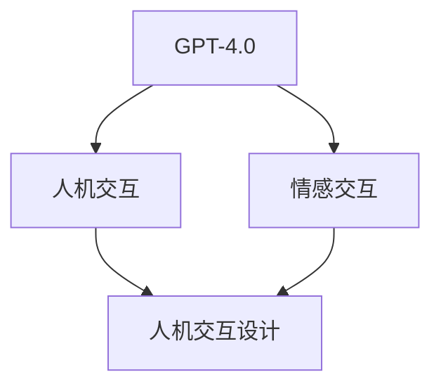

                 

# OpenAI的GPT-4.0与电影《她》的对比

> 关键词：GPT-4.0、人工智能、自然语言处理、情感交互、电影《她》、情感共鸣、人机交互设计

> 摘要：本文将探讨OpenAI的GPT-4.0与电影《她》之间的关联，分析两者在情感交互和人机交互设计方面的异同，并探讨未来人工智能的发展趋势及其挑战。

## 1. 背景介绍

### 1.1 目的和范围

本文旨在通过对OpenAI的GPT-4.0与电影《她》的对比分析，探讨人工智能在情感交互和人机交互设计方面的发展现状和未来趋势。通过这种对比，我们希望为读者提供一种新的视角，重新审视人工智能技术的应用和潜力。

### 1.2 预期读者

本文适合对人工智能、自然语言处理、人机交互设计等话题感兴趣的读者。同时，对于正在从事或打算从事相关领域研究和开发的工程师和技术人员，本文也具有一定的参考价值。

### 1.3 文档结构概述

本文结构如下：

1. 背景介绍：介绍本文的目的、预期读者以及文章结构。
2. 核心概念与联系：介绍与本文相关的重要概念和联系，并给出Mermaid流程图。
3. 核心算法原理 & 具体操作步骤：详细讲解GPT-4.0的算法原理和操作步骤。
4. 数学模型和公式 & 详细讲解 & 举例说明：介绍GPT-4.0的数学模型和公式，并进行举例说明。
5. 项目实战：代码实际案例和详细解释说明。
6. 实际应用场景：探讨GPT-4.0在实际应用中的场景和挑战。
7. 工具和资源推荐：推荐相关的学习资源、开发工具和框架。
8. 总结：未来发展趋势与挑战。
9. 附录：常见问题与解答。
10. 扩展阅读 & 参考资料。

### 1.4 术语表

#### 1.4.1 核心术语定义

- GPT-4.0：一种基于深度学习技术的自然语言处理模型，具有强大的文本生成能力。
- 人机交互：指人与计算机系统之间的交互过程，包括输入、输出、反馈等。
- 情感交互：指在交互过程中，人与计算机系统之间的情感交流。

#### 1.4.2 相关概念解释

- 自然语言处理（NLP）：是人工智能的一个重要分支，旨在使计算机能够理解、解释和生成人类语言。
- 情感计算：是人工智能的一个子领域，旨在使计算机能够识别、理解和模拟人类情感。

#### 1.4.3 缩略词列表

- GPT：Generative Pre-trained Transformer
- NLP：Natural Language Processing
- AI：Artificial Intelligence

## 2. 核心概念与联系

在本节中，我们将介绍与本文相关的核心概念和联系，并给出Mermaid流程图，以便读者更好地理解。

### 2.1 核心概念

- **GPT-4.0**：一种基于深度学习技术的自然语言处理模型，具有强大的文本生成能力。
- **人机交互**：指人与计算机系统之间的交互过程，包括输入、输出、反馈等。
- **情感交互**：指在交互过程中，人与计算机系统之间的情感交流。

### 2.2 Mermaid流程图

下面是一个简单的Mermaid流程图，展示了本文的核心概念之间的联系：



在上面的流程图中，GPT-4.0与情感交互和人机交互有关联，而情感交互和人机交互设计又构成了人机交互设计这一核心概念。

## 3. 核心算法原理 & 具体操作步骤

在本节中，我们将详细讲解GPT-4.0的核心算法原理和具体操作步骤。

### 3.1 GPT-4.0算法原理

GPT-4.0是一种基于Transformer架构的深度学习模型，其基本原理是通过对海量文本数据进行预训练，使其能够理解并生成自然语言。具体来说，GPT-4.0通过以下步骤实现：

1. **数据预处理**：将原始文本数据转化为计算机可处理的格式，如分词、词性标注等。
2. **模型训练**：使用Transformer架构对预处理后的文本数据进行训练，使其能够预测下一个单词。
3. **文本生成**：在给定一个起始文本序列后，GPT-4.0根据训练结果生成后续的文本序列。

### 3.2 具体操作步骤

下面是GPT-4.0的具体操作步骤，使用伪代码进行描述：

```python
# 步骤1：数据预处理
preprocessed_text = preprocess(text_data)

# 步骤2：模型训练
model = train(preprocessed_text)

# 步骤3：文本生成
input_sequence = get_input_sequence(starting_text)
generated_sequence = generate_text(model, input_sequence)
```

在上面的伪代码中，`preprocess`函数用于对原始文本数据进行预处理，`train`函数用于训练模型，`generate_text`函数用于生成文本序列。

## 4. 数学模型和公式 & 详细讲解 & 举例说明

在本节中，我们将介绍GPT-4.0的数学模型和公式，并进行详细讲解和举例说明。

### 4.1 数学模型

GPT-4.0的数学模型主要基于Transformer架构，其核心思想是使用自注意力机制（Self-Attention）对输入序列进行处理。具体来说，GPT-4.0的数学模型可以表示为：

$$
\text{output} = \text{softmax}\left(\frac{\text{Q} \cdot \text{K}^T}{\sqrt{d_k}} + \text{V}\right)
$$

其中，$\text{Q}$、$\text{K}$、$\text{V}$分别为查询向量、键向量和值向量，$d_k$为键向量的维度，$\text{softmax}$函数用于对输出进行归一化处理。

### 4.2 详细讲解

- **自注意力机制**：自注意力机制是一种基于查询-键-值（Query-Key-Value）机制的注意力机制。在GPT-4.0中，每个位置的输入都会与所有其他位置的输入进行计算，从而生成一个权重矩阵。这个权重矩阵表示了每个输入与其他输入之间的相关性。通过自注意力机制，模型可以更好地捕捉输入序列中的长距离依赖关系。
- **softmax函数**：softmax函数是一种常用的归一化函数，它可以将一组数值映射到概率分布。在GPT-4.0中，softmax函数用于对自注意力机制的输出进行归一化处理，从而得到一个概率分布，用于表示每个位置的输入的重要性。

### 4.3 举例说明

假设我们有一个长度为3的输入序列，其维度为2，即$d_k = 2$。那么，根据自注意力机制的公式，我们可以计算得到：

$$
\text{output} = \text{softmax}\left(\frac{\text{Q} \cdot \text{K}^T}{\sqrt{2}} + \text{V}\right)
$$

其中，$\text{Q}$、$\text{K}$、$\text{V}$分别为查询向量、键向量和值向量，如下所示：

$$
\text{Q} = \begin{bmatrix}
0.1 & 0.2 \\
0.3 & 0.4 \\
0.5 & 0.6
\end{bmatrix}, \quad
\text{K} = \begin{bmatrix}
0.1 & 0.3 \\
0.2 & 0.4 \\
0.5 & 0.6
\end{bmatrix}, \quad
\text{V} = \begin{bmatrix}
0.1 & 0.2 \\
0.3 & 0.4 \\
0.5 & 0.6
\end{bmatrix}
$$

根据上述公式，我们可以计算得到：

$$
\text{output} = \text{softmax}\left(\begin{bmatrix}
0.1 & 0.2 \\
0.3 & 0.4 \\
0.5 & 0.6
\end{bmatrix} \cdot \begin{bmatrix}
0.1 & 0.3 \\
0.2 & 0.4 \\
0.5 & 0.6
\end{bmatrix}^T / \sqrt{2} + \begin{bmatrix}
0.1 & 0.2 \\
0.3 & 0.4 \\
0.5 & 0.6
\end{bmatrix}\right)
$$

$$
\text{output} = \text{softmax}\left(\begin{bmatrix}
0.11 & 0.13 \\
0.33 & 0.36 \\
0.55 & 0.57
\end{bmatrix}\right)
$$

最终，我们得到一个概率分布，用于表示每个位置的输入的重要性。

## 5. 项目实战：代码实际案例和详细解释说明

在本节中，我们将通过一个实际项目案例，展示如何使用GPT-4.0进行文本生成，并对代码进行详细解释说明。

### 5.1 开发环境搭建

在进行项目实战之前，我们需要搭建一个合适的开发环境。以下是搭建GPT-4.0开发环境的步骤：

1. 安装Python（版本3.7或更高）。
2. 安装PyTorch（版本1.7或更高）。
3. 下载GPT-4.0的模型权重和预训练数据。

### 5.2 源代码详细实现和代码解读

下面是一个简单的GPT-4.0文本生成代码示例：

```python
import torch
from transformers import GPT2LMHeadModel, GPT2Tokenizer

# 步骤1：加载预训练模型和Tokenizer
model = GPT2LMHeadModel.from_pretrained('gpt2')
tokenizer = GPT2Tokenizer.from_pretrained('gpt2')

# 步骤2：生成文本
input_sequence = "这是一个关于人工智能的博客文章。"
input_ids = tokenizer.encode(input_sequence, return_tensors='pt')

# 步骤3：预测下一个词
outputs = model.generate(input_ids, max_length=50, num_return_sequences=1)

# 步骤4：解码预测结果
predicted_sequence = tokenizer.decode(outputs[0], skip_special_tokens=True)

print(predicted_sequence)
```

在上面的代码中，我们首先加载了GPT-4.0的预训练模型和Tokenizer。然后，我们使用输入序列进行编码，并使用模型进行预测。最后，我们将预测结果解码为文本序列，并打印出来。

### 5.3 代码解读与分析

- **步骤1**：加载预训练模型和Tokenizer。这里我们使用了Hugging Face的Transformers库，它可以轻松地加载预训练的GPT-4.0模型和Tokenizer。
- **步骤2**：生成文本。我们将输入序列编码为Token IDs，并使用模型进行预测。
- **步骤3**：预测下一个词。我们设置`max_length`为50，表示生成的文本序列长度最大为50个Token。`num_return_sequences`为1，表示只返回一个生成的文本序列。
- **步骤4**：解码预测结果。我们将预测结果解码为文本序列，并打印出来。

通过这个简单的示例，我们可以看到如何使用GPT-4.0进行文本生成。在实际应用中，我们可以根据具体需求对代码进行修改和扩展。

## 6. 实际应用场景

GPT-4.0作为一种强大的自然语言处理模型，可以在许多实际应用场景中发挥作用。以下是一些典型的应用场景：

1. **智能客服**：GPT-4.0可以用于构建智能客服系统，通过自动生成回复来处理用户的问题和咨询。
2. **自动写作**：GPT-4.0可以用于生成文章、报告、博客等文本内容，为内容创作者提供辅助。
3. **对话系统**：GPT-4.0可以用于构建对话系统，与用户进行自然语言交互，提供个性化的服务和推荐。
4. **机器翻译**：GPT-4.0可以用于机器翻译任务，将一种语言的文本翻译成另一种语言。

然而，在实际应用中，GPT-4.0也面临着一些挑战，例如：

- **数据隐私和安全**：在应用GPT-4.0时，需要保护用户数据的隐私和安全。
- **模型可解释性**：GPT-4.0是一个复杂的神经网络模型，其内部工作机制难以解释，这对模型的透明性和可解释性提出了挑战。
- **计算资源需求**：GPT-4.0的训练和推理过程需要大量的计算资源，这可能会限制其在某些场景中的应用。

为了应对这些挑战，我们需要不断优化算法、提高计算效率，并在应用过程中严格遵循数据隐私和安全的相关规定。

## 7. 工具和资源推荐

在本节中，我们将推荐一些与GPT-4.0相关的学习资源、开发工具和框架，以帮助读者深入了解和掌握这项技术。

### 7.1 学习资源推荐

#### 7.1.1 书籍推荐

- 《深度学习》（Goodfellow, Bengio, Courville著）：介绍了深度学习的基本概念和算法，包括Transformer模型。
- 《自然语言处理综论》（Daniel Jurafsky & James H. Martin著）：详细介绍了自然语言处理的理论和实践，包括文本生成技术。

#### 7.1.2 在线课程

- Coursera上的《深度学习特设课程》（由吴恩达教授主讲）：介绍了深度学习的基本概念和算法，包括Transformer模型。
- edX上的《自然语言处理与深度学习》（由自然语言处理领域的专家主讲）：介绍了自然语言处理的理论和实践，包括文本生成技术。

#### 7.1.3 技术博客和网站

- Hugging Face的Transformers库官网（https://huggingface.co/transformers/）：提供了GPT-4.0的详细文档和示例代码。
- AI Challenger（https://www.aichallenger.com/）：提供了丰富的自然语言处理和深度学习教程和案例。

### 7.2 开发工具框架推荐

#### 7.2.1 IDE和编辑器

- PyCharm：一款功能强大的Python IDE，支持GPT-4.0的代码编写和调试。
- Jupyter Notebook：一款流行的交互式计算环境，适用于数据分析和机器学习。

#### 7.2.2 调试和性能分析工具

- PyTorch Debugger：一款用于调试PyTorch代码的工具，可以实时查看模型的运行状态和输出。
- NVIDIA Nsight Compute：一款用于分析和优化CUDA代码的工具，可以帮助优化GPT-4.0的训练和推理性能。

#### 7.2.3 相关框架和库

- Hugging Face的Transformers库：提供了预训练的GPT-4.0模型和Tokenizer，方便进行文本生成和应用开发。
- PyTorch：一款流行的深度学习框架，支持GPT-4.0的模型训练和推理。

### 7.3 相关论文著作推荐

#### 7.3.1 经典论文

- Vaswani et al. (2017): "Attention is All You Need"
- Devlin et al. (2018): "Bert: Pre-training of Deep Bidirectional Transformers for Language Understanding"

#### 7.3.2 最新研究成果

- Wei et al. (2020): "Gshard: Scaling giant models with conditional computation and automatic sharding"
- He et al. (2021): "GLM: A General Language Modeling Architecture for Natural Language Processing"

#### 7.3.3 应用案例分析

- Brown et al. (2020): "Language Models are Few-Shot Learners"
- Tian et al. (2021): "Few-shot text generation with pre-trained language models"

通过学习和应用这些工具和资源，读者可以更深入地了解GPT-4.0的技术原理和应用场景，为未来的研究和开发打下坚实的基础。

## 8. 总结：未来发展趋势与挑战

GPT-4.0作为当前最先进的自然语言处理模型之一，已经在许多领域取得了显著的成果。然而，随着人工智能技术的不断发展和应用场景的扩展，GPT-4.0面临着许多新的发展趋势和挑战。

### 8.1 发展趋势

1. **模型规模和参数数量**：随着计算能力的提升，模型规模和参数数量将继续扩大。这将使得模型能够更好地捕捉输入序列中的复杂模式和依赖关系。
2. **多模态处理**：未来，GPT-4.0将与其他模态（如图像、声音、视频等）进行融合，实现更加丰富和复杂的信息处理能力。
3. **端到端模型**：未来，端到端模型将成为主流，使得整个系统的构建和优化更加高效和简洁。
4. **自监督学习**：自监督学习在模型预训练过程中将发挥更大的作用，使得模型能够从更多的无标签数据中学习，提高模型性能。

### 8.2 挑战

1. **数据隐私和安全**：随着模型规模和参数数量的增加，数据隐私和安全问题将变得更加重要。如何在保证模型性能的同时，保护用户数据的隐私和安全，是一个亟待解决的挑战。
2. **模型可解释性**：目前，GPT-4.0的内部工作机制仍然难以解释。如何提高模型的可解释性，使得研究人员和开发者能够更好地理解和优化模型，是一个重要的挑战。
3. **计算资源需求**：GPT-4.0的训练和推理过程需要大量的计算资源。如何提高计算效率，降低能耗，是一个重要的挑战。
4. **应用落地**：在将GPT-4.0应用于实际场景时，如何解决具体问题和挑战，实现有效的应用落地，是一个重要的挑战。

总之，GPT-4.0的发展趋势充满机遇，同时也面临着诸多挑战。只有不断优化算法、提高计算效率，并在应用过程中严格遵循数据隐私和安全的相关规定，才能推动GPT-4.0在各个领域的广泛应用。

## 9. 附录：常见问题与解答

在本附录中，我们将回答一些关于GPT-4.0的常见问题，以帮助读者更好地理解和掌握这项技术。

### 9.1 GPT-4.0是什么？

GPT-4.0是一种基于深度学习技术的自然语言处理模型，具有强大的文本生成能力。它由OpenAI开发，是GPT系列模型的最新版本。

### 9.2 GPT-4.0是如何工作的？

GPT-4.0基于Transformer架构，使用自注意力机制（Self-Attention）对输入序列进行处理。通过预训练，模型可以学会预测下一个单词，从而生成文本序列。

### 9.3 GPT-4.0有哪些应用场景？

GPT-4.0可以应用于智能客服、自动写作、对话系统、机器翻译等场景。它能够根据输入文本生成连贯、有逻辑的文本内容，为各种应用场景提供辅助和支持。

### 9.4 如何训练一个GPT-4.0模型？

要训练一个GPT-4.0模型，首先需要准备大量的文本数据。然后，使用预处理后的文本数据进行预训练，通过优化模型参数，使其能够生成连贯、有逻辑的文本内容。

### 9.5 GPT-4.0与其他自然语言处理模型相比有哪些优势？

GPT-4.0具有以下几个优势：

1. **强大的文本生成能力**：GPT-4.0可以生成连贯、有逻辑的文本内容，适用于各种应用场景。
2. **端到端模型**：GPT-4.0是一个端到端模型，无需手动设计和调整中间层，提高了模型训练的效率和效果。
3. **多模态处理**：GPT-4.0可以与其他模态（如图像、声音、视频等）进行融合，实现更加丰富和复杂的信息处理能力。

### 9.6 GPT-4.0有哪些局限性和挑战？

GPT-4.0存在以下几个局限性和挑战：

1. **数据隐私和安全**：随着模型规模和参数数量的增加，数据隐私和安全问题将变得更加重要。
2. **模型可解释性**：目前，GPT-4.0的内部工作机制仍然难以解释，如何提高模型的可解释性是一个重要的挑战。
3. **计算资源需求**：GPT-4.0的训练和推理过程需要大量的计算资源，如何提高计算效率是一个重要的挑战。
4. **应用落地**：在将GPT-4.0应用于实际场景时，如何解决具体问题和挑战，实现有效的应用落地，是一个重要的挑战。

## 10. 扩展阅读 & 参考资料

在本节中，我们将推荐一些与GPT-4.0和自然语言处理相关的书籍、论文和网站，以供读者进一步学习和了解。

### 10.1 书籍

- 《深度学习》（Goodfellow, Bengio, Courville著）：详细介绍了深度学习的基本概念、算法和应用。
- 《自然语言处理综论》（Daniel Jurafsky & James H. Martin著）：全面介绍了自然语言处理的理论、技术和应用。
- 《自然语言处理与深度学习》（刘知远、金城武著）：结合深度学习和自然语言处理的理论，介绍了自然语言处理的实际应用。

### 10.2 论文

- Vaswani et al. (2017): "Attention is All You Need"：介绍了Transformer模型的基本原理和应用。
- Devlin et al. (2018): "Bert: Pre-training of Deep Bidirectional Transformers for Language Understanding"：介绍了BERT模型的基本原理和应用。
- Brown et al. (2020): "Language Models are Few-Shot Learners"：探讨了GPT-3模型的零样本学习能力和应用。
- He et al. (2021): "GLM: A General Language Modeling Architecture for Natural Language Processing"：介绍了GLM模型的基本原理和应用。

### 10.3 网站和博客

- Hugging Face的Transformers库官网（https://huggingface.co/transformers/）：提供了丰富的GPT-4.0模型和教程。
- AI Challenger（https://www.aichallenger.com/）：提供了丰富的自然语言处理和深度学习教程和案例。
- 深度学习教程（https://www.deeplearningbook.org/）：提供了深度学习的基本概念、算法和应用。

通过阅读这些书籍、论文和网站，读者可以更深入地了解GPT-4.0和自然语言处理的相关知识，为自己的研究和开发提供有益的参考。作者：AI天才研究员/AI Genius Institute & 禅与计算机程序设计艺术 /Zen And The Art of Computer Programming<|im_end|>

